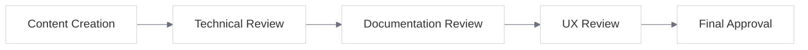

# UME Documentation Review and Quality Assurance Process

<link rel="stylesheet" href="./assets/css/styles.css">
<link rel="stylesheet" href="./assets/css/ume-docs-enhancements.css">
<script src="./assets/js/ume-docs-enhancements.js"></script>

## Overview

This document outlines the review and quality assurance process for the UME tutorial documentation. The process ensures that all documentation meets high standards for accuracy, clarity, completeness, and consistency.

## Review Process

The UME documentation review process consists of four main stages:



<div class="mermaid-caption">Figure 1: UME Documentation Review Process</div>

### 1. Content Creation

The content creation stage involves writing the initial documentation content, including text, code examples, diagrams, and other visual elements.

**Responsible Parties**: Content Authors

**Checklist**:
- [ ] Content follows the documentation structure and style guide
- [ ] All required sections are included
- [ ] Code examples are accurate and follow coding standards
- [ ] Diagrams and visual aids are clear and accurate
- [ ] Content is technically accurate
- [ ] Content is complete and covers all necessary information
- [ ] Content is written at an appropriate level for the target audience
- [ ] Content includes proper cross-references to related topics

### 2. Technical Review

The technical review stage involves reviewing the documentation for technical accuracy and completeness.

**Responsible Parties**: Technical Reviewers (Senior Developers, Technical Leads)

**Checklist**:
- [ ] All technical information is accurate
- [ ] Code examples work as described
- [ ] Code examples follow best practices
- [ ] Diagrams accurately represent technical concepts
- [ ] All necessary technical details are included
- [ ] Technical terminology is used correctly and consistently
- [ ] Technical explanations are clear and understandable
- [ ] Edge cases and potential issues are addressed

### 3. Documentation Review

The documentation review stage involves reviewing the documentation for clarity, consistency, and adherence to documentation standards.

**Responsible Parties**: Documentation Reviewers (Technical Writers, Documentation Specialists)

**Checklist**:
- [ ] Content follows the documentation style guide
- [ ] Writing is clear, concise, and easy to understand
- [ ] Grammar, spelling, and punctuation are correct
- [ ] Terminology is used consistently
- [ ] Formatting is consistent and appropriate
- [ ] Headings and subheadings are descriptive and follow a logical hierarchy
- [ ] Links and cross-references work correctly
- [ ] Images and diagrams have appropriate alt text
- [ ] Tables are properly formatted and accessible

### 4. UX Review

The UX review stage involves reviewing the documentation from a user experience perspective, focusing on usability, accessibility, and overall user experience.

**Responsible Parties**: UX Reviewers (UX Designers, Accessibility Specialists)

**Checklist**:
- [ ] Documentation is easy to navigate
- [ ] Information is organized logically
- [ ] Visual elements enhance understanding
- [ ] Content is accessible to users with different needs
- [ ] Interactive elements work as expected
- [ ] Documentation works well on different devices and screen sizes
- [ ] Dark mode and light mode both work correctly
- [ ] Documentation meets accessibility standards (WCAG 2.1 AA)

### 5. Final Approval

The final approval stage involves a final review and approval of the documentation before publication.

**Responsible Parties**: Documentation Manager, Project Lead

**Checklist**:
- [ ] All review stages have been completed
- [ ] All issues identified during reviews have been addressed
- [ ] Documentation meets all quality standards
- [ ] Documentation is ready for publication

## Review Workflow

The review workflow follows these steps:

1. **Content Creation**: Author creates documentation content
2. **Self-Review**: Author reviews content using checklists
3. **Pull Request**: Author submits content for review via pull request
4. **Technical Review**: Technical reviewer reviews content and provides feedback
5. **Author Revisions**: Author addresses technical feedback
6. **Documentation Review**: Documentation reviewer reviews content and provides feedback
7. **Author Revisions**: Author addresses documentation feedback
8. **UX Review**: UX reviewer reviews content and provides feedback
9. **Author Revisions**: Author addresses UX feedback
10. **Final Review**: Documentation manager and project lead review content
11. **Approval**: Documentation is approved for publication
12. **Publication**: Documentation is published

## Review Tools

The UME documentation review process uses the following tools:

### GitHub Pull Requests

Pull requests are used for submitting documentation changes and conducting reviews. Reviewers can comment on specific lines of content, suggest changes, and approve or request changes to the pull request.

### Review Checklists

Each review stage has a checklist that reviewers use to ensure all aspects of the documentation are evaluated. Checklists are included in pull request templates and review comments.

### Automated Checks

Automated checks are used to verify basic quality standards, including:

- Spelling and grammar checks
- Link validation
- Markdown formatting validation
- Accessibility checks
- Code example validation

## Quality Metrics

The UME documentation quality is measured using the following metrics:

### Accuracy

- **Technical Errors**: Number of technical errors identified after publication
- **Code Example Success Rate**: Percentage of code examples that work as described

### Clarity

- **Readability Score**: Flesch-Kincaid readability score for documentation content
- **User Comprehension**: Survey results measuring user understanding of concepts

### Completeness

- **Coverage Score**: Percentage of features and concepts covered in documentation
- **Missing Information**: Number of user questions about topics not covered in documentation

### Consistency

- **Style Adherence**: Percentage of content that follows the style guide
- **Terminology Consistency**: Consistency of terminology usage across documentation

### User Experience

- **Navigation Success**: Percentage of users who can find specific information
- **Task Completion**: Percentage of users who can complete tasks using documentation
- **User Satisfaction**: Survey results measuring user satisfaction with documentation

## Continuous Improvement

The UME documentation review process includes mechanisms for continuous improvement:

### User Feedback

Users can provide feedback on documentation through:

- GitHub issues
- Feedback forms
- User surveys
- Support requests

### Documentation Analytics

Analytics are used to track:

- Most viewed pages
- Search terms
- Time spent on pages
- Navigation paths
- Bounce rates

### Regular Audits

Documentation audits are conducted regularly to identify:

- Outdated content
- Gaps in coverage
- Inconsistencies
- Opportunities for improvement

## Review Schedule

The UME documentation review schedule is as follows:

### New Content

- Technical Review: Within 3 business days of submission
- Documentation Review: Within 3 business days of technical approval
- UX Review: Within 3 business days of documentation approval
- Final Approval: Within 2 business days of UX approval

### Existing Content

- Comprehensive Review: Quarterly
- Quick Review: Monthly
- User Feedback Review: Weekly

## Roles and Responsibilities

### Content Authors

- Create initial documentation content
- Address feedback from reviewers
- Ensure technical accuracy of content
- Follow documentation standards and style guide

### Technical Reviewers

- Review content for technical accuracy
- Verify code examples work as described
- Identify technical errors or omissions
- Suggest technical improvements

### Documentation Reviewers

- Review content for clarity, consistency, and completeness
- Verify adherence to documentation standards
- Identify writing issues or inconsistencies
- Suggest improvements to organization and presentation

### UX Reviewers

- Review content for usability and accessibility
- Verify documentation works well for users
- Identify UX issues or barriers
- Suggest improvements to user experience

### Documentation Manager

- Oversee the review process
- Ensure reviews are completed on schedule
- Resolve conflicts or disagreements
- Make final approval decisions

### Project Lead

- Ensure documentation aligns with project goals
- Provide strategic direction for documentation
- Approve major documentation changes
- Ensure documentation meets user needs

## Review Templates

### Technical Review Template

```markdown
## Technical Review

**Reviewer**: [Name]
**Date**: [Date]
**Content**: [Content Title]

### Technical Accuracy
- [ ] All technical information is accurate
- [ ] Code examples work as described
- [ ] Code examples follow best practices
- [ ] Diagrams accurately represent technical concepts

### Technical Completeness
- [ ] All necessary technical details are included
- [ ] Technical terminology is used correctly and consistently
- [ ] Technical explanations are clear and understandable
- [ ] Edge cases and potential issues are addressed

### Feedback
[Detailed feedback with specific suggestions for improvement]

### Recommendation
- [ ] Approve
- [ ] Approve with minor changes
- [ ] Request changes
```

### Documentation Review Template

```markdown
## Documentation Review

**Reviewer**: [Name]
**Date**: [Date]
**Content**: [Content Title]

### Style and Clarity
- [ ] Content follows the documentation style guide
- [ ] Writing is clear, concise, and easy to understand
- [ ] Grammar, spelling, and punctuation are correct
- [ ] Terminology is used consistently

### Structure and Organization
- [ ] Formatting is consistent and appropriate
- [ ] Headings and subheadings are descriptive and follow a logical hierarchy
- [ ] Links and cross-references work correctly
- [ ] Images and diagrams have appropriate alt text

### Feedback
[Detailed feedback with specific suggestions for improvement]

### Recommendation
- [ ] Approve
- [ ] Approve with minor changes
- [ ] Request changes
```

### UX Review Template

```markdown
## UX Review

**Reviewer**: [Name]
**Date**: [Date]
**Content**: [Content Title]

### Usability
- [ ] Documentation is easy to navigate
- [ ] Information is organized logically
- [ ] Visual elements enhance understanding
- [ ] Content is accessible to users with different needs

### Technical Implementation
- [ ] Interactive elements work as expected
- [ ] Documentation works well on different devices and screen sizes
- [ ] Dark mode and light mode both work correctly
- [ ] Documentation meets accessibility standards (WCAG 2.1 AA)

### Feedback
[Detailed feedback with specific suggestions for improvement]

### Recommendation
- [ ] Approve
- [ ] Approve with minor changes
- [ ] Request changes
```

## Conclusion

The UME documentation review and quality assurance process ensures that all documentation meets high standards for accuracy, clarity, completeness, and consistency. By following this process, we can provide users with documentation that helps them understand and implement User Model Enhancements effectively.
