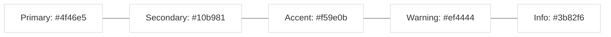
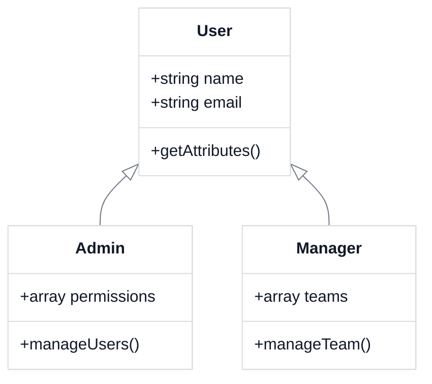
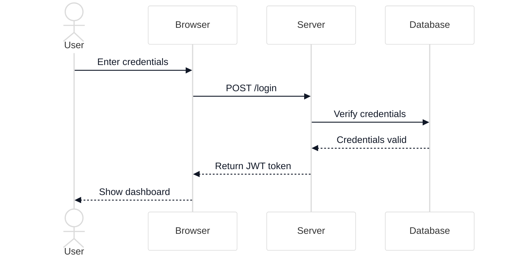
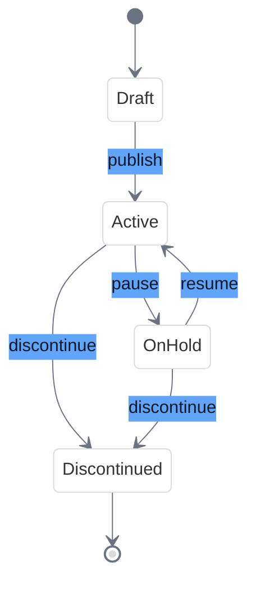
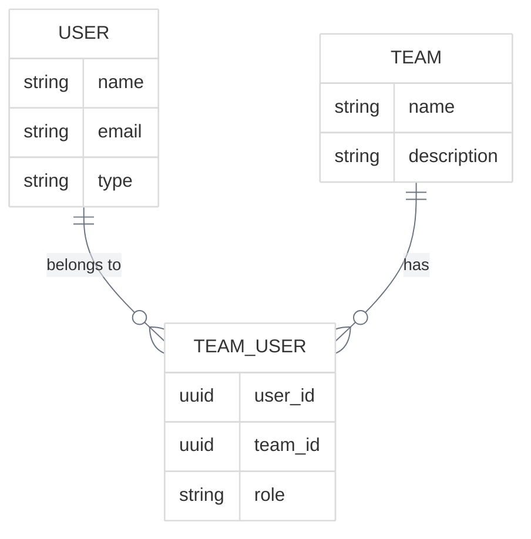
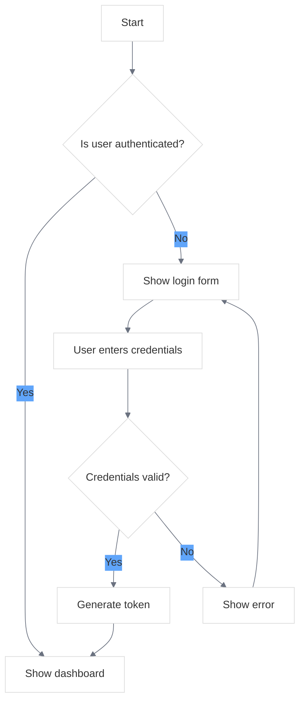
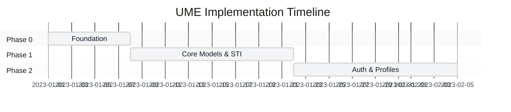
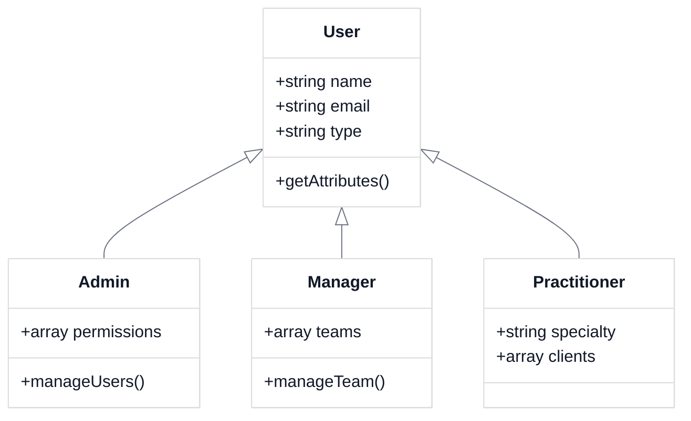

# UME Tutorial Visual Style Guide

<link rel="stylesheet" href="./assets/css/styles.css">
<link rel="stylesheet" href="./assets/css/ume-docs-enhancements.css">
<script src="./assets/js/ume-docs-enhancements.js"></script>

## Overview

This style guide establishes standards for visual elements in the UME tutorial documentation. Consistent visual elements enhance readability, improve understanding, and create a professional, cohesive experience for users.

## Color Palette

The UME documentation uses a consistent color palette that works well in both light and dark modes:

### Primary Colors



<div class="mermaid-caption">Figure 1: Primary Color Palette</div>

### Semantic Colors

- **Success**: #10b981 (Emerald)
- **Error**: #ef4444 (Red)
- **Warning**: #f59e0b (Amber)
- **Info**: #3b82f6 (Blue)
- **Neutral**: #6b7280 (Gray)

### Background Colors

- **Light Mode Background**: #ffffff (White)
- **Light Mode Surface**: #f3f4f6 (Gray 100)
- **Dark Mode Background**: #111827 (Gray 900)
- **Dark Mode Surface**: #1f2937 (Gray 800)

## Typography

### Font Families

- **Headings**: Inter, system-ui, sans-serif
- **Body Text**: Inter, system-ui, sans-serif
- **Code**: Menlo, Monaco, Consolas, "Liberation Mono", monospace

### Font Sizes

- **H1**: 2rem (32px)
- **H2**: 1.5rem (24px)
- **H3**: 1.25rem (20px)
- **H4**: 1.125rem (18px)
- **Body**: 1rem (16px)
- **Small**: 0.875rem (14px)
- **Code**: 0.9375rem (15px)

### Font Weights

- **Regular**: 400
- **Medium**: 500
- **Semibold**: 600
- **Bold**: 700

## Diagrams

### Mermaid Diagrams

All Mermaid diagrams should include these initialization parameters to ensure consistent styling and proper light/dark mode support:

```
%%{init: {'theme': 'base', 'themeVariables': {'primaryColor': '#f3f4f6', 'lineColor': '#6b7280', 'textColor': '#111827', 'mainBkg': '#ffffff', 'secondaryColor': '#60a5fa', 'tertiaryColor': '#e5e7eb'}}}%%
```

### Diagram Types and Usage Guidelines

#### Class Diagrams

Use for:
- Object-oriented structures
- Inheritance relationships
- Model hierarchies

Example:



<div class="mermaid-caption">Figure 2: Class Diagram Example</div>

#### Sequence Diagrams

Use for:
- Interactions between components
- API calls
- Event sequences

Example:



<div class="mermaid-caption">Figure 3: Sequence Diagram Example</div>

#### State Diagrams

Use for:
- State machines
- Status transitions
- Workflow processes

Example:



<div class="mermaid-caption">Figure 4: State Diagram Example</div>

#### Entity Relationship Diagrams

Use for:
- Database structures
- Model relationships
- Data architecture

Example:



<div class="mermaid-caption">Figure 5: Entity Relationship Diagram Example</div>

#### Flowcharts

Use for:
- Processes
- Algorithms
- Decision flows

Example:



<div class="mermaid-caption">Figure 6: Flowchart Example</div>

#### Gantt Charts

Use for:
- Project timelines
- Implementation phases
- Feature roadmaps

Example:



<div class="mermaid-caption">Figure 7: Gantt Chart Example</div>

### Diagram Formatting Guidelines

#### Colors

Use the following color palette for consistency:

- **Primary**: #4f46e5 (Indigo)
- **Secondary**: #10b981 (Emerald)
- **Accent**: #f59e0b (Amber)
- **Warning**: #ef4444 (Red)
- **Info**: #3b82f6 (Blue)

#### Text

- Keep text concise and clear
- Use sentence case for labels
- Use consistent terminology throughout

#### Size and Layout

- Limit diagram complexity (aim for 5-15 elements per diagram)
- Ensure diagrams are responsive
- Maintain a logical flow (typically left-to-right or top-to-bottom)

#### Accessibility

- Include descriptive captions for all diagrams
- Provide text alternatives for complex diagrams
- Ensure sufficient color contrast

### Diagram Captions

All diagrams should include a caption using the following format:

```html
<div class="mermaid-caption">Figure X: Description of the diagram</div>
```

## Code Examples

### Syntax Highlighting

Code examples should use syntax highlighting for better readability. The UME documentation uses a custom syntax highlighting theme that works well in both light and dark modes.

### Code Block Format

```php
// PHP code example
class User extends Model
{
    use HasFactory, Notifiable;

    protected $fillable = [
        'name',
        'email',
        'password',
    ];

    protected $hidden = [
        'password',
        'remember_token',
    ];

    protected $casts = [
        'email_verified_at' => 'datetime',
    ];
}
```

### Inline Code

Use inline code for variable names, class names, method names, and other code references within text. For example: The `User` class extends the `Model` class.

### Code Comments

Include comments in code examples to explain key concepts and important details. Comments should be concise and focused on explaining the "why" rather than the "what."

## UI Components

### Callouts

Use callouts to highlight important information, warnings, tips, and notes.

#### Info Callout

```html
<div class="callout callout-info">
    <h4>Info</h4>
    <p>This is an informational callout that provides additional context or background information.</p>
</div>
```

<div class="callout callout-info">
    <h4>Info</h4>
    <p>This is an informational callout that provides additional context or background information.</p>
</div>

#### Warning Callout

```html
<div class="callout callout-warning">
    <h4>Warning</h4>
    <p>This is a warning callout that alerts users to potential issues or pitfalls.</p>
</div>
```

<div class="callout callout-warning">
    <h4>Warning</h4>
    <p>This is a warning callout that alerts users to potential issues or pitfalls.</p>
</div>

#### Tip Callout

```html
<div class="callout callout-tip">
    <h4>Tip</h4>
    <p>This is a tip callout that provides helpful suggestions or best practices.</p>
</div>
```

<div class="callout callout-tip">
    <h4>Tip</h4>
    <p>This is a tip callout that provides helpful suggestions or best practices.</p>
</div>

#### Note Callout

```html
<div class="callout callout-note">
    <h4>Note</h4>
    <p>This is a note callout that provides additional information or clarification.</p>
</div>
```

<div class="callout callout-note">
    <h4>Note</h4>
    <p>This is a note callout that provides additional information or clarification.</p>
</div>

### Tables

Use tables to present structured data or comparisons.

#### Standard Table

```html
<table>
    <thead>
        <tr>
            <th>Feature</th>
            <th>Description</th>
            <th>Example</th>
        </tr>
    </thead>
    <tbody>
        <tr>
            <td>Single Table Inheritance</td>
            <td>Store different model types in a single table</td>
            <td><code>User</code>, <code>Admin</code>, <code>Manager</code></td>
        </tr>
        <tr>
            <td>User Tracking</td>
            <td>Track who created, updated, and deleted records</td>
            <td><code>created_by</code>, <code>updated_by</code>, <code>deleted_by</code></td>
        </tr>
    </tbody>
</table>
```

<table>
    <thead>
        <tr>
            <th>Feature</th>
            <th>Description</th>
            <th>Example</th>
        </tr>
    </thead>
    <tbody>
        <tr>
            <td>Single Table Inheritance</td>
            <td>Store different model types in a single table</td>
            <td><code>User</code>, <code>Admin</code>, <code>Manager</code></td>
        </tr>
        <tr>
            <td>User Tracking</td>
            <td>Track who created, updated, and deleted records</td>
            <td><code>created_by</code>, <code>updated_by</code>, <code>deleted_by</code></td>
        </tr>
    </tbody>
</table>

### Tabs

Use tabs to organize related content and reduce vertical space.

```html
<div class="tabs">
    <div class="tab-header">
        <button class="tab-button active" data-tab="tab1">PHP 8 Attributes</button>
        <button class="tab-button" data-tab="tab2">PHPDoc Annotations</button>
    </div>
    <div class="tab-content">
        <div class="tab-pane active" id="tab1">
            <p>Content for PHP 8 Attributes tab</p>
            <pre><code class="language-php">#[HasUlid]
class User extends Model
{
    // ...
}</code></pre>
        </div>
        <div class="tab-pane" id="tab2">
            <p>Content for PHPDoc Annotations tab</p>
            <pre><code class="language-php">/**
 * @HasUlid
 */
class User extends Model
{
    // ...
}</code></pre>
        </div>
    </div>
</div>
```

### Accordions

Use accordions to hide detailed information that not all users may need.

```html
<div class="accordion">
    <div class="accordion-item">
        <button class="accordion-header">Advanced Configuration Options</button>
        <div class="accordion-content">
            <p>Detailed information about advanced configuration options...</p>
        </div>
    </div>
</div>
```

## Images and Screenshots

### Image Format

- Use PNG format for screenshots and diagrams
- Use SVG when possible for icons and simple graphics
- Optimize images for web (compress without losing quality)

### Image Size

- Maximum width: 800px
- Maintain aspect ratio
- Use responsive images that scale with the viewport

### Image Captions

Include captions for all images using the following format:

```html
<div class="image-caption">Figure X: Description of the image</div>
```

### Screenshots

- Crop screenshots to focus on relevant content
- Use consistent resolution and scaling
- Include browser chrome only when relevant
- Highlight important elements with annotations

## Icons

### Icon Usage

- Use icons sparingly and consistently
- Ensure icons have clear meaning and purpose
- Include text labels with icons when possible
- Use SVG format for icons

### Icon Sizes

- Small: 16px × 16px
- Medium: 24px × 24px
- Large: 32px × 32px

### Icon Colors

- Use the same color palette as the rest of the documentation
- Ensure sufficient contrast with the background
- Use color to convey meaning (e.g., red for warning, green for success)

## Accessibility

### Color Contrast

- Ensure sufficient color contrast (minimum 4.5:1 for normal text)
- Do not rely on color alone to convey meaning
- Test color combinations in both light and dark modes

### Alternative Text

- Provide alt text for all images
- Make alt text descriptive and meaningful
- Include detailed descriptions for complex diagrams

### Keyboard Navigation

- Ensure all interactive elements are keyboard accessible
- Use proper focus styles for interactive elements
- Maintain a logical tab order

### Screen Readers

- Use semantic HTML elements
- Include ARIA attributes where appropriate
- Test with screen readers to ensure compatibility

## Dark Mode Support

The UME documentation supports both light and dark modes through CSS variables and JavaScript. The theme will automatically adjust based on the user's system preferences, but users can also manually toggle between modes.

### Dark Mode Implementation

Dark mode is implemented through CSS variables that are updated based on the user's preference:

```css
:root {
    --background-color: #ffffff;
    --text-color: #111827;
    --code-background: #f3f4f6;
    --border-color: #e5e7eb;
    --heading-color: #111827;
    --link-color: #4f46e5;
    --link-hover-color: #4338ca;
}

@media (prefers-color-scheme: dark) {
    :root {
        --background-color: #111827;
        --text-color: #f3f4f6;
        --code-background: #1f2937;
        --border-color: #374151;
        --heading-color: #f3f4f6;
        --link-color: #818cf8;
        --link-hover-color: #a5b4fc;
    }
}
```

### Manual Theme Toggle

Users can manually toggle between light and dark modes using the theme toggle button in the navigation bar.

## Implementation in CSS

These visual styles are implemented in the following CSS files:

- `assets/css/styles.css`: Base styles for the documentation
- `assets/css/ume-docs-enhancements.css`: Enhanced styles for visual elements

## JavaScript Enhancements

The UME documentation includes JavaScript enhancements to improve the user experience:

- `assets/js/ume-docs-enhancements.js`: Core functionality for tabs, accordions, and theme toggling
- `assets/js/mermaid-init.js`: Initialization for Mermaid diagrams with proper theme support

## Example Usage

Here's an example of how to combine these visual elements in a documentation page:

```markdown
# Single Table Inheritance

<link rel="stylesheet" href="../../assets/css/styles.css">
<link rel="stylesheet" href="../../assets/css/ume-docs-enhancements.css">
<script src="../../assets/js/ume-docs-enhancements.js"></script>

## Overview

Single Table Inheritance (STI) is a pattern that allows you to store different model types in a single database table while maintaining type-specific behavior through inheritance.

<div class="callout callout-info">
    <h4>Info</h4>
    <p>This pattern is particularly useful when you have different types of users (e.g., Admin, Manager, Practitioner) who share many common attributes but also have type-specific attributes and behaviors.</p>
</div>

## Class Hierarchy

The following diagram shows the class hierarchy for the User model with Single Table Inheritance:



<div class="mermaid-caption">Figure 1: User Model Class Hierarchy</div>

## Implementation

<div class="tabs">
    <div class="tab-header">
        <button class="tab-button active" data-tab="tab1">PHP 8 Attributes</button>
        <button class="tab-button" data-tab="tab2">PHPDoc Annotations</button>
    </div>
    <div class="tab-content">
        <div class="tab-pane active" id="tab1">
            <p>Using PHP 8 Attributes:</p>
            <pre><code class="language-php">#[HasUlid]
class User extends Model
{
    // ...
}</code></pre>
        </div>
        <div class="tab-pane" id="tab2">
            <p>Using PHPDoc Annotations:</p>
            <pre><code class="language-php">/**
 * @HasUlid
 */
class User extends Model
{
    // ...
}</code></pre>
        </div>
    </div>
</div>

<div class="accordion">
    <div class="accordion-item">
        <button class="accordion-header">Advanced Configuration Options</button>
        <div class="accordion-content">
            <p>Detailed information about advanced configuration options...</p>
        </div>
    </div>
</div>
```
