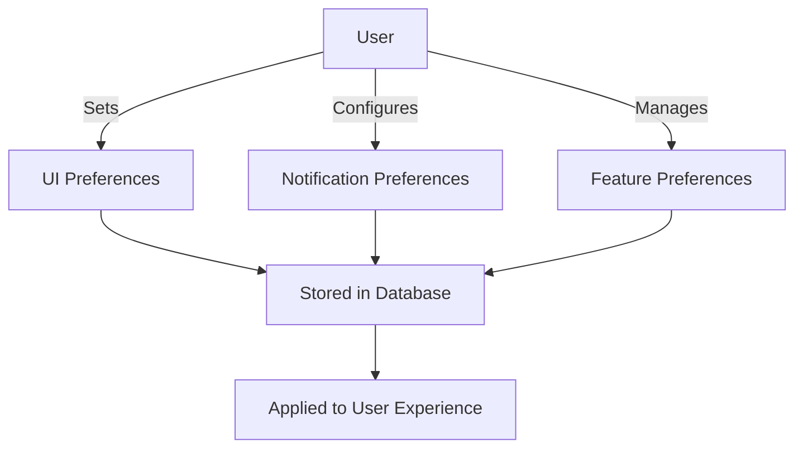
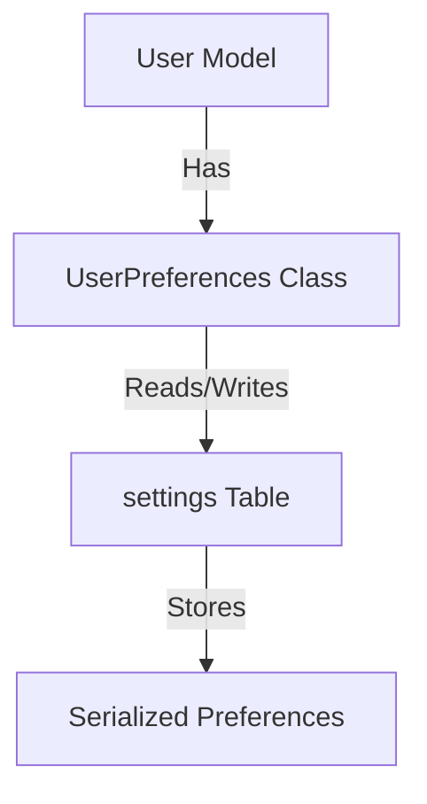

# Implementation Example: User Preferences System

<link rel="stylesheet" href="../assets/css/styles.css">

This appendix provides a detailed example of implementing a User Preferences System as an enhancement to the User Model. We'll walk through the entire process from initial requirements to MVP implementation.

## 1. Product Requirements Document (PRD)

### 1.1 Overview

The User Preferences System will allow users to customize their experience within the application by setting and managing preferences. These preferences will affect UI appearance, notification behavior, and feature availability.

### 1.2 Goals

- Provide users with control over their application experience
- Enable personalization of the user interface
- Allow customization of notification delivery
- Support feature opt-in/opt-out where appropriate
- Store preferences efficiently and securely

### 1.3 User Stories



1. As a user, I want to set my preferred theme (light/dark/system) so that the application appearance matches my visual preference.
2. As a user, I want to set my preferred language so that I can use the application in my native language.
3. As a user, I want to configure which notifications I receive and how (email, in-app, SMS) so that I'm not overwhelmed with information.
4. As a user, I want to opt in or out of beta features so that I can try new functionality early if desired.
5. As a user, I want my preferences to persist across sessions and devices so that my experience is consistent.
6. As a user, I want to reset my preferences to default values if needed.

### 1.4 Technical Requirements

- Preferences must be stored efficiently in the database
- Changes to preferences should take effect immediately
- Preferences should be cached for performance
- The system should be extensible to add new preference types in the future
- Default values should be provided for all preferences
- The UI for managing preferences should be intuitive and accessible

## 2. Implementation Plan

### 2.1 Database Structure

We'll use the `spatie/laravel-settings` package to manage user preferences. This package provides a clean way to store settings in the database and access them through typed PHP classes.



### 2.2 Implementation Steps

1. Install and configure the `spatie/laravel-settings` package
2. Create a `UserPreferences` settings class
3. Define default preferences
4. Create migrations for the settings table
5. Implement the preferences UI using Livewire/Volt
6. Add preference-based logic to the application
7. Implement caching for performance
8. Write tests for the preferences system

### 2.3 Timeline

- Research and planning: 1 day
- Database setup and backend implementation: 2 days
- UI implementation: 2 days
- Testing and refinement: 1 day
- Documentation: 1 day
- Total: 7 days

## 3. MVP Implementation

### 3.1 Install Required Packages

```bash
composer require spatie/100-laravel-settings
php artisan vendor:publish --provider="Spatie\LaravelSettings\LaravelSettingsServiceProvider"
php artisan migrate
```

### 3.2 Create User Preferences Settings Class

```php
<?php

namespace App\Settings;

use Spatie\LaravelSettings\Settings;

class UserPreferences extends Settings
{
    public string $theme;
    public string $language;
    public array $notificationChannels;
    public array $enabledBetaFeatures;
    
    public static function group(): string
    {
        return 'user';
    }
    
    public static function encrypted(): array
    {
        return [];
    }
    
    public static function default(): array
    {
        return [
            'theme' => 'system',
            'language' => 'en',
            'notificationChannels' => [
                'account' => ['email', 'database'],
                'team' => ['email', 'database'],
                'system' => ['email', 'database'],
            ],
            'enabledBetaFeatures' => [],
        ];
    }
}
```

### 3.3 Create Migration for User Preferences

```php
<?php

use Illuminate\Database\Migrations\Migration;
use Illuminate\Database\Schema\Blueprint;
use Illuminate\Support\Facades\Schema;
use Spatie\LaravelSettings\Migrations\SettingsMigration;

class CreateUserPreferencesSettings extends SettingsMigration
{
    public function up(): void
    {
        $this->migrator->add('user.theme', 'system');
        $this->migrator->add('user.language', 'en');
        $this->migrator->add('user.notificationChannels', [
            'account' => ['email', 'database'],
            'team' => ['email', 'database'],
            'system' => ['email', 'database'],
        ]);
        $this->migrator->add('user.enabledBetaFeatures', []);
    }
    
    public function down(): void
    {
        $this->migrator->delete('user.theme');
        $this->migrator->delete('user.language');
        $this->migrator->delete('user.notificationChannels');
        $this->migrator->delete('user.enabledBetaFeatures');
    }
}
```

### 3.4 Create User Preferences Service

```php
<?php

namespace App\Services;

use App\Models\User;
use App\Settings\UserPreferences;
use Illuminate\Support\Facades\Cache;

class UserPreferencesService
{
    public function getPreferences(User $user): UserPreferences
    {
        return Cache::remember("user_preferences_{$user->id}", 3600, function () use ($user) {
            return UserPreferences::for($user->id);
        });
    }
    
    public function updatePreferences(User $user, array $preferences): UserPreferences
    {
        $userPreferences = $this->getPreferences($user);
        
        foreach ($preferences as $key => $value) {
            if (property_exists($userPreferences, $key)) {
                $userPreferences->$key = $value;
            }
        }
        
        $userPreferences->save();
        
        // Clear cache
        Cache::forget("user_preferences_{$user->id}");
        
        return $userPreferences;
    }
    
    public function resetPreferences(User $user): UserPreferences
    {
        $userPreferences = $this->getPreferences($user);
        $defaults = UserPreferences::default();
        
        foreach ($defaults as $key => $value) {
            $userPreferences->$key = $value;
        }
        
        $userPreferences->save();
        
        // Clear cache
        Cache::forget("user_preferences_{$user->id}");
        
        return $userPreferences;
    }
}
```
