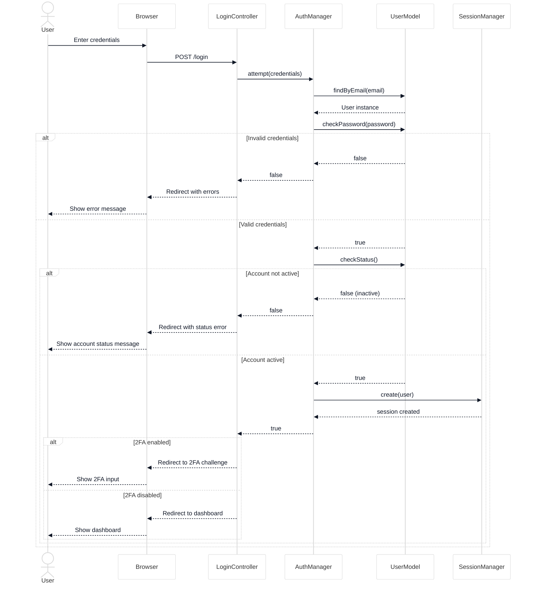
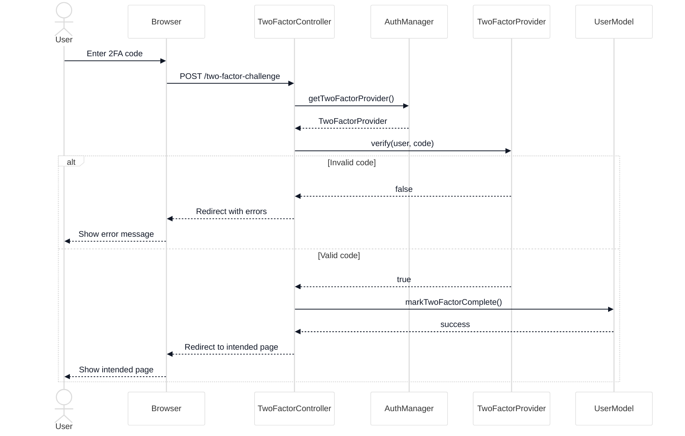
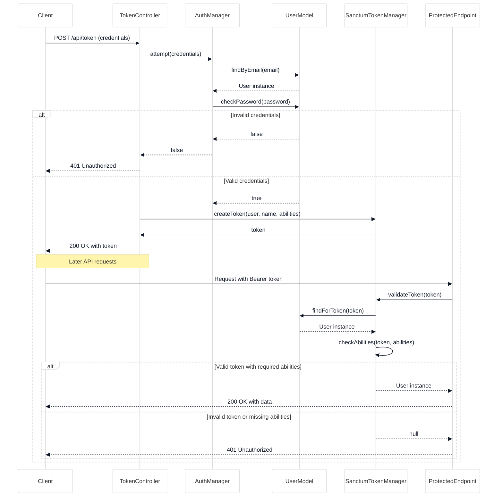
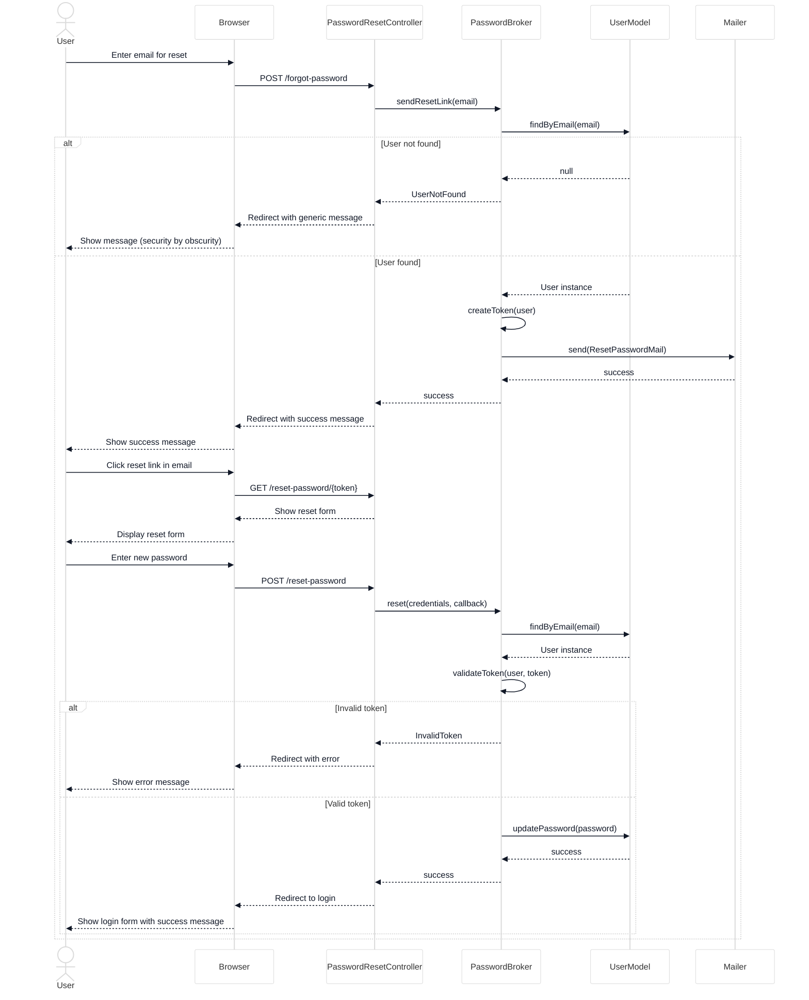
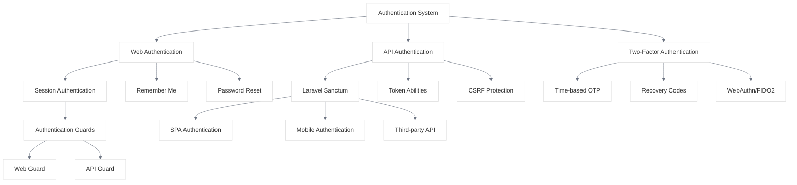

# Authentication Flow

<link rel="stylesheet" href="../css/styles.css">
<link rel="stylesheet" href="../css/ume-docs-enhancements.css">

## Overview

This visual aid illustrates the authentication flow in the UME system, including standard login, two-factor authentication, and API token authentication with Laravel Sanctum.

## Standard Authentication Flow

The following sequence diagram shows the standard authentication flow for web-based login:

Figure 1: Standard Authentication Flow

## Two-Factor Authentication Flow

The following sequence diagram shows the two-factor authentication flow:

Figure 2: Two-Factor Authentication Flow

## API Token Authentication Flow

The following sequence diagram shows the API token authentication flow using Laravel Sanctum:

Figure 3: API Token Authentication Flow

## Password Reset Flow

The following sequence diagram shows the password reset flow:

Figure 4: Password Reset Flow

## Authentication Components

The UME system uses several components to implement authentication:

Figure 5: Authentication Components

## Related Resources

- [Authentication Implementation](../../050-implementation/030-phase2-auth-profile/010-authentication.md)
- [Two-Factor Authentication](../../050-implementation/030-phase2-auth-profile/020-two-factor-auth.md)
- [API Authentication](../../050-implementation/030-phase2-auth-profile/030-api-authentication.md)
- [Laravel Authentication Documentation](https://laravel.com/docs/authentication)
- [Laravel Sanctum Documentation](https://laravel.com/docs/sanctum)
- [Diagram Style Guide](./diagram-style-guide.md)
