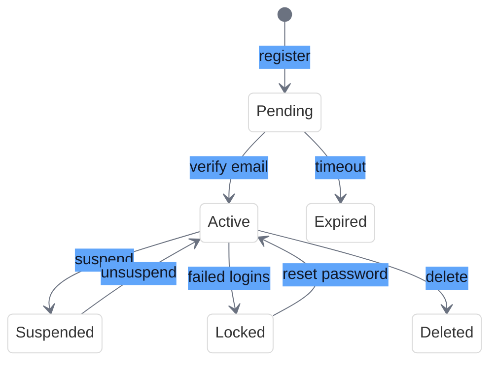
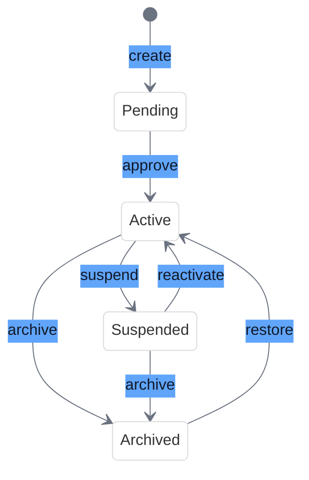
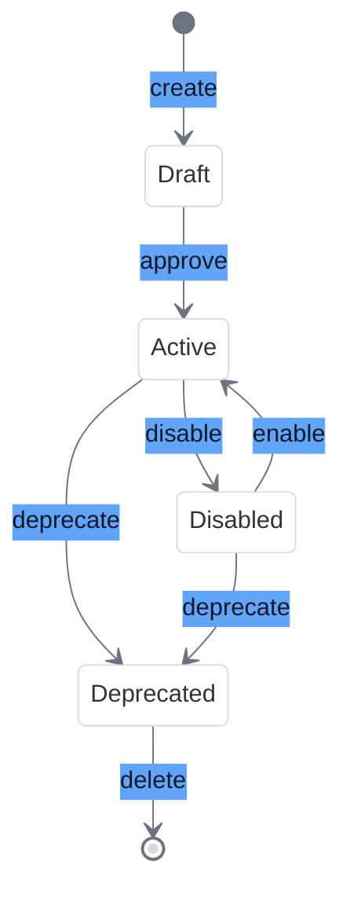

# State Machines Quick Reference

<link rel="stylesheet" href="../../css/styles.css">
<link rel="stylesheet" href="../../css/ume-docs-enhancements.css">
<script src="../../js/ume-docs-enhancements.js"></script>

## Overview

State machines are a design pattern that defines a finite set of states an object can be in, along with the possible transitions between those states. In the UME system, state machines are used to manage the lifecycle of various entities such as user accounts, teams, permissions, and roles.

## Key Concepts

| Concept | Description |
|---------|-------------|
| **State** | A specific condition or mode that an object can exist in at a given time |
| **Transition** | A change from one state to another |
| **Guard** | A condition that must be met for a transition to occur |
| **Side Effect** | An action that occurs as a result of a transition |
| **Initial State** | The state an object starts in when first created |
| **Terminal State** | A state from which no further transitions are possible |

## Implementation with Spatie Laravel Model States

The UME system uses the `spatie/laravel-model-states` package to implement state machines.

### Basic Setup

```php
// 1. Create a base state class
abstract class UserState extends State
{
    abstract public function color(): string;
    abstract public function label(): string;
}

// 2. Create concrete state classes
class Active extends UserState
{
    public function color(): string
    {
        return 'green';
    }
    
    public function label(): string
    {
        return 'Active';
    }
}

// 3. Configure the state machine in your model
class User extends Model
{
    use HasStates;
    
    protected function registerStates(): void
    {
        $this->addState('status', UserState::class)
            ->allowTransition(Pending::class, Active::class)
            ->allowTransition(Active::class, Suspended::class)
            ->allowTransition(Suspended::class, Active::class);
    }
}
```

### Defining Transitions

```php
// Simple transition
$user->status->transitionTo(Active::class);

// Transition with a dedicated class
class PendingToActiveTransition extends Transition
{
    public function handle(): User
    {
        // Perform additional logic
        $this->user->email_verified_at = now();
        $this->user->save();
        
        return $this->user;
    }
}

// Register the transition class
$this->addState('status', UserState::class)
    ->allowTransition(Pending::class, Active::class, PendingToActiveTransition::class);
```

### Querying by State

```php
// Find users in a specific state
$activeUsers = User::whereState('status', Active::class)->get();

// Check if a user is in a specific state
if ($user->status instanceof Active) {
    // User is active
}

// Or using the is() method
if ($user->status->is(Active::class)) {
    // User is active
}
```

## Common State Machine Patterns

### User Account States



### Team States



### Permission/Role States



## Best Practices

1. **Define Clear States**: Each state should represent a distinct condition with clear meaning
2. **Limit the Number of States**: Keep the state machine manageable (typically 4-8 states)
3. **Enforce Valid Transitions**: Only allow transitions that make logical sense
4. **Encapsulate State-Specific Behavior**: Each state should encapsulate its own behavior
5. **Use Guards for Conditional Transitions**: Add conditions that must be met for transitions
6. **Add Side Effects to Transitions**: Perform necessary actions during state changes
7. **Document the State Machine**: Create visual diagrams of your state machines

## Common Pitfalls

1. **Too Many States**: Creating too many states makes the state machine complex and hard to understand
2. **Missing Transitions**: Forgetting to define all necessary transitions can lead to "stuck" objects
3. **Circular Transitions**: Creating circular transitions without exit conditions
4. **Ignoring Side Effects**: Not handling important side effects during transitions
5. **Not Using Guards**: Allowing transitions that should be conditional

## Code Examples

### State with Custom Methods

```php
class Active extends UserState
{
    public function canAccessDashboard(): bool
    {
        return true;
    }
    
    public function canInviteUsers(): bool
    {
        return true;
    }
}

// Usage
if ($user->status->canAccessDashboard()) {
    // Allow access
}
```

### Transition with Validation

```php
class PendingToActiveTransition extends Transition
{
    public function handle(): User
    {
        if (is_null($this->user->email_verified_at)) {
            throw new InvalidTransitionException('Email must be verified');
        }
        
        return $this->user;
    }
}
```

### State History Tracking

```php
// Add the HasStateHistory trait to your model
use Spatie\ModelStates\HasStates;
use Spatie\ModelStates\HasStateHistory;

class User extends Model
{
    use HasStates, HasStateHistory;
    
    // ...
}

// Query state history
$history = $user->statusHistory()->get();

// Get the previous state
$previousState = $user->statusHistory()->latest()->first();
```

## Related Resources

- [State Machine Implementation](../../../050-implementation/030-phase2-auth-profile/030-state-machines.md)
- [User Account State Machine](../080-user-account-state-machine.md)
- [Team Hierarchy State Machine](../../../050-implementation/040-phase3-teams-permissions/120-team-hierarchy-state-machine.md)
- [Permission/Role State Machine](../../../050-implementation/040-phase3-teams-permissions/020-permission-role-state-machine.md)
- [Spatie Laravel Model States Documentation](https://spatie.be/docs/laravel-model-states/v2/introduction)
- [State Pattern on Refactoring Guru](https://refactoring.guru/design-patterns/state)
