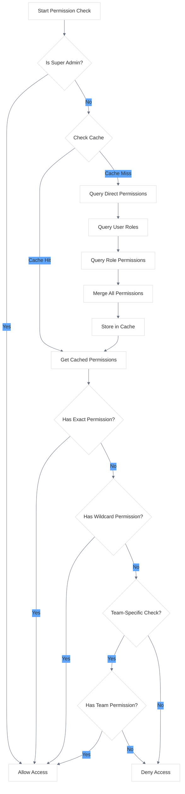

# Team Permissions Quick Reference

<link rel="stylesheet" href="../../css/styles.css">
<link rel="stylesheet" href="../../css/ume-docs-enhancements.css">
<script src="../../js/ume-docs-enhancements.js"></script>

## Overview

Team permissions in the UME system provide a way to manage access control within team-based organizations. This quick reference guide covers the essential concepts and implementation details for working with team permissions.

## Key Concepts

| Concept | Description |
|---------|-------------|
| **Permission** | A specific action that can be allowed or denied |
| **Role** | A collection of permissions assigned to users |
| **Team** | A group of users that share common permissions |
| **Team Hierarchy** | A structure where teams can have parent-child relationships |
| **Permission Inheritance** | When permissions from parent teams cascade to child teams |
| **Direct Permission** | A permission assigned directly to a user |
| **Role-Based Permission** | A permission granted via a role assigned to a user |

## Implementation with Spatie Laravel Permission

The UME system extends the `spatie/laravel-permission` package to support team-based permissions.

### Basic Setup

```php
// 1. Configure the teams relationship in your User model
class User extends Authenticatable
{
    use HasRoles;
    
    public function teams()
    {
        return $this->belongsToMany(Team::class, 'team_user')
            ->withPivot('role')
            ->withTimestamps();
    }
}

// 2. Configure the users relationship in your Team model
class Team extends Model
{
    public function users()
    {
        return $this->belongsToMany(User::class, 'team_user')
            ->withPivot('role')
            ->withTimestamps();
    }
}

// 3. Create a TeamPermission model
class TeamPermission extends Permission
{
    protected $table = 'team_permissions';
    
    public function teams()
    {
        return $this->belongsToMany(Team::class, 'team_permission');
    }
}
```

### Checking Permissions

```php
// Check if a user has a permission in a specific team
if ($user->hasTeamPermission($team, 'edit-posts')) {
    // User can edit posts in this team
}

// Check if a user has a permission in any team
if ($user->hasPermissionInAnyTeam('edit-posts')) {
    // User can edit posts in at least one team
}

// Check if a user has a permission in all teams
if ($user->hasPermissionInAllTeams('view-dashboard')) {
    // User can view dashboard in all teams
}

// Check if a user has a direct permission (not through a role)
if ($user->hasDirectPermission('manage-users')) {
    // User has direct permission to manage users
}
```

### Assigning Permissions

```php
// Assign a permission to a team
$team->givePermissionTo('edit-posts');

// Assign multiple permissions to a team
$team->givePermissionTo(['edit-posts', 'delete-posts']);

// Assign a permission to a user in a specific team
$user->giveTeamPermissionTo($team, 'edit-posts');

// Assign a role to a user in a specific team
$user->assignTeamRole($team, 'editor');
```

## Permission Hierarchy Flow



## Common Permission Patterns

### Team Hierarchy Permissions

```php
// Parent team with child teams
$parentTeam->children()->attach($childTeam->id);

// Check if a user has a permission in a team or any parent team
if ($user->hasTeamPermissionThroughHierarchy($team, 'edit-posts')) {
    // User can edit posts in this team or a parent team
}

// Get all permissions a user has in a team, including from parent teams
$permissions = $user->getAllTeamPermissions($team);
```

### Wildcard Permissions

```php
// Assign a wildcard permission
$team->givePermissionTo('posts.*');

// Check if a user has a specific permission that matches a wildcard
if ($user->hasTeamPermission($team, 'posts.edit')) {
    // This will return true if the user has 'posts.*'
}
```

### Permission Caching

```php
// Cache user permissions for better performance
$permissions = Cache::remember('user:'.$user->id.':team:'.$team->id.':permissions', 3600, function () use ($user, $team) {
    return $user->getAllTeamPermissions($team);
});

// Clear permission cache when permissions change
Cache::forget('user:'.$user->id.':team:'.$team->id.':permissions');
```

## Best Practices

1. **Use Roles for Common Permission Sets**: Group related permissions into roles
2. **Implement Permission Caching**: Cache permission checks for better performance
3. **Use Middleware for Route Protection**: Apply permission checks at the route level
4. **Implement UI-Based Permission Management**: Create interfaces for managing permissions
5. **Audit Permission Changes**: Log when permissions are granted or revoked
6. **Use Policy Classes**: Implement Laravel policies for complex permission logic
7. **Consider Team Hierarchy**: Design permissions with team hierarchy in mind

## Common Pitfalls

1. **Overusing Direct Permissions**: Assigning too many direct permissions instead of using roles
2. **Ignoring Permission Inheritance**: Not considering how permissions flow through team hierarchies
3. **Missing Cache Invalidation**: Forgetting to clear permission caches when permissions change
4. **Insufficient Permission Granularity**: Creating permissions that are too broad or too narrow
5. **Not Using Database Transactions**: Failing to use transactions when modifying permissions

## Code Examples

### Middleware for Team Permissions

```php
class TeamPermission
{
    public function handle($request, Closure $next, $permission)
    {
        $team = $request->route('team');
        
        if (!$request->user()->hasTeamPermission($team, $permission)) {
            abort(403, 'Unauthorized action.');
        }
        
        return $next($request);
    }
}

// Usage in routes
Route::get('/teams/{team}/posts', [PostController::class, 'index'])
    ->middleware(['auth', 'team.permission:view-posts']);
```

### Blade Directives

```php
// Check if a user has a team permission
@teamCan('edit-posts', $team)
    <a href="{{ route('posts.edit', $post) }}">Edit Post</a>
@endteamCan

// Check if a user has a team role
@teamHasRole('editor', $team)
    <div class="editor-tools">
        <!-- Editor tools here -->
    </div>
@endteamHasRole
```

### Permission Seeder

```php
class PermissionSeeder extends Seeder
{
    public function run()
    {
        // Create permissions
        $permissions = [
            'view-dashboard',
            'manage-users',
            'edit-posts',
            'delete-posts',
            'publish-posts',
        ];
        
        foreach ($permissions as $permission) {
            Permission::create(['name' => $permission]);
        }
        
        // Create roles with permissions
        $editorRole = Role::create(['name' => 'editor']);
        $editorRole->givePermissionTo(['edit-posts', 'view-dashboard']);
        
        $adminRole = Role::create(['name' => 'admin']);
        $adminRole->givePermissionTo(Permission::all());
    }
}
```

## Related Resources

- [Team Permissions Implementation](../../../050-implementation/040-phase3-teams-permissions/060-team-permissions.md)
- [Permission Check Flow](../050-permission-check-flow.md)
- [Role-Based Access Control](../../../050-implementation/040-phase3-teams-permissions/050-role-based-access.md)
- [Team Hierarchy](../../../050-implementation/040-phase3-teams-permissions/070-team-hierarchy.md)
- [Spatie Laravel Permission Documentation](https://spatie.be/docs/laravel-permission)
