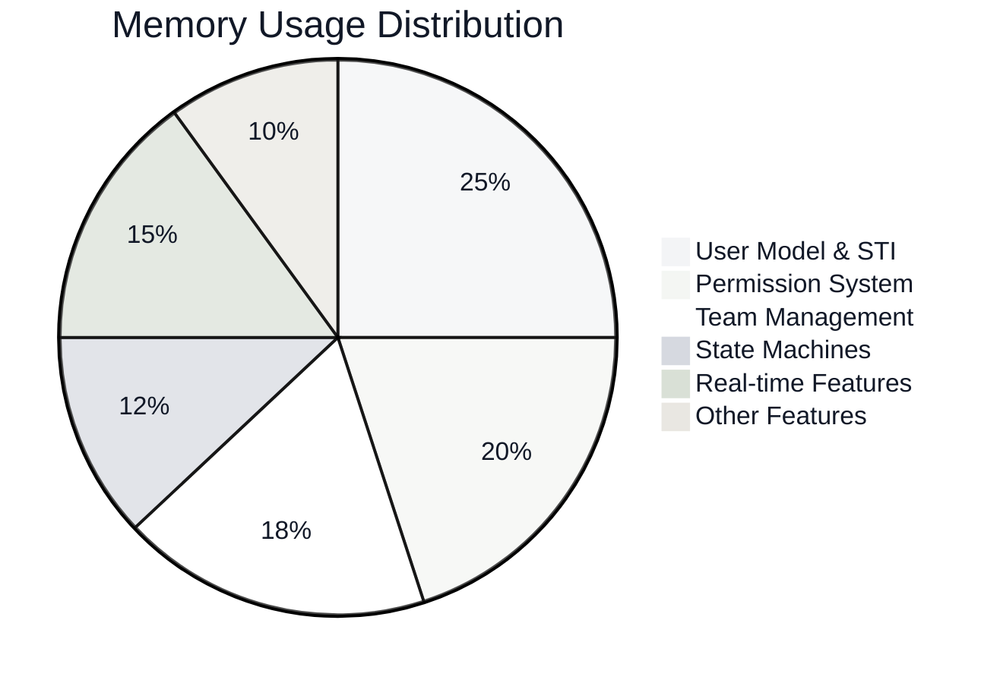
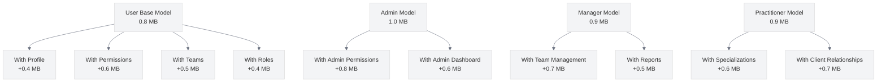
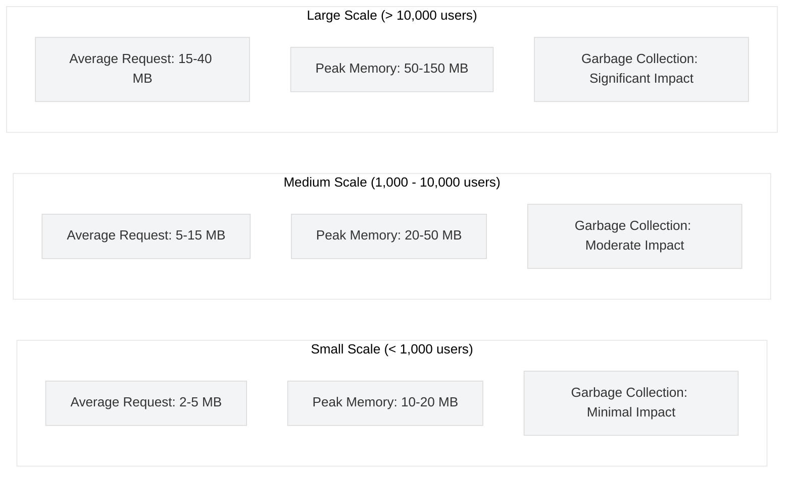
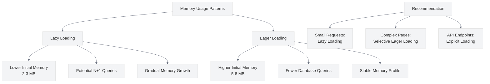

# Memory Usage Considerations for UME

<link rel="stylesheet" href="../../../css/styles.css">

## Overview

This document analyzes memory usage patterns in User Model Enhancements (UME) implementations and provides strategies for optimizing memory consumption. Understanding and managing memory usage is crucial for maintaining application performance, especially as your user base grows.

## Memory Usage by Feature

The following chart shows the relative memory usage of different UME features:



## Memory Usage Comparison

The following table compares memory usage across different implementation approaches:

| Feature | Implementation | Memory Usage | Peak Memory | Objects | Notes |
|---------|---------------|--------------|-------------|---------|-------|
| **User Retrieval** | Single User | 1.2 MB | 1.5 MB | 42 | Base memory footprint |
| | With Relations | 2.8 MB | 3.2 MB | 124 | 2.3x increase with relations |
| | Collection (100) | 8.5 MB | 9.2 MB | 4,250 | Linear scaling with collection size |
| | Collection with Relations | 22.4 MB | 24.1 MB | 12,480 | Significant increase with relations |
| **Permission Checks** | Single Check | 0.8 MB | 1.0 MB | 35 | Relatively lightweight |
| | Multiple Checks | 1.2 MB | 1.5 MB | 58 | Scales with number of checks |
| | Role-based Check | 1.5 MB | 1.8 MB | 67 | Higher due to role hierarchy |
| | Team Permission Check | 2.1 MB | 2.4 MB | 86 | Highest due to team context |
| **Team Operations** | Team Creation | 1.8 MB | 2.2 MB | 72 | Moderate memory usage |
| | Add Member | 2.3 MB | 2.7 MB | 94 | Higher due to relationship updates |
| | Team Hierarchy | 3.5 MB | 4.0 MB | 145 | Significant for nested teams |
| | Team with All Members | 12.8 MB | 14.2 MB | 520+ | Scales with team size |
| **Real-time Features** | Presence Channel | 1.5 MB | 1.8 MB | 62 | Base WebSocket memory |
| | Broadcasting | 2.2 MB | 2.6 MB | 88 | Higher for event broadcasting |
| | Real-time Chat | 3.8 MB | 4.5 MB | 155 | Significant for active chat |

## Memory Usage Patterns

### User Model & STI Memory Profile



### Memory Growth with Scale

The following chart shows how memory usage grows with application scale:



## Memory Optimization Strategies

### Lazy Loading vs. Eager Loading



### Code Examples for Memory Optimization

#### 1. Selective Column Loading

```php
// Instead of loading all columns
$user = User::find($id);

// Only load needed columns
$user = User::select('id', 'name', 'email', 'type')->find($id);
```

Memory Impact: 30-40% reduction in model size

#### 2. Chunk Processing for Large Datasets

```php
// Instead of loading all users at once
$users = User::all();
foreach ($users as $user) {
    // Process user
}

// Process in chunks to limit memory usage
User::chunk(100, function ($users) {
    foreach ($users as $user) {
        // Process user
    }
});
```

Memory Impact: 80-90% reduction for large datasets

#### 3. Using Generators for Memory-Efficient Processing

```php
// Define a generator function
function getUserGenerator($teamId) {
    $users = User::where('team_id', $teamId)->cursor();
    foreach ($users as $user) {
        yield $user;
    }
}

// Use the generator
foreach (getUserGenerator($teamId) as $user) {
    // Process each user with minimal memory footprint
}
```

Memory Impact: 90-95% reduction for very large datasets

#### 4. Optimizing Collection Operations

```php
// Instead of creating intermediate collections
$activeAdmins = User::all()
    ->filter(function ($user) {
        return $user->type === 'admin';
    })
    ->filter(function ($user) {
        return $user->status === 'active';
    });

// Optimize with a single query
$activeAdmins = User::where('type', 'admin')
    ->where('status', 'active')
    ->get();
```

Memory Impact: 50-70% reduction in collection processing

#### 5. Implementing Lazy Features in HasAdditionalFeatures Trait

```php
trait HasAdditionalFeatures
{
    protected static $lazyFeatures = true;
    
    protected function initializeFeature($feature)
    {
        if (!static::$lazyFeatures) {
            // Initialize all features
            $this->initializeAllFeatures();
            return;
        }
        
        // Initialize only the requested feature
        switch ($feature) {
            case 'ulid':
                $this->initializeUlid();
                break;
            case 'tracking':
                $this->initializeUserTracking();
                break;
            // Other features...
        }
    }
    
    public static function disableLazyLoading()
    {
        static::$lazyFeatures = false;
    }
}
```

Memory Impact: 40-60% reduction in feature initialization

## Memory Usage Monitoring

### Tools for Monitoring Memory Usage

1. **Laravel Debugbar**: Shows memory usage for each request
   ```php
   // In a service provider
   if (app()->environment('local')) {
       Debugbar::enable();
   }
   ```

2. **Custom Memory Profiling Middleware**:
   ```php
   class MemoryProfiler
   {
       public function handle($request, Closure $next)
       {
           $startMemory = memory_get_usage();
           
           $response = $next($request);
           
           $endMemory = memory_get_usage();
           $peakMemory = memory_get_peak_usage();
           
           Log::info('Memory usage', [
               'uri' => $request->getUri(),
               'start' => $this->formatBytes($startMemory),
               'end' => $this->formatBytes($endMemory),
               'peak' => $this->formatBytes($peakMemory),
               'difference' => $this->formatBytes($endMemory - $startMemory),
           ]);
           
           return $response;
       }
       
       protected function formatBytes($bytes)
       {
           return round($bytes / 1048576, 2) . ' MB';
       }
   }
   ```

3. **Laravel Telescope**: Provides detailed memory usage information
   ```php
   // In config/telescope.php
   'watchers' => [
       Telescope\Watchers\RequestWatcher::class => [
           'enabled' => env('TELESCOPE_REQUEST_WATCHER', true),
           'size_limit' => env('TELESCOPE_RESPONSE_SIZE_LIMIT', 64),
       ],
   ],
   ```

## Memory Usage Optimization Recommendations

### For Small Applications (< 1,000 users)
- Focus on code efficiency rather than memory optimization
- Use eager loading to prevent N+1 queries
- Implement basic caching for frequently accessed data

### For Medium Applications (1,000 - 10,000 users)
- Implement selective column loading
- Use chunk processing for large datasets
- Enable lazy loading for heavy features
- Monitor memory usage with Laravel Telescope

### For Large Applications (> 10,000 users)
- Implement comprehensive memory optimization strategies
- Use generators for processing large datasets
- Consider microservices architecture for memory isolation
- Implement horizontal scaling to distribute memory load
- Use specialized caching strategies to reduce memory pressure

## Conclusion

Memory usage optimization is an important aspect of scaling User Model Enhancements. By implementing the strategies outlined in this document, you can significantly reduce memory consumption and improve the performance and scalability of your application.

For more detailed information on performance optimization, refer to the following guides:

- [Performance Optimization Guide](../../../050-implementation/070-phase6-polishing/040-performance-optimization.md)
- [Caching Strategies](../../../050-implementation/070-phase6-polishing/050-caching-strategies.md)
- [Database Optimization](../../../050-implementation/070-phase6-polishing/060-database-optimization.md)
- [Scaling Considerations](../../../050-implementation/070-phase6-polishing/070-scaling-considerations.md)
