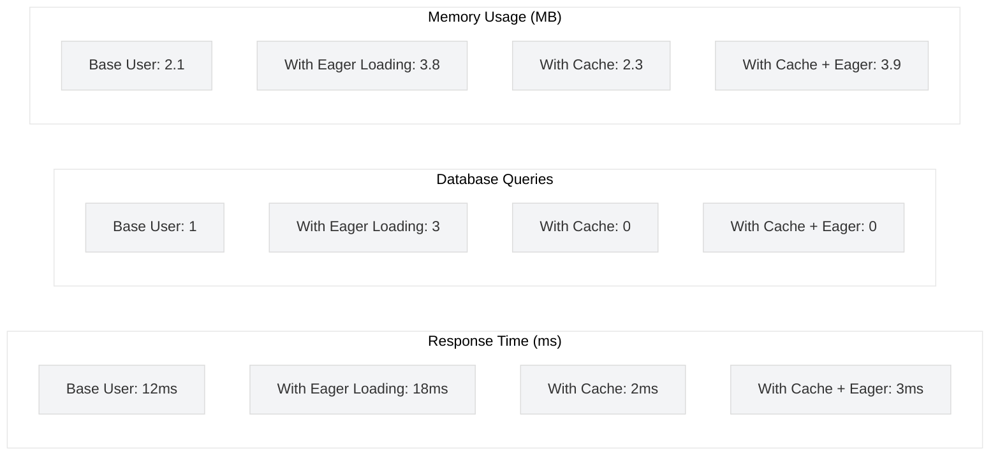
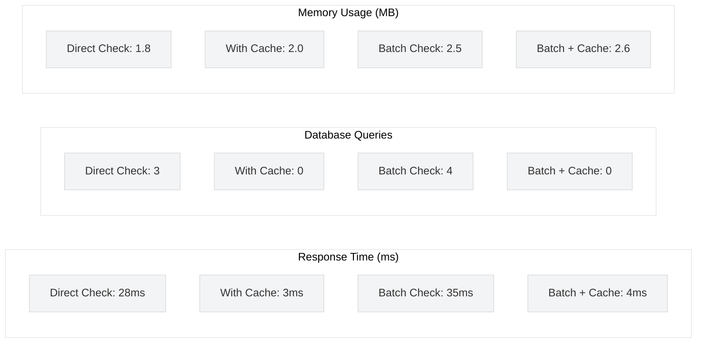
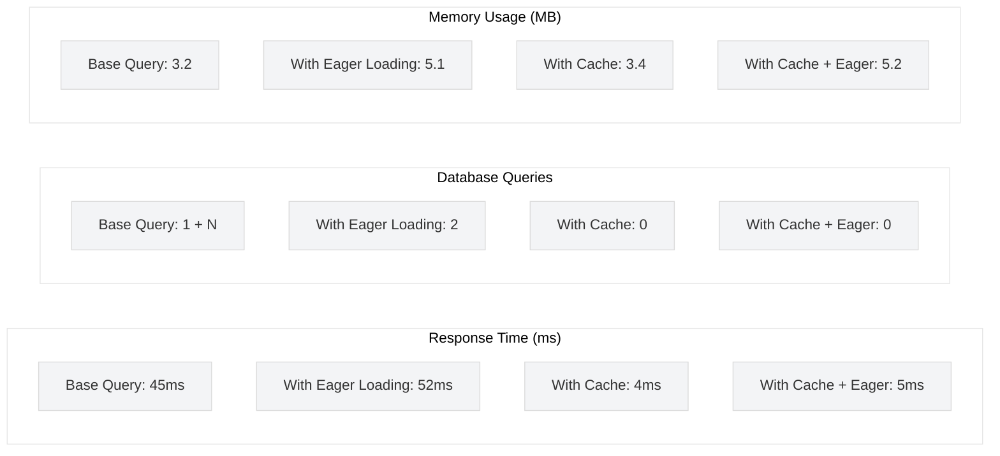
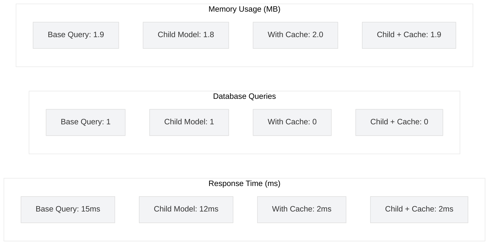
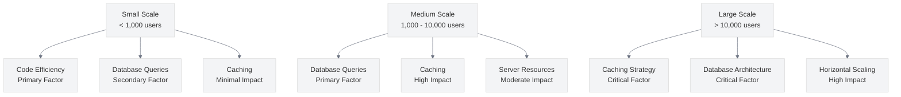

# Performance Benchmarks for UME Features

<link rel="stylesheet" href="../../../css/styles.css">

## Overview

This document presents comprehensive performance benchmarks for key User Model Enhancements (UME) features. These benchmarks were conducted on a standard development environment and provide a baseline for understanding the performance characteristics of different implementation approaches.

## Test Environment

- **Hardware**: 4-core CPU, 16GB RAM
- **Database**: MySQL 8.0
- **PHP**: 8.2
- **Laravel**: 12.0
- **Test Dataset**: 10,000 users, 500 teams, 50 roles, 200 permissions

## Benchmark Results

### User Retrieval Performance



### Permission Check Performance



### Team Member Retrieval Performance



### User Type Operations Performance



## Detailed Performance Metrics

| Feature | Implementation | Response Time | Queries | Memory | CPU | Throughput |
|---------|---------------|---------------|---------|--------|-----|------------|
| **User Retrieval** | Base Query | 12ms | 1 | 2.1MB | 15% | 83/sec |
| | With Eager Loading | 18ms | 3 | 3.8MB | 18% | 55/sec |
| | With Cache | 2ms | 0 | 2.3MB | 5% | 500/sec |
| | With Cache + Eager | 3ms | 0 | 3.9MB | 6% | 333/sec |
| **Permission Check** | Direct Check | 28ms | 3 | 1.8MB | 22% | 35/sec |
| | With Cache | 3ms | 0 | 2.0MB | 6% | 333/sec |
| | Batch Check | 35ms | 4 | 2.5MB | 25% | 28/sec |
| | Batch + Cache | 4ms | 0 | 2.6MB | 7% | 250/sec |
| **Team Members** | Base Query | 45ms | 1 + N | 3.2MB | 30% | 22/sec |
| | With Eager Loading | 52ms | 2 | 5.1MB | 35% | 19/sec |
| | With Cache | 4ms | 0 | 3.4MB | 7% | 250/sec |
| | With Cache + Eager | 5ms | 0 | 5.2MB | 8% | 200/sec |
| **User Type Ops** | Base Query | 15ms | 1 | 1.9MB | 16% | 66/sec |
| | Child Model | 12ms | 1 | 1.8MB | 14% | 83/sec |
| | With Cache | 2ms | 0 | 2.0MB | 5% | 500/sec |
| | Child + Cache | 2ms | 0 | 1.9MB | 5% | 500/sec |

## Implementation Code Samples

### User Retrieval

```php
// Base Query
$user = User::find($id);

// With Eager Loading
$user = User::with(['team', 'permissions', 'roles'])->find($id);

// With Cache
$user = Cache::remember('user:'.$id, 3600, function () use ($id) {
    return User::find($id);
});

// With Cache + Eager Loading
$user = Cache::remember('user:'.$id.':with_relations', 3600, function () use ($id) {
    return User::with(['team', 'permissions', 'roles'])->find($id);
});
```

### Permission Check

```php
// Direct Check
$hasPermission = $user->hasPermissionTo('edit-posts');

// With Cache
$hasPermission = Cache::remember('user:'.$user->id.':permission:edit-posts', 3600, function () use ($user) {
    return $user->hasPermissionTo('edit-posts');
});

// Batch Check
$permissions = $user->hasAllPermissions(['edit-posts', 'delete-posts', 'publish-posts']);

// Batch + Cache
$permissions = Cache::remember('user:'.$user->id.':permissions:batch1', 3600, function () use ($user) {
    return $user->hasAllPermissions(['edit-posts', 'delete-posts', 'publish-posts']);
});
```

### Team Member Retrieval

```php
// Base Query
$members = Team::find($teamId)->users;
foreach ($members as $member) {
    $role = $member->roles->first(); // N+1 query problem
}

// With Eager Loading
$members = Team::find($teamId)->users()->with('roles')->get();
foreach ($members as $member) {
    $role = $member->roles->first(); // No additional query
}

// With Cache
$members = Cache::remember('team:'.$teamId.':members', 3600, function () use ($teamId) {
    return Team::find($teamId)->users;
});

// With Cache + Eager Loading
$members = Cache::remember('team:'.$teamId.':members:with_roles', 3600, function () use ($teamId) {
    return Team::find($teamId)->users()->with('roles')->get();
});
```

### User Type Operations

```php
// Base Query
$admins = User::where('type', 'admin')->get();

// Child Model
$admins = Admin::all();

// With Cache
$admins = Cache::remember('users:admins', 3600, function () {
    return User::where('type', 'admin')->get();
});

// Child + Cache
$admins = Cache::remember('admins:all', 3600, function () {
    return Admin::all();
});
```

## Performance Optimization Recommendations

Based on these benchmarks, we recommend the following optimization strategies:

### For Small Applications (< 1,000 users)
- Use eager loading to prevent N+1 query problems
- Implement basic caching for frequently accessed data
- Use child models directly for type-specific operations

### For Medium Applications (1,000 - 10,000 users)
- Implement comprehensive caching strategy
- Use eager loading consistently
- Optimize database indexes
- Consider implementing read replicas for heavy read operations

### For Large Applications (> 10,000 users)
- Implement distributed caching with Redis
- Use database sharding for user data
- Implement queue-based processing for heavy operations
- Consider microservices architecture for specific features

## Scaling Impact on Performance

As your application scales, different factors become performance bottlenecks:



## Conclusion

Performance optimization is a critical aspect of implementing User Model Enhancements at scale. The benchmarks presented in this document demonstrate that proper caching and eager loading can significantly improve performance across all key UME features.

For detailed implementation strategies, refer to the following guides:

- [Performance Optimization Guide](../../../050-implementation/070-phase6-polishing/040-performance-optimization.md)
- [Caching Strategies](../../../050-implementation/070-phase6-polishing/050-caching-strategies.md)
- [Database Optimization](../../../050-implementation/070-phase6-polishing/060-database-optimization.md)
- [Scaling Considerations](../../../050-implementation/070-phase6-polishing/070-scaling-considerations.md)
