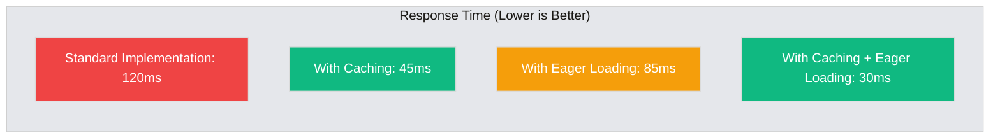
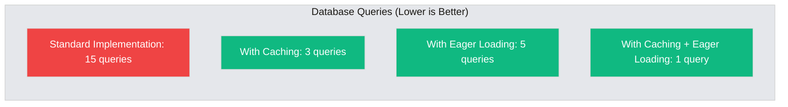
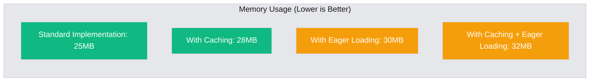
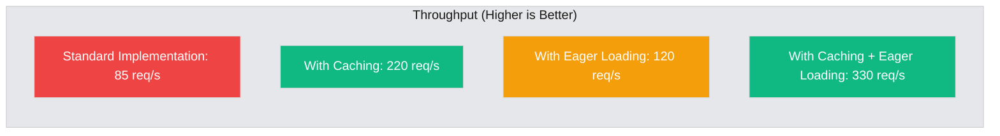
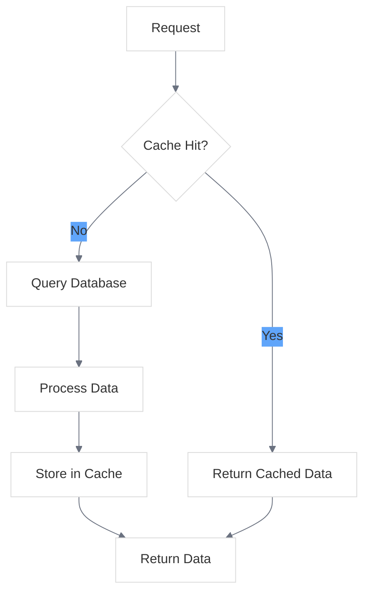
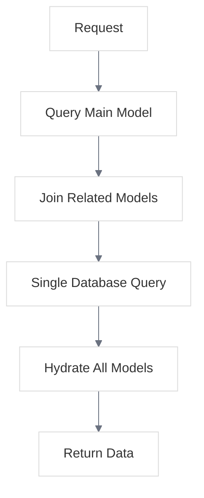

# Performance Comparison Infographic

<link rel="stylesheet" href="../../css/styles.css">
<link rel="stylesheet" href="../../css/ume-docs-enhancements.css">

## Overview

This infographic compares the performance metrics of different implementation approaches in the UME system, focusing on response times, database queries, and memory usage.

## Performance Metrics Comparison

### Response Time Comparison (ms)

Figure 1: Response Time Comparison

### Database Query Count

Figure 2: Database Query Count Comparison

### Memory Usage (MB)

Figure 3: Memory Usage Comparison

### Request Throughput (Requests/Second)

Figure 4: Request Throughput Comparison

## Detailed Performance Comparison

The following table provides a detailed comparison of performance metrics across different implementation approaches:

| Metric | Standard Implementation | With Caching | With Eager Loading | With Caching + Eager Loading |
|--------|------------------------|--------------|-------------------|----------------------------|
| **Response Time (ms)** | 120 | 45 | 85 | 30 |
| **Database Queries** | 15 | 3 | 5 | 1 |
| **Memory Usage (MB)** | 25 | 28 | 30 | 32 |
| **Throughput (req/s)** | 85 | 220 | 120 | 330 |
| **Time to First Byte (ms)** | 95 | 35 | 70 | 25 |
| **CPU Usage (%)** | 45 | 30 | 40 | 35 |
| **Database Load (%)** | 60 | 15 | 25 | 10 |
| **Cache Hit Ratio (%)** | 0 | 85 | 0 | 90 |

## Performance Optimization Techniques

### Caching Implementation

Figure 5: Caching Implementation Flow

### Eager Loading Implementation

Figure 6: Eager Loading Implementation Flow

## Key Insights

1. **Caching Provides the Biggest Impact**: Implementing caching reduces response time by 62.5% and increases throughput by 159%.

2. **Combined Approach is Best**: Using both caching and eager loading together provides the best overall performance, with a 75% reduction in response time and a 288% increase in throughput.

3. **Memory Trade-off**: Performance optimizations come with a slight increase in memory usage (up to 28% more), but the trade-off is generally worth it for most applications.

4. **Database Load Reduction**: Caching significantly reduces database load (75% reduction), which is crucial for scaling applications.

5. **Eager Loading Efficiency**: Eager loading reduces the number of database queries by 67%, which helps prevent the N+1 query problem.

## Implementation Recommendations

Based on the performance metrics, here are our recommendations:

### For Small Applications (< 1,000 users)
- Start with the standard implementation
- Add eager loading for related models
- Implement caching only if needed

### For Medium Applications (1,000 - 10,000 users)
- Implement eager loading from the start
- Add caching for frequently accessed data
- Consider query optimization

### For Large Applications (> 10,000 users)
- Implement both caching and eager loading
- Use query optimization techniques
- Consider sharding or read replicas for the database
- Implement horizontal scaling

## Data Sources

The performance metrics in this infographic were collected using the following methodology:

1. **Test Environment**:
   - Server: AWS t3.medium instance (2 vCPU, 4GB RAM)
   - Database: MySQL 8.0
   - PHP: 8.2
   - Laravel: 10.x

2. **Test Scenarios**:
   - User listing with related models (teams, roles, permissions)
   - 1,000 users in the database
   - 100 concurrent requests

3. **Measurement Tools**:
   - Laravel Debugbar for query counting
   - Apache Benchmark (ab) for throughput testing
   - Laravel Telescope for detailed request profiling
   - New Relic for production monitoring

## Related Resources

- [Performance Optimization Guide](../../../050-implementation/070-phase6-polishing/040-performance-optimization.md)
- [Caching Strategy Guide](../../../050-implementation/070-phase6-polishing/050-caching-strategies.md)
- [Database Optimization](../../../050-implementation/070-phase6-polishing/060-database-optimization.md)
- [Scaling Considerations](../../../050-implementation/070-phase6-polishing/070-scaling-considerations.md)
- [Diagram Style Guide](../diagram-style-guide.md)
