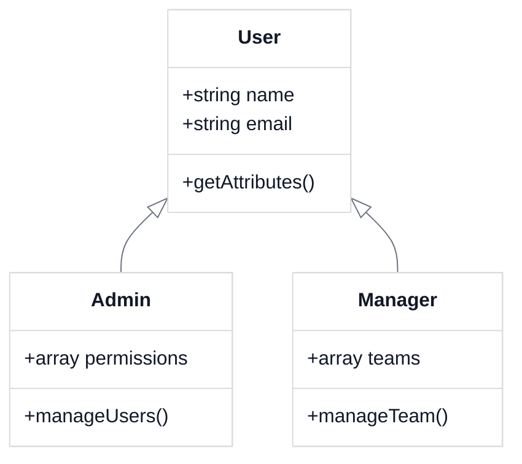
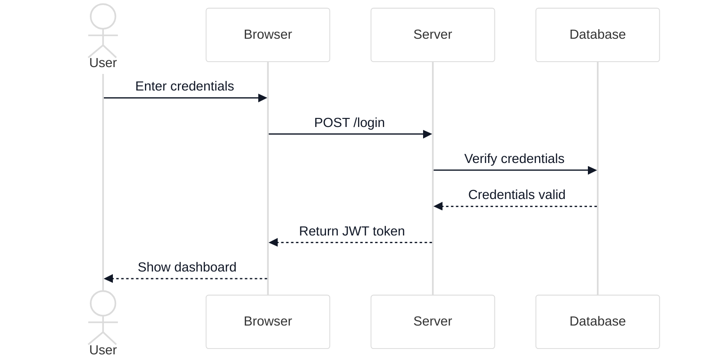
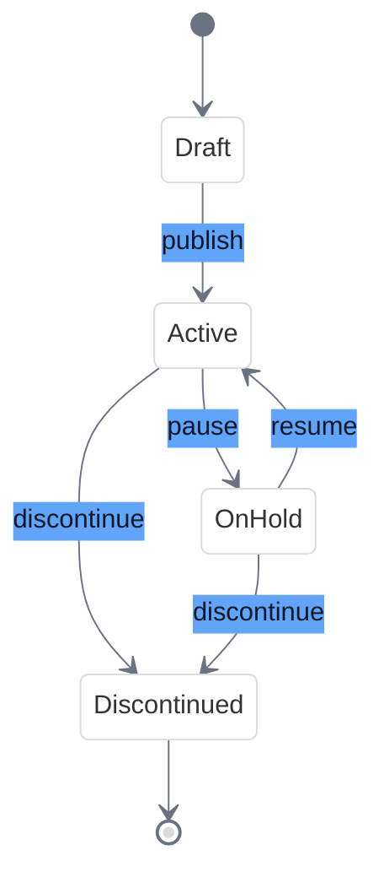
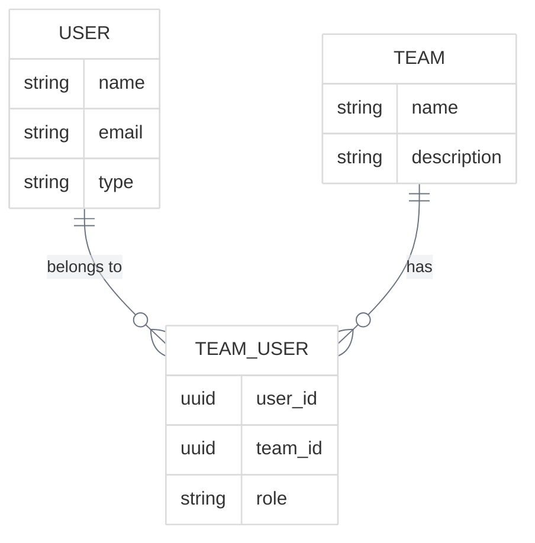
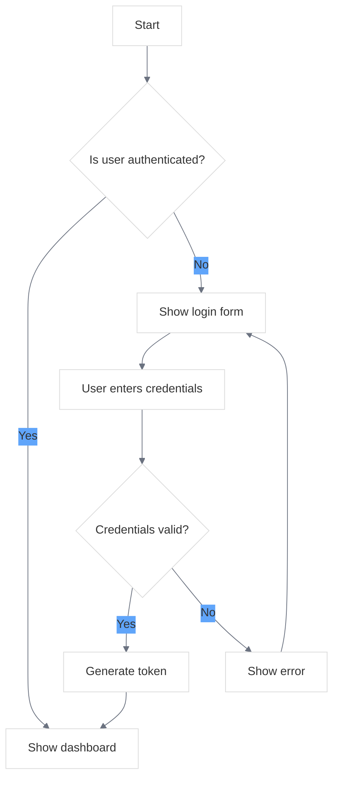
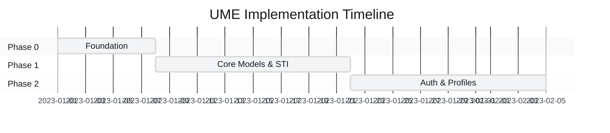

# UME Tutorial Diagram Style Guide

<link rel="stylesheet" href="../css/styles.css">
<link rel="stylesheet" href="../css/ume-docs-enhancements.css">
<script src="../js/ume-docs-enhancements.js"></script>

## Overview

This style guide establishes standards for diagrams in the UME tutorial documentation. Consistent visual elements enhance readability, improve understanding, and create a professional, cohesive experience for users.

## Mermaid Diagram Configuration

All Mermaid diagrams should include these initialization parameters to ensure consistent styling and proper light/dark mode support:

```
%%{init: {'theme': 'base', 'themeVariables': {'primaryColor': '#f3f4f6', 'lineColor': '#6b7280', 'textColor': '#111827', 'mainBkg': '#ffffff', 'secondaryColor': '#60a5fa', 'tertiaryColor': '#e5e7eb'}}}%%
```

## Diagram Types and Usage Guidelines

### Class Diagrams

Use for:
- Object-oriented structures
- Inheritance relationships
- Model hierarchies

Example:



### Sequence Diagrams

Use for:
- Interactions between components
- API calls
- Event sequences

Example:



### State Diagrams

Use for:
- State machines
- Status transitions
- Workflow processes

Example:



### Entity Relationship Diagrams

Use for:
- Database structures
- Model relationships
- Data architecture

Example:



### Flowcharts

Use for:
- Processes
- Algorithms
- Decision flows

Example:



### Gantt Charts

Use for:
- Project timelines
- Implementation phases
- Feature roadmaps

Example:



## Diagram Formatting Guidelines

### Colors

Use the following color palette for consistency:

- **Primary**: #4f46e5 (Indigo)
- **Secondary**: #10b981 (Emerald)
- **Accent**: #f59e0b (Amber)
- **Warning**: #ef4444 (Red)
- **Info**: #3b82f6 (Blue)

### Text

- Keep text concise and clear
- Use sentence case for labels
- Use consistent terminology throughout

### Size and Layout

- Limit diagram complexity (aim for 5-15 elements per diagram)
- Ensure diagrams are responsive
- Maintain a logical flow (typically left-to-right or top-to-bottom)

### Accessibility

- Include descriptive captions for all diagrams
- Provide text alternatives for complex diagrams
- Ensure sufficient color contrast

## Diagram Captions

All diagrams should include a caption using the following format:

```html
<div class="mermaid-caption">Figure X: Description of the diagram</div>
```

## Integration with Documentation

When adding diagrams to documentation:

1. Place the diagram after introducing the concept
2. Reference the diagram in the text
3. Explain key elements of the diagram
4. Link to related documentation where appropriate

## Dark Mode Support

All diagrams automatically support dark mode through the JavaScript initialization in `ume-docs-enhancements.js`. The theme variables will be adjusted based on the user's preference.

## Related Resources

- [Mermaid.js Documentation](https://mermaid-js.github.io/mermaid/)
- [UME Documentation CSS](../css/styles.css)
- [UME Documentation JS](../js/ume-docs-enhancements.js)
