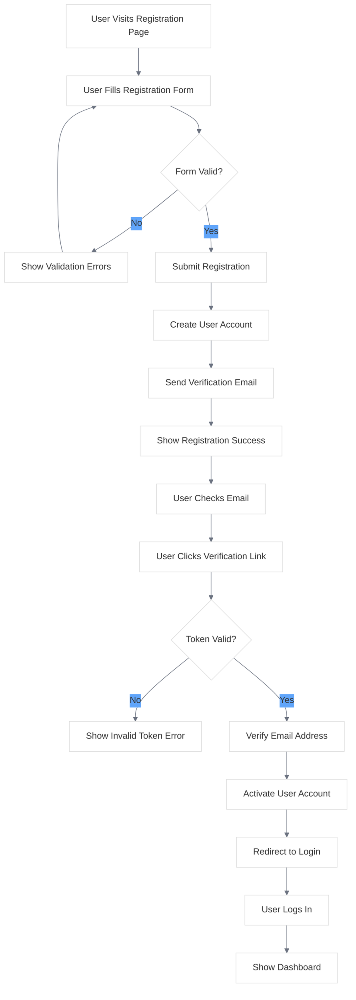
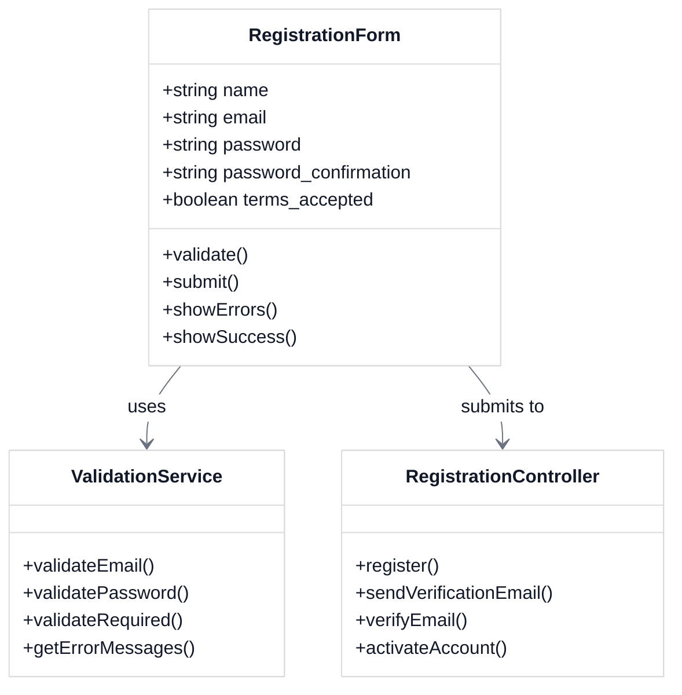
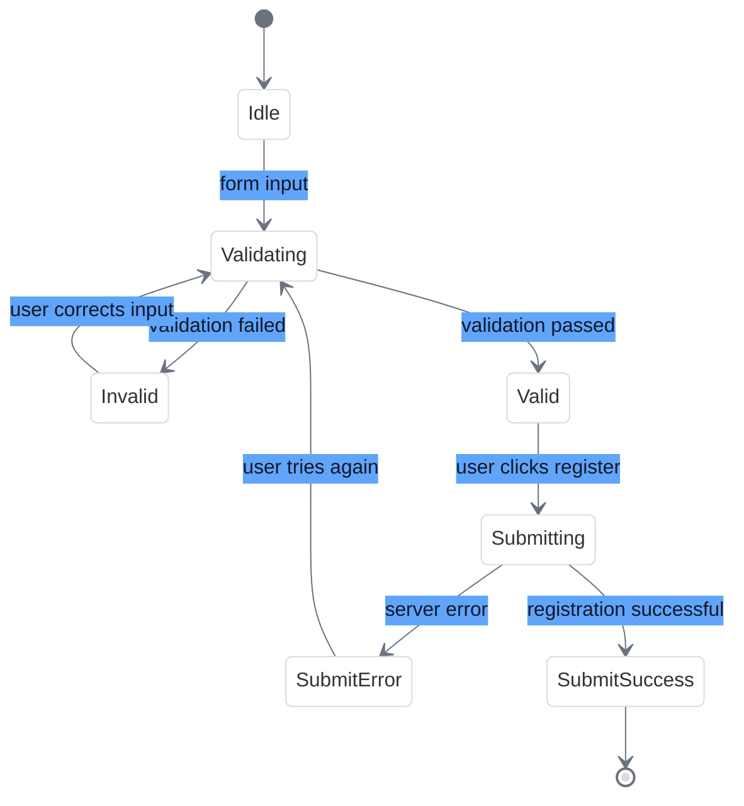

# User Registration UI Flow

<link rel="stylesheet" href="../../css/styles.css">
<link rel="stylesheet" href="../../css/ume-docs-enhancements.css">
<script src="../../js/ume-docs-enhancements.js"></script>

## Overview

This visual aid illustrates the user registration process in the UME system, showing the step-by-step flow from initial form submission to account activation.

## Registration Process Flow

The following flowchart shows the complete user registration process from the UI perspective:



<div class="mermaid-caption">Figure 1: User Registration Process Flow</div>

## Step-by-Step UI Interaction

### 1. Registration Form

The user begins by visiting the registration page and filling out the registration form:

- **Name**: Full name of the user
- **Email**: Email address (will be used for verification)
- **Password**: Password (with strength indicator)
- **Password Confirmation**: Re-enter password to confirm
- **Terms of Service**: Checkbox to accept terms

### 2. Form Validation

Client-side validation occurs as the user fills out the form:

- Email format validation
- Password strength requirements
- Password match confirmation
- Required field validation

If there are validation errors, they are displayed inline with the corresponding fields.

### 3. Form Submission

When the user submits the form:

1. A loading indicator is displayed
2. The form is submitted via AJAX
3. Server-side validation is performed

### 4. Registration Success

Upon successful registration:

1. A success message is displayed
2. Instructions for email verification are shown
3. A verification email is sent to the user's email address

### 5. Email Verification

The verification email contains:

1. A welcome message
2. A verification link with a secure token
3. Instructions for completing the registration

### 6. Account Activation

When the user clicks the verification link:

1. The token is validated
2. The user's email is marked as verified
3. The user account is activated
4. The user is redirected to the login page with a success message

### 7. First Login

After verification, the user can log in:

1. The user enters their email and password
2. Upon successful login, they are redirected to the dashboard
3. A welcome message or onboarding tour may be displayed

## UI Components

### Registration Form Component



<div class="mermaid-caption">Figure 2: Registration Form Component Structure</div>

### Registration State Management



<div class="mermaid-caption">Figure 3: Registration Form State Management</div>

## Implementation with Livewire/Volt

The registration form is implemented using Laravel Livewire/Volt for a reactive user experience:

```php
<?php

use function Livewire\Volt\{state, rules, computed};

state([
    'name' => '',
    'email' => '',
    'password' => '',
    'password_confirmation' => '',
    'terms' => false,
]);

rules([
    'name' => ['required', 'string', 'max:255'],
    'email' => ['required', 'string', 'email', 'max:255', 'unique:users'],
    'password' => ['required', 'string', 'min:8', 'confirmed'],
    'terms' => ['required', 'accepted'],
]);

$register = function () {
    $this->validate();
    
    $user = \App\Models\User::create([
        'name' => $this->name,
        'email' => $this->email,
        'password' => \Illuminate\Support\Facades\Hash::make($this->password),
    ]);
    
    event(new \Illuminate\Auth\Events\Registered($user));
    
    $this->dispatch('registered', ['user' => $user->id]);
};

$passwordStrength = computed(function () {
    if (empty($this->password)) {
        return 0;
    }
    
    $strength = 0;
    
    // Length check
    if (strlen($this->password) >= 8) {
        $strength += 25;
    }
    
    // Uppercase check
    if (preg_match('/[A-Z]/', $this->password)) {
        $strength += 25;
    }
    
    // Lowercase check
    if (preg_match('/[a-z]/', $this->password)) {
        $strength += 25;
    }
    
    // Number/special character check
    if (preg_match('/[0-9\W]/', $this->password)) {
        $strength += 25;
    }
    
    return $strength;
});
?>

<div>
    <form wire:submit="register" class="space-y-6">
        <div>
            <label for="name" class="block text-sm font-medium text-gray-700">Name</label>
            <input wire:model="name" id="name" type="text" class="mt-1 block w-full rounded-md border-gray-300 shadow-sm focus:border-indigo-500 focus:ring-indigo-500 sm:text-sm" required autofocus />
            @error('name') <span class="text-red-600 text-sm">{{ $message }}</span> @enderror
        </div>
        
        <div>
            <label for="email" class="block text-sm font-medium text-gray-700">Email</label>
            <input wire:model="email" id="email" type="email" class="mt-1 block w-full rounded-md border-gray-300 shadow-sm focus:border-indigo-500 focus:ring-indigo-500 sm:text-sm" required />
            @error('email') <span class="text-red-600 text-sm">{{ $message }}</span> @enderror
        </div>
        
        <div>
            <label for="password" class="block text-sm font-medium text-gray-700">Password</label>
            <input wire:model.live="password" id="password" type="password" class="mt-1 block w-full rounded-md border-gray-300 shadow-sm focus:border-indigo-500 focus:ring-indigo-500 sm:text-sm" required />
            
            <!-- Password strength indicator -->
            <div class="mt-2 h-2 w-full bg-gray-200 rounded-full">
                <div class="h-full rounded-full transition-all duration-300 ease-in-out" 
                     style="width: {{ $this->passwordStrength }}%; background-color: {{ $this->passwordStrength < 50 ? 'red' : ($this->passwordStrength < 75 ? 'orange' : 'green') }}"></div>
            </div>
            <p class="text-xs text-gray-500 mt-1">Password strength: {{ $this->passwordStrength < 50 ? 'Weak' : ($this->passwordStrength < 75 ? 'Medium' : 'Strong') }}</p>
            
            @error('password') <span class="text-red-600 text-sm">{{ $message }}</span> @enderror
        </div>
        
        <div>
            <label for="password_confirmation" class="block text-sm font-medium text-gray-700">Confirm Password</label>
            <input wire:model="password_confirmation" id="password_confirmation" type="password" class="mt-1 block w-full rounded-md border-gray-300 shadow-sm focus:border-indigo-500 focus:ring-indigo-500 sm:text-sm" required />
        </div>
        
        <div class="flex items-center">
            <input wire:model="terms" id="terms" type="checkbox" class="h-4 w-4 text-indigo-600 focus:ring-indigo-500 border-gray-300 rounded" />
            <label for="terms" class="ml-2 block text-sm text-gray-900">
                I agree to the <a href="#" class="text-indigo-600 hover:text-indigo-500">Terms of Service</a> and <a href="#" class="text-indigo-600 hover:text-indigo-500">Privacy Policy</a>
            </label>
        </div>
        @error('terms') <span class="text-red-600 text-sm">{{ $message }}</span> @enderror
        
        <div>
            <button type="submit" class="w-full flex justify-center py-2 px-4 border border-transparent rounded-md shadow-sm text-sm font-medium text-white bg-indigo-600 hover:bg-indigo-700 focus:outline-none focus:ring-2 focus:ring-offset-2 focus:ring-indigo-500">
                Register
            </button>
        </div>
    </form>
    
    <p class="mt-4 text-center text-sm text-gray-600">
        Already have an account? <a href="{{ route('login') }}" class="font-medium text-indigo-600 hover:text-indigo-500">Log in</a>
    </p>
    
    <div wire:loading wire:target="register" class="fixed inset-0 flex items-center justify-center bg-black bg-opacity-50 z-50">
        <div class="bg-white p-4 rounded-lg shadow-lg">
            <svg class="animate-spin h-8 w-8 text-indigo-600 mx-auto" xmlns="http://www.w3.org/2000/svg" fill="none" viewBox="0 0 24 24">
                <circle class="opacity-25" cx="12" cy="12" r="10" stroke="currentColor" stroke-width="4"></circle>
                <path class="opacity-75" fill="currentColor" d="M4 12a8 8 0 018-8V0C5.373 0 0 5.373 0 12h4zm2 5.291A7.962 7.962 0 014 12H0c0 3.042 1.135 5.824 3 7.938l3-2.647z"></path>
            </svg>
            <p class="mt-2 text-center text-gray-700">Processing registration...</p>
        </div>
    </div>
</div>
```

## Common Issues and Solutions

### 1. Email Verification Link Expired

**Problem**: User clicks the verification link after it has expired.

**Solution**: 
- Display a message explaining the link has expired
- Provide a button to resend the verification email
- Include clear instructions on the time limit for verification links

### 2. Account Already Exists

**Problem**: User tries to register with an email that's already in use.

**Solution**:
- Show a clear error message
- Provide a link to the login page
- Offer a password reset option

### 3. Password Requirements Not Met

**Problem**: User enters a password that doesn't meet the strength requirements.

**Solution**:
- Display password requirements clearly
- Show a real-time strength indicator
- Provide specific feedback on what's missing

## Related Resources

- [Authentication Implementation](../../../050-implementation/030-phase2-auth-profile/010-authentication.md)
- [User Account States](../../../050-implementation/030-phase2-auth-profile/050-user-account-states.md)
- [Email Verification](../../../050-implementation/030-phase2-auth-profile/040-email-verification.md)
- [Diagram Style Guide](../diagram-style-guide.md)
