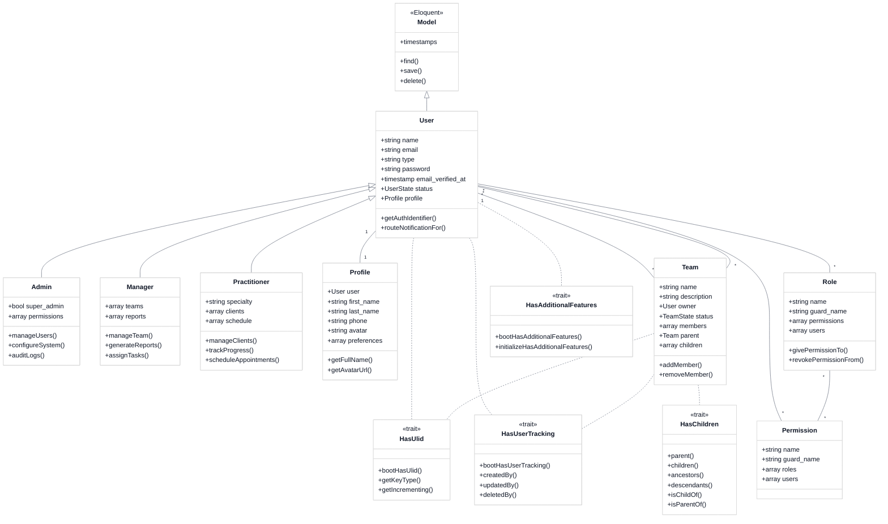
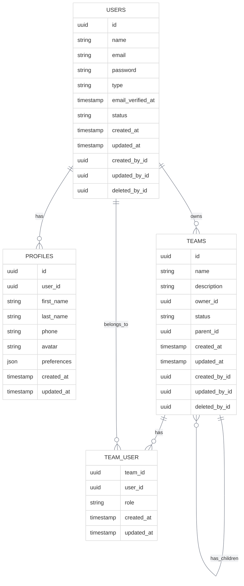

# Model Inheritance Hierarchy

<link rel="stylesheet" href="../css/styles.css">
<link rel="stylesheet" href="../css/ume-docs-enhancements.css">

## Overview

This visual aid illustrates the inheritance hierarchy for all model types in the UME system. The diagram shows how different user types inherit from the base User model through Single Table Inheritance (STI), as well as the traits that provide additional functionality.

## Class Diagram

Figure 1: Model Inheritance Hierarchy

## Model Descriptions

### Base Models

#### Eloquent Model
The base model class provided by Laravel's Eloquent ORM. All models in the application inherit from this class.

#### User
The central model for user management. Stores basic user information and serves as the parent class for specific user types through Single Table Inheritance.

**Key Properties:**
- `name`: The user's display name
- `email`: The user's email address (used for authentication)
- `type`: The user type for Single Table Inheritance
- `password`: Hashed password
- `email_verified_at`: Timestamp when email was verified
- `status`: Current state of the user account (using state machine)

**Key Methods:**
- `getAuthIdentifier()`: Returns the primary key for authentication
- `routeNotificationFor()`: Determines notification routing

### User Types

#### Admin
Administrative user with system management capabilities.

**Key Properties:**
- `super_admin`: Boolean indicating if user has super admin privileges
- `permissions`: Array of special permissions

**Key Methods:**
- `manageUsers()`: User management functionality
- `configureSystem()`: System configuration functionality
- `auditLogs()`: Access to system audit logs

#### Manager
Manager user with team management capabilities.

**Key Properties:**
- `teams`: Teams managed by this user
- `reports`: Reports generated by this user

**Key Methods:**
- `manageTeam()`: Team management functionality
- `generateReports()`: Report generation functionality
- `assignTasks()`: Task assignment functionality

#### Practitioner
Practitioner user with client management capabilities.

**Key Properties:**
- `specialty`: The practitioner's specialty
- `clients`: Clients managed by this practitioner
- `schedule`: The practitioner's appointment schedule

**Key Methods:**
- `manageClients()`: Client management functionality
- `trackProgress()`: Progress tracking functionality
- `scheduleAppointments()`: Appointment scheduling functionality

### Related Models

#### Profile
Extended user profile information.

**Key Properties:**
- `user`: The associated user
- `first_name`: User's first name
- `last_name`: User's last name
- `phone`: Contact phone number
- `avatar`: Profile picture
- `preferences`: User preferences

**Key Methods:**
- `getFullName()`: Returns the user's full name
- `getAvatarUrl()`: Returns the URL for the user's avatar

#### Team
Team that users can belong to.

**Key Properties:**
- `name`: Team name
- `description`: Team description
- `owner`: Team owner (User)
- `status`: Current state of the team (using state machine)
- `members`: Team members (Users)
- `parent`: Parent team (if any)
- `children`: Child teams (if any)

**Key Methods:**
- `addMember()`: Add a user to the team
- `removeMember()`: Remove a user from the team

#### Permission
Individual permission for specific actions.

**Key Properties:**
- `name`: Permission name
- `guard_name`: Guard name for authentication
- `roles`: Roles that have this permission
- `users`: Users that have this permission directly

#### Role
Named collection of permissions.

**Key Properties:**
- `name`: Role name
- `guard_name`: Guard name for authentication
- `permissions`: Permissions included in this role
- `users`: Users that have this role

**Key Methods:**
- `givePermissionTo()`: Add a permission to this role
- `revokePermissionFrom()`: Remove a permission from this role

### Traits

#### HasUlid
Adds ULID (Universally Unique Lexicographically Sortable Identifier) support to models.

**Key Methods:**
- `bootHasUlid()`: Boot method for the trait
- `getKeyType()`: Returns the key type (string)
- `getIncrementing()`: Returns false (ULIDs are not auto-incrementing)

#### HasUserTracking
Tracks user creation, updates, and deletion.

**Key Methods:**
- `bootHasUserTracking()`: Boot method for the trait
- `createdBy()`: Relationship to the user who created the record
- `updatedBy()`: Relationship to the user who last updated the record
- `deletedBy()`: Relationship to the user who deleted the record

#### HasAdditionalFeatures
Consolidates multiple feature traits.

**Key Methods:**
- `bootHasAdditionalFeatures()`: Boot method for the trait
- `initializeHasAdditionalFeatures()`: Initialize method for the trait

#### HasChildren
Supports parent-child relationships between models.

**Key Methods:**
- `parent()`: Relationship to the parent model
- `children()`: Relationship to child models
- `ancestors()`: Get all ancestors
- `descendants()`: Get all descendants
- `isChildOf()`: Check if model is a child of another model
- `isParentOf()`: Check if model is a parent of another model

## Single Table Inheritance Implementation

The UME system uses Single Table Inheritance (STI) to store different user types in a single database table while maintaining type-specific behavior through inheritance.

Figure 2: Database Schema for Single Table Inheritance

## Related Resources

- [Single Table Inheritance Implementation](../../050-implementation/020-phase1-core-models/020-single-table-inheritance.md)
- [User Model Implementation](../../050-implementation/020-phase1-core-models/010-user-model.md)
- [Model Traits Implementation](../../050-implementation/020-phase1-core-models/030-model-traits.md)
- [Diagram Style Guide](./diagram-style-guide.md)
