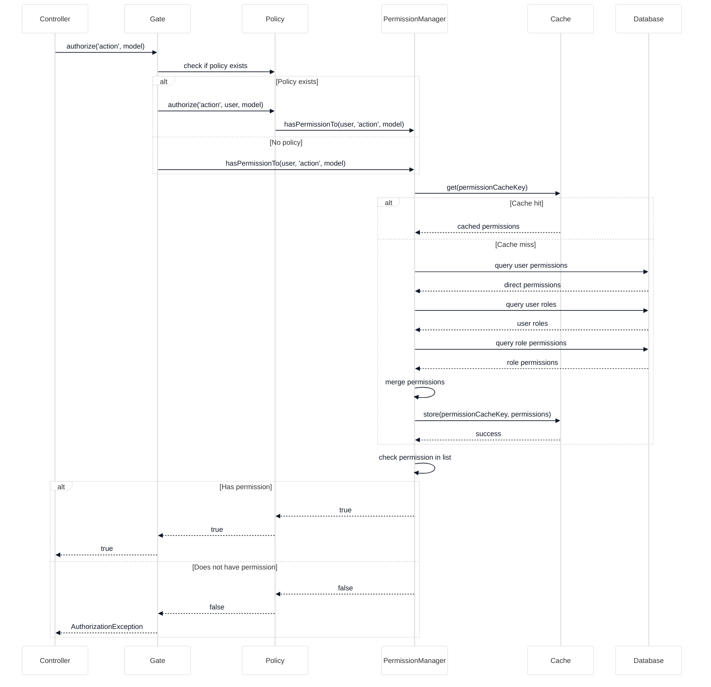
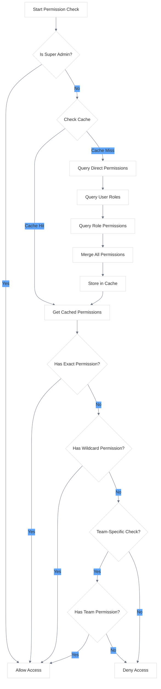
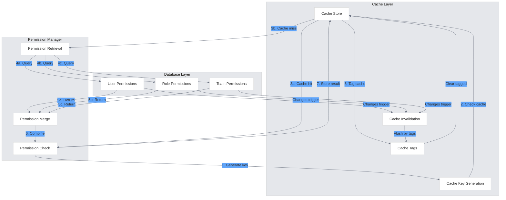
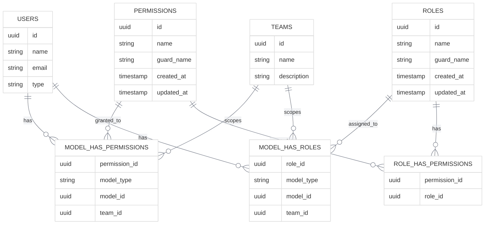
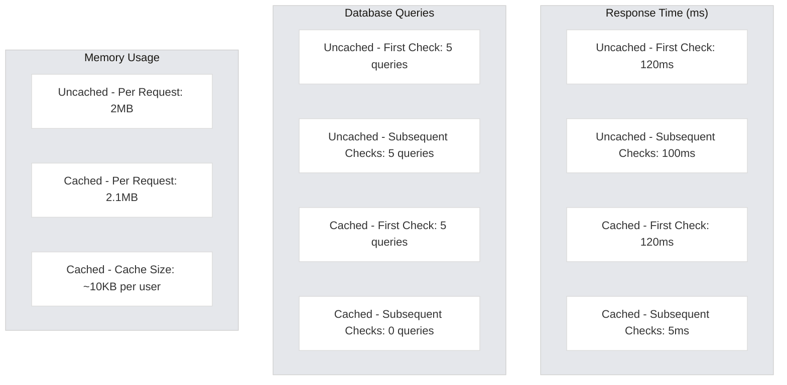

# Permission Check Flow

<link rel="stylesheet" href="../css/styles.css">
<link rel="stylesheet" href="../css/ume-docs-enhancements.css">
<script src="../js/ume-docs-enhancements.js"></script>

## Overview

This visual aid illustrates the permission check flow in the UME system, showing how user permissions are verified for various actions, including the caching mechanisms used to optimize performance.

## Permission Check Sequence

The following sequence diagram shows the complete permission check process:



<div class="mermaid-caption">Figure 1: Permission Check Sequence</div>

## Permission Check Flow

The following flowchart illustrates the decision process for checking permissions:



<div class="mermaid-caption">Figure 2: Permission Check Flow</div>

## Permission Caching Mechanism

The following diagram illustrates how permission caching works in the UME system:



<div class="mermaid-caption">Figure 3: Permission Caching Mechanism</div>

## Permission Data Model

The following entity relationship diagram shows the database schema for permissions:



<div class="mermaid-caption">Figure 4: Permission Data Model</div>

## Permission Check in Different Contexts

The following diagram illustrates how permissions are checked in different contexts:

```mermaid
%%{init: {'theme': 'base', 'themeVariables': {'primaryColor': '#f3f4f6', 'lineColor': '#6b7280', 'textColor': '#111827', 'mainBkg': '#ffffff', 'secondaryColor': '#60a5fa', 'tertiaryColor': '#e5e7eb'}}}%%
graph TD
    subgraph "Controller Layer"
        C1[Web Controller]
        C2[API Controller]
        C3[Console Command]
    end
    
    subgraph "Authorization Layer"
        A1[Gate Facade]
        A2[Policies]
        A3[Middleware]
        A4[Blade Directives]
    end
    
    subgraph "Permission Layer"
        P1[Permission Manager]
        P2[Role Manager]
        P3[Team Permission Manager]
    end
    
    %% Web flow
    C1 -->|authorize()| A1
    C1 -->|@can| A4
    A4 -->|check| A1
    A1 -->|policy| A2
    A2 -->|check| P1
    
    %% API flow
    C2 -->|middleware| A3
    A3 -->|check| A1
    A1 -->|direct| P1
    
    %% Console flow
    C3 -->|direct| P1
    
    %% Permission checks
    P1 -->|check direct| P1
    P1 -->|check roles| P2
    P1 -->|check team| P3
    P2 -->|has permission| P1
    P3 -->|team context| P1
```

<div class="mermaid-caption">Figure 5: Permission Check in Different Contexts</div>

## Performance Comparison

The following chart compares the performance of cached vs. uncached permission checks:



<div class="mermaid-caption">Figure 6: Performance Comparison of Cached vs. Uncached Permission Checks</div>

## Related Resources

- [Permission Implementation](../../050-implementation/040-phase3-teams-permissions/030-permissions.md)
- [Role Implementation](../../050-implementation/040-phase3-teams-permissions/040-roles.md)
- [Permission Caching](../../050-implementation/040-phase3-teams-permissions/050-permission-caching.md)
- [spatie/laravel-permission Documentation](https://spatie.be/docs/laravel-permission)
- [Laravel Authorization Documentation](https://laravel.com/docs/authorization)
- [Diagram Style Guide](./diagram-style-guide.md)
