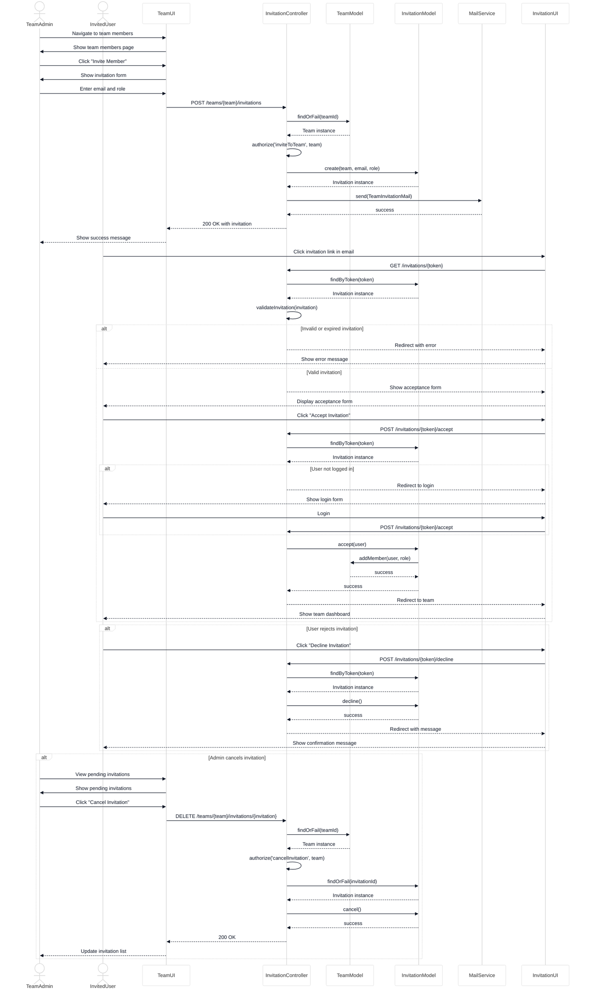
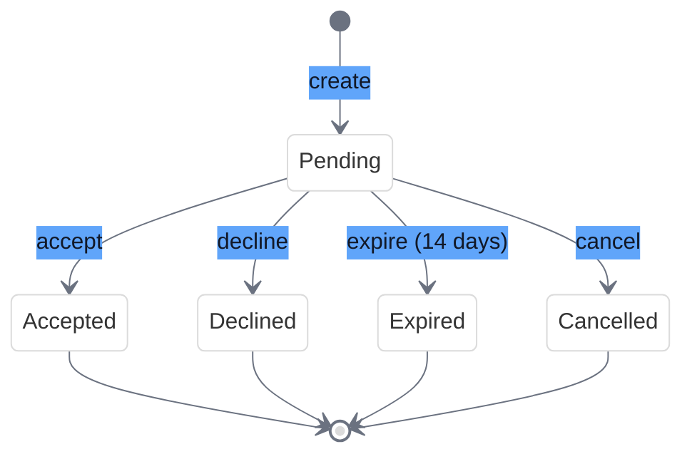
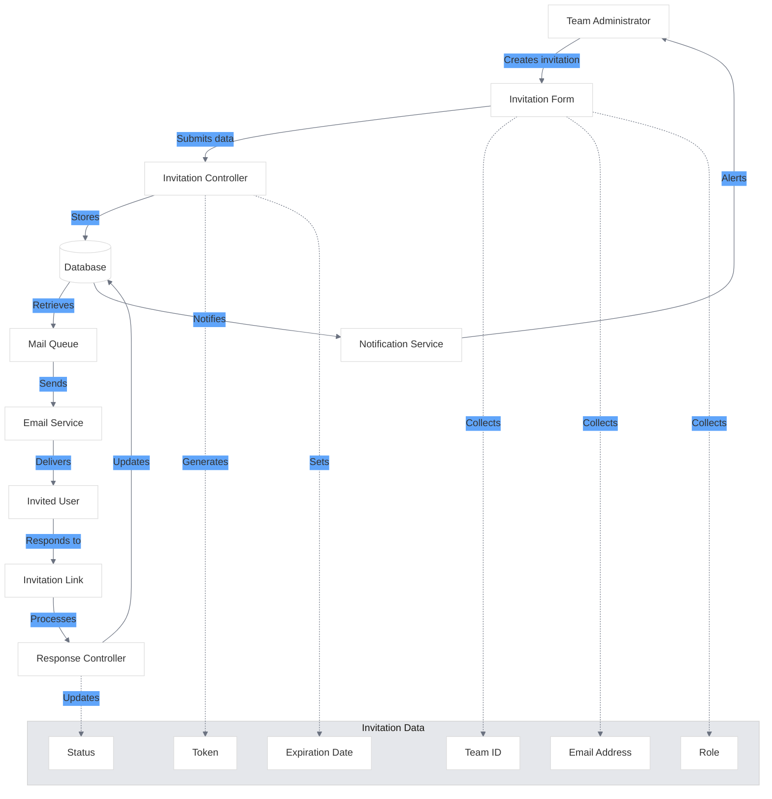
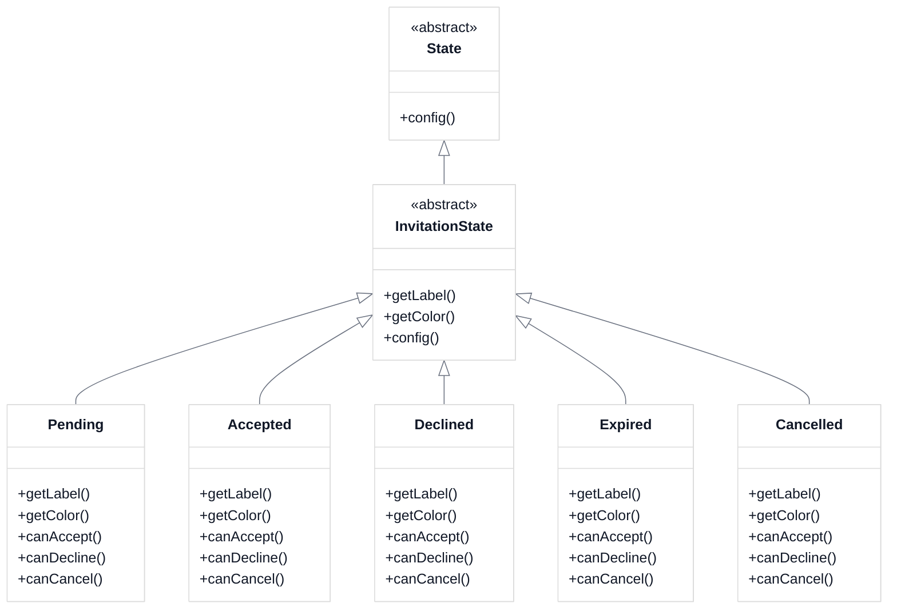
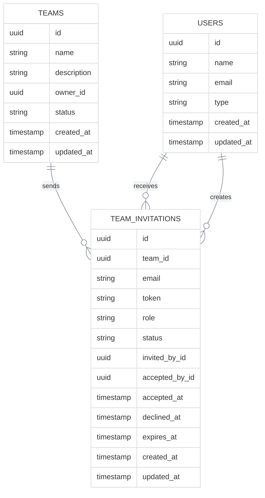

# Team Invitation Flow

<link rel="stylesheet" href="../css/styles.css">
<link rel="stylesheet" href="../css/ume-docs-enhancements.css">

## Overview

This visual aid illustrates the team invitation flow in the UME system, showing how users are invited to teams and how those invitations are processed through various states.

## Invitation Process Flow

The following sequence diagram shows the complete team invitation process:

Figure 1: Team Invitation Process Flow

## Invitation State Machine

The following state diagram shows the possible states of a team invitation:

Figure 2: Team Invitation State Machine

## State Descriptions

### Pending
- **Description**: Initial state after an invitation is created
- **Capabilities**: Can be accepted, declined, cancelled, or expired
- **Transitions**:
  - To **Accepted**: When the invited user accepts the invitation
  - To **Declined**: When the invited user declines the invitation
  - To **Expired**: Automatically after 14 days if not accepted or declined
  - To **Cancelled**: When a team administrator cancels the invitation

### Accepted
- **Description**: The invitation has been accepted by the invited user
- **Capabilities**: Terminal state, no further transitions
- **Side Effects**: User is added to the team with the specified role

### Declined
- **Description**: The invitation has been declined by the invited user
- **Capabilities**: Terminal state, no further transitions
- **Side Effects**: Team administrators are notified of the decline

### Expired
- **Description**: The invitation has expired without being accepted or declined
- **Capabilities**: Terminal state, no further transitions
- **Side Effects**: Team administrators may be notified of the expiration

### Cancelled
- **Description**: The invitation has been cancelled by a team administrator
- **Capabilities**: Terminal state, no further transitions
- **Side Effects**: Invited user may be notified of the cancellation

## Data Flow Diagram

The following diagram illustrates how data flows through the team invitation system:

Figure 3: Team Invitation Data Flow

## Implementation with Laravel Model States

The team invitation state machine is implemented using the `spatie/laravel-model-states` package, which provides a clean way to define states and transitions.

### State Class Hierarchy

Figure 4: Invitation State Class Hierarchy

## Database Schema

The following entity relationship diagram shows the database schema for team invitations:

Figure 5: Team Invitation Database Schema

## Related Resources

- [Team Management Implementation](../../050-implementation/040-phase3-teams-permissions/010-team-management.md)
- [Team Invitation Implementation](../../050-implementation/040-phase3-teams-permissions/020-team-invitations.md)
- [State Machine Implementation](../../050-implementation/030-phase2-auth-profile/050-user-account-states.md)
- [spatie/laravel-model-states Documentation](https://spatie.be/docs/laravel-model-states)
- [Diagram Style Guide](./diagram-style-guide.md)
