# UME Architecture Overview

<link rel="stylesheet" href="../css/styles.css">
<link rel="stylesheet" href="../css/ume-docs-enhancements.css">

## Comprehensive UME Architecture

This diagram provides a high-level overview of the User Model Enhancements (UME) architecture, showing all major components and their relationships.

```mermaid
%%{init: {'theme': 'base', 'themeVariables': {'primaryColor': '#f3f4f6', 'lineColor': '#6b7280', 'textColor': '#111827', 'mainBkg': '#ffffff', 'secondaryColor': '#60a5fa', 'tertiaryColor': '#e5e7eb'}}}%%
graph TD
    %% Core Components
    User[User Model] --> STI[Single Table Inheritance]
    User --> Traits[Model Traits]
    User --> Auth[Authentication]
    User --> Profile[User Profiles]
    
    %% Advanced Features
    User --> Teams[Teams]
    User --> Permissions[Permissions]
    User --> States[State Machines]
    User --> RT[Real-time Features]
    
    %% Traits
    Traits --> HasUlid[HasUlid]
    Traits --> HasUserTracking[HasUserTracking]
    Traits --> HasAdditionalFeatures[HasAdditionalFeatures]
    Traits --> HasChildren[HasChildren]
    
    %% STI Components
    STI --> Admin[Admin]
    STI --> Manager[Manager]
    STI --> Practitioner[Practitioner]
    
    %% Auth Components
    Auth --> TwoFactor[Two-Factor Auth]
    Auth --> Sanctum[Laravel Sanctum]
    Auth --> Policies[Authorization Policies]
    
    %% Profile Components
    Profile --> Avatar[Avatar Management]
    Profile --> Settings[User Settings]
    Profile --> Preferences[User Preferences]
    
    %% Team Components
    Teams --> TeamMembership[Team Membership]
    Teams --> TeamHierarchy[Team Hierarchy]
    Teams --> TeamInvitations[Team Invitations]
    
    %% Permission Components
    Permissions --> Roles[Roles]
    Permissions --> Abilities[Abilities]
    Permissions --> PermissionCaching[Permission Caching]
    
    %% State Machine Components
    States --> UserStates[User Account States]
    States --> TeamStates[Team States]
    States --> InvitationStates[Invitation States]
    
    %% Real-time Components
    RT --> Reverb[Laravel Reverb]
    RT --> Presence[User Presence]
    RT --> Chat[Real-time Chat]
    
    %% UI Implementations
    UI[UI Implementations] --> Livewire[Livewire/Volt]
    UI --> Filament[FilamentPHP]
    UI --> Inertia[Inertia.js]
    
    %% Database
    DB[Database] --> Migrations[Migrations]
    DB --> Seeders[Seeders]
    DB --> Factories[Factories]
    
    %% Testing
    Testing[Testing] --> Unit[Unit Tests]
    Testing --> Feature[Feature Tests]
    Testing --> Browser[Browser Tests]
```

Figure 1: Comprehensive UME Architecture

## Component Descriptions

### Core Components

- **User Model**: The central model that all UME features are built around
- **Single Table Inheritance**: Pattern for storing different user types in a single table
- **Model Traits**: Reusable traits that add functionality to models
- **Authentication**: User authentication and security features
- **User Profiles**: Enhanced user profile management

### Advanced Features

- **Teams**: Team management and hierarchies
- **Permissions**: Role-based access control
- **State Machines**: State management for various entities
- **Real-time Features**: WebSocket-based real-time functionality

### Model Traits

- **HasUlid**: Adds ULID (Universally Unique Lexicographically Sortable Identifier) support
- **HasUserTracking**: Tracks user creation, updates, and deletion
- **HasAdditionalFeatures**: Consolidates multiple feature traits
- **HasChildren**: Supports parent-child relationships between models

### Single Table Inheritance

- **Admin**: Administrative user type with system management capabilities
- **Manager**: Manager user type with team management capabilities
- **Practitioner**: Practitioner user type with client management capabilities

### Authentication Components

- **Two-Factor Auth**: Additional security layer for user authentication
- **Laravel Sanctum**: API token authentication
- **Authorization Policies**: Define what actions users can perform

### Profile Components

- **Avatar Management**: User profile picture handling
- **User Settings**: Application settings specific to users
- **User Preferences**: User interface and notification preferences

### Team Components

- **Team Membership**: User membership in teams
- **Team Hierarchy**: Parent-child relationships between teams
- **Team Invitations**: Process for inviting users to teams

### Permission Components

- **Roles**: Named collections of permissions
- **Abilities**: Individual permissions for specific actions
- **Permission Caching**: Performance optimization for permission checks

### State Machine Components

- **User Account States**: Lifecycle states for user accounts
- **Team States**: Lifecycle states for teams
- **Invitation States**: States for the invitation process

### Real-time Components

- **Laravel Reverb**: WebSocket server for real-time communication
- **User Presence**: Real-time user online status
- **Real-time Chat**: Instant messaging between users

### UI Implementations

- **Livewire/Volt**: Primary UI implementation using Laravel Livewire and Volt
- **FilamentPHP**: Admin interface implementation
- **Inertia.js**: Alternative UI implementations with React or Vue

### Database

- **Migrations**: Database structure definitions
- **Seeders**: Initial data population
- **Factories**: Test data generation

### Testing

- **Unit Tests**: Tests for individual components
- **Feature Tests**: Tests for feature functionality
- **Browser Tests**: End-to-end tests with browser simulation

## Architecture Principles

The UME architecture follows these key principles:

1. **Modularity**: Components are designed to be modular and reusable
2. **Extensibility**: The architecture can be extended with new features
3. **Testability**: All components are designed to be easily testable
4. **Performance**: Performance considerations are built into the design
5. **Security**: Security is a fundamental aspect of the architecture

## Related Resources

- [UME Tutorial Introduction](../../010-introduction/000-index.md)
- [Implementation Overview](../../050-implementation/000-index.md)
- [Diagram Style Guide](./diagram-style-guide.md)
