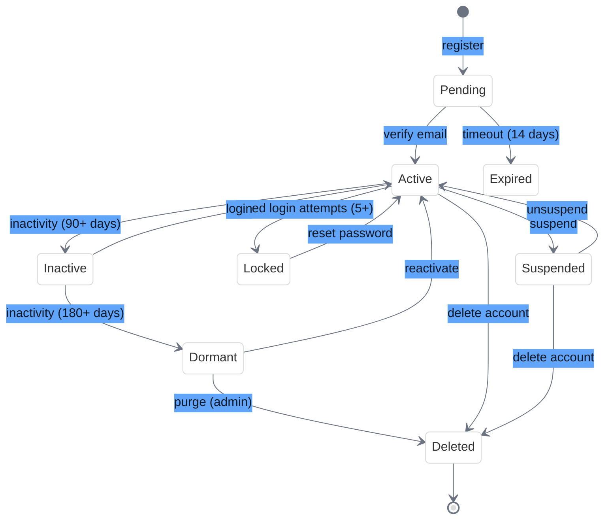
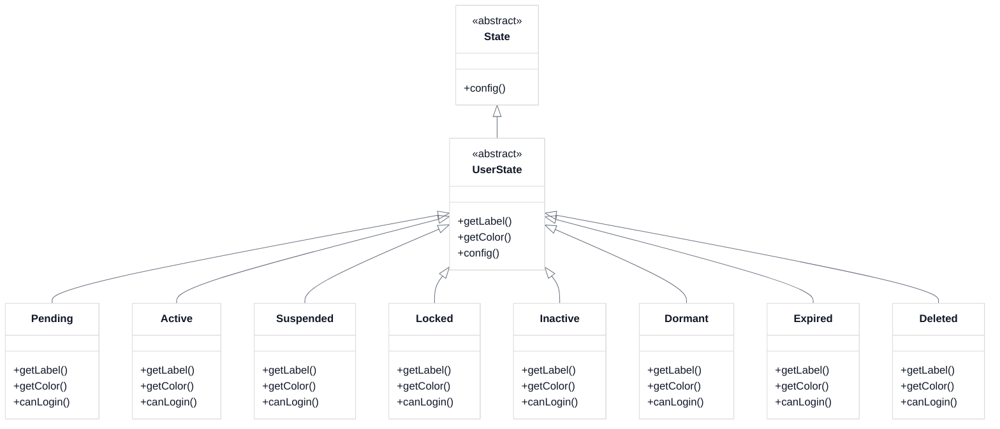

# User Account State Machine

<link rel="stylesheet" href="../css/styles.css">
<link rel="stylesheet" href="../css/ume-docs-enhancements.css">

## Overview

This visual aid illustrates the state machine for user accounts in the UME system. The state machine manages the lifecycle of user accounts, from registration to deletion, and ensures that users can only transition between states in valid ways.

## State Diagram

Figure 1: User Account State Machine

## State Descriptions

### Pending
- **Description**: Initial state after registration but before email verification
- **Capabilities**: Limited access to the system
- **Transitions**:
  - To **Active**: When the user verifies their email address
  - To **Expired**: Automatically after 14 days if email is not verified

### Active
- **Description**: Normal active user account
- **Capabilities**: Full access to the system based on permissions
- **Transitions**:
  - To **Suspended**: When an administrator suspends the account
  - To **Locked**: Automatically after 5 failed login attempts
  - To **Inactive**: Automatically after 90 days of inactivity
  - To **Deleted**: When the user deletes their account

### Suspended
- **Description**: Account temporarily suspended by an administrator
- **Capabilities**: No access to the system
- **Transitions**:
  - To **Active**: When an administrator unsuspends the account
  - To **Deleted**: When the user or administrator deletes the account

### Locked
- **Description**: Account locked due to security concerns (e.g., multiple failed login attempts)
- **Capabilities**: No access to the system
- **Transitions**:
  - To **Active**: When the user successfully resets their password

### Inactive
- **Description**: Account automatically marked as inactive due to lack of activity
- **Capabilities**: Limited access to the system
- **Transitions**:
  - To **Active**: When the user logs in again
  - To **Dormant**: Automatically after 180 days of continued inactivity

### Dormant
- **Description**: Account that has been inactive for an extended period
- **Capabilities**: No access to the system
- **Transitions**:
  - To **Active**: When the user explicitly reactivates their account
  - To **Deleted**: When an administrator purges dormant accounts

### Expired
- **Description**: Registration that was never completed (email not verified)
- **Capabilities**: No access to the system
- **Transitions**: None (terminal state)

### Deleted
- **Description**: Account that has been deleted
- **Capabilities**: No access to the system
- **Transitions**: None (terminal state)

## Transition Details

### Register
- **From**: [Start]
- **To**: Pending
- **Trigger**: User completes registration form
- **Guards**: Valid email and password
- **Side Effects**: Sends verification email

### Verify Email
- **From**: Pending
- **To**: Active
- **Trigger**: User clicks verification link in email
- **Guards**: Valid verification token
- **Side Effects**: Enables full account access

### Timeout (14 days)
- **From**: Pending
- **To**: Expired
- **Trigger**: Automatic after 14 days
- **Guards**: Email not verified
- **Side Effects**: Marks registration as expired

### Suspend
- **From**: Active
- **To**: Suspended
- **Trigger**: Administrator action
- **Guards**: Admin permission
- **Side Effects**: Logs suspension reason, notifies user

### Failed Login Attempts (5+)
- **From**: Active
- **To**: Locked
- **Trigger**: 5 consecutive failed login attempts
- **Guards**: None
- **Side Effects**: Sends account locked notification

### Inactivity (90+ days)
- **From**: Active
- **To**: Inactive
- **Trigger**: Automatic after 90 days of no login
- **Guards**: None
- **Side Effects**: Sends inactivity notification

### Unsuspend
- **From**: Suspended
- **To**: Active
- **Trigger**: Administrator action
- **Guards**: Admin permission
- **Side Effects**: Logs unsuspension reason, notifies user

### Reset Password
- **From**: Locked
- **To**: Active
- **Trigger**: User successfully resets password
- **Guards**: Valid password reset
- **Side Effects**: Clears failed login counter

### Login
- **From**: Inactive
- **To**: Active
- **Trigger**: User logs in
- **Guards**: Valid credentials
- **Side Effects**: Updates last login timestamp

### Inactivity (180+ days)
- **From**: Inactive
- **To**: Dormant
- **Trigger**: Automatic after 180 days of continued inactivity
- **Guards**: None
- **Side Effects**: Sends dormancy notification

### Reactivate
- **From**: Dormant
- **To**: Active
- **Trigger**: User explicitly reactivates account
- **Guards**: Identity verification
- **Side Effects**: Logs reactivation

### Purge (admin)
- **From**: Dormant
- **To**: Deleted
- **Trigger**: Administrator action
- **Guards**: Admin permission
- **Side Effects**: Anonymizes user data

### Delete Account
- **From**: Active, Suspended
- **To**: Deleted
- **Trigger**: User or administrator deletes account
- **Guards**: Confirmation
- **Side Effects**: Anonymizes user data

## Implementation with Laravel Model States

The user account state machine is implemented using the `spatie/laravel-model-states` package, which provides a clean way to define states and transitions.

### State Class Hierarchy

Figure 2: User State Class Hierarchy

## Related Resources

- [State Machine Implementation](../../050-implementation/030-phase2-auth-profile/050-user-account-states.md)
- [spatie/laravel-model-states Documentation](https://spatie.be/docs/laravel-model-states)
- [Diagram Style Guide](./diagram-style-guide.md)
