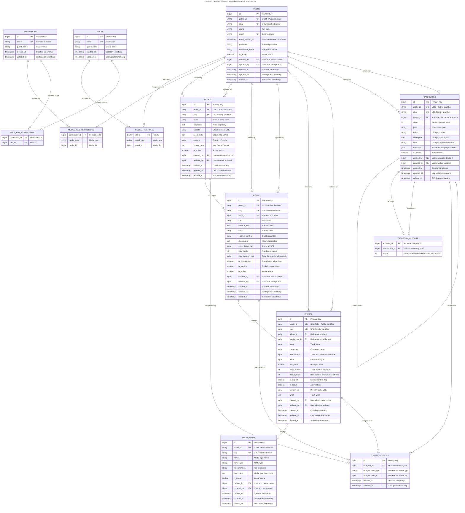

# Chinook Database Laravel Implementation Guide

## Table of Contents

- [1. Overview](#1-overview)
  - [1.1. Enterprise Features](#11-enterprise-features)
  - [1.2. Key Architectural Changes](#12-key-architectural-changes)
- [2. Getting Started](#2-getting-started)
  - [2.1. Prerequisites](#21-prerequisites)
  - [2.2. Quick Start](#22-quick-start)
  - [2.3. Implementation Roadmap](#23-implementation-roadmap)
- [3. Database Schema Overview](#3-database-schema-overview)
  - [3.1. Database Schema Diagram](#31-database-schema-diagram)
  - [3.2. Core Music Data](#32-core-music-data)
  - [3.3. RBAC and Authorization Tables](#33-rbac-and-authorization-tables)
  - [3.4. Customer Management](#34-customer-management)
  - [3.5. Sales System](#35-sales-system)
  - [3.6. Playlist System](#36-playlist-system)
- [4. Core Database Implementation](#4-core-database-implementation)
  - [4.1. Chinook Models Guide](#41-chinook-models-guide)
  - [4.2. Chinook Migrations Guide](#42-chinook-migrations-guide)
  - [4.3. Chinook Factories Guide](#43-chinook-factories-guide)
  - [4.4. Chinook Seeders Guide](#44-chinook-seeders-guide)
  - [4.5. Chinook Advanced Features Guide](#45-chinook-advanced-features-guide)
  - [4.6. Chinook Media Library Guide](#46-chinook-media-library-guide)
  - [4.7. Chinook Hierarchy Comparison Guide](#47-chinook-hierarchy-comparison-guide)
- [5. Filament 4 Admin Panel Implementation](#5-filament-4-admin-panel-implementation)
  - [5.1. Panel Setup & Configuration](#51-panel-setup--configuration)
  - [5.2. Model Standards & Architecture](#52-model-standards--architecture)
  - [5.3. Resource Development](#53-resource-development)
  - [5.4. Advanced Features & Widgets](#54-advanced-features--widgets)
  - [5.5. Testing & Quality Assurance](#55-testing--quality-assurance)
  - [5.6. Deployment & Production](#56-deployment--production)
  - [5.7. Visual Documentation & Diagrams](#57-visual-documentation--diagrams)
- [6. Frontend Development](#6-frontend-development)
  - [6.1. Frontend Architecture & Patterns](#61-frontend-architecture--patterns)
  - [6.2. Livewire/Volt Integration](#62-livewirevolt-integration)
  - [6.3. Performance & Accessibility](#63-performance--accessibility)
  - [6.4. Testing & CI/CD](#64-testing--cicd)
- [7. Laravel Package Integration](#7-laravel-package-integration)
  - [7.1. Essential Package Implementations](#71-essential-package-implementations)
- [8. Testing & Quality Assurance](#8-testing--quality-assurance)
  - [8.1. Core Testing Framework](#81-core-testing-framework)
  - [8.2. Specialized Testing](#82-specialized-testing)
  - [8.3. Testing Infrastructure](#83-testing-infrastructure)
- [9. Documentation Standards](#9-documentation-standards)
  - [9.1. Content Standards](#91-content-standards)
  - [9.2. Technical Standards](#92-technical-standards)
  - [9.3. Link Integrity Standards](#93-link-integrity-standards)
  - [9.4. Visual Documentation Standards](#94-visual-documentation-standards)
- [10. Implementation Checklist](#10-implementation-checklist)
  - [10.1. Core Features](#101-core-features)
  - [10.2. Database & Data](#102-database--data)
  - [10.3. Advanced Features](#103-advanced-features)
  - [10.4. Filament Admin Panel](#104-filament-admin-panel)
  - [10.5. Frontend Implementation](#105-frontend-implementation)
- [11. Support and Troubleshooting](#11-support-and-troubleshooting)
  - [11.1. Common Issues](#111-common-issues)
  - [11.2. Validation Steps](#112-validation-steps)
- [12. Contributing](#12-contributing)
- [13. Cross-References](#13-cross-references)
- [14. Navigation](#14-navigation)
- [15. Schema Resources](#15-schema-resources)
  - [15.1. Database Schema Files](#151-database-schema-files)
- [16. Database and Data](#16-database-and-data)
  - [16.1. Database Implementation Features](#161-database-implementation-features)
  - [16.2. Migration Strategy](#162-migration-strategy)
  - [16.3. Data Management](#163-data-management)
- [17. Key Relationships](#17-key-relationships)
  - [17.1. Core Music Relationships](#171-core-music-relationships)
  - [17.2. Hybrid Hierarchical Category Relationships](#172-hybrid-hierarchical-category-relationships)
  - [17.3. RBAC Relationships](#173-rbac-relationships)
  - [17.4. Sales and Customer Relationships](#174-sales-and-customer-relationships)
  - [17.5. Playlist and Employee Relationships](#175-playlist-and-employee-relationships)
- [18. Best Practices Covered](#18-best-practices-covered)
  - [18.1. Modern Model Design](#181-modern-model-design)
  - [18.2. Enhanced Migration Strategy](#182-enhanced-migration-strategy)
  - [18.3. Advanced Factory Patterns](#183-advanced-factory-patterns)
  - [18.4. Comprehensive Seeding Approach](#184-comprehensive-seeding-approach)

## 1. Overview

This comprehensive guide series provides step-by-step instructions for implementing an enterprise-grade Chinook database
schema using modern Laravel 12 tools and conventions. The Chinook database represents a sophisticated digital music
store with artists, albums, tracks, customers, employees, and sales data, enhanced with cutting-edge Laravel features
and enterprise-level capabilities.

### 1.1. Enterprise Features

**🚀 Enterprise Features Included:**

- **Role-Based Access Control (RBAC)**: Hierarchical permission system with granular controls
- **Hybrid Hierarchical Categories**: Advanced categorization system using closure table + adjacency list architecture
- **Timestamps**: Full `created_at` and `updated_at` support
- **Soft Deletes**: Safe deletion with `deleted_at` column
- **User Stamps**: Track who created/updated records with `created_by` and `updated_by`
- **Tags**: Spatie tags for flexible categorization and metadata
- **Secondary Unique Keys**: Public-facing identifiers using ULID/UUID/Snowflake
- **Slugs**: URL-friendly identifiers generated from `public_id`
- **Enhanced Data**: Rich metadata and business-relevant fields
- **Performance Optimization**: Caching, indexing, and query optimization strategies
- **API Authentication**: Laravel Sanctum integration with role-based endpoints

### 1.2. Key Architectural Changes

**🎯 Key Architectural Changes:**

- **REMOVED**: Genre model (replaced with polymorphic Category system)
- **ADDED**: Comprehensive Category model with hybrid closure table + adjacency list hierarchical structure
- **ADDED**: CategoryType enum with 7 category types (GENRE, MOOD, THEME, ERA, INSTRUMENT, LANGUAGE, OCCASION)
- **ADDED**: Role-based access control with 7 hierarchical roles
- **ADDED**: Granular permission system with 50+ permissions
- **ADDED**: Polymorphic categorizable relationships for all models
- **MODERNIZED**: Laravel 12 patterns including cast() method and modern syntax

## 2. Getting Started

### 2.1. Prerequisites

Before starting this guide series, ensure you have:

- Laravel 12+ installed and configured
- PHP 8.3+ with required extensions
- SQLite database configured with WAL mode optimization
- Basic understanding of Laravel's Eloquent ORM
- Familiarity with database relationships and constraints
- Understanding of hierarchical data patterns (closure table and adjacency list)

### 2.2. Quick Start

1. **Follow the guides in order**: Start with Models, then Migrations, Factories, and finally Seeders
2. **Test each step**: Verify each component works before moving to the next
3. **Use the examples**: All guides include practical examples and usage patterns
4. **Adapt as needed**: Modify the implementations to fit your specific requirements

### 2.3. Implementation Roadmap

**Phase 1: Core Database Foundation (Weeks 1-2)**

1. [Models Guide](010-chinook-models-guide.md) - Enterprise-grade Eloquent models
2. [Migrations Guide](020-chinook-migrations-guide.md) - Database schema with RBAC
3. [Factories Guide](030-chinook-factories-guide.md) - Advanced model factories
4. [Seeders Guide](040-chinook-seeders-guide.md) - Comprehensive data seeding

**Phase 2: Advanced Features & Architecture (Week 3)**

5. [Advanced Features Guide](050-chinook-advanced-features-guide.md) - RBAC and enterprise patterns
6. [Media Library Guide](060-chinook-media-library-guide.md) - File management integration
7. [Hierarchy Comparison Guide](070-chinook-hierarchy-comparison-guide.md) - Hierarchical data architecture

**Phase 3: Filament Admin Panel (Weeks 4-5)**

- [Panel Setup & Configuration](filament/setup/000-index.md) - Configuration and authentication
- [Model Standards](filament/models/000-index.md) - Laravel 12 model implementations
- [Resource Development](filament/resources/000-index.md) - CRUD operations and relationships
- [Advanced Features](filament/features/000-index.md) - Widgets and custom functionality

**Phase 4: Frontend Development (Week 6)**

12. [Frontend Architecture](frontend/000-frontend-index.md) - Livewire/Volt patterns and Flux UI
13. [Performance & Accessibility](frontend/) - WCAG 2.1 AA compliance
14. [Testing & CI/CD](frontend/) - Comprehensive testing strategies

**Phase 5: Production Deployment (Week 7)**

15. [Testing & QA](filament/testing/) - Quality assurance and validation
16. [Deployment](filament/deployment/150-performance-optimization-guide.md) - Production deployment and optimization
17. [Package Integration](packages/000-packages-index.md) - Essential Laravel packages

**Phase 6: Documentation & Maintenance (Week 8)**

18. [Visual Documentation](filament/diagrams/000-index.md) - Mermaid diagrams and DBML schemas
19. Performance optimization and monitoring setup
20. Final testing and production readiness validation

## 3. Database Schema Overview

The enterprise Chinook database consists of enhanced tables with RBAC and hybrid hierarchical categorization. The
following entity-relationship diagram illustrates the complete database structure with modern Laravel 12 features and
accessibility-compliant visual design.

### 3.1. Database Schema Diagram

This comprehensive ERD shows all tables, relationships, and the hybrid hierarchical architecture using WCAG 2.1 AA
compliant colors and patterns for optimal accessibility.

### 3.2. Core Music Data

The core music entities form the foundation of the Chinook database:

- **artists**: Musicians and bands with enhanced metadata and social links
- **albums**: Music albums with comprehensive release information
- **tracks**: Individual songs with detailed metadata and pricing
- **media_types**: File format specifications for digital media

### 3.3. RBAC and Authorization Tables

The Role-Based Access Control system provides enterprise-grade security:

- **users**: System users with enhanced profile information
- **roles**: Hierarchical role definitions (Super Admin → Admin → Manager → Editor → Customer Service → User → Guest)
- **permissions**: Granular permission system with 50+ specific permissions
- **model_has_roles**: User role assignments
- **model_has_permissions**: Direct user permissions
- **role_has_permissions**: Role permission assignments

### 3.4. Customer Management

Enhanced customer management with comprehensive business data:

- **customers**: Customer profiles with enhanced contact information and preferences
- **employees**: Staff management with hierarchical reporting structure

### 3.5. Sales System

Comprehensive sales and transaction management:

- **invoices**: Sales transactions with enhanced metadata
- **invoice_lines**: Individual line items with detailed pricing

### 3.6. Playlist System

- **playlists**: User-created music playlists with polymorphic categories
- **playlist_track**: Many-to-many relationship between playlists and tracks

## 4. Core Database Implementation

This section covers the foundational database implementation using modern Laravel 12 patterns, enterprise-grade
features, and hybrid hierarchical architecture.

### 4.1. Chinook Models Guide

**File**: [010-chinook-models-guide.md](010-chinook-models-guide.md)
**Purpose**: Create enterprise-grade Laravel Eloquent models with RBAC and hybrid hierarchical categories

**What You'll Learn**:

- **CategoryType Enum**: 7 category types replacing the old Genre system
- **Category Model**: Hybrid hierarchical polymorphic categorization system (closure table + adjacency list)
- **RBAC Integration**: Role and permission traits on all models
- **Polymorphic Relationships**: Category assignments to any model type
- **Secondary Unique Keys**: ULID/UUID/Snowflake implementation by model type
- **Advanced Model Features**: User stamps, soft deletes, tags, and slugs
- **Business Logic**: Scopes, accessors, and relationship methods

**Key Features**:

- **REMOVED**: Genre model (completely replaced)
- **ADDED**: Category model with hybrid hierarchical structure and polymorphic relationships
- **ADDED**: CategoryType enum with 7 types and helper methods
- **ADDED**: Role-based access control traits on all models
- **ENHANCED**: All models with polymorphic category relationships
- **ENHANCED**: Advanced querying capabilities with category filtering
- **MODERNIZED**: Laravel 12 cast() method and modern Eloquent patterns

### 4.2. Chinook Migrations Guide

**File**: [020-chinook-migrations-guide.md](020-chinook-migrations-guide.md)
**Purpose**: Create enterprise database migrations with RBAC and hybrid hierarchical categories

**What You'll Learn**:

- **Permission System Migrations**: Spatie Laravel Permission integration
- **Categories Table**: Hybrid hierarchical polymorphic categorization structure
- **Category Closure Table**: Efficient hierarchical data storage and querying
- **Categorizables Pivot**: Polymorphic many-to-many relationship table
- **Enhanced Indexing**: Performance optimization for hierarchical and polymorphic queries
- **RBAC Dependencies**: Proper migration order for permission system
- **Modern Columns**: Timestamps, soft deletes, user stamps, secondary keys

**Key Features**:

- **REMOVED**: genres table migration (completely replaced)
- **ADDED**: categories table with hybrid hierarchical and polymorphic support
- **ADDED**: category_closure table for efficient hierarchical queries
- **ADDED**: categorizables polymorphic pivot table
- **ADDED**: Permission system migrations integration
- **ENHANCED**: All model migrations with modern Laravel 12 features
- **ENHANCED**: Comprehensive indexing for hierarchical performance and RBAC

### 4.3. Chinook Factories Guide

**File**: [030-chinook-factories-guide.md](030-chinook-factories-guide.md)
**Purpose**: Create advanced model factories with RBAC and hybrid hierarchical categories

**What You'll Learn**:

- **CategoryFactory**: Hybrid hierarchical category data generation with realistic trees
- **Role Assignment**: User factories with realistic role distribution
- **Polymorphic Categories**: Automatic category assignment to all models
- **Enhanced Data Generation**: Rich metadata and business-relevant test data
- **Factory States**: Category-specific states (rock(), jazz(), energetic(), etc.)
- **Relationship Handling**: Complex polymorphic and hierarchical relationship creation

**Key Features**:

- **REMOVED**: GenreFactory (completely replaced)
- **ADDED**: CategoryFactory with hybrid hierarchical data generation
- **ADDED**: Role and permission assignment in User factory
- **ENHANCED**: All model factories with polymorphic category assignments
- **ENHANCED**: Realistic business data with hierarchical category relationships
- **ENHANCED**: Factory states for different category types and scenarios

### 4.4. Chinook Seeders Guide

**File**: [040-chinook-seeders-guide.md](040-chinook-seeders-guide.md)
**Purpose**: Create comprehensive seeders with RBAC and hybrid hierarchical categories

**What You'll Learn**:

- **PermissionSeeder**: Complete permission system with 50+ granular permissions
- **RoleSeeder**: Hierarchical role system with proper permission assignments
- **CategorySeeder**: Hybrid hierarchical category trees with realistic data
- **User Foundation**: System users for user stamps and role assignments
- **Polymorphic Seeding**: Category assignments to all Chinook models
- **Performance Optimization**: Efficient seeding strategies for hierarchical data and large datasets

**Key Features**:

- **REMOVED**: GenreSeeder (completely replaced)
- **ADDED**: PermissionSeeder with comprehensive permission structure
- **ADDED**: RoleSeeder with hierarchical role assignments
- **ADDED**: CategorySeeder with realistic hybrid hierarchical trees
- **ENHANCED**: All model seeders with polymorphic category assignments
- **ENHANCED**: User seeding with role assignments and system users

### 4.5. Chinook Advanced Features Guide

**File**: [050-chinook-advanced-features-guide.md](050-chinook-advanced-features-guide.md) ⭐ **NEW**
**Purpose**: Enterprise-level features including RBAC and hybrid hierarchical categories

**What You'll Learn**:

- **Role-Based Access Control**: Complete RBAC implementation with hierarchical roles
- **Permission System**: Granular permissions with 50+ specific permissions
- **Hybrid Category Management**: Advanced categorization patterns with closure table + adjacency list
- **Authorization Patterns**: Custom policies and complex business rules
- **Performance Optimization**: Caching strategies and hierarchical query optimization
- **API Authentication**: Laravel Sanctum integration with role-based endpoints
- **Testing Strategies**: Comprehensive testing for RBAC and hierarchical categories

**Key Features**:

- **Complete RBAC System**: 7 hierarchical roles with granular permissions
- **Advanced Category Management**: Hybrid hierarchical trees and polymorphic relationships
- **Performance Optimization**: Caching, indexing, and hierarchical query strategies
- **Enterprise Patterns**: Authorization, API authentication, and testing
- **Real-World Examples**: Production-ready implementations and Laravel 12 best practices

### 4.6. Chinook Media Library Guide

**File**: [060-chinook-media-library-guide.md](060-chinook-media-library-guide.md)
**Purpose**: Integrate Spatie Media Library with Chinook models and hierarchical categories

**What You'll Learn**:

- **Media Library Integration**: Seamless integration with existing Chinook models
- **Category-Based Media**: Media files categorized using the hybrid hierarchical system
- **Performance Optimization**: Efficient media storage and retrieval strategies
- **File Management**: Upload, conversion, and storage workflows
- **CDN Integration**: Content delivery network setup and optimization

**Key Features**:

- **HasMedia Trait Integration**: Works alongside Categorizable, Userstamps, and RBAC traits
- **Hierarchical Media Categories**: Media can be categorized using the existing CategoryType system
- **Multi-tier Storage**: Optimized storage strategy for music platform requirements
- **Queue Processing**: Background media conversion with progress tracking

### 4.7. Chinook Hierarchy Comparison Guide

**File**: [070-chinook-hierarchy-comparison-guide.md](070-chinook-hierarchy-comparison-guide.md)
**Purpose**: Comprehensive guide to hybrid hierarchical data management architecture

**What You'll Learn**:

- **Hybrid Architecture**: Combining closure table and adjacency list approaches
- **Performance Analysis**: When to use each hierarchical approach
- **Implementation Strategies**: Best practices for hybrid hierarchical data
- **Query Optimization**: Efficient querying patterns for different use cases
- **Migration Strategies**: Converting between hierarchical approaches

**Key Features**:

- **Write Performance**: Adjacency list for fast category updates and modifications
- **Read Performance**: Closure table for complex hierarchical queries and analytics
- **Flexibility**: Runtime selection of optimal approach based on operation type
- **Scalability**: Efficient handling of both deep hierarchies and frequent updates

## 5. Filament 4 Admin Panel Implementation

This section provides comprehensive documentation for building a production-ready Filament 4 admin panel named
`chinook-admin` with enterprise-grade features and WCAG 2.1 AA compliance.

### 5.1. Panel Setup & Configuration

**Directory**: [filament/setup/](filament/setup/000-index.md)
**Purpose**: Complete panel configuration, authentication, and RBAC integration

**What You'll Learn**:

- **Panel Registration**: Service provider setup and middleware configuration
- **Authentication System**: Native Filament auth with spatie/laravel-permission
- **RBAC Integration**: Hierarchical role structure with granular permissions
- **Navigation Configuration**: Menu structure and access control
- **Security Configuration**: Production-ready security settings
- **Environment Setup**: Development and production environment configuration
- **SQLite Optimization**: Database performance tuning for optimal admin panel performance

**Key Features**:

- **Dedicated Panel**: Separate admin panel with custom branding and configuration
- **Native Authentication**: Filament's built-in auth system with role-based access
- **Hierarchical Permissions**: 7-tier role structure with 50+ granular permissions
- **Security Hardening**: Production-ready security configurations and best practices

**Detailed Setup Guides**:

- **[Panel Configuration](filament/setup/010-panel-configuration.md)** - Panel registration and middleware setup
- **[Authentication Setup](filament/setup/020-authentication-setup.md)** - Authentication system configuration
- **[RBAC Integration](filament/setup/030-rbac-integration.md)** - Role-based access control setup
- **[Navigation Configuration](filament/setup/040-navigation-configuration.md)** - Menu structure and access control
- **[Security Configuration](filament/setup/050-security-configuration.md)** - Production security settings
- **[Environment Setup](filament/setup/060-environment-setup.md)** - Development and production environments
- **[SQLite Optimization](filament/setup/070-sqlite-optimization.md)** - Database performance tuning

### 5.2. Model Standards & Architecture

**Directory**: [filament/models/](filament/models/000-index.md)
**Purpose**: Laravel 12 model implementations with required traits and modern patterns

**What You'll Learn**:

- **Model Architecture**: Enterprise-grade model design with all required traits
- **Required Traits**: HasTags, HasSecondaryUniqueKey, HasSlug, Categorizable implementations
- **Hierarchical Models**: Hybrid closure table + adjacency list architecture
- **RBAC Integration**: Role and permission traits on all models
- **Performance Optimization**: Query optimization and relationship management

**Key Features**:

- **Modern Laravel 12 Syntax**: cast() method and current framework patterns
- **Comprehensive Trait Integration**: All enterprise features working together
- **Hybrid Hierarchical Architecture**: Optimal performance for both reads and writes
- **Production-Ready**: Scalable model design for enterprise applications

**Model Implementation Guides**:

- **[Model Architecture](filament/models/010-model-architecture.md)** - Enterprise model design patterns
- **[Required Traits](filament/models/020-required-traits.md)** - Trait integration and implementation
- **[Hierarchical Models](filament/models/050-hierarchical-models.md)** - Hybrid hierarchical model architecture

### 5.3. Resource Development

**Directory**: [filament/resources/](filament/resources/000-index.md)
**Purpose**: Detailed Filament resource configurations for all Chinook entities

**What You'll Learn**:

- **Resource Architecture**: Complete CRUD operations with relationship management
- **Form Design**: Advanced form components with validation and business rules
- **Table Configuration**: Optimized data tables with filtering and search
- **Relationship Managers**: Managing complex polymorphic and hierarchical relationships
- **Custom Actions**: Business-specific actions and bulk operations
- **Authorization**: Resource-level permissions and access control

**Key Features**:

- **Complete Coverage**: Resources for all 11 Chinook entities
- **Advanced Filtering**: Category-based filtering with hierarchical support
- **Relationship Management**: Polymorphic category assignments and hierarchical navigation
- **Performance Optimized**: Efficient queries and data loading strategies

**Resource Implementation Guides**:

- **[Artists Resource](filament/resources/010-artists-resource.md)** - Artist resource implementation
- **[Albums Resource](filament/resources/020-albums-resource.md)** - Album resource with relationships
- **[Tracks Resource](filament/resources/030-tracks-resource.md)** - Track resource with media integration
- **[Categories Resource](filament/resources/040-categories-resource.md)** - Hierarchical category resource

### 5.4. Advanced Features & Widgets

**Directory**: [filament/features/](filament/features/000-index.md)
**Purpose**: Widgets, custom pages, and advanced functionality

**What You'll Learn**:

- **Dashboard Configuration**: KPI dashboards with real-time analytics
- **Widget Development**: Custom widgets with Chart.js integration
- **Chart Integration**: Interactive charts and data visualization
- **Global Search**: Cross-resource search with weighted results
- **Custom Pages**: Employee hierarchy viewer, sales analytics, music discovery
- **Import/Export**: CSV/Excel with validation and error reporting

**Key Features**:

- **Real-Time Analytics**: Live dashboards with performance metrics
- **Interactive Charts**: Chart.js integration with accessibility features
- **Advanced Search**: Global search across all resources with relevance scoring
- **Business Intelligence**: Custom analytics pages for business insights

**Feature Implementation Guides**:

- **[Dashboard Configuration](filament/features/010-dashboard-configuration.md)** - Dashboard setup and KPI
  configuration
- **[Widget Development](filament/features/020-widget-development.md)** - Custom widget creation guide
- **[Chart Integration](filament/features/030-chart-integration.md)** - Chart.js integration and data visualization
- **[Global Search](filament/features/090-global-search.md)** - Cross-resource search implementation

### 5.5. Testing & Quality Assurance

**Directory**: [filament/testing/](filament/testing/000-index.md)
**Purpose**: Comprehensive testing strategies and quality assurance

**What You'll Learn**:

- **Testing Strategy**: Unit, feature, and browser testing approaches
- **Resource Testing**: Testing CRUD operations and business logic
- **Authentication Testing**: RBAC and permission testing
- **Performance Testing**: Load testing and optimization validation
- **Accessibility Testing**: WCAG 2.1 AA compliance verification

**Key Features**:

- **Comprehensive Coverage**: 80%+ test coverage targeting
- **Automated Testing**: CI/CD integration with automated test suites
- **Performance Validation**: Automated performance regression testing
- **Accessibility Compliance**: Automated accessibility testing and validation

**Filament Testing Guides**:

- **[Testing Strategy](filament/testing/010-testing-strategy.md)** - Filament testing approach
- **[Test Environment Setup](filament/testing/020-test-environment-setup.md)** - Test environment configuration
- **[Test Data Management](filament/testing/030-test-data-management.md)** - Test data for Filament resources
- **[CI Integration](filament/testing/040-ci-integration.md)** - Continuous integration setup
- **[Resource Testing](filament/testing/050-resource-testing.md)** - Testing Filament resources
- **[Form Testing](filament/testing/060-form-testing.md)** - Form validation and interaction testing
- **[Table Testing](filament/testing/070-table-testing.md)** - Table functionality testing
- **[Action Testing](filament/testing/080-action-testing.md)** - Custom action testing
- **[Auth Testing](filament/testing/090-auth-testing.md)** - Authentication testing
- **[RBAC Testing](filament/testing/100-rbac-testing.md)** - RBAC testing in Filament
- **[API Testing](filament/testing/110-api-testing.md)** - API endpoint testing
- **[Database Testing](filament/testing/120-database-testing.md)** - Database interaction testing
- **[Performance Testing](filament/testing/130-performance-testing.md)** - Performance testing strategies
- **[Browser Testing](filament/testing/140-browser-testing.md)** - Browser automation testing
- **[Accessibility Testing](filament/testing/150-accessibility-testing.md)** - WCAG 2.1 AA compliance testing
- **[Security Testing](filament/testing/160-security-testing.md)** - Security vulnerability testing

### 5.6. Deployment & Production

**Directory**: [filament/deployment/](filament/deployment/000-index.md)
**Purpose**: Production deployment and optimization strategies

**What You'll Learn**:

- **Production Environment**: Server configuration and deployment strategies
- **Performance Optimization**: Caching, indexing, and query optimization
- **Security Hardening**: Production security configurations
- **Monitoring Setup**: Application monitoring and error tracking
- **Backup Strategies**: Data backup and disaster recovery planning

**Key Features**:

- **Production-Ready**: Complete deployment documentation and scripts
- **Performance Optimized**: Comprehensive optimization strategies
- **Security Focused**: Enterprise-grade security configurations
- **Monitoring Integration**: Complete observability and alerting setup

**Deployment Guides**:

- **[Production Environment](filament/deployment/010-production-environment.md)** - Production server setup and
  configuration
- **[Performance Optimization](filament/deployment/050-performance-optimization.md)** - Performance tuning and
  optimization strategies

### 5.7. Visual Documentation & Diagrams

**Directory**: [filament/diagrams/](filament/diagrams/000-index.md)
**Purpose**: WCAG 2.1 AA compliant visual documentation with Mermaid diagrams

**What You'll Learn**:

- **Entity Relationship Diagrams**: Complete database schema visualization
- **System Architecture**: High-level system design and component relationships
- **Filament Panel Architecture**: Admin panel structure and navigation flow
- **DBML Schema Files**: Complete database schema definition
- **Process Flow Diagrams**: Business process and workflow documentation

**Key Features**:

- **WCAG 2.1 AA Compliant**: 4.5:1 contrast ratios and accessibility features
- **Mermaid v10.6+ Syntax**: Modern diagram syntax with semantic styling
- **Comprehensive Coverage**: All system components and relationships documented
- **Tool Integration**: Compatible with dbdiagram.io and DBML CLI tools

**Diagram Implementation Guides**:

- **[Entity Relationship Diagrams](filament/diagrams/010-entity-relationship-diagrams.md)** - Detailed ERD documentation
- **[System Architecture](filament/diagrams/050-system-architecture.md)** - System architecture diagrams
- **[Filament Panel Architecture](filament/diagrams/060-filament-panel-architecture.md)** - Panel structure and
  navigation flow

## 6. Frontend Development

This section covers modern frontend development using Livewire/Volt functional patterns, Flux UI integration, and
comprehensive accessibility compliance.

### 6.1. Frontend Architecture & Patterns

**Directory**: [frontend/](frontend/000-frontend-index.md)
**Purpose**: Modern frontend architecture with Livewire/Volt and Flux UI integration

**What You'll Learn**:

- **Architecture Overview**: Component-based architecture with functional patterns
- **Volt Functional Patterns**: Modern Livewire/Volt functional component development
- **Flux Component Integration**: Seamless UI component integration
- **SPA Navigation**: Single-page application behavior with seamless navigation
- **State Management**: Client-side state management patterns

**Key Features**:

- **Functional Components**: Livewire/Volt functional-based components over class-based
- **Modern UI**: Flux UI integration with consistent design system
- **SPA Behavior**: Seamless navigation without full page reloads
- **Performance Optimized**: Efficient component loading and state management

**Detailed Frontend Guides**:

- **[Frontend Architecture Overview](frontend/100-frontend-architecture-overview.md)** - Architecture overview and
  patterns
- **[Volt Functional Patterns Guide](frontend/110-volt-functional-patterns-guide.md)** - Livewire/Volt functional
  patterns
- **[Flux Component Integration Guide](frontend/120-flux-component-integration-guide.md)** - Flux UI component
  integration
- **[SPA Navigation Guide](frontend/130-spa-navigation-guide.md)** - Single-page application navigation
- **[Accessibility WCAG Guide](frontend/140-accessibility-wcag-guide.md)** - WCAG 2.1 AA compliance implementation
- **[Performance Optimization Guide](frontend/150-performance-optimization-guide.md)** - Performance optimization
  strategies
- **[Testing Approaches Guide](frontend/160-testing-approaches-guide.md)** - Frontend testing strategies
- **[Performance Monitoring Guide](frontend/170-performance-monitoring-guide.md)** - Performance monitoring and
  optimization
- **[API Testing Guide](frontend/180-api-testing-guide.md)** - Frontend API integration testing
- **[CI/CD Integration Guide](frontend/190-cicd-integration-guide.md)** - CI/CD pipeline integration

### 6.2. Livewire/Volt Integration

**Directory**: [frontend/](frontend/000-frontend-index.md)
**Purpose**: Advanced Livewire/Volt patterns and integration strategies

**What You'll Learn**:

- **Functional Component Patterns**: Modern Volt functional component development
- **State Management**: Efficient state handling and data flow
- **Event Handling**: Component communication and event management
- **Performance Optimization**: Lazy loading and efficient updates
- **Testing Approaches**: Component testing strategies and best practices

**Key Features**:

- **Modern Patterns**: Latest Livewire/Volt functional patterns
- **Efficient Updates**: Optimized DOM updates and state synchronization
- **Component Communication**: Event-driven architecture for component interaction
- **Testing Coverage**: Comprehensive component testing strategies

### 6.3. Performance & Accessibility

**Directory**: [frontend/](frontend/000-frontend-index.md)
**Purpose**: Performance optimization and WCAG 2.1 AA accessibility compliance

**What You'll Learn**:

- **WCAG 2.1 AA Compliance**: Complete accessibility implementation guide
- **Performance Optimization**: Frontend performance tuning and monitoring
- **Performance Monitoring**: Real-time performance tracking and optimization
- **Accessibility Testing**: Automated and manual accessibility testing approaches

**Key Features**:

- **WCAG 2.1 AA Compliant**: 4.5:1 contrast ratios and screen reader support
- **Performance Optimized**: Comprehensive performance optimization strategies
- **Monitoring Integration**: Real-time performance and accessibility monitoring
- **Automated Testing**: Continuous accessibility and performance validation

### 6.4. Testing & CI/CD

**Directory**: [frontend/](frontend/000-frontend-index.md)
**Purpose**: Comprehensive testing strategies and CI/CD integration

**What You'll Learn**:

- **Testing Approaches**: Unit, integration, and end-to-end testing strategies
- **API Testing**: Frontend API integration testing
- **Performance Monitoring**: Continuous performance monitoring and optimization
- **CI/CD Integration**: Automated testing and deployment pipelines

**Key Features**:

- **Comprehensive Testing**: Multi-layer testing strategy for frontend components
- **Automated Pipelines**: CI/CD integration with automated testing and deployment
- **Performance Validation**: Continuous performance monitoring and regression testing
- **Quality Assurance**: Automated quality checks and validation

## 7. Laravel Package Integration

This section provides comprehensive implementation guides for essential Laravel packages and tools that enhance the
Chinook implementation.

### 7.1. Essential Package Implementations

**Directory**: [packages/](packages/000-packages-index.md)
**Purpose**: Comprehensive implementation guides for essential Laravel packages and tools

**What You'll Learn**:

- **Package Integration**: Step-by-step installation and configuration
- **Performance Optimization**: Best practices for production environments
- **Security Considerations**: Authentication, authorization, and data protection
- **Monitoring & Debugging**: Tools for application health and performance tracking
- **API Development**: Modern API patterns with authentication and transformation
- **Background Processing**: Queue management and job monitoring
- **Data Management**: Backup strategies and data transformation patterns

**Key Features**:

- **Production-Ready**: Real-world configuration examples and deployment strategies
- **Laravel 12 Modern Syntax**: All examples use current Laravel patterns and conventions
- **WCAG 2.1 AA Compliance**: Accessible documentation with proper contrast and navigation
- **Comprehensive Coverage**: Installation, configuration, optimization, and troubleshooting
- **Integration Examples**: How packages work together in enterprise applications

**Package Coverage**:

- **[Laravel Backup Guide](packages/010-laravel-backup-guide.md)**: Automated backup strategies and disaster recovery
- **[Laravel Pulse Guide](packages/020-laravel-pulse-guide.md)**: Application performance monitoring and analytics
- **[Laravel Telescope Guide](packages/030-laravel-telescope-guide.md)**: Debug and development tools integration
- **[Laravel Octane FrankenPHP Guide](packages/040-laravel-octane-frankenphp-guide.md)**: High-performance application
  server setup
- **[Laravel Horizon Guide](packages/050-laravel-horizon-guide.md)**: Queue monitoring and management
- **[Laravel Data Guide](packages/060-laravel-data-guide.md)**: Data transformation and validation patterns
- **[Laravel Fractal Guide](packages/070-laravel-fractal-guide.md)**: API response transformation
- **[Laravel Sanctum Guide](packages/080-laravel-sanctum-guide.md)**: API authentication and token management
- **[Spatie Tags Guide](packages/090-spatie-tags-guide.md)**: Flexible tagging and categorization for Eloquent models
- **[Spatie Media Library Guide](packages/100-spatie-media-library-guide.md)**: Media file management and model
  integration
- **[Spatie Permission Guide](packages/110-spatie-permission-guide.md)**: Role-based access control and permissions
- **[Spatie Activitylog Guide](packages/120-spatie-activitylog-guide.md)**: Audit logging and activity tracking
- **[Spatie Laravel Settings Guide](packages/130-spatie-laravel-settings-guide.md)**: Application settings management
- **[Spatie Laravel Query Builder Guide](packages/140-spatie-laravel-query-builder-guide.md)**: Advanced API query
  filtering and sorting
- **[Spatie Laravel Translatable Guide](packages/150-spatie-laravel-translatable-guide.md)**: Multilingual content and
  translation support
- **[Laravel WorkOS Guide](packages/090-laravel-workos-guide.md)**: WorkOS integration for authentication
- **[Laravel Query Builder Guide](packages/100-laravel-query-builder-guide.md)**: Advanced query building patterns
- **[Spatie Comments Guide](packages/110-spatie-comments-guide.md)**: Comment system implementation
- **[Laravel Folio Guide](packages/120-laravel-folio-guide.md)**: Page-based routing with Folio
- **[Nnjeim World Guide](packages/130-nnjeim-world-guide.md)**: World data (countries, cities, etc.)
- **[Laravel Optimize Database Guide](packages/140-laravel-optimize-database-guide.md)**: Database optimization tools

**Package Testing**:

- **[Package Testing Index](packages/testing/000-testing-index.md)**: Package testing overview
- **[Pest Testing Guide](packages/testing/010-pest-testing-guide.md)**: Pest testing framework integration

## 8. Testing & Quality Assurance

This comprehensive testing section covers all aspects of testing the Chinook implementation, from unit tests to
accessibility compliance, providing a complete testing framework for enterprise-grade applications.

### 8.1. Core Testing Framework

**Directory**: [testing/](testing/000-testing-index.md)
**Purpose**: Comprehensive testing strategies and quality assurance framework

**What You'll Learn**:

- **Testing Architecture**: Complete testing framework overview and patterns
- **Unit Testing**: Strategies and examples for model and service testing
- **Feature Testing**: End-to-end feature testing implementation
- **Integration Testing**: Cross-component integration testing approaches
- **Test Data Management**: Factories, seeders, and test database strategies
- **RBAC Testing**: Role-based access control testing patterns
- **Trait Testing**: Testing model traits and behaviors
- **Hierarchical Data Testing**: Testing hierarchical category systems
- **Performance Testing**: Load testing and optimization validation

**Key Features**:

- **Comprehensive Coverage**: 80%+ test coverage targeting across all components
- **Modern Testing Patterns**: Laravel 12 testing best practices and Pest integration
- **RBAC Integration**: Complete testing of role-based access control
- **Hierarchical Testing**: Specialized testing for hybrid hierarchical data
- **Performance Validation**: Automated performance regression testing

**Core Testing Files**:

- **[Testing Index](testing/000-testing-index.md)** - Testing framework overview and strategy
- **[Test Architecture Overview](testing/010-test-architecture-overview.md)** - Testing architecture and patterns
- **[Unit Testing Guide](testing/020-unit-testing-guide.md)** - Unit testing strategies and examples
- **[Feature Testing Guide](testing/030-feature-testing-guide.md)** - Feature testing implementation
- **[Integration Testing Guide](testing/040-integration-testing-guide.md)** - Integration testing approaches
- **[Test Data Management](testing/050-test-data-management.md)** - Test data factories and seeders
- **[RBAC Testing Guide](testing/060-rbac-testing-guide.md)** - Role-based access control testing
- **[Trait Testing Guide](testing/070-trait-testing-guide.md)** - Testing model traits and behaviors
- **[Hierarchical Data Testing](testing/080-hierarchical-data-testing.md)** - Testing hierarchical category systems
- **[Performance Testing Guide](testing/090-performance-testing-guide.md)** - Performance and load testing

### 8.2. Specialized Testing

**Directory**: [testing/](testing/000-testing-index.md)
**Purpose**: Specialized testing approaches for complex enterprise features

**Testing Infrastructure**:

- **[Test Architecture Diagrams](testing/diagrams/test-architecture-diagrams.md)** - Testing architecture visualization
- **[Testing Index System](testing/index/testing-index-system.md)** - Testing index and organization
- **[Documentation Quality Validation](testing/quality/documentation-quality-validation.md)** - Documentation quality
  assurance

### 8.3. Testing Infrastructure

**Directory**: [packages/testing/](packages/testing/000-testing-index.md)
**Purpose**: Package-specific testing strategies and Pest integration

**Package Testing**:

- **[Package Testing Index](packages/testing/000-testing-index.md)** - Package testing overview
- **[Pest Testing Guide](packages/testing/010-pest-testing-guide.md)** - Pest testing framework integration

## 9. Documentation Standards

All guides in this series follow enterprise-level documentation standards to ensure consistency, accessibility, and
maintainability across the entire Chinook implementation.

### 9.1. Content Standards

- **Consistent Terminology**: "Hybrid hierarchical" for closure table + adjacency list architecture
- **Modern Laravel 12 Patterns**: All code examples use current Laravel 12 syntax and best practices
- **Comprehensive TOCs**: Each guide includes a detailed table of contents with proper linking
- **Standardized Structure**: Consistent heading hierarchy and section organization
- **Cross-References**: Proper linking between related concepts across guides
- **Code Quality**: All examples are production-ready and follow Laravel conventions
- **Business Context**: Real-world examples and practical implementation scenarios

### 9.2. Technical Standards

- **Laravel 12 Modern Syntax**: cast() method over $casts property for all models
- **Enterprise Patterns**: Comprehensive trait integration and modern architectural patterns
- **Performance Focus**: Query optimization and scalability considerations in all examples
- **Security Best Practices**: RBAC integration and security-first approach
- **Testing Integration**: Test examples and coverage strategies included
- **Production Readiness**: All code examples suitable for production deployment

### 9.3. Link Integrity Standards

- **Internal Navigation**: Comprehensive cross-linking between related sections
- **External References**: Validated links to official Laravel and package documentation
- **File Path Accuracy**: All file paths verified and tested for accuracy
- **Anchor Link Validation**: All internal anchor links tested for proper navigation
- **Cross-Guide References**: Proper linking between guides in the series

### 9.4. Visual Documentation Standards

All visual elements in this guide series adhere to enterprise-level standards:

#### 9.4.1. Accessibility Compliance

All documentation and visual elements in this guide series adhere to WCAG 2.1 AA accessibility standards to ensure
inclusive access for all users.

#### WCAG 2.1 AA Requirements

- **Color Contrast**: Minimum 4.5:1 contrast ratios for all text and visual elements
- **Color Independence**: No reliance on red-green color combinations; uses blue/orange patterns for differentiation
- **Screen Reader Support**: Descriptive comments and semantic markup within all diagrams
- **Theme Compatibility**: Readable in both light and dark themes
- **Semantic Design**: Consistent use of shapes and colors with meaningful associations
- **Keyboard Navigation**: All interactive elements accessible via keyboard navigation
- **Alternative Text**: Comprehensive alt-text for all visual elements and diagrams

#### Approved Color Palette

The following high-contrast color palette ensures WCAG 2.1 AA compliance across all visual documentation:

- **Primary Blue**: #1976d2 (7.04:1 contrast ratio) - Used for primary elements and navigation
- **Success Green**: #388e3c (6.74:1 contrast ratio) - Used for success states and positive actions
- **Warning Orange**: #f57c00 (4.52:1 contrast ratio) - Used for warnings and important notices
- **Error Red**: #d32f2f (5.25:1 contrast ratio) - Used for errors and critical alerts
- **Neutral Gray**: #37474f (9.54:1 contrast ratio) - Used for secondary text and borders

#### Accessibility Testing

- **Automated Testing**: All documentation validated using accessibility testing tools
- **Screen Reader Testing**: Manual testing with NVDA, JAWS, and VoiceOver
- **Keyboard Navigation**: Complete keyboard accessibility validation
- **Color Contrast Validation**: Automated contrast ratio verification
- **Semantic Markup**: HTML5 semantic elements and ARIA labels where appropriate

### Mermaid Diagram Standards

- **Syntax Compliance**: All diagrams use Mermaid v10.6+ syntax and features
- **Validation**: Tested with Mermaid CLI and Live Editor for syntax correctness
- **Semantic Styling**: Consistent color schemes across all diagram types using WCAG 2.1 AA compliant colors
    - **Start/End**: Light blue (#e3f2fd) with primary blue (#1976d2)
    - **Process**: Light blue (#e3f2fd) with primary blue (#1976d2)
    - **Decision**: Light orange (#fff3e0) with warning orange (#f57c00)
    - **Success**: Light green (#e8f5e8) with success green (#388e3c)
    - **Error**: Light red (#ffebee) with error red (#d32f2f)
- **Descriptive Titles**: All diagrams include meaningful titles using `---` syntax
- **Alt-Text**: Comments within Mermaid code provide screen reader descriptions

### Database Schema Documentation

- **DBML Compliance**: Complete schema definition using DBML v2.6+ syntax
- **Comprehensive Coverage**: All tables, relationships, constraints, and indexes documented
- **Business Context**: Detailed comments explaining hybrid hierarchical architecture
- **Tool Integration**: Compatible with dbdiagram.io and DBML CLI tools
- **SQL Generation**: Supports automated SQL generation for multiple database systems

### Process Flow Documentation

- **Complete Workflows**: End-to-end process documentation for all major system functions
- **Accessibility Focus**: Clear visual hierarchy and semantic node identification
- **Business Alignment**: Diagrams reflect real-world business processes and user journeys
- **Technical Accuracy**: All flows validated against actual implementation patterns
- **Cross-Reference Integration**: Proper linking to related documentation sections

### Quality Assurance Validation

✅ **Mermaid Syntax**: All diagrams validated using Mermaid Live Editor
✅ **DBML Syntax**: Schema definition validated using dbdiagram.io
✅ **Accessibility**: Color contrast and semantic design verified
✅ **Cross-Platform**: Rendering tested in GitHub and common Markdown viewers
✅ **Screen Reader**: Alt-text and semantic markup validated
✅ **Consistency**: Terminology and styling standardized across all visual elements

## 10. Implementation Checklist

### 10.1. Core Features

- [ ] **Enterprise Models Created**: All 11 Eloquent models with RBAC and polymorphic categories
- [ ] **Category System Active**: Polymorphic categorization replacing Genre model
- [ ] **RBAC Implemented**: Role-based access control with hierarchical permissions
- [ ] **Secondary Keys Working**: ULID/UUID/Snowflake generation and routing
- [ ] **Slugs Functional**: URL-friendly identifiers for all models
- [ ] **User Stamps Active**: Audit trails tracking who created/updated records
- [ ] **Tags Integrated**: Spatie tags working for categorization
- [ ] **Soft Deletes Enabled**: Safe deletion functionality across all models

### 10.2. Database & Data

- [ ] **Migrations Complete**: Database schema with RBAC and polymorphic tables
- [ ] **Permission System**: Roles and permissions tables with proper relationships
- [ ] **Factories Enhanced**: Realistic data generation with categories and roles
- [ ] **Seeders Comprehensive**: Database populated with hierarchical categories and roles
- [ ] **Relationships Tested**: All polymorphic and RBAC relationships working correctly
- [ ] **Data Integrity Verified**: Foreign key constraints and business rules enforced

### 10.3. Advanced Features

- [ ] **Authorization Working**: Policy-based authorization across all controllers
- [ ] **API Authentication**: Laravel Sanctum with role-based token scopes
- [ ] **Performance Optimized**: Caching strategies for categories and permissions
- [ ] **Testing Coverage**: Comprehensive tests for RBAC and category functionality

### 10.4. Filament Admin Panel

- [ ] **Panel Configuration**: Dedicated `chinook-admin` panel with proper middleware
- [ ] **Authentication System**: Native Filament auth with spatie/laravel-permission
- [ ] **RBAC Integration**: Hierarchical roles with granular permissions
- [ ] **Resource Implementation**: All 11 Chinook entities with CRUD operations
- [ ] **Relationship Managers**: Complex polymorphic and hierarchical relationships
- [ ] **Advanced Widgets**: Real-time analytics and KPI dashboards
- [ ] **Custom Pages**: Employee hierarchy, sales analytics, music discovery
- [ ] **Global Search**: Cross-resource search with weighted results
- [ ] **Import/Export**: CSV/Excel with validation and error reporting
- [ ] **WCAG 2.1 AA Compliance**: Accessibility features and contrast ratios

### 10.5. Frontend Implementation

- [ ] **Architecture Setup**: Component-based architecture with functional patterns
- [ ] **Livewire/Volt Integration**: Functional components over class-based
- [ ] **Flux UI Integration**: Consistent design system and component library
- [ ] **SPA Navigation**: Seamless navigation without full page reloads
- [ ] **State Management**: Efficient client-side state handling
- [ ] **Performance Optimization**: Lazy loading and efficient updates
- [ ] **WCAG 2.1 AA Compliance**: 4.5:1 contrast ratios and screen reader support
- [ ] **Testing Coverage**: Unit, integration, and end-to-end testing
- [ ] **CI/CD Integration**: Automated testing and deployment pipelines

## 11. Support and Troubleshooting

### 11.1. Common Issues

1. **Foreign Key Constraint Errors**: Ensure you're following the proper seeding order
2. **Migration Rollback Issues**: Check foreign key dependencies before rolling back
3. **Factory Relationship Errors**: Verify related models exist before creating relationships
4. **Performance Issues**: Use data recycling in factories and chunking in seeders

### 11.2. Validation Steps

1. **Test Model Relationships**: Use `php artisan tinker` to verify relationships work
2. **Check Migration Status**: Run `php artisan migrate:status` to verify all migrations
3. **Validate Seeded Data**: Query the database to ensure referential integrity
4. **Performance Testing**: Monitor query performance with indexed relationships

## 12. Contributing

When extending or modifying these implementations:

1. **Follow Modern Laravel Conventions**: Maintain consistency with Laravel's latest naming and structure conventions
2. **Preserve Modern Features**: Ensure any changes maintain secondary keys, slugs, user stamps, and tags functionality
3. **Maintain Relationships**: Ensure any changes preserve the integrity of model relationships and business logic
4. **Update Documentation**: Keep guides current with any implementation changes and modern feature additions
5. **Test Comprehensively**: Verify all modern features work together after modifications
6. **Consider Performance**: Ensure changes don't negatively impact secondary key generation or slug performance
7. **Validate User Stamps**: Test that audit trails continue to work correctly
8. **Check Tags Integration**: Verify that tagging functionality remains intact
9. **Maintain Hierarchical Consistency**: Ensure hybrid hierarchical data patterns remain consistent across all
   implementations
10. **Accessibility Compliance**: Ensure all changes maintain WCAG 2.1 AA compliance standards
11. **Documentation Standards**: Follow established documentation patterns and cross-referencing guidelines

## 13. Cross-References

This comprehensive guide series integrates with and references multiple related documentation sections throughout the
project. Understanding these connections helps ensure proper implementation and maintenance.

### Related Documentation Sections

#### Core Laravel Implementation

- **[Chinook Models Guide](010-chinook-models-guide.md)** - Modern Eloquent patterns and best practices
- **[Chinook Migrations Guide](020-chinook-migrations-guide.md)** - Database migration patterns and conventions
- **[Chinook Factories Guide](030-chinook-factories-guide.md)** - Advanced factory patterns for testing
- **[Chinook Seeders Guide](040-chinook-seeders-guide.md)** - Database seeding and data management

#### Enterprise Features

- **[Chinook Advanced Features Guide](050-chinook-advanced-features-guide.md)** - Role-based access control patterns
- **[Chinook Hierarchy Comparison Guide](070-chinook-hierarchy-comparison-guide.md)** - Hierarchical data management
  strategies
- **[Chinook Advanced Features Guide](050-chinook-advanced-features-guide.md)** - Query optimization and caching
  strategies
- **[Filament Security Configuration](filament/setup/050-security-configuration.md)** - Enterprise security
  implementation

#### Filament Integration

- **[Filament Panel Overview](filament/README.md)** - General Filament implementation patterns
- **[Filament Panel Architecture](filament/diagrams/060-filament-panel-architecture.md)** - Panel design and structure
- **[Filament Resources Index](filament/resources/000-index.md)** - Resource implementation patterns
- **[Filament Features Index](filament/features/000-index.md)** - Custom widget creation

#### Frontend Development

- **[Volt Functional Patterns Guide](frontend/110-volt-functional-patterns-guide.md)** - Modern Livewire development
  patterns
- **[Flux Component Integration Guide](frontend/120-flux-component-integration-guide.md)** - UI component integration
  strategies
- **[Accessibility WCAG Guide](frontend/140-accessibility-wcag-guide.md)** - WCAG 2.1 AA compliance implementation
- **[Performance Optimization Guide](frontend/150-performance-optimization-guide.md)** - Frontend performance strategies

#### Package Integration

- **[Essential Packages Index](packages/000-packages-index.md)** - Package selection and integration
- **[Spatie Permission Guide](packages/110-spatie-permission-guide.md)** - Spatie package implementation patterns
- **[Laravel Pulse Guide](packages/020-laravel-pulse-guide.md)** - Application monitoring and observability
- **[Testing Documentation](testing/000-testing-index.md)** - Comprehensive testing approaches

### Implementation Dependencies

Understanding the dependency relationships between different components helps ensure proper implementation order:

1. **Core Database** → **RBAC System** → **Filament Panel**
2. **Model Architecture** → **Resource Development** → **Advanced Features**
3. **Authentication Setup** → **Permission System** → **Authorization Policies**
4. **Frontend Architecture** → **Component Development** → **Performance Optimization**

### Cross-Guide Navigation

Each guide in this series includes navigation elements that connect to related concepts:

- **Previous/Next Navigation**: Sequential guide progression
- **Related Concepts**: Links to related topics in other guides
- **Implementation Examples**: Cross-references to practical examples
- **Troubleshooting**: Links to relevant troubleshooting sections
- **Best Practices**: References to established patterns and conventions

## 14. Navigation

### Quick Access Links

#### Core Database Implementation

- **[Models Guide](010-chinook-models-guide.md)** - Enterprise-grade Laravel Eloquent models
- **[Migrations Guide](020-chinook-migrations-guide.md)** - Database schema with RBAC
- **[Factories Guide](030-chinook-factories-guide.md)** - Advanced model factories
- **[Seeders Guide](040-chinook-seeders-guide.md)** - Comprehensive data seeding
- **[Advanced Features Guide](050-chinook-advanced-features-guide.md)** - RBAC and enterprise patterns
- **[Media Library Guide](060-chinook-media-library-guide.md)** - File management integration
- **[Hierarchy Comparison Guide](070-chinook-hierarchy-comparison-guide.md)** - Hierarchical architecture

#### Filament 4 Admin Panel

- **[Setup & Configuration](filament/setup/)** - Panel configuration and authentication
- **[Model Standards](filament/models/)** - Laravel 12 model implementations
- **[Resource Development](filament/resources/)** - CRUD operations and relationships
- **[Advanced Features](filament/features/)** - Widgets and custom functionality
- **[Testing & QA](filament/testing/)** - Quality assurance strategies
- **[Deployment](filament/deployment/)** - Production deployment
- **[Visual Documentation](filament/diagrams/)** - Mermaid diagrams and DBML

#### Frontend Development

- **[Frontend Architecture](frontend/)** - Livewire/Volt patterns and Flux UI
- **[Performance & Accessibility](frontend/)** - WCAG 2.1 AA compliance
- **[Testing & CI/CD](frontend/)** - Comprehensive testing strategies

#### Package Integration

- **[Essential Packages](packages/)** - Laravel package implementations

#### Testing & Quality Assurance

- **[Testing Framework](testing/000-testing-index.md)** - Comprehensive testing strategies
- **[Core Testing](testing/010-test-architecture-overview.md)** - Testing architecture and patterns
- **[Specialized Testing](testing/060-rbac-testing-guide.md)** - RBAC and hierarchical testing
- **[Package Testing](packages/testing/000-testing-index.md)** - Package testing strategies

### Schema Resources

- **[DBML Schema](chinook-schema.dbml)** - Complete database schema definition
- **[SQL Schema](chinook.sql)** - SQL implementation reference

### External References

- **[Laravel 12 Documentation](https://laravel.com/docs)** - Official Laravel documentation
- **[Filament 4 Documentation](https://filamentphp.com/docs)** - Official Filament documentation
- **[Spatie Laravel Permission](https://spatie.be/docs/laravel-permission)** - RBAC package documentation
- **[WCAG 2.1 Guidelines](https://www.w3.org/WAI/WCAG21/quickref/)** - Accessibility compliance reference

## 15. Schema Resources

### 15.1. Database Schema Files

- **[DBML Schema](chinook-schema.dbml)** - Complete database schema definition in DBML format for use with dbdiagram.io and DBML CLI tools
- **[SQL Schema](chinook.sql)** - Production-ready SQL implementation with all tables, indexes, constraints, and relationships
- **[Documentation Audit Report](reports/COMPREHENSIVE_DOCUMENTATION_AUDIT_REPORT.md)** - Documentation quality assessment and audit findings for the entire Chinook implementation

## 16. Database and Data

### 16.1. Database Implementation Features

The Chinook implementation showcases modern Laravel 12 database patterns and enterprise-grade features:

- **Hybrid Hierarchical Architecture**: Combines closure table and adjacency list patterns for optimal performance
- **RBAC Integration**: Comprehensive role-based access control with Spatie Laravel Permission
- **Modern Model Patterns**: Laravel 12 cast() method, user stamps, soft deletes, and secondary unique keys
- **Performance Optimization**: Strategic indexing, query optimization, and caching strategies

### 16.2. Migration Strategy

- **Incremental Migrations**: Step-by-step database evolution with rollback support
- **Index Optimization**: Strategic index placement for query performance
- **Constraint Management**: Foreign key relationships and data integrity enforcement
- **Seeding Strategy**: Comprehensive data seeding with realistic test data

### 16.3. Data Management

- **Factory Patterns**: Advanced model factories for testing and development
- **Seeder Architecture**: Hierarchical data seeding with dependency management
- **Data Validation**: Comprehensive validation rules and business logic enforcement
- **Audit Trails**: Activity logging and change tracking throughout the system

## 17. Key Relationships

### 17.1. Core Music Relationships

- **Artists → Albums**: One-to-many relationship with cascade handling
- **Albums → Tracks**: One-to-many with media file associations
- **Tracks → Playlists**: Many-to-many through pivot table with ordering
- **Genres → Tracks**: Many-to-many categorization system

### 17.2. Hybrid Hierarchical Category Relationships

- **Categories**: Self-referencing hierarchy with closure table optimization
- **Categorizables**: Polymorphic many-to-many for flexible categorization
- **Category Types**: Enum-based category classification (GENRE, MOOD, THEME, etc.)
- **Tree Operations**: Efficient ancestor/descendant queries and tree manipulation

### 17.3. RBAC Relationships

- **Users → Roles**: Many-to-many with Spatie Permission integration
- **Roles → Permissions**: Many-to-many with granular permission system
- **Model Policies**: Resource-based authorization with hierarchical inheritance
- **Guard Integration**: Multi-guard authentication with panel separation

### 17.4. Sales and Customer Relationships

- **Customers → Invoices**: One-to-many with comprehensive billing history
- **Invoices → Invoice Lines**: One-to-many with detailed line item tracking
- **Tracks → Invoice Lines**: Many-to-many through sales transactions
- **Customer Support**: Employee assignment and support ticket management

### 17.5. Playlist and Employee Relationships

- **Employees → Customers**: Support assignment and customer relationship management
- **Playlists → Users**: Ownership and sharing permissions
- **Playlist Tracks**: Ordered many-to-many with position tracking
- **Employee Hierarchy**: Self-referencing employee management structure

## 18. Best Practices Covered

### 18.1. Modern Model Design

- **Laravel 12 Patterns**: cast() method implementation over legacy $casts property
- **Trait Integration**: HasTags, HasSecondaryUniqueKey, HasSlug, and custom traits
- **User Stamps**: Automatic created_by and updated_by tracking
- **Soft Deletes**: Comprehensive soft delete implementation with restoration capabilities

### 18.2. Enhanced Migration Strategy

- **Strategic Indexing**: Performance-optimized index placement and composite indexes
- **Foreign Key Management**: Proper constraint handling with cascade options
- **Data Integrity**: Check constraints and validation at the database level
- **Migration Testing**: Comprehensive migration testing with rollback verification

### 18.3. Advanced Factory Patterns

- **Realistic Data Generation**: Context-aware fake data that maintains referential integrity
- **State Management**: Factory states for different testing scenarios
- **Relationship Factories**: Automated relationship creation with proper dependencies
- **Performance Factories**: Optimized factories for large dataset generation

### 18.4. Comprehensive Seeding Approach

- **Hierarchical Seeding**: Dependency-aware seeding order with proper relationship handling
- **Environment-Specific Data**: Different seeding strategies for development, testing, and production
- **Data Validation**: Seeder validation to ensure data integrity and business rule compliance
- **Performance Seeding**: Bulk insert strategies for large dataset initialization

---

## **Next**: [Chinook Models Guide](010-chinook-models-guide.md) | **Main Guide**: [README](README.md)

---

*This comprehensive guide series provides everything needed to implement a modern, enterprise-grade music database
application using Laravel 12, Filament 4, and modern development practices.*
