# Chinook Database Seeders Guide

## Table of Contents

- [Overview](#overview)
- [Prerequisites](#prerequisites)
- [Seeder Creation Strategy](#seeder-creation-strategy)
  - [Seeding Order](#seeding-order)
  - [Generate Seeder Commands](#generate-seeder-commands)
- [Seeder Implementations](#seeder-implementations)
  - [User Seeder](#user-seeder)
  - [Permission Seeder](#permission-seeder)
  - [Role Seeder](#role-seeder)
  - [Category Seeder](#category-seeder)
  - [Artist Seeder](#artist-seeder)
  - [MediaType Seeder](#mediatype-seeder)
  - [Employee Seeder](#employee-seeder)
  - [Album Seeder](#album-seeder)
  - [Customer Seeder](#customer-seeder)
  - [Playlist Seeder](#playlist-seeder)
  - [Track Seeder](#track-seeder)
  - [Invoice Seeder](#invoice-seeder)
  - [InvoiceLine Seeder](#invoiceline-seeder)
  - [PlaylistTrack Seeder](#playlisttrack-seeder)
  - [Database Seeder](#database-seeder)
- [Performance Optimization](#performance-optimization)
- [Real-World Usage Examples](#real-world-usage-examples)
  - [Sales Transaction Process Flow](#sales-transaction-process-flow)
- [Next Steps](#next-steps)
- [Navigation](#navigation)

## Overview

This guide provides comprehensive instructions for creating modern Laravel 12 database seeders for the Chinook database schema. Seeders populate the database with sample data in the correct order to maintain referential integrity, using both the original Chinook data and factory-generated test data with full support for modern Laravel 12 features including closure table hierarchical data.

**Modern Laravel 12 Features Supported:**
- **Closure Table Hierarchies**: Efficient hierarchical category data seeding
- **Secondary Unique Keys**: Proper public_id generation and management
- **Slugs**: Automatic slug generation from public_id
- **User Stamps**: Realistic user assignment for audit trails
- **Tags**: Comprehensive tagging for categorization
- **Soft Deletes**: Proper handling of soft delete states
- **Enhanced Data**: Rich metadata and business-relevant seed data

## Prerequisites

Before running seeders, ensure you have:

```bash
# Required users for user stamps
php artisan make:seeder UserSeeder

# Published tag migrations
php artisan vendor:publish --provider="Spatie\Tags\TagsServiceProvider" --tag="tags-migrations"
php artisan migrate
```

## 4.3. Seeder Creation Strategy

### 4.3.1. Seeding Order

Create seeders in dependency order to respect foreign key constraints:

1. **Foundation Data**: Users (for user stamps)
2. **Independent Data**: Artists, Categories (replaces Genres), MediaTypes, Employees
3. **Hierarchical Data**: Category closure table relationships
4. **Dependent Data**: Albums, Customers, Playlists
5. **Relationship Data**: Tracks, Invoices
6. **Junction Data**: InvoiceLines, PlaylistTrack, Categorizables

### 4.3.2. Generate Seeder Commands

```bash
# Foundation seeder
php artisan make:seeder UserSeeder

# Create individual seeders (UPDATED: GenreSeeder replaced with CategorySeeder)
php artisan make:seeder ArtistSeeder
php artisan make:seeder CategorySeeder  # NEW: Replaces GenreSeeder with closure table support
php artisan make:seeder MediaTypeSeeder
php artisan make:seeder EmployeeSeeder
php artisan make:seeder AlbumSeeder
php artisan make:seeder CustomerSeeder
php artisan make:seeder PlaylistSeeder
php artisan make:seeder TrackSeeder
php artisan make:seeder InvoiceSeeder
php artisan make:seeder InvoiceLineSeeder
php artisan make:seeder PlaylistTrackSeeder
php artisan make:seeder CategorizableSeeder  # NEW: For polymorphic category relationships

# Create main database seeder
php artisan make:seeder ChinookDatabaseSeeder
```

## 4.4. Seeder Implementations

### 4.4.1. User Seeder (Foundation)

```php
<?php

declare(strict_types=1);

namespace Database\Seeders;

use App\Models\User;
use Illuminate\Database\Seeder;
use Illuminate\Support\Facades\Hash;

class UserSeeder extends Seeder
{
    /**
     * Run the database seeds.
     */
    public function run(): void
    {
        // Create system users for user stamps
        $systemUser = User::updateOrCreate(
            ['email' => 'system@chinook.com'],
            [
                'name' => 'System User',
                'email' => 'system@chinook.com',
                'password' => Hash::make('password'),
                'email_verified_at' => now(),
            ]
        );

        $adminUser = User::updateOrCreate(
            ['email' => 'admin@chinook.com'],
            [
                'name' => 'Admin User',
                'email' => 'admin@chinook.com',
                'password' => Hash::make('password'),
                'email_verified_at' => now(),
            ]
        );

        // Create additional users for realistic user stamps
        User::factory()->count(10)->create();

        $this->command->info('Created system users and additional users for user stamps');
    }
}
```

### 4.4.2. Category Seeder (Replaces Genre Seeder - Closure Table Support)

```php
<?php

declare(strict_types=1);

namespace Database\Seeders;

use App\Models\Category;
use App\Models\User;
use App\Enums\CategoryType;
use Illuminate\Database\Seeder;

class CategorySeeder extends Seeder
{
    /**
     * Run the database seeds.
     */
    public function run(): void
    {
        $systemUser = User::where('email', 'system@chinook.com')->first();

        // Create hierarchical categories using closure table pattern
        $this->createGenreCategories($systemUser);
        $this->createMoodCategories($systemUser);
        $this->createThemeCategories($systemUser);
        $this->createEraCategories($systemUser);
        $this->createInstrumentCategories($systemUser);
        $this->createLanguageCategories($systemUser);
        $this->createOccasionCategories($systemUser);

        $this->command->info('Created hierarchical categories with closure table relationships');
    }

    /**
     * Create genre categories with hierarchical structure.
     */
    private function createGenreCategories(?User $systemUser): void
    {
        $genreData = [
            'Rock' => [
                'description' => 'A broad genre of popular music that originated as "rock and roll"',
                'color' => '#FF6B6B',
                'icon' => 'fas fa-guitar',
                'children' => ['Hard Rock', 'Soft Rock', 'Progressive Rock', 'Alternative Rock']
            ],
            'Jazz' => [
                'description' => 'A music genre that originated in the African-American communities',
                'color' => '#4ECDC4',
                'icon' => 'fas fa-music',
                'children' => ['Smooth Jazz', 'Bebop', 'Fusion', 'Big Band']
            ],
            'Electronic' => [
                'description' => 'Music that employs electronic musical instruments',
                'color' => '#BB8FCE',
                'icon' => 'fas fa-microchip',
                'children' => ['House', 'Techno', 'Ambient', 'Drum & Bass']
            ],
            'Classical' => [
                'description' => 'Art music produced or rooted in Western musical traditions',
                'color' => '#98D8C8',
                'icon' => 'fas fa-violin',
                'children' => ['Baroque', 'Romantic', 'Modern', 'Opera']
            ],
        ];

        $this->createCategoryHierarchy(CategoryType::GENRE, $genreData, $systemUser);
    }

    /**
     * Create mood categories.
     */
    private function createMoodCategories(?User $systemUser): void
    {
        $moodData = [
            'Energetic' => [
                'description' => 'High energy and motivational music',
                'color' => '#FF6B6B',
                'icon' => 'fas fa-bolt',
                'children' => ['High Energy', 'Motivational', 'Pump Up']
            ],
            'Relaxing' => [
                'description' => 'Calm and peaceful music',
                'color' => '#4ECDC4',
                'icon' => 'fas fa-leaf',
                'children' => ['Calm', 'Peaceful', 'Meditative']
            ],
            'Melancholic' => [
                'description' => 'Sad and nostalgic music',
                'color' => '#6C7CE0',
                'icon' => 'fas fa-cloud-rain',
                'children' => ['Sad', 'Nostalgic', 'Emotional']
            ],
        ];

        $this->createCategoryHierarchy(CategoryType::MOOD, $moodData, $systemUser);
    }

    /**
     * Create other category types with simpler structures.
     */
    private function createThemeCategories(?User $systemUser): void
    {
        $themes = ['Workout', 'Study', 'Party', 'Romance', 'Travel', 'Gaming'];
        $this->createSimpleCategories(CategoryType::THEME, $themes, $systemUser);
    }

    private function createEraCategories(?User $systemUser): void
    {
        $eras = ['1960s', '1970s', '1980s', '1990s', '2000s', '2010s', '2020s'];
        $this->createSimpleCategories(CategoryType::ERA, $eras, $systemUser);
    }

    private function createInstrumentCategories(?User $systemUser): void
    {
        $instruments = ['Piano', 'Guitar', 'Orchestral', 'Electronic', 'Drums', 'Vocals'];
        $this->createSimpleCategories(CategoryType::INSTRUMENT, $instruments, $systemUser);
    }

    private function createLanguageCategories(?User $systemUser): void
    {
        $languages = ['English', 'Spanish', 'French', 'German', 'Italian', 'Japanese', 'Instrumental'];
        $this->createSimpleCategories(CategoryType::LANGUAGE, $languages, $systemUser);
    }

    private function createOccasionCategories(?User $systemUser): void
    {
        $occasions = ['Wedding', 'Birthday', 'Holiday', 'Corporate', 'Funeral', 'Graduation'];
        $this->createSimpleCategories(CategoryType::OCCASION, $occasions, $systemUser);
    }

    /**
     * Create hierarchical categories using closure table pattern.
     */
    private function createCategoryHierarchy(CategoryType $type, array $data, ?User $systemUser): void
    {
        foreach ($data as $parentName => $parentData) {
            // Create parent category
            $parent = Category::create([
                'name' => $parentName,
                'description' => $parentData['description'],
                'type' => $type,
                'color' => $parentData['color'],
                'icon' => $parentData['icon'],
                'sort_order' => 1,
                'is_active' => true,
                'created_by' => $systemUser?->id,
                'updated_by' => $systemUser?->id,
            ]);

            // Add tags
            $parent->syncTags(['music', 'category', $type->value, strtolower($parentName)]);

            // Create child categories
            foreach ($parentData['children'] as $index => $childName) {
                $child = Category::create([
                    'name' => $childName,
                    'description' => "A subcategory of {$parentName}",
                    'type' => $type,
                    'color' => $parentData['color'],
                    'icon' => $parentData['icon'],
                    'sort_order' => $index + 1,
                    'is_active' => true,
                    'created_by' => $systemUser?->id,
                    'updated_by' => $systemUser?->id,
                ]);

                // Establish parent-child relationship using closure table
                $child->makeChildOf($parent);

                // Add tags
                $child->syncTags(['music', 'category', $type->value, strtolower($parentName), strtolower($childName)]);
            }
        }
    }

    /**
     * Create simple categories without hierarchy.
     */
    private function createSimpleCategories(CategoryType $type, array $names, ?User $systemUser): void
    {
        foreach ($names as $index => $name) {
            $category = Category::create([
                'name' => $name,
                'description' => "A {$type->value} category",
                'type' => $type,
                'color' => $type->color(),
                'icon' => $type->icon(),
                'sort_order' => $index + 1,
                'is_active' => true,
                'created_by' => $systemUser?->id,
                'updated_by' => $systemUser?->id,
            ]);

            // Add tags
            $category->syncTags(['music', 'category', $type->value, strtolower($name)]);
        }
    }
}
```

### 4.3.2. MediaType Seeder

```php
<?php

declare(strict_types=1);

namespace Database\Seeders;

use App\Models\MediaType;
use Illuminate\Database\Seeder;

class MediaTypeSeeder extends Seeder
{
    /**
     * Run the database seeds.
     */
    public function run(): void
    {
        $mediaTypes = [
            ['id' => 1, 'name' => 'MPEG audio file'],
            ['id' => 2, 'name' => 'Protected AAC audio file'],
            ['id' => 3, 'name' => 'Protected MPEG-4 video file'],
            ['id' => 4, 'name' => 'Purchased AAC audio file'],
            ['id' => 5, 'name' => 'AAC audio file'],
        ];

        foreach ($mediaTypes as $mediaType) {
            MediaType::updateOrCreate(['id' => $mediaType['id']], $mediaType);
        }
    }
}
```

### 4.3.3. Employee Seeder

```php
<?php

declare(strict_types=1);

namespace Database\Seeders;

use App\Models\Employee;
use Illuminate\Database\Seeder;

class EmployeeSeeder extends Seeder
{
    /**
     * Run the database seeds.
     */
    public function run(): void
    {
        $employees = [
            [
                'id' => 1,
                'last_name' => 'Adams',
                'first_name' => 'Andrew',
                'title' => 'General Manager',
                'reports_to' => null,
                'birth_date' => '1962-02-18 00:00:00',
                'hire_date' => '2002-08-14 00:00:00',
                'address' => '11120 Jasper Ave NW',
                'city' => 'Edmonton',
                'state' => 'AB',
                'country' => 'Canada',
                'postal_code' => 'T5K 2N1',
                'phone' => '+1 (780) 428-9482',
                'fax' => '+1 (780) 428-3457',
                'email' => 'andrew@chinookcorp.com',
            ],
            [
                'id' => 2,
                'last_name' => 'Edwards',
                'first_name' => 'Nancy',
                'title' => 'Sales Manager',
                'reports_to' => 1,
                'birth_date' => '1958-12-08 00:00:00',
                'hire_date' => '2002-05-01 00:00:00',
                'address' => '825 8 Ave SW',
                'city' => 'Calgary',
                'state' => 'AB',
                'country' => 'Canada',
                'postal_code' => 'T2P 2T3',
                'phone' => '+1 (403) 262-3443',
                'fax' => '+1 (403) 262-3322',
                'email' => 'nancy@chinookcorp.com',
            ],
            [
                'id' => 3,
                'last_name' => 'Peacock',
                'first_name' => 'Jane',
                'title' => 'Sales Support Agent',
                'reports_to' => 2,
                'birth_date' => '1973-08-29 00:00:00',
                'hire_date' => '2002-04-01 00:00:00',
                'address' => '1111 6 Ave SW',
                'city' => 'Calgary',
                'state' => 'AB',
                'country' => 'Canada',
                'postal_code' => 'T2P 5M5',
                'phone' => '+1 (403) 262-3443',
                'fax' => '+1 (403) 262-6712',
                'email' => 'jane@chinookcorp.com',
            ],
            // Add more employees as needed...
        ];

        foreach ($employees as $employee) {
            Employee::updateOrCreate(['id' => $employee['id']], $employee);
        }

        // Create additional employees using factory if needed
        if (Employee::count() < 10) {
            Employee::factory()->count(10 - Employee::count())->create();
        }
    }
}
```

### 4.3.4. Artist Seeder

```php
<?php

declare(strict_types=1);

namespace Database\Seeders;

use App\Models\Artist;
use Illuminate\Database\Seeder;

class ArtistSeeder extends Seeder
{
    /**
     * Run the database seeds.
     */
    public function run(): void
    {
        // Seed some famous artists from the original Chinook data
        $artists = [
            ['id' => 1, 'name' => 'AC/DC'],
            ['id' => 2, 'name' => 'Accept'],
            ['id' => 3, 'name' => 'Aerosmith'],
            ['id' => 4, 'name' => 'Alanis Morissette'],
            ['id' => 5, 'name' => 'Alice In Chains'],
            ['id' => 22, 'name' => 'Led Zeppelin'],
            ['id' => 50, 'name' => 'Metallica'],
            ['id' => 51, 'name' => 'Queen'],
            ['id' => 52, 'name' => 'Kiss'],
            ['id' => 58, 'name' => 'Deep Purple'],
            ['id' => 90, 'name' => 'Iron Maiden'],
            ['id' => 110, 'name' => 'Nirvana'],
            ['id' => 118, 'name' => 'Pearl Jam'],
            ['id' => 120, 'name' => 'Pink Floyd'],
            ['id' => 150, 'name' => 'U2'],
        ];

        foreach ($artists as $artist) {
            Artist::updateOrCreate(['id' => $artist['id']], $artist);
        }

        // Create additional artists using factory
        if (Artist::count() < 50) {
            Artist::factory()->count(50 - Artist::count())->create();
        }
    }
}
```

### 4.3.5. Album Seeder

```php
<?php

declare(strict_types=1);

namespace Database\Seeders;

use App\Models\Album;
use App\Models\Artist;
use Illuminate\Database\Seeder;

class AlbumSeeder extends Seeder
{
    /**
     * Run the database seeds.
     */
    public function run(): void
    {
        // Seed some famous albums
        $albums = [
            ['id' => 1, 'title' => 'For Those About To Rock We Salute You', 'artist_id' => 1],
            ['id' => 4, 'title' => 'Let There Be Rock', 'artist_id' => 1],
            ['id' => 6, 'title' => 'Jagged Little Pill', 'artist_id' => 4],
            ['id' => 148, 'title' => 'Black Album', 'artist_id' => 50],
            ['id' => 183, 'title' => 'Dark Side Of The Moon', 'artist_id' => 120],
            ['id' => 185, 'title' => 'Greatest Hits I', 'artist_id' => 51],
        ];

        foreach ($albums as $album) {
            if (Artist::find($album['artist_id'])) {
                Album::updateOrCreate(['id' => $album['id']], $album);
            }
        }

        // Create additional albums using factory
        $artists = Artist::all();
        if ($artists->isNotEmpty() && Album::count() < 100) {
            Album::factory()
                ->count(100 - Album::count())
                ->recycle($artists)
                ->create();
        }
    }
}
```

### 4.3.6. Customer Seeder

```php
<?php

declare(strict_types=1);

namespace Database\Seeders;

use App\Models\Customer;
use App\Models\Employee;
use Illuminate\Database\Seeder;

class CustomerSeeder extends Seeder
{
    /**
     * Run the database seeds.
     */
    public function run(): void
    {
        // Get available support representatives
        $supportReps = Employee::whereIn('title', [
            'Sales Support Agent',
            'Sales Manager'
        ])->get();

        if ($supportReps->isEmpty()) {
            $supportReps = Employee::all();
        }

        // Create customers using factory
        if ($supportReps->isNotEmpty()) {
            Customer::factory()
                ->count(100)
                ->recycle($supportReps)
                ->create();
        }
    }
}
```

### 4.3.7. Track Seeder

```php
<?php

declare(strict_types=1);

namespace Database\Seeders;

use App\Models\Album;
use App\Models\Genre;
use App\Models\MediaType;
use App\Models\Track;
use Illuminate\Database\Seeder;

class TrackSeeder extends Seeder
{
    /**
     * Run the database seeds.
     */
    public function run(): void
    {
        $albums = Album::all();
        $genres = Genre::all();
        $mediaTypes = MediaType::all();

        if ($albums->isNotEmpty() && $genres->isNotEmpty() && $mediaTypes->isNotEmpty()) {
            // Create tracks for each album
            foreach ($albums as $album) {
                Track::factory()
                    ->count(rand(8, 15)) // Random number of tracks per album
                    ->forAlbum($album)
                    ->recycle($genres)
                    ->recycle($mediaTypes)
                    ->create();
            }
        }
    }
}
```

### 4.3.8. Playlist Seeder

```php
<?php

declare(strict_types=1);

namespace Database\Seeders;

use App\Models\Playlist;
use Illuminate\Database\Seeder;

class PlaylistSeeder extends Seeder
{
    /**
     * Run the database seeds.
     */
    public function run(): void
    {
        $playlists = [
            ['id' => 1, 'name' => 'Music'],
            ['id' => 2, 'name' => 'Movies'],
            ['id' => 3, 'name' => 'TV Shows'],
            ['id' => 4, 'name' => 'Audiobooks'],
            ['id' => 5, 'name' => "90's Music"],
            ['id' => 8, 'name' => 'Music'],
            ['id' => 9, 'name' => 'Music Videos'],
            ['id' => 10, 'name' => 'TV Shows'],
            ['id' => 11, 'name' => 'Brazilian Music'],
            ['id' => 12, 'name' => 'Classical'],
            ['id' => 13, 'name' => 'Classical 101 - Deep Cuts'],
            ['id' => 14, 'name' => 'Classical 101 - Next Steps'],
            ['id' => 15, 'name' => 'Classical 101 - The Basics'],
            ['id' => 16, 'name' => 'Grunge'],
            ['id' => 17, 'name' => 'Heavy Metal Classic'],
            ['id' => 18, 'name' => 'On-The-Go 1'],
        ];

        foreach ($playlists as $playlist) {
            Playlist::updateOrCreate(['id' => $playlist['id']], $playlist);
        }

        // Create additional playlists using factory
        if (Playlist::count() < 25) {
            Playlist::factory()->count(25 - Playlist::count())->create();
        }
    }
}
```

### 4.3.9. Invoice Seeder

```php
<?php

declare(strict_types=1);

namespace Database\Seeders;

use App\Models\Customer;
use App\Models\Invoice;
use Illuminate\Database\Seeder;

class InvoiceSeeder extends Seeder
{
    /**
     * Run the database seeds.
     */
    public function run(): void
    {
        $customers = Customer::all();

        if ($customers->isNotEmpty()) {
            // Create invoices for customers
            foreach ($customers as $customer) {
                Invoice::factory()
                    ->count(rand(1, 8)) // Random number of invoices per customer
                    ->forCustomer($customer)
                    ->create();
            }
        }
    }
}
```

### 4.3.10. Invoice Line Seeder

```php
<?php

declare(strict_types=1);

namespace Database\Seeders;

use App\Models\Invoice;
use App\Models\InvoiceLine;
use App\Models\Track;
use Illuminate\Database\Seeder;

class InvoiceLineSeeder extends Seeder
{
    /**
     * Run the database seeds.
     */
    public function run(): void
    {
        $invoices = Invoice::all();
        $tracks = Track::all();

        if ($invoices->isNotEmpty() && $tracks->isNotEmpty()) {
            foreach ($invoices as $invoice) {
                $lineCount = rand(1, 10);
                $selectedTracks = $tracks->random($lineCount);
                $total = 0;

                foreach ($selectedTracks as $track) {
                    $quantity = rand(1, 3);
                    $unitPrice = $track->unit_price;

                    InvoiceLine::create([
                        'invoice_id' => $invoice->id,
                        'track_id' => $track->id,
                        'unit_price' => $unitPrice,
                        'quantity' => $quantity,
                    ]);

                    $total += $unitPrice * $quantity;
                }

                // Update invoice total
                $invoice->update(['total' => $total]);
            }
        }
    }
}
```

### 4.3.11. Playlist Track Seeder

```php
<?php

declare(strict_types=1);

namespace Database\Seeders;

use App\Models\Playlist;
use App\Models\Track;
use Illuminate\Database\Seeder;
use Illuminate\Support\Facades\DB;

class PlaylistTrackSeeder extends Seeder
{
    /**
     * Run the database seeds.
     */
    public function run(): void
    {
        $playlists = Playlist::all();
        $tracks = Track::all();

        if ($playlists->isNotEmpty() && $tracks->isNotEmpty()) {
            foreach ($playlists as $playlist) {
                $trackCount = rand(10, 50);
                $selectedTracks = $tracks->random($trackCount);

                foreach ($selectedTracks as $track) {
                    DB::table('playlist_track')->updateOrInsert([
                        'playlist_id' => $playlist->id,
                        'track_id' => $track->id,
                    ]);
                }
            }
        }
    }
}
```

## 4.4. Main Database Seeder

### 4.4.1. ChinookDatabaseSeeder

```php
<?php

declare(strict_types=1);

namespace Database\Seeders;

use Database\Seeders\Chinook\AlbumSeeder;use Database\Seeders\Chinook\ArtistSeeder;use Database\Seeders\Chinook\CustomerSeeder;use Database\Seeders\Chinook\EmployeeSeeder;use Database\Seeders\Chinook\InvoiceLineSeeder;use Database\Seeders\Chinook\InvoiceSeeder;use Database\Seeders\Chinook\MediaTypeSeeder;use Database\Seeders\Chinook\PlaylistSeeder;use Database\Seeders\Chinook\TrackSeeder;use Illuminate\Database\Seeder;

class ChinookDatabaseSeeder extends Seeder
{
    /**
     * Seed the Chinook database.
     */
    public function run(): void
    {
        $this->call([
            // Step 1: Foundation
            UserSeeder::class,

            // Step 2: Independent tables
            CategorySeeder::class,  // NEW: Replaces GenreSeeder with closure table support
            MediaTypeSeeder::class,
            EmployeeSeeder::class,
            ArtistSeeder::class,

            // Step 3: Dependent tables
            AlbumSeeder::class,
            CustomerSeeder::class,
            PlaylistSeeder::class,

            // Step 4: Relationship tables
            TrackSeeder::class,
            InvoiceSeeder::class,

            // Step 5: Junction tables
            InvoiceLineSeeder::class,
            PlaylistTrackSeeder::class,
            CategorizableSeeder::class,  // NEW: For polymorphic category relationships
        ]);
    }
}
```

## 4.5. Seeding Commands

### 4.5.1. Running Seeders

```bash
# Run all seeders
php artisan db:seed

# Run specific seeder
php artisan db:seed --class=ChinookDatabaseSeeder

# Fresh migration with seeding
php artisan migrate:fresh --seed

# Run seeder in production (with confirmation)
php artisan db:seed --force
```

### 4.5.2. Updating Main DatabaseSeeder

```php
<?php

namespace Database\Seeders;

use Illuminate\Database\Seeder;

class DatabaseSeeder extends Seeder
{
    /**
     * Seed the application's database.
     */
    public function run(): void
    {
        $this->call([
            ChinookDatabaseSeeder::class,
        ]);
    }
}
```

## 4.6. Best Practices

### 4.6.1. Data Integrity

- Always use `updateOrCreate()` for fixed data to prevent duplicates
- Respect foreign key constraints by seeding in dependency order
- Use transactions for complex seeding operations
- Validate data before insertion

### 4.6.2. Performance Optimization

- Use `DB::table()->insert()` for large datasets
- Disable foreign key checks temporarily for bulk operations
- Use chunking for very large datasets
- Consider using database-specific bulk insert methods

### 4.6.3. Environment Considerations

- Use different seeding strategies for development vs. production
- Implement conditional seeding based on environment
- Use factories for test data, real data for production seeds
- Document any production-specific seeding requirements

## 4.7. Modern Seeding Features

### 4.7.1. User Stamps Integration

All seeders properly set user stamps:

```php
$systemUser = User::where('email', 'system@chinook.com')->first();

$model = Model::updateOrCreate(
    ['id' => $data['id']],
    array_merge($data, [
        'created_by' => $systemUser?->id,
        'updated_by' => $systemUser?->id,
    ])
);
```

### 4.7.2. Tags Integration

Seeders automatically add relevant tags:

```php
// Category seeder adds contextual tags
$category->syncTags(['music', 'category', 'genre', 'rock', 'electric']);

// Artist seeder adds style tags
$artist->syncTags(['rock', 'classic-rock', 'british']);
```

### 4.7.3. Secondary Keys and Slugs

Models automatically generate public_id and slug values:

```php
$artist = Artist::create(['name' => 'The Beatles']);
// public_id and slug are generated automatically by traits
```

### 4.7.4. Enhanced Data Seeding

All seeders include rich metadata:

```php
$genre = Genre::create([
    'name' => 'Rock',
    'description' => 'A broad genre of popular music...',
    'color' => '#FF6B6B',
    'is_active' => true,
]);
```

## 4.8. Seeding Commands

### 4.8.1. Running Seeders

```bash
# Run all seeders
php artisan db:seed

# Run specific seeder
php artisan db:seed --class=ChinookDatabaseSeeder

# Fresh migration with seeding
php artisan migrate:fresh --seed

# Run seeder in production (with confirmation)
php artisan db:seed --force

# Run with specific environment
php artisan db:seed --env=production
```

### 4.8.2. Updating Main DatabaseSeeder

```php
<?php

namespace Database\Seeders;

use Illuminate\Database\Seeder;

class DatabaseSeeder extends Seeder
{
    /**
     * Seed the application's database.
     */
    public function run(): void
    {
        $this->call([
            UserSeeder::class, // Must be first for user stamps
            ChinookDatabaseSeeder::class,
        ]);
    }
}
```

## 4.9. Best Practices

### 4.9.1. Data Integrity

- Always seed Users first for user stamps functionality
- Use `updateOrCreate()` for fixed data to prevent duplicates
- Respect foreign key constraints by seeding in dependency order
- Use transactions for complex seeding operations
- Validate data before insertion

### 4.9.2. Performance Optimization

- Use `DB::table()->insert()` for large datasets
- Disable foreign key checks temporarily for bulk operations
- Use chunking for very large datasets
- Consider using database-specific bulk insert methods

### 4.9.3. Environment Considerations

- Use different seeding strategies for development vs. production
- Implement conditional seeding based on environment
- Use factories for test data, real data for production seeds
- Document any production-specific seeding requirements

### 4.9.4. Modern Laravel Features

- Ensure user stamps are properly configured
- Use tags for flexible categorization
- Leverage secondary unique keys for API endpoints
- Implement proper soft delete handling

## 4.10. Next Steps

After creating these seeders:

1. **Update DatabaseSeeder**: Add `UserSeeder::class` and `ChinookDatabaseSeeder::class` to your main `DatabaseSeeder`
2. **Run Seeders**: Execute `php artisan db:seed --class=ChinookDatabaseSeeder`
3. **Test Data**: Verify the seeded data maintains referential integrity
4. **Create Tests**: Write tests to validate your seeded data structure
5. **Configure Tags**: Ensure Spatie Tags is working correctly
6. **Verify User Stamps**: Check that created_by/updated_by are properly set

## Seeder Creation Strategy

### Seeding Order

The seeding order is critical for maintaining referential integrity. Follow this sequence:

1. **Users** - Required for user stamps
2. **Permissions** - Base permission system
3. **Roles** - Role definitions with permission assignments
4. **Categories** - Hierarchical category structure
5. **Artists** - Music artists with categories
6. **MediaTypes** - Audio format definitions
7. **Employees** - Staff with hierarchical reporting
8. **Albums** - Albums with artist relationships
9. **Customers** - Customer accounts with support assignments
10. **Playlists** - User-created playlists
11. **Tracks** - Individual songs with album/media type relationships
12. **Invoices** - Sales transactions
13. **InvoiceLines** - Invoice line items
14. **PlaylistTracks** - Playlist-track relationships

### Generate Seeder Commands

Create all required seeders:

```bash
# Core system seeders
php artisan make:seeder UserSeeder
php artisan make:seeder PermissionSeeder
php artisan make:seeder RoleSeeder
php artisan make:seeder CategorySeeder

# Music data seeders
php artisan make:seeder ArtistSeeder
php artisan make:seeder MediaTypeSeeder
php artisan make:seeder AlbumSeeder
php artisan make:seeder TrackSeeder

# Business data seeders
php artisan make:seeder EmployeeSeeder
php artisan make:seeder CustomerSeeder
php artisan make:seeder PlaylistSeeder
php artisan make:seeder InvoiceSeeder
php artisan make:seeder InvoiceLineSeeder
php artisan make:seeder PlaylistTrackSeeder
```

## Seeder Implementations

### User Seeder

Create system users for user stamps and testing:

```php
<?php

namespace Database\Seeders;

use App\Models\User;
use Illuminate\Database\Seeder;
use Illuminate\Support\Facades\Hash;

class UserSeeder extends Seeder
{
    public function run(): void
    {
        // System user for automated processes
        $systemUser = User::create([
            'name' => 'System',
            'email' => 'system@chinook.local',
            'password' => Hash::make('password'),
            'email_verified_at' => now(),
        ]);

        // Admin user
        $adminUser = User::create([
            'name' => 'Admin User',
            'email' => 'admin@chinook.local',
            'password' => Hash::make('password'),
            'email_verified_at' => now(),
        ]);

        // Store system user ID for other seeders
        config(['seeding.system_user_id' => $systemUser->id]);
        config(['seeding.admin_user_id' => $adminUser->id]);
    }
}
```

### Permission Seeder

Create granular permissions for RBAC:

```php
<?php

namespace Database\Seeders;

use Illuminate\Database\Seeder;
use Spatie\Permission\Models\Permission;

class PermissionSeeder extends Seeder
{
    public function run(): void
    {
        $permissions = [
            // Artist permissions
            'artists.view', 'artists.create', 'artists.update', 'artists.delete',
            // Album permissions
            'albums.view', 'albums.create', 'albums.update', 'albums.delete',
            // Track permissions
            'tracks.view', 'tracks.create', 'tracks.update', 'tracks.delete',
            // Category permissions
            'categories.view', 'categories.create', 'categories.update', 'categories.delete',
            // Customer permissions
            'customers.view', 'customers.create', 'customers.update', 'customers.delete',
            // System permissions
            'system.admin', 'system.reports', 'system.backup',
        ];

        foreach ($permissions as $permission) {
            Permission::create(['name' => $permission]);
        }
    }
}
```

### Role Seeder

Create hierarchical roles with permission assignments:

```php
<?php

namespace Database\Seeders;

use Illuminate\Database\Seeder;
use Spatie\Permission\Models\Role;
use Spatie\Permission\Models\Permission;

class RoleSeeder extends Seeder
{
    public function run(): void
    {
        // Super Admin - all permissions
        $superAdmin = Role::create(['name' => 'Super Admin']);
        $superAdmin->givePermissionTo(Permission::all());

        // Admin - most permissions
        $admin = Role::create(['name' => 'Admin']);
        $admin->givePermissionTo(Permission::where('name', 'not like', 'system.%')->get());

        // User - basic access
        $user = Role::create(['name' => 'User']);
        $user->givePermissionTo(['artists.view', 'albums.view', 'tracks.view']);
    }
}
```

### Category Seeder

Create hierarchical categories with closure table support:

```php
<?php

namespace Database\Seeders;

use App\Models\Category;
use App\Enums\CategoryType;
use Illuminate\Database\Seeder;

class CategorySeeder extends Seeder
{
    public function run(): void
    {
        $systemUserId = config('seeding.system_user_id');

        // Genre categories
        $rock = Category::create([
            'name' => 'Rock',
            'type' => CategoryType::GENRE,
            'created_by' => $systemUserId,
        ]);

        $pop = Category::create([
            'name' => 'Pop',
            'type' => CategoryType::GENRE,
            'created_by' => $systemUserId,
        ]);

        // Sub-genres
        Category::create([
            'name' => 'Alternative Rock',
            'type' => CategoryType::GENRE,
            'parent_id' => $rock->id,
            'created_by' => $systemUserId,
        ]);

        Category::create([
            'name' => 'Classic Rock',
            'type' => CategoryType::GENRE,
            'parent_id' => $rock->id,
            'created_by' => $systemUserId,
        ]);
    }
}
```

### Artist Seeder

Create artists with category assignments:

```php
<?php

namespace Database\Seeders;

use App\Models\Artist;
use App\Models\Category;
use Illuminate\Database\Seeder;

class ArtistSeeder extends Seeder
{
    public function run(): void
    {
        $systemUserId = config('seeding.system_user_id');
        $rockCategory = Category::where('name', 'Rock')->first();

        $artist = Artist::create([
            'name' => 'AC/DC',
            'bio' => 'Australian rock band formed in Sydney in 1973.',
            'formed_year' => 1973,
            'created_by' => $systemUserId,
        ]);

        // Assign categories
        $artist->categories()->attach($rockCategory);
    }
}
```

### MediaType Seeder

Create media type definitions:

```php
<?php

namespace Database\Seeders;

use App\Models\MediaType;
use Illuminate\Database\Seeder;

class MediaTypeSeeder extends Seeder
{
    public function run(): void
    {
        $systemUserId = config('seeding.system_user_id');

        $mediaTypes = [
            ['name' => 'MPEG audio file'],
            ['name' => 'Protected AAC audio file'],
            ['name' => 'Protected MPEG-4 video file'],
            ['name' => 'Purchased AAC audio file'],
            ['name' => 'AAC audio file'],
        ];

        foreach ($mediaTypes as $type) {
            MediaType::create(array_merge($type, [
                'created_by' => $systemUserId,
            ]));
        }
    }
}
```

### Employee Seeder

Create employee hierarchy:

```php
<?php

namespace Database\Seeders;

use App\Models\Employee;
use Illuminate\Database\Seeder;

class EmployeeSeeder extends Seeder
{
    public function run(): void
    {
        $systemUserId = config('seeding.system_user_id');

        // General Manager
        $gm = Employee::create([
            'first_name' => 'Andrew',
            'last_name' => 'Adams',
            'title' => 'General Manager',
            'email' => 'andrew@chinook.com',
            'created_by' => $systemUserId,
        ]);

        // Sales Manager
        Employee::create([
            'first_name' => 'Nancy',
            'last_name' => 'Edwards',
            'title' => 'Sales Manager',
            'reports_to' => $gm->id,
            'email' => 'nancy@chinook.com',
            'created_by' => $systemUserId,
        ]);
    }
}
```

### Album Seeder

Create albums with artist relationships:

```php
<?php

namespace Database\Seeders;

use App\Models\Album;
use App\Models\Artist;
use Illuminate\Database\Seeder;

class AlbumSeeder extends Seeder
{
    public function run(): void
    {
        $systemUserId = config('seeding.system_user_id');
        $artist = Artist::where('name', 'AC/DC')->first();

        Album::create([
            'title' => 'For Those About To Rock We Salute You',
            'artist_id' => $artist->id,
            'release_date' => '1981-11-23',
            'unit_price' => 8.99,
            'created_by' => $systemUserId,
        ]);
    }
}
```

## Performance Optimization

### Batch Processing

Use batch inserts for large datasets:

```php
// Batch insert for better performance
$artists = collect($artistData)->chunk(100);
foreach ($artists as $chunk) {
    Artist::insert($chunk->toArray());
}
```

### Memory Management

```php
// Clear model cache periodically
if ($i % 1000 === 0) {
    gc_collect_cycles();
}
```

## Next Steps

After completing the seeders:

1. **Test Data Integrity**: Verify all relationships work correctly
2. **Performance Testing**: Test with large datasets
3. **Factory Integration**: Combine with factories for testing
4. **Documentation**: Document seeding procedures

---

## Real-World Usage Examples

The following process flow diagram illustrates the complete sales transaction process, showing how customers discover music, add tracks to their cart, and complete purchases. This diagram demonstrates the end-to-end customer journey with accessibility-compliant visual design.

### Sales Transaction Process Flow

```mermaid
---
title: Sales Transaction Process - Customer Journey
---
flowchart TD
    %% Customer Entry
    Start([Customer Visits Store]) --> UserType{User Type?}
    UserType -->|Guest| BrowseGuest[Browse as Guest]
    UserType -->|Registered| Login[Customer Login]
    Login --> BrowseAuth[Browse as Authenticated User]

    %% Music Discovery
    BrowseGuest --> Discovery[Music Discovery]
    BrowseAuth --> Discovery
    Discovery --> SearchType{Search Method?}
    SearchType -->|Browse Categories| CategoryBrowse[Browse by Category<br/>Genre, Mood, Era, etc.]
    SearchType -->|Search| SearchTracks[Search Tracks/Artists]
    SearchType -->|Recommendations| ViewRecommendations[View Personalized Recommendations]

    %% Category Navigation
    CategoryBrowse --> SelectCategory[Select Category Type]
    SelectCategory --> NavigateHierarchy[Navigate Category Hierarchy]
    NavigateHierarchy --> ViewCategoryTracks[View Tracks in Category]

    %% Search Results
    SearchTracks --> ViewSearchResults[View Search Results]
    ViewRecommendations --> ViewPersonalized[View Recommended Tracks]

    %% Track Selection
    ViewCategoryTracks --> TrackDetails[View Track Details]
    ViewSearchResults --> TrackDetails
    ViewPersonalized --> TrackDetails
    TrackDetails --> PlayPreview[Play Track Preview]
    PlayPreview --> PurchaseDecision{Purchase Decision?}

    %% Add to Cart
    PurchaseDecision -->|Add to Cart| AddToCart[Add Track to Cart]
    PurchaseDecision -->|Continue Browsing| Discovery
    PurchaseDecision -->|Not Interested| Discovery

    %% Cart Management
    AddToCart --> CartUpdated[Cart Updated]
    CartUpdated --> ContinueShopping{Continue Shopping?}
    ContinueShopping -->|Yes| Discovery
    ContinueShopping -->|No| ViewCart[View Shopping Cart]

    %% Checkout Process
    ViewCart --> ReviewCart[Review Cart Items]
    ReviewCart --> CheckoutDecision{Proceed to Checkout?}
    CheckoutDecision -->|No| Discovery
    CheckoutDecision -->|Yes| RequireAuth{Authenticated?}
    RequireAuth -->|No| RegisterLogin[Register or Login]
    RegisterLogin --> CheckoutForm[Checkout Form]
    RequireAuth -->|Yes| CheckoutForm

    %% Payment Processing
    CheckoutForm --> ValidateCheckout[Validate Checkout Data]
    ValidateCheckout -->|Invalid| CheckoutError[Show Validation Errors]
    CheckoutError --> CheckoutForm
    ValidateCheckout -->|Valid| CreateInvoice[Create Invoice Record]
    CreateInvoice --> GenerateInvoiceId[Generate ULID public_id]
    GenerateInvoiceId --> CreateInvoiceSlug[Generate URL-friendly slug]
    CreateInvoiceSlug --> SetInvoiceStamps[Set created_by user stamp]
    SetInvoiceStamps --> ProcessPayment[Process Payment]

    %% Payment Gateway
    ProcessPayment --> PaymentGateway[Payment Gateway Processing]
    PaymentGateway --> PaymentResult{Payment Result?}
    PaymentResult -->|Failed| PaymentFailed[Payment Failed]
    PaymentFailed --> CheckoutForm
    PaymentResult -->|Success| PaymentSuccess[Payment Successful]

    %% Invoice Line Items
    PaymentSuccess --> CreateInvoiceLines[Create Invoice Line Items]
    CreateInvoiceLines --> CalculateTotals[Calculate Line Totals]
    CalculateTotals --> UpdateInvoiceTotal[Update Invoice Total]
    UpdateInvoiceTotal --> UpdateInventory[Update Track Sales Count]
    UpdateInventory --> GenerateReceipt[Generate Purchase Receipt]

    %% Digital Delivery
    GenerateReceipt --> DigitalDelivery[Prepare Digital Downloads]
    DigitalDelivery --> SendConfirmation[Send Confirmation Email]
    SendConfirmation --> UpdateCustomerHistory[Update Customer Purchase History]
    UpdateCustomerHistory --> CreatePlaylist[Auto-create Purchase Playlist]
    CreatePlaylist --> AssignPlaylistCategories[Assign Categories to Playlist]
    AssignPlaylistCategories --> NotifyRecommendations[Update Recommendation Engine]

    %% Analytics and Completion
    NotifyRecommendations --> LogPurchase[Log Purchase Analytics]
    LogPurchase --> UpdateSalesMetrics[Update Sales Metrics]
    UpdateSalesMetrics --> PurchaseComplete[Purchase Complete]
    PurchaseComplete --> ThankYou[Thank You Page]
    ThankYou --> End([Transaction Complete])

    %% Styling for accessibility
    classDef startEnd fill:#e1f5fe,stroke:#01579b,stroke-width:2px,color:#000
    classDef process fill:#f3e5f5,stroke:#4a148c,stroke-width:2px,color:#000
    classDef decision fill:#fff3e0,stroke:#e65100,stroke-width:2px,color:#000
    classDef success fill:#e8f5e8,stroke:#2e7d32,stroke-width:2px,color:#000
    classDef error fill:#ffebee,stroke:#c62828,stroke-width:2px,color:#000
    classDef payment fill:#e8eaf6,stroke:#3f51b5,stroke-width:2px,color:#000
    classDef category fill:#f1f8e9,stroke:#558b2f,stroke-width:2px,color:#000
    classDef analytics fill:#fce4ec,stroke:#e91e63,stroke-width:2px,color:#000

    class Start,End startEnd
    class BrowseGuest,BrowseAuth,Discovery,CategoryBrowse,SelectCategory,NavigateHierarchy,ViewCategoryTracks,SearchTracks,ViewSearchResults,ViewRecommendations,ViewPersonalized,TrackDetails,PlayPreview,AddToCart,CartUpdated,ViewCart,ReviewCart,RegisterLogin,CheckoutForm,ValidateCheckout,CreateInvoice,GenerateInvoiceId,CreateInvoiceSlug,SetInvoiceStamps,CreateInvoiceLines,CalculateTotals,UpdateInvoiceTotal,UpdateInventory,GenerateReceipt,DigitalDelivery,SendConfirmation,UpdateCustomerHistory,CreatePlaylist,ThankYou process
    class UserType,SearchType,PurchaseDecision,ContinueShopping,CheckoutDecision,RequireAuth,PaymentResult decision
    class PaymentSuccess,PurchaseComplete success
    class CheckoutError,PaymentFailed error
    class ProcessPayment,PaymentGateway payment
    class AssignPlaylistCategories category
    class LogPurchase,UpdateSalesMetrics,NotifyRecommendations analytics
```



## Navigation

**← Previous:** [Chinook Factories Guide](030-chinook-factories-guide.md)

**Next →** [Chinook Advanced Features Guide](050-chinook-advanced-features-guide.md)
