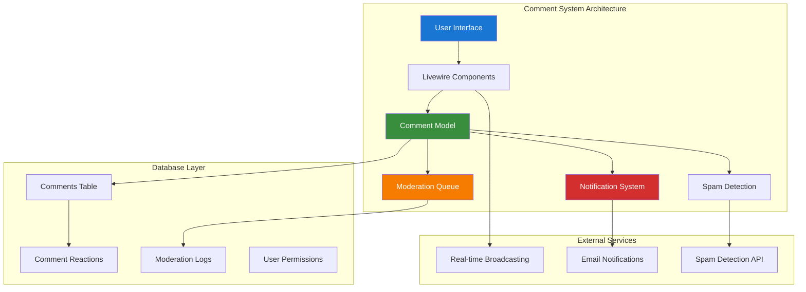

# Spatie Comments System Guide

## Table of Contents

- [Overview](#overview)
- [Installation & Configuration](#installation--configuration)
- [Comment System Architecture](#comment-system-architecture)
- [Livewire Integration](#livewire-integration)
- [Moderation Workflows](#moderation-workflows)
- [Notification Systems](#notification-systems)
- [RBAC Integration](#rbac-integration)
- [Performance Optimization](#performance-optimization)
- [Real-time Updates](#real-time-updates)
- [Spam Prevention](#spam-prevention)
- [Testing Strategies](#testing-strategies)
- [Production Deployment](#production-deployment)

## Overview

Spatie Laravel Comments provides a comprehensive commenting system for Laravel applications with built-in moderation, threading, and Livewire integration. This guide demonstrates how to implement a production-ready comment system with real-time updates, RBAC integration, and advanced moderation features.

### Key Features

- **Threaded Comments**: Nested comment replies with unlimited depth
- **Moderation System**: Automated and manual moderation workflows
- **Livewire Integration**: Real-time comment posting and updates
- **RBAC Support**: Role-based comment permissions and moderation
- **Spam Prevention**: Built-in spam detection and prevention
- **Notifications**: Real-time notifications for comment activities
- **Performance**: Optimized queries and caching strategies

### Architecture Overview



## Installation & Configuration

### Package Installation

```bash
# Install Spatie Comments packages
composer require spatie/laravel-comments
composer require spatie/laravel-comments-livewire

# Install additional dependencies
composer require spatie/laravel-activitylog
composer require spatie/laravel-permission

# Publish and run migrations
php artisan vendor:publish --provider="Spatie\Comments\CommentsServiceProvider" --tag="comments-migrations"
php artisan vendor:publish --provider="Spatie\Comments\CommentsServiceProvider" --tag="comments-config"
php artisan migrate

# Publish Livewire components
php artisan vendor:publish --provider="Spatie\CommentsLivewire\CommentsLivewireServiceProvider" --tag="comments-livewire-views"
```

### Configuration Setup

```php
<?php

// config/comments.php
return [
    /*
     * The model that will be used for comments.
     */
    'comment_model' => \App\Models\Comment::class,

    /*
     * The model that will be used for comment reactions.
     */
    'reaction_model' => \Spatie\Comments\Models\Reaction::class,

    /*
     * Moderation settings
     */
    'moderation' => [
        'enabled' => env('COMMENTS_MODERATION_ENABLED', true),
        'auto_approve_trusted_users' => true,
        'require_approval_for_new_users' => true,
        'spam_detection_enabled' => true,
        'max_links_per_comment' => 2,
        'blocked_words' => [
            // Add blocked words here
        ],
    ],

    /*
     * Comment threading settings
     */
    'threading' => [
        'enabled' => true,
        'max_depth' => 5,
        'sort_order' => 'created_at', // or 'votes', 'created_at_desc'
    ],

    /*
     * Notification settings
     */
    'notifications' => [
        'enabled' => true,
        'channels' => ['mail', 'database', 'broadcast'],
        'notify_on_reply' => true,
        'notify_on_mention' => true,
        'notify_moderators' => true,
    ],

    /*
     * Rate limiting
     */
    'rate_limiting' => [
        'enabled' => true,
        'max_comments_per_minute' => 5,
        'max_comments_per_hour' => 50,
    ],

    /*
     * Cache settings
     */
    'cache' => [
        'enabled' => true,
        'ttl' => 3600, // 1 hour
        'prefix' => 'comments',
    ],
];
```

## Comment System Architecture

### Enhanced Comment Model

```php
<?php

namespace App\Models;

use Illuminate\Database\Eloquent\Model;
use Illuminate\Database\Eloquent\Relations\BelongsTo;
use Illuminate\Database\Eloquent\Relations\HasMany;
use Illuminate\Database\Eloquent\Relations\MorphTo;
use Illuminate\Database\Eloquent\SoftDeletes;
use Spatie\Comments\Models\Comment as BaseComment;
use Spatie\Activitylog\Traits\LogsActivity;
use Spatie\Activitylog\LogOptions;

class Comment extends BaseComment
{
    use SoftDeletes, LogsActivity;

    protected $fillable = [
        'commentable_type',
        'commentable_id',
        'commentator_id',
        'comment',
        'parent_id',
        'is_approved',
        'is_flagged',
        'spam_score',
        'metadata',
    ];

    protected function casts(): array
    {
        return [
            'is_approved' => 'boolean',
            'is_flagged' => 'boolean',
            'spam_score' => 'float',
            'metadata' => 'array',
            'created_at' => 'datetime',
            'updated_at' => 'datetime',
            'deleted_at' => 'datetime',
        ];
    }

    /**
     * Get activity log options
     */
    public function getActivitylogOptions(): LogOptions
    {
        return LogOptions::defaults()
            ->logOnly(['comment', 'is_approved', 'is_flagged', 'spam_score'])
            ->logOnlyDirty()
            ->dontSubmitEmptyLogs();
    }

    /**
     * Commentable relationship
     */
    public function commentable(): MorphTo
    {
        return $this->morphTo();
    }

    /**
     * Commentator (user) relationship
     */
    public function commentator(): BelongsTo
    {
        return $this->belongsTo(User::class, 'commentator_id');
    }

    /**
     * Parent comment relationship
     */
    public function parent(): BelongsTo
    {
        return $this->belongsTo(self::class, 'parent_id');
    }

    /**
     * Child comments relationship
     */
    public function children(): HasMany
    {
        return $this->hasMany(self::class, 'parent_id')
            ->with('children')
            ->orderBy('created_at', 'asc');
    }

    /**
     * Reactions relationship
     */
    public function reactions(): HasMany
    {
        return $this->hasMany(CommentReaction::class);
    }

    /**
     * Scope for approved comments
     */
    public function scopeApproved($query)
    {
        return $query->where('is_approved', true);
    }

    /**
     * Scope for pending moderation
     */
    public function scopePendingModeration($query)
    {
        return $query->where('is_approved', false)->where('is_flagged', false);
    }

    /**
     * Scope for flagged comments
     */
    public function scopeFlagged($query)
    {
        return $query->where('is_flagged', true);
    }

    /**
     * Get comment depth in thread
     */
    public function getDepthAttribute(): int
    {
        $depth = 0;
        $parent = $this->parent;
        
        while ($parent) {
            $depth++;
            $parent = $parent->parent;
        }
        
        return $depth;
    }

    /**
     * Check if comment can be edited by user
     */
    public function canBeEditedBy(User $user): bool
    {
        // Comment author can edit within 15 minutes
        if ($this->commentator_id === $user->id) {
            return $this->created_at->diffInMinutes(now()) <= 15;
        }
        
        // Moderators can always edit
        return $user->hasPermissionTo('moderate comments');
    }

    /**
     * Check if comment can be deleted by user
     */
    public function canBeDeletedBy(User $user): bool
    {
        // Comment author can delete their own comments
        if ($this->commentator_id === $user->id) {
            return true;
        }
        
        // Moderators can delete any comment
        return $user->hasPermissionTo('moderate comments');
    }

    /**
     * Get formatted creation time
     */
    public function getFormattedCreatedAtAttribute(): string
    {
        return $this->created_at->diffForHumans();
    }

    /**
     * Check if comment is edited
     */
    public function getIsEditedAttribute(): bool
    {
        return $this->updated_at->gt($this->created_at->addMinutes(1));
    }
}
```

### Commentable Trait

```php
<?php

namespace App\Traits;

use App\Models\Comment;
use Illuminate\Database\Eloquent\Relations\MorphMany;

trait HasComments
{
    /**
     * Comments relationship
     */
    public function comments(): MorphMany
    {
        return $this->morphMany(Comment::class, 'commentable')
            ->whereNull('parent_id')
            ->with(['commentator', 'children.commentator'])
            ->approved()
            ->orderBy('created_at', 'desc');
    }

    /**
     * All comments including unapproved
     */
    public function allComments(): MorphMany
    {
        return $this->morphMany(Comment::class, 'commentable')
            ->whereNull('parent_id')
            ->with(['commentator', 'children.commentator'])
            ->orderBy('created_at', 'desc');
    }

    /**
     * Get total comment count
     */
    public function getTotalCommentsCountAttribute(): int
    {
        return $this->morphMany(Comment::class, 'commentable')
            ->approved()
            ->count();
    }

    /**
     * Get pending comments count
     */
    public function getPendingCommentsCountAttribute(): int
    {
        return $this->morphMany(Comment::class, 'commentable')
            ->pendingModeration()
            ->count();
    }

    /**
     * Check if user can comment on this model
     */
    public function canBeCommentedBy(User $user): bool
    {
        // Override this method in your models to implement custom logic
        return true;
    }
}
```

## Livewire Integration

### Comment Component

```php
<?php

namespace App\Livewire;

use App\Models\Comment;
use App\Models\User;
use App\Services\CommentModerationService;
use App\Services\SpamDetectionService;
use Illuminate\Database\Eloquent\Model;
use Illuminate\Support\Facades\Auth;
use Livewire\Component;
use Livewire\Attributes\Validate;

class Comments extends Component
{
    public Model $commentable;
    public ?Comment $parentComment = null;
    public bool $showReplyForm = false;

    #[Validate('required|string|min:3|max:1000')]
    public string $newComment = '';

    public array $comments = [];
    public int $commentsCount = 0;
    public bool $isLoading = false;

    public function mount(Model $commentable, ?Comment $parentComment = null): void
    {
        $this->commentable = $commentable;
        $this->parentComment = $parentComment;
        $this->loadComments();
    }

    public function loadComments(): void
    {
        $this->isLoading = true;

        $query = $this->commentable->comments()
            ->with(['commentator', 'reactions', 'children.commentator']);

        if ($this->parentComment) {
            $query->where('parent_id', $this->parentComment->id);
        }

        $this->comments = $query->get()->toArray();
        $this->commentsCount = $this->commentable->total_comments_count;
        $this->isLoading = false;
    }

    public function addComment(): void
    {
        $this->validate();

        if (!Auth::check()) {
            $this->addError('auth', 'You must be logged in to comment.');
            return;
        }

        $user = Auth::user();

        // Check if user can comment
        if (!$this->commentable->canBeCommentedBy($user)) {
            $this->addError('permission', 'You do not have permission to comment.');
            return;
        }

        // Rate limiting check
        if (!$this->checkRateLimit($user)) {
            $this->addError('rate_limit', 'You are commenting too frequently. Please wait a moment.');
            return;
        }

        // Spam detection
        $spamScore = app(SpamDetectionService::class)->analyzeComment($this->newComment, $user);

        // Create comment
        $comment = Comment::create([
            'commentable_type' => get_class($this->commentable),
            'commentable_id' => $this->commentable->id,
            'commentator_id' => $user->id,
            'comment' => $this->newComment,
            'parent_id' => $this->parentComment?->id,
            'is_approved' => $this->shouldAutoApprove($user, $spamScore),
            'spam_score' => $spamScore,
            'metadata' => [
                'ip_address' => request()->ip(),
                'user_agent' => request()->userAgent(),
            ],
        ]);

        // Queue for moderation if needed
        if (!$comment->is_approved) {
            app(CommentModerationService::class)->queueForModeration($comment);
        }

        // Reset form
        $this->newComment = '';
        $this->showReplyForm = false;

        // Reload comments
        $this->loadComments();

        // Broadcast update
        $this->dispatch('comment-added', [
            'commentId' => $comment->id,
            'commentableType' => get_class($this->commentable),
            'commentableId' => $this->commentable->id,
        ]);

        // Show success message
        $this->dispatch('notify', [
            'type' => 'success',
            'message' => $comment->is_approved
                ? 'Comment added successfully!'
                : 'Comment submitted for moderation.'
        ]);
    }

    public function toggleReplyForm(): void
    {
        $this->showReplyForm = !$this->showReplyForm;
        $this->newComment = '';
    }

    public function deleteComment(int $commentId): void
    {
        $comment = Comment::findOrFail($commentId);

        if (!$comment->canBeDeletedBy(Auth::user())) {
            $this->addError('permission', 'You do not have permission to delete this comment.');
            return;
        }

        $comment->delete();
        $this->loadComments();

        $this->dispatch('notify', [
            'type' => 'success',
            'message' => 'Comment deleted successfully.'
        ]);
    }

    public function flagComment(int $commentId): void
    {
        $comment = Comment::findOrFail($commentId);

        $comment->update(['is_flagged' => true]);

        // Queue for moderation review
        app(CommentModerationService::class)->queueForModeration($comment, 'flagged_by_user');

        $this->dispatch('notify', [
            'type' => 'info',
            'message' => 'Comment has been flagged for review.'
        ]);
    }

    private function checkRateLimit(User $user): bool
    {
        $cacheKey = "comment_rate_limit_{$user->id}";
        $attempts = cache()->get($cacheKey, 0);

        if ($attempts >= config('comments.rate_limiting.max_comments_per_minute', 5)) {
            return false;
        }

        cache()->put($cacheKey, $attempts + 1, 60); // 1 minute
        return true;
    }

    private function shouldAutoApprove(User $user, float $spamScore): bool
    {
        // Auto-approve for trusted users with low spam score
        if ($user->hasRole(['admin', 'moderator']) || $user->is_trusted) {
            return $spamScore < 0.3;
        }

        // Auto-approve for users with good history and low spam score
        if ($user->comments()->approved()->count() >= 5 && $spamScore < 0.2) {
            return true;
        }

        return false;
    }

    public function render()
    {
        return view('livewire.comments');
    }
}
```

## Moderation Workflows

### Comment Moderation Service

```php
<?php

namespace App\Services;

use App\Models\Comment;
use App\Models\User;
use App\Notifications\CommentModerationNotification;
use Illuminate\Support\Facades\Cache;

class CommentModerationService
{
    /**
     * Queue comment for moderation
     */
    public function queueForModeration(Comment $comment, string $reason = 'automatic'): void
    {
        activity()
            ->performedOn($comment)
            ->withProperties(['reason' => $reason, 'spam_score' => $comment->spam_score])
            ->log('comment_queued_for_moderation');

        $this->notifyModerators($comment, $reason);
        $this->updateModerationQueueCache();
    }

    /**
     * Approve comment
     */
    public function approveComment(Comment $comment, User $moderator): bool
    {
        $comment->update([
            'is_approved' => true,
            'is_flagged' => false,
            'moderated_by' => $moderator->id,
            'moderated_at' => now(),
        ]);

        activity()
            ->performedOn($comment)
            ->causedBy($moderator)
            ->log('comment_approved');

        $comment->commentator->notify(
            new CommentModerationNotification($comment, 'approved')
        );

        return true;
    }

    /**
     * Get moderation statistics
     */
    public function getModerationStats(): array
    {
        return Cache::remember('moderation_stats', 300, function () {
            return [
                'pending_approval' => Comment::pendingModeration()->count(),
                'flagged' => Comment::flagged()->count(),
                'approved_today' => Comment::approved()->whereDate('moderated_at', today())->count(),
                'total_comments' => Comment::count(),
            ];
        });
    }

    private function notifyModerators(Comment $comment, string $reason): void
    {
        $moderators = User::role(['admin', 'moderator'])->get();

        foreach ($moderators as $moderator) {
            $moderator->notify(new CommentModerationNotification($comment, 'pending', $reason));
        }
    }

    private function updateModerationQueueCache(): void
    {
        Cache::forget('moderation_stats');
    }
}
```

## Notification Systems

### Comment Notification

```php
<?php

namespace App\Notifications;

use App\Models\Comment;
use Illuminate\Bus\Queueable;
use Illuminate\Notifications\Notification;
use Illuminate\Notifications\Messages\MailMessage;
use Illuminate\Notifications\Messages\BroadcastMessage;

class CommentNotification extends Notification
{
    use Queueable;

    public function __construct(
        private Comment $comment,
        private string $type = 'new_comment'
    ) {}

    public function via($notifiable): array
    {
        return ['mail', 'database', 'broadcast'];
    }

    public function toMail($notifiable): MailMessage
    {
        return (new MailMessage)
            ->subject('New Comment on Your Post')
            ->line('Someone commented on your post.')
            ->line($this->comment->comment)
            ->action('View Comment', url('/comments/' . $this->comment->id))
            ->line('Thank you for using our application!');
    }

    public function toArray($notifiable): array
    {
        return [
            'comment_id' => $this->comment->id,
            'commentator_name' => $this->comment->commentator->name,
            'comment_excerpt' => substr($this->comment->comment, 0, 100),
            'type' => $this->type,
        ];
    }

    public function toBroadcast($notifiable): BroadcastMessage
    {
        return new BroadcastMessage([
            'comment_id' => $this->comment->id,
            'message' => 'New comment received',
            'type' => $this->type,
        ]);
    }
}
```

## Performance Optimization

### Comment Caching Service

```php
<?php

namespace App\Services;

use App\Models\Comment;
use Illuminate\Support\Facades\Cache;

class CommentCacheService
{
    /**
     * Cache comment tree for a commentable
     */
    public function cacheCommentTree($commentable): array
    {
        $cacheKey = "comments_tree_{$commentable->getMorphClass()}_{$commentable->id}";

        return Cache::remember($cacheKey, 3600, function () use ($commentable) {
            return $commentable->comments()
                ->with(['commentator:id,name,avatar', 'children.commentator:id,name,avatar'])
                ->approved()
                ->get()
                ->toArray();
        });
    }

    /**
     * Invalidate comment cache
     */
    public function invalidateCommentCache($commentable): void
    {
        $cacheKey = "comments_tree_{$commentable->getMorphClass()}_{$commentable->id}";
        Cache::forget($cacheKey);

        // Also invalidate count cache
        Cache::forget("comments_count_{$commentable->getMorphClass()}_{$commentable->id}");
    }

    /**
     * Cache comment count
     */
    public function cacheCommentCount($commentable): int
    {
        $cacheKey = "comments_count_{$commentable->getMorphClass()}_{$commentable->id}";

        return Cache::remember($cacheKey, 3600, function () use ($commentable) {
            return $commentable->comments()->approved()->count();
        });
    }
}
```

## Testing Strategies

### Comment System Tests

```php
<?php

namespace Tests\Feature;

use App\Models\Comment;use App\Models\Track;use App\Models\User;use Illuminate\Foundation\Testing\RefreshDatabase;use Livewire\Livewire;use old\TestCase;

class CommentSystemTest extends TestCase
{
    use RefreshDatabase;

    public function test_user_can_post_comment(): void
    {
        $user = User::factory()->create();
        $track = Track::factory()->create();

        $this->actingAs($user);

        Livewire::test('comments', ['commentable' => $track])
            ->set('newComment', 'This is a test comment')
            ->call('addComment')
            ->assertHasNoErrors()
            ->assertDispatched('notify');

        $this->assertDatabaseHas('comments', [
            'commentable_type' => Track::class,
            'commentable_id' => $track->id,
            'commentator_id' => $user->id,
            'comment' => 'This is a test comment',
        ]);
    }

    public function test_comment_requires_moderation_for_new_users(): void
    {
        $user = User::factory()->create();
        $track = Track::factory()->create();

        $comment = Comment::create([
            'commentable_type' => Track::class,
            'commentable_id' => $track->id,
            'commentator_id' => $user->id,
            'comment' => 'Test comment',
            'is_approved' => false,
        ]);

        $this->assertFalse($comment->is_approved);
    }

    public function test_moderator_can_approve_comments(): void
    {
        $moderator = User::factory()->create();
        $moderator->assignRole('moderator');

        $comment = Comment::factory()->create(['is_approved' => false]);

        $this->actingAs($moderator)
            ->post("/admin/comments/{$comment->id}/approve")
            ->assertRedirect();

        $this->assertTrue($comment->fresh()->is_approved);
    }
}
```

## Production Deployment

### Performance Monitoring

```php
<?php

namespace App\Console\Commands;

use Illuminate\Console\Command;
use App\Models\Comment;
use App\Services\CommentModerationService;

class CommentSystemHealthCheck extends Command
{
    protected $signature = 'comments:health-check';
    protected $description = 'Check comment system health and performance';

    public function handle(): int
    {
        $this->info('Running comment system health check...');

        $stats = app(CommentModerationService::class)->getModerationStats();

        $this->table(
            ['Metric', 'Value'],
            [
                ['Pending Moderation', $stats['pending_approval']],
                ['Flagged Comments', $stats['flagged']],
                ['Approved Today', $stats['approved_today']],
                ['Total Comments', $stats['total_comments']],
            ]
        );

        // Check for issues
        if ($stats['pending_approval'] > 100) {
            $this->warn('High number of comments pending moderation!');
        }

        if ($stats['flagged'] > 50) {
            $this->warn('High number of flagged comments!');
        }

        $this->info('Health check completed.');
        return 0;
    }
}
```

This comprehensive guide provides everything needed to implement a production-ready comment system using Spatie Laravel Comments with Livewire integration. The system includes moderation workflows, real-time updates, spam prevention, and performance optimization for high-traffic applications.

---

**Next Steps:**

- Review [Laravel WorkOS Guide](090-laravel-workos-guide.md) for enterprise authentication integration
- Explore [Laravel Query Builder Guide](100-laravel-query-builder-guide.md) for API development patterns
- Check [Laravel Folio Guide](120-laravel-folio-guide.md) for modern routing patterns
