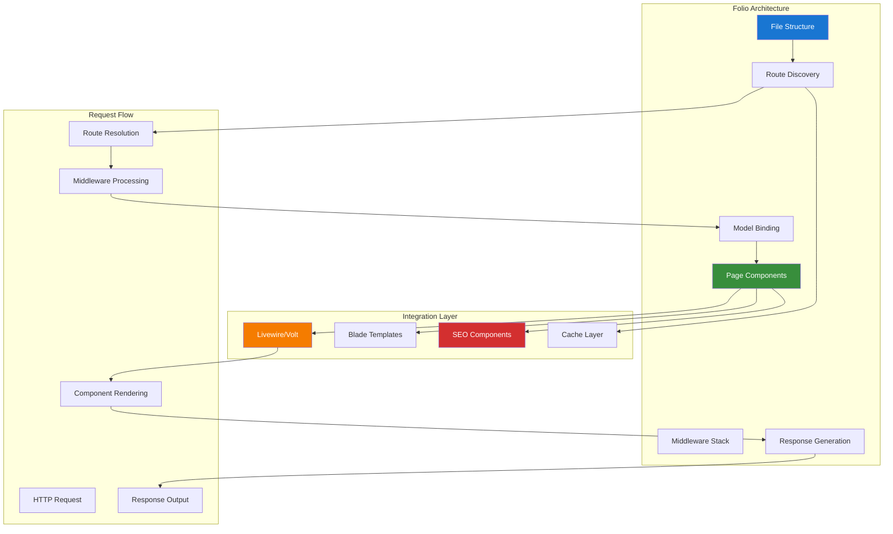

# Laravel Folio Page-based Routing Guide

## Table of Contents

- [Overview](#overview)
- [Installation & Configuration](#installation--configuration)
- [Page-based Routing Architecture](#page-based-routing-architecture)
- [Livewire/Volt Integration](#livewire-volt-integration)
- [Route Model Binding](#route-model-binding)
- [Middleware Integration](#middleware-integration)
- [SEO Optimization](#seo-optimization)
- [Performance Considerations](#performance-considerations)
- [Testing Strategies](#testing-strategies)
- [Production Deployment](#production-deployment)
- [Best Practices](#best-practices)
- [Real-World Examples](#real-world-examples)

## Overview

Laravel Folio provides a powerful page-based routing system that simplifies route management by using file-based routing conventions. This guide demonstrates how to implement Folio with Livewire/Volt functional components for modern, maintainable Laravel applications.

### Key Features

- **File-based Routing**: Automatic route generation from file structure
- **Livewire/Volt Integration**: Seamless functional component integration
- **Route Model Binding**: Automatic model resolution from URL parameters
- **Middleware Support**: Page-level and directory-level middleware
- **SEO Optimization**: Built-in meta tag and structured data support
- **Performance**: Optimized routing with caching and lazy loading

### Architecture Overview



## Installation & Configuration

### Package Installation

```bash
# Install Laravel Folio
composer require laravel/folio

# Install Livewire and Volt for functional components
composer require livewire/livewire
composer require livewire/volt

# Publish Folio configuration
php artisan vendor:publish --provider="Laravel\Folio\FolioServiceProvider"

# Install Folio
php artisan folio:install
```

### Configuration Setup

```php
<?php

// config/folio.php
return [
    /*
     * The path where your Folio pages are stored.
     */
    'path' => resource_path('views/pages'),

    /*
     * The middleware that should be applied to all Folio routes.
     */
    'middleware' => [
        'web',
    ],

    /*
     * The domain where Folio routes should be registered.
     */
    'domain' => null,

    /*
     * The prefix that should be applied to all Folio routes.
     */
    'prefix' => '',

    /*
     * Whether Folio should automatically discover routes.
     */
    'auto_discovery' => true,

    /*
     * Cache settings for route discovery
     */
    'cache' => [
        'enabled' => env('FOLIO_CACHE_ENABLED', true),
        'ttl' => env('FOLIO_CACHE_TTL', 3600),
    ],

    /*
     * SEO settings
     */
    'seo' => [
        'default_title' => env('APP_NAME', 'Laravel'),
        'title_separator' => ' | ',
        'default_description' => 'A modern Laravel application',
        'default_keywords' => 'laravel, php, web application',
    ],
];
```

### Service Provider Registration

```php
<?php

// app/Providers/FolioServiceProvider.php
namespace App\Providers;

use Illuminate\Support\ServiceProvider;
use Laravel\Folio\Folio;

class FolioServiceProvider extends ServiceProvider
{
    public function boot(): void
    {
        Folio::path(resource_path('views/pages'))
            ->middleware([
                'web',
                'auth:optional', // Custom middleware for optional authentication
            ]);

        // Register subdirectory with specific middleware
        Folio::path(resource_path('views/pages/admin'))
            ->middleware([
                'web',
                'auth',
                'role:admin',
            ])
            ->prefix('admin');

        // Register API pages
        Folio::path(resource_path('views/pages/api'))
            ->middleware(['api'])
            ->prefix('api');
    }
}
```

## Page-based Routing Architecture

### Basic Page Structure

```php
<?php
// resources/views/pages/index.blade.php
use function Laravel\Folio\{middleware, name};

middleware(['web']);
name('home');
?>

<x-layout>
    <x-slot:title>Welcome to Chinook Music</x-slot:title>
    
    <div class="hero-section">
        <h1>Discover Amazing Music</h1>
        <p>Explore our vast collection of tracks, albums, and artists.</p>
        
        <livewire:featured-tracks />
    </div>
    
    <div class="features-grid">
        <livewire:music-categories />
        <livewire:popular-albums />
        <livewire:new-releases />
    </div>
</x-layout>
```

### Dynamic Route Parameters

```php
<?php
// resources/views/pages/tracks/[track].blade.php
use function Laravel\Folio\{middleware, name};
use App\Models\Track;

middleware(['web']);
name('tracks.show');
?>

@php
    $track = Track::with(['album.artist', 'genre', 'mediaType'])->findOrFail($track);
@endphp

<x-layout>
    <x-slot:title>{{ $track->name }} - {{ $track->album->artist->name }}</x-slot:title>
    <x-slot:description>Listen to {{ $track->name }} by {{ $track->album->artist->name }} from the album {{ $track->album->title }}.</x-slot:description>
    
    <div class="track-header">
        <div class="track-artwork">
            album->cover_image_url }}" alt="{{ $track->album->title }}" />
        </div>
        
        <div class="track-info">
            <h1>{{ $track->name }}</h1>
            <h2>
                <a href="{{ route('artists.show', $track->album->artist) }}">
                    {{ $track->album->artist->name }}
                </a>
            </h2>
            <h3>
                <a href="{{ route('albums.show', $track->album) }}">
                    {{ $track->album->title }}
                </a>
            </h3>
            
            <div class="track-meta">
                <span class="duration">{{ $track->formatted_duration }}</span>
                <span class="genre">{{ $track->genre?->name }}</span>
                <span class="price">${{ $track->unit_price }}</span>
            </div>
        </div>
    </div>
    
    <div class="track-content">
        <livewire:audio-player :track="$track" />
        <livewire:track-actions :track="$track" />
        <livewire:comments :commentable="$track" />
    </div>
</x-layout>
```

### Nested Route Structure

```php
<?php
// resources/views/pages/artists/[artist]/albums/[album].blade.php
use function Laravel\Folio\{middleware, name};
use App\Models\Artist;
use App\Models\Album;

middleware(['web']);
name('artists.albums.show');
?>

@php
    $artist = Artist::findOrFail($artist);
    $album = $artist->albums()->findOrFail($album);
@endphp

<x-layout>
    <x-slot:title>{{ $album->title }} by {{ $artist->name }}</x-slot:title>
    
    <nav class="breadcrumb">
        <a href="{{ route('home') }}">Home</a>
        <a href="{{ route('artists.index') }}">Artists</a>
        <a href="{{ route('artists.show', $artist) }}">{{ $artist->name }}</a>
        <span>{{ $album->title }}</span>
    </nav>
    
    <div class="album-details">
        <livewire:album-header :album="$album" />
        <livewire:track-listing :album="$album" />
        <livewire:album-reviews :album="$album" />
    </div>
</x-layout>
```

## Livewire/Volt Integration

### Volt Functional Components

```php
<?php
// resources/views/pages/search.blade.php
use function Laravel\Folio\{middleware, name};
use function Livewire\Volt\{state, computed, mount};
use App\Models\Track;
use App\Models\Album;
use App\Models\Artist;

middleware(['web']);
name('search');

state(['query' => '', 'type' => 'all', 'results' => []]);

mount(function () {
    $this->query = request('q', '');
    $this->type = request('type', 'all');
    if ($this->query) {
        $this->search();
    }
});

$search = function () {
    if (strlen($this->query) < 2) {
        $this->results = [];
        return;
    }
    
    $this->results = match ($this->type) {
        'tracks' => Track::search($this->query)->take(20)->get(),
        'albums' => Album::search($this->query)->take(20)->get(),
        'artists' => Artist::search($this->query)->take(20)->get(),
        default => [
            'tracks' => Track::search($this->query)->take(10)->get(),
            'albums' => Album::search($this->query)->take(10)->get(),
            'artists' => Artist::search($this->query)->take(10)->get(),
        ]
    };
};

$updatedQuery = function () {
    $this->search();
};
?>

<x-layout>
    <x-slot:title>Search - {{ $query ?: 'Find Music' }}</x-slot:title>
    
    <div class="search-container">
        <div class="search-form">
            <input 
                type="text" 
                wire:model.live.debounce.300ms="query"
                placeholder="Search for tracks, albums, or artists..."
                class="search-input"
            />
            
            <div class="search-filters">
                <label>
                    <input type="radio" wire:model.live="type" value="all" />
                    All
                </label>
                <label>
                    <input type="radio" wire:model.live="type" value="tracks" />
                    Tracks
                </label>
                <label>
                    <input type="radio" wire:model.live="type" value="albums" />
                    Albums
                </label>
                <label>
                    <input type="radio" wire:model.live="type" value="artists" />
                    Artists
                </label>
            </div>
        </div>
        
        <div class="search-results">
            @if($query && empty($results))
                <p class="no-results">No results found for "{{ $query }}"</p>
            @elseif($type === 'all' && is_array($results))
                @foreach(['tracks', 'albums', 'artists'] as $resultType)
                    @if(!empty($results[$resultType]))
                        <div class="result-section">
                            <h3>{{ ucfirst($resultType) }}</h3>
                            <div class="result-grid">
                                @foreach($results[$resultType] as $item)
                                    <x-search-result-card :item="$item" :type="$resultType" />
                                @endforeach
                            </div>
                        </div>
                    @endif
                @endforeach
            @else
                <div class="result-grid">
                    @foreach($results as $item)
                        <x-search-result-card :item="$item" :type="$type" />
                    @endforeach
                </div>
            @endif
        </div>
    </div>
</x-layout>
```

### Page-level Livewire Components

```php
<?php
// resources/views/pages/playlists/create.blade.php
use function Laravel\Folio\{middleware, name};

middleware(['web', 'auth']);
name('playlists.create');
?>

<x-layout>
    <x-slot:title>Create New Playlist</x-slot:title>
    
    <div class="page-header">
        <h1>Create New Playlist</h1>
        <p>Build your perfect music collection</p>
    </div>
    
    <livewire:playlist-creator />
</x-layout>

## Route Model Binding

### Automatic Model Resolution

```php
<?php
// resources/views/pages/albums/[album]/edit.blade.php
use function Laravel\Folio\{middleware, name, can};
use App\Models\Album;

middleware(['web', 'auth']);
name('albums.edit');
can('update', 'album');
?>

@php
    // Folio automatically resolves the Album model from the {album} parameter
    // The $album variable is automatically available and type-hinted
@endphp

<x-layout>
    <x-slot:title>Edit {{ $album->title }}</x-slot:title>

    <div class="edit-form">
        <h1>Edit Album: {{ $album->title }}</h1>

        <livewire:album-editor :album="$album" />
    </div>
</x-layout>
```

### Custom Model Binding

```php
<?php
// resources/views/pages/users/[user:username]/profile.blade.php
use function Laravel\Folio\{middleware, name};
use App\Models\User;

middleware(['web']);
name('users.profile');
?>

@php
    // Custom route key binding using username instead of ID
    $user = User::where('username', $user)->firstOrFail();
@endphp

<x-layout>
    <x-slot:title>{{ $user->name }}'s Profile</x-slot:title>

    <div class="user-profile">
        <livewire:user-profile-header :user="$user" />
        <livewire:user-playlists :user="$user" />
        <livewire:user-activity :user="$user" />
    </div>
</x-layout>
```

## Middleware Integration

### Page-level Middleware

```php
<?php
// resources/views/pages/admin/dashboard.blade.php
use function Laravel\Folio\{middleware, name};

middleware(['web', 'auth', 'role:admin', 'verified']);
name('admin.dashboard');
?>

<x-admin-layout>
    <x-slot:title>Admin Dashboard</x-slot:title>

    <div class="admin-dashboard">
        <livewire:admin-stats />
        <livewire:recent-activity />
        <livewire:moderation-queue />
    </div>
</x-admin-layout>
```

### Directory-level Middleware

```php
<?php
// app/Providers/FolioServiceProvider.php
public function boot(): void
{
    // Admin pages require authentication and admin role
    Folio::path(resource_path('views/pages/admin'))
        ->middleware(['web', 'auth', 'role:admin'])
        ->prefix('admin');

    // API pages use API middleware
    Folio::path(resource_path('views/pages/api'))
        ->middleware(['api', 'throttle:60,1'])
        ->prefix('api');

    // User dashboard requires authentication
    Folio::path(resource_path('views/pages/dashboard'))
        ->middleware(['web', 'auth', 'verified']);
}
```

## SEO Optimization

### Meta Tags and Structured Data

```php
<?php
// resources/views/pages/artists/[artist].blade.php
use function Laravel\Folio\{middleware, name};
use App\Models\Artist;

middleware(['web']);
name('artists.show');
?>

@php
    $artist = Artist::with(['albums.tracks'])->findOrFail($artist);
    $totalTracks = $artist->albums->sum(fn($album) => $album->tracks->count());
@endphp

<x-layout>
    <x-slot:title>{{ $artist->name }} - Music Artist</x-slot:title>
    <x-slot:description>Discover music by {{ $artist->name }}. Listen to {{ $totalTracks }} tracks across {{ $artist->albums->count() }} albums.</x-slot:description>
    <x-slot:keywords>{{ $artist->name }}, music, artist, albums, tracks</x-slot:keywords>

    {{-- Open Graph Meta Tags --}}
    <x-slot:meta>
        <meta property="og:title" content="{{ $artist->name }} - Music Artist" />
        <meta property="og:description" content="Discover music by {{ $artist->name }}" />
        <meta property="og:image" content="{{ $artist->profile_image_url }}" />
        <meta property="og:type" content="music.musician" />
        <meta property="og:url" content="{{ request()->url() }}" />

        {{-- Twitter Card --}}
        <meta name="twitter:card" content="summary_large_image" />
        <meta name="twitter:title" content="{{ $artist->name }} - Music Artist" />
        <meta name="twitter:description" content="Discover music by {{ $artist->name }}" />
        <meta name="twitter:image" content="{{ $artist->profile_image_url }}" />
    </x-slot:meta>

    {{-- Structured Data --}}
    <x-slot:structured-data>
        <script type="application/ld+json">
        {
            "@context": "https://schema.org",
            "@type": "MusicGroup",
            "name": "{{ $artist->name }}",
            "description": "{{ $artist->biography }}",
            "image": "{{ $artist->profile_image_url }}",
            "url": "{{ request()->url() }}",
            "album": [
                @foreach($artist->albums as $album)
                {
                    "@type": "MusicAlbum",
                    "name": "{{ $album->title }}",
                    "datePublished": "{{ $album->release_date?->format('Y-m-d') }}",
                    "numTracks": {{ $album->tracks->count() }}
                }@if(!$loop->last),@endif
                @endforeach
            ]
        }
        </script>
    </x-slot:structured-data>

    <div class="artist-page">
        <livewire:artist-header :artist="$artist" />
        <livewire:artist-albums :artist="$artist" />
        <livewire:artist-top-tracks :artist="$artist" />
    </div>
</x-layout>
```

## Performance Considerations

### Route Caching

```php
<?php
// config/folio.php
return [
    'cache' => [
        'enabled' => env('FOLIO_CACHE_ENABLED', true),
        'ttl' => env('FOLIO_CACHE_TTL', 3600),
        'store' => env('FOLIO_CACHE_STORE', 'file'),
    ],
];
```

### Lazy Loading Components

```php
<?php
// resources/views/pages/browse.blade.php
use function Laravel\Folio\{middleware, name};

middleware(['web']);
name('browse');
?>

<x-layout>
    <x-slot:title>Browse Music</x-slot:title>

    <div class="browse-page">
        {{-- Load immediately --}}
        <livewire:browse-filters />

        {{-- Lazy load heavy components --}}
        <div wire:init="loadContent">
            <livewire:browse-results lazy />
        </div>

        {{-- Load on scroll --}}
        <div x-intersect="$wire.loadMoreContent()">
            <livewire:recommended-content lazy />
        </div>
    </div>
</x-layout>
```

## Testing Strategies

### Folio Route Testing

```php
<?php

namespace Tests\Feature;

use App\Models\Artist;use App\Models\Track;use App\Models\User;use Illuminate\Foundation\Testing\RefreshDatabase;use old\TestCase;

class FolioRoutesTest extends TestCase
{
    use RefreshDatabase;

    public function test_home_page_loads(): void
    {
        $response = $this->get('/');

        $response->assertOk()
            ->assertSee('Discover Amazing Music');
    }

    public function test_track_page_displays_track_details(): void
    {
        $track = Track::factory()->create(['name' => 'Test Track']);

        $response = $this->get("/tracks/{$track->id}");

        $response->assertOk()
            ->assertSee('Test Track')
            ->assertSee($track->album->artist->name);
    }

    public function test_admin_pages_require_authentication(): void
    {
        $response = $this->get('/admin/dashboard');

        $response->assertRedirect('/login');
    }

    public function test_admin_pages_require_admin_role(): void
    {
        $user = User::factory()->create();

        $response = $this->actingAs($user)->get('/admin/dashboard');

        $response->assertForbidden();
    }

    public function test_search_page_with_query(): void
    {
        Track::factory()->create(['name' => 'Searchable Track']);

        $response = $this->get('/search?q=Searchable');

        $response->assertOk()
            ->assertSee('Searchable Track');
    }
}
```

## Best Practices

### File Organization

```text
resources/views/pages/
├── index.blade.php                 # Home page (/)
├── about.blade.php                 # About page (/about)
├── search.blade.php                # Search page (/search)
├── tracks/
│   ├── index.blade.php             # Tracks listing (/tracks)
│   ├── [track].blade.php           # Track detail (/tracks/{track})
│   └── create.blade.php            # Create track (/tracks/create)
├── albums/
│   ├── index.blade.php             # Albums listing (/albums)
│   ├── [album].blade.php           # Album detail (/albums/{album})
│   └── [album]/
│       └── edit.blade.php          # Edit album (/albums/{album}/edit)
├── artists/
│   ├── index.blade.php             # Artists listing (/artists)
│   ├── [artist].blade.php          # Artist detail (/artists/{artist})
│   └── [artist]/
│       └── albums/
│           └── [album].blade.php   # Artist album (/artists/{artist}/albums/{album})
├── admin/
│   ├── dashboard.blade.php         # Admin dashboard (/admin/dashboard)
│   ├── users/
│   │   └── index.blade.php         # User management (/admin/users)
│   └── moderation/
│       └── comments.blade.php      # Comment moderation (/admin/moderation/comments)
└── api/
    ├── tracks.blade.php            # API tracks endpoint (/api/tracks)
    └── search.blade.php            # API search endpoint (/api/search)
```

### Naming Conventions

- Use kebab-case for file names: `user-profile.blade.php`
- Use square brackets for parameters: `[track].blade.php`
- Use descriptive directory names: `admin/`, `api/`, `dashboard/`
- Follow RESTful conventions where applicable

This comprehensive guide provides everything needed to implement modern page-based routing with Laravel Folio, including Livewire/Volt integration, SEO optimization, and performance considerations for production applications.

---

**Next Steps:**

- Explore [NNJeim World Guide](130-nnjeim-world-guide.md) for geographic data management
- Review [Laravel Database Optimization Guide](140-laravel-optimize-database-guide.md) for performance optimization
- Check [Spatie Comments Guide](110-spatie-comments-guide.md) for user engagement features
