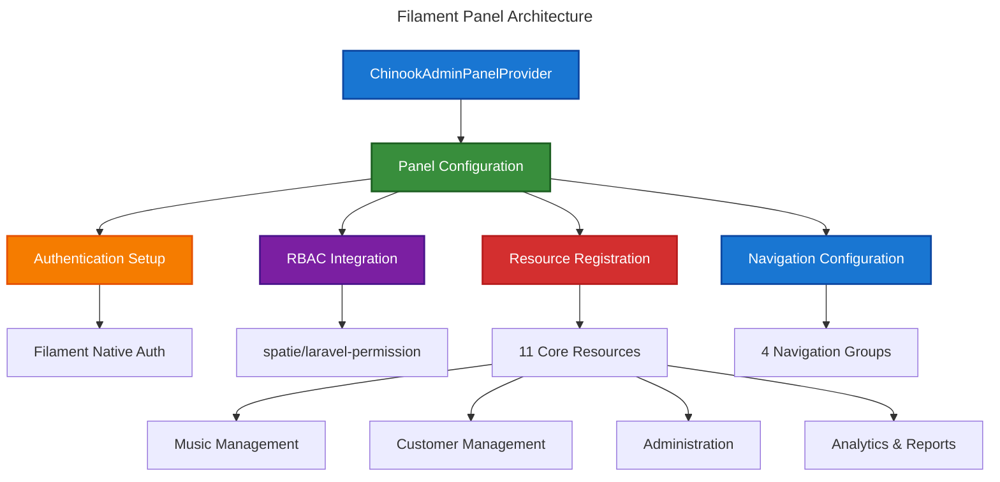
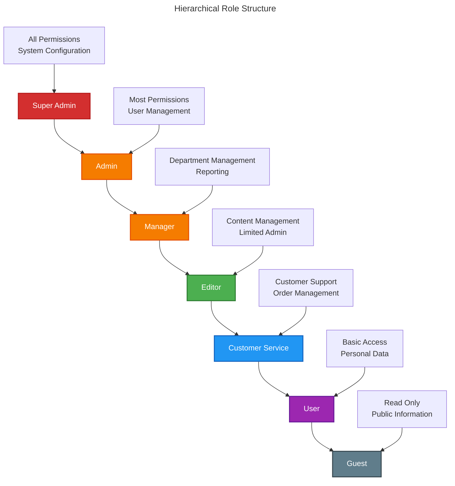

# Filament 4 Admin Panel Documentation

This directory contains comprehensive documentation for implementing a complete Filament 4 admin panel for the Chinook music database, featuring RBAC integration, hierarchical data management, and enterprise-level functionality.

## Table of Contents

- [Overview](#overview)
- [Architecture](#architecture)
- [Documentation Structure](#documentation-structure)
  - [Setup Documentation](#setup-documentation)
  - [Resources Documentation](#resources-documentation)
  - [Features Documentation](#features-documentation)
  - [Models Documentation](#models-documentation)
  - [Testing Documentation](#testing-documentation)
  - [Deployment Documentation](#deployment-documentation)
  - [Diagrams Documentation](#diagrams-documentation)
- [Quick Start Guide](#quick-start-guide)
  - [Prerequisites](#prerequisites)
  - [Installation Steps](#installation-steps)
  - [Configuration](#configuration)
- [Panel Features](#panel-features)
  - [Authentication & Authorization](#authentication--authorization)
  - [Resource Management](#resource-management)
  - [Advanced Features](#advanced-features)
- [RBAC Integration](#rbac-integration)
  - [Hierarchical Roles](#hierarchical-roles)
  - [Granular Permissions](#granular-permissions)
  - [Access Control](#access-control)
- [Performance & Security](#performance--security)
  - [Optimization Strategies](#optimization-strategies)
  - [Security Measures](#security-measures)
- [Standards Compliance](#standards-compliance)
  - [Laravel 12 Modern Patterns](#laravel-12-modern-patterns)
  - [WCAG 2.1 AA Accessibility](#wcag-21-aa-accessibility)
  - [Documentation Standards](#documentation-standards)
- [Navigation](#navigation)

## Overview

The Chinook Filament 4 admin panel provides a comprehensive, enterprise-grade administrative interface for managing the Chinook music database. Built with modern Laravel 12 patterns and Filament 4 best practices, it features complete RBAC integration, hierarchical category management, and accessibility-compliant design.

### Key Features

**🚀 Enterprise Features:**
- **Dedicated Panel**: Isolated `chinook-admin` panel with custom configuration
- **RBAC Integration**: Complete spatie/laravel-permission integration with 7-tier hierarchical roles
- **Hierarchical Categories**: Advanced category management with hybrid closure table + adjacency list architecture
- **Resource Management**: 11 comprehensive Filament resources with relationship managers
- **Advanced Widgets**: Dashboard widgets with analytics and performance metrics
- **Security Features**: Comprehensive middleware stack and access control
- **Testing Coverage**: Complete testing suite with feature and integration tests

**🎯 Modern Implementation:**
- **Laravel 12 Patterns**: cast() method, modern Eloquent syntax, PHP 8.4 features
- **Filament 4 Best Practices**: Latest component patterns, form builders, table features
- **Accessibility Compliance**: WCAG 2.1 AA compliant interface with proper contrast ratios
- **Performance Optimization**: Efficient queries, caching strategies, lazy loading

## Architecture

### Panel Structure

The Chinook admin panel follows a dedicated panel architecture:



### Technology Stack

- **Framework**: Laravel 12 with PHP 8.4
- **Admin Panel**: Filament 4 with dedicated panel configuration
- **Authentication**: Filament native authentication with Laravel User model
- **Authorization**: spatie/laravel-permission with hierarchical roles
- **Database**: SQLite with WAL mode optimization and hybrid hierarchical architecture
- **Frontend**: Livewire 3, Alpine.js, Tailwind CSS
- **Testing**: Pest with feature and integration tests

## Documentation Structure

### Setup Documentation
**Directory**: `setup/`
**Purpose**: Complete panel setup, authentication, and RBAC configuration

1. **[Panel Configuration](setup/010-panel-configuration.md)** - Service provider setup and panel registration
2. **[Authentication Setup](setup/020-authentication-setup.md)** - Filament native auth with Laravel integration
3. **[RBAC Integration](setup/030-rbac-integration.md)** - spatie/laravel-permission with hierarchical roles
4. **[Navigation Configuration](setup/040-navigation-configuration.md)** - Menu organization and access control
5. **[Security Configuration](setup/050-security-configuration.md)** - Middleware, guards, and access patterns
6. **[Environment Setup](setup/060-environment-setup.md)** - Development and production configurations
7. **[SQLite Optimization](setup/070-sqlite-optimization.md)** - WAL mode configuration and performance tuning

### Resources Documentation
**Directory**: `resources/`
**Purpose**: Complete Filament resource implementations with relationship managers

1. **[Artists Resource](resources/010-artists-resource.md)** - Artist management with albums relationship manager
2. **[Albums Resource](resources/020-albums-resource.md)** - Album management with tracks relationship manager
3. **[Tracks Resource](resources/030-tracks-resource.md)** - Track management with complex relationships
4. **[Categories Resource](resources/040-categories-resource.md)** - Hierarchical category management

### Features Documentation
**Directory**: `features/`
**Purpose**: Advanced features, widgets, and custom functionality

1. **[Dashboard Configuration](features/010-dashboard-configuration.md)** - Dashboard setup and KPI widgets
2. **[Widget Development](features/020-widget-development.md)** - Custom widget creation and analytics
3. **[Chart Integration](features/030-chart-integration.md)** - Chart.js integration and data visualization
4. **[Global Search](features/090-global-search.md)** - Cross-resource search functionality

### Models Documentation
**Directory**: `models/`
**Purpose**: Model-specific Filament integration and business logic

1. **[Model Integration](models/010-model-integration.md)** - Filament model integration patterns
2. **[Relationship Handling](models/020-relationship-handling.md)** - Complex relationship management
3. **[Validation Rules](models/030-validation-rules.md)** - Form validation and business rules
4. **[Scopes and Filters](models/040-scopes-filters.md)** - Query scopes and filtering logic

### Testing Documentation
**Directory**: `testing/`
**Purpose**: Comprehensive testing strategies and examples

1. **[Resource Testing](testing/010-resource-testing.md)** - Testing Filament resources
2. **[Feature Testing](testing/020-feature-testing.md)** - End-to-end feature testing
3. **[Authorization Testing](testing/030-authorization-testing.md)** - RBAC and permission testing
4. **[Performance Testing](testing/040-performance-testing.md)** - Load and performance testing

### Deployment Documentation
**Directory**: `deployment/`
**Purpose**: Production deployment and maintenance

1. **[Production Environment](deployment/010-production-environment.md)** - SQLite production setup and configuration
2. **[Performance Optimization](deployment/050-performance-optimization.md)** - SQLite optimization and caching strategies

### Diagrams Documentation
**Directory**: `diagrams/`
**Purpose**: Visual documentation with WCAG 2.1 AA compliant diagrams

1. **[Entity Relationship Diagrams](diagrams/010-entity-relationship-diagrams.md)** - Complete ERD with WCAG 2.1 AA compliance
2. **[System Architecture](diagrams/050-system-architecture.md)** - Overall system design and components
3. **[Filament Panel Architecture](diagrams/060-filament-panel-architecture.md)** - Panel structure and organization

## Quick Start Guide

### Prerequisites

Ensure you have the following installed and configured:

```bash
# System Requirements
- PHP 8.4+
- Laravel 12+
- Node.js 18+
- Composer 2.6+

# Database
- SQLite 3.38+ with WAL mode support and optimization
- See SQLite Optimization Guide for performance tuning

# Required Laravel Packages
- spatie/laravel-permission
- spatie/laravel-media-library
- spatie/laravel-tags
- spatie/laravel-activitylog
```

### Installation Steps

1. **Install Filament 4**:
```bash
composer require filament/filament:"^4.0"
php artisan filament:install --panels
```

2. **Create Chinook Admin Panel**:
```bash
php artisan make:filament-panel chinook-admin
```

3. **Install RBAC Package**:
```bash
composer require spatie/laravel-permission:"^6.20"
composer require bezhansalleh/filament-shield:"^3.0"
php artisan vendor:publish --provider="Spatie\Permission\PermissionServiceProvider"
```

4. **Install Additional Packages**:
```bash
composer require filament/spatie-laravel-media-library-plugin:"^4.0"
composer require filament/spatie-laravel-tags-plugin:"^4.0"
composer require filament/spatie-laravel-activitylog-plugin:"^4.0"
```

### Configuration

Follow the setup documentation in order:

1. **[Panel Configuration](setup/010-panel-configuration.md)** - Configure the dedicated panel
2. **[Authentication Setup](setup/020-authentication-setup.md)** - Setup authentication
3. **[RBAC Integration](setup/030-rbac-integration.md)** - Configure roles and permissions
4. **[Navigation Configuration](setup/040-navigation-configuration.md)** - Setup navigation
5. **[Security Configuration](setup/050-security-configuration.md)** - Apply security measures

## Panel Features

### Authentication & Authorization

- **Filament Native Authentication**: Seamless integration with Laravel User model
- **Hierarchical RBAC**: 7-tier role system with granular permissions
- **Session Management**: Secure session handling and timeout management
- **Multi-Factor Authentication**: Optional 2FA integration
- **Password Policies**: Configurable password requirements

### Resource Management

- **11 Core Resources**: Complete CRUD operations for all Chinook entities
- **Relationship Managers**: Advanced relationship management with inline editing
- **Form Builders**: Dynamic forms with validation and conditional logic
- **Table Features**: Advanced filtering, sorting, searching, and bulk operations
- **File Management**: Media uploads with validation and optimization

### Advanced Features

- **Dashboard Widgets**: Real-time analytics and performance metrics
- **Import/Export**: Bulk data operations with progress tracking
- **Activity Logging**: Comprehensive audit trails
- **Notifications**: Real-time alerts and messaging
- **API Integration**: RESTful API endpoints with authentication

## RBAC Integration

### Hierarchical Roles

The panel implements a 7-tier hierarchical role system:



### Granular Permissions

50+ granular permissions organized by functional area:

- **Entity Management**: CRUD operations for all models
- **Administrative Functions**: User management, system configuration
- **Analytics & Reporting**: Data access and export capabilities
- **Media Management**: File upload and library management
- **Import/Export**: Bulk data operations

### Access Control

- **Resource-Level Authorization**: Permission checks for each resource
- **Action-Level Authorization**: Granular control over specific actions
- **Navigation Visibility**: Dynamic menu based on user permissions
- **Field-Level Security**: Conditional field visibility and editing

## Performance & Security

### Optimization Strategies

- **Query Optimization**: Eager loading, efficient relationships, proper indexing
- **Caching**: Strategic caching for frequently accessed data
- **Lazy Loading**: Deferred loading of non-critical components
- **Asset Optimization**: Optimized images and file handling

### Security Measures

- **CSRF Protection**: Comprehensive CSRF token validation
- **Rate Limiting**: Protection against abuse and brute force attacks
- **Input Validation**: Strict validation rules and sanitization
- **Session Security**: Secure session configuration and management

## Standards Compliance

### Laravel 12 Modern Patterns

All code examples and implementations follow Laravel 12 best practices:

- **cast() Method**: Modern casting syntax over $casts property
- **PHP 8.4 Features**: Latest PHP features and syntax
- **Eloquent Patterns**: Modern relationship definitions and query builders
- **Validation Rules**: Laravel 12 validation syntax and custom rules

### WCAG 2.1 AA Accessibility

All visual elements meet accessibility standards:

- **Color Contrast**: Minimum 4.5:1 contrast ratios for all text
- **Screen Reader Support**: Proper semantic markup and alt text
- **Keyboard Navigation**: Full keyboard accessibility
- **Focus Indicators**: Clear focus states for interactive elements

### Documentation Standards

- **Consistent Structure**: Standardized documentation format across all files
- **Comprehensive TOCs**: Detailed table of contents with proper linking
- **Cross-References**: Proper linking between related concepts
- **Code Quality**: Production-ready examples following Laravel conventions

---

## Navigation

**← Previous:** [Chinook Advanced Features Guide](../050-chinook-advanced-features-guide.md)

**Next →** [Setup Documentation](setup/000-index.md)
