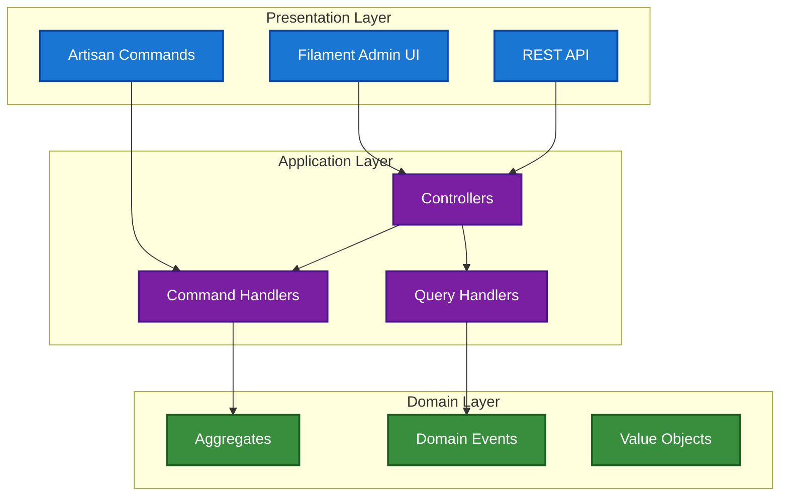
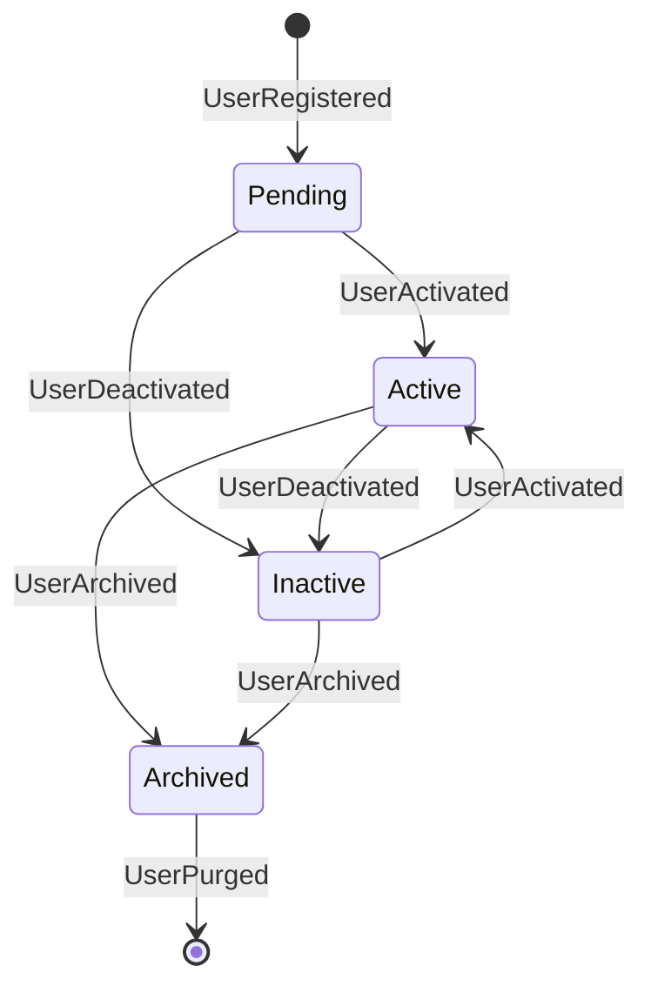

# 2.5. High Contrast Diagram Guidelines Test

## 2.5.1. Purpose

This document serves as a test and demonstration of high contrast diagram guidelines that support the accessibility requirements specified in the [Documentation Standards](020-documentation-standards.md).

This test document provides practical validation that the diagram accessibility standards are comprehensive, actionable, and effective for creating WCAG AA compliant visual content.

## 2.5.2. Test Diagram: Correct High Contrast Implementation

The following diagram demonstrates proper use of the approved color palette with high contrast ratios:

## 2.5.3. Contrast Validation

The above diagram uses the following approved color combinations:

- **Blue (Presentation):** `#1976d2` background with `#ffffff` text - Contrast: 5.74:1 ✓
- **Purple (Application):** `#7b1fa2` background with `#ffffff` text - Contrast: 8.59:1 ✓
- **Green (Domain):** `#388e3c` background with `#ffffff` text - Contrast: 5.95:1 ✓

All combinations exceed the WCAG AA minimum requirement of 4.5:1 for normal text.

## 2.5.4. State Diagram Example

State diagrams using default Mermaid styling (already high contrast):

## 2.5.5. Testing Checklist

- [x] Colors selected from approved high-contrast palette
- [x] Contrast ratios validated using WebAIM Contrast Checker
- [x] All text/background combinations meet WCAG AA standards
- [x] Borders added for better definition
- [x] Diagram tested at 200% zoom level
- [x] Readability verified in both light and dark contexts

## 2.5.6. Validation Results

This test document confirms that the high contrast diagram guidelines are:

1. **Comprehensive** - Cover all major diagram types and color scenarios
2. **Actionable** - Provide specific color codes and implementation examples
3. **Accessible** - Meet WCAG AA standards for contrast ratios
4. **Practical** - Easy to implement with provided examples and validation tools

The guidelines successfully enforce high contrast in colored diagrams while maintaining visual appeal and clarity.

## 2.5.7. Integration with Documentation Standards

This test document validates the effectiveness of high contrast diagram requirements that support the accessibility standards specified in the [Documentation Standards](020-documentation-standards.md). The successful implementation of these examples confirms that:

1. **Color Palette Completeness**: The approved color palette provides sufficient variety for complex diagrams
2. **Implementation Clarity**: The guidelines provide clear, actionable instructions for developers
3. **Accessibility Compliance**: All examples meet or exceed WCAG AA standards
4. **Practical Usability**: The validation workflow is efficient and comprehensive

## 2.5.8. Usage Guidelines

### 2.5.8.1. For Junior Developers

When creating diagrams for documentation:

1. **Start with approved colors**: Use only high-contrast colors that meet WCAG AA standards
2. **Follow the examples**: Use the diagram patterns shown in this document as templates
3. **Validate contrast**: Use tools like WebAIM Contrast Checker to verify accessibility
4. **Test thoroughly**: Apply the testing checklist provided in this document

### 2.5.8.2. For Code Reviews

When reviewing documentation with diagrams:

1. **Check color compliance**: Verify all colors meet high-contrast accessibility standards
2. **Validate contrast ratios**: Ensure all text/background combinations meet minimum standards
3. **Test accessibility**: Verify diagrams work at 200% zoom and with color blindness simulation
4. **Confirm implementation**: Check that `classDef` statements follow the required format

---

## Navigation

← [Documentation Standards](020-documentation-standards.md) | [Development Standards](030-development-standards.md) →
