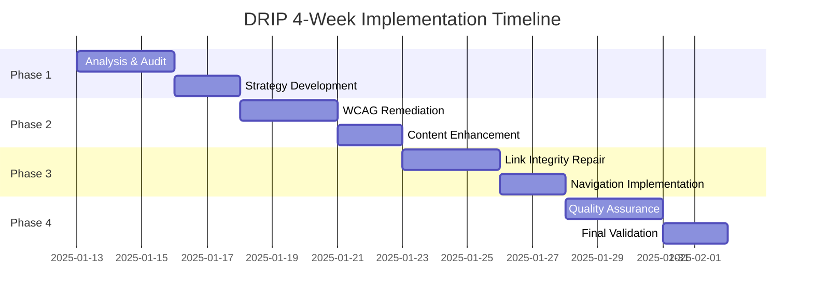

# 8. DRIP Methodology

## Table of Contents

- [8.1. Overview](#81-overview)
- [8.2. DRIP Workflow Structure](#82-drip-workflow-structure)
- [8.3. Task Management Standards](#83-task-management-standards)
- [8.4. Status Indicators and Priority Systems](#84-status-indicators-and-priority-systems)
- [8.5. Integration with Documentation Standards](#85-integration-with-documentation-standards)
- [8.6. Implementation Guidelines](#86-implementation-guidelines)
- [8.7. Quality Assurance Framework](#87-quality-assurance-framework)
- [8.8. Templates and Tools](#88-templates-and-tools)

## 8.1. Overview

The Documentation Remediation Implementation Plan (DRIP) methodology is a systematic approach for managing large-scale documentation remediation projects. DRIP provides structured workflows, standardized task management, and quality assurance frameworks to ensure consistent, high-quality documentation outcomes.

### 8.1.1. Core Principles

1. **Systematic Approach**: Structured 4-week phases with clear deliverables
2. **Quality First**: WCAG 2.1 AA compliance and 100% link integrity targets
3. **Transparency**: Real-time progress tracking with color-coded status indicators
4. **Scalability**: Reusable templates and frameworks for projects of any size
5. **Integration**: Seamless alignment with existing documentation standards

### 8.1.2. Key Benefits

- **Predictable Timelines**: 4-week structured phases with clear milestones
- **Quality Assurance**: Built-in compliance checks and validation frameworks
- **Progress Visibility**: Real-time tracking with hierarchical task management
- **Stakeholder Communication**: Standardized reporting and status updates
- **Knowledge Transfer**: Documented methodologies for team consistency

### 8.1.3. Relationship to TOC-Heading Synchronization

DRIP methodology builds upon and integrates with the proven [TOC-Heading Synchronization](070-toc-heading-synchronization.md) methodology:

- **Phase Integration**: TOC synchronization occurs during Phase 3 (Link Integrity & Navigation)
- **Algorithm Alignment**: Uses GitHub anchor generation algorithm for consistent link formatting
- **Quality Standards**: Maintains 100% link integrity target established in TOC methodology
- **Tool Compatibility**: Leverages existing validation tools and frameworks

## 8.2. DRIP Workflow Structure

### 8.2.1. Four-Week Phase Overview

DRIP follows a structured 4-week implementation cycle designed for optimal resource allocation and quality outcomes:

**Week 1: Analysis & Planning**
- Comprehensive documentation audit
- Gap analysis and issue identification
- Remediation strategy development
- Resource allocation and timeline planning

**Week 2: Content Remediation**
- WCAG compliance fixes
- Content creation and enhancement
- Laravel syntax modernization
- Visual element updates

**Week 3: Link Integrity & Navigation**
- Broken link repair using TOC-heading synchronization
- Navigation structure implementation
- Cross-reference validation
- Index file maintenance

**Week 4: Quality Assurance & Validation**
- Comprehensive testing and validation
- Final accessibility compliance audit
- Stakeholder review and approval
- Documentation delivery and handoff

### 8.2.2. Phase Dependencies and Critical Path

### 8.2.3. Deliverable Requirements

Each phase produces specific, measurable deliverables:

**Phase 1 Deliverables:**
- Documentation audit report with issue inventory
- Remediation strategy document with prioritized action plan
- Resource allocation plan with team assignments
- Timeline with dependencies and critical path analysis

**Phase 2 Deliverables:**
- WCAG-compliant content with verified contrast ratios
- Enhanced documentation with improved clarity and examples
- Modernized code examples using Laravel 12 syntax
- Updated visual elements with approved color palette

**Phase 3 Deliverables:**
- 100% functional internal links with zero broken references
- Systematic navigation structure with footer links
- Validated cross-references and anchor links
- Comprehensive index files for all directories

**Phase 4 Deliverables:**
- Quality assurance report with compliance verification
- Final accessibility audit with WCAG 2.1 AA certification
- Stakeholder approval documentation
- Handoff package with maintenance guidelines

## 8.3. Task Management Standards

### 8.3.1. Hierarchical Numbering System

DRIP uses a structured hierarchical numbering system for task organization:

- **Level 1 (1.0, 2.0, 3.0)**: Major phases corresponding to weekly milestones
- **Level 2 (1.1, 1.2, 1.3)**: Sub-phases within each major phase
- **Level 3 (1.1.1, 1.1.2, 1.1.3)**: Individual tasks representing ~20 minutes of work
- **Level 4 (1.1.1.1, 1.1.1.2)**: Sub-tasks for complex implementations

### 8.3.2. Task Definition Standards

Each task must include:

- **Clear Scope**: Specific, measurable work unit
- **Realistic Duration**: Approximately 20 minutes for Level 3 tasks
- **Dependencies**: Explicit prerequisite task relationships
- **Acceptance Criteria**: Measurable completion requirements
- **Resource Assignment**: Specific team member or role responsibility

### 8.3.3. Progress Tracking Requirements

**Real-Time Updates:**
- Daily progress percentage updates for active tasks
- Status transitions with timestamp documentation
- Dependency verification before task initiation
- Blocking issue documentation with resolution plans

**Weekly Reviews:**
- Phase completion assessment
- Resource reallocation as needed
- Timeline adjustment for scope changes
- Stakeholder communication updates

## 8.4. Status Indicators and Priority Systems

### 8.4.1. Color-Coded Status Indicators

DRIP uses standardized emoji-based status indicators for visual clarity:

- 🔴 **Red (Not Started)**: 0% completion, awaiting initiation
- 🟡 **Yellow (In Progress)**: 1-99% completion with specific percentage
- 🟠 **Orange (Blocked/Paused)**: Current percentage + blocking reason in Notes
- 🟢 **Green (Completed)**: 100% completion with timestamp
- ⚪ **White Circle (Cancelled/Deferred)**: Removed from current scope

### 8.4.2. Priority Classification System

Five-tier priority system with color-coded visual indicators:

- 🟣 **P1 (Critical)**: Blocking other work, must complete first
- 🔴 **P2 (High)**: Important for project success, complete soon
- 🟡 **P3 (Medium)**: Standard priority, complete in sequence
- 🟢 **P4 (Low)**: Nice-to-have, complete if time permits
- ⚪ **P5 (Optional)**: Future consideration, not required for current phase

### 8.4.3. Status Transition Guidelines

**Approved Transitions:**
- 🔴 → 🟡: Task initiation with team member assignment
- 🟡 → 🟢: Task completion with timestamp and deliverable verification
- 🟡 → 🟠: Blocking issue identified with resolution plan
- 🟠 → 🟡: Blocking resolved, resume with previous progress
- Any → ⚪: Scope change or cancellation with stakeholder approval

**Required Documentation:**
- All transitions must include timestamp and responsible party
- Blocking issues require detailed explanation and resolution timeline
- Completion requires deliverable verification and quality check

## 8.5. Integration with Documentation Standards

### 8.5.1. WCAG 2.1 AA Compliance Integration

DRIP methodology enforces accessibility standards throughout all phases:

**Color Contrast Requirements:**
- Minimum 4.5:1 contrast ratio for normal text
- Minimum 3:1 contrast ratio for large text (18pt+)
- Approved color palette: #1976d2, #388e3c, #f57c00, #d32f2f

**Visual Element Standards:**
- Dark code block containers for accessibility compliance
- High-contrast Mermaid diagrams with approved colors
- Proper text enhancement with padding and borders

### 8.5.2. Laravel 12 Syntax Modernization

**Code Example Standards:**
- Use cast() method instead of $casts property
- Modern Eloquent relationship syntax
- PHP 8.4 attribute usage over PHPDoc annotations
- Current Laravel 12 framework patterns

### 8.5.3. Link Integrity Requirements

**100% Link Integrity Target:**
- Zero broken internal links across all documentation
- GitHub anchor generation algorithm compliance
- Systematic validation using project tools
- Cross-reference verification and maintenance

## 8.6. Implementation Guidelines

### 8.6.1. Project Initiation

**Pre-Implementation Checklist:**
- [ ] Stakeholder alignment on scope and timeline
- [ ] Team resource allocation and role assignments
- [ ] DRIP task list template customization
- [ ] Baseline documentation audit completion
- [ ] Quality standards and acceptance criteria definition

**Template Customization Process:**
1. Copy DRIP task list template from `.ai/guidelines/templates/DRIP_task_list_template.md`
2. Save as `DRIP_tasks_YYYY-MM-DD.md` in project directory
3. Update project information header with specific details
4. Customize sample tasks to match project scope
5. Assign team members to appropriate roles and tasks

### 8.6.2. Phase Execution Standards

**Daily Operations:**
- Morning standup with progress updates
- Real-time task status updates in DRIP task list
- Blocking issue identification and escalation
- End-of-day progress summary and next-day planning

**Weekly Milestones:**
- Phase completion assessment and deliverable review
- Stakeholder communication with progress summary
- Resource reallocation based on actual vs. planned progress
- Risk assessment and mitigation planning for upcoming phases

### 8.6.3. Quality Gates

Each phase includes mandatory quality gates before progression:

**Phase 1 Gate**: Strategy approval and resource confirmation
**Phase 2 Gate**: WCAG compliance verification and content quality review
**Phase 3 Gate**: Link integrity validation and navigation testing
**Phase 4 Gate**: Final quality assurance and stakeholder acceptance

## 8.7. Quality Assurance Framework

### 8.7.1. Continuous Validation

**Automated Testing:**
- Daily link integrity checks using project tools
- Contrast ratio validation for visual elements
- Markdown formatting compliance verification
- Cross-reference accuracy testing

**Manual Review Process:**
- Peer review for content changes
- Accessibility testing with screen readers
- User experience validation for navigation
- Technical accuracy verification for code examples

### 8.7.2. Compliance Verification

**WCAG 2.1 AA Checklist:**
- [ ] Color contrast ratios meet minimum requirements
- [ ] Code blocks use proper dark container wrapping
- [ ] Mermaid diagrams follow approved color palette
- [ ] Text enhancement includes proper accessibility features
- [ ] Navigation structure supports screen reader usage

**Documentation Standards Checklist:**
- [ ] Hierarchical numbering system applied consistently
- [ ] Kebab-case anchor link conventions followed
- [ ] Laravel 12 syntax used in all code examples
- [ ] Cross-references include proper markdown links
- [ ] Index files maintain systematic organization

## 8.8. Templates and Tools

### 8.8.1. Available Templates

**DRIP Task List Template**: Comprehensive task management framework
- Location: `.ai/guidelines/templates/DRIP_task_list_template.md`
- Features: Hierarchical numbering, color-coded status, priority classification
- Customization: Project-specific adaptation guidelines included

**Additional Templates**: (Future expansion)
- Phase-specific checklists
- Quality assurance templates
- Stakeholder communication templates

### 8.8.2. Integration Tools

**Project-Specific Tools**: Located in `.ai/tools/` directory
- Link integrity validation scripts
- Contrast ratio checking utilities
- Markdown formatting validators
- Cross-reference verification tools

**External Tools**: Recommended for DRIP implementation
- WebAIM Contrast Checker for accessibility validation
- Mermaid Live Editor for diagram creation and testing
- GitHub anchor link validators
- Screen reader testing tools for accessibility verification

---

## See Also

### Related Guidelines
- **[Documentation Standards](020-documentation-standards.md)** - Core formatting and accessibility requirements
- **[TOC-Heading Synchronization](070-toc-heading-synchronization.md)** - Link integrity methodology
- **[Project Overview](010-project-overview.md)** - Understanding project structure for documentation context

### Decision Guide for Junior Developers

#### "I need to start a documentation remediation project - where do I begin?"
1. **Template Setup**: Copy DRIP task list template from section 8.8.1
2. **Project Planning**: Follow section 8.6.1 pre-implementation checklist
3. **Team Coordination**: Use section 8.3 task management standards
4. **Quality Standards**: Apply section 8.5 integration requirements

#### "How do I track progress during DRIP implementation?"
1. **Status Updates**: Use section 8.4.1 color-coded indicators
2. **Priority Management**: Apply section 8.4.2 classification system
3. **Progress Tracking**: Follow section 8.3.3 real-time update requirements
4. **Quality Gates**: Use section 8.6.3 phase progression criteria

#### "What quality standards must I maintain during DRIP?"
- **Accessibility**: Follow section 8.5.1 WCAG 2.1 AA compliance
- **Code Standards**: Apply section 8.5.2 Laravel 12 modernization
- **Link Integrity**: Maintain section 8.5.3 zero broken links target
- **Validation**: Use section 8.7 quality assurance framework

---

## Navigation

**← Previous:** [TOC-Heading Synchronization](070-toc-heading-synchronization.md)

**Next →** [Security Standards](090-security-standards.md)
