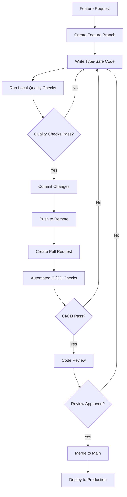

# Development Workflow

## Overview

This document establishes comprehensive development processes, code review standards, and quality gates for maintaining **PHPStan Level 10 compliance** throughout the development lifecycle. These workflows ensure consistent code quality, prevent regressions, and maintain the highest standards of type safety.

## Table of Contents

1. [Development Process Overview](#development-process-overview)
2. [Pre-commit Workflow](#pre-commit-workflow)
3. [Code Review Standards](#code-review-standards)
4. [Quality Gates](#quality-gates)
5. [CI/CD Pipeline](#cicd-pipeline)
6. [Branch Management](#branch-management)
7. [Release Process](#release-process)
8. [Hotfix Workflow](#hotfix-workflow)
9. [Documentation Maintenance](#documentation-maintenance)
10. [Performance Monitoring](#performance-monitoring)

## Development Process Overview

### Core Principles

1. **PHPStan Level 10 First**: All code must pass PHPStan Level 10 analysis before commit
2. **Type Safety by Design**: Write type-safe code from the beginning, not as an afterthought
3. **Test-Driven Development**: Write tests that validate type safety and business logic
4. **Continuous Integration**: Automated quality checks on every commit
5. **Zero Regression Policy**: No changes that break existing functionality or type safety

### Development Lifecycle



## Pre-commit Workflow

### Local Development Setup

**Install Pre-commit Hooks**:

```bash
# Install pre-commit hooks
cp .git/hooks/pre-commit.sample .git/hooks/pre-commit
chmod +x .git/hooks/pre-commit
```

**Pre-commit Hook Script** (`.git/hooks/pre-commit`):

```bash
#!/bin/sh
# Pre-commit hook for PHPStan Level 10 compliance

echo "🔍 Running pre-commit quality checks..."

# 1. Format code with Pint
echo "📝 Formatting code with Pint..."
./vendor/bin/pint --test
if [ $? -ne 0 ]; then
    echo "❌ Code formatting issues found. Run: ./vendor/bin/pint"
    exit 1
fi

# 2. Run Rector (dry-run to check for issues)
echo "🔧 Checking for Rector improvements..."
./vendor/bin/rector process --dry-run --no-progress-bar
if [ $? -ne 0 ]; then
    echo "⚠️  Rector found improvements. Run: ./vendor/bin/rector process"
    echo "   Then re-format with: ./vendor/bin/pint"
    exit 1
fi

# 3. Run PHPStan Level 10 on main application code
echo "🔬 Running PHPStan Level 10 analysis..."
./vendor/bin/phpstan analyse --level=10 app/ --no-progress
if [ $? -ne 0 ]; then
    echo "❌ PHPStan Level 10 violations found in application code"
    exit 1
fi

# 4. Run PHPStan on tests (allow some flexibility)
echo "🧪 Running PHPStan on tests..."
./vendor/bin/phpstan analyse --level=8 tests/ --no-progress
if [ $? -ne 0 ]; then
    echo "⚠️  PHPStan violations found in test code (Level 8)"
    echo "   Consider fixing these issues for better type safety"
fi

# 5. Run tests
echo "🧪 Running test suite..."
./vendor/bin/pest --no-coverage
if [ $? -ne 0 ]; then
    echo "❌ Tests failed"
    exit 1
fi

echo "✅ All pre-commit checks passed!"
```

### Developer Workflow Commands

**Daily Development Commands**:

```bash
# 1. Start development session
composer install
./vendor/bin/pint  # Format existing code

# 2. During development (run frequently)
./vendor/bin/phpstan analyse --level=10 app/  # Check main code
./vendor/bin/pest --filter="specific test"    # Run relevant tests

# 3. Before commit (comprehensive check)
./vendor/bin/pint                             # Format code
./vendor/bin/rector process                   # Apply improvements
./vendor/bin/pint                             # Re-format after Rector
./vendor/bin/phpstan analyse --level=10       # Full analysis
./vendor/bin/pest                             # Full test suite

# 4. Commit changes
git add .
git commit -m "feat: implement type-safe link validation"
```

### Code Quality Checklist

Before every commit, ensure:

- [ ] All new code has `declare(strict_types=1);`
- [ ] All properties have complete type annotations
- [ ] All methods have PHPDoc with parameter and return types
- [ ] Array shapes are explicitly defined
- [ ] Mixed types are handled with explicit type checking
- [ ] No PHPStan Level 10 violations in `app/` directory
- [ ] All tests pass
- [ ] Code is properly formatted with Pint
- [ ] Rector improvements have been applied

## Code Review Standards

### Review Checklist

**Type Safety Review**:

- [ ] **Strict Types**: All PHP files start with `declare(strict_types=1);`
- [ ] **Property Annotations**: All class properties have complete type annotations
- [ ] **Method Documentation**: All public methods have comprehensive PHPDoc blocks
- [ ] **Array Shapes**: Complex arrays have explicit shape definitions
- [ ] **Mixed Type Handling**: Mixed types are validated and cast appropriately
- [ ] **Enum Usage**: Enums are used instead of string constants where appropriate
- [ ] **Exception Handling**: Proper exception types and error messages

**Code Quality Review**:

- [ ] **Single Responsibility**: Classes and methods have clear, single purposes
- [ ] **Dependency Injection**: Dependencies are injected through constructors
- [ ] **Immutability**: ValueObjects are readonly and immutable
- [ ] **Error Handling**: Comprehensive error handling with meaningful messages
- [ ] **Performance**: No obvious performance issues or memory leaks
- [ ] **Security**: Input validation and security checks are in place

**Laravel Zero Specific Review**:

- [ ] **Command Structure**: Commands follow the established patterns
- [ ] **Service Layer**: Business logic is properly separated into services
- [ ] **Configuration**: Configuration is type-safe and well-documented
- [ ] **Testing**: Appropriate test coverage for new functionality
- [ ] **Documentation**: Code changes are reflected in documentation

### Review Process

**1. Automated Checks First**:
```bash
# Reviewer should verify CI/CD passed
# Check GitHub Actions status
# Verify all quality gates are green
```

**2. Manual Code Review**:
```php
// ✅ Good: Complete type safety
/**
 * Validate external link with comprehensive error handling.
 *
 * @param string $url The URL to validate
 * @param ValidationConfig $config Validation configuration
 * @return ValidationResult The validation result
 * @throws SecurityException If URL fails security validation
 */
public function validateExternalLink(string $url, ValidationConfig $config): ValidationResult
{
    if (!$this->security->validateUrl($url)) {
        throw new SecurityException("URL failed security validation: {$url}");
    }
    
    // Implementation with proper error handling
}

// ❌ Bad: Missing type information and error handling
public function validateExternalLink($url, $config)
{
    // Implementation without proper types or error handling
}
```

**3. Testing Review**:
```php
// ✅ Good: Type-safe test with explicit assertions
it('validates external links with proper error handling', function (): void {
    $service = app(LinkValidationInterface::class);
    $config = ValidationConfig::create(['scopes' => [ValidationScope::EXTERNAL]]);
    
    $result = $service->validateLink('https://example.com', $config);
    
    expect($result)->toBeInstanceOf(ValidationResult::class)
        ->and($result->getUrl())->toBe('https://example.com')
        ->and($result->getScope())->toBe(ValidationScope::EXTERNAL);
});

// ❌ Bad: Unclear test without proper type checking
it('validates links', function () {
    $result = validateLink('https://example.com');
    expect($result->isValid())->toBe(true);
});
```

### Review Comments Standards

**Constructive Feedback Examples**:

```markdown
## Type Safety Issue
This method is missing return type annotation. Please add:
```php
public function processData(array $data): ValidationResult
```

## Performance Concern
This loop could be optimized using array_map for better performance:
```php
$results = array_map(fn($item) => $this->processItem($item), $items);
```

## Documentation Missing
Please add PHPDoc block with parameter and return type documentation:
```php
/**
 * Process validation data and return results.
 *
 * @param array<string, mixed> $data Input data to process
 * @return ValidationResult The processed validation result
 * @throws ValidationException If data is invalid
 */
```
```

## Quality Gates

### Automated Quality Gates

**1. Static Analysis Gate**:
```yaml
# .github/workflows/static-analysis.yml
name: Static Analysis
on: [push, pull_request]

jobs:
  phpstan:
    runs-on: ubuntu-latest
    steps:
      - uses: actions/checkout@v4
      - name: Setup PHP
        uses: shivammathur/setup-php@v2
        with:
          php-version: '8.4'
      - name: Install dependencies
        run: composer install --prefer-dist --no-progress
      - name: Run PHPStan Level 10
        run: ./vendor/bin/phpstan analyse --level=10 --error-format=github
```

**2. Testing Gate**:
```yaml
# .github/workflows/tests.yml
name: Tests
on: [push, pull_request]

jobs:
  test:
    runs-on: ubuntu-latest
    steps:
      - uses: actions/checkout@v4
      - name: Setup PHP
        uses: shivammathur/setup-php@v2
        with:
          php-version: '8.4'
          coverage: xdebug
      - name: Install dependencies
        run: composer install --prefer-dist --no-progress
      - name: Run tests with coverage
        run: ./vendor/bin/pest --coverage --min=90
      - name: Upload coverage
        uses: codecov/codecov-action@v3
```

**3. Code Quality Gate**:
```yaml
# .github/workflows/code-quality.yml
name: Code Quality
on: [push, pull_request]

jobs:
  quality:
    runs-on: ubuntu-latest
    steps:
      - uses: actions/checkout@v4
      - name: Setup PHP
        uses: shivammathur/setup-php@v2
        with:
          php-version: '8.4'
      - name: Install dependencies
        run: composer install --prefer-dist --no-progress
      - name: Check code formatting
        run: ./vendor/bin/pint --test
      - name: Check for Rector improvements
        run: ./vendor/bin/rector process --dry-run
```

### Manual Quality Gates

**1. Code Review Gate**:
- Minimum 1 approving review required
- Reviewer must verify PHPStan Level 10 compliance
- All automated checks must pass
- Documentation must be updated if needed

**2. Integration Testing Gate**:
- All E2E tests must pass
- Performance benchmarks must be met
- No regression in existing functionality
- Memory usage within acceptable limits

**3. Documentation Gate**:
- Code changes reflected in documentation
- API documentation updated if needed
- Guidelines updated for new patterns
- Examples provided for complex changes

## CI/CD Pipeline

### Pipeline Configuration

**Complete CI/CD Pipeline** (`.github/workflows/ci.yml`):

```yaml
name: CI/CD Pipeline

on:
  push:
    branches: [ main, develop ]
  pull_request:
    branches: [ main ]

jobs:
  static-analysis:
    name: Static Analysis
    runs-on: ubuntu-latest
    steps:
      - uses: actions/checkout@v4
      
      - name: Setup PHP
        uses: shivammathur/setup-php@v2
        with:
          php-version: '8.4'
          extensions: mbstring, xml, ctype, iconv, intl
          
      - name: Cache Composer packages
        uses: actions/cache@v3
        with:
          path: vendor
          key: ${{ runner.os }}-php-${{ hashFiles('**/composer.lock') }}
          
      - name: Install dependencies
        run: composer install --prefer-dist --no-progress --no-suggest
        
      - name: Run Pint (Code Formatting)
        run: ./vendor/bin/pint --test
        
      - name: Run Rector (Code Modernization)
        run: ./vendor/bin/rector process --dry-run
        
      - name: Run PHPStan Level 10
        run: ./vendor/bin/phpstan analyse --level=10 --error-format=github

  tests:
    name: Tests
    runs-on: ubuntu-latest
    needs: static-analysis
    
    strategy:
      matrix:
        php-version: [8.4]
        
    steps:
      - uses: actions/checkout@v4
      
      - name: Setup PHP
        uses: shivammathur/setup-php@v2
        with:
          php-version: ${{ matrix.php-version }}
          extensions: mbstring, xml, ctype, iconv, intl
          coverage: xdebug
          
      - name: Install dependencies
        run: composer install --prefer-dist --no-progress
        
      - name: Run Unit Tests
        run: ./vendor/bin/pest --testsuite=Unit --coverage-clover=coverage-unit.xml
        
      - name: Run Feature Tests
        run: ./vendor/bin/pest --testsuite=Feature --coverage-clover=coverage-feature.xml
        
      - name: Run Integration Tests
        run: ./vendor/bin/pest --testsuite=Integration --coverage-clover=coverage-integration.xml
        
      - name: Run E2E Tests
        run: ./vendor/bin/pest --testsuite=E2E --coverage-clover=coverage-e2e.xml
        
      - name: Run Architecture Tests
        run: ./vendor/bin/pest --testsuite=Architecture
        
      - name: Combine Coverage Reports
        run: |
          ./vendor/bin/pest --coverage --min=90
          
      - name: Upload Coverage to Codecov
        uses: codecov/codecov-action@v3
        with:
          files: ./coverage.xml
          fail_ci_if_error: true

  security:
    name: Security Analysis
    runs-on: ubuntu-latest
    needs: static-analysis
    
    steps:
      - uses: actions/checkout@v4
      
      - name: Setup PHP
        uses: shivammathur/setup-php@v2
        with:
          php-version: '8.4'
          
      - name: Install dependencies
        run: composer install --prefer-dist --no-progress
        
      - name: Run Security Audit
        run: composer audit
        
      - name: Check for known vulnerabilities
        run: |
          if [ -f composer.lock ]; then
            curl -H "Accept: application/json" -X POST --data-binary @composer.lock https://security.symfony.com/check_lock
          fi

  performance:
    name: Performance Tests
    runs-on: ubuntu-latest
    needs: tests
    
    steps:
      - uses: actions/checkout@v4
      
      - name: Setup PHP
        uses: shivammathur/setup-php@v2
        with:
          php-version: '8.4'
          
      - name: Install dependencies
        run: composer install --prefer-dist --no-progress
        
      - name: Run Performance Tests
        run: ./vendor/bin/pest --group=performance
        
      - name: Memory Usage Test
        run: |
          php -d memory_limit=256M artisan validate tests/Fixtures/large-sample.md --scope=all
```

### Deployment Pipeline

**Production Deployment**:

```yaml
  deploy:
    name: Deploy to Production
    runs-on: ubuntu-latest
    needs: [static-analysis, tests, security, performance]
    if: github.ref == 'refs/heads/main'
    
    steps:
      - uses: actions/checkout@v4
      
      - name: Build Application
        run: |
          composer install --no-dev --optimize-autoloader
          php artisan config:cache
          
      - name: Create Release
        run: |
          php artisan app:build validate-links --build-version=${{ github.sha }}
          
      - name: Deploy to Production
        run: |
          # Deployment commands here
          echo "Deploying to production..."
```

## Branch Management

### Git Flow Strategy

**Branch Types**:

- `main`: Production-ready code, always deployable
- `develop`: Integration branch for features
- `feature/*`: Individual feature development
- `hotfix/*`: Critical production fixes
- `release/*`: Release preparation

**Branch Protection Rules**:

```yaml
# GitHub branch protection for main
main:
  required_status_checks:
    - static-analysis
    - tests
    - security
    - performance
  required_reviews: 1
  dismiss_stale_reviews: true
  require_code_owner_reviews: true
  restrictions:
    users: []
    teams: ["core-developers"]
```

### Feature Development Workflow

```bash
# 1. Start new feature
git checkout develop
git pull origin develop
git checkout -b feature/type-safe-reporting

# 2. Develop with quality checks
# ... make changes ...
./vendor/bin/phpstan analyse --level=10 app/
./vendor/bin/pest
git add .
git commit -m "feat: add type-safe reporting service"

# 3. Push and create PR
git push origin feature/type-safe-reporting
# Create PR via GitHub UI

# 4. After review approval and CI pass
git checkout develop
git pull origin develop
git merge --no-ff feature/type-safe-reporting
git push origin develop
git branch -d feature/type-safe-reporting
```

## Release Process

### Release Preparation

**1. Version Bump**:
```bash
# Update version in relevant files
# Update CHANGELOG.md
# Create release branch
git checkout develop
git checkout -b release/v2.1.0
```

**2. Final Quality Checks**:
```bash
# Run comprehensive test suite
./vendor/bin/pest --coverage --min=90

# Run performance benchmarks
./vendor/bin/pest --group=performance

# Verify PHPStan Level 10 compliance
./vendor/bin/phpstan analyse --level=10

# Check for security vulnerabilities
composer audit
```

**3. Release Documentation**:
```markdown
# Release v2.1.0

## New Features
- Enhanced type safety with PHPStan Level 10 compliance
- Improved error handling and reporting
- Performance optimizations for large files

## Breaking Changes
- None

## Bug Fixes
- Fixed memory leak in concurrent validation
- Improved error messages for invalid URLs

## Technical Improvements
- Complete PHPStan Level 10 compliance
- Enhanced test coverage (95%+)
- Updated dependencies to latest versions
```

### Release Deployment

```bash
# 1. Merge to main
git checkout main
git merge --no-ff release/v2.1.0

# 2. Tag release
git tag -a v2.1.0 -m "Release version 2.1.0"
git push origin main --tags

# 3. Deploy to production (automated via CI/CD)
# GitHub Actions will handle deployment

# 4. Clean up
git checkout develop
git merge main
git push origin develop
git branch -d release/v2.1.0
```

## Hotfix Workflow

### Critical Bug Fix Process

```bash
# 1. Create hotfix branch from main
git checkout main
git checkout -b hotfix/critical-security-fix

# 2. Implement fix with full quality checks
# ... make minimal changes ...
./vendor/bin/phpstan analyse --level=10 app/
./vendor/bin/pest
git commit -m "fix: resolve critical security vulnerability"

# 3. Test thoroughly
./vendor/bin/pest --testsuite=E2E
./vendor/bin/pest --group=security

# 4. Deploy hotfix
git checkout main
git merge --no-ff hotfix/critical-security-fix
git tag -a v2.1.1 -m "Hotfix version 2.1.1"
git push origin main --tags

# 5. Merge back to develop
git checkout develop
git merge main
git push origin develop
git branch -d hotfix/critical-security-fix
```

## Documentation Maintenance

### Documentation Update Process

**When to Update Documentation**:

- New features or significant changes
- API modifications
- Configuration changes
- New patterns or standards
- Performance improvements
- Security updates

**Documentation Checklist**:

- [ ] Update relevant guideline documents
- [ ] Update code examples
- [ ] Update configuration documentation
- [ ] Update API documentation
- [ ] Update README if needed
- [ ] Verify all cross-references are correct

### Documentation Review Process

```bash
# 1. Update documentation alongside code changes
# 2. Run documentation validation
./vendor/bin/validate docs/ --scope=all

# 3. Review for accuracy and completeness
# 4. Update cross-references and navigation
# 5. Commit documentation with code changes
```

## Performance Monitoring

### Performance Metrics

**Key Performance Indicators**:

- PHPStan analysis time
- Test execution time
- Memory usage during validation
- Concurrent request performance
- Large file processing time

**Performance Benchmarks**:

```php
// Performance test examples
it('processes 1000 links within time limit', function (): void {
    $startTime = microtime(true);
    
    // Process large dataset
    $service = app(LinkValidationInterface::class);
    $config = ValidationConfig::create(['concurrent_requests' => 10]);
    
    $urls = array_fill(0, 1000, 'https://example.com');
    $results = $service->validateLinks($urls, $config);
    
    $executionTime = microtime(true) - $startTime;
    
    expect($results->count())->toBe(1000)
        ->and($executionTime)->toBeLessThan(60.0); // 1 minute limit
})->group('performance');
```

### Monitoring and Alerting

**Performance Regression Detection**:

```yaml
# .github/workflows/performance-monitoring.yml
name: Performance Monitoring

on:
  schedule:
    - cron: '0 2 * * *'  # Daily at 2 AM
  push:
    branches: [main]

jobs:
  performance:
    runs-on: ubuntu-latest
    steps:
      - uses: actions/checkout@v4
      - name: Setup PHP
        uses: shivammathur/setup-php@v2
        with:
          php-version: '8.4'
      - name: Install dependencies
        run: composer install --prefer-dist --no-progress
      - name: Run performance benchmarks
        run: |
          ./vendor/bin/pest --group=performance --log-junit=performance-results.xml
      - name: Upload performance results
        uses: actions/upload-artifact@v3
        with:
          name: performance-results
          path: performance-results.xml
```

## Best Practices

### Development Best Practices

1. **Type Safety First**: Always write type-safe code from the beginning
2. **Test Early**: Write tests alongside implementation
3. **Small Commits**: Make focused, atomic commits
4. **Clear Messages**: Use conventional commit messages
5. **Documentation**: Update documentation with code changes

### Code Review Best Practices

1. **Constructive Feedback**: Provide helpful, specific feedback
2. **Focus on Standards**: Ensure PHPStan Level 10 compliance
3. **Performance Awareness**: Consider performance implications
4. **Security Mindset**: Review for security vulnerabilities
5. **Knowledge Sharing**: Use reviews as learning opportunities

### Quality Assurance Best Practices

1. **Automated First**: Rely on automated checks for consistency
2. **Manual Verification**: Use human judgment for complex issues
3. **Continuous Improvement**: Regularly update standards and tools
4. **Metrics Tracking**: Monitor quality metrics over time
5. **Team Training**: Keep team updated on best practices

---

## Navigation

**← Previous:** [Laravel Zero Patterns](laravel-zero-patterns.md) | **Next →** [Performance Standards](performance-standards.md)