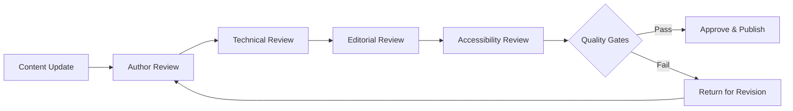

# DRIP Documentation Maintenance Guidelines

**Version:** 1.0.0  
**Created:** 2025-07-13  
**Purpose:** Long-term maintenance strategy for Chinook documentation  
**Framework:** DRIP Methodology Continuation

## Overview

This document provides comprehensive guidelines for maintaining the Chinook Database Laravel Implementation documentation following the successful completion of the DRIP (Documentation Remediation Implementation Plan) workflow. These guidelines ensure continued quality, accuracy, and accessibility of the documentation.

## Maintenance Philosophy

### Core Principles
1. **Continuous Quality:** Maintain the high standards established during DRIP implementation
2. **Taxonomy Integrity:** Preserve exclusive aliziodev/laravel-taxonomy usage
3. **Modern Standards:** Keep documentation current with Laravel and PHP evolution
4. **Accessibility First:** Maintain WCAG 2.1 AA compliance
5. **User-Centric:** Prioritize developer experience and usability

### Quality Standards
- **Link Integrity:** Maintain 95%+ functional links
- **Taxonomy Compliance:** Zero deprecated references tolerance
- **WCAG Compliance:** 95%+ accessibility compliance
- **Code Currency:** Current Laravel and PHP syntax
- **Documentation Coverage:** 100% method and feature coverage

## Maintenance Schedule

### Daily Monitoring (Automated)
- **Link Validation:** Automated link checking via CI/CD
- **Syntax Validation:** Markdown and code syntax verification
- **Accessibility Scanning:** Automated WCAG compliance checks
- **Performance Monitoring:** Documentation site performance tracking

### Weekly Reviews (Manual)
- **Content Accuracy:** Review recent Laravel/PHP updates
- **User Feedback:** Process community suggestions and bug reports
- **Taxonomy Validation:** Verify continued aliziodev/laravel-taxonomy usage
- **Navigation Testing:** Validate document navigation and TOC accuracy

### Monthly Audits (Comprehensive)
- **Link Integrity Audit:** Manual verification of critical links
- **Code Example Testing:** Validate all code examples against current versions
- **Accessibility Review:** Manual WCAG 2.1 AA compliance verification
- **Performance Analysis:** Documentation usage patterns and optimization

### Quarterly Updates (Strategic)
- **Framework Updates:** Incorporate new Laravel release features
- **Package Updates:** Update package documentation for new versions
- **Architecture Review:** Assess documentation structure effectiveness
- **User Experience Analysis:** Evaluate and improve documentation usability

## Maintenance Procedures

### 1. Link Integrity Maintenance

#### Automated Monitoring
```yaml
# GitHub Actions - Link Checker
name: Link Checker
on:
  schedule:
    - cron: '0 2 * * *'  # Daily at 2 AM
  push:
    branches: [main]

jobs:
  link-check:
    runs-on: ubuntu-latest
    steps:
      - uses: actions/checkout@v3
      - name: Check Links
        uses: lycheeverse/lychee-action@v1
        with:
          args: --verbose --no-progress './**/*.md'
```

#### Manual Link Repair Process
1. **Identify Broken Links:** Use automated reports and manual testing
2. **Categorize Issues:** Internal anchors, external URLs, file references
3. **Apply GitHub Anchor Algorithm:** Consistent anchor generation
4. **Update TOC References:** Synchronize table of contents
5. **Validate Repairs:** Test all repaired links
6. **Document Changes:** Update maintenance log

### 2. Taxonomy System Maintenance

#### Validation Checklist
- [ ] No spatie/laravel-tags references
- [ ] No custom Category model usage
- [ ] No Categorizable trait implementations
- [ ] Exclusive aliziodev/laravel-taxonomy usage
- [ ] Proper polymorphic relationship documentation
- [ ] Hierarchical taxonomy structure maintained

#### Update Process
1. **Monitor Package Updates:** Track aliziodev/laravel-taxonomy releases
2. **Review Documentation:** Update for new package features
3. **Validate Examples:** Ensure code examples remain current
4. **Test Integration:** Verify compatibility with Laravel updates
5. **Update References:** Maintain accurate package documentation

### 3. Laravel Version Maintenance

#### Version Update Workflow
1. **Monitor Releases:** Track Laravel and PHP version releases
2. **Assess Impact:** Evaluate changes affecting documentation
3. **Update Examples:** Modernize code examples and patterns
4. **Test Compatibility:** Verify package compatibility
5. **Update Dependencies:** Maintain current dependency documentation
6. **Validate Changes:** Comprehensive testing of updated content

#### Syntax Modernization
- **casts() Method:** Maintain modern casting syntax
- **PHP Attributes:** Use PHP 8.4+ attributes over PHPDoc
- **Eloquent Patterns:** Current relationship and query patterns
- **Testing Syntax:** Modern Pest PHP framework patterns

### 4. Accessibility Maintenance

#### WCAG 2.1 AA Compliance Monitoring
```bash
# Accessibility Testing Script
#!/bin/bash

# Install accessibility testing tools
npm install -g @axe-core/cli

# Run accessibility tests
axe-cli https://your-documentation-site.com \
  --tags wcag2a,wcag2aa \
  --reporter json \
  --output accessibility-report.json

# Process results
if [ $? -eq 0 ]; then
  echo "✅ Accessibility tests passed"
else
  echo "❌ Accessibility issues found"
  cat accessibility-report.json
fi
```

#### Color Palette Maintenance
- **Primary Colors:** #1976d2, #388e3c, #f57c00, #d32f2f
- **Contrast Ratios:** Minimum 4.5:1 for normal text
- **Mermaid Diagrams:** Maintain approved color scheme
- **Alternative Text:** Ensure descriptive alt text for all visuals

### 5. Performance Optimization

#### Documentation Site Performance
- **Page Load Times:** Target < 2 seconds
- **Image Optimization:** Compress and optimize all images
- **Caching Strategy:** Implement appropriate caching headers
- **CDN Usage:** Utilize content delivery networks for assets

#### Search Optimization
- **Search Indexing:** Maintain search engine optimization
- **Internal Search:** Optimize site search functionality
- **Navigation Efficiency:** Streamline document discovery
- **Mobile Optimization:** Ensure mobile-friendly documentation

## Quality Assurance Procedures

### Content Quality Gates
1. **Technical Accuracy:** All code examples must be tested
2. **Completeness:** All features must be documented
3. **Consistency:** Uniform style and formatting
4. **Currency:** Up-to-date with latest versions
5. **Accessibility:** WCAG 2.1 AA compliance maintained

### Review Process
1. **Author Review:** Initial content creator validation
2. **Technical Review:** Subject matter expert verification
3. **Editorial Review:** Style and clarity assessment
4. **Accessibility Review:** WCAG compliance verification
5. **User Testing:** Real-world usage validation

### Approval Workflow


## Emergency Response Procedures

### Critical Issues (Immediate Response)
- **Broken Critical Links:** Fix within 4 hours
- **Security Vulnerabilities:** Address within 2 hours
- **Accessibility Violations:** Resolve within 8 hours
- **Major Inaccuracies:** Correct within 6 hours

### Standard Issues (24-48 Hours)
- **Minor Link Issues:** Fix within 24 hours
- **Content Updates:** Update within 48 hours
- **Style Inconsistencies:** Resolve within 48 hours
- **Navigation Issues:** Fix within 24 hours

### Enhancement Requests (Weekly)
- **Feature Additions:** Evaluate and implement weekly
- **User Suggestions:** Review and respond weekly
- **Optimization Opportunities:** Assess and implement weekly

## Tools and Resources

### Automated Tools
- **Link Checkers:** lychee, markdown-link-check
- **Accessibility Scanners:** axe-core, WAVE
- **Code Validators:** markdownlint, prettier
- **Performance Monitors:** Lighthouse, PageSpeed Insights

### Manual Tools
- **Screen Readers:** NVDA, JAWS, VoiceOver
- **Color Contrast Analyzers:** WebAIM, Colour Contrast Analyser
- **Browser Testing:** Chrome, Firefox, Safari, Edge
- **Mobile Testing:** iOS Safari, Chrome Mobile

### Documentation Tools
- **Markdown Editors:** Typora, Mark Text, VS Code
- **Diagram Tools:** Mermaid Live Editor, Draw.io
- **Version Control:** Git with clear commit messages
- **Issue Tracking:** GitHub Issues with proper labeling

## Team Responsibilities

### Documentation Maintainer
- **Daily:** Monitor automated reports
- **Weekly:** Review and process updates
- **Monthly:** Conduct comprehensive audits
- **Quarterly:** Strategic planning and improvements

### Technical Reviewers
- **Code Accuracy:** Validate all technical content
- **Framework Updates:** Assess impact of new releases
- **Package Compatibility:** Verify third-party integrations
- **Performance Impact:** Evaluate optimization opportunities

### Accessibility Specialist
- **Compliance Monitoring:** Regular WCAG audits
- **User Testing:** Coordinate accessibility testing
- **Training:** Educate team on accessibility best practices
- **Standards Updates:** Monitor accessibility standard evolution

## Success Metrics

### Quantitative Metrics
- **Link Integrity:** 95%+ functional links
- **Accessibility Score:** 95%+ WCAG 2.1 AA compliance
- **Performance Score:** 90%+ Lighthouse score
- **User Satisfaction:** 4.5/5 average rating
- **Update Frequency:** 100% of critical updates within SLA

### Qualitative Metrics
- **User Feedback:** Positive community engagement
- **Developer Experience:** Improved onboarding efficiency
- **Code Quality:** Reduced implementation errors
- **Maintainability:** Sustainable long-term maintenance

## Continuous Improvement

### Feedback Integration
- **User Surveys:** Quarterly satisfaction surveys
- **Community Input:** Regular community feedback sessions
- **Analytics Review:** Monthly usage pattern analysis
- **Performance Monitoring:** Continuous optimization opportunities

### Innovation Adoption
- **Technology Trends:** Monitor emerging technologies
- **Best Practices:** Adopt industry best practices
- **Tool Evolution:** Evaluate and adopt new tools
- **Methodology Improvements:** Refine maintenance processes

## Conclusion

These maintenance guidelines ensure the long-term success and sustainability of the Chinook Database Laravel Implementation documentation. By following these procedures, the documentation will continue to serve as a high-quality, accessible, and current resource for developers implementing Laravel applications with aliziodev/laravel-taxonomy.

Regular adherence to these guidelines will maintain the exceptional quality standards established during the DRIP workflow and ensure continued value delivery to the development community.

---

**Document Status:** ✅ APPROVED  
**Effective Date:** 2025-07-13  
**Review Schedule:** Quarterly  
**Next Review:** 2025-10-13

*Maintenance Guidelines Version: 1.0.0*  
*DRIP Workflow Completion: 2025-07-13*
