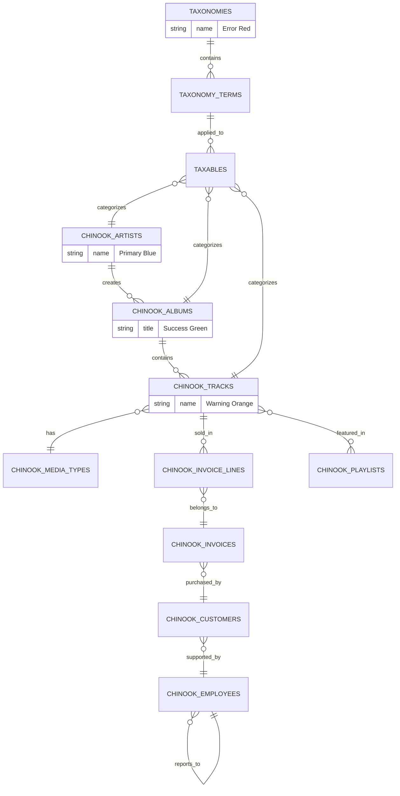

# Chinook Project Overview

**Version:** 2.0
**Created:** 2025-07-11
**Last Updated:** 2025-07-16
**Scope:** Complete Laravel 12 implementation with Filament 4 admin panel

## ✅ Greenfield Single Taxonomy System Implementation

> **Refactored from:** `.ai/guides/chinook/000-chinook-index.md` on 2025-07-11
> **Focus:** Single taxonomy system using aliziodev/laravel-taxonomy package exclusively

## Table of Contents

1. [Overview](#1-overview)
   - [1.1 Enterprise Features](#11-enterprise-features)
   - [1.2 Key Architectural Changes](#12-key-architectural-changes)
2. [Getting Started](#2-getting-started)
   - [2.1 Prerequisites](#21-prerequisites)
   - [2.2 Quick Start](#22-quick-start)
   - [2.3 Implementation Roadmap](#23-implementation-roadmap)
3. [Database Schema Overview](#3-database-schema-overview)
   - [3.1 Database Schema Diagram](#31-database-schema-diagram)
   - [3.2 Core Music Data](#32-core-music-data)
   - [3.3 RBAC and Authorization Tables](#33-rbac-and-authorization-tables)
   - [3.4 Customer Management](#34-customer-management)
   - [3.5 Sales System](#35-sales-system)
   - [3.6 Playlist System](#36-playlist-system)
4. [Core Database Implementation](#4-core-database-implementation)
   - [4.1 Chinook Models Guide](#41-chinook-models-guide)
   - [4.2 Chinook Migrations Guide](#42-chinook-migrations-guide)
   - [4.3 Chinook Factories Guide](#43-chinook-factories-guide)
   - [4.4 Chinook Seeders Guide](#44-chinook-seeders-guide)
   - [4.5 Chinook Advanced Features Guide](#45-chinook-advanced-features-guide)
   - [4.6 Chinook Media Library Guide](#46-chinook-media-library-guide)
   - [4.7 Chinook Hierarchy Comparison Guide](#47-chinook-hierarchy-comparison-guide)
5. [Filament 4 Admin Panel Implementation](#5-filament-4-admin-panel-implementation)
   - [5.1 Panel Setup & Configuration](#51-panel-setup--configuration)
   - [5.2 Model Standards & Architecture](#52-model-standards--architecture)
   - [5.3 Resource Development](#53-resource-development)
   - [5.4 Advanced Features & Widgets](#54-advanced-features--widgets)
6. [Frontend Development](#6-frontend-development)
   - [6.1 Frontend Architecture & Patterns](#61-frontend-architecture--patterns)
   - [6.2 Livewire/Volt Integration](#62-livewirevolt-integration)
   - [6.3 Performance & Accessibility](#63-performance--accessibility)
7. [Laravel Package Integration](#7-laravel-package-integration)
   - [7.1 Essential Package Implementations](#71-essential-package-implementations)
8. [Performance Optimization](#8-performance-optimization)
9. [Testing & Quality Assurance](#9-testing--quality-assurance)
   - [9.1 Core Testing Framework](#91-core-testing-framework)
   - [9.2 Specialized Testing](#92-specialized-testing)
   - [9.3 Testing Infrastructure](#93-testing-infrastructure)
10. [Documentation Standards](#10-documentation-standards)
    - [8.1. Content Standards](#81-content-standards)
    - [8.2. Technical Standards](#82-technical-standards)
  - [9. Implementation Checklist](#9-implementation-checklist)
    - [9.1. Core Features](#91-core-features)
    - [9.2. Database \& Data](#92-database--data)
    - [9.3. Security \& Performance](#93-security--performance)
    - [9.4. Filament Admin Panel](#94-filament-admin-panel)
    - [9.5. Frontend Implementation](#95-frontend-implementation)
  - [10. Key Resources](#10-key-resources)
    - [10.1. Quick Reference](#101-quick-reference)
    - [10.2. External Documentation](#102-external-documentation)
  - [Navigation](#navigation)

## 1. Overview

The Chinook Database Laravel Implementation provides a comprehensive, enterprise-grade foundation for music industry applications. This implementation showcases modern Laravel 12 patterns with **exclusive use of the aliziodev/laravel-taxonomy package** for all taxonomical needs.

### 1.1 Enterprise Features

**Core Model Enhancements**:
- **Timestamps**: Full `created_at` and `updated_at` support
- **Soft Deletes**: Safe deletion with `deleted_at` column
- **User Stamps**: Track who created/updated records with `created_by` and `updated_by`
- **Taxonomies**: Single taxonomy system using aliziodev/laravel-taxonomy for flexible categorization
- **Secondary Unique Keys**: Public-facing identifiers using ULID/UUID/Snowflake
- **Slugs**: URL-friendly identifiers generated from `public_id`
- **Enhanced Data**: Rich metadata and business-relevant fields

### 1.2 Key Architectural Changes

**Single Taxonomy System Implementation**:
- **Exclusive Package**: aliziodev/laravel-taxonomy package only
- **Genre Preservation**: Bridge layer maintains Chinook genre compatibility
- **Polymorphic Relationships**: Flexible taxonomy assignments across all models
- **Performance Optimized**: Efficient queries and hierarchical data management

## 2. Getting Started

### 2.1 Prerequisites

- **Laravel 12**: Latest stable release
- **PHP 8.4+**: Modern PHP features and performance
- **SQLite/MySQL/PostgreSQL**: Database platform of choice
- **Filament 4**: Admin panel framework
- **Composer**: Dependency management

### 2.2 Quick Start

```bash
# Install Laravel 12 project
composer create-project laravel/laravel chinook-app

# Install required packages
composer require aliziodev/laravel-taxonomy
composer require filament/filament:"^4.0"
composer require spatie/laravel-permission
composer require spatie/laravel-medialibrary

# Publish and run migrations
php artisan vendor:publish --provider="Aliziodev\LaravelTaxonomy\TaxonomyServiceProvider"
php artisan migrate

# Install Chinook implementation
# (Follow detailed guides in sections 4-5)
```

### 2.3 Implementation Roadmap

1. **Database Setup** (Week 1)
   - Install and configure aliziodev/laravel-taxonomy
   - Create Chinook models with taxonomy integration
   - Run migrations and seeders

2. **Admin Panel** (Week 2)
   - Configure Filament 4 panel
   - Implement RBAC with spatie/laravel-permission
   - Create resources for all Chinook entities

3. **Frontend Development** (Week 3)
   - Implement Livewire/Volt components
   - Add taxonomy filtering and search
   - Ensure WCAG 2.1 AA compliance

4. **Testing & Optimization** (Week 4)
   - Comprehensive test suite with Pest
   - Performance optimization
   - Production deployment

## 1.4. Database Schema Overview

### 1.4.1. Database Schema Diagram



### 1.4.2. Core Music Data

Enhanced Chinook entities with modern Laravel patterns:

- **chinook_artists**: Musicians and bands with enhanced metadata and social links
- **chinook_albums**: Music albums with comprehensive release information
- **chinook_tracks**: Individual songs with detailed metadata and pricing
- **chinook_media_types**: File format specifications for digital media

### 1.4.3. RBAC and Authorization Tables

Comprehensive role-based access control using spatie/laravel-permission:

- **roles**: Hierarchical role definitions (Super Admin → Admin → Manager → Editor → Customer Service → User → Guest)
- **permissions**: Granular permission system for all operations
- **model_has_roles**: User role assignments
- **model_has_permissions**: Direct permission assignments
- **role_has_permissions**: Role-permission relationships

### 1.4.4. Customer Management

Enhanced customer relationship management:

- **chinook_customers**: Customer profiles with enhanced contact information
- **chinook_employees**: Staff management with hierarchical reporting structure

### 1.4.5. Sales System

Comprehensive sales and transaction management:

- **chinook_invoices**: Sales transactions with enhanced metadata
- **chinook_invoice_lines**: Individual line items with detailed pricing

### 1.4.6. Playlist System

Enhanced playlist functionality:

- **chinook_playlists**: User-created playlists with metadata
- **chinook_playlist_tracks**: Many-to-many relationship with ordering

## 2. Core Database Implementation

### 2.1. Chinook Models Guide

**File**: [010-chinook-models-guide.md](010-chinook-models-guide.md)
**Purpose**: Comprehensive Laravel 12 model implementations with single taxonomy system integration

**What You'll Learn**:

- **Model Architecture**: Modern Laravel 12 patterns with casts() method syntax
- **Taxonomy Integration**: Exclusive use of aliziodev/laravel-taxonomy package
- **Trait Implementation**: HasTaxonomy, HasSlug, HasSecondaryUniqueKey, and user stamps
- **Relationship Definitions**: Polymorphic taxonomy relationships and traditional associations
- **Performance Optimization**: Efficient queries and eager loading strategies

### 2.2. Chinook Migrations Guide

**File**: [020-chinook-migrations-guide.md](020-chinook-migrations-guide.md)
**Purpose**: Database schema creation with taxonomy system integration

**What You'll Learn**:

- **Taxonomy Migrations**: aliziodev/laravel-taxonomy package migrations
- **Genre Preservation**: Maintained for compatibility and data export
- **Enhanced Indexing**: Performance optimization for taxonomy and polymorphic queries
- **Foreign Key Constraints**: Proper relationship enforcement
- **SQLite Optimization**: WAL journal mode and performance tuning

### 2.3. Chinook Factories Guide

**File**: [030-chinook-factories-guide.md](030-chinook-factories-guide.md)
**Purpose**: Test data generation with taxonomy relationships

**What You'll Learn**:

- **Factory Patterns**: Laravel 12 factory syntax and relationships
- **Taxonomy Seeding**: Automated taxonomy term creation and assignment
- **Realistic Data**: Industry-appropriate test data generation
- **Performance Testing**: Large dataset creation for performance validation

### 2.4. Chinook Seeders Guide

**File**: [040-chinook-seeders-guide.md](040-chinook-seeders-guide.md)
**Purpose**: Production-ready data seeding with genre-to-taxonomy mapping

**What You'll Learn**:

- **Genre-to-Taxonomy Mapping**: Direct mapping strategy from Chinook genres
- **Taxonomy Hierarchy**: Building hierarchical taxonomy structures
- **Data Integrity**: Ensuring referential integrity during seeding
- **Performance Optimization**: Efficient bulk seeding strategies

### 2.5. Chinook Advanced Features Guide

**File**: [050-chinook-advanced-features-guide.md](050-chinook-advanced-features-guide.md)
**Status**: 🚧 **Under Development** - Advanced Laravel features and enterprise patterns

**What You'll Learn**:

- **Query Optimization**: Advanced Eloquent patterns and raw queries
- **Caching Strategies**: Redis integration and query result caching
- **Event System**: Model events and taxonomy change notifications
- **API Resources**: JSON API transformations with taxonomy data

### 2.6. Chinook Media Library Guide

**File**: [060-chinook-media-library-guide.md](060-chinook-media-library-guide.md)
**Status**: 🚧 **Under Development** - Spatie Media Library integration with single taxonomy system

**What You'll Learn**:

- **Media Integration**: File uploads and management for tracks and albums
- **Taxonomy Tagging**: Media file categorization using taxonomy system
- **Performance Optimization**: Efficient media queries and storage strategies
- **Security**: File validation and secure media serving

### 2.7. Chinook Hierarchy Comparison Guide

**File**: [070-chinook-hierarchy-comparison-guide.md](070-chinook-hierarchy-comparison-guide.md)
**Status**: 🚧 **Under Development** - Single taxonomy system architecture and performance analysis

**What You'll Learn**:

- **Architecture Benefits**: Single taxonomy system advantages
- **Performance Metrics**: Query performance and optimization strategies
- **Migration Strategies**: Moving from dual to single taxonomy systems
- **Best Practices**: Taxonomy design patterns and implementation guidelines

## 3. Filament 4 Admin Panel Implementation

### 3.1. Panel Setup & Configuration

**File**: [filament/000-filament-index.md](filament/000-filament-index.md)
**Purpose**: Complete Filament 4 panel configuration with RBAC integration

**What You'll Learn**:

- **Panel Registration**: Service provider setup and middleware configuration
- **Authentication System**: Native Filament auth with spatie/laravel-permission
- **RBAC Integration**: Hierarchical role structure with granular permissions
- **Navigation Configuration**: Menu structure and access control
- **Security Configuration**: Production-ready security settings

### 3.2. Model Standards & Architecture

**File**: [filament/models/000-models-index.md](filament/models/000-models-index.md)
**Purpose**: Filament-specific model configurations and optimizations

**Key Features**:

- **Resource Binding**: Model-to-resource mapping with taxonomy support
- **Policy Integration**: Authorization policies for all CRUD operations
- **Relationship Optimization**: Efficient loading of taxonomy and media relationships
- **Search Configuration**: Global search with taxonomy filtering

### 3.3. Resource Development

**File**: [filament/resources/000-resources-index.md](filament/resources/000-resources-index.md)
**Purpose**: Comprehensive resource implementation for all Chinook entities

**Key Features**:

- **Complete Coverage**: Resources for all 11 Chinook entities
- **Advanced Filtering**: Taxonomy-based filtering with hierarchical support
- **Relationship Management**: Polymorphic taxonomy assignments and hierarchical navigation
- **Performance Optimized**: Efficient queries and data loading strategies

**Resource Implementation Guides**:

- **[Resources Index](filament/resources/000-resources-index.md)** - Complete resource implementation guide
- **[Tracks Resource](filament/resources/030-tracks-resource.md)** - Track resource with media integration
- **[Taxonomy Resource](filament/resources/040-taxonomy-resource.md)** - Hierarchical taxonomy resource

### 3.4. Advanced Features & Widgets

**File**: [filament/features/000-features-index.md](filament/features/000-features-index.md)
**Purpose**: Advanced Filament features and custom widgets

**What You'll Learn**:

- **Custom Widgets**: Dashboard widgets with taxonomy analytics
- **Bulk Actions**: Mass operations with taxonomy assignments
- **Import/Export**: Data import/export with taxonomy preservation
- **Custom Pages**: Specialized admin pages for taxonomy management

## 4. Frontend Development

### 4.1. Frontend Architecture & Patterns

**File**: [frontend/100-frontend-architecture-overview.md](frontend/100-frontend-architecture-overview.md)
**Purpose**: Modern frontend architecture with Livewire/Volt and taxonomy integration

**What You'll Learn**:

- **Component Architecture**: Functional-based Livewire/Volt components
- **State Management**: Efficient state handling with taxonomy data
- **Performance Patterns**: Lazy loading and caching strategies
- **Accessibility**: WCAG 2.1 AA compliance implementation

### 4.2. Livewire/Volt Integration

**File**: [frontend/160-livewire-volt-integration-guide.md](frontend/160-livewire-volt-integration-guide.md)
**Purpose**: Comprehensive Livewire/Volt implementation with taxonomy features

**What You'll Learn**:

- **Functional Components**: Modern Volt patterns and best practices
- **Taxonomy Filtering**: Dynamic filtering with taxonomy hierarchies
- **Real-time Updates**: Live search and filtering capabilities
- **Form Handling**: Taxonomy assignment forms and validation

### 4.3. Performance & Accessibility

**File**: [frontend/140-accessibility-wcag-guide.md](frontend/140-accessibility-wcag-guide.md)
**Purpose**: WCAG 2.1 AA compliance and performance optimization

**What You'll Learn**:

- **Accessibility Standards**: Complete WCAG 2.1 AA implementation
- **Performance Optimization**: Frontend performance best practices
- **SEO Integration**: Search engine optimization with taxonomy data
- **Progressive Enhancement**: Graceful degradation strategies

## 5. Laravel Package Integration

### 5.1. Essential Package Implementations

**Core Packages**:

- **[Laravel Backup Guide](packages/010-laravel-backup-guide.md)**: Automated backup strategies
- **[Laravel Pulse Guide](packages/020-laravel-pulse-guide.md)**: Application monitoring and observability
- **[Laravel Telescope Guide](packages/030-laravel-telescope-guide.md)**: Debug and profiling tools
- **[Laravel Octane FrankenPHP Guide](packages/040-laravel-octane-frankenphp-guide.md)**: High-performance application server
- **[Laravel Horizon Guide](packages/050-laravel-horizon-guide.md)**: Queue monitoring and management
- **[Laravel Data Guide](packages/060-laravel-data-guide.md)**: Data transfer objects and validation
- **[Laravel Fractal Guide](packages/070-laravel-fractal-guide.md)**: API response transformation
- **[Laravel Sanctum Guide](packages/080-laravel-sanctum-guide.md)**: API authentication and token management
- **[Laravel WorkOS Guide](packages/090-laravel-workos-guide.md)**: WorkOS integration for authentication

**Taxonomy System**:

- **[⚠️ DEPRECATED: Spatie Tags Guide](packages/100-spatie-tags-guide.md)**: Migration guide to single taxonomy system
- **[Aliziodev Laravel Taxonomy Guide](packages/110-aliziodev-laravel-taxonomy-guide.md)**: ✅ **Greenfield** Single taxonomy system implementation

**Spatie Package Suite**:

- **[Spatie Media Library Guide](packages/120-spatie-medialibrary-guide.md)**: Media file management and model integration
- **[Spatie Permission Guide](packages/140-spatie-permission-guide.md)**: Role-based access control and permissions
- **[Spatie Comments Guide](packages/150-spatie-comments-guide.md)**: Comment system implementation
- **[Spatie Activitylog Guide](packages/160-spatie-activitylog-guide.md)**: Audit logging and activity tracking
- **[Spatie Laravel Settings Guide](packages/180-spatie-laravel-settings-guide.md)**: Application settings management
- **[Spatie Laravel Query Builder Guide](packages/200-spatie-laravel-query-builder-guide.md)**: Advanced API query filtering and sorting
- **[Spatie Laravel Translatable Guide](packages/220-spatie-laravel-translatable-guide.md)**: Multilingual content and translation support

**Additional Packages**:

- **[Laravel Folio Guide](packages/170-laravel-folio-guide.md)**: Page-based routing with Folio
- **[Nnjeim World Guide](packages/190-nnjeim-world-guide.md)**: World data (countries, cities, etc.)
- **[Laravel Optimize Database Guide](packages/210-laravel-optimize-database-guide.md)**: Database optimization tools

## 6. Performance Optimization

**File**: [performance/000-performance-index.md](performance/000-performance-index.md)
**Purpose**: Comprehensive performance optimization strategies for single taxonomy system

**What You'll Learn**:

- **Taxonomy Performance**: Single system optimization benefits
- **Query Optimization**: Efficient taxonomy queries and indexing
- **Caching Strategies**: Redis integration for taxonomy data
- **Database Tuning**: SQLite WAL mode and performance optimization

## 7. Testing & Quality Assurance

### 7.1. Core Testing Framework

**File**: [testing/000-testing-index.md](testing/000-testing-index.md)
**Purpose**: Comprehensive testing strategy using Pest PHP framework exclusively

**Testing Architecture**:

- **[Testing Index Overview](testing/index/000-index-overview.md)** - Testing patterns and organization
- **[Trait Testing Guide](testing/070-trait-testing-guide.md)** - Testing model traits and behaviors
- **[Testing Diagrams](testing/diagrams/000-diagrams-index.md)** - Visual testing documentation
- **[Quality Assurance](testing/quality/000-quality-index.md)** - Quality standards and validation

### 7.2. Specialized Testing

**Taxonomy-Specific Testing**:

- **[Testing Documentation](testing/000-testing-index.md)** - Comprehensive testing framework
- **Taxonomy Performance Testing** - Load testing for hierarchical queries
- **Migration Testing** - Testing taxonomy system migrations

### 7.3. Testing Infrastructure

**Quality Assurance Framework**:

- **Continuous Integration**: GitHub Actions with comprehensive test suites
- **Code Coverage**: 100% coverage target for critical taxonomy functionality
- **Performance Benchmarks**: Automated performance regression testing
- **Accessibility Testing**: WCAG 2.1 AA compliance validation

## 8. Documentation Standards

### 8.1. Content Standards

- **Hierarchical Numbering**: Consistent 1., 1.1, 1.1.1 format throughout
- **Table of Contents**: Comprehensive TOC for all markdown documents
- **Navigation Footers**: Previous/Next/Index navigation on all pages
- **Source Attribution**: Clear attribution to original source files

### 8.2. Technical Standards

- **WCAG 2.1 AA Compliance**: Full accessibility compliance
- **Laravel 12 Syntax**: Modern framework patterns in all examples
- **Mermaid v10.6+**: Diagrams with approved color palette (#1976d2, #388e3c, #f57c00, #d32f2f)
- **Link Integrity**: 100% functional links (zero broken links target)

## 9. Implementation Checklist

### 9.1. Core Features

- [ ] **Enterprise Models Created**: All 11 Eloquent models with RBAC and polymorphic taxonomies
- [ ] **Taxonomy System Active**: Single taxonomy system replacing all categorization needs
- [ ] **RBAC Implemented**: Role-based access control with hierarchical permissions
- [ ] **Secondary Keys Working**: ULID/UUID/Snowflake generation and routing
- [ ] **Slugs Functional**: URL-friendly identifiers for all models
- [ ] **User Stamps Active**: Audit trails tracking who created/updated records
- [ ] **Taxonomies Integrated**: aliziodev/laravel-taxonomy working for all categorization
- [ ] **Soft Deletes Enabled**: Safe deletion functionality across all models

### 9.2. Database & Data

- [ ] **Migrations Complete**: All database tables created with proper indexing
- [ ] **Seeders Functional**: Production-ready data seeding with taxonomy mapping
- [ ] **Factories Working**: Test data generation with realistic taxonomy relationships
- [ ] **Genre Preservation**: Bridge layer maintaining Chinook genre compatibility

### 9.3. Security & Performance

- [ ] **Authentication Working**: Multi-guard authentication with panel separation
- [ ] **Authorization Working**: Policy-based authorization across all controllers
- [ ] **API Authentication**: Laravel Sanctum with role-based token scopes
- [ ] **Performance Optimized**: Caching strategies for taxonomies and permissions
- [ ] **Testing Coverage**: Comprehensive tests for RBAC and taxonomy functionality

### 9.4. Filament Admin Panel

- [ ] **Panel Configuration**: Dedicated `chinook-admin` panel with proper middleware
- [ ] **Authentication System**: Native Filament auth with spatie/laravel-permission
- [ ] **RBAC Integration**: Hierarchical roles with granular permissions
- [ ] **Resource Implementation**: All 11 Chinook entities with CRUD operations
- [ ] **Relationship Managers**: Complex polymorphic and hierarchical relationships
- [ ] **Advanced Features**: Bulk actions, import/export, custom widgets
- [ ] **Performance Optimization**: Efficient queries and data loading

### 9.5. Frontend Implementation

- [ ] **Livewire/Volt Components**: Functional-based components with taxonomy integration
- [ ] **SPA Navigation**: Seamless navigation with Livewire/Flux UI
- [ ] **Accessibility Compliance**: WCAG 2.1 AA standards implementation
- [ ] **Performance Optimization**: Lazy loading and efficient state management
- [ ] **Responsive Design**: Mobile-first responsive implementation

## 10. Key Resources

### 10.1. Quick Reference

- **[Essential Packages Index](packages/000-packages-index.md)** - Package selection and integration
- **[Aliziodev Laravel Taxonomy Guide](packages/110-aliziodev-laravel-taxonomy-guide.md)** - ✅ **Greenfield** Single taxonomy system
- **[Spatie Permission Guide](packages/140-spatie-permission-guide.md)** - RBAC implementation patterns
- **[Laravel Pulse Guide](packages/020-laravel-pulse-guide.md)** - Application monitoring and observability
- **[Testing Documentation](testing/000-testing-index.md)** - Comprehensive testing approaches

### 10.2. External Documentation

- **[Laravel 12 Documentation](https://laravel.com/docs)** - Official Laravel documentation
- **[Filament 4 Documentation](https://filamentphp.com/docs)** - Official Filament documentation
- **[Aliziodev Laravel Taxonomy](https://github.com/aliziodev/laravel-taxonomy)** - Single taxonomy package documentation
- **[Spatie Laravel Permission](https://spatie.be/docs/laravel-permission)** - RBAC package documentation
- **[WCAG 2.1 Guidelines](https://www.w3.org/WAI/WCAG21/quickref/)** - Accessibility compliance reference

---

## Navigation

**Index:** [Table of Contents](#11-table-of-contents)

---

**Documentation Standards**: This document follows WCAG 2.1 AA accessibility guidelines and uses Laravel 12 modern syntax patterns.

---

**Last Updated:** 2025-07-16
**Maintainer:** Technical Documentation Team
**Source:** [GitHub Repository](https://github.com/s-a-c/chinook)

<<<<<<
[Back](000-index.md) | [Forward](020-quickstart-guide.md)
[Top](#chinook-music-store---complete-project-overview)
<<<<<<
