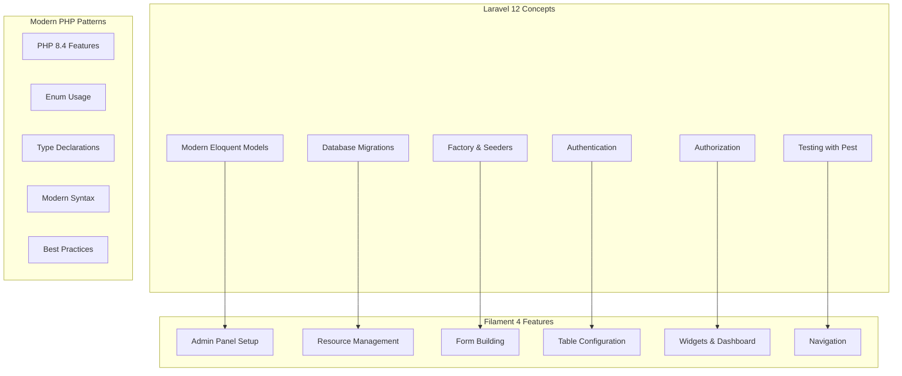

# Educational Scope Documentation

**Created:** 2025-07-16  
**Focus:** Clear educational deployment scope and production limitations  
**Source:** [Stakeholder Decisions - 2025-07-16](https://github.com/s-a-c/chinook)

## 1. Table of Contents

- [1.1. Overview](#11-overview)
- [1.2. Educational Purpose Statement](#12-educational-purpose-statement)
- [1.3. Learning Objectives](#13-learning-objectives)
- [1.4. Technical Scope](#14-technical-scope)
- [1.5. Production Limitations](#15-production-limitations)
- [1.6. Educational Features](#16-educational-features)
- [1.7. Deployment Guidelines](#17-deployment-guidelines)
- [1.8. Support Boundaries](#18-support-boundaries)

## 1.1. Overview

The Chinook project is **exclusively designed for educational purposes** to demonstrate modern Laravel 12 and Filament 4 development patterns. This documentation clarifies the educational scope, limitations, and appropriate use cases.

### 1.1.1. Educational Mission
- **Primary Purpose**: Learning Laravel 12 + Filament 4 development
- **Target Audience**: Students, developers learning modern PHP frameworks
- **Use Case**: Educational exercises, tutorials, and skill development
- **Deployment Scope**: Local development and educational environments only

### 1.1.2. Key Limitations
⚠️ **NOT FOR PRODUCTION USE**
- No production deployment support
- Simplified security for learning purposes
- SQLite-only database configuration
- Educational-appropriate performance targets

## 1.2. Educational Purpose Statement

### 1.2.1. Learning Focus Areas
The Chinook project demonstrates:



### 1.2.2. Educational Value
- **Practical Examples**: Real-world music database implementation
- **Modern Patterns**: Latest Laravel and PHP features
- **Best Practices**: Industry-standard development approaches
- **Complete Implementation**: End-to-end application development

## 1.3. Learning Objectives

### 1.3.1. Primary Learning Outcomes
After working with the Chinook project, learners will understand:

#### Laravel 12 Mastery
- **Model Relationships**: Complex Eloquent relationships and queries
- **Database Design**: Migration patterns and schema optimization
- **Authentication**: Laravel's authentication system integration
- **Testing**: Modern testing with Pest PHP framework
- **Package Integration**: Third-party package implementation

#### Filament 4 Proficiency
- **Panel Configuration**: Multi-panel setup and configuration
- **Resource Development**: CRUD operations with complex relationships
- **Form Design**: Advanced form building and validation
- **Table Management**: Data presentation and filtering
- **Dashboard Creation**: Widgets and analytics implementation

#### Modern PHP Development
- **PHP 8.4 Features**: Latest language features and syntax
- **Type Safety**: Strict typing and modern patterns
- **Code Organization**: Clean architecture principles
- **Documentation**: Comprehensive code documentation

### 1.3.2. Skill Development Areas
```php
// Example learning progression
class LearningPath
{
    public function beginnerLevel(): array
    {
        return [
            'Basic Laravel setup and configuration',
            'Simple Eloquent models and relationships',
            'Basic Filament resource creation',
            'Database migrations and seeders',
        ];
    }

    public function intermediateLevel(): array
    {
        return [
            'Complex model relationships and queries',
            'Advanced Filament form and table configuration',
            'Authentication and authorization patterns',
            'Testing with Pest PHP framework',
        ];
    }

    public function advancedLevel(): array
    {
        return [
            'Custom Filament widgets and pages',
            'Performance optimization techniques',
            'Package integration and customization',
            'Advanced testing strategies',
        ];
    }
}
```

## 1.4. Technical Scope

### 1.4.1. Supported Environments
✅ **Supported for Educational Use**:
- Local development environments
- Educational institution servers
- Student project hosting
- Tutorial and workshop environments
- Code review and assessment platforms

❌ **NOT Supported**:
- Production web applications
- Commercial applications
- High-traffic websites
- Mission-critical systems
- Public-facing services

### 1.4.2. Technical Specifications
```php
// Educational environment specifications
class EducationalSpecs
{
    public const SUPPORTED_USERS = 1-50;           // Concurrent users
    public const DATABASE_SIZE = '< 1GB';          // SQLite limitations
    public const RESPONSE_TIME = '< 100ms';        // Performance target
    public const UPTIME_REQUIREMENT = 'None';      // No SLA
    public const SECURITY_LEVEL = 'Educational';   // Simplified security
    public const BACKUP_STRATEGY = 'Manual';       // No automated backups
    public const MONITORING = 'Basic';             // Development tools only
}
```

### 1.4.3. Architecture Decisions for Education
```php
// Simplified for learning, not production
return [
    'database' => 'sqlite',              // Single file, easy setup
    'authentication' => 'basic',         // Laravel default auth
    'caching' => 'file',                // No Redis/Memcached required
    'queues' => 'sync',                 // No background job processing
    'sessions' => 'file',               // File-based sessions
    'logging' => 'single',              // Simple log file
    'mail' => 'log',                    // Email to log files
];
```

## 1.5. Production Limitations

### 1.5.1. Security Limitations
⚠️ **Educational Security Only**:
- Simplified authentication flow
- Basic authorization patterns
- No advanced security hardening
- Development-friendly error handling
- Minimal input validation examples

### 1.5.2. Performance Limitations
⚠️ **Not Production-Ready**:
- SQLite database only (no horizontal scaling)
- File-based caching (no distributed cache)
- Synchronous queue processing
- No CDN integration
- Basic error handling

### 1.5.3. Scalability Limitations
⚠️ **Educational Scale Only**:
```php
class ProductionLimitations
{
    public const MAX_CONCURRENT_USERS = 50;
    public const MAX_DATABASE_SIZE = '1GB';
    public const MAX_FILE_UPLOADS = '10MB';
    public const SESSION_STORAGE = 'file';
    public const QUEUE_DRIVER = 'sync';
    public const CACHE_DRIVER = 'file';
    
    public function getProductionRequirements(): array
    {
        return [
            'database' => 'MySQL/PostgreSQL with replication',
            'cache' => 'Redis cluster',
            'sessions' => 'Redis/Database',
            'queues' => 'Redis/SQS with workers',
            'storage' => 'S3/CDN integration',
            'monitoring' => 'APM tools (New Relic, etc.)',
            'logging' => 'Centralized logging (ELK stack)',
            'security' => 'WAF, rate limiting, encryption',
        ];
    }
}
```

## 1.6. Educational Features

### 1.6.1. Learning-Optimized Configuration
```php
// config/app.php - Educational settings
return [
    'debug' => true,                    // Show detailed errors
    'log_level' => 'debug',            // Verbose logging
    'app_env' => 'local',              // Development environment
    
    // Educational-friendly defaults
    'session_lifetime' => 120,         // 2 hours (longer for learning)
    'password_timeout' => 10800,       // 3 hours (extended for tutorials)
];
```

### 1.6.2. Development Tools Integration
```php
// Educational development stack
class EducationalTools
{
    public function getIncludedTools(): array
    {
        return [
            'laravel/telescope' => 'Debug assistant',
            'barryvdh/laravel-debugbar' => 'Debug toolbar',
            'spatie/laravel-ray' => 'Debug tool',
            'pestphp/pest' => 'Testing framework',
            'laravel/pint' => 'Code formatting',
            'larastan/larastan' => 'Static analysis',
        ];
    }
}
```

### 1.6.3. Documentation Features
- **Comprehensive Examples**: Complete code examples for all features
- **Step-by-Step Guides**: Detailed implementation instructions
- **Best Practice Notes**: Educational annotations throughout code
- **Common Pitfalls**: Learning-focused troubleshooting guides

## 1.7. Deployment Guidelines

### 1.7.1. Appropriate Deployment Scenarios
✅ **Recommended Uses**:
```bash
# Local development
php artisan serve

# Educational institution server
# - Internal network only
# - Student access only
# - No public internet exposure

# Workshop/tutorial environment
# - Temporary setup
# - Guided learning sessions
# - Code review purposes
```

### 1.7.2. Deployment Restrictions
❌ **Prohibited Uses**:
- Public web hosting
- Commercial applications
- Production environments
- High-availability requirements
- Mission-critical systems

### 1.7.3. Setup Instructions for Education
```bash
# Educational setup (simplified)
git clone https://github.com/s-a-c/chinook.git
cd chinook
composer install
cp .env.example .env
php artisan key:generate
touch database/database.sqlite
php artisan migrate --seed
php artisan serve
```

## 1.8. Support Boundaries

### 1.8.1. Supported Activities
✅ **Educational Support Provided**:
- Learning Laravel 12 and Filament 4 concepts
- Understanding modern PHP development patterns
- Code review and educational feedback
- Tutorial and workshop assistance
- Academic project guidance

### 1.8.2. Unsupported Activities
❌ **No Support Provided For**:
- Production deployment issues
- Commercial application development
- Performance optimization for high traffic
- Security hardening for public applications
- Scalability for large user bases

### 1.8.3. Getting Help
```php
// Educational support channels
class EducationalSupport
{
    public function getSupportChannels(): array
    {
        return [
            'documentation' => 'Comprehensive guides in .ai/guides/',
            'code_examples' => 'Working examples throughout codebase',
            'testing' => 'Test suite demonstrates usage patterns',
            'comments' => 'Inline code documentation',
        ];
    }
    
    public function getUnsupportedAreas(): array
    {
        return [
            'production_deployment',
            'commercial_licensing',
            'performance_tuning',
            'security_hardening',
            'scalability_planning',
        ];
    }
}
```

## 1.9. Transition to Production

### 1.9.1. Production Readiness Checklist
For learners who want to build production applications, consider:

```php
class ProductionReadinessChecklist
{
    public function getRequiredChanges(): array
    {
        return [
            'database' => 'Migrate to MySQL/PostgreSQL',
            'caching' => 'Implement Redis/Memcached',
            'queues' => 'Setup background job processing',
            'security' => 'Implement comprehensive security measures',
            'monitoring' => 'Add APM and error tracking',
            'testing' => 'Expand test coverage to 90%+',
            'deployment' => 'Setup CI/CD pipeline',
            'backup' => 'Implement automated backup strategy',
        ];
    }
}
```

### 1.9.2. Learning Path to Production
1. **Master Educational Version**: Complete understanding of all concepts
2. **Study Production Patterns**: Learn scalability and security patterns
3. **Practice with Real Projects**: Build production-ready applications
4. **Professional Development**: Advanced Laravel and PHP courses

---

**Documentation Standards**: This document follows WCAG 2.1 AA accessibility guidelines and uses Laravel 12 modern syntax patterns.

**⚠️ EDUCATIONAL USE ONLY**: This project is designed exclusively for educational purposes and is not suitable for production deployment.

<<<<<<
[Back](020-quickstart-guide.md) | [Forward](040-documentation-style-guide.md)
[Top](#educational-scope-documentation)
<<<<<<
