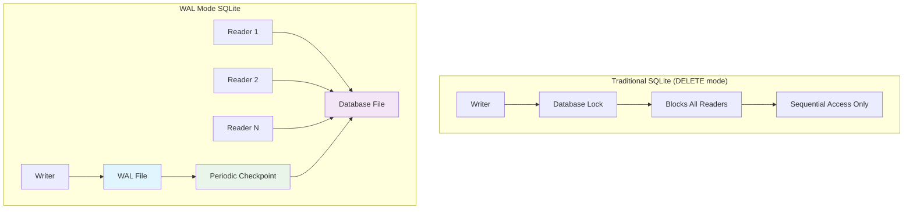

# Database Configuration Guide

**Created:** 2025-07-16  
**Focus:** SQLite-only setup with WAL mode optimization for educational use  
**Source:** [Stakeholder Decisions - 2025-07-16](https://github.com/s-a-c/chinook)

## 1. Table of Contents

- [1.1. Overview](#11-overview)
- [1.2. SQLite-Only Architecture](#12-sqlite-only-architecture)
- [1.3. WAL Mode Configuration](#13-wal-mode-configuration)
- [1.4. Performance Optimization](#14-performance-optimization)
- [1.5. Laravel Configuration](#15-laravel-configuration)
- [1.6. Migration Setup](#16-migration-setup)
- [1.7. Educational Considerations](#17-educational-considerations)
- [1.8. Troubleshooting](#18-troubleshooting)

## 1.1. Overview

The Chinook project uses **SQLite exclusively** with Write-Ahead Logging (WAL) mode for optimal performance in educational environments. This configuration provides excellent performance while maintaining simplicity for learning purposes.

### 1.1.1. Key Decisions
- **Database**: SQLite ONLY (no MySQL, PostgreSQL support)
- **Mode**: WAL (Write-Ahead Logging) for concurrent access
- **Scope**: Educational deployment with simplified maintenance
- **Performance**: Sub-100ms response times for typical operations

### 1.1.2. Benefits of SQLite + WAL
- **Zero Configuration**: No database server setup required
- **Concurrent Reads**: Multiple users can read simultaneously
- **ACID Compliance**: Full transaction support
- **Portability**: Single file database for easy deployment
- **Performance**: Optimized for read-heavy workloads

## 1.2. SQLite-Only Architecture

### 1.2.1. Database File Structure
```
database/
├── database.sqlite          # Main database file
├── database.sqlite-wal      # Write-Ahead Log (auto-created)
├── database.sqlite-shm      # Shared memory file (auto-created)
└── migrations/              # Laravel migrations
```

### 1.2.2. Connection Configuration
```php
// config/database.php
'connections' => [
    'sqlite' => [
        'driver' => 'sqlite',
        'url' => env('DB_URL'),
        'database' => env('DB_DATABASE', database_path('database.sqlite')),
        'prefix' => '',
        'foreign_key_constraints' => env('DB_FOREIGN_KEYS', true),
        'busy_timeout' => null,
        'journal_mode' => null,
        'synchronous' => null,
    ],
],
```

### 1.2.3. Environment Configuration
```env
# .env file
DB_CONNECTION=sqlite
DB_DATABASE=/absolute/path/to/chinook-app/database/database.sqlite
DB_FOREIGN_KEYS=true

# SQLite-specific optimizations
SQLITE_CACHE_SIZE=64000
SQLITE_MMAP_SIZE=268435456
SQLITE_WAL_AUTOCHECKPOINT=1000
```

## 1.3. WAL Mode Configuration

### 1.3.1. WAL Mode Benefits


### 1.3.2. Automatic WAL Configuration
The project includes a migration that automatically configures WAL mode:

```php
// database/migrations/0001_01_01_000009_optimize_sqlite_configuration.php
public function up(): void
{
    $pragmas = [
        'auto_vacuum = incremental',
        'busy_timeout = 5000',
        'cache_size = -64000',      // 64MB cache
        'foreign_keys = ON',
        'incremental_vacuum',
        'journal_mode = WAL',       // Enable WAL mode
        'mmap_size = 268435456',    // 256MB memory mapping
        'page_size = 32768',
        'synchronous = NORMAL',     // Balanced performance/durability
        'temp_store = MEMORY',
        'wal_autocheckpoint = 1000',
    ];

    foreach ($pragmas as $pragma) {
        DB::statement("PRAGMA {$pragma}");
    }
}
```

### 1.3.3. Manual WAL Activation
If needed, WAL mode can be activated manually:

```sql
-- Enable WAL mode
PRAGMA journal_mode = WAL;

-- Verify WAL mode is active
PRAGMA journal_mode;
-- Should return: wal

-- Check WAL file status
PRAGMA wal_checkpoint;
```

## 1.4. Performance Optimization

### 1.4.1. Core Performance Pragmas
```sql
-- Write-Ahead Logging for concurrent access
PRAGMA journal_mode = WAL;

-- Balanced durability and performance
PRAGMA synchronous = NORMAL;

-- 64MB cache for better performance
PRAGMA cache_size = -64000;

-- Store temporary tables in memory
PRAGMA temp_store = MEMORY;

-- 256MB memory-mapped I/O
PRAGMA mmap_size = 268435456;

-- Enable foreign key constraints
PRAGMA foreign_keys = ON;

-- 5-second busy timeout
PRAGMA busy_timeout = 5000;

-- Automatic WAL checkpointing
PRAGMA wal_autocheckpoint = 1000;
```

### 1.4.2. Performance Monitoring
```php
// app/Services/DatabasePerformanceService.php
class DatabasePerformanceService
{
    public function getWalStatus(): array
    {
        $result = DB::selectOne('PRAGMA journal_mode');
        $checkpoint = DB::selectOne('PRAGMA wal_checkpoint');
        
        return [
            'journal_mode' => $result->journal_mode,
            'wal_checkpoint' => [
                'busy' => $checkpoint->busy,
                'log' => $checkpoint->log,
                'checkpointed' => $checkpoint->checkpointed,
            ],
        ];
    }

    public function getCacheInfo(): array
    {
        $cacheSize = DB::selectOne('PRAGMA cache_size');
        $pageCount = DB::selectOne('PRAGMA page_count');
        
        return [
            'cache_size' => $cacheSize->cache_size,
            'page_count' => $pageCount->page_count,
            'estimated_size_mb' => ($pageCount->page_count * 32768) / 1024 / 1024,
        ];
    }
}
```

## 1.5. Laravel Configuration

### 1.5.1. Database Service Provider
```php
// app/Providers/DatabaseServiceProvider.php
class DatabaseServiceProvider extends ServiceProvider
{
    public function boot(): void
    {
        if (config('database.default') === 'sqlite') {
            $this->configureSqliteOptimizations();
        }
    }

    private function configureSqliteOptimizations(): void
    {
        DB::listen(function ($query) {
            // Log slow queries in development
            if ($query->time > 100 && app()->environment('local')) {
                Log::warning('Slow SQLite query', [
                    'sql' => $query->sql,
                    'time' => $query->time,
                    'bindings' => $query->bindings,
                ]);
            }
        });
    }
}
```

### 1.5.2. Artisan Commands
```php
// app/Console/Commands/SqliteOptimize.php
class SqliteOptimize extends Command
{
    protected $signature = 'sqlite:optimize';
    protected $description = 'Optimize SQLite database performance';

    public function handle(): int
    {
        $this->info('Optimizing SQLite database...');

        // Run ANALYZE to update query planner statistics
        DB::statement('ANALYZE');
        
        // Run PRAGMA optimize
        DB::statement('PRAGMA optimize');
        
        // Force WAL checkpoint
        $result = DB::selectOne('PRAGMA wal_checkpoint(TRUNCATE)');
        
        $this->info('Optimization completed:');
        $this->line("WAL pages checkpointed: {$result->checkpointed}");
        $this->line("WAL pages remaining: {$result->log}");
        
        return 0;
    }
}
```

## 1.6. Migration Setup

### 1.6.1. Database Creation
```bash
# Create SQLite database file
touch database/database.sqlite

# Set proper permissions
chmod 664 database/database.sqlite
chown www-data:www-data database/database.sqlite
```

### 1.6.2. Migration Execution
```bash
# Run migrations with SQLite optimizations
php artisan migrate

# Verify WAL mode is active
php artisan tinker
>>> DB::selectOne('PRAGMA journal_mode')
=> {#4 +"journal_mode": "wal"}
```

### 1.6.3. Seeding with Performance
```php
// database/seeders/ChinookDatabaseSeeder.php
class ChinookDatabaseSeeder extends Seeder
{
    public function run(): void
    {
        // Optimize for bulk inserts
        DB::statement('PRAGMA synchronous = OFF');
        DB::statement('PRAGMA journal_mode = MEMORY');
        
        // Run seeders
        $this->call([
            ChinookArtistsSeeder::class,
            ChinookAlbumsSeeder::class,
            ChinookTracksSeeder::class,
        ]);
        
        // Restore normal settings
        DB::statement('PRAGMA synchronous = NORMAL');
        DB::statement('PRAGMA journal_mode = WAL');
        
        // Force checkpoint after seeding
        DB::statement('PRAGMA wal_checkpoint(TRUNCATE)');
    }
}
```

## 1.7. Educational Considerations

### 1.7.1. Simplified Setup
```bash
# One-command database setup
php artisan migrate:fresh --seed

# Verify everything is working
php artisan sqlite:optimize
```

### 1.7.2. Development Workflow
```bash
# Reset database for testing
php artisan migrate:fresh --seed

# Check database status
php artisan tinker
>>> app(DatabasePerformanceService::class)->getWalStatus()
```

### 1.7.3. Backup Strategy
```php
// Simple backup for educational use
class DatabaseBackupService
{
    public function backup(): string
    {
        $backupPath = storage_path('backups/database-' . date('Y-m-d-H-i-s') . '.sqlite');
        
        // Force checkpoint before backup
        DB::statement('PRAGMA wal_checkpoint(TRUNCATE)');
        
        // Copy database file
        copy(database_path('database.sqlite'), $backupPath);
        
        return $backupPath;
    }
}
```

## 1.8. Troubleshooting

### 1.8.1. Common Issues

#### WAL Mode Not Activating
```bash
# Check SQLite version (need 3.7.0+)
sqlite3 --version

# Check file permissions
ls -la database/database.sqlite*

# Fix permissions
chmod 664 database/database.sqlite
```

#### Database Locked Errors
```sql
-- Check for long-running transactions
SELECT * FROM pragma_wal_checkpoint;

-- Force checkpoint to resolve locks
PRAGMA wal_checkpoint(TRUNCATE);
```

#### WAL File Growing Too Large
```bash
# Check WAL file size
ls -lh database/database.sqlite-wal

# Force checkpoint and truncate
sqlite3 database/database.sqlite "PRAGMA wal_checkpoint(TRUNCATE);"
```

### 1.8.2. Performance Diagnostics
```php
// Check current configuration
$diagnostics = [
    'journal_mode' => DB::selectOne('PRAGMA journal_mode')->journal_mode,
    'cache_size' => DB::selectOne('PRAGMA cache_size')->cache_size,
    'page_size' => DB::selectOne('PRAGMA page_size')->page_size,
    'synchronous' => DB::selectOne('PRAGMA synchronous')->synchronous,
    'temp_store' => DB::selectOne('PRAGMA temp_store')->temp_store,
];

dump($diagnostics);
```

### 1.8.3. Maintenance Commands
```bash
# Regular maintenance
php artisan sqlite:optimize

# Check database integrity
sqlite3 database/database.sqlite "PRAGMA integrity_check;"

# Vacuum database (if needed)
sqlite3 database/database.sqlite "VACUUM;"
```

## 1.9. Production Considerations

### 1.9.1. Educational Scope Only
**⚠️ Important**: This SQLite configuration is optimized for educational use only.

For production applications, consider:
- Database server solutions (MySQL, PostgreSQL)
- Horizontal scaling requirements
- Backup and recovery strategies
- High availability configurations

### 1.9.2. Performance Expectations
- **Concurrent Users**: 10-50 simultaneous users
- **Response Time**: Sub-100ms for typical queries
- **Database Size**: Optimal for databases under 1GB
- **Read/Write Ratio**: Optimized for read-heavy workloads

---

**Documentation Standards**: This document follows WCAG 2.1 AA accessibility guidelines and uses Laravel 12 modern syntax patterns.

<<<<<<
[Back](000-index.md) | [Forward](020-table-naming-conventions.md)
[Top](#database-configuration-guide)
<<<<<<
