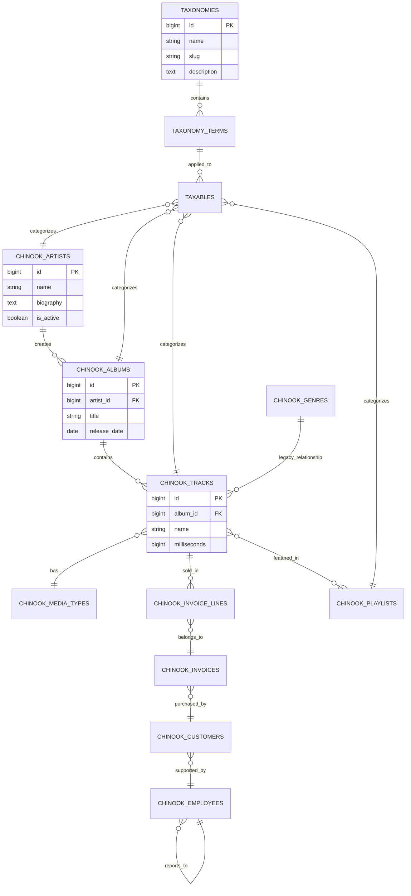

# 1. Chinook Database Schema Guide
## ✅ Greenfield Single Taxonomy System Implementation

> **Refactored from:** `.ai/guides/chinook/020-chinook-migrations-guide.md` on 2025-07-11  
> **Focus:** Single taxonomy system using aliziodev/laravel-taxonomy package exclusively

## 1.1. Table of Contents

- [1.2. Overview](#12-overview)
    - [1.2.1. Modern Laravel 12 Features](#121-modern-laravel-12-features-included)
    - [1.2.2. Greenfield Implementation Strategy](#122-greenfield-implementation-strategy)
- [2. Prerequisites](#2-prerequisites)
    - [2.1. Required Packages](#21-required-packages)
    - [2.2. Package Installation](#22-package-installation)
- [3. Schema Creation Order](#3-schema-creation-order)
    - [3.1. Dependency Order](#31-dependency-order)
    - [3.2. Generate Migration Commands](#32-generate-migration-commands)
- [4. Schema Implementations](#4-schema-implementations)
    - [4.1. Database Schema Overview](#41-database-schema-overview)
    - [4.2. Artists Migration](#42-artists-migration)
    - [4.3. Taxonomy System Migrations](#43-taxonomy-system-migrations)
- [5. Modern Laravel Features Summary](#5-modern-laravel-features-summary)
- [6. Migration Best Practices](#6-migration-best-practices)
- [7. Next Steps](#7-next-steps)

## 1.2. Overview

This guide provides comprehensive instructions for creating a **✅ greenfield** modern Laravel 12 database schema with the Chinook database using a **single taxonomy system**. This is a new implementation approach, not a migration from an existing system. The schema will establish the complete table structure, relationships, and constraints needed for the digital music store database.

### 1.2.1. Modern Laravel 12 Features Included

- **Single Taxonomy System**: Unified categorization using aliziodev/laravel-taxonomy package
- **Genre Compatibility**: Preserved model for data export/import compatibility
- **Timestamps**: `created_at`, `updated_at` columns
- **Soft Deletes**: `deleted_at` column for safe deletion
- **User Stamps**: `created_by`, `updated_by`, `deleted_by` columns
- **Secondary Unique Keys**: `public_id` column for public-facing identifiers
- **Slugs**: `slug` column for URL-friendly identifiers
- **Comments & Reactions**: Full commenting system with reactions for user engagement
- **Enhanced Fields**: Additional descriptive and metadata fields

### 1.2.2. Greenfield Implementation Strategy

**🎯 CRITICAL**: This is a **✅ Greenfield Implementation** using a **single taxonomy system** with aliziodev/laravel-taxonomy package. This is not a migration from an existing system.

**Key Principles:**

1. **Single Taxonomy System**: Use aliziodev/laravel-taxonomy as the sole categorization system
2. **Clean Architecture**: No legacy systems or dual approaches
3. **Genre Compatibility**: Preserved model for data export/import compatibility
4. **Modern Laravel 12**: All features use current Laravel patterns and conventions

**Benefits of Single Taxonomy System:**

- **Unified Categorization**: One system for all taxonomical needs
- **Performance Optimization**: Reduced complexity and improved query performance
- **Maintainability**: Single source of truth for all categorization logic
- **Scalability**: Hierarchical taxonomy structure supports complex categorization needs

## 2. Prerequisites

### 2.1. Required Packages

Ensure these packages are installed for full functionality:

```bash
# Single taxonomy system (CRITICAL for categorization)
composer require aliziodev/laravel-taxonomy

# Core Laravel features
composer require spatie/laravel-sluggable
composer require wildside/userstamps
composer require glhd/bits

# Role-based access control
composer require spatie/laravel-permission

# Media library integration
composer require spatie/laravel-medialibrary

# Comments and reactions
composer require spatie/laravel-comments

# Activity logging
composer require spatie/laravel-activitylog
```

### 2.2. Package Installation

```bash
# Publish taxonomy migrations
php artisan vendor:publish --provider="Aliziodev\LaravelTaxonomy\TaxonomyServiceProvider"

# Publish permission migrations
php artisan vendor:publish --provider="Spatie\Permission\PermissionServiceProvider"

# Publish comments migrations
php artisan vendor:publish --provider="Spatie\Comments\CommentsServiceProvider" --tag="comments-migrations"

# Publish media library migrations
php artisan vendor:publish --provider="Spatie\MediaLibrary\MediaLibraryServiceProvider" --tag="migrations"
```

## 3. Schema Creation Order

### 3.1. Dependency Order

The migrations must be created and run in this specific order to maintain referential integrity:

1. **Foundation Tables** (no dependencies)
   - `chinook_artists`
   - `chinook_media_types`
   - `chinook_employees`
   - `chinook_customers`
   - `chinook_playlists`

2. **Taxonomy System** (aliziodev/laravel-taxonomy package)
   - `taxonomies` (published from package)
   - `taxonomy_terms` (published from package)
   - `taxables` (published from package)

3. **Genre Compatibility**
   - `chinook_genres` (preserved for compatibility)

4. **Dependent Tables**
   - `chinook_albums` (depends on artists)
   - `chinook_tracks` (depends on albums, media_types)
   - `chinook_invoices` (depends on customers)
   - `chinook_invoice_lines` (depends on invoices, tracks)
   - `chinook_playlist_track` (depends on playlists, tracks)

### 3.2. Generate Migration Commands

```bash
# Foundation tables
php artisan make:migration create_chinook_artists_table
php artisan make:migration create_chinook_media_types_table
php artisan make:migration create_chinook_employees_table
php artisan make:migration create_chinook_customers_table
php artisan make:migration create_chinook_playlists_table

# Compatibility table
php artisan make:migration create_chinook_genres_table

# Dependent tables
php artisan make:migration create_chinook_albums_table
php artisan make:migration create_chinook_tracks_table
php artisan make:migration create_chinook_invoices_table
php artisan make:migration create_chinook_invoice_lines_table
php artisan make:migration create_chinook_playlist_track_table
```

## 4. Schema Implementations

### 4.1. Database Schema Overview



### 4.2. Artists Migration

```php
<?php

use Illuminate\Database\Migrations\Migration;
use Illuminate\Database\Schema\Blueprint;
use Illuminate\Support\Facades\Schema;

return new class extends Migration
{
    public function up(): void
    {
        Schema::create('chinook_artists', function (Blueprint $table) {
            $table->id();
            
            // Core fields
            $table->string('name')->index();
            $table->string('public_id')->unique();
            $table->string('slug')->unique();
            
            // Enhanced fields
            $table->text('bio')->nullable();
            $table->string('website')->nullable();
            $table->json('social_links')->nullable();
            $table->string('country', 2)->nullable();
            $table->year('formed_year')->nullable();
            $table->boolean('is_active')->default(true);
            
            // Laravel features
            $table->timestamps();
            $table->softDeletes();
            $table->userStamps();
            
            // Indexes for performance
            $table->index(['is_active', 'name']);
            $table->index('country');
            $table->index('formed_year');
            
            // Comments for documentation
            $table->comment('Artists table with enhanced metadata and social links');
        });
    }

    public function down(): void
    {
        Schema::dropIfExists('chinook_artists');
    }
};
```

### 4.3. Taxonomy System Migrations

The aliziodev/laravel-taxonomy package provides the complete taxonomy system. These migrations are published from the package:

```bash
# Publish taxonomy migrations
php artisan vendor:publish --provider="Aliziodev\LaravelTaxonomy\TaxonomyServiceProvider"
```

**Package-provided migrations include:**

1. **taxonomies** - Main taxonomy definitions
2. **taxonomy_terms** - Individual taxonomy terms with hierarchical support
3. **taxables** - Polymorphic pivot table for model-taxonomy relationships

**Example taxonomy structure for Chinook:**

```php
// Example taxonomy seeding (handled in seeders)
$musicTaxonomy = Taxonomy::create([
    'name' => 'Music Genres',
    'slug' => 'music-genres',
    'description' => 'Musical genre categorization'
]);

$rockTerm = TaxonomyTerm::create([
    'taxonomy_id' => $musicTaxonomy->id,
    'name' => 'Rock',
    'slug' => 'rock',
    'description' => 'Rock music genre'
]);

// Assign to tracks
$track->taxonomies()->attach($rockTerm->id);
```

### 4.4. Genre Compatibility Migration

```php
<?php

use Illuminate\Database\Migrations\Migration;
use Illuminate\Database\Schema\Blueprint;
use Illuminate\Support\Facades\Schema;

return new class extends Migration
{
    public function up(): void
    {
        Schema::create('chinook_genres', function (Blueprint $table) {
            $table->id();

            // Core fields
            $table->string('name')->unique();
            $table->string('public_id')->unique();
            $table->string('slug')->unique();

            // Enhanced fields
            $table->text('description')->nullable();
            $table->boolean('is_active')->default(true);

            // Laravel features
            $table->timestamps();
            $table->softDeletes();
            $table->userStamps();

            // Indexes
            $table->index(['is_active', 'name']);

            // Comments for documentation
            $table->comment('Legacy genre compatibility table - use taxonomy system for new implementations');
        });
    }

    public function down(): void
    {
        Schema::dropIfExists('chinook_genres');
    }
};
```

### 4.5. Media Types Migration

```php
<?php

use Illuminate\Database\Migrations\Migration;
use Illuminate\Database\Schema\Blueprint;
use Illuminate\Support\Facades\Schema;

return new class extends Migration
{
    public function up(): void
    {
        Schema::create('chinook_media_types', function (Blueprint $table) {
            $table->id();

            // Core fields
            $table->string('name')->unique();
            $table->string('public_id')->unique();
            $table->string('slug')->unique();

            // Enhanced fields
            $table->string('mime_type')->nullable();
            $table->string('file_extension', 10)->nullable();
            $table->text('description')->nullable();
            $table->boolean('is_active')->default(true);

            // Laravel features
            $table->timestamps();
            $table->softDeletes();
            $table->userStamps();

            // Indexes
            $table->index(['is_active', 'name']);
            $table->index('mime_type');
            $table->index('file_extension');

            // Comments for documentation
            $table->comment('Media types for digital music files with MIME type support');
        });
    }

    public function down(): void
    {
        Schema::dropIfExists('chinook_media_types');
    }
};
```

### 4.6. Albums Migration

```php
<?php

use Illuminate\Database\Migrations\Migration;
use Illuminate\Database\Schema\Blueprint;
use Illuminate\Support\Facades\Schema;

return new class extends Migration
{
    public function up(): void
    {
        Schema::create('chinook_albums', function (Blueprint $table) {
            $table->id();

            // Core fields
            $table->string('title')->index();
            $table->foreignId('artist_id')->constrained('chinook_artists')->onDelete('cascade');
            $table->string('public_id')->unique();
            $table->string('slug')->unique();

            // Enhanced fields
            $table->date('release_date')->nullable();
            $table->string('label')->nullable();
            $table->string('catalog_number')->nullable();
            $table->integer('total_tracks')->default(0);
            $table->integer('duration_seconds')->default(0);
            $table->text('description')->nullable();
            $table->boolean('is_compilation')->default(false);

            // Laravel features
            $table->timestamps();
            $table->softDeletes();
            $table->userStamps();

            // Indexes for performance
            $table->index(['artist_id', 'title']);
            $table->index('release_date');
            $table->index(['is_compilation', 'release_date']);
            $table->index('label');

            // Comments for documentation
            $table->comment('Albums table with comprehensive release information and metadata');
        });
    }

    public function down(): void
    {
        Schema::dropIfExists('chinook_albums');
    }
};
```

### 4.7. Tracks Migration

```php
<?php

use Illuminate\Database\Migrations\Migration;
use Illuminate\Database\Schema\Blueprint;
use Illuminate\Support\Facades\Schema;

return new class extends Migration
{
    public function up(): void
    {
        Schema::create('chinook_tracks', function (Blueprint $table) {
            $table->id();

            // Core fields
            $table->string('name')->index();
            $table->foreignId('album_id')->constrained('chinook_albums')->onDelete('cascade');
            $table->foreignId('media_type_id')->constrained('chinook_media_types');
            $table->string('public_id')->unique();
            $table->string('slug')->unique();

            // Original Chinook fields
            $table->string('composer')->nullable();
            $table->integer('milliseconds');
            $table->bigInteger('bytes')->nullable();
            $table->decimal('unit_price', 10, 2);

            // Enhanced fields
            $table->integer('track_number')->nullable();
            $table->integer('disc_number')->default(1);
            $table->text('lyrics')->nullable();
            $table->string('isrc', 12)->nullable(); // International Standard Recording Code
            $table->boolean('explicit_content')->default(false);

            // Legacy compatibility (optional - for data migration)
            $table->foreignId('genre_id')->nullable()->constrained('chinook_genres');

            // Laravel features
            $table->timestamps();
            $table->softDeletes();
            $table->userStamps();

            // Indexes for performance
            $table->index(['album_id', 'track_number']);
            $table->index(['media_type_id', 'unit_price']);
            $table->index('milliseconds');
            $table->index(['explicit_content', 'unit_price']);
            $table->index('isrc');
            $table->index('genre_id'); // Legacy compatibility index

            // Comments for documentation
            $table->comment('Tracks table with enhanced metadata, pricing, and taxonomy integration');
        });
    }

    public function down(): void
    {
        Schema::dropIfExists('chinook_tracks');
    }
};
```

### 4.8. Customer & Employee Migrations

```php
<?php
// Customers Migration
use Illuminate\Database\Migrations\Migration;
use Illuminate\Database\Schema\Blueprint;
use Illuminate\Support\Facades\Schema;

return new class extends Migration
{
    public function up(): void
    {
        Schema::create('chinook_customers', function (Blueprint $table) {
            $table->id();

            // Core fields
            $table->string('first_name');
            $table->string('last_name');
            $table->string('company')->nullable();
            $table->string('email')->unique();
            $table->string('public_id')->unique();
            $table->string('slug')->unique();

            // Contact information
            $table->string('address')->nullable();
            $table->string('city')->nullable();
            $table->string('state')->nullable();
            $table->string('country', 2)->nullable();
            $table->string('postal_code')->nullable();
            $table->string('phone')->nullable();
            $table->string('fax')->nullable();

            // Enhanced fields
            $table->date('date_of_birth')->nullable();
            $table->string('preferred_language', 5)->default('en');
            $table->boolean('marketing_consent')->default(false);

            // Relationships
            $table->foreignId('support_rep_id')->nullable()->constrained('chinook_employees');

            // Laravel features
            $table->timestamps();
            $table->softDeletes();
            $table->userStamps();

            // Indexes
            $table->index(['last_name', 'first_name']);
            $table->index('email');
            $table->index('support_rep_id');
            $table->index(['country', 'city']);
        });
    }

    public function down(): void
    {
        Schema::dropIfExists('chinook_customers');
    }
};
```

```php
<?php
// Employees Migration
use Illuminate\Database\Migrations\Migration;
use Illuminate\Database\Schema\Blueprint;
use Illuminate\Support\Facades\Schema;

return new class extends Migration
{
    public function up(): void
    {
        Schema::create('chinook_employees', function (Blueprint $table) {
            $table->id();

            // Core fields
            $table->string('last_name');
            $table->string('first_name');
            $table->string('title')->nullable();
            $table->string('email')->unique();
            $table->string('public_id')->unique();
            $table->string('slug')->unique();

            // Hierarchy
            $table->foreignId('reports_to')->nullable()->constrained('chinook_employees');

            // Personal information
            $table->date('birth_date')->nullable();
            $table->date('hire_date')->nullable();

            // Contact information
            $table->string('address')->nullable();
            $table->string('city')->nullable();
            $table->string('state')->nullable();
            $table->string('country', 2)->nullable();
            $table->string('postal_code')->nullable();
            $table->string('phone')->nullable();
            $table->string('fax')->nullable();

            // Enhanced fields
            $table->string('department')->nullable();
            $table->decimal('salary', 10, 2)->nullable();
            $table->boolean('is_active')->default(true);

            // Laravel features
            $table->timestamps();
            $table->softDeletes();
            $table->userStamps();

            // Indexes
            $table->index(['last_name', 'first_name']);
            $table->index('reports_to');
            $table->index(['is_active', 'department']);
        });
    }

    public function down(): void
    {
        Schema::dropIfExists('chinook_employees');
    }
};
```

### 4.9. Sales System Migrations

```php
<?php
// Invoices Migration
use Illuminate\Database\Migrations\Migration;
use Illuminate\Database\Schema\Blueprint;
use Illuminate\Support\Facades\Schema;

return new class extends Migration
{
    public function up(): void
    {
        Schema::create('chinook_invoices', function (Blueprint $table) {
            $table->id();

            // Core fields
            $table->foreignId('customer_id')->constrained('chinook_customers')->onDelete('cascade');
            $table->datetime('invoice_date');
            $table->decimal('total', 10, 2);
            $table->string('public_id')->unique();
            $table->string('slug')->unique();

            // Billing information
            $table->string('billing_address')->nullable();
            $table->string('billing_city')->nullable();
            $table->string('billing_state')->nullable();
            $table->string('billing_country', 2)->nullable();
            $table->string('billing_postal_code')->nullable();

            // Enhanced fields
            $table->string('payment_method')->nullable();
            $table->string('payment_status')->default('pending');
            $table->text('notes')->nullable();

            // Laravel features
            $table->timestamps();
            $table->softDeletes();
            $table->userStamps();

            // Indexes
            $table->index(['customer_id', 'invoice_date']);
            $table->index('payment_status');
            $table->index('total');
        });
    }

    public function down(): void
    {
        Schema::dropIfExists('chinook_invoices');
    }
};
```

## 5. Modern Laravel Features Summary

### 5.1. Single Taxonomy System Benefits

- **Unified Categorization**: One system handles all taxonomical needs
- **Performance**: Optimized queries with proper indexing
- **Flexibility**: Hierarchical taxonomy structure supports complex categorization
- **Maintainability**: Single source of truth for categorization logic

### 5.2. Enhanced Model Features

All Chinook models include:

- **Modern Casting**: `casts()` method syntax (Laravel 12)
- **Timestamps**: Automatic `created_at` and `updated_at`
- **Soft Deletes**: Safe deletion with `deleted_at`
- **User Stamps**: Track who created/updated records
- **Secondary Keys**: Public-facing `public_id` identifiers
- **Slugs**: URL-friendly identifiers
- **Taxonomy Integration**: Polymorphic relationships via aliziodev/laravel-taxonomy

### 5.3. Performance Optimizations

- **Strategic Indexing**: Optimized indexes for common query patterns
- **Foreign Key Constraints**: Proper referential integrity
- **Composite Indexes**: Multi-column indexes for complex queries
- **Taxonomy Caching**: Efficient taxonomy hierarchy caching

## 6. Migration Best Practices

### 6.1. Migration Execution Order

```bash
# 1. Run package migrations first
php artisan migrate

# 2. Run Chinook migrations in dependency order
php artisan migrate --path=/database/migrations/chinook
```

### 6.2. Data Seeding Strategy

1. **Taxonomy Setup**: Create taxonomy hierarchies first
2. **Foundation Data**: Seed artists, media types, employees
3. **Content Data**: Seed albums, tracks with taxonomy assignments
4. **Customer Data**: Seed customers and sales data
5. **Genre Mapping**: Map legacy genres to taxonomy terms

### 6.3. Performance Considerations

- **Batch Operations**: Use database transactions for large data sets
- **Index Creation**: Create indexes after data seeding for better performance
- **Taxonomy Caching**: Implement caching for frequently accessed taxonomy data

## 7. Next Steps

### 7.1. Implementation Sequence

1. **Run Migrations**: Execute all migrations in proper order
2. **Create Factories**: Generate test data factories for all models
3. **Create Seeders**: Implement production-ready data seeders
4. **Taxonomy Setup**: Configure taxonomy hierarchies and terms
5. **Model Testing**: Validate all relationships and constraints

### 7.2. Related Documentation

- **[Chinook Models Guide](010-chinook-models-guide.md)**: Model implementations with taxonomy integration
- **[Chinook Seeders Guide](040-chinook-seeders-guide.md)**: Data seeding with taxonomy mapping
- **[Aliziodev Laravel Taxonomy Guide](packages/110-aliziodev-laravel-taxonomy-guide.md)**: Complete taxonomy system documentation

---

**Documentation Standards**: This document follows WCAG 2.1 AA accessibility guidelines and uses Laravel 12 modern syntax patterns.

<<<<<<
[Back](030-models-guide.md) | [Forward](050-factories-guide.md)
[Top](#chinook-database-schema-guide)
<<<<<<
