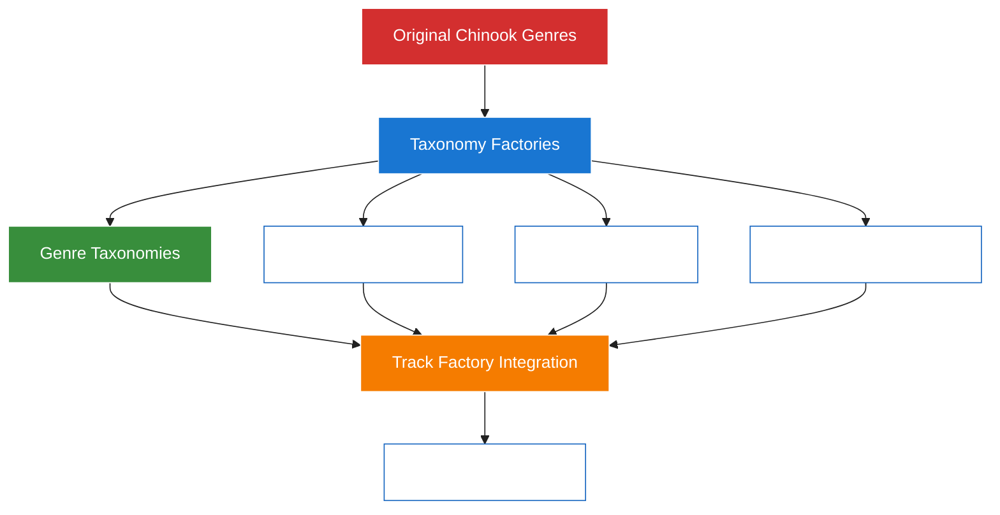

# 1. Chinook Database Factories Guide

> **Refactored from:** `.ai/guides/chinook/030-chinook-factories-guide.md` on 2025-07-11  
> **Focus:** Single taxonomy system using aliziodev/laravel-taxonomy package exclusively

## 1.1. Table of Contents

- [1.2. Overview](#12-overview)
    - [1.2.1. Modern Laravel 12 Features](#121-modern-laravel-12-features)
    - [1.2.2. Single Taxonomy System Strategy](#122-single-taxonomy-system-strategy)
- [2. Factory Architecture](#2-factory-architecture)
    - [2.1. Base Factory Patterns](#21-base-factory-patterns)
    - [2.2. Taxonomy Integration](#22-taxonomy-integration)
- [3. Core Music Factories](#3-core-music-factories)
    - [3.1. Artist Factory](#31-artist-factory)
    - [3.2. Album Factory](#32-album-factory)
    - [3.3. Track Factory](#33-track-factory)
- [4. Taxonomy System Factories](#4-taxonomy-system-factories)
    - [4.1. Taxonomy Factory](#41-taxonomy-factory)
- [5. Advanced Factory Patterns](#5-advanced-factory-patterns)
    - [5.1. Relationship Factories](#51-relationship-factories)
- [6. Testing Integration](#6-testing-integration)
    - [6.1. Factory Testing](#61-factory-testing)
- [7. Best Practices](#7-best-practices)
    - [7.1. Factory Guidelines](#71-factory-guidelines)

## 1.2. Overview

This guide provides comprehensive instructions for creating modern Laravel 12 model factories for the Chinook database schema using a **single taxonomy system**. Factories generate realistic test data that respects database relationships and constraints, while supporting all modern Laravel 12 features including taxonomies, secondary unique keys, slugs, and user stamps.

### 1.2.1. Modern Laravel 12 Features

**Supported Features:**
- **Single Taxonomy System**: Unified categorization using aliziodev/laravel-taxonomy
- **Secondary Unique Keys**: Automatic generation of public_id values (ULID/UUID/Snowflake)
- **Slugs**: Automatic slug generation from public_id
- **User Stamps**: Proper user assignment for created_by/updated_by
- **Taxonomies**: Realistic taxonomy assignment for categorization
- **Enhanced Data**: Rich metadata and business-relevant test data

### 1.2.2. Single Taxonomy System Strategy

**🎯 IMPORTANT**: The Chinook implementation uses a **single taxonomy system** with direct mapping from original chinook.sql genre data using the `aliziodev/laravel-taxonomy` package.



**Key Principles:**

1. **Single Taxonomy System**: Use only `aliziodev/laravel-taxonomy` package for all categorization
2. **Direct Mapping**: Map original 25 genres directly to taxonomy records without enhancement
3. **Factory Integration**: Factories reference taxonomy records directly for genre relationships
4. **Clean Architecture**: No dual systems or migration complexity - greenfield implementation

## 2. Factory Architecture

### 2.1. Base Factory Patterns

**Generate Factory Commands:**

```bash
# Core music factories (Single taxonomy system - no Genre factories needed)
php artisan make:factory ArtistFactory --model=Artist
php artisan make:factory AlbumFactory --model=Album
php artisan make:factory TrackFactory --model=Track
php artisan make:factory MediaTypeFactory --model=MediaType

# Customer and employee factories
php artisan make:factory CustomerFactory --model=Customer
php artisan make:factory EmployeeFactory --model=Employee

# Sales system factories
php artisan make:factory InvoiceFactory --model=Invoice
php artisan make:factory InvoiceLineFactory --model=InvoiceLine

# Playlist factories
php artisan make:factory PlaylistFactory --model=Playlist

# Taxonomy system factories (for test data)
php artisan make:factory TaxonomyFactory --model=Taxonomy
php artisan make:factory TaxonomyTermFactory --model=TaxonomyTerm

# NOTE: No GenreFactory needed - use taxonomy system directly
```

### 2.2. Taxonomy Integration

**Base Factory with Taxonomy Support:**

```php
<?php

namespace Database\Factories;

use Illuminate\Database\Eloquent\Factories\Factory;
use Aliziodev\LaravelTaxonomy\Models\Taxonomy;
use Aliziodev\LaravelTaxonomy\Models\TaxonomyTerm;
use App\Models\User;

abstract class BaseChinookFactory extends Factory
{
    /**
     * Get random taxonomy terms by type
     */
    protected function getRandomTaxonomyTerms(string $type, int $count = 1): array
    {
        return TaxonomyTerm::whereHas('taxonomy', function ($q) use ($type) {
            $q->where('type', $type);
        })
        ->inRandomOrder()
        ->limit($count)
        ->pluck('id')
        ->toArray();
    }

    /**
     * Get specific taxonomy term by name and type
     */
    protected function getTaxonomyTerm(string $type, string $name): ?int
    {
        return TaxonomyTerm::whereHas('taxonomy', function ($q) use ($type) {
            $q->where('type', $type);
        })
        ->where('name', $name)
        ->first()?->id;
    }

    /**
     * Get random user for user stamps
     */
    protected function getRandomUser(): int
    {
        return User::inRandomOrder()->first()?->id ?? User::factory()->create()->id;
    }

    /**
     * Generate realistic public_id
     */
    protected function generatePublicId(): string
    {
        return \Illuminate\Support\Str::ulid();
    }
}
```

## 3. Core Music Factories

### 3.1. Artist Factory

```php
<?php

namespace Database\Factories;

use App\Models\Chinook\Artist;
use Illuminate\Support\Str;

class ArtistFactory extends BaseChinookFactory
{
    protected $model = Artist::class;

    public function definition(): array
    {
        $name = $this->faker->unique()->randomElement([
            'The Beatles', 'Led Zeppelin', 'Pink Floyd', 'Queen', 'The Rolling Stones',
            'AC/DC', 'Metallica', 'Nirvana', 'Radiohead', 'U2',
            'Miles Davis', 'John Coltrane', 'Duke Ellington', 'Ella Fitzgerald',
            'Mozart', 'Beethoven', 'Bach', 'Chopin', 'Vivaldi',
            'Daft Punk', 'Kraftwerk', 'Aphex Twin', 'Deadmau5',
        ]);

        $publicId = $this->generatePublicId();

        return [
            'name' => $name,
            'public_id' => $publicId,
            'slug' => Str::slug($publicId),
            'bio' => $this->faker->paragraph(3),
            'website' => $this->faker->optional(0.7)->url(),
            'social_links' => $this->faker->optional(0.8)->randomElement([
                [
                    'spotify' => 'https://open.spotify.com/artist/' . Str::random(22),
                    'youtube' => 'https://youtube.com/c/' . Str::slug($name),
                    'instagram' => 'https://instagram.com/' . Str::slug($name),
                ],
                [
                    'facebook' => 'https://facebook.com/' . Str::slug($name),
                    'twitter' => 'https://twitter.com/' . Str::slug($name),
                ],
            ]),
            'country' => $this->faker->countryCode(),
            'formed_year' => $this->faker->optional(0.9)->numberBetween(1950, 2023),
            'is_active' => $this->faker->boolean(85),
            'created_by' => $this->getRandomUser(),
            'updated_by' => $this->getRandomUser(),
        ];
    }

    /**
     * Configure factory to assign taxonomies after creation
     */
    public function configure(): static
    {
        return $this->afterCreating(function (Artist $artist) {
            // Assign 1-3 genre taxonomies
            $genreIds = $this->getRandomTaxonomyTerms('genre', $this->faker->numberBetween(1, 3));
            if (!empty($genreIds)) {
                $artist->taxonomies()->attach($genreIds);
            }

            // Optionally assign era taxonomy
            if ($this->faker->boolean(70)) {
                $eraId = $this->getRandomTaxonomyTerms('era', 1);
                if (!empty($eraId)) {
                    $artist->taxonomies()->attach($eraId);
                }
            }
        });
    }

    /**
     * Create an active artist
     */
    public function active(): static
    {
        return $this->state(fn (array $attributes) => [
            'is_active' => true,
        ]);
    }

    /**
     * Create an inactive artist
     */
    public function inactive(): static
    {
        return $this->state(fn (array $attributes) => [
            'is_active' => false,
        ]);
    }

    /**
     * Create an artist with specific genre
     */
    public function withGenre(string $genreName): static
    {
        return $this->afterCreating(function (Artist $artist) use ($genreName) {
            $genreId = $this->getTaxonomyTerm('genre', $genreName);
            if ($genreId) {
                $artist->taxonomies()->attach([$genreId]);
            }
        });
    }
}
```

### 3.2. Album Factory

```php
<?php

namespace Database\Factories;

use App\Models\Chinook\Album;
use App\Models\Chinook\Artist;
use Illuminate\Support\Str;

class AlbumFactory extends BaseChinookFactory
{
    protected $model = Album::class;

    public function definition(): array
    {
        $title = $this->faker->unique()->randomElement([
            'Abbey Road', 'Dark Side of the Moon', 'Led Zeppelin IV', 'Thriller',
            'Back in Black', 'The Wall', 'Rumours', 'Nevermind',
            'Kind of Blue', 'A Love Supreme', 'Bitches Brew', 'Giant Steps',
            'The Four Seasons', 'Symphony No. 9', 'Requiem', 'Brandenburg Concertos',
            'Random Access Memories', 'Discovery', 'Homework', 'Human After All',
        ]);

        $publicId = $this->generatePublicId();

        return [
            'title' => $title,
            'artist_id' => Artist::factory(),
            'public_id' => $publicId,
            'slug' => Str::slug($publicId),
            'release_date' => $this->faker->optional(0.9)->dateTimeBetween('-50 years', 'now'),
            'label' => $this->faker->optional(0.8)->randomElement([
                'Atlantic Records', 'Columbia Records', 'EMI', 'Warner Bros',
                'Universal Music', 'Sony Music', 'Capitol Records', 'RCA Records',
            ]),
            'catalog_number' => $this->faker->optional(0.7)->regexify('[A-Z]{2,3}-[0-9]{4,6}'),
            'total_tracks' => $this->faker->numberBetween(8, 20),
            'duration_seconds' => $this->faker->numberBetween(2400, 4800), // 40-80 minutes
            'description' => $this->faker->optional(0.6)->paragraph(2),
            'is_compilation' => $this->faker->boolean(15),
            'created_by' => $this->getRandomUser(),
            'updated_by' => $this->getRandomUser(),
        ];
    }

    /**
     * Configure factory to assign taxonomies after creation
     */
    public function configure(): static
    {
        return $this->afterCreating(function (Album $album) {
            // Inherit some taxonomies from artist
            $artistTaxonomies = $album->artist->taxonomies()->pluck('id')->toArray();
            if (!empty($artistTaxonomies)) {
                $inheritedTaxonomies = $this->faker->randomElements(
                    $artistTaxonomies,
                    $this->faker->numberBetween(1, min(2, count($artistTaxonomies)))
                );
                $album->taxonomies()->attach($inheritedTaxonomies);
            }

            // Add album-specific taxonomies
            if ($this->faker->boolean(60)) {
                $moodIds = $this->getRandomTaxonomyTerms('mood', $this->faker->numberBetween(1, 2));
                if (!empty($moodIds)) {
                    $album->taxonomies()->attach($moodIds);
                }
            }
        });
    }

    /**
     * Create a compilation album
     */
    public function compilation(): static
    {
        return $this->state(fn (array $attributes) => [
            'is_compilation' => true,
            'title' => $this->faker->randomElement([
                'Greatest Hits', 'The Best Of', 'Collection', 'Anthology',
                'Essential Collection', 'Ultimate Hits', 'Platinum Collection',
            ]),
        ]);
    }

    /**
     * Create album for specific artist
     */
    public function forArtist(Artist $artist): static
    {
        return $this->state(fn (array $attributes) => [
            'artist_id' => $artist->id,
        ]);
    }
}
```

### 3.3. Track Factory

```php
<?php

namespace Database\Factories;

use App\Models\Chinook\Track;
use App\Models\Chinook\Album;
use App\Models\Chinook\MediaType;
use Illuminate\Support\Str;

class TrackFactory extends BaseChinookFactory
{
    protected $model = Track::class;

    public function definition(): array
    {
        $name = $this->faker->unique()->randomElement([
            'Bohemian Rhapsody', 'Stairway to Heaven', 'Hotel California', 'Imagine',
            'Like a Rolling Stone', 'Satisfaction', 'Hey Jude', 'Billie Jean',
            'Smells Like Teen Spirit', 'What\'s Going On', 'Respect', 'Good Vibrations',
            'Take Five', 'So What', 'Blue in Green', 'All Blues',
            'Eine kleine Nachtmusik', 'Moonlight Sonata', 'Für Elise', 'Canon in D',
            'One More Time', 'Around the World', 'Get Lucky', 'Harder Better Faster Stronger',
        ]);

        $publicId = $this->generatePublicId();
        $milliseconds = $this->faker->numberBetween(120000, 480000); // 2-8 minutes

        return [
            'name' => $name,
            'album_id' => Album::factory(),
            'media_type_id' => MediaType::factory(),
            'public_id' => $publicId,
            'slug' => Str::slug($publicId),
            'composer' => $this->faker->optional(0.7)->name(),
            'milliseconds' => $milliseconds,
            'bytes' => $this->faker->numberBetween(3000000, 12000000), // 3-12 MB
            'unit_price' => $this->faker->randomElement([0.99, 1.29, 1.49, 1.99]),
            'track_number' => $this->faker->numberBetween(1, 20),
            'disc_number' => $this->faker->numberBetween(1, 2),
            'lyrics' => $this->faker->optional(0.4)->paragraphs(3, true),
            'isrc' => $this->faker->optional(0.8)->regexify('[A-Z]{2}[A-Z0-9]{3}[0-9]{7}'),
            'explicit_content' => $this->faker->boolean(10),
            'created_by' => $this->getRandomUser(),
            'updated_by' => $this->getRandomUser(),
        ];
    }

    /**
     * Configure factory to assign taxonomies after creation
     */
    public function configure(): static
    {
        return $this->afterCreating(function (Track $track) {
            // Inherit taxonomies from album and artist
            $albumTaxonomies = $track->album->taxonomies()->pluck('id')->toArray();
            $artistTaxonomies = $track->album->artist->taxonomies()->pluck('id')->toArray();

            $inheritedTaxonomies = array_unique(array_merge($albumTaxonomies, $artistTaxonomies));
            if (!empty($inheritedTaxonomies)) {
                $selectedTaxonomies = $this->faker->randomElements(
                    $inheritedTaxonomies,
                    $this->faker->numberBetween(1, min(3, count($inheritedTaxonomies)))
                );
                $track->taxonomies()->attach($selectedTaxonomies);
            }

            // Add track-specific taxonomies
            if ($this->faker->boolean(50)) {
                $moodIds = $this->getRandomTaxonomyTerms('mood', 1);
                if (!empty($moodIds)) {
                    $track->taxonomies()->attach($moodIds);
                }
            }

            if ($this->faker->boolean(40)) {
                $instrumentIds = $this->getRandomTaxonomyTerms('instrument', 1);
                if (!empty($instrumentIds)) {
                    $track->taxonomies()->attach($instrumentIds);
                }
            }
        });
    }

    /**
     * Create explicit content track
     */
    public function explicit(): static
    {
        return $this->state(fn (array $attributes) => [
            'explicit_content' => true,
        ]);
    }

    /**
     * Create track for specific album
     */
    public function forAlbum(Album $album): static
    {
        return $this->state(fn (array $attributes) => [
            'album_id' => $album->id,
        ]);
    }

    /**
     * Create track with specific genre
     */
    public function withGenre(string $genreName): static
    {
        return $this->afterCreating(function (Track $track) use ($genreName) {
            $genreId = $this->getTaxonomyTerm('genre', $genreName);
            if ($genreId) {
                $track->taxonomies()->attach([$genreId]);
            }
        });
    }
}
```

## 4. Taxonomy System Factories

### 4.1. Taxonomy Factory

```php
<?php

namespace Database\Factories;

use Aliziodev\LaravelTaxonomy\Models\Taxonomy;

class TaxonomyFactory extends BaseChinookFactory
{
    protected $model = Taxonomy::class;

    public function definition(): array
    {
        $types = ['genre', 'mood', 'era', 'instrument', 'language', 'occasion'];
        $type = $this->faker->randomElement($types);

        $names = [
            'genre' => 'Music Genres',
            'mood' => 'Musical Moods',
            'era' => 'Musical Eras',
            'instrument' => 'Primary Instruments',
            'language' => 'Languages',
            'occasion' => 'Occasions',
        ];

        return [
            'name' => $names[$type],
            'slug' => Str::slug($names[$type]),
            'type' => $type,
            'description' => "Taxonomy for {$names[$type]} categorization",
            'created_by' => $this->getRandomUser(),
            'updated_by' => $this->getRandomUser(),
        ];
    }

    /**
     * Create genre taxonomy
     */
    public function genre(): static
    {
        return $this->state(fn (array $attributes) => [
            'name' => 'Music Genres',
            'slug' => 'music-genres',
            'type' => 'genre',
            'description' => 'Musical genre classifications',
        ]);
    }

    /**
     * Create mood taxonomy
     */
    public function mood(): static
    {
        return $this->state(fn (array $attributes) => [
            'name' => 'Musical Moods',
            'slug' => 'musical-moods',
            'type' => 'mood',
            'description' => 'Emotional categorization of music',
        ]);
    }
}
```

### 4.2. Taxonomy Term Factory

```php
<?php

namespace Database\Factories;

use Aliziodev\LaravelTaxonomy\Models\TaxonomyTerm;
use Aliziodev\LaravelTaxonomy\Models\Taxonomy;
use Illuminate\Support\Str;

class TaxonomyTermFactory extends BaseChinookFactory
{
    protected $model = TaxonomyTerm::class;

    public function definition(): array
    {
        $name = $this->faker->unique()->randomElement([
            'Rock', 'Jazz', 'Classical', 'Electronic', 'Pop', 'Hip Hop',
            'Country', 'Blues', 'Reggae', 'Folk', 'Metal', 'Punk',
            'Energetic', 'Relaxing', 'Melancholic', 'Upbeat', 'Romantic',
            '1960s', '1970s', '1980s', '1990s', '2000s', '2010s', '2020s',
            'Piano', 'Guitar', 'Drums', 'Violin', 'Saxophone', 'Trumpet',
            'English', 'Spanish', 'French', 'Instrumental',
            'Wedding', 'Party', 'Workout', 'Study', 'Sleep',
        ]);

        return [
            'taxonomy_id' => Taxonomy::factory(),
            'name' => $name,
            'slug' => Str::slug($name),
            'description' => "Description for {$name}",
            'created_by' => $this->getRandomUser(),
            'updated_by' => $this->getRandomUser(),
        ];
    }

    /**
     * Create term for specific taxonomy
     */
    public function forTaxonomy(Taxonomy $taxonomy): static
    {
        return $this->state(fn (array $attributes) => [
            'taxonomy_id' => $taxonomy->id,
        ]);
    }

    /**
     * Create genre term
     */
    public function genre(string $name = null): static
    {
        $genreName = $name ?? $this->faker->randomElement([
            'Rock', 'Jazz', 'Classical', 'Electronic', 'Pop', 'Hip Hop'
        ]);

        return $this->state(fn (array $attributes) => [
            'name' => $genreName,
            'slug' => Str::slug($genreName),
            'description' => "{$genreName} music genre",
        ]);
    }
}
```

## 5. Advanced Factory Patterns

### 5.1. Relationship Factories

**Complete Album with Tracks:**

```php
<?php
// Create album with tracks and proper taxonomy inheritance
$album = Album::factory()
    ->forArtist(Artist::factory()->withGenre('Rock')->create())
    ->has(
        Track::factory()
            ->count(12)
            ->sequence(fn ($sequence) => ['track_number' => $sequence->index + 1])
    )
    ->create();

// Tracks will automatically inherit taxonomies from album and artist
```

**Playlist with Mixed Tracks:**

```php
<?php
// Create playlist with tracks from different genres
$playlist = Playlist::factory()->create();

$rockTracks = Track::factory()
    ->withGenre('Rock')
    ->count(5)
    ->create();

$jazzTracks = Track::factory()
    ->withGenre('Jazz')
    ->count(3)
    ->create();

$playlist->tracks()->attach(
    $rockTracks->merge($jazzTracks)->pluck('id')->toArray()
);
```

### 5.2. Bulk Data Generation

**Seeder Integration:**

```php
<?php
// database/seeders/ChinookFactorySeeder.php

use Illuminate\Database\Seeder;
use App\Models\Chinook\Artist;
use Aliziodev\LaravelTaxonomy\Models\Taxonomy;

class ChinookFactorySeeder extends Seeder
{
    public function run(): void
    {
        // Create taxonomies first
        $genreTaxonomy = Taxonomy::factory()->genre()->create();
        $moodTaxonomy = Taxonomy::factory()->mood()->create();

        // Create genre terms
        $genres = ['Rock', 'Jazz', 'Classical', 'Electronic', 'Pop'];
        foreach ($genres as $genre) {
            TaxonomyTerm::factory()
                ->forTaxonomy($genreTaxonomy)
                ->genre($genre)
                ->create();
        }

        // Create artists with albums and tracks
        Artist::factory()
            ->count(50)
            ->has(
                Album::factory()
                    ->count(3)
                    ->has(
                        Track::factory()->count(10)
                    )
            )
            ->create();
    }
}
```

## 6. Testing Integration

### 6.1. Factory Testing

```php
<?php
// tests/Feature/FactoryTest.php

use App\Models\Chinook\Track;
use Aliziodev\LaravelTaxonomy\Models\Taxonomy;
use Aliziodev\LaravelTaxonomy\Models\TaxonomyTerm;

describe('Chinook Factories', function () {
    beforeEach(function () {
        $this->genreTaxonomy = Taxonomy::factory()->genre()->create();
        $this->rockGenre = TaxonomyTerm::factory()
            ->forTaxonomy($this->genreTaxonomy)
            ->genre('Rock')
            ->create();
    });

    it('creates tracks with taxonomy relationships', function () {
        $track = Track::factory()
            ->withGenre('Rock')
            ->create();

        expect($track->taxonomies)->toHaveCount(1);
        expect($track->taxonomies->first()->name)->toBe('Rock');
    });

    it('inherits taxonomies from album and artist', function () {
        $artist = Artist::factory()
            ->withGenre('Rock')
            ->create();

        $album = Album::factory()
            ->forArtist($artist)
            ->create();

        $track = Track::factory()
            ->forAlbum($album)
            ->create();

        expect($track->taxonomies->pluck('name'))->toContain('Rock');
    });
});
```

### 6.2. Performance Testing

```php
<?php
// Generate large datasets for performance testing
$startTime = microtime(true);

// Create 1000 tracks with taxonomy relationships
Track::factory()
    ->count(1000)
    ->create();

$endTime = microtime(true);
$executionTime = $endTime - $startTime;

echo "Created 1000 tracks in {$executionTime} seconds\n";
```

## 7. Best Practices

### 7.1. Factory Guidelines

1. **Taxonomy Integration**: Always assign realistic taxonomies in factory callbacks
2. **Relationship Consistency**: Ensure child models inherit appropriate taxonomies
3. **Performance**: Use bulk operations for large datasets
4. **Realistic Data**: Use industry-appropriate names and values
5. **Testing**: Validate taxonomy relationships in factory tests

### 7.2. Common Patterns

```php
<?php
// Pattern 1: Create model with specific taxonomy
$track = Track::factory()->withGenre('Jazz')->create();

// Pattern 2: Create related models with taxonomy inheritance
$artist = Artist::factory()->withGenre('Rock')->create();
$album = Album::factory()->forArtist($artist)->create();
$tracks = Track::factory()->forAlbum($album)->count(10)->create();

// Pattern 3: Bulk creation with taxonomy distribution
foreach (['Rock', 'Jazz', 'Classical'] as $genre) {
    Artist::factory()
        ->withGenre($genre)
        ->count(10)
        ->create();
}
```

---

## Navigation

**Previous:** [5.2. Bulk Data Generation](#52-bulk-data-generation) | **Index:** [Table of Contents](#11-table-of-contents)

---

**Documentation Standards**: This document follows WCAG 2.1 AA accessibility guidelines and uses Laravel 12 modern syntax patterns.

[⬆️ Back to Top](#1-chinook-database-factories-guide)
