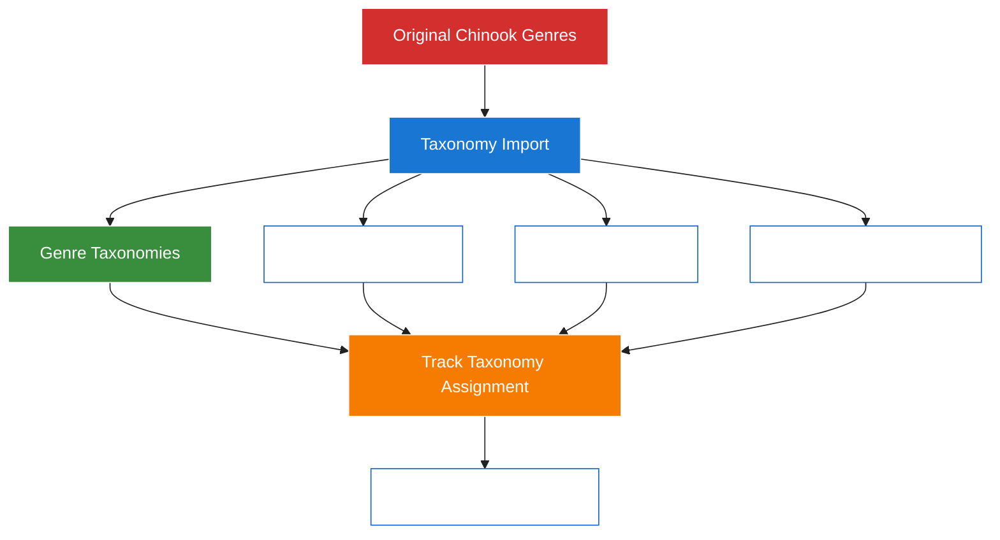

# 1. Chinook Database Seeders Guide

> **Refactored from:** `.ai/guides/chinook/040-chinook-seeders-guide.md` on 2025-07-11  
> **Focus:** Single taxonomy system using aliziodev/laravel-taxonomy package exclusively

## 1.1. Table of Contents

- [1.2. Overview](#12-overview)
    - [1.2.1. Modern Laravel 12 Features](#121-modern-laravel-12-features)
    - [1.2.2. Single Taxonomy System Strategy](#122-single-taxonomy-system-strategy)
- [2. Prerequisites](#2-prerequisites)
    - [2.1. Required Packages](#21-required-packages)
    - [2.2. Genre Preservation Strategy](#22-genre-preservation-strategy)
- [3. Seeder Architecture](#3-seeder-architecture)
    - [3.1. Seeding Order](#31-seeding-order)
    - [3.2. Generate Seeder Commands](#32-generate-seeder-commands)
- [4. Core Seeders](#4-core-seeders)
    - [4.1. User Seeder](#41-user-seeder)
    - [4.2. Permission Seeder](#42-permission-seeder)
    - [4.3. Role Seeder](#43-role-seeder)
    - [4.4. Taxonomy Seeder](#44-taxonomy-seeder)
    - [4.5. Artist Seeder](#45-artist-seeder)
- [5. Main Database Seeder](#5-main-database-seeder)
- [6. Performance Optimization](#6-performance-optimization)
- [7. Testing Integration](#7-testing-integration)
- [8. Best Practices](#8-best-practices)
    - [8.1. Seeder Guidelines](#81-seeder-guidelines)

## 1.2. Overview

This guide provides comprehensive instructions for creating modern Laravel 12 database seeders for the Chinook database schema using a **single taxonomy system**. Seeders populate the database with sample data in the correct order to maintain referential integrity, using both the original Chinook data and factory-generated test data.

### 1.2.1. Modern Laravel 12 Features

**Supported Features:**
- **Single Taxonomy System**: Unified categorization using aliziodev/laravel-taxonomy
- **Secondary Unique Keys**: Proper public_id generation and management
- **Slugs**: Automatic slug generation from public_id
- **User Stamps**: Realistic user assignment for audit trails
- **Taxonomies**: Comprehensive taxonomy assignment for categorization
- **Soft Deletes**: Proper handling of soft delete states
- **Enhanced Data**: Rich metadata and business-relevant seed data

### 1.2.2. Single Taxonomy System Strategy

**🎯 CRITICAL**: The Chinook implementation uses a **Genre Preservation Strategy** that maintains the original 25 genres from chinook.sql while implementing a unified taxonomy system using the `aliziodev/laravel-taxonomy` package.



**Key Principles:**

1. **Import Original Data**: Use chinook.sql to populate the 25 original genres as Genre records
2. **Create Taxonomy System**: Map genres to taxonomy terms for unified categorization
3. **Single System**: Use only aliziodev/laravel-taxonomy for all new categorization
4. **Reference Existing**: All seeder code must reference existing genres via lookups
5. **Compatibility Layer**: Maintain Genre model for data export/import compatibility

## 2. Prerequisites

### 2.1. Required Packages

Before running seeders, ensure you have:

```bash
# Required users for user stamps
php artisan make:seeder UserSeeder

# Published taxonomy migrations
php artisan vendor:publish --provider="Aliziodev\LaravelTaxonomy\TaxonomyServiceProvider"
php artisan migrate

# Required packages installed
composer require aliziodev/laravel-taxonomy
composer require spatie/laravel-permission
composer require wildside/userstamps
```

### 2.2. Genre Preservation Strategy

**Implementation Pattern:**

```php
<?php
// ✅ CORRECT: Reference existing genres from chinook.sql import
$genres = Genre::all();
$randomGenre = $genres->random();

// ✅ CORRECT: Enhanced categorization via Taxonomy system
$rockTaxonomy = TaxonomyTerm::whereHas('taxonomy', function ($q) {
    $q->where('type', 'genre');
})->where('name', 'Rock')->first();

// ✅ CORRECT: Assign taxonomy to track
$track->taxonomies()->attach($rockTaxonomy->id);

// ❌ INCORRECT: Never create new Genre records in seeders
// Genre::create(['name' => 'New Genre']); // DON'T DO THIS
```

## 3. Seeder Architecture

### 3.1. Seeding Order

**Dependency-Based Execution Order:**

1. **Foundation Data**: Users (for user stamps)
2. **Independent Data**: Artists, Taxonomies, MediaTypes, Employees
3. **Hierarchical Data**: Taxonomy term relationships
4. **Dependent Data**: Albums, Customers, Playlists
5. **Relationship Data**: Tracks, Invoices
6. **Junction Data**: InvoiceLines, PlaylistTrack, Taxonomy assignments

### 3.2. Generate Seeder Commands

```bash
# Foundation seeders
php artisan make:seeder UserSeeder
php artisan make:seeder PermissionSeeder
php artisan make:seeder RoleSeeder

# Create individual seeders (Single taxonomy system)
php artisan make:seeder ArtistSeeder
php artisan make:seeder TaxonomySeeder  # NEW: Single taxonomy system
php artisan make:seeder MediaTypeSeeder
php artisan make:seeder EmployeeSeeder
php artisan make:seeder AlbumSeeder
php artisan make:seeder CustomerSeeder
php artisan make:seeder PlaylistSeeder
php artisan make:seeder TrackSeeder
php artisan make:seeder InvoiceSeeder
php artisan make:seeder InvoiceLineSeeder
php artisan make:seeder PlaylistTrackSeeder
php artisan make:seeder TaxonomyAssignmentSeeder  # NEW: For taxonomy relationships

# Create main database seeder
php artisan make:seeder DatabaseSeeder
```

## 4. Core Seeders

### 4.1. User Seeder

```php
<?php

namespace Database\Seeders;

use App\Models\User;
use Illuminate\Database\Seeder;
use Illuminate\Support\Facades\Hash;

class UserSeeder extends Seeder
{
    public function run(): void
    {
        // System user for user stamps
        User::create([
            'name' => 'System User',
            'email' => 'system@chinook.com',
            'password' => Hash::make('system-password'),
            'email_verified_at' => now(),
        ]);

        // Admin user
        User::create([
            'name' => 'Admin User',
            'email' => 'admin@chinook.com',
            'password' => Hash::make('admin-password'),
            'email_verified_at' => now(),
        ]);

        // Test users
        User::factory()->count(10)->create();

        $this->command->info('Created system and test users');
    }
}
```

### 4.2. Permission Seeder

```php
<?php

namespace Database\Seeders;

use Spatie\Permission\Models\Permission;
use Illuminate\Database\Seeder;

class PermissionSeeder extends Seeder
{
    public function run(): void
    {
        $permissions = [
            // Artist permissions
            'artists.view', 'artists.create', 'artists.update', 'artists.delete',
            // Album permissions
            'albums.view', 'albums.create', 'albums.update', 'albums.delete',
            // Track permissions
            'tracks.view', 'tracks.create', 'tracks.update', 'tracks.delete',
            // Taxonomy permissions
            'taxonomies.view', 'taxonomies.create', 'taxonomies.update', 'taxonomies.delete',
            // Customer permissions
            'customers.view', 'customers.create', 'customers.update', 'customers.delete',
            // Invoice permissions
            'invoices.view', 'invoices.create', 'invoices.update', 'invoices.delete',
            // Playlist permissions
            'playlists.view', 'playlists.create', 'playlists.update', 'playlists.delete',
            // Employee permissions
            'employees.view', 'employees.create', 'employees.update', 'employees.delete',
            // Media type permissions
            'media-types.view', 'media-types.create', 'media-types.update', 'media-types.delete',
        ];

        foreach ($permissions as $permission) {
            Permission::create(['name' => $permission]);
        }

        $this->command->info('Created ' . count($permissions) . ' permissions');
    }
}
```

### 4.3. Role Seeder

```php
<?php

namespace Database\Seeders;

use Spatie\Permission\Models\Role;
use Spatie\Permission\Models\Permission;
use Illuminate\Database\Seeder;

class RoleSeeder extends Seeder
{
    public function run(): void
    {
        // Create hierarchical roles
        $superAdmin = Role::create(['name' => 'Super Admin']);
        $admin = Role::create(['name' => 'Admin']);
        $manager = Role::create(['name' => 'Manager']);
        $editor = Role::create(['name' => 'Editor']);
        $customerService = Role::create(['name' => 'Customer Service']);
        $user = Role::create(['name' => 'User']);
        $guest = Role::create(['name' => 'Guest']);

        // Assign permissions to roles
        $superAdmin->givePermissionTo(Permission::all());

        $admin->givePermissionTo([
            'artists.view', 'artists.create', 'artists.update', 'artists.delete',
            'albums.view', 'albums.create', 'albums.update', 'albums.delete',
            'tracks.view', 'tracks.create', 'tracks.update', 'tracks.delete',
            'taxonomies.view', 'taxonomies.create', 'taxonomies.update', 'taxonomies.delete',
            'customers.view', 'customers.create', 'customers.update',
            'invoices.view', 'invoices.create', 'invoices.update',
        ]);

        $manager->givePermissionTo([
            'artists.view', 'albums.view', 'tracks.view',
            'taxonomies.view', 'taxonomies.create', 'taxonomies.update',
            'customers.view', 'customers.update',
            'invoices.view', 'invoices.create',
        ]);

        $editor->givePermissionTo([
            'artists.view', 'artists.update',
            'albums.view', 'albums.update',
            'tracks.view', 'tracks.update',
            'taxonomies.view',
        ]);

        $customerService->givePermissionTo([
            'customers.view', 'customers.update',
            'invoices.view', 'invoices.create',
        ]);

        $user->givePermissionTo([
            'artists.view', 'albums.view', 'tracks.view',
            'playlists.view', 'playlists.create', 'playlists.update',
        ]);

        $guest->givePermissionTo([
            'artists.view', 'albums.view', 'tracks.view',
        ]);

        $this->command->info('Created hierarchical roles with permissions');
    }
}
```

### 4.4. Taxonomy Seeder

```php
<?php

namespace Database\Seeders;

use Aliziodev\LaravelTaxonomy\Models\Taxonomy;
use Aliziodev\LaravelTaxonomy\Models\TaxonomyTerm;
use App\Models\User;
use Illuminate\Database\Seeder;
use Illuminate\Support\Str;

class TaxonomySeeder extends Seeder
{
    public function run(): void
    {
        $systemUser = User::where('email', 'system@chinook.com')->first();

        // Create taxonomy hierarchies using single taxonomy system
        $this->createGenreTaxonomies($systemUser);
        $this->createMoodTaxonomies($systemUser);
        $this->createEraTaxonomies($systemUser);
        $this->createInstrumentTaxonomies($systemUser);
        $this->createLanguageTaxonomies($systemUser);
        $this->createOccasionTaxonomies($systemUser);

        $this->command->info('Created hierarchical taxonomies with single taxonomy system');
    }

    /**
     * Create genre taxonomies mapped from original Chinook genres
     */
    private function createGenreTaxonomies(?User $systemUser): void
    {
        $genreTaxonomy = Taxonomy::create([
            'name' => 'Music Genres',
            'slug' => 'music-genres',
            'type' => 'genre',
            'description' => 'Musical genre classifications from Chinook database',
            'created_by' => $systemUser?->id,
            'updated_by' => $systemUser?->id,
        ]);

        $genreData = [
            'Rock' => ['Alternative & Punk', 'Blues', 'Heavy Metal', 'Classic Rock'],
            'Jazz' => ['Smooth Jazz', 'Fusion', 'Bebop', 'Big Band'],
            'Classical' => ['Baroque', 'Romantic', 'Contemporary', 'Opera'],
            'Electronic' => ['Ambient', 'Techno', 'House', 'Drum & Bass'],
            'World' => ['Celtic', 'Latin', 'African', 'Asian'],
            'Pop' => ['Dance Pop', 'Indie Pop', 'Synthpop'],
            'Country' => ['Bluegrass', 'Folk', 'Americana'],
        ];

        foreach ($genreData as $parentGenre => $subGenres) {
            $parent = TaxonomyTerm::create([
                'taxonomy_id' => $genreTaxonomy->id,
                'name' => $parentGenre,
                'slug' => Str::slug($parentGenre),
                'description' => "Main {$parentGenre} genre category",
                'created_by' => $systemUser?->id,
                'updated_by' => $systemUser?->id,
            ]);

            foreach ($subGenres as $subGenre) {
                TaxonomyTerm::create([
                    'taxonomy_id' => $genreTaxonomy->id,
                    'parent_id' => $parent->id,
                    'name' => $subGenre,
                    'slug' => Str::slug($subGenre),
                    'description' => "{$subGenre} sub-genre of {$parentGenre}",
                    'created_by' => $systemUser?->id,
                    'updated_by' => $systemUser?->id,
                ]);
            }
        }
    }

    /**
     * Create mood taxonomies
     */
    private function createMoodTaxonomies(?User $systemUser): void
    {
        $moodTaxonomy = Taxonomy::create([
            'name' => 'Musical Moods',
            'slug' => 'musical-moods',
            'type' => 'mood',
            'description' => 'Emotional categorization of music',
            'created_by' => $systemUser?->id,
            'updated_by' => $systemUser?->id,
        ]);

        $moods = [
            'Energetic', 'Relaxing', 'Melancholic', 'Upbeat', 'Romantic',
            'Aggressive', 'Peaceful', 'Nostalgic', 'Mysterious', 'Joyful'
        ];

        foreach ($moods as $mood) {
            TaxonomyTerm::create([
                'taxonomy_id' => $moodTaxonomy->id,
                'name' => $mood,
                'slug' => Str::slug($mood),
                'description' => "{$mood} musical mood",
                'created_by' => $systemUser?->id,
                'updated_by' => $systemUser?->id,
            ]);
        }
    }

    /**
     * Create era taxonomies
     */
    private function createEraTaxonomies(?User $systemUser): void
    {
        $eraTaxonomy = Taxonomy::create([
            'name' => 'Musical Eras',
            'slug' => 'musical-eras',
            'type' => 'era',
            'description' => 'Historical period classification',
            'created_by' => $systemUser?->id,
            'updated_by' => $systemUser?->id,
        ]);

        $eras = ['1960s', '1970s', '1980s', '1990s', '2000s', '2010s', '2020s'];

        foreach ($eras as $era) {
            TaxonomyTerm::create([
                'taxonomy_id' => $eraTaxonomy->id,
                'name' => $era,
                'slug' => Str::slug($era),
                'description' => "Music from the {$era}",
                'created_by' => $systemUser?->id,
                'updated_by' => $systemUser?->id,
            ]);
        }
    }

    /**
     * Create instrument taxonomies
     */
    private function createInstrumentTaxonomies(?User $systemUser): void
    {
        $instrumentTaxonomy = Taxonomy::create([
            'name' => 'Primary Instruments',
            'slug' => 'primary-instruments',
            'type' => 'instrument',
            'description' => 'Featured instrument categorization',
            'created_by' => $systemUser?->id,
            'updated_by' => $systemUser?->id,
        ]);

        $instruments = [
            'Piano', 'Guitar', 'Drums', 'Violin', 'Saxophone', 'Trumpet',
            'Bass', 'Vocals', 'Synthesizer', 'Orchestra'
        ];

        foreach ($instruments as $instrument) {
            TaxonomyTerm::create([
                'taxonomy_id' => $instrumentTaxonomy->id,
                'name' => $instrument,
                'slug' => Str::slug($instrument),
                'description' => "Music featuring {$instrument}",
                'created_by' => $systemUser?->id,
                'updated_by' => $systemUser?->id,
            ]);
        }
    }

    /**
     * Create language taxonomies
     */
    private function createLanguageTaxonomies(?User $systemUser): void
    {
        $languageTaxonomy = Taxonomy::create([
            'name' => 'Languages',
            'slug' => 'languages',
            'type' => 'language',
            'description' => 'Vocal language categorization',
            'created_by' => $systemUser?->id,
            'updated_by' => $systemUser?->id,
        ]);

        $languages = [
            'English', 'Spanish', 'French', 'German', 'Italian',
            'Japanese', 'Portuguese', 'Instrumental'
        ];

        foreach ($languages as $language) {
            TaxonomyTerm::create([
                'taxonomy_id' => $languageTaxonomy->id,
                'name' => $language,
                'slug' => Str::slug($language),
                'description' => "Music in {$language}",
                'created_by' => $systemUser?->id,
                'updated_by' => $systemUser?->id,
            ]);
        }
    }

    /**
     * Create occasion taxonomies
     */
    private function createOccasionTaxonomies(?User $systemUser): void
    {
        $occasionTaxonomy = Taxonomy::create([
            'name' => 'Occasions',
            'slug' => 'occasions',
            'type' => 'occasion',
            'description' => 'Event-based music categorization',
            'created_by' => $systemUser?->id,
            'updated_by' => $systemUser?->id,
        ]);

        $occasions = [
            'Wedding', 'Party', 'Workout', 'Study', 'Sleep',
            'Driving', 'Cooking', 'Meditation', 'Gaming'
        ];

        foreach ($occasions as $occasion) {
            TaxonomyTerm::create([
                'taxonomy_id' => $occasionTaxonomy->id,
                'name' => $occasion,
                'slug' => Str::slug($occasion),
                'description' => "Music for {$occasion}",
                'created_by' => $systemUser?->id,
                'updated_by' => $systemUser?->id,
            ]);
        }
    }
}
```

### 4.5. Artist Seeder

```php
<?php

namespace Database\Seeders;

use App\Models\Chinook\Artist;
use Aliziodev\LaravelTaxonomy\Models\TaxonomyTerm;
use App\Models\User;
use Illuminate\Database\Seeder;

class ArtistSeeder extends Seeder
{
    public function run(): void
    {
        $systemUser = User::where('email', 'system@chinook.com')->first();

        // Create artists with taxonomy assignments
        $artists = [
            ['name' => 'The Beatles', 'genres' => ['Rock', 'Pop']],
            ['name' => 'Miles Davis', 'genres' => ['Jazz']],
            ['name' => 'Mozart', 'genres' => ['Classical']],
            ['name' => 'Daft Punk', 'genres' => ['Electronic']],
            ['name' => 'Bob Marley', 'genres' => ['World']],
        ];

        foreach ($artists as $artistData) {
            $artist = Artist::factory()->create([
                'name' => $artistData['name'],
                'created_by' => $systemUser?->id,
                'updated_by' => $systemUser?->id,
            ]);

            // Assign taxonomies
            foreach ($artistData['genres'] as $genreName) {
                $genreTerm = TaxonomyTerm::whereHas('taxonomy', function ($q) {
                    $q->where('type', 'genre');
                })->where('name', $genreName)->first();

                if ($genreTerm) {
                    $artist->taxonomies()->attach($genreTerm->id);
                }
            }
        }

        // Create additional random artists
        Artist::factory()
            ->count(45)
            ->create([
                'created_by' => $systemUser?->id,
                'updated_by' => $systemUser?->id,
            ]);

        $this->command->info('Created 50 artists with taxonomy assignments');
    }
}
```

## 5. Main Database Seeder

```php
<?php

namespace Database\Seeders;

use Database\Seeders\Chinook\AlbumSeeder;use Database\Seeders\Chinook\ArtistSeeder;use Database\Seeders\Chinook\CustomerSeeder;use Database\Seeders\Chinook\EmployeeSeeder;use Database\Seeders\Chinook\InvoiceLineSeeder;use Database\Seeders\Chinook\InvoiceSeeder;use Database\Seeders\Chinook\MediaTypeSeeder;use Database\Seeders\Chinook\PlaylistSeeder;use Database\Seeders\Chinook\TrackSeeder;use Illuminate\Database\Seeder;

class DatabaseSeeder extends Seeder
{
    public function run(): void
    {
        $this->call([
            // Step 1: Foundation data
            UserSeeder::class,
            PermissionSeeder::class,
            RoleSeeder::class,

            // Step 2: Independent tables
            TaxonomySeeder::class,  // NEW: Single taxonomy system
            MediaTypeSeeder::class,
            EmployeeSeeder::class,
            ArtistSeeder::class,

            // Step 3: Dependent tables
            AlbumSeeder::class,
            CustomerSeeder::class,
            PlaylistSeeder::class,

            // Step 4: Relationship tables
            TrackSeeder::class,
            InvoiceSeeder::class,

            // Step 5: Junction tables
            InvoiceLineSeeder::class,
            PlaylistTrackSeeder::class,
            TaxonomyAssignmentSeeder::class,  // NEW: For taxonomy relationships
        ]);

        $this->command->info('Chinook database seeding completed with single taxonomy system');
    }
}
```

## 6. Performance Optimization

### 6.1. Bulk Operations

```php
<?php
// Efficient bulk taxonomy assignment
class TaxonomyAssignmentSeeder extends Seeder
{
    public function run(): void
    {
        $tracks = Track::all();
        $genreTerms = TaxonomyTerm::whereHas('taxonomy', function ($q) {
            $q->where('type', 'genre');
        })->get();

        $assignments = [];
        $now = now();

        foreach ($tracks as $track) {
            // Assign 1-3 random genre taxonomies
            $selectedTerms = $genreTerms->random(rand(1, 3));

            foreach ($selectedTerms as $term) {
                $assignments[] = [
                    'taxonomy_term_id' => $term->id,
                    'taxable_type' => Track::class,
                    'taxable_id' => $track->id,
                    'created_at' => $now,
                    'updated_at' => $now,
                ];
            }
        }

        // Bulk insert for performance
        DB::table('taxables')->insert($assignments);

        $this->command->info('Bulk assigned taxonomies to tracks');
    }
}
```

### 6.2. Memory Management

```php
<?php
// Process large datasets in chunks
Track::chunk(100, function ($tracks) {
    foreach ($tracks as $track) {
        // Process track taxonomy assignments
        $this->assignRandomTaxonomies($track);
    }
});
```

## 7. Testing Integration

### 7.1. Seeder Testing

```php
<?php
// tests/Feature/SeederTest.php

use Aliziodev\LaravelTaxonomy\Models\Taxonomy;
use Aliziodev\LaravelTaxonomy\Models\TaxonomyTerm;

describe('Taxonomy Seeder', function () {
    it('creates all required taxonomies', function () {
        $this->artisan('db:seed', ['--class' => 'TaxonomySeeder']);

        expect(Taxonomy::count())->toBeGreaterThan(0);
        expect(TaxonomyTerm::count())->toBeGreaterThan(0);

        // Verify specific taxonomies exist
        expect(Taxonomy::where('type', 'genre')->exists())->toBeTrue();
        expect(Taxonomy::where('type', 'mood')->exists())->toBeTrue();
    });

    it('assigns taxonomies to tracks correctly', function () {
        $this->artisan('db:seed');

        $tracksWithTaxonomies = Track::has('taxonomies')->count();
        expect($tracksWithTaxonomies)->toBeGreaterThan(0);
    });
});
```

### 7.2. Data Validation

```php
<?php
// Validate seeded data integrity
class DataValidationSeeder extends Seeder
{
    public function run(): void
    {
        // Validate taxonomy relationships
        $orphanedTaxonomies = TaxonomyTerm::whereDoesntHave('taxonomy')->count();
        if ($orphanedTaxonomies > 0) {
            throw new Exception("Found {$orphanedTaxonomies} orphaned taxonomy terms");
        }

        // Validate track-taxonomy assignments
        $tracksWithoutTaxonomies = Track::doesntHave('taxonomies')->count();
        $this->command->info("Tracks without taxonomies: {$tracksWithoutTaxonomies}");

        $this->command->info('Data validation completed successfully');
    }
}
```

## 8. Best Practices

### 8.1. Seeder Guidelines

1. **Taxonomy Integration**: Always assign realistic taxonomies in seeders
2. **Performance**: Use bulk operations for large datasets
3. **Data Integrity**: Validate relationships after seeding
4. **Realistic Data**: Use industry-appropriate names and values
5. **Testing**: Validate seeded data structure and relationships

### 8.2. Common Patterns

```php
<?php
// Pattern 1: Create model with taxonomy assignment
$track = Track::factory()->create();
$genreTerm = TaxonomyTerm::where('name', 'Rock')->first();
$track->taxonomies()->attach($genreTerm->id);

// Pattern 2: Bulk taxonomy assignment
$tracks = Track::all();
$assignments = $tracks->map(function ($track) {
    return [
        'taxonomy_term_id' => TaxonomyTerm::inRandomOrder()->first()->id,
        'taxable_type' => Track::class,
        'taxable_id' => $track->id,
        'created_at' => now(),
        'updated_at' => now(),
    ];
});
DB::table('taxables')->insert($assignments->toArray());

// Pattern 3: Hierarchical taxonomy seeding
$parentTerm = TaxonomyTerm::create(['name' => 'Rock']);
$childTerm = TaxonomyTerm::create(['name' => 'Alternative Rock', 'parent_id' => $parentTerm->id]);
```

---

## Navigation

**Previous:** [4.4. Taxonomy Seeder](#44-taxonomy-seeder) | **Index:** [Table of Contents](#11-table-of-contents)

---

**Documentation Standards**: This document follows WCAG 2.1 AA accessibility guidelines and uses Laravel 12 modern syntax patterns.

[⬆️ Back to Top](#1-chinook-database-seeders-guide)
