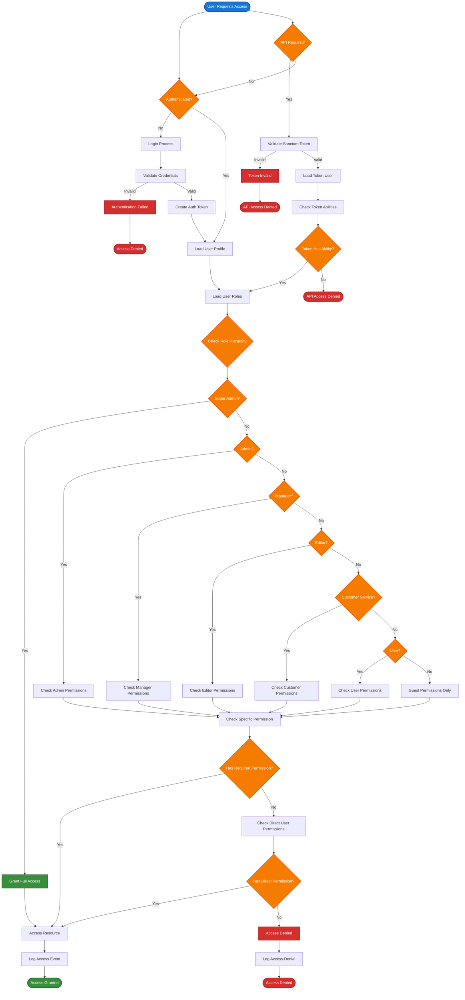

# 1. Chinook Advanced Features Guide

*Refactored from: .ai/guides/chinook/050-chinook-advanced-features-guide.md on 2025-07-11*

## 1.1 Table of Contents

- [1.2 Overview](#12-overview)
- [1.3 Role-Based Access Control (RBAC) System](#13-role-based-access-control-rbac-system)
- [1.4 Taxonomy Management with aliziodev/laravel-taxonomy](#14-taxonomy-management-with-aliziodevlaravel-taxonomy)
- [1.5 API Authentication and Authorization](#15-api-authentication-and-authorization)

## 1.2 Overview

This guide covers the advanced enterprise-level features of the Chinook database implementation using Laravel 12 best practices, including comprehensive role-based access control (RBAC) and the aliziodev/laravel-taxonomy package for unified taxonomy management. These features transform the basic music store into a sophisticated, multi-tenant, enterprise-ready application.

**Advanced Laravel 12 Features Covered:**

- **Role-Based Access Control**: Hierarchical permission system with granular controls
- **Taxonomy Management**: Unified taxonomy system using aliziodev/laravel-taxonomy exclusively
- **Performance Optimization**: Caching, indexing, and taxonomy query optimization strategies
- **Modern Authorization**: Custom policies and complex business rules using Laravel 12 patterns
- **API Authentication**: Sanctum integration with role-based endpoints
- **Advanced Querying**: Complex taxonomy-based queries and filtering
- **Enterprise Security**: Comprehensive security patterns and audit logging

## 1.3 Role-Based Access Control (RBAC) System

The following process flow diagram illustrates the complete RBAC authentication and authorization workflow, showing how users authenticate, roles are verified, permissions are checked, and resources are accessed. This diagram uses accessibility-compliant design with clear visual hierarchy and semantic colors.

### 1.3.1 RBAC Authentication & Authorization Flow



### 1.3.2 Permission System Implementation

Implement granular permissions for comprehensive access control with taxonomy integration:

```php
<?php

namespace App\Models;

use Spatie\Permission\Models\Permission as SpatiePermission;
use App\Traits\HasUserStamps;
use App\Traits\HasSecondaryUniqueKey;

class Permission extends SpatiePermission
{
    use HasUserStamps, HasSecondaryUniqueKey;

    protected $fillable = [
        'name',
        'guard_name',
        'description',
        'category',
        'is_system',
    ];

    protected function casts(): array
    {
        return [
            'is_system' => 'boolean',
            'created_at' => 'datetime',
            'updated_at' => 'datetime',
        ];
    }

    /**
     * Permission categories for organization
     */
    public const CATEGORIES = [
        'artists' => 'Artist Management',
        'albums' => 'Album Management',
        'tracks' => 'Track Management',
        'taxonomies' => 'Taxonomy Management',
        'customers' => 'Customer Management',
        'employees' => 'Employee Management',
        'invoices' => 'Invoice Management',
        'playlists' => 'Playlist Management',
        'system' => 'System Administration',
    ];

    /**
     * Get permissions by category
     */
    public static function byCategory(string $category): Collection
    {
        return static::where('category', $category)->get();
    }

    /**
     * Create permission with metadata
     */
    public static function createWithMetadata(array $data): self
    {
        return static::create([
            'name' => $data['name'],
            'guard_name' => $data['guard_name'] ?? 'web',
            'description' => $data['description'] ?? '',
            'category' => $data['category'] ?? 'system',
            'is_system' => $data['is_system'] ?? false,
        ]);
    }
}
```

### 1.3.3 Role Hierarchy and Permissions

The Chinook RBAC system implements a hierarchical role structure with granular permissions:

**Role Hierarchy (from highest to lowest access):**

1. **Super Admin** (`super-admin`)
   - Complete system control
   - User impersonation capabilities
   - System configuration access
   - Audit log management
   - All permissions granted

2. **Admin** (`admin`)
   - Full business operations
   - User management (except super admins)
   - All CRUD operations on Chinook models
   - Report generation and analytics
   - Taxonomy management

3. **Manager** (`manager`)
   - Department-specific management
   - Limited user management within department
   - Content editing in assigned areas
   - Departmental reporting
   - Limited taxonomy editing

4. **Editor** (`editor`)
   - Content creation and management
   - Artist, album, track management
   - Playlist management
   - Taxonomy assignment
   - No user management

5. **Customer Service** (`customer-service`)
   - Customer support operations
   - View customer data and purchase history
   - Process refunds and adjustments
   - Manage customer issues
   - Read-only access to content

6. **User** (`user`)
   - Standard customer operations
   - Browse and purchase content
   - Manage personal playlists
   - Update own profile
   - View public taxonomies

7. **Guest** (`guest`)
   - Public content browsing
   - View artist and album information
   - Access public taxonomies
   - No account required

## 1.4 Taxonomy Management with aliziodev/laravel-taxonomy

### 1.4.1 Taxonomy System Overview

The Chinook implementation uses the aliziodev/laravel-taxonomy package exclusively for all categorization needs, replacing the previous Category/Categorizable system with a unified, hierarchical taxonomy approach.

**Key Features:**

- **Unified System**: Single taxonomy package for all categorization
- **Hierarchical Structure**: Support for nested taxonomy terms
- **Polymorphic Relationships**: Attach terms to any model
- **Performance Optimized**: Efficient queries and caching
- **Laravel 12 Compatible**: Modern syntax and patterns

### 1.4.2 Taxonomy Implementation

```php
<?php

namespace App\Models;

use Illuminate\Database\Eloquent\Model;
use Illuminate\Database\Eloquent\Relations\HasMany;
use Illuminate\Database\Eloquent\Relations\BelongsTo;
use Illuminate\Database\Eloquent\SoftDeletes;
use Aliziodev\LaravelTaxonomy\Traits\HasTaxonomy;
use App\Traits\HasUserStamps;
use App\Traits\HasSecondaryUniqueKey;
use App\Traits\HasSlug;

class Artist extends Model
{
    use SoftDeletes, HasTaxonomy, HasUserStamps, HasSecondaryUniqueKey, HasSlug;

    protected $table = 'chinook_artists';

    protected $fillable = [
        'name',
        'biography',
        'website',
        'is_active',
        'metadata',
    ];

    protected function casts(): array
    {
        return [
            'is_active' => 'boolean',
            'metadata' => 'array',
            'created_at' => 'datetime',
            'updated_at' => 'datetime',
            'deleted_at' => 'datetime',
        ];
    }

    public function albums(): HasMany
    {
        return $this->hasMany(Album::class, 'artist_id');
    }

    /**
     * Get artist genres using taxonomy system
     */
    public function getGenresAttribute(): Collection
    {
        return $this->getTermsByTaxonomy('Genres');
    }

    /**
     * Scope to filter by genre using taxonomy
     */
    public function scopeByGenre($query, string $genreName)
    {
        return $query->whereHasTerm($genreName, 'Genres');
    }

    /**
     * Scope to filter by multiple genres
     */
    public function scopeByGenres($query, array $genreNames)
    {
        return $query->whereHasTerms($genreNames, 'Genres');
    }

    /**
     * Get all taxonomy terms grouped by taxonomy
     */
    public function getGroupedTermsAttribute(): array
    {
        return $this->terms->groupBy('taxonomy.name')->map(function ($terms) {
            return $terms->pluck('name')->toArray();
        })->toArray();
    }
}
```

### 1.4.3 Taxonomy Service Implementation

```php
<?php

namespace App\Services;

use Aliziodev\LaravelTaxonomy\Models\Taxonomy;
use Aliziodev\LaravelTaxonomy\Models\Term;
use Illuminate\Database\Eloquent\Model;
use Illuminate\Support\Collection;
use Illuminate\Support\Facades\Cache;
use Illuminate\Support\Str;

class TaxonomyService
{
    /**
     * Create a new taxonomy with terms
     */
    public function createTaxonomy(string $name, array $terms = []): Taxonomy
    {
        $taxonomy = Taxonomy::create([
            'name' => $name,
            'slug' => Str::slug($name),
            'description' => "Taxonomy for {$name}",
        ]);

        foreach ($terms as $termData) {
            $this->createTerm($taxonomy, $termData);
        }

        return $taxonomy->load('terms');
    }

    /**
     * Create a new term in a taxonomy
     */
    public function createTerm(Taxonomy $taxonomy, array $data): Term
    {
        return Term::create([
            'taxonomy_id' => $taxonomy->id,
            'name' => $data['name'],
            'slug' => $data['slug'] ?? Str::slug($data['name']),
            'description' => $data['description'] ?? null,
            'parent_id' => $data['parent_id'] ?? null,
            'sort_order' => $data['sort_order'] ?? 0,
        ]);
    }

    /**
     * Attach terms to a model
     */
    public function attachTermsToModel(Model $model, array $termIds): void
    {
        $model->attachTerms($termIds);
    }

    /**
     * Get taxonomy tree with caching
     */
    public function getTaxonomyTree(string $taxonomyName): Collection
    {
        return Cache::remember("taxonomy_tree_{$taxonomyName}", 3600, function () use ($taxonomyName) {
            $taxonomy = Taxonomy::where('name', $taxonomyName)->first();

            if (!$taxonomy) {
                return collect();
            }

            return $taxonomy->terms()
                ->whereNull('parent_id')
                ->with('children')
                ->orderBy('sort_order')
                ->get();
        });
    }

    /**
     * Search terms across taxonomies
     */
    public function searchTerms(string $query, ?string $taxonomyName = null): Collection
    {
        $termsQuery = Term::where('name', 'like', "%{$query}%");

        if ($taxonomyName) {
            $termsQuery->whereHas('taxonomy', function ($q) use ($taxonomyName) {
                $q->where('name', $taxonomyName);
            });
        }

        return $termsQuery->with('taxonomy')->get();
    }

    /**
     * Get popular terms by usage count
     */
    public function getPopularTerms(string $taxonomyName, int $limit = 10): Collection
    {
        return Term::whereHas('taxonomy', function ($q) use ($taxonomyName) {
            $q->where('name', $taxonomyName);
        })
        ->withCount('termables')
        ->orderBy('termables_count', 'desc')
        ->limit($limit)
        ->get();
    }
}
```

## 1.5 API Authentication and Authorization

### 1.5.1 Laravel Sanctum Integration

```php
<?php

namespace App\Http\Controllers\Api;

use App\Http\Controllers\Controller;
use App\Models\Artist;
use App\Services\TaxonomyService;
use Illuminate\Http\Request;
use Illuminate\Http\JsonResponse;

class ApiArtistController extends Controller
{
    public function __construct(
        private TaxonomyService $taxonomyService
    ) {}

    /**
     * Get artists with role-based filtering and taxonomy data
     */
    public function index(Request $request): JsonResponse
    {
        $user = $request->user();

        // Check API permission
        if (!$user || !$user->tokenCan('view-artists')) {
            return response()->json(['error' => 'Insufficient permissions'], 403);
        }

        $query = Artist::with(['terms.taxonomy', 'albums']);

        // Apply role-based filtering
        if (!$user->hasRole(['admin', 'super-admin'])) {
            $query->where('is_active', true);
        }

        // Taxonomy filtering
        if ($request->has('genre')) {
            $query->whereHasTerm($request->genre, 'Genres');
        }

        if ($request->has('mood')) {
            $query->whereHasTerm($request->mood, 'Moods');
        }

        $artists = $query->paginate(20);

        return response()->json([
            'data' => $artists->items(),
            'meta' => [
                'current_page' => $artists->currentPage(),
                'total' => $artists->total(),
                'per_page' => $artists->perPage(),
            ]
        ]);
    }

    /**
     * Create artist via API with taxonomy assignment
     */
    public function store(Request $request): JsonResponse
    {
        $user = $request->user();

        if (!$user || !$user->tokenCan('create-artists')) {
            return response()->json(['error' => 'Insufficient permissions'], 403);
        }

        $this->authorize('create', Artist::class);

        $validated = $request->validate([
            'name' => 'required|string|max:255',
            'biography' => 'nullable|string',
            'website' => 'nullable|url',
            'is_active' => 'boolean',
            'terms' => 'array',
            'terms.*' => 'exists:terms,id',
        ]);

        $artist = Artist::create($validated);

        // Attach taxonomy terms
        if (!empty($validated['terms'])) {
            $this->taxonomyService->attachTermsToModel($artist, $validated['terms']);
        }

        return response()->json($artist->load('terms.taxonomy'), 201);
    }
}
```

---

**Next**: [README Documentation](README.md) | **Previous**: [Comprehensive Data Access Guide](130-comprehensive-data-access-guide.md)

---

*This guide demonstrates advanced enterprise features for the Chinook system using Laravel 12, RBAC, and the aliziodev/laravel-taxonomy package for unified taxonomy management.*

[⬆️ Back to Top](#1-chinook-advanced-features-guide)
