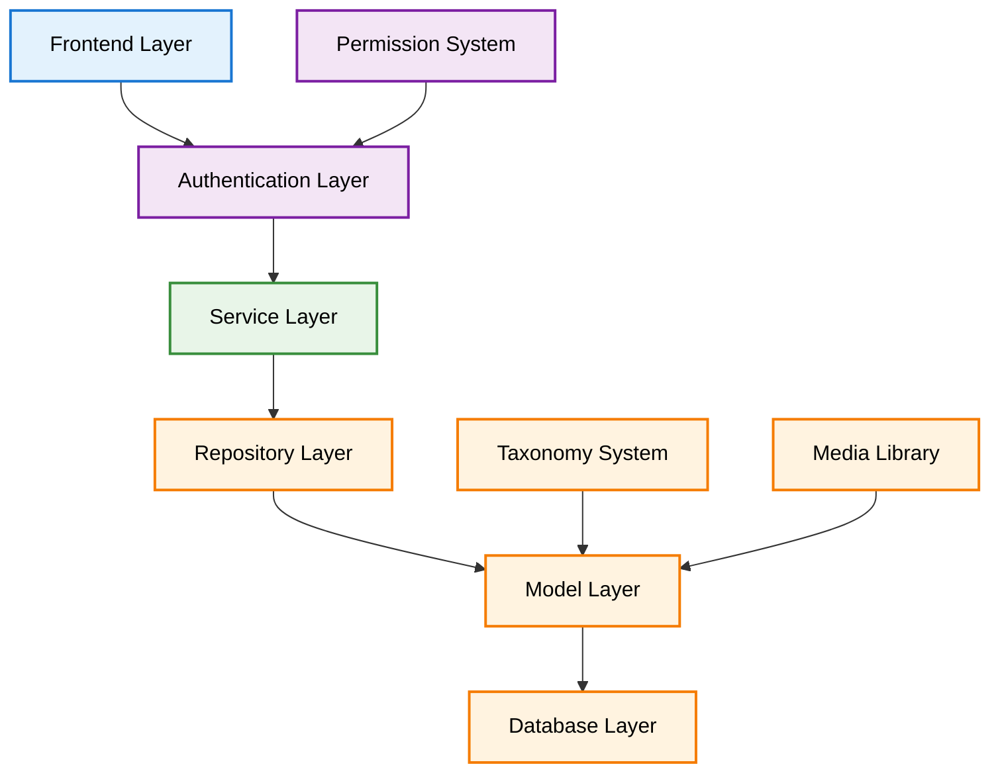
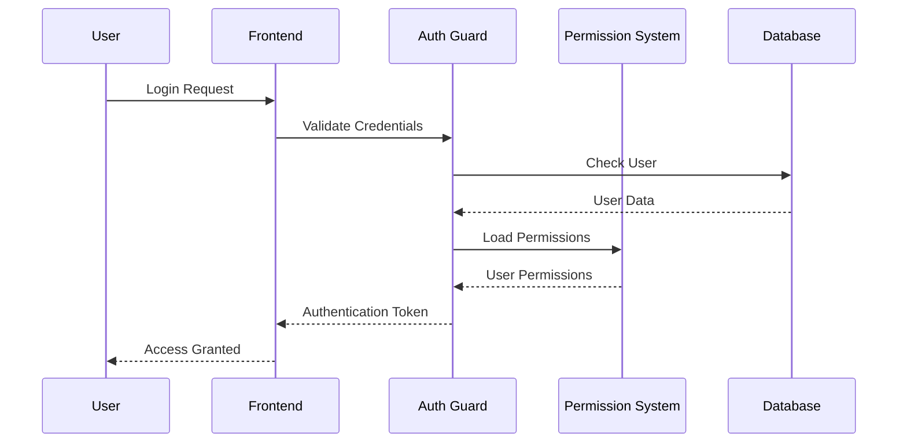

# System Architecture

**Version:** 1.0  
**Created:** 2025-07-16  
**Last Updated:** 2025-07-16  
**Scope:** System design patterns, relationships, and architectural decisions

## Table of Contents

1. [Overview](#1-overview)
2. [Genre Preservation Strategy](#2-genre-preservation-strategy)
3. [Hierarchy Comparison Guide](#3-hierarchy-comparison-guide)
4. [Relationship Mapping](#4-relationship-mapping)
5. [Authentication Architecture](#5-authentication-architecture)
6. [Authentication Flow](#6-authentication-flow)
7. [Query Builder Guide](#7-query-builder-guide)
8. [Data Access Guide](#8-data-access-guide)

## 1. Overview

The Chinook system architecture emphasizes modern Laravel patterns, single taxonomy implementation, and enterprise-grade security. This section covers design decisions, relationship patterns, and architectural strategies.

### 1.1 Architectural Principles

**Core Design Patterns:**
- **Single Taxonomy System** - Unified categorization using aliziodev/laravel-taxonomy
- **Polymorphic Relationships** - Flexible entity associations
- **RBAC Security** - Role-based access control with spatie/laravel-permission
- **Performance Optimization** - Efficient queries and caching strategies

### 1.2 Learning Path

Follow this sequence for comprehensive understanding:

1. **Genre Preservation** - Compatibility layer design
2. **Hierarchy Comparison** - Single vs dual taxonomy analysis
3. **Relationship Mapping** - Entity relationship documentation
4. **Authentication Architecture** - Security system design
5. **Authentication Flow** - User authentication patterns
6. **Query Builder** - Advanced query patterns
7. **Data Access** - Comprehensive access strategies

## 2. Genre Preservation Strategy

**File:** [010-genre-preservation-strategy.md](010-genre-preservation-strategy.md)  
**Purpose:** Compatibility layer design for maintaining Chinook genre compatibility

**What You'll Learn:**
- Bridge layer implementation between genres and taxonomies
- Data migration strategies from legacy genre system
- Backward compatibility maintenance
- Export functionality for original Chinook format

**Key Features:**
- Seamless genre-to-taxonomy mapping
- Preserved data integrity
- Legacy system compatibility
- Future-proof design patterns

## 3. Hierarchy Comparison Guide

**File:** [020-hierarchy-comparison-guide.md](020-hierarchy-comparison-guide.md)  
**Purpose:** Single vs dual taxonomy system analysis

**What You'll Learn:**
- Performance benefits of single taxonomy system
- Architecture simplification advantages
- Query optimization improvements
- Migration strategies from dual systems

**Comparison Areas:**
- Query performance metrics
- Code complexity reduction
- Maintenance overhead
- Scalability considerations

## 4. Relationship Mapping

**File:** [030-relationship-mapping.md](030-relationship-mapping.md)  
**Purpose:** Entity relationship documentation and patterns

**What You'll Learn:**
- Complete entity relationship diagrams
- Polymorphic relationship implementations
- Foreign key constraint strategies
- Performance optimization for complex relationships

**Key Relationships:**
- Artist → Albums → Tracks hierarchy
- Customer → Invoices → Invoice Lines
- Polymorphic taxonomy assignments
- Employee hierarchical reporting

## 5. Authentication Architecture

**File:** [040-authentication-architecture.md](040-authentication-architecture.md)  
**Purpose:** Security system design and implementation

**What You'll Learn:**
- Multi-guard authentication system
- Role-based access control (RBAC) implementation
- Permission hierarchies and inheritance
- API authentication with Laravel Sanctum

**Security Features:**
- Hierarchical role structure
- Granular permission system
- Panel-specific authentication
- Token-based API access

## 6. Authentication Flow

**File:** [050-authentication-flow.md](050-authentication-flow.md)  
**Purpose:** User authentication patterns and workflows

**What You'll Learn:**
- Login/logout flow implementation
- Password reset and recovery
- Multi-factor authentication setup
- Session management strategies

**Flow Components:**
- User registration process
- Email verification workflow
- Password policy enforcement
- Account lockout mechanisms

## 7. Query Builder Guide

**File:** [060-query-builder-guide.md](060-query-builder-guide.md)  
**Purpose:** Advanced query patterns and optimization

**What You'll Learn:**
- Laravel Query Builder advanced patterns
- Spatie Laravel Query Builder integration
- Complex filtering and sorting
- Performance optimization techniques

**Query Patterns:**
- Taxonomy-based filtering
- Hierarchical data queries
- Polymorphic relationship queries
- Aggregation and reporting queries

## 8. Data Access Guide

**File:** [070-data-access-guide.md](070-data-access-guide.md)  
**Purpose:** Comprehensive data access strategies

**What You'll Learn:**
- Repository pattern implementation
- Service layer architecture
- Caching strategies for data access
- API resource transformations

**Access Patterns:**
- CRUD operation standardization
- Bulk operation optimization
- Transaction management
- Error handling strategies

---

## Architecture Diagrams

### System Overview

### Authentication Flow

---

## Quick Reference

### Key Architectural Decisions

1. **Single Taxonomy System** - aliziodev/laravel-taxonomy only
2. **Polymorphic Relationships** - Flexible entity associations
3. **RBAC Implementation** - spatie/laravel-permission
4. **SQLite Focus** - Educational deployment optimization

### Performance Considerations

- Eager loading for taxonomy relationships
- Index optimization for polymorphic queries
- Caching strategies for hierarchical data
- Query optimization for large datasets

---

## Navigation

**← Previous:** [Database Implementation](../020-database/000-index.md)  
**Next →** [Package Integration](../040-packages/000-index.md)

## Related Documentation

- [Database Models](../020-database/030-models-guide.md)
- [Performance Optimization](../080-performance/000-index.md)
- [Testing Strategies](../070-testing/000-index.md)

---

**Last Updated:** 2025-07-16  
**Maintainer:** Technical Documentation Team  
**Source:** [GitHub Repository](https://github.com/s-a-c/chinook)
