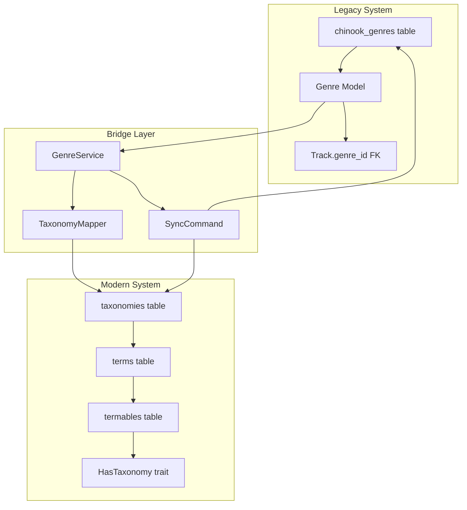

# Genre Preservation Strategy

**Created:** 2025-07-16  
**Focus:** Dual system architecture for genre data preservation and taxonomy migration  
**Source:** [Stakeholder Decisions - 2025-07-16](https://github.com/s-a-c/chinook)

## 1. Table of Contents

- [1.1. Overview](#11-overview)
- [1.2. Dual System Architecture](#12-dual-system-architecture)
- [1.3. Genre Model Preservation](#13-genre-model-preservation)
- [1.4. Taxonomy Integration](#14-taxonomy-integration)
- [1.5. Data Migration Strategy](#15-data-migration-strategy)
- [1.6. Synchronization Patterns](#16-synchronization-patterns)
- [1.7. Implementation Examples](#17-implementation-examples)
- [1.8. Educational Scope](#18-educational-scope)

## 1.1. Overview

The Chinook project implements a **Genre Preservation Strategy** that maintains the original Genre model for compatibility while using the `aliziodev/laravel-taxonomy` package as the primary categorization system.

### 1.1.1. Strategic Goals
- **Backward Compatibility**: Preserve original Chinook database structure
- **Modern Enhancement**: Leverage advanced taxonomy features
- **Data Integrity**: Maintain all existing genre relationships
- **Migration Safety**: Enable gradual transition without data loss

### 1.1.2. Stakeholder Decision
**Decision**: Dual system - Genre model preserved + Taxonomy migration  
**Rationale**: Educational scope requires both legacy compatibility and modern patterns  
**Implementation**: Bridge layer for seamless integration

## 1.2. Dual System Architecture

### 1.2.1. System Components



### 1.2.2. Data Flow Architecture
```php
// Legacy access pattern (preserved)
$track = Track::with('genre')->find(1);
$genreName = $track->genre->name; // "Rock"

// Modern access pattern (enhanced)
$track = Track::with('terms')->find(1);
$genres = $track->getTermsByTaxonomy('genre'); // Collection of genre terms

// Unified access pattern (recommended)
$track = Track::find(1);
$genreName = $track->getGenreName(); // Works with both systems
```

## 1.3. Genre Model Preservation

### 1.3.1. Genre Model Structure
```php
<?php
// app/Models/Chinook/Genre.php

namespace App\Models\Chinook;

use Illuminate\Database\Eloquent\Relations\HasMany;

/**
 * Genre Model - Preserved for compatibility
 *
 * This model is maintained for data export/import compatibility
 * with the original Chinook database structure.
 */
class Genre extends BaseModel
{
    protected $table = 'chinook_genres';

    protected $fillable = [
        'name',
        'public_id',
        'slug',
        'description',
        'is_active',
    ];

    /**
     * Genre has many tracks (legacy relationship)
     *
     * @deprecated Use taxonomy relationships instead
     */
    public function tracks(): HasMany
    {
        return $this->hasMany(Track::class, 'genre_id');
    }

    /**
     * Get corresponding taxonomy term
     */
    public function getTaxonomyTermAttribute()
    {
        return \Aliziodev\LaravelTaxonomy\Models\Term::where('name', $this->name)->first();
    }

    protected function casts(): array
    {
        return array_merge(parent::casts(), [
            'is_active' => 'boolean',
        ]);
    }
}
```

### 1.3.2. Database Schema Preservation
```sql
-- chinook_genres table (preserved)
CREATE TABLE chinook_genres (
    id INTEGER PRIMARY KEY,
    name VARCHAR(120) NOT NULL,
    public_id VARCHAR(36) UNIQUE,
    slug VARCHAR(255) UNIQUE,
    description TEXT,
    is_active BOOLEAN DEFAULT 1,
    created_at TIMESTAMP,
    updated_at TIMESTAMP,
    deleted_at TIMESTAMP,
    created_by INTEGER,
    updated_by INTEGER
);

-- Original 25 genres preserved
INSERT INTO chinook_genres (id, name) VALUES
(1, 'Rock'),
(2, 'Jazz'),
(3, 'Metal'),
-- ... all 25 original genres
```

## 1.4. Taxonomy Integration

### 1.4.1. Taxonomy Configuration
```php
// config/taxonomy.php
return [
    'taxonomy_types' => [
        'genre' => [
            'label' => 'Music Genres',
            'description' => 'Musical genre classifications',
            'hierarchical' => true,
            'max_depth' => 3,
        ],
        'mood' => [
            'label' => 'Musical Moods',
            'description' => 'Emotional categorization',
            'hierarchical' => false,
            'max_depth' => 1,
        ],
        'theme' => [
            'label' => 'Musical Themes',
            'description' => 'Thematic content',
            'hierarchical' => true,
            'max_depth' => 2,
        ],
    ],
];
```

### 1.4.2. Track Model Integration
```php
<?php
// app/Models/Chinook/Track.php

use Aliziodev\LaravelTaxonomy\Traits\HasTaxonomy;

class Track extends BaseModel
{
    use HasTaxonomy; // Modern taxonomy support

    /**
     * Legacy genre relationship (preserved)
     */
    public function genre(): BelongsTo
    {
        return $this->belongsTo(Genre::class, 'genre_id');
    }

    /**
     * Get genre name from either system
     */
    public function getGenreName(): ?string
    {
        // Try taxonomy first (modern)
        $genreTerms = $this->getTermsByTaxonomy('genre');
        if ($genreTerms->isNotEmpty()) {
            return $genreTerms->first()->name;
        }

        // Fallback to legacy genre
        return $this->genre?->name;
    }

    /**
     * Get all genre classifications
     */
    public function getAllGenres(): Collection
    {
        $genres = collect();

        // Add legacy genre
        if ($this->genre) {
            $genres->push([
                'name' => $this->genre->name,
                'source' => 'legacy',
                'id' => $this->genre->id,
            ]);
        }

        // Add taxonomy genres
        $this->getTermsByTaxonomy('genre')->each(function ($term) use ($genres) {
            $genres->push([
                'name' => $term->name,
                'source' => 'taxonomy',
                'id' => $term->id,
            ]);
        });

        return $genres;
    }
}
```

## 1.5. Data Migration Strategy

### 1.5.1. Migration Command
```php
<?php
// app/Console/Commands/MigrateGenresToTaxonomy.php

use Illuminate\Console\Command;
use App\Models\Chinook\Genre;
use Aliziodev\LaravelTaxonomy\Models\Taxonomy;
use Aliziodev\LaravelTaxonomy\Models\Term;

class MigrateGenresToTaxonomy extends Command
{
    protected $signature = 'chinook:migrate-genres';
    protected $description = 'Migrate genres to taxonomy system';

    public function handle(): int
    {
        $this->info('Starting genre migration to taxonomy system...');

        // 1. Create genre taxonomy
        $genreTaxonomy = Taxonomy::firstOrCreate([
            'name' => 'Genres',
            'slug' => 'genres',
            'type' => 'genre',
        ]);

        // 2. Migrate each genre
        Genre::chunk(50, function ($genres) use ($genreTaxonomy) {
            foreach ($genres as $genre) {
                $this->migrateGenre($genre, $genreTaxonomy);
            }
        });

        $this->info('Genre migration completed successfully!');
        return 0;
    }

    private function migrateGenre(Genre $genre, Taxonomy $taxonomy): void
    {
        // Create taxonomy term
        $term = Term::firstOrCreate([
            'taxonomy_id' => $taxonomy->id,
            'name' => $genre->name,
            'slug' => $genre->slug ?: Str::slug($genre->name),
        ], [
            'description' => $genre->description ?? "Migrated from genre: {$genre->name}",
            'meta' => [
                'original_genre_id' => $genre->id,
                'migration_date' => now()->toISOString(),
                'chinook_source' => true,
            ]
        ]);

        // Migrate track relationships
        $this->migrateTrackRelationships($genre, $term);
    }

    private function migrateTrackRelationships(Genre $genre, Term $term): void
    {
        $genre->tracks()->chunk(100, function ($tracks) use ($term) {
            foreach ($tracks as $track) {
                // Add taxonomy relationship (don't remove legacy)
                $track->attachTerm($term);
            }
        });
    }
}
```

### 1.5.2. Seeder Integration
```php
<?php
// database/seeders/GenreTaxonomySeeder.php

class GenreTaxonomySeeder extends Seeder
{
    private array $chinookGenres = [
        1 => 'Rock',
        2 => 'Jazz',
        3 => 'Metal',
        // ... all 25 original genres
    ];

    public function run(): void
    {
        // Create genre taxonomy
        $genreTaxonomy = Taxonomy::create([
            'name' => 'Genres',
            'slug' => 'genres',
            'type' => 'genre',
        ]);

        // Create terms for each genre
        foreach ($this->chinookGenres as $id => $name) {
            Term::create([
                'taxonomy_id' => $genreTaxonomy->id,
                'name' => $name,
                'slug' => Str::slug($name),
                'meta' => [
                    'original_genre_id' => $id,
                    'chinook_source' => true,
                ],
            ]);
        }
    }
}
```

## 1.6. Synchronization Patterns

### 1.6.1. Genre Service Layer
```php
<?php
// app/Services/GenreService.php

class GenreService
{
    public function syncGenreToTaxonomy(Genre $genre): Term
    {
        $genreTaxonomy = Taxonomy::where('type', 'genre')->first();
        
        return Term::updateOrCreate([
            'taxonomy_id' => $genreTaxonomy->id,
            'name' => $genre->name,
        ], [
            'slug' => $genre->slug,
            'description' => $genre->description,
            'meta' => [
                'original_genre_id' => $genre->id,
                'last_sync' => now()->toISOString(),
            ]
        ]);
    }

    public function syncTaxonomyToGenre(Term $term): ?Genre
    {
        $originalId = $term->meta['original_genre_id'] ?? null;
        
        if (!$originalId) {
            return null; // New taxonomy term, no legacy equivalent
        }

        return Genre::updateOrCreate(['id' => $originalId], [
            'name' => $term->name,
            'slug' => $term->slug,
            'description' => $term->description,
        ]);
    }
}
```

### 1.6.2. Model Events
```php
<?php
// In Genre model

protected static function booted(): void
{
    static::saved(function (Genre $genre) {
        // Sync to taxonomy when genre is updated
        app(GenreService::class)->syncGenreToTaxonomy($genre);
    });
}

// In Term model (via observer)
class TermObserver
{
    public function saved(Term $term): void
    {
        if ($term->taxonomy->type === 'genre') {
            app(GenreService::class)->syncTaxonomyToGenre($term);
        }
    }
}
```

## 1.7. Implementation Examples

### 1.7.1. Query Patterns
```php
// Legacy pattern (still works)
$rockTracks = Track::whereHas('genre', function ($q) {
    $q->where('name', 'Rock');
})->get();

// Modern pattern (enhanced)
$rockTracks = Track::whereHasTerm('Rock', 'genre')->get();

// Unified pattern (recommended)
$rockTracks = Track::byGenre('Rock')->get();
```

### 1.7.2. Filament Resource Integration
```php
// In TrackResource
public static function form(Form $form): Form
{
    return $form->schema([
        // Legacy genre selection (preserved)
        Select::make('genre_id')
            ->label('Genre (Legacy)')
            ->relationship('genre', 'name')
            ->searchable(),

        // Modern taxonomy selection (enhanced)
        Select::make('genre_terms')
            ->label('Genres (Taxonomy)')
            ->multiple()
            ->relationship('terms', 'name')
            ->preload(),
    ]);
}
```

## 1.8. Educational Scope

### 1.8.1. Learning Objectives
- **Legacy System Understanding**: How traditional foreign key relationships work
- **Modern Taxonomy Patterns**: Flexible categorization with polymorphic relationships
- **Migration Strategies**: Safe data migration techniques
- **Dual System Management**: Maintaining compatibility during transitions

### 1.8.2. Production Considerations
**⚠️ Educational Use Only**: This dual system approach is designed for learning environments.

For production:
- Choose single system (taxonomy recommended)
- Implement comprehensive data validation
- Add performance optimization for large datasets
- Consider eventual legacy system deprecation

---

## Navigation

**Index:** [Chinook Documentation](000-chinook-index.md) | **Next:** [Authentication Architecture](000-authentication-architecture.md)

---

**Documentation Standards**: This document follows WCAG 2.1 AA accessibility guidelines and uses Laravel 12 modern syntax patterns.

[⬆️ Back to Top](#genre-preservation-strategy)
