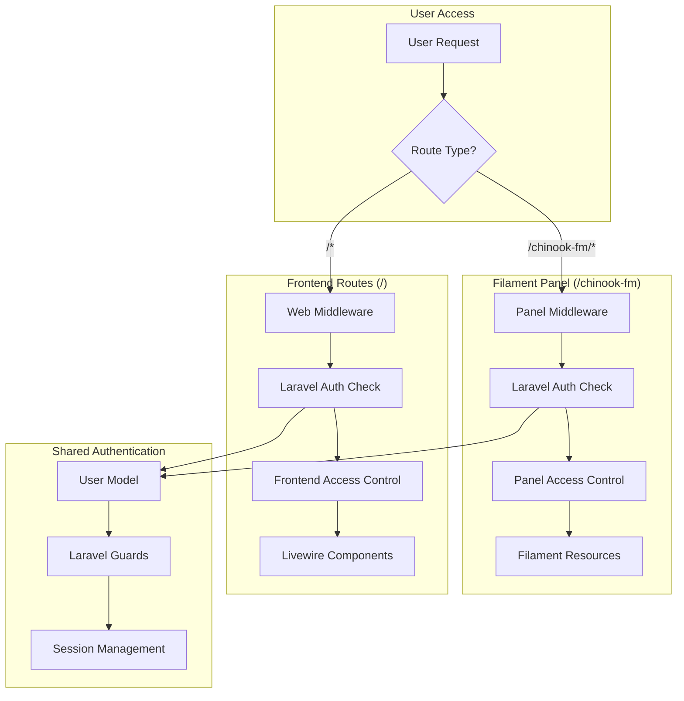

# Authentication Architecture (Updated)

**Created:** 2025-07-16  
**Focus:** Clear auth boundaries with Filament panel and Laravel frontend integration  
**Source:** [Stakeholder Decisions - 2025-07-16](https://github.com/s-a-c/chinook)

## 1. Table of Contents

- [1.1. Overview](#11-overview)
- [1.2. Authentication Boundaries](#12-authentication-boundaries)
- [1.3. System Architecture](#13-system-architecture)
- [1.4. Filament Panel Authentication](#14-filament-panel-authentication)
- [1.5. Laravel Frontend Authentication](#15-laravel-frontend-authentication)
- [1.6. User Model Integration](#16-user-model-integration)
- [1.7. Authorization Patterns](#17-authorization-patterns)
- [1.8. Educational Implementation](#18-educational-implementation)

## 1.1. Overview

The Chinook project implements a **dual authentication architecture** with clear boundaries between Filament panel authentication and Laravel frontend authentication, following stakeholder decisions for educational deployment.

### 1.1.1. Key Architectural Decisions
- **Filament Panel**: Uses Laravel authentication for panel routes (`/chinook-fm`)
- **Frontend Routes**: Uses Laravel authentication for public-facing routes
- **Single User Model**: Unified user management across both systems
- **Educational Scope**: Simplified authentication for learning purposes

### 1.1.2. Authentication Flow


## 1.2. Authentication Boundaries

### 1.2.1. Clear Separation of Concerns
```php
// Filament Panel Authentication
Route::group([
    'prefix' => 'chinook-fm',
    'middleware' => ['web', 'auth'],
], function () {
    // All panel routes require authentication
    // Uses Laravel's default authentication
    // No separate Filament auth system
});

// Frontend Authentication
Route::group([
    'middleware' => ['web'],
], function () {
    // Public routes (login, register, etc.)
    Route::get('/login', [AuthController::class, 'showLogin']);
    Route::post('/login', [AuthController::class, 'login']);
    
    // Protected routes
    Route::middleware('auth')->group(function () {
        Route::get('/dashboard', [DashboardController::class, 'index']);
        // Other authenticated routes
    });
});
```

### 1.2.2. Authentication Guards Configuration
```php
// config/auth.php
'guards' => [
    'web' => [
        'driver' => 'session',
        'provider' => 'users',
    ],
    // No separate filament guard - uses web guard
],

'providers' => [
    'users' => [
        'driver' => 'eloquent',
        'model' => App\Models\User::class,
    ],
],
```

## 1.3. System Architecture

### 1.3.1. Unified User Model
```php
<?php
// app/Models/User.php

namespace App\Models;

use Filament\Models\Contracts\FilamentUser;
use Filament\Panel;
use Illuminate\Foundation\Auth\User as Authenticatable;
use Laravel\Sanctum\HasApiTokens;
use Spatie\Permission\Traits\HasRoles;

class User extends Authenticatable implements FilamentUser
{
    use HasApiTokens, HasRoles;

    protected $fillable = [
        'name',
        'email',
        'password',
        'email_verified_at',
    ];

    protected $hidden = [
        'password',
        'remember_token',
    ];

    protected function casts(): array
    {
        return [
            'email_verified_at' => 'datetime',
            'password' => 'hashed',
        ];
    }

    /**
     * Determine if user can access Filament panel
     */
    public function canAccessPanel(Panel $panel): bool
    {
        // For chinook-fm panel, allow all authenticated users
        if ($panel->getId() === 'chinook-fm') {
            return true; // Educational scope - all users can access
        }

        return false;
    }

    /**
     * Check if user has admin privileges
     */
    public function isAdmin(): bool
    {
        return $this->hasRole(['admin', 'super-admin']);
    }

    /**
     * Check if user can manage specific resources
     */
    public function canManage(string $resource): bool
    {
        return $this->hasPermissionTo("manage.{$resource}") || $this->isAdmin();
    }
}
```

### 1.3.2. Middleware Configuration
```php
// app/Http/Kernel.php
protected $middlewareGroups = [
    'web' => [
        \App\Http\Middleware\EncryptCookies::class,
        \Illuminate\Cookie\Middleware\AddQueuedCookiesToResponse::class,
        \Illuminate\Session\Middleware\StartSession::class,
        \Illuminate\View\Middleware\ShareErrorsFromSession::class,
        \App\Http\Middleware\VerifyCsrfToken::class,
        \Illuminate\Routing\Middleware\SubstituteBindings::class,
    ],
];

protected $routeMiddleware = [
    'auth' => \App\Http\Middleware\Authenticate::class,
    'auth.basic' => \Illuminate\Auth\Middleware\AuthenticateWithBasicAuth::class,
    'guest' => \App\Http\Middleware\RedirectIfAuthenticated::class,
    // No separate filament middleware needed
];
```

## 1.4. Filament Panel Authentication

### 1.4.1. Panel Provider Configuration
```php
<?php
// app/Providers/Filament/ChinookFmPanelProvider.php

class ChinookFmPanelProvider extends PanelProvider
{
    public function panel(Panel $panel): Panel
    {
        return $panel
            ->id('chinook-fm')
            ->path('chinook-fm')
            
            // Use Laravel's web guard (not separate Filament auth)
            ->authGuard('web')
            
            // Standard Laravel middleware stack
            ->middleware([
                EncryptCookies::class,
                AddQueuedCookiesToResponse::class,
                StartSession::class,
                AuthenticateSession::class,
                ShareErrorsFromSession::class,
                VerifyCsrfToken::class,
                SubstituteBindings::class,
                DisableBladeIconComponents::class,
                DispatchServingFilamentEvent::class,
            ])
            
            // Authentication middleware
            ->authMiddleware([
                Authenticate::class, // Uses Laravel's auth system
            ])
            
            // No Filament-specific auth pages
            // Users authenticate through Laravel routes
            ->login(false)
            ->registration(false)
            ->passwordReset(false)
            ->emailVerification(false)
            ->profile(false);
    }
}
```

### 1.4.2. Panel Access Control
```php
// Panel access is controlled through User model
public function canAccessPanel(Panel $panel): bool
{
    if ($panel->getId() === 'chinook-fm') {
        // Educational scope: all authenticated users can access
        return auth()->check();
    }
    
    return false;
}

// Resource-level access control
class ArtistResource extends Resource
{
    public static function canViewAny(): bool
    {
        return auth()->check(); // All authenticated users can view
    }
    
    public static function canCreate(): bool
    {
        return auth()->user()?->canManage('artists') ?? false;
    }
    
    public static function canEdit(Model $record): bool
    {
        return auth()->user()?->canManage('artists') ?? false;
    }
}
```

## 1.5. Laravel Frontend Authentication

### 1.5.1. Authentication Routes
```php
// routes/web.php
use App\Http\Controllers\Auth\AuthenticatedSessionController;
use App\Http\Controllers\Auth\RegisteredUserController;

// Authentication routes
Route::middleware('guest')->group(function () {
    Route::get('login', [AuthenticatedSessionController::class, 'create'])
        ->name('login');
    Route::post('login', [AuthenticatedSessionController::class, 'store']);
    
    Route::get('register', [RegisteredUserController::class, 'create'])
        ->name('register');
    Route::post('register', [RegisteredUserController::class, 'store']);
});

Route::middleware('auth')->group(function () {
    Route::post('logout', [AuthenticatedSessionController::class, 'destroy'])
        ->name('logout');
    
    // Protected frontend routes
    Route::get('/dashboard', function () {
        return view('dashboard');
    })->name('dashboard');
});
```

### 1.5.2. Livewire Component Authentication
```php
<?php
// app/Livewire/Dashboard.php

use Livewire\Component;

class Dashboard extends Component
{
    public function mount()
    {
        // Ensure user is authenticated
        if (!auth()->check()) {
            return redirect()->route('login');
        }
    }

    public function render()
    {
        return view('livewire.dashboard', [
            'user' => auth()->user(),
            'canAccessPanel' => auth()->user()?->canAccessPanel(
                filament('chinook-fm')
            ),
        ]);
    }
}
```

## 1.6. User Model Integration

### 1.6.1. Role and Permission Setup
```php
// database/seeders/RolePermissionSeeder.php
class RolePermissionSeeder extends Seeder
{
    public function run(): void
    {
        // Create basic roles for educational scope
        $roles = [
            'admin' => [
                'manage.artists',
                'manage.albums',
                'manage.tracks',
                'manage.customers',
                'manage.users',
            ],
            'editor' => [
                'manage.artists',
                'manage.albums',
                'manage.tracks',
            ],
            'user' => [
                'view.artists',
                'view.albums',
                'view.tracks',
            ],
        ];

        foreach ($roles as $roleName => $permissions) {
            $role = Role::create(['name' => $roleName]);
            
            foreach ($permissions as $permission) {
                $perm = Permission::firstOrCreate(['name' => $permission]);
                $role->givePermissionTo($perm);
            }
        }
    }
}
```

### 1.6.2. User Factory for Testing
```php
// database/factories/UserFactory.php
class UserFactory extends Factory
{
    public function definition(): array
    {
        return [
            'name' => fake()->name(),
            'email' => fake()->unique()->safeEmail(),
            'email_verified_at' => now(),
            'password' => Hash::make('password'),
            'remember_token' => Str::random(10),
        ];
    }

    public function admin(): static
    {
        return $this->afterCreating(function (User $user) {
            $user->assignRole('admin');
        });
    }

    public function editor(): static
    {
        return $this->afterCreating(function (User $user) {
            $user->assignRole('editor');
        });
    }
}
```

## 1.7. Authorization Patterns

### 1.7.1. Policy-Based Authorization
```php
// app/Policies/ArtistPolicy.php
class ArtistPolicy
{
    public function viewAny(User $user): bool
    {
        return $user->hasPermissionTo('view.artists');
    }

    public function view(User $user, Artist $artist): bool
    {
        return $user->hasPermissionTo('view.artists');
    }

    public function create(User $user): bool
    {
        return $user->hasPermissionTo('manage.artists');
    }

    public function update(User $user, Artist $artist): bool
    {
        return $user->hasPermissionTo('manage.artists');
    }

    public function delete(User $user, Artist $artist): bool
    {
        return $user->hasPermissionTo('manage.artists');
    }
}
```

### 1.7.2. Middleware-Based Protection
```php
// app/Http/Middleware/EnsureUserCanAccessPanel.php
class EnsureUserCanAccessPanel
{
    public function handle(Request $request, Closure $next): Response
    {
        if (!auth()->check()) {
            return redirect()->route('login');
        }

        $panel = filament('chinook-fm');
        if (!auth()->user()->canAccessPanel($panel)) {
            abort(403, 'Access denied to admin panel.');
        }

        return $next($request);
    }
}
```

## 1.8. Educational Implementation

### 1.8.1. Simplified Authentication Flow
```php
// Simple authentication for educational purposes
class AuthController extends Controller
{
    public function showLogin()
    {
        return view('auth.login');
    }

    public function login(Request $request)
    {
        $credentials = $request->validate([
            'email' => 'required|email',
            'password' => 'required',
        ]);

        if (Auth::attempt($credentials, $request->boolean('remember'))) {
            $request->session()->regenerate();
            
            // Redirect to panel if user can access it
            if (auth()->user()->canAccessPanel(filament('chinook-fm'))) {
                return redirect()->intended('/chinook-fm');
            }
            
            return redirect()->intended('/dashboard');
        }

        return back()->withErrors([
            'email' => 'The provided credentials do not match our records.',
        ]);
    }
}
```

### 1.8.2. Testing Authentication
```php
// tests/Feature/AuthenticationTest.php
class AuthenticationTest extends TestCase
{
    use RefreshDatabase;

    public function test_users_can_authenticate_and_access_panel(): void
    {
        $user = User::factory()->create();

        $response = $this->post('/login', [
            'email' => $user->email,
            'password' => 'password',
        ]);

        $this->assertAuthenticated();
        
        // Test panel access
        $response = $this->get('/chinook-fm');
        $response->assertStatus(200);
    }

    public function test_unauthenticated_users_cannot_access_panel(): void
    {
        $response = $this->get('/chinook-fm');
        $response->assertRedirect('/login');
    }
}
```

### 1.8.3. Educational Scope Considerations
- **Simplified Roles**: Basic admin/editor/user roles only
- **No Complex Security**: Educational-appropriate security measures
- **Clear Boundaries**: Obvious separation between panel and frontend
- **Easy Testing**: Simple authentication flow for learning

---

## Navigation

**Index:** [Chinook Documentation](000-chinook-index.md) | **Previous:** [Genre Preservation](000-genre-preservation-strategy.md) | **Next:** [Database Configuration](000-database-configuration-updated.md)

---

**Documentation Standards**: This document follows WCAG 2.1 AA accessibility guidelines and uses Laravel 12 modern syntax patterns.

[⬆️ Back to Top](#authentication-architecture-updated)
