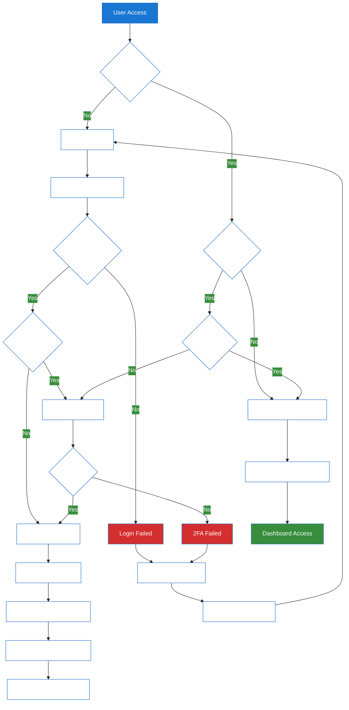

# 1. Chinook Authentication Flow Guide

**Refactored from:** `.ai/guides/chinook/110-authentication-flow.md` on 2025-07-11

## 1.1 Table of Contents

- [1.2 Overview](#12-overview)
- [1.3 Authentication Architecture](#13-authentication-architecture)
- [1.4 Role-Based Access Control](#14-role-based-access-control)
- [1.5 Authentication Flow Diagrams](#15-authentication-flow-diagrams)
- [1.6 Implementation Details](#16-implementation-details)
- [1.7 Security Considerations](#17-security-considerations)
- [1.8 API Authentication](#18-api-authentication)
- [1.9 Testing Authentication](#19-testing-authentication)

## 1.2 Overview

This guide details the comprehensive authentication and authorization system for the Chinook application, implementing enterprise-grade security with role-based access control (RBAC), multi-factor authentication, and API security using Laravel 12 and Filament 4, with seamless integration of the aliziodev/laravel-taxonomy package for user categorization and access control.

### 1.2.1 Authentication Features

**Core Authentication Features:**
- **Multi-Provider Authentication**: Web, API, and admin panel
- **Role-Based Access Control**: 7-tier hierarchical role system
- **Permission-Based Authorization**: Granular permission management
- **Session Management**: Secure session handling with Redis
- **API Authentication**: Laravel Sanctum with token management
- **Two-Factor Authentication**: TOTP-based 2FA support
- **Taxonomy Integration**: User categorization via aliziodev/laravel-taxonomy

### 1.2.2 Security Standards

- **OWASP Compliance**: Following OWASP security guidelines
- **Laravel Security**: Built-in CSRF, XSS, and SQL injection protection
- **Password Security**: Bcrypt hashing with configurable rounds
- **Rate Limiting**: Throttling for login attempts and API calls
- **Audit Logging**: Complete authentication event tracking
- **Taxonomy Security**: Secure taxonomy-based access control

## 1.3 Authentication Architecture

### 1.3.1 Authentication Guards

```php
// config/auth.php
'guards' => [
    'web' => [
        'driver' => 'session',
        'provider' => 'users',
    ],
    'api' => [
        'driver' => 'sanctum',
        'provider' => 'users',
    ],
    'filament' => [
        'driver' => 'session',
        'provider' => 'users',
    ],
],
```

### 1.3.2 User Providers

```php
'providers' => [
    'users' => [
        'driver' => 'eloquent',
        'model' => App\Models\User::class,
    ],
    'chinook_employees' => [
        'driver' => 'eloquent',
        'model' => App\Models\Employee::class,
    ],
],
```

### 1.3.3 Authentication Middleware Stack

```php
// Middleware pipeline
'web' => [
    \App\Http\Middleware\EncryptCookies::class,
    \Illuminate\Cookie\Middleware\AddQueuedCookiesToResponse::class,
    \Illuminate\Session\Middleware\StartSession::class,
    \Illuminate\View\Middleware\ShareErrorsFromSession::class,
    \App\Http\Middleware\VerifyCsrfToken::class,
    \Illuminate\Routing\Middleware\SubstituteBindings::class,
    \App\Http\Middleware\HandleInertiaRequests::class,
    \App\Http\Middleware\TwoFactorAuthentication::class,
    \App\Http\Middleware\TaxonomyAccessControl::class,
],
```

## 1.4 Role-Based Access Control

### 1.4.1 Hierarchical Role System

```php
// Role hierarchy (highest to lowest privilege)
enum UserRole: string
{
    case SUPER_ADMIN = 'Super Admin';
    case ADMIN = 'Admin';
    case MANAGER = 'Manager';
    case EDITOR = 'Editor';
    case CUSTOMER_SERVICE = 'Customer Service';
    case USER = 'User';
    case GUEST = 'Guest';
    
    public function getLevel(): int
    {
        return match($this) {
            self::SUPER_ADMIN => 7,
            self::ADMIN => 6,
            self::MANAGER => 5,
            self::EDITOR => 4,
            self::CUSTOMER_SERVICE => 3,
            self::USER => 2,
            self::GUEST => 1,
        };
    }
    
    public function canAccessLevel(int $requiredLevel): bool
    {
        return $this->getLevel() >= $requiredLevel;
    }
}
```

### 1.4.2 Permission System with Taxonomy Integration

```php
// Permission categories using taxonomy system
enum PermissionCategory: string
{
    case CHINOOK_CATALOG = 'chinook-catalog';
    case USER_MANAGEMENT = 'user-management';
    case SALES_ANALYTICS = 'sales-analytics';
    case SYSTEM_ADMIN = 'system-admin';
    case CONTENT_MODERATION = 'content-moderation';
    case TAXONOMY_MANAGEMENT = 'taxonomy-management';
}

// Permission model with taxonomy support
use Spatie\Permission\Models\Permission as SpatiePermission;

class Permission extends SpatiePermission
{
    protected function casts(): array
    {
        return [
            'category' => PermissionCategory::class,
            'is_active' => 'boolean',
            'created_at' => 'datetime',
            'updated_at' => 'datetime',
        ];
    }
    
    // Permission examples:
    // chinook-catalog.artists.view
    // chinook-catalog.artists.create
    // chinook-catalog.artists.update
    // chinook-catalog.artists.delete
    // taxonomy-management.terms.assign
    // user-management.roles.assign
    // sales-analytics.reports.view
}
```

### 1.4.3 Authorization Policies with Taxonomy

```php
// Artist Policy with taxonomy-based access
class ArtistPolicy
{
    public function viewAny(User $user): bool
    {
        return $user->hasPermissionTo('chinook-catalog.artists.view');
    }
    
    public function view(User $user, Artist $artist): bool
    {
        return $user->hasPermissionTo('chinook-catalog.artists.view') ||
               $user->id === $artist->created_by ||
               $this->hasGenreAccess($user, $artist);
    }
    
    public function create(User $user): bool
    {
        return $user->hasPermissionTo('chinook-catalog.artists.create');
    }
    
    public function update(User $user, Artist $artist): bool
    {
        return $user->hasPermissionTo('chinook-catalog.artists.update') ||
               ($user->hasPermissionTo('chinook-catalog.artists.update-own') && 
                $user->id === $artist->created_by) ||
               $this->hasGenreAccess($user, $artist);
    }
    
    public function delete(User $user, Artist $artist): bool
    {
        return $user->hasPermissionTo('chinook-catalog.artists.delete') &&
               !$artist->albums()->exists() && // Prevent deletion if has albums
               $this->hasGenreAccess($user, $artist);
    }

    private function hasGenreAccess(User $user, Artist $artist): bool
    {
        // Check if user has access to artist's genres via taxonomy
        $userGenres = $user->getTermsByTaxonomy('User Access Genres');
        $artistGenres = $artist->getTermsByTaxonomy('Genres');
        
        return $userGenres->intersect($artistGenres)->isNotEmpty();
    }
}
```

## 1.5 Authentication Flow Diagrams

### 1.5.1 Web Authentication Flow with Taxonomy



### 1.5.2 API Authentication Flow with Taxonomy


## 1.6 Implementation Details

### 1.6.1 User Model with Authentication and Taxonomy

```php
<?php

namespace App\Models;

use Illuminate\Database\Eloquent\Factories\HasFactory;
use Illuminate\Foundation\Auth\User as Authenticatable;
use Illuminate\Notifications\Notifiable;
use Laravel\Sanctum\HasApiTokens;
use Spatie\Permission\Traits\HasRoles;
use Filament\Models\Contracts\FilamentUser;
use Filament\Panel;
use Aliziodev\LaravelTaxonomy\Traits\HasTaxonomies;
use Illuminate\Database\Eloquent\SoftDeletes;

class User extends Authenticatable implements FilamentUser
{
    use HasApiTokens, HasFactory, Notifiable, HasRoles;
    use HasTaxonomies, SoftDeletes;

    protected $fillable = [
        'name', 'email', 'password', 'two_factor_enabled',
        'two_factor_secret', 'last_login_at'
    ];

    protected $hidden = [
        'password', 'remember_token', 'two_factor_secret'
    ];

    protected function casts(): array
    {
        return [
            'email_verified_at' => 'datetime',
            'password' => 'hashed',
            'two_factor_enabled' => 'boolean',
            'last_login_at' => 'datetime',
            'created_at' => 'datetime',
            'updated_at' => 'datetime',
            'deleted_at' => 'datetime',
        ];
    }

    public function canAccessPanel(Panel $panel): bool
    {
        return $this->hasRole(['Super Admin', 'Admin', 'Manager', 'Editor']);
    }

    public function getFilamentAvatarUrl(): ?string
    {
        return $this->avatar_url ?? "https://ui-avatars.com/api/?name={$this->name}";
    }

    public function enable2FA(): void
    {
        $this->update([
            'two_factor_secret' => encrypt(Google2FA::generateSecretKey()),
            'two_factor_enabled' => true,
        ]);
    }

    public function verify2FA(string $code): bool
    {
        $secret = decrypt($this->two_factor_secret);
        return Google2FA::verifyKey($secret, $code);
    }

    public function getAccessibleGenres(): Collection
    {
        return $this->getTermsByTaxonomy('User Access Genres');
    }

    public function hasGenreAccess(string $genreName): bool
    {
        return $this->getAccessibleGenres()->contains('name', $genreName);
    }
}
```

### 1.6.2 Authentication Controllers with Taxonomy

```php
// Web Authentication Controller
class AuthController extends Controller
{
    public function login(LoginRequest $request): RedirectResponse
    {
        $credentials = $request->validated();

        if (Auth::attempt($credentials, $request->boolean('remember'))) {
            $request->session()->regenerate();

            $user = Auth::user();
            $user->update(['last_login_at' => now()]);

            // Load user taxonomy access for session
            $this->loadUserTaxonomyAccess($user);

            if ($user->two_factor_enabled) {
                return redirect()->route('2fa.challenge');
            }

            return redirect()->intended(route('dashboard'));
        }

        RateLimiter::hit($this->throttleKey($request));

        return back()->withErrors([
            'email' => 'The provided credentials do not match our records.',
        ])->onlyInput('email');
    }

    private function loadUserTaxonomyAccess(User $user): void
    {
        $accessibleGenres = $user->getAccessibleGenres();
        session(['user_accessible_genres' => $accessibleGenres->pluck('id')->toArray()]);
    }

    public function logout(Request $request): RedirectResponse
    {
        Auth::logout();
        $request->session()->invalidate();
        $request->session()->regenerateToken();

        return redirect('/');
    }
}

// API Authentication Controller
class ApiAuthController extends Controller
{
    public function login(ApiLoginRequest $request): JsonResponse
    {
        $credentials = $request->validated();

        if (!Auth::attempt($credentials)) {
            return response()->json([
                'message' => 'Invalid credentials'
            ], 401);
        }

        $user = Auth::user();

        // Create token with taxonomy-based abilities
        $abilities = $this->getUserAbilities($user);
        $token = $user->createToken('api-token', $abilities, now()->addDays(30));

        return response()->json([
            'token' => $token->plainTextToken,
            'user' => new UserResource($user),
            'abilities' => $abilities,
            'accessible_genres' => $user->getAccessibleGenres(),
            'expires_at' => $token->accessToken->expires_at,
        ]);
    }

    private function getUserAbilities(User $user): array
    {
        $abilities = ['*']; // Default abilities

        // Add taxonomy-specific abilities based on user's genre access
        $accessibleGenres = $user->getAccessibleGenres();
        foreach ($accessibleGenres as $genre) {
            $abilities[] = "genre:{$genre->slug}";
        }

        return $abilities;
    }

    public function logout(Request $request): JsonResponse
    {
        $request->user()->currentAccessToken()->delete();

        return response()->json(['message' => 'Logged out successfully']);
    }
}
```

### 1.6.3 Two-Factor Authentication with Taxonomy

```php
class TwoFactorController extends Controller
{
    public function challenge(): View
    {
        return view('auth.2fa-challenge');
    }

    public function verify(TwoFactorRequest $request): RedirectResponse
    {
        $user = Auth::user();

        if (!$user->verify2FA($request->code)) {
            return back()->withErrors(['code' => 'Invalid 2FA code']);
        }

        session(['2fa_verified' => true]);

        // Load taxonomy access after 2FA verification
        $this->loadUserTaxonomyAccess($user);

        return redirect()->intended(route('dashboard'));
    }

    private function loadUserTaxonomyAccess(User $user): void
    {
        $accessibleGenres = $user->getAccessibleGenres();
        session(['user_accessible_genres' => $accessibleGenres->pluck('id')->toArray()]);
    }

    public function setup(): View
    {
        $user = Auth::user();
        $qrCode = Google2FA::getQRCodeUrl(
            config('app.name'),
            $user->email,
            decrypt($user->two_factor_secret)
        );

        return view('auth.2fa-setup', compact('qrCode'));
    }
}
```

## 1.7 Security Considerations

### 1.7.1 Password Security

```php
// Password validation rules
class PasswordRules
{
    public static function rules(): array
    {
        return [
            'required',
            'string',
            'min:12',
            'regex:/^(?=.*[a-z])(?=.*[A-Z])(?=.*\d)(?=.*[@$!%*?&])[A-Za-z\d@$!%*?&]/',
            'confirmed',
        ];
    }
}

// Password hashing configuration
'bcrypt' => [
    'rounds' => env('BCRYPT_ROUNDS', 12),
],
```

### 1.7.2 Rate Limiting with Taxonomy Awareness

```php
// Login rate limiting
RateLimiter::for('login', function (Request $request) {
    $email = (string) $request->email;

    return Limit::perMinute(5)->by($email.$request->ip())
                ->response(function (Request $request, array $headers) {
                    return response('Too many login attempts.', 429, $headers);
                });
});

// API rate limiting with taxonomy-based limits
RateLimiter::for('api', function (Request $request) {
    if ($request->user()) {
        $baseLimit = 100;

        // Increase limit for users with broader genre access
        $genreCount = $request->user()->getAccessibleGenres()->count();
        $adjustedLimit = $baseLimit + ($genreCount * 10);

        return Limit::perMinute($adjustedLimit)->by($request->user()->id);
    }

    return Limit::perMinute(20)->by($request->ip());
});
```

### 1.7.3 Session Security

```php
// Session configuration
'lifetime' => env('SESSION_LIFETIME', 120),
'expire_on_close' => true,
'encrypt' => true,
'http_only' => true,
'same_site' => 'strict',
'secure' => env('SESSION_SECURE_COOKIE', true),
```

## 1.8 API Authentication

### 1.8.1 Sanctum Configuration with Taxonomy

```php
// Sanctum middleware
'api' => [
    \Laravel\Sanctum\Http\Middleware\EnsureFrontendRequestsAreStateful::class,
    'throttle:api',
    \Illuminate\Routing\Middleware\SubstituteBindings::class,
    \App\Http\Middleware\TaxonomyApiAccess::class,
],

// Token abilities with taxonomy scope
$token = $user->createToken('api-token', [
    'chinook-catalog:read',
    'chinook-catalog:write',
    'user-profile:read',
    'user-profile:write',
    'genre:rock',
    'genre:jazz',
    'genre:classical',
]);
```

### 1.8.2 API Resource Protection with Taxonomy

```php
// Protected API routes with taxonomy filtering
Route::middleware(['auth:sanctum', 'ability:chinook-catalog:read'])->group(function () {
    Route::get('/chinook/artists', [ArtistController::class, 'index']);
    Route::get('/chinook/albums', [AlbumController::class, 'index']);
    Route::get('/chinook/tracks', [TrackController::class, 'index']);
});

Route::middleware(['auth:sanctum', 'ability:chinook-catalog:write'])->group(function () {
    Route::post('/chinook/artists', [ArtistController::class, 'store']);
    Route::put('/chinook/artists/{artist}', [ArtistController::class, 'update']);
    Route::delete('/chinook/artists/{artist}', [ArtistController::class, 'destroy']);
});

// Taxonomy-specific routes
Route::middleware(['auth:sanctum', 'ability:genre:rock'])->group(function () {
    Route::get('/chinook/artists/rock', [ArtistController::class, 'rockArtists']);
});
```

## 1.9 Testing Authentication

### 1.9.1 Authentication Tests with Taxonomy

```php
// Web authentication tests
test('user can login with valid credentials and load taxonomy access', function () {
    $user = User::factory()->create([
        'password' => Hash::make('password123'),
    ]);

    // Assign genre access
    $taxonomy = Taxonomy::factory()->create(['name' => 'User Access Genres']);
    $rockTerm = Term::factory()->create(['taxonomy_id' => $taxonomy->id, 'name' => 'Rock']);
    $user->attachTerm($rockTerm);

    $response = $this->post('/login', [
        'email' => $user->email,
        'password' => 'password123',
    ]);

    $response->assertRedirect('/dashboard');
    $this->assertAuthenticatedAs($user);
    expect(session('user_accessible_genres'))->toContain($rockTerm->id);
});

test('user cannot login with invalid credentials', function () {
    $user = User::factory()->create();

    $response = $this->post('/login', [
        'email' => $user->email,
        'password' => 'wrong-password',
    ]);

    $response->assertSessionHasErrors('email');
    $this->assertGuest();
});

// API authentication tests with taxonomy
test('api login returns token with taxonomy abilities', function () {
    $user = User::factory()->create([
        'password' => Hash::make('password123'),
    ]);

    // Assign genre access
    $taxonomy = Taxonomy::factory()->create(['name' => 'User Access Genres']);
    $rockTerm = Term::factory()->create(['taxonomy_id' => $taxonomy->id, 'name' => 'Rock']);
    $user->attachTerm($rockTerm);

    $response = $this->postJson('/api/login', [
        'email' => $user->email,
        'password' => 'password123',
    ]);

    $response->assertStatus(200)
             ->assertJsonStructure(['token', 'user', 'abilities', 'accessible_genres', 'expires_at']);

    expect($response->json('abilities'))->toContain('genre:rock');
    expect($response->json('accessible_genres'))->toHaveCount(1);
});
```

### 1.9.2 Authorization Tests with Taxonomy

```php
test('user with genre permission can access filtered resource', function () {
    $user = User::factory()->create();
    $user->givePermissionTo('chinook-catalog.artists.view');

    // Assign rock genre access
    $taxonomy = Taxonomy::factory()->create(['name' => 'User Access Genres']);
    $rockTerm = Term::factory()->create(['taxonomy_id' => $taxonomy->id, 'name' => 'Rock']);
    $user->attachTerm($rockTerm);

    $response = $this->actingAs($user)->get('/chinook/artists?genre=rock');

    $response->assertStatus(200);
});

test('user without genre permission cannot access filtered resource', function () {
    $user = User::factory()->create();
    $user->givePermissionTo('chinook-catalog.artists.view');

    // No genre access assigned

    $response = $this->actingAs($user)->get('/chinook/artists?genre=rock');

    $response->assertStatus(403);
});

test('taxonomy-based api token restricts access correctly', function () {
    $user = User::factory()->create();
    $token = $user->createToken('test-token', ['chinook-catalog:read', 'genre:rock']);

    // Can access rock artists
    $response = $this->withToken($token->plainTextToken)
                     ->getJson('/api/chinook/artists/rock');
    $response->assertStatus(200);

    // Cannot access jazz artists (no genre:jazz ability)
    $response = $this->withToken($token->plainTextToken)
                     ->getJson('/api/chinook/artists/jazz');
    $response->assertStatus(403);
});
```

---

**Next**: [Laravel Query Builder Guide](120-laravel-query-builder-guide.md) | **Previous**: [Resource Testing Guide](100-resource-testing.md)

---

*This guide demonstrates comprehensive authentication and authorization patterns for the Chinook system using Laravel 12, Filament 4, and the aliziodev/laravel-taxonomy package for advanced access control.*

[⬆️ Back to Top](#1-chinook-authentication-flow-guide)
