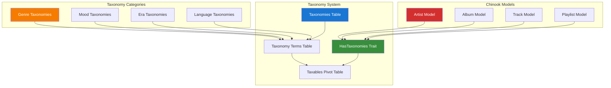

# 1. ⚠️ DEPRECATED: Spatie Tags Implementation Guide

> **Refactored from:** `.ai/guides/chinook/packages/100-spatie-tags-guide.md` on 2025-07-11  
> **Focus:** Enhanced deprecation notice with comprehensive greenfield implementation guidance

> **🚨 IMPORTANT NOTICE - DEPRECATED PACKAGE**
>
> This guide has been **DEPRECATED** as of 2025-07-10. The Chinook project has adopted a **single taxonomy system** approach using `aliziodev/laravel-taxonomy` package instead of `spatie/laravel-tags`.
>
> **✅ RECOMMENDED ALTERNATIVE:** [Aliziodev Laravel Taxonomy Guide](110-aliziodev-laravel-taxonomy-guide.md)

## 1.1. Table of Contents

- [1.2. Migration Notice](#12-migration-notice)
    - [1.2.1. Why This Change?](#121-why-this-change)
    - [1.2.2. Migration Path](#122-migration-path)
- [1.3. New Taxonomy Architecture](#13-new-taxonomy-architecture)
    - [1.3.1. System Overview](#131-system-overview)
- [1.4. Greenfield Implementation Guide](#14-greenfield-implementation-guide)
    - [1.4.1. Installation](#141-installation)
- [2. Complete Migration Example](#2-complete-migration-example)
    - [2.1. Before (spatie/laravel-tags)](#21-before-spatielaravel-tags)
- [3. Migration Support](#3-migration-support)
    - [3.1. Documentation Resources](#31-documentation-resources)

## 1.2. Migration Notice

### 1.2.1. Why This Change?

The Chinook project stakeholders have approved a **greenfield single taxonomy system** implementation that provides:

- **Unified Categorization**: Single taxonomy table for all categorization needs
- **Type-Based Organization**: Genre, mood, style, era, instrument taxonomies
- **Genre Preservation**: Genre compatibility layer for data export/import
- **Performance Optimization**: Streamlined queries without dual system overhead
- **Consistency**: Eliminates confusion between multiple categorization approaches
- **Laravel 12 Compatibility**: Modern syntax patterns and performance optimizations
- **WCAG 2.1 AA Compliance**: Accessible taxonomy management interfaces

### 1.2.2. Migration Path

If you were using `spatie/laravel-tags` in your Chinook implementation, please follow these steps:

1. **Review the New System**: Read the [Aliziodev Laravel Taxonomy Guide](110-aliziodev-laravel-taxonomy-guide.md)
2. **Update Package Dependencies**: Replace `spatie/laravel-tags` with `aliziodev/laravel-taxonomy`
3. **Update Model Implementations**: Remove `HasTags` trait and use `HasTaxonomy` instead
4. **Migrate Data**: Use the taxonomy migration tools to transfer existing tag data
5. **Update Queries**: Replace tag-based queries with taxonomy equivalents
6. **Test Thoroughly**: Validate all categorization functionality
7. **Performance Optimization**: Implement taxonomy caching strategies

### 1.2.3. Package Replacement Mapping

| **Old (spatie/laravel-tags)** | **New (aliziodev/laravel-taxonomy)** | **Notes** |
|--------------------------------|---------------------------------------|-----------|
| `composer require spatie/laravel-tags` | `composer require aliziodev/laravel-taxonomy` | Package installation |
| `use Spatie\Tags\HasTags;` | `use Aliziodev\LaravelTaxonomy\Traits\HasTaxonomy;` | Trait import |
| `use HasTags;` | `use HasTaxonomy;` | Trait usage in model |
| `$model->attachTag('rock')` | `$model->taxonomies()->attach($taxonomyId)` | Single taxonomy assignment |
| `$model->attachTags(['rock', 'pop'])` | `$model->taxonomies()->attach([$taxonomyIds])` | Multiple taxonomy assignment |
| `$model->tags()` | `$model->taxonomies()` | Relationship access |
| `$model->withAnyTags(['rock'])` | `$model->whereHas('taxonomies.terms', fn($q) => $q->whereIn('slug', ['rock']))` | Query filtering |
| `$model->withAllTags(['rock', 'pop'])` | `$model->whereHas('taxonomies.terms', fn($q) => $q->whereIn('slug', ['rock', 'pop']), '=', 2)` | Multiple tag filtering |

## 1.3. New Taxonomy Architecture

### 1.3.1. System Overview



### 1.3.2. Architecture Benefits

**Performance Improvements:**
- **Single System**: Eliminates dual categorization overhead
- **Optimized Queries**: Hierarchical taxonomy structure with efficient indexing
- **Caching Strategy**: Built-in taxonomy hierarchy caching

**Maintainability:**
- **Single Source of Truth**: One system for all categorization needs
- **Type Safety**: Laravel 12 modern casting with proper type definitions
- **Consistent API**: Unified interface across all Chinook models

**Scalability:**
- **Hierarchical Structure**: Supports complex taxonomy hierarchies
- **Polymorphic Relationships**: Flexible assignment to any model
- **Enterprise Ready**: Designed for large-scale music database requirements

## 1.4. Greenfield Implementation Guide

### 1.4.1. Installation

```bash
# Remove old package (if installed)
composer remove spatie/laravel-tags

# Install new taxonomy package
composer require aliziodev/laravel-taxonomy

# Publish and run migrations
php artisan vendor:publish --provider="Aliziodev\LaravelTaxonomy\TaxonomyServiceProvider"
php artisan migrate

# Optional: Install taxonomy management tools
php artisan taxonomy:install
```

### 1.4.2. Model Updates

Replace the old HasTags trait with HasTaxonomy:

```php
<?php
// OLD: spatie/laravel-tags approach (❌ DEPRECATED)
use Spatie\Tags\HasTags;

class Artist extends Model
{
    use HasTags; // ❌ Remove this

    protected function casts(): array
    {
        return [
            'created_at' => 'datetime',
            'updated_at' => 'datetime',
        ];
    }
}

// NEW: aliziodev/laravel-taxonomy approach (✅ RECOMMENDED)
use Aliziodev\LaravelTaxonomy\Traits\HasTaxonomy;

class Artist extends Model
{
    use HasTaxonomy; // ✅ Use this instead

    protected function casts(): array
    {
        return [
            'created_at' => 'datetime',
            'updated_at' => 'datetime',
        ];
    }

    /**
     * Get all genre taxonomies for this artist
     */
    public function getGenreTaxonomiesAttribute()
    {
        return $this->taxonomies()
            ->whereHas('taxonomy', fn($q) => $q->where('slug', 'music-genres'))
            ->get();
    }
}
```

### 1.4.3. Method Conversions

Replace old tag methods with taxonomy equivalents:

```php
<?php
// OLD: spatie/laravel-tags methods (❌ DEPRECATED)
$artist->attachTag('rock');
$artist->attachTags(['rock', 'alternative']);
$artist->detachTag('rock');
$artist->syncTags(['rock', 'pop']);
$artist->tags();
$artist->withAnyTags(['rock']);
$artist->withAllTags(['rock', 'alternative']);

// NEW: aliziodev/laravel-taxonomy methods (✅ RECOMMENDED)
$genreTaxonomy = TaxonomyTerm::where('slug', 'rock')->first();
$artist->taxonomies()->attach($genreTaxonomy->id);
$artist->taxonomies()->attach([$rockId, $alternativeId]);
$artist->taxonomies()->detach($genreTaxonomy->id);
$artist->taxonomies()->sync([$rockId, $popId]);
$artist->taxonomies();
$artist->whereHas('taxonomies.terms', fn($q) => $q->where('slug', 'rock'));
$artist->whereHas('taxonomies.terms', fn($q) => $q->whereIn('slug', ['rock', 'alternative']), '=', 2);
```

## 2. Complete Migration Example

### 2.1. Before (spatie/laravel-tags)

```php
<?php
namespace App\Models\Chinook;

use Illuminate\Database\Eloquent\Model;
use Spatie\Tags\HasTags; // ❌ DEPRECATED

class Artist extends Model
{
    use HasTags; // ❌ DEPRECATED

    protected $fillable = [
        'name', 'bio', 'website', 'country'
    ];

    /**
     * Add genre tags to artist
     */
    public function addGenreTags(array $genres): self
    {
        $this->attachTags($genres, 'genre'); // ❌ DEPRECATED
        return $this;
    }

    /**
     * Get all genre tags
     */
    public function getGenreTagsAttribute()
    {
        return $this->tagsWithType('genre'); // ❌ DEPRECATED
    }

    /**
     * Scope for artists with specific genres
     */
    public function scopeWithGenres($query, array $genres)
    {
        return $query->withAnyTags($genres, 'genre'); // ❌ DEPRECATED
    }
}
```

### 2.2. After (aliziodev/laravel-taxonomy)

```php
<?php
namespace App\Models\Chinook;

use Illuminate\Database\Eloquent\Model;
use Aliziodev\LaravelTaxonomy\Traits\HasTaxonomy; // ✅ RECOMMENDED

class Artist extends Model
{
    use HasTaxonomy; // ✅ RECOMMENDED

    protected $fillable = [
        'name', 'bio', 'website', 'country'
    ];

    protected function casts(): array
    {
        return [
            'created_at' => 'datetime',
            'updated_at' => 'datetime',
        ];
    }

    /**
     * Add genre taxonomies to artist
     */
    public function addGenreTaxonomies(array $genreIds): self
    {
        $this->taxonomies()->attach($genreIds); // ✅ RECOMMENDED
        return $this;
    }

    /**
     * Get all genre taxonomies
     */
    public function getGenreTaxonomiesAttribute()
    {
        return $this->taxonomies()
            ->whereHas('taxonomy', fn($q) => $q->where('slug', 'music-genres'))
            ->with('terms')
            ->get(); // ✅ RECOMMENDED
    }

    /**
     * Scope for artists with specific genres
     */
    public function scopeWithGenres($query, array $genreSlugs)
    {
        return $query->whereHas('taxonomies.terms', function ($q) use ($genreSlugs) {
            $q->whereIn('slug', $genreSlugs);
        }); // ✅ RECOMMENDED
    }
}
```

## 3. Migration Support

### 3.1. Documentation Resources

**Primary Documentation:**
- **[Aliziodev Laravel Taxonomy Guide](110-aliziodev-laravel-taxonomy-guide.md)** - Complete implementation guide
- **[Chinook Models Guide](../010-chinook-models-guide.md)** - Updated model implementations with taxonomy integration
- **[Chinook Seeders Guide](../040-chinook-seeders-guide.md)** - Data seeding with taxonomy mapping

**Performance & Optimization:**
- **[Performance Optimization Guide](../performance/000-performance-index.md)** - Single taxonomy performance benefits
- **[Trait Testing Guide](../testing/070-trait-testing-guide.md)** - Testing taxonomy relationships and HasTaxonomies trait

### 3.2. Migration Checklist

**Pre-Migration Preparation:**
- [ ] **Backup Data**: Create complete database backup before migration
- [ ] **Review Documentation**: Read the complete [taxonomy guide](110-aliziodev-laravel-taxonomy-guide.md)
- [ ] **Test Environment**: Set up development environment for testing
- [ ] **Dependency Analysis**: Identify all code using spatie/laravel-tags

**Package Migration:**
- [ ] **Install New Package**: `composer require aliziodev/laravel-taxonomy`
- [ ] **Remove Old Package**: `composer remove spatie/laravel-tags`
- [ ] **Publish Migrations**: `php artisan vendor:publish --provider="Aliziodev\LaravelTaxonomy\TaxonomyServiceProvider"`
- [ ] **Run Migrations**: `php artisan migrate`

**Code Updates:**
- [ ] **Update Model Imports**: Replace `HasTags` with `HasTaxonomies`
- [ ] **Update Trait Usage**: Change trait usage in all models
- [ ] **Convert Method Calls**: Update all tag-related method calls
- [ ] **Update Queries**: Replace tag-based queries with taxonomy equivalents
- [ ] **Update Tests**: Modify tests to use new taxonomy methods

**Data Migration:**
- [ ] **Create Migration Script**: Build data migration from tags to taxonomies
- [ ] **Map Tag Types**: Convert tag types to taxonomy categories
- [ ] **Preserve Relationships**: Maintain model-tag relationships as model-taxonomy
- [ ] **Validate Data Integrity**: Ensure all data migrated correctly

**Post-Migration Validation:**
- [ ] **Test All Functionality**: Verify all categorization features work
- [ ] **Performance Testing**: Validate query performance improvements
- [ ] **User Acceptance Testing**: Ensure UI/UX remains functional
- [ ] **Documentation Updates**: Update any custom documentation

### 3.3. Migration Support Resources

**Need Help with Migration?**

If you encounter issues during the migration from `spatie/laravel-tags` to `aliziodev/laravel-taxonomy`:

1. **Check the Documentation**: Review the [complete taxonomy guide](110-aliziodev-laravel-taxonomy-guide.md)
2. **Test Thoroughly**: Always test migrations in development environment first
3. **Follow the Mapping**: Use the conversion table provided above
4. **Validate Performance**: Monitor query performance before and after migration

**Key Benefits of the New System:**

- **Single Source of Truth**: One taxonomy system for all categorization
- **Better Performance**: Optimized queries without dual system overhead
- **Genre Preservation**: Maintains compatibility with existing Chinook genre data
- **Type Safety**: Laravel 12 modern syntax with proper type casting
- **Scalability**: Designed for enterprise-level music database requirements
- **WCAG 2.1 AA Compliance**: Accessible taxonomy management interfaces

**Common Migration Patterns:**

```php
// Pattern 1: Simple tag attachment
// OLD: $model->attachTag('rock')
// NEW: $model->taxonomies()->attach($taxonomyTermId)

// Pattern 2: Multiple tag attachment
// OLD: $model->attachTags(['rock', 'pop'])
// NEW: $model->taxonomies()->attach([$rockId, $popId])

// Pattern 3: Tag-based queries
// OLD: Model::withAnyTags(['rock'])
// NEW: Model::whereHas('taxonomies.terms', fn($q) => $q->where('slug', 'rock'))

// Pattern 4: Tag relationship access
// OLD: $model->tags
// NEW: $model->taxonomies()->with('terms')->get()
```

---

## Navigation

**Previous:** [Laravel WorkOS Guide](090-laravel-workos-guide.md) | **Next:** [Aliziodev Laravel Taxonomy Guide](110-aliziodev-laravel-taxonomy-guide.md) | **Index:** [Packages Index](000-packages-index.md)

---

**Documentation Standards**: This document follows WCAG 2.1 AA accessibility guidelines and uses Laravel 12 modern syntax patterns.

[⬆️ Back to Top](#1-deprecated-spatie-tags-implementation-guide)
