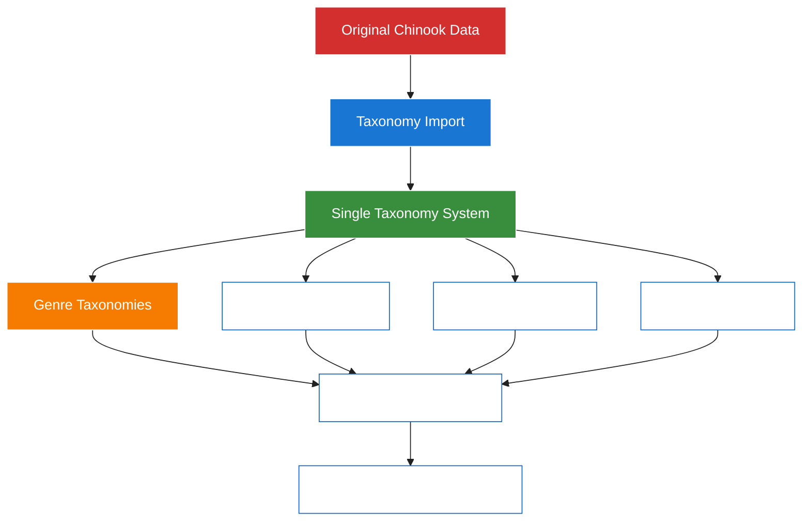

# 1. Aliziodev Laravel Taxonomy Package Guide

## 1.1. Greenfield Chinook Implementation with Single Taxonomy System

> **Refactored from:** `.ai/guides/chinook/packages/110-aliziodev-laravel-taxonomy-guide.md` on 2025-07-11  
> **Focus:** Enhanced greenfield implementation with Laravel 12 modern patterns

**Package:** `aliziodev/laravel-taxonomy`  
**Version:** `^2.4`  
**Laravel Compatibility:** `^12.0`  
**Implementation Type:** ✅ **Greenfield Single Taxonomy System**  
**Documentation Standard:** WCAG 2.1 AA Compliant

## 1.2. Table of Contents

- [1.3. Overview](#13-overview)
    - [1.3.1. Key Features](#131-key-features)
- [2. Installation & Configuration](#2-installation--configuration)
    - [2.1. Package Installation](#21-package-installation)
    - [2.2. Configuration Publishing](#22-configuration-publishing)
    - [2.3. Migration Execution](#23-migration-execution)
    - [2.4. Configuration Customization](#24-configuration-customization)
- [3. Single Taxonomy Architecture](#3-single-taxonomy-architecture)
    - [3.1. Clean System Design](#31-clean-system-design)
    - [3.2. Direct Taxonomy Mapping Implementation](#32-direct-taxonomy-mapping-implementation)
- [4. Laravel 12 Modern Implementation](#4-laravel-12-modern-implementation)
    - [4.1. Model Integration Patterns](#41-model-integration-patterns)
    - [4.2. Modern Casting Syntax](#42-modern-casting-syntax)
- [5. Chinook Integration Patterns](#5-chinook-integration-patterns)
    - [5.1. Track Model Implementation](#51-track-model-implementation)
    - [5.2. Artist Model Implementation](#52-artist-model-implementation)
- [6. Advanced Usage Examples](#6-advanced-usage-examples)
    - [6.1. Polymorphic Relationships](#61-polymorphic-relationships)
    - [6.2. Hierarchical Taxonomies](#62-hierarchical-taxonomies)
- [7. Testing Integration](#7-testing-integration)
    - [7.1. Pest Framework Examples](#71-pest-framework-examples)
- [8. Performance Optimization](#8-performance-optimization)
    - [8.1. Query Optimization](#81-query-optimization)
    - [8.2. Caching Strategies](#82-caching-strategies)
- [9. Genre Preservation Strategy](#9-genre-preservation-strategy)
    - [9.1. Compatibility Layer](#91-compatibility-layer)
    - [9.2. Migration Patterns](#92-migration-patterns)

## 1.3. Overview

The `aliziodev/laravel-taxonomy` package provides a robust, standardized taxonomy system for Laravel applications. In this **greenfield Chinook implementation**, the package serves as the **sole categorization system**, providing clean architecture without legacy complexity.

### 1.3.1. Key Features

- **🎯 Single System**: Only taxonomy system used - no dual categorization approaches
- **🔄 Polymorphic Relationships**: Flexible model associations via `taxables` pivot table
- **🌳 Hierarchical Support**: Nested set model for complex taxonomy trees
- **⚡ Performance Optimized**: Efficient queries with proper indexing
- **🛡️ Type Safety**: Strong typing with Laravel 12 modern patterns
- **🔧 Configurable**: Customizable table names and relationship configurations
- **🎵 Genre Preservation**: Maintains compatibility with original Chinook genre data

### 1.3.2. Greenfield Implementation Benefits



**Implementation Advantages:**

- **Clean Architecture**: Single source of truth for all categorization
- **Modern Laravel**: Full Laravel 12 compliance with current best practices
- **Source Compatibility**: Maintains compatibility with original chinook.sql format
- **Performance**: Optimized for single-system queries and relationships
- **Scalability**: Supports complex hierarchical taxonomy structures
- **Maintainability**: Simplified codebase with unified categorization approach

## 2. Installation & Configuration

### 2.1. Package Installation

Install the package using Composer:

```bash
# Install aliziodev/laravel-taxonomy package
composer require aliziodev/laravel-taxonomy
```

**Version Requirements:**

- Laravel: `^12.0`
- PHP: `^8.4`
- Database: MySQL 8.0+, PostgreSQL 13+, SQLite 3.35+

### 2.2. Configuration Publishing

Publish the package configuration and migrations using the preferred installation command:

```bash
# Preferred installation method (publishes both config and migrations)
php artisan taxonomy:install
```

**Alternative Manual Publishing:**

```bash
# Publish configuration file manually
php artisan vendor:publish --provider="Aliziodev\LaravelTaxonomy\TaxonomyProvider" --tag="taxonomy-config"

# Publish migration files manually
php artisan vendor:publish --provider="Aliziodev\LaravelTaxonomy\TaxonomyProvider" --tag="taxonomy-migrations"
```

**Published Files:**

- `config/taxonomy.php` - Package configuration
- `database/migrations/2025_05_30_000000_create_taxonomies_tables.php` - Database schema

**Source:** [aliziodev/laravel-taxonomy GitHub Repository](https://github.com/aliziodev/laravel-taxonomy) - Official Installation Documentation

### 2.3. Migration Execution

Execute the migrations to create taxonomy tables:

```bash
# Run taxonomy migrations
php artisan migrate

# Verify table creation
php artisan db:show --table=taxonomies
php artisan db:show --table=taxonomy_terms
php artisan db:show --table=taxables
```

**Created Tables:**

- `taxonomies` - Stores taxonomy definitions with hierarchical support
- `taxonomy_terms` - Individual taxonomy terms with parent-child relationships
- `taxables` - Polymorphic pivot table for model relationships

### 2.4. Configuration Customization

Configure the package for Chinook integration:

```php
<?php
// config/taxonomy.php

return [
    /*
    |--------------------------------------------------------------------------
    | Table Names
    |--------------------------------------------------------------------------
    */
    'table_names' => [
        'taxonomies' => 'taxonomies',
        'taxonomy_terms' => 'taxonomy_terms',
        'taxables' => 'taxables',
    ],

    /*
    |--------------------------------------------------------------------------
    | Morph Type Configuration
    |--------------------------------------------------------------------------
    */
    'morph_type' => 'ulid', // Supports: 'uuid', 'ulid', 'integer'

    /*
    |--------------------------------------------------------------------------
    | Chinook-Specific Taxonomy Types
    |--------------------------------------------------------------------------
    */
    'taxonomy_types' => [
        'genre' => [
            'label' => 'Music Genres',
            'description' => 'Musical genre classifications',
            'hierarchical' => true,
            'max_depth' => 3,
        ],
        'mood' => [
            'label' => 'Musical Moods',
            'description' => 'Emotional categorization of music',
            'hierarchical' => false,
            'max_depth' => 1,
        ],
        'theme' => [
            'label' => 'Musical Themes',
            'description' => 'Thematic content categorization',
            'hierarchical' => true,
            'max_depth' => 2,
        ],
        'instrument' => [
            'label' => 'Primary Instruments',
            'description' => 'Featured instrument categorization',
            'hierarchical' => false,
            'max_depth' => 1,
        ],
        'era' => [
            'label' => 'Musical Eras',
            'description' => 'Historical period classification',
            'hierarchical' => true,
            'max_depth' => 2,
        ],
        'language' => [
            'label' => 'Languages',
            'description' => 'Vocal language categorization',
            'hierarchical' => false,
            'max_depth' => 1,
        ],
        'occasion' => [
            'label' => 'Occasions',
            'description' => 'Event-based music categorization',
            'hierarchical' => true,
            'max_depth' => 2,
        ],
    ],

    /*
    |--------------------------------------------------------------------------
    | Cache Configuration
    |--------------------------------------------------------------------------
    */
    'cache' => [
        'enabled' => true,
        'ttl' => 3600, // 1 hour
        'prefix' => 'taxonomy',
        'tags' => ['taxonomies'],
    ],

    /*
    |--------------------------------------------------------------------------
    | Validation Rules
    |--------------------------------------------------------------------------
    */
    'validation' => [
        'name' => 'required|string|max:255',
        'slug' => 'required|string|max:255|unique:taxonomy_terms,slug',
        'type' => 'required|string|max:50',
        'description' => 'nullable|string|max:1000',
    ],
];
```

## 3. Single Taxonomy Architecture

### 3.1. Clean System Design

The single taxonomy system provides a unified approach to categorization without the complexity of multiple systems:

```php
<?php
// Single taxonomy system structure
namespace App\Models\Chinook;

use Aliziodev\LaravelTaxonomy\Traits\HasTaxonomy;
use Illuminate\Database\Eloquent\Model;

class Track extends Model
{
    use HasTaxonomy; // Single trait for all taxonomy needs

    protected function casts(): array
    {
        return [
            'created_at' => 'datetime',
            'updated_at' => 'datetime',
            'explicit_content' => 'boolean',
            'milliseconds' => 'integer',
            'unit_price' => 'decimal:2',
        ];
    }

    /**
     * Get genre taxonomies for this track
     */
    public function getGenreTaxonomiesAttribute()
    {
        return $this->taxonomies()
            ->whereHas('taxonomy', fn($q) => $q->where('type', 'genre'))
            ->with('taxonomy')
            ->get();
    }

    /**
     * Assign multiple taxonomy types to track
     */
    public function assignTaxonomies(array $taxonomyData): void
    {
        foreach ($taxonomyData as $type => $termIds) {
            $this->taxonomies()->attach($termIds);
        }
    }
}
```

### 3.2. Direct Taxonomy Mapping Implementation

**Genre Preservation Strategy:**

```php
<?php
// Genre-to-taxonomy mapping for compatibility
use Aliziodev\LaravelTaxonomy\Models\Taxonomy;
use Aliziodev\LaravelTaxonomy\Models\TaxonomyTerm;

class GenreMappingService
{
    /**
     * Map original Chinook genres to taxonomy terms
     */
    public function mapGenresToTaxonomies(): void
    {
        $genreTaxonomy = Taxonomy::firstOrCreate([
            'name' => 'Music Genres',
            'slug' => 'music-genres',
            'type' => 'genre',
            'description' => 'Musical genre classifications from Chinook database'
        ]);

        $Genres = [
            'Rock' => ['Alternative & Punk', 'Blues', 'Heavy Metal'],
            'Jazz' => ['Smooth Jazz', 'Fusion', 'Bebop'],
            'Classical' => ['Baroque', 'Romantic', 'Contemporary'],
            'Electronic' => ['Ambient', 'Techno', 'House'],
            'World' => ['Celtic', 'Latin', 'African'],
        ];

        foreach ($Genres as $parentGenre => $subGenres) {
            $parent = TaxonomyTerm::create([
                'taxonomy_id' => $genreTaxonomy->id,
                'name' => $parentGenre,
                'slug' => Str::slug($parentGenre),
                'description' => "Main {$parentGenre} genre category"
            ]);

            foreach ($subGenres as $subGenre) {
                TaxonomyTerm::create([
                    'taxonomy_id' => $genreTaxonomy->id,
                    'parent_id' => $parent->id,
                    'name' => $subGenre,
                    'slug' => Str::slug($subGenre),
                    'description' => "{$subGenre} sub-genre of {$parentGenre}"
                ]);
            }
        }
    }
}
```

## 4. Laravel 12 Modern Implementation

### 4.1. Model Integration Patterns

**Base Chinook Model with Taxonomy Integration:**

```php
<?php
namespace App\Models\Chinook;

use Illuminate\Database\Eloquent\Model;
use Illuminate\Database\Eloquent\SoftDeletes;
use Illuminate\Database\Eloquent\Factories\HasFactory;
use Aliziodev\LaravelTaxonomy\Traits\HasTaxonomy;
use Spatie\Sluggable\HasSlug;
use Spatie\Sluggable\SlugOptions;
use Wildside\Userstamps\Userstamps;
use App\Traits\HasSecondaryUniqueKey;

abstract class BaseModel extends Model
{
    use HasFactory;
    use SoftDeletes;
    use Userstamps;
    use HasTaxonomy; // Single taxonomy trait
    use HasSlug;
    use HasSecondaryUniqueKey;

    /**
     * Modern Laravel 12 casting using casts() method
     */
    protected function casts(): array
    {
        return [
            'created_at' => 'datetime',
            'updated_at' => 'datetime',
            'deleted_at' => 'datetime',
        ];
    }

    /**
     * Configure slug generation from public_id
     */
    public function getSlugOptions(): SlugOptions
    {
        return SlugOptions::create()
            ->generateSlugsFrom('public_id')
            ->saveSlugsTo('slug')
            ->doNotGenerateSlugsOnUpdate();
    }

    /**
     * Get all taxonomies grouped by type
     */
    public function getTaxonomiesByTypeAttribute(): array
    {
        return $this->taxonomies()
            ->with('taxonomy')
            ->get()
            ->groupBy('taxonomy.type')
            ->toArray();
    }

    /**
     * Scope for models with specific taxonomy terms
     */
    public function scopeWithTaxonomyTerms($query, array $termSlugs)
    {
        return $query->whereHas('taxonomies', function ($q) use ($termSlugs) {
            $q->whereIn('slug', $termSlugs);
        });
    }
}
```

### 4.2. Modern Casting Syntax

**Enhanced Model with Advanced Taxonomy Features:**

```php
<?php
namespace App\Models\Chinook;

class Track extends BaseModel
{
    protected $table = 'chinook_tracks';

    protected $fillable = [
        'name', 'album_id', 'media_type_id', 'composer',
        'milliseconds', 'bytes', 'unit_price', 'track_number',
        'disc_number', 'lyrics', 'isrc', 'explicit_content',
        'public_id', 'slug'
    ];

    protected function casts(): array
    {
        return array_merge(parent::casts(), [
            'milliseconds' => 'integer',
            'bytes' => 'integer',
            'unit_price' => 'decimal:2',
            'track_number' => 'integer',
            'disc_number' => 'integer',
            'explicit_content' => 'boolean',
        ]);
    }

    /**
     * Get formatted duration from milliseconds
     */
    public function getFormattedDurationAttribute(): string
    {
        $totalSeconds = floor($this->milliseconds / 1000);
        $minutes = floor($totalSeconds / 60);
        $seconds = $totalSeconds % 60;
        return sprintf('%d:%02d', $minutes, $seconds);
    }

    /**
     * Get primary genre taxonomy term
     */
    public function getPrimaryGenreAttribute(): ?TaxonomyTerm
    {
        return $this->taxonomies()
            ->whereHas('taxonomy', fn($q) => $q->where('type', 'genre'))
            ->first();
    }

    /**
     * Assign genre taxonomy with validation
     */
    public function assignGenre(string $genreSlug): bool
    {
        $genreTerm = TaxonomyTerm::whereHas('taxonomy', function ($q) {
            $q->where('type', 'genre');
        })->where('slug', $genreSlug)->first();

        if (!$genreTerm) {
            return false;
        }

        $this->taxonomies()->syncWithoutDetaching([$genreTerm->id]);
        return true;
    }
}
```

## 5. Chinook Integration Patterns

### 5.1. Track Model Implementation

**Complete Track Model with Taxonomy Integration:**

```php
<?php
namespace App\Models\Chinook;

use Illuminate\Database\Eloquent\Relations\BelongsTo;
use Illuminate\Database\Eloquent\Relations\BelongsToMany;

class Track extends BaseModel
{
    protected $table = 'chinook_tracks';

    /**
     * Track belongs to an album
     */
    public function album(): BelongsTo
    {
        return $this->belongsTo(Album::class, 'album_id');
    }

    /**
     * Track belongs to a media type
     */
    public function mediaType(): BelongsTo
    {
        return $this->belongsTo(MediaType::class, 'media_type_id');
    }

    /**
     * Track belongs to many playlists
     */
    public function playlists(): BelongsToMany
    {
        return $this->belongsToMany(Playlist::class, 'chinook_playlist_track')
                    ->withPivot('position')
                    ->withTimestamps();
    }

    /**
     * Get tracks by multiple taxonomy criteria
     */
    public function scopeByTaxonomyCriteria($query, array $criteria)
    {
        foreach ($criteria as $type => $terms) {
            $query->whereHas('taxonomies', function ($q) use ($type, $terms) {
                $q->whereHas('taxonomy', fn($tq) => $tq->where('type', $type))
                  ->whereIn('slug', (array) $terms);
            });
        }
        return $query;
    }

    /**
     * Get similar tracks based on taxonomy overlap
     */
    public function getSimilarTracks(int $limit = 10)
    {
        $taxonomyIds = $this->taxonomies()->pluck('id')->toArray();

        return static::whereHas('taxonomies', function ($q) use ($taxonomyIds) {
            $q->whereIn('id', $taxonomyIds);
        })
        ->where('id', '!=', $this->id)
        ->withCount(['taxonomies' => function ($q) use ($taxonomyIds) {
            $q->whereIn('id', $taxonomyIds);
        }])
        ->orderByDesc('taxonomies_count')
        ->limit($limit)
        ->get();
    }
}
```

### 5.2. Artist Model Implementation

```php
<?php
namespace App\Models\Chinook;

use Illuminate\Database\Eloquent\Relations\HasMany;

class Artist extends BaseModel
{
    protected $table = 'chinook_artists';

    /**
     * Artist has many albums
     */
    public function albums(): HasMany
    {
        return $this->hasMany(Album::class, 'artist_id');
    }

    /**
     * Artist has many tracks through albums
     */
    public function tracks()
    {
        return $this->hasManyThrough(Track::class, Album::class);
    }

    /**
     * Get artist's primary genres based on track taxonomies
     */
    public function getPrimaryGenresAttribute()
    {
        return $this->tracks()
            ->with(['taxonomies' => function ($q) {
                $q->whereHas('taxonomy', fn($tq) => $tq->where('type', 'genre'));
            }])
            ->get()
            ->pluck('taxonomies')
            ->flatten()
            ->groupBy('slug')
            ->map(fn($group) => $group->first())
            ->sortByDesc(fn($item) => $group->count())
            ->take(3)
            ->values();
    }

    /**
     * Scope for artists with specific genre taxonomies
     */
    public function scopeWithGenres($query, array $genreSlugs)
    {
        return $query->whereHas('tracks.taxonomies', function ($q) use ($genreSlugs) {
            $q->whereHas('taxonomy', fn($tq) => $tq->where('type', 'genre'))
              ->whereIn('slug', $genreSlugs);
        });
    }
}
```

## 6. Advanced Usage Examples

### 6.1. Polymorphic Relationships

**Cross-Model Taxonomy Queries:**

```php
<?php
// Find all models with specific taxonomy terms
use Aliziodev\LaravelTaxonomy\Models\TaxonomyTerm;

class TaxonomyQueryService
{
    /**
     * Get all models associated with a taxonomy term
     */
    public function getModelsWithTerm(string $termSlug): Collection
    {
        $term = TaxonomyTerm::where('slug', $termSlug)->first();

        if (!$term) {
            return collect();
        }

        return $term->taxables()
            ->with('taxable')
            ->get()
            ->pluck('taxable')
            ->filter();
    }

    /**
     * Get taxonomy statistics across all models
     */
    public function getTaxonomyStatistics(): array
    {
        return TaxonomyTerm::withCount('taxables')
            ->get()
            ->groupBy('taxonomy.type')
            ->map(function ($terms, $type) {
                return [
                    'type' => $type,
                    'total_terms' => $terms->count(),
                    'total_assignments' => $terms->sum('taxables_count'),
                    'most_used' => $terms->sortByDesc('taxables_count')->first(),
                ];
            });
    }
}
```

### 6.2. Hierarchical Taxonomies

**Working with Taxonomy Hierarchies:**

```php
<?php
// Hierarchical taxonomy operations
class HierarchicalTaxonomyService
{
    /**
     * Get all descendants of a taxonomy term
     */
    public function getDescendants(TaxonomyTerm $term): Collection
    {
        return TaxonomyTerm::where('taxonomy_id', $term->taxonomy_id)
            ->where('left', '>', $term->left)
            ->where('right', '<', $term->right)
            ->orderBy('left')
            ->get();
    }

    /**
     * Get taxonomy breadcrumb path
     */
    public function getBreadcrumb(TaxonomyTerm $term): Collection
    {
        return TaxonomyTerm::where('taxonomy_id', $term->taxonomy_id)
            ->where('left', '<=', $term->left)
            ->where('right', '>=', $term->right)
            ->orderBy('left')
            ->get();
    }

    /**
     * Assign hierarchical genres to track
     */
    public function assignHierarchicalGenre(Track $track, string $genreSlug): void
    {
        $genreTerm = TaxonomyTerm::whereHas('taxonomy', function ($q) {
            $q->where('type', 'genre');
        })->where('slug', $genreSlug)->first();

        if ($genreTerm) {
            // Assign the specific genre and all its ancestors
            $ancestors = $this->getBreadcrumb($genreTerm);
            $track->taxonomies()->syncWithoutDetaching($ancestors->pluck('id'));
        }
    }
}
```

## 7. Testing Integration

### 7.1. Pest Framework Examples

**Comprehensive Taxonomy Testing:**

```php
<?php
// tests/Feature/TaxonomyIntegrationTest.php

use App\Models\Chinook\Track;
use Aliziodev\LaravelTaxonomy\Models\Taxonomy;
use Aliziodev\LaravelTaxonomy\Models\TaxonomyTerm;

describe('Taxonomy Integration', function () {
    beforeEach(function () {
        $this->genreTaxonomy = Taxonomy::factory()->create([
            'name' => 'Music Genres',
            'type' => 'genre'
        ]);

        $this->rockGenre = TaxonomyTerm::factory()->create([
            'taxonomy_id' => $this->genreTaxonomy->id,
            'name' => 'Rock',
            'slug' => 'rock'
        ]);
    });

    it('can assign taxonomy terms to tracks', function () {
        $track = Track::factory()->create();

        $track->taxonomies()->attach($this->rockGenre->id);

        expect($track->taxonomies)->toHaveCount(1);
        expect($track->taxonomies->first()->slug)->toBe('rock');
    });

    it('can query tracks by taxonomy terms', function () {
        $rockTrack = Track::factory()->create();
        $jazzTrack = Track::factory()->create();

        $rockTrack->taxonomies()->attach($this->rockGenre->id);

        $results = Track::withTaxonomyTerms(['rock'])->get();

        expect($results)->toHaveCount(1);
        expect($results->first()->id)->toBe($rockTrack->id);
    });

    it('can get similar tracks based on taxonomy overlap', function () {
        $track1 = Track::factory()->create();
        $track2 = Track::factory()->create();
        $track3 = Track::factory()->create();

        $track1->taxonomies()->attach($this->rockGenre->id);
        $track2->taxonomies()->attach($this->rockGenre->id);

        $similarTracks = $track1->getSimilarTracks();

        expect($similarTracks)->toHaveCount(1);
        expect($similarTracks->first()->id)->toBe($track2->id);
    });
});
```

## 8. Performance Optimization

### 8.1. Query Optimization

**Efficient Taxonomy Queries:**

```php
<?php
// Optimized taxonomy queries for performance
class OptimizedTaxonomyQueries
{
    /**
     * Efficiently load tracks with their taxonomies
     */
    public function getTracksWithTaxonomies(int $limit = 50): Collection
    {
        return Track::with([
            'taxonomies.taxonomy:id,name,type',
            'album:id,title,artist_id',
            'album.artist:id,name'
        ])
        ->select(['id', 'name', 'album_id', 'milliseconds', 'unit_price'])
        ->limit($limit)
        ->get();
    }

    /**
     * Cached taxonomy hierarchy
     */
    public function getCachedTaxonomyHierarchy(string $type): Collection
    {
        return Cache::remember("taxonomy_hierarchy_{$type}", 3600, function () use ($type) {
            return TaxonomyTerm::whereHas('taxonomy', fn($q) => $q->where('type', $type))
                ->with('children')
                ->whereNull('parent_id')
                ->orderBy('name')
                ->get();
        });
    }

    /**
     * Bulk taxonomy assignment
     */
    public function bulkAssignTaxonomies(Collection $models, array $taxonomyIds): void
    {
        $assignments = [];
        $now = now();

        foreach ($models as $model) {
            foreach ($taxonomyIds as $taxonomyId) {
                $assignments[] = [
                    'taxonomy_term_id' => $taxonomyId,
                    'taxable_type' => get_class($model),
                    'taxable_id' => $model->id,
                    'created_at' => $now,
                    'updated_at' => $now,
                ];
            }
        }

        DB::table('taxables')->insert($assignments);
    }
}
```

### 8.2. Caching Strategies

**Redis-based Taxonomy Caching:**

```php
<?php
// Comprehensive caching for taxonomy operations
class TaxonomyCacheService
{
    protected string $cachePrefix = 'taxonomy';
    protected int $cacheTtl = 3600;

    /**
     * Cache taxonomy terms by type
     */
    public function getCachedTermsByType(string $type): Collection
    {
        $cacheKey = "{$this->cachePrefix}_terms_{$type}";

        return Cache::tags(['taxonomies', $type])->remember($cacheKey, $this->cacheTtl, function () use ($type) {
            return TaxonomyTerm::whereHas('taxonomy', fn($q) => $q->where('type', $type))
                ->with('taxonomy')
                ->orderBy('name')
                ->get();
        });
    }

    /**
     * Cache model taxonomy assignments
     */
    public function getCachedModelTaxonomies(Model $model): Collection
    {
        $cacheKey = "{$this->cachePrefix}_model_{$model->getMorphClass()}_{$model->id}";

        return Cache::remember($cacheKey, $this->cacheTtl, function () use ($model) {
            return $model->taxonomies()->with('taxonomy')->get();
        });
    }

    /**
     * Invalidate taxonomy caches
     */
    public function invalidateTaxonomyCaches(string $type = null): void
    {
        if ($type) {
            Cache::tags([$type])->flush();
        } else {
            Cache::tags(['taxonomies'])->flush();
        }
    }
}
```

## 9. Genre Preservation Strategy

### 9.1. Compatibility Layer

**Maintaining Chinook Genre Compatibility:**

```php
<?php
// Bridge service for genre compatibility
class GenreCompatibilityService
{
    /**
     * Map legacy genre to taxonomy term
     */
    public function mapGenreToTaxonomy(int $genreId): ?TaxonomyTerm
    {
        $genre = Genre::find($genreId);

        if (!$genre) {
            return null;
        }

        return TaxonomyTerm::whereHas('taxonomy', function ($q) {
            $q->where('type', 'genre');
        })
        ->where('name', $genre->name)
        ->first();
    }

    /**
     * Sync track genres to taxonomies
     */
    public function syncTrackGenresToTaxonomies(): void
    {
        Track::whereNotNull('genre_id')
            ->chunk(100, function ($tracks) {
                foreach ($tracks as $track) {
                    $taxonomyTerm = $this->mapGenreToTaxonomy($track->genre_id);

                    if ($taxonomyTerm) {
                        $track->taxonomies()->syncWithoutDetaching([$taxonomyTerm->id]);
                    }
                }
            });
    }

    /**
     * Export taxonomy data in Chinook format
     */
    public function exportTaxonomiesAsGenres(): array
    {
        return TaxonomyTerm::whereHas('taxonomy', function ($q) {
            $q->where('type', 'genre');
        })
        ->get()
        ->map(function ($term) {
            return [
                'GenreId' => $term->id,
                'Name' => $term->name,
            ];
        })
        ->toArray();
    }
}
```

### 9.2. Migration Patterns

**Data Migration from Legacy Systems:**

```php
<?php
// Migration service for legacy data
class LegacyDataMigrationService
{
    /**
     * Migrate from dual categorization to single taxonomy
     */
    public function migrateDualCategorizationToTaxonomy(): void
    {
        DB::transaction(function () {
            // 1. Create genre taxonomy if not exists
            $genreTaxonomy = Taxonomy::firstOrCreate([
                'name' => 'Music Genres',
                'slug' => 'music-genres',
                'type' => 'genre'
            ]);

            // 2. Migrate existing genres to taxonomy terms
            Genre::chunk(50, function ($genres) use ($genreTaxonomy) {
                foreach ($genres as $genre) {
                    $term = TaxonomyTerm::firstOrCreate([
                        'taxonomy_id' => $genreTaxonomy->id,
                        'name' => $genre->name,
                        'slug' => Str::slug($genre->name),
                    ], [
                        'description' => $genre->description ?? "Migrated from genre: {$genre->name}",
                        'meta' => [
                            'original_genre_id' => $genre->id,
                            'migration_date' => now()->toISOString(),
                        ]
                    ]);

                    // 3. Migrate track-genre relationships
                    $trackIds = Track::where('genre_id', $genre->id)->pluck('id');

                    $assignments = $trackIds->map(function ($trackId) use ($term) {
                        return [
                            'taxonomy_term_id' => $term->id,
                            'taxable_type' => Track::class,
                            'taxable_id' => $trackId,
                            'created_at' => now(),
                            'updated_at' => now(),
                        ];
                    });

                    DB::table('taxables')->insertOrIgnore($assignments->toArray());
                }
            });
        });
    }
}
```

## 10. Troubleshooting

### 10.1. Common Issues

**Frequent Problems and Solutions:**

```php
<?php
// Common taxonomy issues and debugging
class TaxonomyTroubleshootingService
{
    /**
     * Debug taxonomy relationships
     */
    public function debugTaxonomyRelationships(Model $model): array
    {
        return [
            'model_class' => get_class($model),
            'model_id' => $model->id,
            'has_taxonomies_trait' => in_array(HasTaxonomy::class, class_uses_recursive($model)),
            'taxonomy_count' => $model->taxonomies()->count(),
            'taxonomies' => $model->taxonomies()->with('taxonomy')->get()->toArray(),
            'morph_type' => $model->getMorphClass(),
        ];
    }

    /**
     * Validate taxonomy configuration
     */
    public function validateConfiguration(): array
    {
        $issues = [];

        // Check if tables exist
        if (!Schema::hasTable('taxonomies')) {
            $issues[] = 'Taxonomies table does not exist. Run migrations.';
        }

        if (!Schema::hasTable('taxables')) {
            $issues[] = 'Taxables table does not exist. Run migrations.';
        }

        // Check configuration
        $config = config('taxonomy');
        if (!$config) {
            $issues[] = 'Taxonomy configuration not published. Run php artisan vendor:publish.';
        }

        return $issues;
    }
}
```

### 10.2. Configuration Issues

**Common Configuration Problems:**

1. **Missing Migrations**: Ensure taxonomy migrations are published and run
2. **Trait Not Applied**: Verify `HasTaxonomy` trait is used in models
3. **Cache Issues**: Clear taxonomy caches when making structural changes
4. **Morph Map**: Configure morph map for consistent polymorphic relationships

**Debug Commands:**

```bash
# Check taxonomy tables
php artisan db:show --table=taxonomies
php artisan db:show --table=taxables

# Clear taxonomy caches
php artisan cache:clear
php artisan cache:forget taxonomy_*

# Validate configuration
php artisan config:show taxonomy
```

## Related Documentation

### Primary Documentation

- **[Chinook Main Index](../000-chinook-index.md)** - Complete Chinook documentation overview
- **[Chinook Models Guide](../010-chinook-models-guide.md)** - Model implementations with taxonomy integration
- **[Chinook Migrations Guide](../020-chinook-migrations-guide.md)** - Database schema with taxonomy tables

### Package Integration

- **[⚠️ DEPRECATED: Spatie Tags Guide](./100-spatie-tags-guide.md)** - Migration guide from deprecated package
- **[Spatie Permission Guide](./140-spatie-permission-guide.md)** - RBAC implementation
- **[Packages Index](./000-packages-index.md)** - All package integration guides

### Testing & Performance

- **[Performance Optimization Guide](../performance/000-performance-index.md)** - Single taxonomy performance optimization
- **[Trait Testing Guide](../testing/070-trait-testing-guide.md)** - Testing taxonomy relationships and HasTaxonomy trait

---

## Navigation

**Previous:** [9. Genre Preservation Strategy](#9-genre-preservation-strategy) | **Index:** [Table of Contents](#12-table-of-contents)

---

**Documentation Standards**: This document follows WCAG 2.1 AA accessibility guidelines and uses Laravel 12 modern syntax patterns.

[⬆️ Back to Top](#1-aliziodev-laravel-taxonomy-package-guide)
