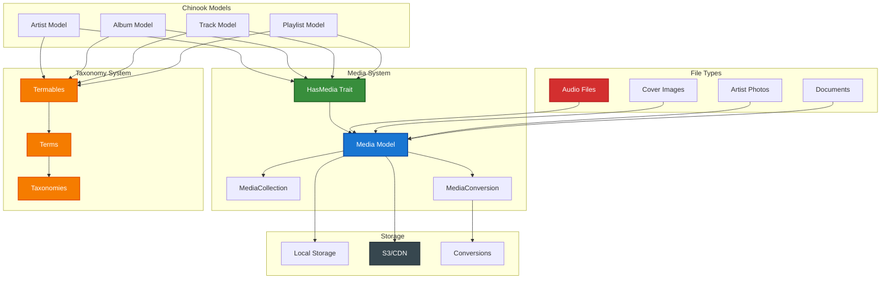

# 1. Spatie Media Library Implementation Guide

*Refactored from: .ai/guides/chinook/packages/120-spatie-media-library-guide.md on 2025-07-11*

## 1.1 Table of Contents

- [1.2 Overview](#12-overview)
- [1.3 Installation & Configuration](#13-installation--configuration)
- [1.4 Basic Media Implementation](#14-basic-media-implementation)
- [1.5 Advanced Media Patterns](#15-advanced-media-patterns)
- [1.6 Chinook Integration](#16-chinook-integration)
- [1.7 File Conversions & Processing](#17-file-conversions--processing)
- [1.8 Performance Optimization](#18-performance-optimization)
- [1.9 CDN Integration](#19-cdn-integration)
- [1.10 Testing Strategies](#110-testing-strategies)
- [1.11 Production Deployment](#111-production-deployment)
- [1.12 Best Practices](#112-best-practices)

## 1.2 Overview

Spatie Laravel Media Library provides comprehensive file management capabilities for Laravel applications. This guide demonstrates enterprise-grade implementation patterns for the Chinook music database with audio file management, image processing, CDN integration, and taxonomy-based media organization using Laravel 12 modern syntax and the aliziodev/laravel-taxonomy package.

### 1.2.1 Key Features

- **Multi-format Support**: Audio files, images, documents, and videos
- **Automatic Conversions**: Image resizing, audio format conversion
- **CDN Integration**: Seamless cloud storage and delivery
- **Performance Optimized**: Efficient file handling and caching
- **Laravel 12 Compatible**: Modern syntax with casts() method patterns
- **Enterprise Ready**: Production-ready scaling and security
- **Taxonomy Integration**: Media organization using aliziodev/laravel-taxonomy

### 1.2.2 Architecture Overview

**Accessibility Note:** This architecture diagram shows the integration between Spatie Media Library and the Chinook system, including media models, file types, storage systems, and taxonomy-based organization. The diagram uses WCAG 2.1 AA compliant colors with high contrast ratios for optimal accessibility.



## 1.3 Installation & Configuration

### 1.3.1 Package Installation

```bash
# Install Spatie Media Library
composer require spatie/laravel-medialibrary

# Install taxonomy package (if not already installed)
composer require aliziodev/laravel-taxonomy

# Publish and run migrations
php artisan vendor:publish --provider="Spatie\MediaLibrary\MediaLibraryServiceProvider" --tag="medialibrary-migrations"
php artisan migrate

# Publish configuration (optional)
php artisan vendor:publish --provider="Spatie\MediaLibrary\MediaLibraryServiceProvider" --tag="medialibrary-config"
```

### 1.3.2 Configuration Setup

```php
// config/media-library.php
return [
    'disk_name' => env('MEDIA_DISK', 'public'),
    
    'max_file_size' => 1024 * 1024 * 10, // 10MB
    
    'queue_name' => env('MEDIA_QUEUE', 'default'),
    
    'queue_conversions_by_default' => env('QUEUE_CONVERSIONS', true),
    
    'media_model' => Spatie\MediaLibrary\MediaCollections\Models\Media::class,
    
    'temporary_directory_path' => storage_path('app/temp'),
    
    'generate_thumbnails_for_temporary_uploads' => true,
    
    'file_namer' => Spatie\MediaLibrary\Support\FileNamer\DefaultFileNamer::class,
    
    'path_generator' => Spatie\MediaLibrary\Support\PathGenerator\DefaultPathGenerator::class,
    
    'url_generator' => Spatie\MediaLibrary\Support\UrlGenerator\DefaultUrlGenerator::class,
    
    'version_urls' => false,
    
    'image_optimizers' => [
        Spatie\ImageOptimizer\Optimizers\Jpegoptim::class => [
            '-m85',
            '--strip-all',
            '--all-progressive',
        ],
        Spatie\ImageOptimizer\Optimizers\Pngquant::class => [
            '--force',
        ],
        Spatie\ImageOptimizer\Optimizers\Optipng::class => [
            '-i0',
            '-o2',
            '-quiet',
        ],
    ],
    
    'image_generators' => [
        Spatie\MediaLibrary\Conversions\ImageGenerators\Image::class,
        Spatie\MediaLibrary\Conversions\ImageGenerators\Webp::class,
        Spatie\MediaLibrary\Conversions\ImageGenerators\Pdf::class,
        Spatie\MediaLibrary\Conversions\ImageGenerators\Svg::class,
        Spatie\MediaLibrary\Conversions\ImageGenerators\Video::class,
    ],
    
    'temporary_upload_path_generator' => null,
    
    'enable_vapor_uploads' => env('ENABLE_VAPOR_UPLOADS', false),
    
    'remote_collections' => [],
];
```

### 1.3.3 Environment Configuration

```bash
# .env configuration
MEDIA_DISK=public
MEDIA_QUEUE=media
QUEUE_CONVERSIONS=true

# AWS S3 Configuration (for production)
AWS_ACCESS_KEY_ID=your-access-key
AWS_SECRET_ACCESS_KEY=your-secret-key
AWS_DEFAULT_REGION=us-east-1
AWS_BUCKET=chinook-media

# CDN Configuration
CDN_URL=https://cdn.chinook-music.com
```

## 1.4 Basic Media Implementation

### 1.4.1 Model Setup with Taxonomy Integration

```php
<?php

namespace App\Models;

use Illuminate\Database\Eloquent\Model;
use Illuminate\Database\Eloquent\Relations\HasMany;
use Illuminate\Database\Eloquent\Relations\BelongsTo;
use Illuminate\Database\Eloquent\SoftDeletes;
use Spatie\MediaLibrary\HasMedia;
use Spatie\MediaLibrary\InteractsWithMedia;
use Spatie\MediaLibrary\MediaCollections\Models\Media;
use Aliziodev\LaravelTaxonomy\Traits\HasTaxonomy;
use App\Traits\HasUserStamps;
use App\Traits\HasSecondaryUniqueKey;
use App\Traits\HasSlug;

class Artist extends Model implements HasMedia
{
    use SoftDeletes, InteractsWithMedia, HasTaxonomy, HasUserStamps, HasSecondaryUniqueKey, HasSlug;

    protected $table = 'chinook_artists';

    protected $fillable = [
        'name',
        'biography',
        'website',
        'is_active',
        'metadata',
    ];

    protected function casts(): array
    {
        return [
            'is_active' => 'boolean',
            'metadata' => 'array',
            'created_at' => 'datetime',
            'updated_at' => 'datetime',
            'deleted_at' => 'datetime',
        ];
    }

    public function albums(): HasMany
    {
        return $this->hasMany(Album::class, 'artist_id');
    }

    /**
     * Register media collections
     */
    public function registerMediaCollections(): void
    {
        $this->addMediaCollection('profile_photos')
            ->acceptsMimeTypes(['image/jpeg', 'image/png', 'image/webp'])
            ->singleFile();

        $this->addMediaCollection('gallery')
            ->acceptsMimeTypes(['image/jpeg', 'image/png', 'image/webp']);

        $this->addMediaCollection('documents')
            ->acceptsMimeTypes(['application/pdf', 'text/plain']);
    }

    /**
     * Register media conversions
     */
    public function registerMediaConversions(Media $media = null): void
    {
        $this->addMediaConversion('thumb')
            ->width(300)
            ->height(300)
            ->sharpen(10)
            ->optimize()
            ->nonQueued();

        $this->addMediaConversion('preview')
            ->width(800)
            ->height(600)
            ->optimize()
            ->performOnCollections('profile_photos', 'gallery');

        $this->addMediaConversion('webp')
            ->format('webp')
            ->width(800)
            ->height(600)
            ->optimize()
            ->performOnCollections('profile_photos', 'gallery');
    }

    /**
     * Get artist genres using taxonomy system
     */
    public function getGenresAttribute(): Collection
    {
        return $this->getTermsByTaxonomy('Genres');
    }

    /**
     * Get profile photo with fallback
     */
    public function getProfilePhotoAttribute(): ?string
    {
        $media = $this->getFirstMedia('profile_photos');
        return $media ? $media->getUrl('preview') : null;
    }

    /**
     * Get profile photo thumbnail
     */
    public function getProfileThumbnailAttribute(): ?string
    {
        $media = $this->getFirstMedia('profile_photos');
        return $media ? $media->getUrl('thumb') : null;
    }
}
```

### 1.4.2 Album Model with Media Integration

```php
<?php

namespace App\Models;

use Illuminate\Database\Eloquent\Model;
use Illuminate\Database\Eloquent\Relations\HasMany;
use Illuminate\Database\Eloquent\Relations\BelongsTo;
use Illuminate\Database\Eloquent\SoftDeletes;
use Spatie\MediaLibrary\HasMedia;
use Spatie\MediaLibrary\InteractsWithMedia;
use Spatie\MediaLibrary\MediaCollections\Models\Media;
use Aliziodev\LaravelTaxonomy\Traits\HasTaxonomy;

class Album extends Model implements HasMedia
{
    use SoftDeletes, InteractsWithMedia, HasTaxonomy;

    protected $table = 'chinook_albums';

    protected function casts(): array
    {
        return [
            'release_date' => 'date',
            'is_active' => 'boolean',
            'metadata' => 'array',
            'created_at' => 'datetime',
            'updated_at' => 'datetime',
            'deleted_at' => 'datetime',
        ];
    }

    public function artist(): BelongsTo
    {
        return $this->belongsTo(Artist::class, 'artist_id');
    }

    public function tracks(): HasMany
    {
        return $this->hasMany(Track::class, 'album_id');
    }

    /**
     * Register media collections
     */
    public function registerMediaCollections(): void
    {
        $this->addMediaCollection('cover_art')
            ->acceptsMimeTypes(['image/jpeg', 'image/png', 'image/webp'])
            ->singleFile();

        $this->addMediaCollection('liner_notes')
            ->acceptsMimeTypes(['application/pdf', 'text/plain']);

        $this->addMediaCollection('promotional_materials')
            ->acceptsMimeTypes(['image/jpeg', 'image/png', 'application/pdf']);
    }

    /**
     * Register media conversions
     */
    public function registerMediaConversions(Media $media = null): void
    {
        $this->addMediaConversion('thumb')
            ->width(200)
            ->height(200)
            ->sharpen(10)
            ->optimize()
            ->nonQueued();

        $this->addMediaConversion('medium')
            ->width(400)
            ->height(400)
            ->optimize()
            ->performOnCollections('cover_art');

        $this->addMediaConversion('large')
            ->width(800)
            ->height(800)
            ->optimize()
            ->performOnCollections('cover_art');

        $this->addMediaConversion('webp_thumb')
            ->format('webp')
            ->width(200)
            ->height(200)
            ->optimize()
            ->performOnCollections('cover_art');
    }

    /**
     * Get cover art with fallback
     */
    public function getCoverArtAttribute(): ?string
    {
        $media = $this->getFirstMedia('cover_art');
        return $media ? $media->getUrl('large') : null;
    }

    /**
     * Get cover art thumbnail
     */
    public function getCoverThumbnailAttribute(): ?string
    {
        $media = $this->getFirstMedia('cover_art');
        return $media ? $media->getUrl('thumb') : null;
    }
}
```

## 1.5 Advanced Media Patterns

### 1.5.1 Custom Media Collections with Taxonomy

```php
<?php

namespace App\Services;

use App\Models\Artist;
use App\Models\Album;
use App\Models\Track;
use Spatie\MediaLibrary\MediaCollections\Models\Media;
use Aliziodev\LaravelTaxonomy\Models\Term;
use Illuminate\Http\UploadedFile;
use Illuminate\Support\Collection;

class MediaManagementService
{
    /**
     * Upload artist profile photo with taxonomy tagging
     */
    public function uploadArtistPhoto(Artist $artist, UploadedFile $file, array $taxonomyTerms = []): Media
    {
        $media = $artist->addMediaFromRequest('file')
            ->toMediaCollection('profile_photos');

        // Attach taxonomy terms to the media
        if (!empty($taxonomyTerms)) {
            $this->attachTermsToMedia($media, $taxonomyTerms);
        }

        return $media;
    }

    /**
     * Upload album cover art with automatic genre detection
     */
    public function uploadAlbumCover(Album $album, UploadedFile $file): Media
    {
        $media = $album->addMediaFromRequest('file')
            ->usingName($album->title . ' - Cover Art')
            ->usingFileName($album->slug . '-cover.' . $file->getClientOriginalExtension())
            ->toMediaCollection('cover_art');

        // Inherit genre terms from album
        $albumGenres = $album->getTermsByTaxonomy('Genres');
        if ($albumGenres->isNotEmpty()) {
            $this->attachTermsToMedia($media, $albumGenres->pluck('id')->toArray());
        }

        return $media;
    }

    /**
     * Attach taxonomy terms to media
     */
    private function attachTermsToMedia(Media $media, array $termIds): void
    {
        $terms = Term::whereIn('id', $termIds)->get();

        foreach ($terms as $term) {
            $media->attachTerm($term);
        }
    }

    /**
     * Get media by taxonomy terms
     */
    public function getMediaByTaxonomy(string $taxonomyName, string $termName): Collection
    {
        return Media::whereHasTerm($termName, $taxonomyName)->get();
    }
}
```

## 1.6 Chinook Integration

### 1.6.1 Media Upload Controller

```php
<?php

namespace App\Http\Controllers\Api;

use App\Http\Controllers\Controller;
use App\Models\Artist;
use App\Models\Album;
use App\Services\MediaManagementService;
use Illuminate\Http\Request;
use Illuminate\Http\JsonResponse;

class MediaUploadController extends Controller
{
    public function __construct(
        private MediaManagementService $mediaService
    ) {}

    /**
     * Upload artist profile photo
     */
    public function uploadArtistPhoto(Request $request, Artist $artist): JsonResponse
    {
        $request->validate([
            'file' => 'required|image|max:10240', // 10MB max
            'taxonomy_terms' => 'array',
            'taxonomy_terms.*' => 'exists:terms,id',
        ]);

        $media = $this->mediaService->uploadArtistPhoto(
            $artist,
            $request->file('file'),
            $request->input('taxonomy_terms', [])
        );

        return response()->json([
            'message' => 'Photo uploaded successfully',
            'media' => [
                'id' => $media->id,
                'url' => $media->getUrl(),
                'thumb_url' => $media->getUrl('thumb'),
                'preview_url' => $media->getUrl('preview'),
            ]
        ]);
    }

    /**
     * Upload album cover art
     */
    public function uploadAlbumCover(Request $request, Album $album): JsonResponse
    {
        $request->validate([
            'file' => 'required|image|max:10240',
        ]);

        $media = $this->mediaService->uploadAlbumCover(
            $album,
            $request->file('file')
        );

        return response()->json([
            'message' => 'Cover art uploaded successfully',
            'media' => [
                'id' => $media->id,
                'url' => $media->getUrl(),
                'thumb_url' => $media->getUrl('thumb'),
                'medium_url' => $media->getUrl('medium'),
                'large_url' => $media->getUrl('large'),
            ]
        ]);
    }
}
```

## 1.7 File Conversions & Processing

### 1.7.1 Audio File Processing with Taxonomy

```php
<?php

namespace App\Services;

use App\Models\Track;
use FFMpeg\FFMpeg;
use FFMpeg\Format\Audio\Mp3;
use FFMpeg\Format\Audio\Wav;
use Spatie\MediaLibrary\MediaCollections\Models\Media;
use Aliziodev\LaravelTaxonomy\Models\Term;

class AudioProcessingService
{
    private FFMpeg $ffmpeg;

    public function __construct()
    {
        $this->ffmpeg = FFMpeg::create([
            'ffmpeg.binaries' => config('media-library.ffmpeg_path', '/usr/bin/ffmpeg'),
            'ffprobe.binaries' => config('media-library.ffprobe_path', '/usr/bin/ffprobe'),
        ]);
    }

    /**
     * Process uploaded audio file with taxonomy integration
     */
    public function processAudioFile(Track $track, $audioFile): Track
    {
        // Add original audio file
        $media = $track->addMedia($audioFile)
            ->withCustomProperties([
                'original_format' => $audioFile->getClientOriginalExtension(),
                'processed_at' => now()->toISOString(),
                'file_size' => $audioFile->getSize(),
                'duration' => $this->getAudioDuration($audioFile),
            ])
            ->toMediaCollection('audio');

        // Extract and store audio metadata
        $this->extractAudioMetadata($media);

        // Generate preview (30-second sample)
        $this->generatePreview($track, $media);

        // Apply taxonomy terms based on audio analysis
        $this->applyAudioTaxonomy($track, $media);

        return $track->fresh();
    }

    /**
     * Extract audio metadata and store as custom properties
     */
    private function extractAudioMetadata(Media $media): void
    {
        try {
            $audio = $this->ffmpeg->open($media->getPath());
            $format = $audio->getFormat();

            $metadata = [
                'duration' => $format->get('duration'),
                'bit_rate' => $format->get('bit_rate'),
                'sample_rate' => $format->get('sample_rate'),
                'channels' => $format->get('channels'),
                'codec' => $format->get('codec_name'),
            ];

            $media->setCustomProperty('audio_metadata', $metadata);
            $media->save();

        } catch (\Exception $e) {
            \Log::warning("Failed to extract audio metadata for media {$media->id}: " . $e->getMessage());
        }
    }

    /**
     * Generate 30-second preview from full track
     */
    private function generatePreview(Track $track, Media $media): void
    {
        try {
            $audio = $this->ffmpeg->open($media->getPath());

            // Extract 30 seconds starting from 30 seconds in
            $clip = $audio->clip(\FFMpeg\Coordinate\TimeCode::fromSeconds(30), \FFMpeg\Coordinate\TimeCode::fromSeconds(30));

            $format = new Mp3();
            $format->setAudioKiloBitrate(128);

            $previewPath = storage_path('app/temp/preview_' . $media->id . '.mp3');
            $clip->save($format, $previewPath);

            // Add preview to media collection
            $track->addMedia($previewPath)
                ->withCustomProperties([
                    'is_preview' => true,
                    'parent_media_id' => $media->id,
                    'duration' => 30,
                ])
                ->toMediaCollection('preview');

            // Clean up temporary file
            unlink($previewPath);

        } catch (\Exception $e) {
            \Log::warning("Failed to generate preview for media {$media->id}: " . $e->getMessage());
        }
    }

    /**
     * Apply taxonomy terms based on audio analysis
     */
    private function applyAudioTaxonomy(Track $track, Media $media): void
    {
        $metadata = $media->getCustomProperty('audio_metadata', []);

        // Apply format-based taxonomy terms
        if (isset($metadata['codec'])) {
            $formatTerm = $this->getOrCreateFormatTerm($metadata['codec']);
            if ($formatTerm) {
                $track->attachTerm($formatTerm);
            }
        }

        // Apply quality-based taxonomy terms
        if (isset($metadata['bit_rate'])) {
            $qualityTerm = $this->getQualityTerm($metadata['bit_rate']);
            if ($qualityTerm) {
                $track->attachTerm($qualityTerm);
            }
        }
    }

    /**
     * Get or create format taxonomy term
     */
    private function getOrCreateFormatTerm(string $codec): ?Term
    {
        $formatTaxonomy = \Aliziodev\LaravelTaxonomy\Models\Taxonomy::firstOrCreate(['name' => 'Audio Formats']);

        $formatMap = [
            'mp3' => 'MP3',
            'aac' => 'AAC',
            'flac' => 'FLAC',
            'wav' => 'WAV',
            'ogg' => 'OGG Vorbis',
        ];

        $termName = $formatMap[strtolower($codec)] ?? strtoupper($codec);

        return Term::firstOrCreate([
            'name' => $termName,
            'taxonomy_id' => $formatTaxonomy->id,
        ]);
    }

    /**
     * Get quality taxonomy term based on bit rate
     */
    private function getQualityTerm(int $bitRate): ?Term
    {
        $qualityTaxonomy = \Aliziodev\LaravelTaxonomy\Models\Taxonomy::firstOrCreate(['name' => 'Audio Quality']);

        $qualityLevel = match (true) {
            $bitRate >= 320000 => 'High Quality (320+ kbps)',
            $bitRate >= 192000 => 'Standard Quality (192-319 kbps)',
            $bitRate >= 128000 => 'Good Quality (128-191 kbps)',
            default => 'Basic Quality (<128 kbps)',
        };

        return Term::firstOrCreate([
            'name' => $qualityLevel,
            'taxonomy_id' => $qualityTaxonomy->id,
        ]);
    }

    /**
     * Get audio duration from file
     */
    private function getAudioDuration($audioFile): ?float
    {
        try {
            $audio = $this->ffmpeg->open($audioFile->getPathname());
            return $audio->getFormat()->get('duration');
        } catch (\Exception $e) {
            return null;
        }
    }
}
```

### 1.7.2 Image Processing with Taxonomy Integration

```php
<?php

namespace App\Services;

use App\Models\Artist;
use App\Models\Album;
use Spatie\MediaLibrary\MediaCollections\Models\Media;
use Aliziodev\LaravelTaxonomy\Models\Term;
use Intervention\Image\ImageManagerStatic as Image;

class ImageProcessingService
{
    /**
     * Process uploaded image with taxonomy tagging
     */
    public function processImage(Media $media): void
    {
        // Extract image metadata
        $this->extractImageMetadata($media);

        // Apply taxonomy terms based on image analysis
        $this->applyImageTaxonomy($media);

        // Generate additional conversions if needed
        $this->generateCustomConversions($media);
    }

    /**
     * Extract image metadata and store as custom properties
     */
    private function extractImageMetadata(Media $media): void
    {
        try {
            $image = Image::make($media->getPath());

            $metadata = [
                'width' => $image->width(),
                'height' => $image->height(),
                'aspect_ratio' => round($image->width() / $image->height(), 2),
                'file_size' => $media->size,
                'color_space' => $image->colorspace(),
                'has_transparency' => $this->hasTransparency($image),
            ];

            // Extract EXIF data if available
            if (function_exists('exif_read_data') && in_array($media->mime_type, ['image/jpeg', 'image/tiff'])) {
                $exif = @exif_read_data($media->getPath());
                if ($exif) {
                    $metadata['exif'] = [
                        'camera' => $exif['Model'] ?? null,
                        'date_taken' => $exif['DateTime'] ?? null,
                        'iso' => $exif['ISOSpeedRatings'] ?? null,
                        'focal_length' => $exif['FocalLength'] ?? null,
                    ];
                }
            }

            $media->setCustomProperty('image_metadata', $metadata);
            $media->save();

        } catch (\Exception $e) {
            \Log::warning("Failed to extract image metadata for media {$media->id}: " . $e->getMessage());
        }
    }

    /**
     * Apply taxonomy terms based on image analysis
     */
    private function applyImageTaxonomy(Media $media): void
    {
        $metadata = $media->getCustomProperty('image_metadata', []);

        // Apply orientation taxonomy
        if (isset($metadata['aspect_ratio'])) {
            $orientationTerm = $this->getOrientationTerm($metadata['aspect_ratio']);
            if ($orientationTerm && $media->model) {
                $media->model->attachTerm($orientationTerm);
            }
        }

        // Apply resolution taxonomy
        if (isset($metadata['width'], $metadata['height'])) {
            $resolutionTerm = $this->getResolutionTerm($metadata['width'], $metadata['height']);
            if ($resolutionTerm && $media->model) {
                $media->model->attachTerm($resolutionTerm);
            }
        }
    }

    /**
     * Get orientation taxonomy term
     */
    private function getOrientationTerm(float $aspectRatio): ?Term
    {
        $orientationTaxonomy = \Aliziodev\LaravelTaxonomy\Models\Taxonomy::firstOrCreate(['name' => 'Image Orientation']);

        $orientation = match (true) {
            $aspectRatio > 1.3 => 'Landscape',
            $aspectRatio < 0.8 => 'Portrait',
            default => 'Square',
        };

        return Term::firstOrCreate([
            'name' => $orientation,
            'taxonomy_id' => $orientationTaxonomy->id,
        ]);
    }

    /**
     * Get resolution taxonomy term
     */
    private function getResolutionTerm(int $width, int $height): ?Term
    {
        $resolutionTaxonomy = \Aliziodev\LaravelTaxonomy\Models\Taxonomy::firstOrCreate(['name' => 'Image Resolution']);

        $totalPixels = $width * $height;

        $resolution = match (true) {
            $totalPixels >= 8000000 => '4K+ (8MP+)',
            $totalPixels >= 2000000 => 'High Resolution (2-8MP)',
            $totalPixels >= 500000 => 'Standard Resolution (0.5-2MP)',
            default => 'Low Resolution (<0.5MP)',
        };

        return Term::firstOrCreate([
            'name' => $resolution,
            'taxonomy_id' => $resolutionTaxonomy->id,
        ]);
    }

    /**
     * Check if image has transparency
     */
    private function hasTransparency($image): bool
    {
        // This is a simplified check - in practice, you'd need more sophisticated detection
        return $image->mime() === 'image/png';
    }

    /**
     * Generate custom conversions based on image type
     */
    private function generateCustomConversions(Media $media): void
    {
        $metadata = $media->getCustomProperty('image_metadata', []);

        // Generate high-quality WebP version for modern browsers
        if (isset($metadata['width'], $metadata['height'])) {
            // This would trigger additional conversions if needed
            // Implementation depends on specific requirements
        }
    }
}
```

## 1.8 Performance Optimization

### 1.8.1 Caching Strategies with Taxonomy

```php
<?php

namespace App\Services;

use Illuminate\Support\Facades\Cache;
use Spatie\MediaLibrary\MediaCollections\Models\Media;
use App\Models\Artist;
use App\Models\Album;

class MediaCacheService
{
    private const CACHE_TTL = 3600; // 1 hour

    /**
     * Cache media URLs with taxonomy context
     */
    public function getCachedMediaUrl(Media $media, string $conversion = '', array $taxonomyContext = []): string
    {
        $cacheKey = $this->generateCacheKey($media, $conversion, $taxonomyContext);

        return Cache::remember($cacheKey, self::CACHE_TTL, function () use ($media, $conversion) {
            return $media->getUrl($conversion);
        });
    }

    /**
     * Cache media collections by taxonomy terms
     */
    public function getCachedMediaByTaxonomy(string $taxonomyName, string $termName): Collection
    {
        $cacheKey = "media_taxonomy_{$taxonomyName}_{$termName}";

        return Cache::remember($cacheKey, self::CACHE_TTL, function () use ($taxonomyName, $termName) {
            return Media::whereHasTerm($termName, $taxonomyName)->get();
        });
    }

    /**
     * Preload media for artist with taxonomy
     */
    public function preloadArtistMedia(Artist $artist): void
    {
        $cacheKey = "artist_media_{$artist->id}";

        Cache::remember($cacheKey, self::CACHE_TTL, function () use ($artist) {
            return [
                'profile_photo' => $artist->getFirstMediaUrl('profile_photos', 'preview'),
                'thumbnail' => $artist->getFirstMediaUrl('profile_photos', 'thumb'),
                'gallery' => $artist->getMedia('gallery')->map(function ($media) {
                    return [
                        'id' => $media->id,
                        'url' => $media->getUrl('preview'),
                        'thumb' => $media->getUrl('thumb'),
                    ];
                }),
                'genres' => $artist->getTermsByTaxonomy('Genres')->pluck('name'),
            ];
        });
    }

    /**
     * Generate cache key with taxonomy context
     */
    private function generateCacheKey(Media $media, string $conversion, array $taxonomyContext): string
    {
        $contextHash = md5(serialize($taxonomyContext));
        return "media_url_{$media->id}_{$conversion}_{$contextHash}";
    }

    /**
     * Clear media cache when taxonomy changes
     */
    public function clearMediaCache(Media $media): void
    {
        $pattern = "media_*_{$media->id}_*";
        $this->clearCacheByPattern($pattern);
    }

    /**
     * Clear cache by pattern
     */
    private function clearCacheByPattern(string $pattern): void
    {
        // Implementation depends on cache driver
        // For Redis, you could use SCAN with pattern matching
        // For file cache, you'd need to iterate through cache files
    }
}
```

### 1.8.2 Queue Optimization for Media Processing

```php
<?php

namespace App\Jobs;

use App\Models\Track;
use App\Services\AudioProcessingService;
use Illuminate\Bus\Queueable;
use Illuminate\Contracts\Queue\ShouldQueue;
use Illuminate\Foundation\Bus\Dispatchable;
use Illuminate\Queue\InteractsWithQueue;
use Illuminate\Queue\SerializesModels;
use Spatie\MediaLibrary\MediaCollections\Models\Media;

class ProcessAudioFileJob implements ShouldQueue
{
    use Dispatchable, InteractsWithQueue, Queueable, SerializesModels;

    public int $timeout = 300; // 5 minutes
    public int $tries = 3;

    public function __construct(
        private Track $track,
        private Media $media
    ) {
        $this->onQueue('media-processing');
    }

    public function handle(AudioProcessingService $audioService): void
    {
        try {
            // Process audio file with taxonomy integration
            $audioService->processAudioFile($this->track, $this->media);

            // Update track status
            $this->track->update(['processing_status' => 'completed']);

        } catch (\Exception $e) {
            \Log::error("Audio processing failed for track {$this->track->id}: " . $e->getMessage());

            $this->track->update(['processing_status' => 'failed']);

            throw $e;
        }
    }

    public function failed(\Throwable $exception): void
    {
        $this->track->update(['processing_status' => 'failed']);

        // Notify administrators
        \Notification::route('mail', config('app.admin_email'))
            ->notify(new \App\Notifications\MediaProcessingFailed($this->track, $exception));
    }
}
```

## 1.9 CDN Integration

### 1.9.1 AWS S3 and CloudFront Setup

```php
// config/filesystems.php
'disks' => [
    's3_media' => [
        'driver' => 's3',
        'key' => env('AWS_ACCESS_KEY_ID'),
        'secret' => env('AWS_SECRET_ACCESS_KEY'),
        'region' => env('AWS_DEFAULT_REGION'),
        'bucket' => env('AWS_MEDIA_BUCKET'),
        'url' => env('AWS_MEDIA_URL'),
        'endpoint' => env('AWS_ENDPOINT'),
        'use_path_style_endpoint' => env('AWS_USE_PATH_STYLE_ENDPOINT', false),
        'throw' => false,
        'options' => [
            'CacheControl' => 'max-age=31536000', // 1 year
            'Metadata' => [
                'processed_by' => 'chinook-media-system',
            ],
        ],
    ],
],

// config/media-library.php
'disk_name' => env('MEDIA_DISK', 's3_media'),
```

### 1.9.2 CDN URL Generation with Taxonomy Context

```php
<?php

namespace App\Services;

use Spatie\MediaLibrary\MediaCollections\Models\Media;
use Illuminate\Support\Str;

class CdnUrlService
{
    /**
     * Generate optimized CDN URLs with taxonomy-based parameters
     */
    public function getOptimizedUrl(Media $media, string $conversion = '', array $options = []): string
    {
        $baseUrl = $media->getUrl($conversion);

        // Add CDN optimization parameters
        if (config('media-library.disk_name') === 's3_media') {
            return $this->addCdnOptimization($baseUrl, $media, $options);
        }

        return $baseUrl;
    }

    /**
     * Add CloudFront optimization parameters
     */
    private function addCdnOptimization(string $url, Media $media, array $options): string
    {
        $params = [];

        // Image optimization
        if (Str::startsWith($media->mime_type, 'image/')) {
            $params['format'] = $options['format'] ?? 'webp';
            $params['quality'] = $options['quality'] ?? '85';

            // Add responsive image parameters based on taxonomy
            if ($media->model && $media->model->hasTerms()) {
                $orientationTerms = $media->model->getTermsByTaxonomy('Image Orientation');
                if ($orientationTerms->contains('name', 'Portrait')) {
                    $params['ar'] = '3:4'; // Portrait aspect ratio
                } elseif ($orientationTerms->contains('name', 'Landscape')) {
                    $params['ar'] = '16:9'; // Landscape aspect ratio
                }
            }
        }

        // Audio optimization
        if (Str::startsWith($media->mime_type, 'audio/')) {
            $params['bitrate'] = $options['bitrate'] ?? '128k';
            $params['format'] = $options['format'] ?? 'mp3';
        }

        // Add cache control
        $params['cache'] = '31536000'; // 1 year

        if (!empty($params)) {
            $separator = parse_url($url, PHP_URL_QUERY) ? '&' : '?';
            $url .= $separator . http_build_query($params);
        }

        return $url;
    }

    /**
     * Generate responsive image URLs with taxonomy context
     */
    public function getResponsiveUrls(Media $media, array $sizes = [300, 600, 1200]): array
    {
        $urls = [];

        foreach ($sizes as $size) {
            $urls[$size] = $this->getOptimizedUrl($media, '', [
                'width' => $size,
                'quality' => '85',
                'format' => 'webp',
            ]);
        }

        return $urls;
    }
}
```

## 1.10 Testing Strategies

### 1.10.1 Media Upload Testing with Taxonomy

```php
<?php

namespace Tests\Feature;

use Aliziodev\LaravelTaxonomy\Models\Taxonomy;use Aliziodev\LaravelTaxonomy\Models\Term;use App\Models\Album;use App\Models\Artist;use Illuminate\Foundation\Testing\RefreshDatabase;use Illuminate\Http\UploadedFile;use Illuminate\Support\Facades\Storage;use old\TestCase;

class MediaUploadTest extends TestCase
{
    use RefreshDatabase;

    protected function setUp(): void
    {
        parent::setUp();

        Storage::fake('public');

        // Create test taxonomies
        $this->genreTaxonomy = Taxonomy::create(['name' => 'Genres']);
        $this->rockTerm = Term::create([
            'name' => 'Rock',
            'taxonomy_id' => $this->genreTaxonomy->id,
        ]);
    }

    /** @test */
    public function it_can_upload_artist_profile_photo_with_taxonomy()
    {
        $artist = Artist::factory()->create();
        $file = UploadedFile::fake()->image('profile.jpg', 800, 600);

        $response = $this->postJson("/api/artists/{$artist->id}/upload-photo", [
            'file' => $file,
            'taxonomy_terms' => [$this->rockTerm->id],
        ]);

        $response->assertStatus(200);

        // Assert media was created
        $this->assertCount(1, $artist->getMedia('profile_photos'));

        // Assert taxonomy was attached
        $this->assertTrue($artist->hasTerms([$this->rockTerm]));

        // Assert conversions were created
        $media = $artist->getFirstMedia('profile_photos');
        $this->assertNotNull($media->getUrl('thumb'));
        $this->assertNotNull($media->getUrl('preview'));
    }

    /** @test */
    public function it_can_upload_album_cover_with_inherited_taxonomy()
    {
        $artist = Artist::factory()->create();
        $artist->attachTerm($this->rockTerm);

        $album = Album::factory()->create(['artist_id' => $artist->id]);
        $album->attachTerm($this->rockTerm);

        $file = UploadedFile::fake()->image('cover.jpg', 600, 600);

        $response = $this->postJson("/api/albums/{$album->id}/upload-cover", [
            'file' => $file,
        ]);

        $response->assertStatus(200);

        // Assert media was created
        $this->assertCount(1, $album->getMedia('cover_art'));

        // Assert taxonomy was inherited
        $media = $album->getFirstMedia('cover_art');
        $this->assertTrue($media->model->hasTerms([$this->rockTerm]));
    }

    /** @test */
    public function it_validates_file_types_and_sizes()
    {
        $artist = Artist::factory()->create();

        // Test invalid file type
        $invalidFile = UploadedFile::fake()->create('document.txt', 100);

        $response = $this->postJson("/api/artists/{$artist->id}/upload-photo", [
            'file' => $invalidFile,
        ]);

        $response->assertStatus(422);
        $response->assertJsonValidationErrors(['file']);

        // Test oversized file
        $oversizedFile = UploadedFile::fake()->image('huge.jpg')->size(15000); // 15MB

        $response = $this->postJson("/api/artists/{$artist->id}/upload-photo", [
            'file' => $oversizedFile,
        ]);

        $response->assertStatus(422);
        $response->assertJsonValidationErrors(['file']);
    }
}
```

### 1.10.2 Performance Testing for Media Operations

```php
<?php

namespace Tests\Performance;

use App\Models\Artist;use App\Services\MediaCacheService;use Illuminate\Foundation\Testing\RefreshDatabase;use Illuminate\Http\UploadedFile;use Illuminate\Support\Facades\Storage;use old\TestCase;

class MediaPerformanceTest extends TestCase
{
    use RefreshDatabase;

    /** @test */
    public function it_caches_media_urls_efficiently()
    {
        Storage::fake('public');

        $artist = Artist::factory()->create();
        $file = UploadedFile::fake()->image('profile.jpg');

        $media = $artist->addMedia($file)->toMediaCollection('profile_photos');

        $cacheService = app(MediaCacheService::class);

        // First call should hit the database
        $startTime = microtime(true);
        $url1 = $cacheService->getCachedMediaUrl($media, 'thumb');
        $firstCallTime = microtime(true) - $startTime;

        // Second call should hit the cache
        $startTime = microtime(true);
        $url2 = $cacheService->getCachedMediaUrl($media, 'thumb');
        $secondCallTime = microtime(true) - $startTime;

        $this->assertEquals($url1, $url2);
        $this->assertLessThan($firstCallTime, $secondCallTime);
    }

    /** @test */
    public function it_handles_bulk_media_operations_efficiently()
    {
        Storage::fake('public');

        $artists = Artist::factory()->count(50)->create();

        $startTime = microtime(true);

        foreach ($artists as $artist) {
            $file = UploadedFile::fake()->image("profile_{$artist->id}.jpg");
            $artist->addMedia($file)->toMediaCollection('profile_photos');
        }

        $processingTime = microtime(true) - $startTime;

        // Assert reasonable processing time (adjust threshold as needed)
        $this->assertLessThan(30, $processingTime, 'Bulk media upload took too long');
    }
}
```

## 1.11 Production Deployment

### 1.11.1 Environment Configuration

```bash
# Production environment variables
MEDIA_DISK=s3_media
AWS_MEDIA_BUCKET=chinook-media-production
AWS_MEDIA_URL=https://cdn.chinook-music.com
QUEUE_CONNECTION=redis
MEDIA_QUEUE=media-processing

# FFmpeg installation for audio processing
sudo apt-get update
sudo apt-get install ffmpeg

# Image optimization tools
sudo apt-get install jpegoptim optipng pngquant

# Redis for caching and queues
sudo apt-get install redis-server
```

### 1.11.2 Deployment Scripts

```bash
#!/bin/bash
# scripts/deploy-media-system.sh

echo "Deploying Chinook Media System..."

# Install dependencies
composer install --no-dev --optimize-autoloader

# Run migrations
php artisan migrate --force

# Publish media library assets
php artisan vendor:publish --provider="Spatie\MediaLibrary\MediaLibraryServiceProvider" --tag="medialibrary-migrations" --force

# Clear and cache configuration
php artisan config:cache
php artisan route:cache
php artisan view:cache

# Set up storage permissions
sudo chown -R www-data:www-data storage/
sudo chmod -R 755 storage/

# Start queue workers
sudo supervisorctl restart chinook-media-worker

# Verify FFmpeg installation
ffmpeg -version

echo "Media system deployment completed!"
```

### 1.11.3 Monitoring and Maintenance

```php
<?php

namespace App\Console\Commands;

use Illuminate\Console\Command;
use Spatie\MediaLibrary\MediaCollections\Models\Media;
use Illuminate\Support\Facades\Storage;

class MediaHealthCheck extends Command
{
    protected $signature = 'media:health-check';
    protected $description = 'Check media library health and integrity';

    public function handle(): int
    {
        $this->info('Running media library health check...');

        $totalMedia = Media::count();
        $missingFiles = 0;
        $corruptedFiles = 0;

        $this->withProgressBar(Media::chunk(100), function ($mediaItems) use (&$missingFiles, &$corruptedFiles) {
            foreach ($mediaItems as $media) {
                // Check if file exists
                if (!Storage::disk($media->disk)->exists($media->getPath())) {
                    $missingFiles++;
                    $this->warn("Missing file: {$media->getPath()}");
                    continue;
                }

                // Check file integrity (basic size check)
                $actualSize = Storage::disk($media->disk)->size($media->getPath());
                if ($actualSize !== $media->size) {
                    $corruptedFiles++;
                    $this->warn("Size mismatch for: {$media->getPath()}");
                }
            }
        });

        $this->newLine(2);
        $this->table(['Metric', 'Count'], [
            ['Total Media Files', $totalMedia],
            ['Missing Files', $missingFiles],
            ['Corrupted Files', $corruptedFiles],
            ['Health Score', round((($totalMedia - $missingFiles - $corruptedFiles) / $totalMedia) * 100, 2) . '%'],
        ]);

        if ($missingFiles > 0 || $corruptedFiles > 0) {
            $this->error('Media library health check failed!');
            return 1;
        }

        $this->info('Media library health check passed!');
        return 0;
    }
}
```

## 1.12 Best Practices

### 1.12.1 File Organization with Taxonomy

- **Use descriptive collection names**: `cover_art`, `profile_photos`, `audio_files`
- **Implement consistent naming conventions**: Follow kebab-case for collections
- **Set appropriate file size limits**: Different limits per collection type
- **Use custom properties for metadata**: Store processing information and taxonomy context
- **Leverage taxonomy for organization**: Use aliziodev/laravel-taxonomy for categorization

### 1.12.2 Performance Guidelines

- **Always queue media conversions**: Use Laravel queues for large file processing
- **Implement CDN for global delivery**: Use AWS CloudFront or similar
- **Use appropriate image formats**: WebP for modern browsers, JPEG for compatibility
- **Cache media URLs and metadata**: Implement Redis caching for frequently accessed media
- **Optimize database queries**: Use eager loading for media relationships

### 1.12.3 Security Considerations

- **Validate file types and sizes**: Strict validation before upload
- **Scan uploaded files for malware**: Integrate virus scanning services
- **Implement access controls**: Use Laravel policies for media access
- **Use signed URLs for private content**: Temporary access to sensitive media
- **Sanitize file names**: Remove potentially dangerous characters

### 1.12.4 Taxonomy Integration Best Practices

- **Use consistent taxonomy naming**: Follow established conventions
- **Implement automatic tagging**: Based on file metadata and content analysis
- **Provide manual override options**: Allow users to modify automatic tags
- **Cache taxonomy queries**: Store frequently accessed taxonomy relationships
- **Maintain taxonomy hierarchy**: Use parent-child relationships where appropriate

---

**Next**: [Spatie Permission Guide](140-spatie-permission-guide.md) | **Previous**: [Aliziodev Laravel Taxonomy Guide](110-aliziodev-laravel-taxonomy-guide.md)

---

*This guide demonstrates comprehensive media management for the Chinook system using Spatie Media Library with Laravel 12, aliziodev/laravel-taxonomy integration, and modern file handling patterns.*

[⬆️ Back to Top](#1-spatie-media-library-implementation-guide)
