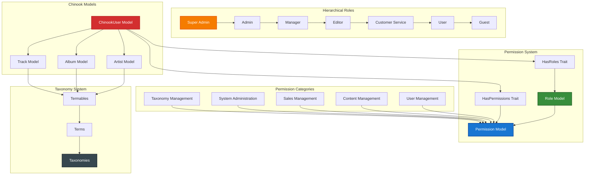

# 1. Spatie Permission Implementation Guide

**Refactored from:** `.ai/guides/chinook/packages/140-spatie-permission-guide.md` on 2025-07-11

## 1.1 Table of Contents

- [1.2 Overview](#12-overview)
- [1.3 Installation & Configuration](#13-installation--configuration)
- [1.4 Basic RBAC Implementation](#14-basic-rbac-implementation)
- [1.5 Advanced Permission Patterns](#15-advanced-permission-patterns)
- [1.6 Chinook Integration](#16-chinook-integration)
- [1.7 Hierarchical Roles](#17-hierarchical-roles)
- [1.8 Performance Optimization](#18-performance-optimization)
- [1.9 API Integration](#19-api-integration)
- [1.10 Testing Strategies](#110-testing-strategies)
- [1.11 Production Deployment](#111-production-deployment)
- [1.12 Best Practices](#112-best-practices)

## 1.2 Overview

Spatie Laravel Permission provides comprehensive role-based access control (RBAC) for Laravel applications. This guide demonstrates enterprise-grade implementation patterns for the Chinook music database with hierarchical roles, granular permissions, taxonomy-based access control, and Laravel 12 modern syntax using the aliziodev/laravel-taxonomy package.

### 1.2.1 Key Features

- **Hierarchical Roles**: 7-tier role structure from Guest to Super Admin
- **Granular Permissions**: 50+ specific permissions for fine-grained control
- **Model Integration**: Seamless integration with all Chinook models
- **Performance Optimized**: Efficient permission checking and caching
- **Laravel 12 Compatible**: Modern syntax with casts() method patterns
- **Enterprise Ready**: Production-ready scaling and security
- **Taxonomy Integration**: Permission-based access to taxonomy terms and categories

### 1.2.2 Architecture Overview

**Accessibility Note:** This RBAC architecture diagram shows the integration between Spatie Permission and the Chinook system, including hierarchical roles, permission categories, and taxonomy-based access control. The diagram uses WCAG 2.1 AA compliant colors with high contrast ratios for optimal accessibility.



## 1.3 Installation & Configuration

### 1.3.1 Package Installation

```bash
# Install Spatie Permission package
composer require spatie/laravel-permission

# Install taxonomy package (if not already installed)
composer require aliziodev/laravel-taxonomy

# Publish and run migrations
php artisan vendor:publish --provider="Spatie\Permission\PermissionServiceProvider"
php artisan migrate

# Clear cache after installation
php artisan cache:forget spatie.permission.cache
```

### 1.3.2 Configuration Setup

```php
// config/permission.php
return [
    'models' => [
        'permission' => Spatie\Permission\Models\Permission::class,
        'role' => Spatie\Permission\Models\Role::class,
    ],

    'table_names' => [
        'roles' => 'roles',
        'permissions' => 'permissions',
        'model_has_permissions' => 'model_has_permissions',
        'model_has_roles' => 'model_has_roles',
        'role_has_permissions' => 'role_has_permissions',
    ],

    'column_names' => [
        'role_pivot_key' => null,
        'permission_pivot_key' => null,
        'model_morph_key' => 'model_id',
        'team_foreign_key' => 'team_id',
    ],

    'register_permission_check_method' => true,
    'register_octane_reset_listener' => false,
    'teams' => false,
    'use_passport_client_credentials' => false,
    'display_permission_in_exception' => false,
    'display_role_in_exception' => false,
    'enable_wildcard_permission' => false,
    
    'cache' => [
        'expiration_time' => \DateInterval::createFromDateString('24 hours'),
        'key' => 'spatie.permission.cache',
        'store' => 'default',
    ],
];
```

### 1.3.3 Laravel 12 User Model Integration

```php
<?php

namespace App\Models;

use Illuminate\Database\Eloquent\Factories\HasFactory;
use Illuminate\Foundation\Auth\User as Authenticatable;
use Illuminate\Notifications\Notifiable;
use Laravel\Sanctum\HasApiTokens;
use Spatie\Permission\Traits\HasRoles;
use Aliziodev\LaravelTaxonomy\Traits\HasTaxonomy;
use App\Traits\HasUserStamps;
use App\Traits\HasSecondaryUniqueKey;
use App\Traits\HasSlug;

class ChinookUser extends Authenticatable
{
    use HasApiTokens, HasFactory, Notifiable, HasRoles, HasTaxonomy, HasUserStamps, HasSecondaryUniqueKey, HasSlug;

    protected $table = 'chinook_users';

    protected $fillable = [
        'name',
        'email',
        'password',
        'first_name',
        'last_name',
        'phone',
        'address',
        'city',
        'state',
        'country',
        'postal_code',
        'is_active',
        'email_verified_at',
        'preferences',
    ];

    protected $hidden = [
        'password',
        'remember_token',
    ];

    protected function casts(): array
    {
        return [
            'email_verified_at' => 'datetime',
            'password' => 'hashed',
            'is_active' => 'boolean',
            'preferences' => 'array',
            'created_at' => 'datetime',
            'updated_at' => 'datetime',
        ];
    }

    /**
     * Get user's role hierarchy level
     */
    public function getRoleLevel(): int
    {
        $hierarchy = [
            'guest' => 0,
            'user' => 1,
            'customer-service' => 2,
            'editor' => 3,
            'manager' => 4,
            'admin' => 5,
            'super-admin' => 6,
        ];

        return $this->roles->max(function ($role) use ($hierarchy) {
            return $hierarchy[$role->name] ?? 0;
        }) ?? 0;
    }

    /**
     * Check if user has sufficient role level
     */
    public function hasRoleLevel(string $requiredRole): bool
    {
        $hierarchy = [
            'guest' => 0,
            'user' => 1,
            'customer-service' => 2,
            'editor' => 3,
            'manager' => 4,
            'admin' => 5,
            'super-admin' => 6,
        ];

        $userLevel = $this->getRoleLevel();
        $requiredLevel = $hierarchy[$requiredRole] ?? 0;

        return $userLevel >= $requiredLevel;
    }

    /**
     * Get user preferences with taxonomy context
     */
    public function getPreferredGenres(): Collection
    {
        return $this->getTermsByTaxonomy('User Preferences');
    }

    /**
     * Check if user can access taxonomy term
     */
    public function canAccessTaxonomyTerm(string $taxonomyName, string $termName): bool
    {
        // Super admin and admin can access all taxonomy terms
        if ($this->hasAnyRole(['super-admin', 'admin'])) {
            return true;
        }

        // Managers can access most taxonomy terms
        if ($this->hasRole('manager')) {
            $restrictedTaxonomies = ['System Settings', 'Internal Classifications'];
            return !in_array($taxonomyName, $restrictedTaxonomies);
        }

        // Editors can access content-related taxonomies
        if ($this->hasRole('editor')) {
            $allowedTaxonomies = ['Genres', 'Moods', 'Themes', 'Audio Quality'];
            return in_array($taxonomyName, $allowedTaxonomies);
        }

        // Regular users can only access public taxonomies
        $publicTaxonomies = ['Genres', 'Moods'];
        return in_array($taxonomyName, $publicTaxonomies);
    }
}
```

## 1.4 Basic RBAC Implementation

### 1.4.1 Permission and Role Seeder with Taxonomy Integration

```php
<?php

namespace Database\Seeders;

use Illuminate\Database\Seeder;
use Spatie\Permission\Models\Permission;
use Spatie\Permission\Models\Role;
use Aliziodev\LaravelTaxonomy\Models\Taxonomy;
use Aliziodev\LaravelTaxonomy\Models\Term;

class RolePermissionSeeder extends Seeder
{
    public function run(): void
    {
        // Reset cached roles and permissions
        app()[\Spatie\Permission\PermissionRegistrar::class]->forgetCachedPermissions();

        // Create permissions
        $this->createPermissions();

        // Create roles
        $this->createRoles();

        // Assign permissions to roles
        $this->assignPermissionsToRoles();

        // Create taxonomy-specific permissions
        $this->createTaxonomyPermissions();
    }

    private function createPermissions(): void
    {
        $permissions = [
            // User Management
            'users.view', 'users.create', 'users.edit', 'users.delete', 'users.restore',
            'users.assign-roles', 'users.manage-permissions',

            // Artist Management
            'artists.view', 'artists.create', 'artists.edit', 'artists.delete', 'artists.restore',
            'artists.publish', 'artists.unpublish', 'artists.feature',

            // Album Management
            'albums.view', 'albums.create', 'albums.edit', 'albums.delete', 'albums.restore',
            'albums.publish', 'albums.unpublish', 'albums.feature',

            // Track Management
            'tracks.view', 'tracks.create', 'tracks.edit', 'tracks.delete', 'tracks.restore',
            'tracks.publish', 'tracks.unpublish', 'tracks.upload-audio',

            // Taxonomy Management
            'taxonomies.view', 'taxonomies.create', 'taxonomies.edit', 'taxonomies.delete',
            'terms.view', 'terms.create', 'terms.edit', 'terms.delete',
            'terms.assign', 'terms.bulk-assign',

            // Sales Management
            'sales.view', 'sales.create', 'sales.edit', 'sales.delete',
            'sales.reports', 'sales.analytics', 'sales.export',

            // System Administration
            'system.settings', 'system.cache-clear', 'system.backup',
            'system.logs', 'system.maintenance', 'system.monitoring',

            // API Access
            'api.access', 'api.admin', 'api.write', 'api.read-only',

            // Media Management
            'media.view', 'media.upload', 'media.edit', 'media.delete',
            'media.process', 'media.optimize',
        ];

        foreach ($permissions as $permission) {
            Permission::firstOrCreate(['name' => $permission]);
        }
    }

    private function createRoles(): void
    {
        $roles = [
            'super-admin' => 'Super Administrator - Full system access',
            'admin' => 'Administrator - Most system functions',
            'manager' => 'Manager - Content and user management',
            'editor' => 'Editor - Content creation and editing',
            'customer-service' => 'Customer Service - Customer support functions',
            'user' => 'User - Basic authenticated access',
            'guest' => 'Guest - Public read-only access',
        ];

        foreach ($roles as $name => $description) {
            Role::firstOrCreate(['name' => $name], ['description' => $description]);
        }
    }

    private function assignPermissionsToRoles(): void
    {
        // Super Admin - All permissions
        $superAdmin = Role::findByName('super-admin');
        $superAdmin->givePermissionTo(Permission::all());

        // Admin - Most permissions except super admin functions
        $admin = Role::findByName('admin');
        $admin->givePermissionTo([
            'users.view', 'users.create', 'users.edit', 'users.assign-roles',
            'artists.view', 'artists.create', 'artists.edit', 'artists.publish', 'artists.feature',
            'albums.view', 'albums.create', 'albums.edit', 'albums.publish', 'albums.feature',
            'tracks.view', 'tracks.create', 'tracks.edit', 'tracks.publish', 'tracks.upload-audio',
            'taxonomies.view', 'taxonomies.create', 'taxonomies.edit',
            'terms.view', 'terms.create', 'terms.edit', 'terms.assign', 'terms.bulk-assign',
            'sales.view', 'sales.create', 'sales.edit', 'sales.reports', 'sales.analytics',
            'system.settings', 'system.cache-clear', 'system.logs',
            'api.access', 'api.admin', 'api.write',
            'media.view', 'media.upload', 'media.edit', 'media.process',
        ]);

        // Manager - Content and user management
        $manager = Role::findByName('manager');
        $manager->givePermissionTo([
            'users.view', 'users.edit',
            'artists.view', 'artists.create', 'artists.edit', 'artists.publish',
            'albums.view', 'albums.create', 'albums.edit', 'albums.publish',
            'tracks.view', 'tracks.create', 'tracks.edit', 'tracks.publish', 'tracks.upload-audio',
            'taxonomies.view', 'terms.view', 'terms.assign',
            'sales.view', 'sales.create', 'sales.edit', 'sales.reports',
            'api.access', 'api.write',
            'media.view', 'media.upload', 'media.edit',
        ]);

        // Editor - Content creation and editing
        $editor = Role::findByName('editor');
        $editor->givePermissionTo([
            'artists.view', 'artists.create', 'artists.edit',
            'albums.view', 'albums.create', 'albums.edit',
            'tracks.view', 'tracks.create', 'tracks.edit', 'tracks.upload-audio',
            'taxonomies.view', 'terms.view', 'terms.assign',
            'api.access', 'api.write',
            'media.view', 'media.upload', 'media.edit',
        ]);

        // Customer Service - Customer support functions
        $customerService = Role::findByName('customer-service');
        $customerService->givePermissionTo([
            'users.view', 'users.edit',
            'artists.view', 'albums.view', 'tracks.view',
            'sales.view', 'sales.create',
            'api.access', 'api.read-only',
        ]);

        // User - Basic access
        $user = Role::findByName('user');
        $user->givePermissionTo([
            'artists.view', 'albums.view', 'tracks.view',
            'api.access', 'api.read-only',
        ]);

        // Guest - Read-only access
        $guest = Role::findByName('guest');
        $guest->givePermissionTo([
            'artists.view', 'albums.view', 'tracks.view',
        ]);
    }

    private function createTaxonomyPermissions(): void
    {
        // Create taxonomy-specific permissions for fine-grained control
        $taxonomyPermissions = [
            'taxonomy.genres.manage',
            'taxonomy.moods.manage',
            'taxonomy.themes.manage',
            'taxonomy.audio-quality.manage',
            'taxonomy.user-preferences.manage',
            'taxonomy.system-settings.manage',
        ];

        foreach ($taxonomyPermissions as $permission) {
            Permission::firstOrCreate(['name' => $permission]);
        }

        // Assign taxonomy permissions to appropriate roles
        $admin = Role::findByName('admin');
        $admin->givePermissionTo($taxonomyPermissions);

        $manager = Role::findByName('manager');
        $manager->givePermissionTo([
            'taxonomy.genres.manage',
            'taxonomy.moods.manage',
            'taxonomy.themes.manage',
            'taxonomy.audio-quality.manage',
        ]);

        $editor = Role::findByName('editor');
        $editor->givePermissionTo([
            'taxonomy.genres.manage',
            'taxonomy.moods.manage',
            'taxonomy.themes.manage',
        ]);
    }
}
```

### 1.4.2 Permission Checking with Taxonomy Context

```php
// Check permissions in controllers
class ArtistController extends Controller
{
    public function index()
    {
        $this->authorize('artists.view');

        $user = auth()->user();

        // Filter artists based on user permissions and taxonomy access
        $query = Artist::query();

        if (!$user->hasRole(['admin', 'super-admin'])) {
            $query->where('is_active', true);

            // Filter by accessible genres if user has limited taxonomy access
            if (!$user->canAccessTaxonomyTerm('Genres', '*')) {
                $accessibleGenres = $this->getAccessibleGenres($user);
                $query->whereHasTerms($accessibleGenres);
            }
        }

        return $query->paginate();
    }

    public function store(Request $request)
    {
        $this->authorize('artists.create');

        // Validate taxonomy terms user can assign
        $this->validateTaxonomyAccess($request->input('taxonomy_terms', []));

        // Create artist logic
    }

    public function update(Request $request, Artist $artist)
    {
        $this->authorize('artists.edit');

        // Check if user can edit this specific artist
        if (!$artist->canBeEditedBy(auth()->user())) {
            abort(403, 'You do not have permission to edit this artist.');
        }

        // Validate taxonomy terms user can assign
        $this->validateTaxonomyAccess($request->input('taxonomy_terms', []));

        // Update artist logic
    }

    private function getAccessibleGenres(ChinookUser $user): array
    {
        // Return genre IDs the user can access based on their role
        $genreTaxonomy = Taxonomy::where('name', 'Genres')->first();

        if (!$genreTaxonomy) {
            return [];
        }

        if ($user->hasRole(['manager', 'editor'])) {
            // Managers and editors can access most genres
            return $genreTaxonomy->terms()
                ->whereNotIn('name', ['Internal', 'Restricted'])
                ->pluck('id')
                ->toArray();
        }

        // Regular users can only access public genres
        return $genreTaxonomy->terms()
            ->whereIn('name', ['Rock', 'Pop', 'Jazz', 'Classical'])
            ->pluck('id')
            ->toArray();
    }

    private function validateTaxonomyAccess(array $termIds): void
    {
        $user = auth()->user();

        foreach ($termIds as $termId) {
            $term = Term::find($termId);
            if ($term && !$user->canAccessTaxonomyTerm($term->taxonomy->name, $term->name)) {
                abort(403, "You do not have permission to assign the term: {$term->name}");
            }
        }
    }
}
```

### 1.4.3 Blade Template Permission Checks

```php
{{-- Check permissions in Blade templates --}}
@can('artists.create')
    <a href="{{ route('artists.create') }}" class="btn btn-primary">
        Create Artist
    </a>
@endcan

@role('admin')
    <div class="admin-panel">
        <h3>Admin Functions</h3>
        <p>Administrative tools and settings</p>
    </div>
@endrole

{{-- Taxonomy-aware permission checks --}}
@if(auth()->user()->canAccessTaxonomyTerm('Genres', 'Rock'))
    <div class="genre-section">
        <h4>Rock Music</h4>
        {{-- Rock genre content --}}
    </div>
@endif

{{-- Role hierarchy checks --}}
@if(auth()->user()->hasRoleLevel('manager'))
    <nav class="management-nav">
        <a href="{{ route('admin.dashboard') }}">Management Dashboard</a>
    </nav>
@endif

{{-- Permission-based UI elements --}}
<div class="artist-actions">
    @can('artists.edit', $artist)
        <button class="btn btn-secondary">Edit</button>
    @endcan

    @can('artists.delete', $artist)
        <button class="btn btn-danger">Delete</button>
    @endcan

    @can('taxonomy.genres.manage')
        <button class="btn btn-info">Manage Genres</button>
    @endcan
</div>

{{-- Conditional content based on taxonomy access --}}
@php
    $userGenres = auth()->user()->getAccessibleGenres();
@endphp

@if($userGenres->isNotEmpty())
    <div class="genre-filter">
        <label for="genre-select">Filter by Genre:</label>
        <select id="genre-select" name="genre">
            @foreach($userGenres as $genre)
                <option value="{{ $genre->id }}">{{ $genre->name }}</option>
            @endforeach
        </select>
    </div>
@endif
```

## 1.5 Advanced Permission Patterns

### 1.5.1 Custom Permission Gates with Taxonomy

```php
<?php

namespace App\Providers;

use App\Models\Artist;
use App\Models\ChinookUser;
use Illuminate\Foundation\Support\Providers\AuthServiceProvider as ServiceProvider;
use Illuminate\Support\Facades\Gate;
use Aliziodev\LaravelTaxonomy\Models\Term;

class AuthServiceProvider extends ServiceProvider
{
    public function boot(): void
    {
        $this->registerPolicies();

        // Custom gates for complex permission logic
        Gate::define('edit-own-content', function (ChinookUser $user, $model) {
            return $user->id === $model->created_by || $user->hasRole('admin');
        });

        Gate::define('manage-artist-content', function (ChinookUser $user, Artist $artist) {
            return $user->can('artists.edit') &&
                   ($user->hasRole('admin') || $artist->created_by === $user->id);
        });

        Gate::define('access-admin-panel', function (ChinookUser $user) {
            return $user->hasAnyRole(['admin', 'manager', 'editor']);
        });

        Gate::define('manage-taxonomy-term', function (ChinookUser $user, Term $term) {
            $taxonomyName = $term->taxonomy->name;

            // Super admin can manage all terms
            if ($user->hasRole('super-admin')) {
                return true;
            }

            // Check specific taxonomy permissions
            $permissionMap = [
                'Genres' => 'taxonomy.genres.manage',
                'Moods' => 'taxonomy.moods.manage',
                'Themes' => 'taxonomy.themes.manage',
                'Audio Quality' => 'taxonomy.audio-quality.manage',
                'User Preferences' => 'taxonomy.user-preferences.manage',
                'System Settings' => 'taxonomy.system-settings.manage',
            ];

            $requiredPermission = $permissionMap[$taxonomyName] ?? null;

            return $requiredPermission && $user->can($requiredPermission);
        });

        Gate::define('assign-taxonomy-term', function (ChinookUser $user, Term $term, $model) {
            // Check if user can access the taxonomy term
            if (!$user->canAccessTaxonomyTerm($term->taxonomy->name, $term->name)) {
                return false;
            }

            // Check if user can edit the model
            return $user->can('edit-own-content', $model);
        });

        Gate::define('view-sensitive-content', function (ChinookUser $user, $model) {
            // Check if content has sensitive taxonomy terms
            $sensitiveTerms = $model->getTermsByTaxonomy('Content Classification')
                ->whereIn('name', ['Explicit', 'Restricted', 'Internal']);

            if ($sensitiveTerms->isNotEmpty()) {
                return $user->hasAnyRole(['admin', 'manager']);
            }

            return true;
        });
    }
}
```

### 1.5.2 Model Policies with Taxonomy Integration

```php
<?php

namespace App\Policies;

use App\Models\Artist;
use App\Models\ChinookUser;
use Illuminate\Auth\Access\HandlesAuthorization;

class ArtistPolicy
{
    use HandlesAuthorization;

    public function viewAny(ChinookUser $user): bool
    {
        return $user->can('artists.view');
    }

    public function view(ChinookUser $user, Artist $artist): bool
    {
        // Check basic permission
        if (!$user->can('artists.view')) {
            return false;
        }

        // Check if user can view sensitive content
        return $user->can('view-sensitive-content', $artist);
    }

    public function create(ChinookUser $user): bool
    {
        return $user->can('artists.create');
    }

    public function update(ChinookUser $user, Artist $artist): bool
    {
        return $user->can('manage-artist-content', $artist);
    }

    public function delete(ChinookUser $user, Artist $artist): bool
    {
        return $user->can('artists.delete') &&
               ($user->hasRole('admin') || $artist->created_by === $user->id);
    }

    public function restore(ChinookUser $user, Artist $artist): bool
    {
        return $user->can('artists.restore') && $user->hasRole(['admin', 'manager']);
    }

    public function forceDelete(ChinookUser $user, Artist $artist): bool
    {
        return $user->can('artists.delete') && $user->hasRole('admin');
    }

    public function assignTaxonomyTerm(ChinookUser $user, Artist $artist, Term $term): bool
    {
        return $user->can('assign-taxonomy-term', $term, $artist);
    }

    public function manageTaxonomy(ChinookUser $user, Artist $artist): bool
    {
        return $user->can('terms.assign') && $user->can('update', $artist);
    }
}
```

## 1.6 Chinook Integration

### 1.6.1 Model Scopes with Permission-Based Filtering

```php
<?php

namespace App\Models;

use Illuminate\Database\Eloquent\Model;
use Illuminate\Database\Eloquent\Builder;
use Illuminate\Database\Eloquent\SoftDeletes;
use Spatie\Permission\Traits\HasRoles;
use Aliziodev\LaravelTaxonomy\Traits\HasTaxonomy;

class Artist extends Model
{
    use SoftDeletes, HasRoles, HasTaxonomy;

    protected $table = 'chinook_artists';

    protected function casts(): array
    {
        return [
            'is_active' => 'boolean',
            'is_featured' => 'boolean',
            'metadata' => 'array',
            'created_at' => 'datetime',
            'updated_at' => 'datetime',
            'deleted_at' => 'datetime',
        ];
    }

    /**
     * Scope to filter artists based on user permissions
     */
    public function scopeVisibleToUser(Builder $query, ChinookUser $user): Builder
    {
        if ($user->hasRole(['admin', 'super-admin'])) {
            return $query; // Admin can see all
        }

        if ($user->hasRole(['manager', 'editor'])) {
            return $query->where('is_active', true)
                        ->orWhere('created_by', $user->id);
        }

        // Regular users and guests can only see active, public artists
        return $query->where('is_active', true)
                    ->whereDoesntHave('terms', function ($termQuery) {
                        $termQuery->whereHas('taxonomy', function ($taxonomyQuery) {
                            $taxonomyQuery->where('name', 'Content Classification');
                        })->whereIn('name', ['Restricted', 'Internal']);
                    });
    }

    /**
     * Scope to filter by accessible genres
     */
    public function scopeWithAccessibleGenres(Builder $query, ChinookUser $user): Builder
    {
        if ($user->hasRole(['admin', 'super-admin', 'manager'])) {
            return $query; // Can access all genres
        }

        $accessibleGenres = $user->getAccessibleGenres();

        if ($accessibleGenres->isEmpty()) {
            return $query->whereRaw('1 = 0'); // No access
        }

        return $query->whereHas('terms', function ($termQuery) use ($accessibleGenres) {
            $termQuery->whereIn('id', $accessibleGenres->pluck('id'));
        });
    }

    /**
     * Check if user can manage this artist
     */
    public function canBeEditedBy(ChinookUser $user): bool
    {
        return $user->can('artists.edit') &&
               ($user->hasRole('admin') || $this->created_by === $user->id);
    }

    /**
     * Check if user can assign taxonomy terms to this artist
     */
    public function canAssignTermsBy(ChinookUser $user): bool
    {
        return $user->can('terms.assign') && $this->canBeEditedBy($user);
    }

    /**
     * Get genres accessible to the current user
     */
    public function getAccessibleGenres(ChinookUser $user = null): Collection
    {
        $user = $user ?? auth()->user();

        if (!$user) {
            return collect();
        }

        $allGenres = $this->getTermsByTaxonomy('Genres');

        return $allGenres->filter(function ($genre) use ($user) {
            return $user->canAccessTaxonomyTerm('Genres', $genre->name);
        });
    }
}
```

### 1.6.2 Permission-Based API Resources

```php
<?php

namespace App\Http\Resources;

use Illuminate\Http\Resources\Json\JsonResource;

class ArtistResource extends JsonResource
{
    public function toArray($request): array
    {
        $user = $request->user();

        return [
            'id' => $this->id,
            'public_id' => $this->public_id,
            'name' => $this->name,
            'biography' => $this->when($user->can('view', $this->resource), $this->biography),
            'website' => $this->website,
            'is_active' => $this->is_active,
            'is_featured' => $this->is_featured,

            // Conditional fields based on permissions
            'metadata' => $this->when($user->hasRole(['admin', 'manager']), $this->metadata),
            'created_by' => $this->when($user->can('users.view'), $this->created_by),
            'created_at' => $this->created_at,
            'updated_at' => $this->updated_at,

            // Taxonomy data filtered by user access
            'genres' => $this->getAccessibleGenres($user),
            'moods' => $this->when(
                $user->canAccessTaxonomyTerm('Moods', '*'),
                $this->getTermsByTaxonomy('Moods')
            ),

            // Media with permission checks
            'profile_photo' => $this->when(
                $this->getFirstMedia('profile_photos'),
                $this->getFirstMediaUrl('profile_photos', 'preview')
            ),

            // Actions user can perform
            'can' => [
                'edit' => $this->canBeEditedBy($user),
                'delete' => $user->can('delete', $this->resource),
                'publish' => $user->can('artists.publish'),
                'assign_terms' => $this->canAssignTermsBy($user),
                'manage_taxonomy' => $user->can('manageTaxonomy', $this->resource),
            ],

            // Related data with permission filtering
            'albums' => AlbumResource::collection(
                $this->whenLoaded('albums', function () use ($user) {
                    return $this->albums->filter(function ($album) use ($user) {
                        return $user->can('view', $album);
                    });
                })
            ),
        ];
    }
}
```

## 1.7 Hierarchical Roles

### 1.7.1 Role Hierarchy Service

```php
<?php

namespace App\Services;

use App\Models\ChinookUser;
use Spatie\Permission\Models\Role;
use Illuminate\Support\Collection;

class RoleHierarchyService
{
    private array $hierarchy = [
        'guest' => 0,
        'user' => 1,
        'customer-service' => 2,
        'editor' => 3,
        'manager' => 4,
        'admin' => 5,
        'super-admin' => 6,
    ];

    /**
     * Check if user has sufficient role level
     */
    public function hasRoleLevel(ChinookUser $user, string $requiredRole): bool
    {
        $userLevel = $this->getUserHighestLevel($user);
        $requiredLevel = $this->hierarchy[$requiredRole] ?? 0;

        return $userLevel >= $requiredLevel;
    }

    /**
     * Get user's highest role level
     */
    public function getUserHighestLevel(ChinookUser $user): int
    {
        return $user->roles->max(function ($role) {
            return $this->hierarchy[$role->name] ?? 0;
        }) ?? 0;
    }

    /**
     * Get roles user can assign to others
     */
    public function getAssignableRoles(ChinookUser $user): Collection
    {
        $userLevel = $this->getUserHighestLevel($user);

        // Users can only assign roles lower than their own
        $assignableRoles = collect($this->hierarchy)
            ->filter(function ($level) use ($userLevel) {
                return $level < $userLevel;
            })
            ->keys();

        return Role::whereIn('name', $assignableRoles)->get();
    }

    /**
     * Check if user can assign specific role
     */
    public function canAssignRole(ChinookUser $user, string $roleName): bool
    {
        $userLevel = $this->getUserHighestLevel($user);
        $roleLevel = $this->hierarchy[$roleName] ?? 0;

        // Users can assign roles lower than their own level
        return $userLevel > $roleLevel;
    }

    /**
     * Get role hierarchy for display
     */
    public function getRoleHierarchy(): array
    {
        return array_map(function ($roleName, $level) {
            $role = Role::where('name', $roleName)->first();
            return [
                'name' => $roleName,
                'level' => $level,
                'display_name' => $role?->display_name ?? ucwords(str_replace('-', ' ', $roleName)),
                'description' => $role?->description ?? '',
            ];
        }, array_keys($this->hierarchy), $this->hierarchy);
    }

    /**
     * Validate role assignment based on hierarchy
     */
    public function validateRoleAssignment(ChinookUser $assigner, ChinookUser $target, string $roleName): bool
    {
        // Check if assigner can assign this role
        if (!$this->canAssignRole($assigner, $roleName)) {
            return false;
        }

        // Prevent users from elevating their own privileges
        if ($assigner->id === $target->id) {
            $assignerLevel = $this->getUserHighestLevel($assigner);
            $newRoleLevel = $this->hierarchy[$roleName] ?? 0;

            return $newRoleLevel <= $assignerLevel;
        }

        return true;
    }
}
```

## 1.8 Performance Optimization

### 1.8.1 Permission Caching Strategies

```php
<?php

namespace App\Services;

use Illuminate\Support\Facades\Cache;
use App\Models\ChinookUser;
use Spatie\Permission\Models\Role;
use Spatie\Permission\Models\Permission;

class PermissionCacheService
{
    private const CACHE_TTL = 3600; // 1 hour

    /**
     * Cache user permissions with taxonomy context
     */
    public function getCachedUserPermissions(ChinookUser $user): array
    {
        $cacheKey = "user_permissions_{$user->id}";

        return Cache::remember($cacheKey, self::CACHE_TTL, function () use ($user) {
            return [
                'roles' => $user->roles->pluck('name')->toArray(),
                'permissions' => $user->getAllPermissions()->pluck('name')->toArray(),
                'role_level' => $user->getRoleLevel(),
                'taxonomy_access' => $this->getUserTaxonomyAccess($user),
            ];
        });
    }

    /**
     * Cache taxonomy access permissions
     */
    private function getUserTaxonomyAccess(ChinookUser $user): array
    {
        $taxonomies = ['Genres', 'Moods', 'Themes', 'Audio Quality', 'User Preferences'];
        $access = [];

        foreach ($taxonomies as $taxonomy) {
            $access[$taxonomy] = $user->canAccessTaxonomyTerm($taxonomy, '*');
        }

        return $access;
    }

    /**
     * Clear user permission cache
     */
    public function clearUserCache(ChinookUser $user): void
    {
        Cache::forget("user_permissions_{$user->id}");
        Cache::forget("user_taxonomy_access_{$user->id}");
    }

    /**
     * Warm up permission cache for active users
     */
    public function warmUpCache(): void
    {
        ChinookUser::where('is_active', true)
            ->whereNotNull('last_login_at')
            ->where('last_login_at', '>', now()->subDays(7))
            ->chunk(100, function ($users) {
                foreach ($users as $user) {
                    $this->getCachedUserPermissions($user);
                }
            });
    }
}
```

### 1.8.2 Optimized Permission Middleware

```php
<?php

namespace App\Http\Middleware;

use Closure;
use Illuminate\Http\Request;
use App\Services\PermissionCacheService;

class OptimizedPermissionMiddleware
{
    public function __construct(
        private PermissionCacheService $cacheService
    ) {}

    public function handle(Request $request, Closure $next, string $permission): mixed
    {
        $user = $request->user();

        if (!$user) {
            abort(401, 'Unauthenticated');
        }

        // Use cached permissions for faster checks
        $cachedPermissions = $this->cacheService->getCachedUserPermissions($user);

        if (!in_array($permission, $cachedPermissions['permissions'])) {
            abort(403, 'Insufficient permissions');
        }

        return $next($request);
    }
}
```

## 1.9 API Integration

### 1.9.1 API Routes with Permission Middleware

```php
// routes/api.php
use App\Http\Controllers\Api\ArtistController;
use App\Http\Controllers\Api\AlbumController;
use App\Http\Controllers\Api\TaxonomyController;

Route::middleware(['auth:sanctum'])->group(function () {
    // Artists API with permission-based access
    Route::get('/artists', [ArtistController::class, 'index'])
        ->middleware('permission:artists.view');

    Route::post('/artists', [ArtistController::class, 'store'])
        ->middleware('permission:artists.create');

    Route::get('/artists/{artist}', [ArtistController::class, 'show'])
        ->middleware('permission:artists.view');

    Route::put('/artists/{artist}', [ArtistController::class, 'update'])
        ->middleware('permission:artists.edit');

    Route::delete('/artists/{artist}', [ArtistController::class, 'destroy'])
        ->middleware('permission:artists.delete');

    // Taxonomy management with role-based access
    Route::middleware(['role:admin|manager'])->group(function () {
        Route::get('/taxonomies', [TaxonomyController::class, 'index']);
        Route::post('/taxonomies', [TaxonomyController::class, 'store'])
            ->middleware('permission:taxonomies.create');

        Route::post('/artists/{artist}/terms', [ArtistController::class, 'attachTerms'])
            ->middleware('permission:terms.assign');
    });

    // Admin-only routes
    Route::middleware(['role:admin'])->group(function () {
        Route::get('/admin/users', [UserController::class, 'index']);
        Route::post('/admin/users/{user}/roles', [UserController::class, 'assignRole']);
        Route::get('/admin/permissions/audit', [PermissionController::class, 'audit']);
    });
});
```

## 1.10 Testing Strategies

### 1.10.1 Permission Testing with Pest

```php
<?php

use App\Models\ChinookUser;
use App\Models\Artist;
use Spatie\Permission\Models\Permission;
use Spatie\Permission\Models\Role;
use Aliziodev\LaravelTaxonomy\Models\Taxonomy;
use Aliziodev\LaravelTaxonomy\Models\Term;

describe('RBAC System with Taxonomy Integration', function () {
    beforeEach(function () {
        $this->artisan('permission:cache-reset');

        // Create test taxonomies
        $this->genreTaxonomy = Taxonomy::create(['name' => 'Genres']);
        $this->rockTerm = Term::create([
            'name' => 'Rock',
            'taxonomy_id' => $this->genreTaxonomy->id,
        ]);
    });

    it('creates roles and permissions correctly', function () {
        $role = Role::create(['name' => 'test-role']);
        $permission = Permission::create(['name' => 'test-permission']);

        $role->givePermissionTo($permission);

        expect($role->hasPermissionTo('test-permission'))->toBeTrue();
    });

    it('assigns roles to users correctly', function () {
        $user = ChinookUser::factory()->create();
        $role = Role::create(['name' => 'editor']);

        $user->assignRole($role);

        expect($user->hasRole('editor'))->toBeTrue();
    });

    it('checks hierarchical permissions correctly', function () {
        $admin = ChinookUser::factory()->create();
        $editor = ChinookUser::factory()->create();

        $admin->assignRole('admin');
        $editor->assignRole('editor');

        expect($admin->hasRoleLevel('editor'))->toBeTrue();
        expect($editor->hasRoleLevel('admin'))->toBeFalse();
    });

    it('enforces taxonomy-based access control', function () {
        $user = ChinookUser::factory()->create();
        $user->assignRole('editor');

        expect($user->canAccessTaxonomyTerm('Genres', 'Rock'))->toBeTrue();
        expect($user->canAccessTaxonomyTerm('System Settings', 'Internal'))->toBeFalse();
    });

    it('filters content based on user permissions', function () {
        $admin = ChinookUser::factory()->create();
        $user = ChinookUser::factory()->create();

        $admin->assignRole('admin');
        $user->assignRole('user');

        $artist = Artist::factory()->create(['is_active' => false]);

        // Admin can see inactive artists
        $adminQuery = Artist::visibleToUser($admin);
        expect($adminQuery->where('id', $artist->id)->exists())->toBeTrue();

        // Regular user cannot see inactive artists
        $userQuery = Artist::visibleToUser($user);
        expect($userQuery->where('id', $artist->id)->exists())->toBeFalse();
    });

    it('enforces permission-based API access', function () {
        $user = ChinookUser::factory()->create();
        $user->assignRole('editor');

        $this->actingAs($user);

        // Editor can view artists
        $response = $this->get('/api/artists');
        $response->assertStatus(200);

        // Editor cannot access admin functions
        $response = $this->get('/api/admin/users');
        $response->assertStatus(403);
    });
});
```

## 1.11 Production Deployment

### 1.11.1 Permission System Monitoring

```php
<?php

namespace App\Console\Commands;

use Illuminate\Console\Command;
use Spatie\Permission\Models\Permission;
use Spatie\Permission\Models\Role;
use App\Models\ChinookUser;

class PermissionAudit extends Command
{
    protected $signature = 'permission:audit';
    protected $description = 'Audit permission system for inconsistencies';

    public function handle(): int
    {
        $this->info('Auditing permission system...');

        // Check for orphaned permissions
        $orphanedPermissions = Permission::doesntHave('roles')->doesntHave('users')->get();
        if ($orphanedPermissions->count() > 0) {
            $this->warn("Found {$orphanedPermissions->count()} orphaned permissions");
            $this->table(['Permission'], $orphanedPermissions->pluck('name')->map(fn($name) => [$name]));
        }

        // Check for users without roles
        $usersWithoutRoles = ChinookUser::doesntHave('roles')->count();
        if ($usersWithoutRoles > 0) {
            $this->warn("Found {$usersWithoutRoles} users without roles");
        }

        // Check for role hierarchy violations
        $this->checkRoleHierarchy();

        // Check taxonomy permission consistency
        $this->checkTaxonomyPermissions();

        $this->info('Permission audit completed.');
        return 0;
    }

    private function checkRoleHierarchy(): void
    {
        $hierarchy = ['guest', 'user', 'customer-service', 'editor', 'manager', 'admin', 'super-admin'];

        foreach ($hierarchy as $index => $roleName) {
            $role = Role::where('name', $roleName)->first();
            if (!$role) {
                $this->error("Missing role: {$roleName}");
                continue;
            }

            // Check if lower roles have permissions that higher roles don't
            for ($i = $index + 1; $i < count($hierarchy); $i++) {
                $higherRole = Role::where('name', $hierarchy[$i])->first();
                if ($higherRole) {
                    $lowerPermissions = $role->permissions->pluck('name');
                    $higherPermissions = $higherRole->permissions->pluck('name');

                    $missingPermissions = $lowerPermissions->diff($higherPermissions);
                    if ($missingPermissions->isNotEmpty()) {
                        $this->warn("Role {$hierarchy[$i]} missing permissions from {$roleName}: " . $missingPermissions->implode(', '));
                    }
                }
            }
        }
    }

    private function checkTaxonomyPermissions(): void
    {
        $taxonomyPermissions = [
            'taxonomy.genres.manage',
            'taxonomy.moods.manage',
            'taxonomy.themes.manage',
            'taxonomy.audio-quality.manage',
        ];

        foreach ($taxonomyPermissions as $permission) {
            if (!Permission::where('name', $permission)->exists()) {
                $this->error("Missing taxonomy permission: {$permission}");
            }
        }
    }
}
```

## 1.12 Best Practices

### 1.12.1 Permission Naming Conventions

- **Use dot notation**: `resource.action` (e.g., `artists.create`, `albums.edit`)
- **Keep permissions granular**: But not overly specific to avoid permission explosion
- **Use consistent action names**: `view`, `create`, `edit`, `delete`, `restore`, `publish`
- **Group related permissions**: Logically organize by resource or functional area
- **Include taxonomy permissions**: `taxonomy.{name}.manage` for taxonomy-specific access

### 1.12.2 Role Design Guidelines

- **Create hierarchical roles**: With clear inheritance and escalation paths
- **Avoid role explosion**: Keep roles meaningful and manageable (7-tier maximum)
- **Document role responsibilities**: Clear descriptions and permission mappings
- **Regular audit and cleanup**: Remove unused roles and permissions
- **Consider taxonomy access**: Include taxonomy-based permissions in role design

### 1.12.3 Security Considerations

- **Always validate permissions**: On both frontend and backend
- **Use middleware for route protection**: Implement at the route level
- **Implement proper error handling**: For permission failures and unauthorized access
- **Regular security audits**: Of permission assignments and role hierarchies
- **Cache permissions appropriately**: But ensure proper cache invalidation
- **Protect sensitive taxonomy data**: Restrict access to internal classifications

### 1.12.4 Performance Guidelines

- **Use eager loading**: For roles and permissions in queries
- **Implement caching strategies**: For frequently checked permissions
- **Monitor permission check performance**: Identify and optimize slow checks
- **Use database indexes**: On permission and role tables
- **Consider denormalization**: For high-traffic permission scenarios
- **Optimize taxonomy queries**: Cache taxonomy access patterns

---

**Next**: [Spatie Comments Guide](150-spatie-comments-guide.md) | **Previous**: [Spatie Media Library Guide](120-spatie-medialibrary-guide.md)

---

*This guide demonstrates comprehensive RBAC implementation for the Chinook system using Spatie Permission with Laravel 12, aliziodev/laravel-taxonomy integration, and modern security patterns.*

[⬆️ Back to Top](#1-spatie-permission-implementation-guide)
