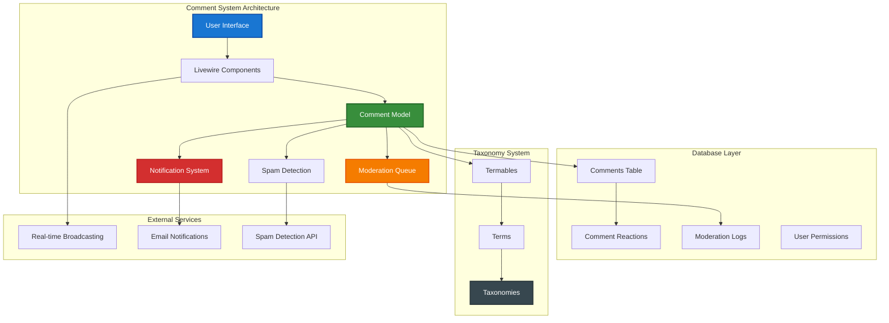

# 1. Spatie Comments System Implementation Guide

**Refactored from:** `.ai/guides/chinook/packages/150-spatie-comments-guide.md` on 2025-07-11

## 1.1 Table of Contents

- [1.2 Overview](#12-overview)
- [1.3 Installation & Configuration](#13-installation--configuration)
- [1.4 Comment System Architecture](#14-comment-system-architecture)
- [1.5 Livewire Integration](#15-livewire-integration)
- [1.6 Moderation Workflows](#16-moderation-workflows)
- [1.7 Notification Systems](#17-notification-systems)
- [1.8 Performance Optimization](#18-performance-optimization)
- [1.9 Testing Strategies](#19-testing-strategies)
- [1.10 Production Deployment](#110-production-deployment)
- [1.11 Best Practices](#111-best-practices)

## 1.2 Overview

Spatie Laravel Comments provides a comprehensive commenting system for Laravel applications with built-in moderation, threading, and Livewire integration. This guide demonstrates how to implement a production-ready comment system with real-time updates, RBAC integration, taxonomy-based categorization, and advanced moderation features using Laravel 12 modern syntax and the aliziodev/laravel-taxonomy package.

### 1.2.1 Key Features

- **Threaded Comments**: Nested comment replies with unlimited depth
- **Moderation System**: Automated and manual moderation workflows
- **Livewire Integration**: Real-time comment posting and updates
- **RBAC Support**: Role-based comment permissions and moderation
- **Spam Prevention**: Built-in spam detection and prevention
- **Notifications**: Real-time notifications for comment activities
- **Performance**: Optimized queries and caching strategies
- **Taxonomy Integration**: Comment categorization using aliziodev/laravel-taxonomy

### 1.2.2 Architecture Overview

**Accessibility Note:** This comment system architecture diagram shows the integration between Spatie Comments and the Chinook system, including Livewire components, moderation workflows, and taxonomy-based categorization. The diagram uses WCAG 2.1 AA compliant colors with high contrast ratios for optimal accessibility.



## 1.3 Installation & Configuration

### 1.3.1 Package Installation

```bash
# Install Spatie Comments packages
composer require spatie/laravel-comments
composer require spatie/laravel-comments-livewire

# Install additional dependencies
composer require spatie/laravel-activitylog
composer require spatie/laravel-permission

# Install taxonomy package (if not already installed)
composer require aliziodev/laravel-taxonomy

# Publish and run migrations
php artisan vendor:publish --provider="Spatie\Comments\CommentsServiceProvider" --tag="comments-migrations"
php artisan vendor:publish --provider="Spatie\Comments\CommentsServiceProvider" --tag="comments-config"
php artisan migrate

# Publish Livewire components
php artisan vendor:publish --provider="Spatie\CommentsLivewire\CommentsLivewireServiceProvider" --tag="comments-livewire-views"
```

### 1.3.2 Configuration Setup

```php
// config/comments.php
return [
    /*
     * The model that will be used for comments.
     */
    'comment_model' => \App\Models\ChinookComment::class,

    /*
     * The model that will be used for comment reactions.
     */
    'reaction_model' => \Spatie\Comments\Models\Reaction::class,

    /*
     * These are the reactions that can be made on a comment.
     */
    'allowed_reactions' => ['👍', '❤️', '😂', '😮', '😢', '😡'],

    /*
     * You can allow guests to post comments.
     */
    'allow_anonymous_comments' => false,

    /*
     * Comments need to be approved before they are shown.
     */
    'automatically_approve_all_comments' => false,

    /*
     * Moderation settings
     */
    'moderation' => [
        'enabled' => env('COMMENTS_MODERATION_ENABLED', true),
        'auto_approve_trusted_users' => true,
        'require_approval_for_new_users' => true,
        'spam_detection_enabled' => true,
        'max_links_per_comment' => 2,
        'blocked_words' => [
            // Add blocked words here
        ],
    ],

    /*
     * Comment threading settings
     */
    'threading' => [
        'enabled' => true,
        'max_depth' => 5,
        'sort_order' => 'created_at', // or 'votes', 'created_at_desc'
    ],

    /*
     * Notification settings
     */
    'notifications' => [
        'enabled' => true,
        'mail' => [
            'from' => [
                'address' => env('MAIL_FROM_ADDRESS', 'comments@chinook.com'),
                'name' => env('MAIL_FROM_NAME', 'Chinook Comments'),
            ],
        ],
    ],

    'models' => [
        'commentator' => App\Models\ChinookUser::class,
        'name' => 'name',
        'avatar' => 'avatar',
        'comment' => App\Models\ChinookComment::class,
        'reaction' => Spatie\Comments\Models\Reaction::class,
        'comment_notification_subscription' => Spatie\Comments\Models\CommentNotificationSubscription::class,
    ],
];
```

### 1.3.3 Laravel 12 Comment Model with Taxonomy Integration

```php
<?php

namespace App\Models;

use Illuminate\Database\Eloquent\Model;
use Illuminate\Database\Eloquent\Relations\BelongsTo;
use Illuminate\Database\Eloquent\Relations\HasMany;
use Illuminate\Database\Eloquent\Relations\MorphTo;
use Illuminate\Database\Eloquent\SoftDeletes;
use Spatie\Comments\Models\Comment as SpatieComment;
use Aliziodev\LaravelTaxonomy\Traits\HasTaxonomy;
use App\Traits\HasUserStamps;
use App\Traits\HasSecondaryUniqueKey;

class ChinookComment extends SpatieComment
{
    use SoftDeletes, HasTaxonomy, HasUserStamps, HasSecondaryUniqueKey;

    protected $table = 'comments';

    protected $fillable = [
        'commentable_type',
        'commentable_id',
        'commentator_id',
        'comment',
        'parent_id',
        'is_approved',
        'is_flagged',
        'spam_score',
        'metadata',
        'sentiment_score',
        'language',
    ];

    protected function casts(): array
    {
        return [
            'is_approved' => 'boolean',
            'is_flagged' => 'boolean',
            'spam_score' => 'float',
            'sentiment_score' => 'float',
            'metadata' => 'array',
            'created_at' => 'datetime',
            'updated_at' => 'datetime',
            'deleted_at' => 'datetime',
        ];
    }

    /**
     * The commentable model (Artist, Album, Track, etc.)
     */
    public function commentable(): MorphTo
    {
        return $this->morphTo();
    }

    /**
     * The user who made the comment
     */
    public function commentator(): BelongsTo
    {
        return $this->belongsTo(ChinookUser::class, 'commentator_id');
    }

    /**
     * Parent comment for threading
     */
    public function parent(): BelongsTo
    {
        return $this->belongsTo(self::class, 'parent_id');
    }

    /**
     * Child comments (replies)
     */
    public function children(): HasMany
    {
        return $this->hasMany(self::class, 'parent_id')
            ->with(['commentator', 'children'])
            ->approved()
            ->orderBy('created_at', 'asc');
    }

    /**
     * All descendants (recursive children)
     */
    public function descendants(): HasMany
    {
        return $this->children()->with('descendants');
    }

    /**
     * Scope for approved comments
     */
    public function scopeApproved($query)
    {
        return $query->where('is_approved', true);
    }

    /**
     * Scope for pending moderation
     */
    public function scopePendingModeration($query)
    {
        return $query->where('is_approved', false)->where('is_flagged', false);
    }

    /**
     * Scope for flagged comments
     */
    public function scopeFlagged($query)
    {
        return $query->where('is_flagged', true);
    }

    /**
     * Scope for comments by sentiment
     */
    public function scopeBySentiment($query, string $sentiment)
    {
        return match ($sentiment) {
            'positive' => $query->where('sentiment_score', '>', 0.1),
            'negative' => $query->where('sentiment_score', '<', -0.1),
            'neutral' => $query->whereBetween('sentiment_score', [-0.1, 0.1]),
            default => $query,
        };
    }

    /**
     * Get comment depth in thread
     */
    public function getDepthAttribute(): int
    {
        $depth = 0;
        $parent = $this->parent;
        
        while ($parent) {
            $depth++;
            $parent = $parent->parent;
        }
        
        return $depth;
    }

    /**
     * Check if comment can be edited by user
     */
    public function canBeEditedBy(ChinookUser $user): bool
    {
        // Comment author can edit within 15 minutes
        if ($this->commentator_id === $user->id) {
            return $this->created_at->diffInMinutes(now()) <= 15;
        }
        
        // Moderators can always edit
        return $user->hasPermissionTo('moderate comments');
    }

    /**
     * Check if comment can be deleted by user
     */
    public function canBeDeletedBy(ChinookUser $user): bool
    {
        // Comment author can delete their own comments
        if ($this->commentator_id === $user->id) {
            return true;
        }
        
        // Moderators can delete any comment
        return $user->hasPermissionTo('moderate comments');
    }

    /**
     * Get comment categories using taxonomy
     */
    public function getCategoriesAttribute(): Collection
    {
        return $this->getTermsByTaxonomy('Comment Categories');
    }

    /**
     * Get comment sentiment label
     */
    public function getSentimentLabelAttribute(): string
    {
        return match (true) {
            $this->sentiment_score > 0.1 => 'Positive',
            $this->sentiment_score < -0.1 => 'Negative',
            default => 'Neutral',
        };
    }

    /**
     * Check if comment is spam based on score
     */
    public function getIsSpamAttribute(): bool
    {
        return $this->spam_score > 0.7;
    }
}
```

### 1.3.4 HasComments Trait for Chinook Models

```php
<?php

namespace App\Traits;

use App\Models\ChinookComment;
use Illuminate\Database\Eloquent\Relations\MorphMany;
use Illuminate\Database\Eloquent\Collection;

trait HasComments
{
    /**
     * Comments relationship
     */
    public function comments(): MorphMany
    {
        return $this->morphMany(ChinookComment::class, 'commentable')
            ->whereNull('parent_id')
            ->with(['commentator', 'children.commentator'])
            ->approved()
            ->orderBy('created_at', 'desc');
    }

    /**
     * All comments including unapproved
     */
    public function allComments(): MorphMany
    {
        return $this->morphMany(ChinookComment::class, 'commentable')
            ->whereNull('parent_id')
            ->with(['commentator', 'children.commentator'])
            ->orderBy('created_at', 'desc');
    }

    /**
     * Comments filtered by taxonomy terms
     */
    public function commentsByCategory(string $categoryName): MorphMany
    {
        return $this->morphMany(ChinookComment::class, 'commentable')
            ->whereHas('terms', function ($query) use ($categoryName) {
                $query->whereHas('taxonomy', function ($taxonomyQuery) {
                    $taxonomyQuery->where('name', 'Comment Categories');
                })->where('name', $categoryName);
            })
            ->approved()
            ->orderBy('created_at', 'desc');
    }

    /**
     * Get total comment count
     */
    public function getTotalCommentsCountAttribute(): int
    {
        return $this->morphMany(ChinookComment::class, 'commentable')
            ->approved()
            ->count();
    }

    /**
     * Get pending comments count
     */
    public function getPendingCommentsCountAttribute(): int
    {
        return $this->morphMany(ChinookComment::class, 'commentable')
            ->pendingModeration()
            ->count();
    }

    /**
     * Get comment sentiment distribution
     */
    public function getCommentSentimentDistribution(): array
    {
        $comments = $this->morphMany(ChinookComment::class, 'commentable')
            ->approved()
            ->get();

        return [
            'positive' => $comments->where('sentiment_score', '>', 0.1)->count(),
            'neutral' => $comments->whereBetween('sentiment_score', [-0.1, 0.1])->count(),
            'negative' => $comments->where('sentiment_score', '<', -0.1)->count(),
        ];
    }

    /**
     * Check if user can comment on this model
     */
    public function canBeCommentedBy(ChinookUser $user): bool
    {
        // Check if user has permission to comment
        if (!$user->hasPermissionTo('create comments')) {
            return false;
        }

        // Check if the model allows comments
        if (property_exists($this, 'comments_enabled') && !$this->comments_enabled) {
            return false;
        }

        // Check if user can access the content based on taxonomy
        if (method_exists($this, 'hasTerms') && $this->hasTerms()) {
            $restrictedTerms = $this->getTermsByTaxonomy('Content Classification')
                ->whereIn('name', ['Restricted', 'Internal']);

            if ($restrictedTerms->isNotEmpty() && !$user->hasRole(['admin', 'manager'])) {
                return false;
            }
        }

        return true;
    }
}
```

## 1.4 Comment System Architecture

### 1.4.1 Chinook Model Integration

```php
<?php

namespace App\Models;

use Illuminate\Database\Eloquent\Model;
use Illuminate\Database\Eloquent\SoftDeletes;
use Aliziodev\LaravelTaxonomy\Traits\HasTaxonomy;
use App\Traits\HasComments;
use App\Traits\HasUserStamps;
use App\Traits\HasSecondaryUniqueKey;
use App\Traits\HasSlug;

class Artist extends Model
{
    use SoftDeletes, HasTaxonomy, HasComments, HasUserStamps, HasSecondaryUniqueKey, HasSlug;

    protected $table = 'chinook_artists';

    protected $fillable = [
        'name',
        'biography',
        'website',
        'is_active',
        'comments_enabled',
        'metadata',
    ];

    protected function casts(): array
    {
        return [
            'is_active' => 'boolean',
            'comments_enabled' => 'boolean',
            'metadata' => 'array',
            'created_at' => 'datetime',
            'updated_at' => 'datetime',
            'deleted_at' => 'datetime',
        ];
    }

    /**
     * Override comment permission check for artists
     */
    public function canBeCommentedBy(ChinookUser $user): bool
    {
        // Check base permissions
        if (!parent::canBeCommentedBy($user)) {
            return false;
        }

        // Artists must be active to receive comments
        if (!$this->is_active) {
            return $user->hasRole(['admin', 'manager']);
        }

        // Check if user can access artist's genres
        $artistGenres = $this->getTermsByTaxonomy('Genres');
        if ($artistGenres->isNotEmpty()) {
            foreach ($artistGenres as $genre) {
                if (!$user->canAccessTaxonomyTerm('Genres', $genre->name)) {
                    return false;
                }
            }
        }

        return true;
    }

    /**
     * Get featured comments for this artist
     */
    public function getFeaturedComments(int $limit = 5): Collection
    {
        return $this->comments()
            ->whereHas('terms', function ($query) {
                $query->whereHas('taxonomy', function ($taxonomyQuery) {
                    $taxonomyQuery->where('name', 'Comment Categories');
                })->where('name', 'Featured');
            })
            ->limit($limit)
            ->get();
    }
}
```

### 1.4.2 Comment Moderation Service

```php
<?php

namespace App\Services;

use App\Models\ChinookComment;
use App\Models\ChinookUser;
use Aliziodev\LaravelTaxonomy\Models\Term;
use Illuminate\Support\Facades\Cache;

class CommentModerationService
{
    /**
     * Queue comment for moderation
     */
    public function queueForModeration(ChinookComment $comment): void
    {
        // Add to moderation queue
        $comment->update(['is_approved' => false]);

        // Categorize comment for moderation
        $this->categorizeComment($comment);

        // Notify moderators
        $this->notifyModerators($comment);
    }

    /**
     * Approve comment
     */
    public function approveComment(ChinookComment $comment, ChinookUser $moderator): bool
    {
        $comment->update([
            'is_approved' => true,
            'is_flagged' => false,
            'moderated_by' => $moderator->id,
            'moderated_at' => now(),
        ]);

        // Add approval category
        $approvedTerm = $this->getOrCreateModerationTerm('Approved');
        $comment->attachTerm($approvedTerm);

        // Send notifications
        $this->sendApprovalNotifications($comment);

        return true;
    }

    /**
     * Reject comment
     */
    public function rejectComment(ChinookComment $comment, ChinookUser $moderator, string $reason = null): bool
    {
        $comment->update([
            'is_approved' => false,
            'is_flagged' => true,
            'moderated_by' => $moderator->id,
            'moderated_at' => now(),
            'rejection_reason' => $reason,
        ]);

        // Add rejection category
        $rejectedTerm = $this->getOrCreateModerationTerm('Rejected');
        $comment->attachTerm($rejectedTerm);

        // Send notifications
        $this->sendRejectionNotifications($comment, $reason);

        return true;
    }

    /**
     * Automatically categorize comment based on content
     */
    private function categorizeComment(ChinookComment $comment): void
    {
        $content = strtolower($comment->comment);

        // Sentiment-based categorization
        if ($comment->sentiment_score > 0.5) {
            $positiveTerm = $this->getOrCreateCommentTerm('Positive Feedback');
            $comment->attachTerm($positiveTerm);
        } elseif ($comment->sentiment_score < -0.5) {
            $negativeTerm = $this->getOrCreateCommentTerm('Negative Feedback');
            $comment->attachTerm($negativeTerm);
        }

        // Content-based categorization
        if (str_contains($content, 'question') || str_contains($content, '?')) {
            $questionTerm = $this->getOrCreateCommentTerm('Question');
            $comment->attachTerm($questionTerm);
        }

        if (str_contains($content, 'suggestion') || str_contains($content, 'recommend')) {
            $suggestionTerm = $this->getOrCreateCommentTerm('Suggestion');
            $comment->attachTerm($suggestionTerm);
        }

        // Music-specific categorization
        $musicKeywords = ['song', 'album', 'track', 'music', 'lyrics', 'melody', 'rhythm'];
        foreach ($musicKeywords as $keyword) {
            if (str_contains($content, $keyword)) {
                $musicTerm = $this->getOrCreateCommentTerm('Music Discussion');
                $comment->attachTerm($musicTerm);
                break;
            }
        }
    }

    /**
     * Get or create moderation taxonomy term
     */
    private function getOrCreateModerationTerm(string $termName): Term
    {
        $taxonomy = \Aliziodev\LaravelTaxonomy\Models\Taxonomy::firstOrCreate([
            'name' => 'Moderation Status'
        ]);

        return Term::firstOrCreate([
            'name' => $termName,
            'taxonomy_id' => $taxonomy->id,
        ]);
    }

    /**
     * Get or create comment category term
     */
    private function getOrCreateCommentTerm(string $termName): Term
    {
        $taxonomy = \Aliziodev\LaravelTaxonomy\Models\Taxonomy::firstOrCreate([
            'name' => 'Comment Categories'
        ]);

        return Term::firstOrCreate([
            'name' => $termName,
            'taxonomy_id' => $taxonomy->id,
        ]);
    }

    /**
     * Check if user should be auto-approved
     */
    public function shouldAutoApprove(ChinookUser $user, float $spamScore): bool
    {
        // Super admin and admin always auto-approved
        if ($user->hasRole(['super-admin', 'admin'])) {
            return true;
        }

        // High spam score = no auto-approval
        if ($spamScore > 0.7) {
            return false;
        }

        // Trusted users with good history
        if ($user->hasRole(['manager', 'editor'])) {
            return true;
        }

        // Check user's comment history
        $userCommentStats = $this->getUserCommentStats($user);

        return $userCommentStats['approval_rate'] > 0.8 &&
               $userCommentStats['total_comments'] > 5;
    }

    /**
     * Get user comment statistics
     */
    private function getUserCommentStats(ChinookUser $user): array
    {
        $cacheKey = "user_comment_stats_{$user->id}";

        return Cache::remember($cacheKey, 3600, function () use ($user) {
            $totalComments = ChinookComment::where('commentator_id', $user->id)->count();
            $approvedComments = ChinookComment::where('commentator_id', $user->id)
                ->where('is_approved', true)
                ->count();

            return [
                'total_comments' => $totalComments,
                'approved_comments' => $approvedComments,
                'approval_rate' => $totalComments > 0 ? $approvedComments / $totalComments : 0,
            ];
        });
    }

    /**
     * Notify moderators of pending comment
     */
    private function notifyModerators(ChinookComment $comment): void
    {
        $moderators = ChinookUser::role(['admin', 'manager'])->get();

        foreach ($moderators as $moderator) {
            $moderator->notify(new \App\Notifications\CommentPendingModeration($comment));
        }
    }

    /**
     * Send approval notifications
     */
    private function sendApprovalNotifications(ChinookComment $comment): void
    {
        // Notify comment author
        $comment->commentator->notify(new \App\Notifications\CommentApproved($comment));

        // Notify other commenters on the same content
        $this->notifyOtherCommenters($comment);
    }

    /**
     * Send rejection notifications
     */
    private function sendRejectionNotifications(ChinookComment $comment, ?string $reason): void
    {
        $comment->commentator->notify(new \App\Notifications\CommentRejected($comment, $reason));
    }

    /**
     * Notify other commenters on the same content
     */
    private function notifyOtherCommenters(ChinookComment $comment): void
    {
        $otherCommenters = ChinookComment::where('commentable_type', $comment->commentable_type)
            ->where('commentable_id', $comment->commentable_id)
            ->where('commentator_id', '!=', $comment->commentator_id)
            ->where('is_approved', true)
            ->with('commentator')
            ->get()
            ->pluck('commentator')
            ->unique('id');

        foreach ($otherCommenters as $commenter) {
            $commenter->notify(new \App\Notifications\NewCommentOnContent($comment));
        }
    }
}
```

## 1.5 Livewire Integration

### 1.5.1 Comment Component with Taxonomy

```php
<?php

namespace App\Livewire;

use App\Models\ChinookComment;
use App\Models\ChinookUser;
use App\Services\CommentModerationService;
use App\Services\SpamDetectionService;
use Illuminate\Database\Eloquent\Model;
use Illuminate\Support\Facades\Auth;
use Livewire\Component;
use Livewire\Attributes\Validate;
use Aliziodev\LaravelTaxonomy\Models\Term;

class CommentSection extends Component
{
    public Model $commentable;
    public ?ChinookComment $parentComment = null;
    public $comments;

    #[Validate('required|string|min:3|max:1000')]
    public string $newComment = '';

    #[Validate('array')]
    public array $selectedCategories = [];

    public bool $showReplyForm = false;
    public ?int $replyingTo = null;
    public string $sortOrder = 'newest';
    public string $filterCategory = 'all';

    protected $listeners = [
        'commentAdded' => 'refreshComments',
        'commentModerated' => 'refreshComments',
    ];

    public function mount(Model $commentable): void
    {
        $this->commentable = $commentable;
        $this->loadComments();
    }

    public function render()
    {
        return view('livewire.comment-section', [
            'availableCategories' => $this->getAvailableCategories(),
            'canComment' => $this->canUserComment(),
        ]);
    }

    public function addComment(): void
    {
        $this->validate();

        $user = Auth::user();

        if (!$this->canUserComment()) {
            $this->addError('newComment', 'You do not have permission to comment.');
            return;
        }

        // Spam detection
        $spamScore = app(SpamDetectionService::class)->analyzeComment($this->newComment, $user);

        // Create comment
        $comment = ChinookComment::create([
            'commentable_type' => get_class($this->commentable),
            'commentable_id' => $this->commentable->id,
            'commentator_id' => $user->id,
            'comment' => $this->newComment,
            'parent_id' => $this->parentComment?->id,
            'is_approved' => app(CommentModerationService::class)->shouldAutoApprove($user, $spamScore),
            'spam_score' => $spamScore,
            'sentiment_score' => app(SpamDetectionService::class)->analyzeSentiment($this->newComment),
            'metadata' => [
                'ip_address' => request()->ip(),
                'user_agent' => request()->userAgent(),
            ],
        ]);

        // Attach selected categories
        if (!empty($this->selectedCategories)) {
            foreach ($this->selectedCategories as $categoryId) {
                $term = Term::find($categoryId);
                if ($term) {
                    $comment->attachTerm($term);
                }
            }
        }

        // Queue for moderation if needed
        if (!$comment->is_approved) {
            app(CommentModerationService::class)->queueForModeration($comment);
        }

        // Reset form
        $this->reset(['newComment', 'selectedCategories', 'showReplyForm', 'replyingTo']);

        // Refresh comments
        $this->loadComments();

        // Emit event for real-time updates
        $this->dispatch('commentAdded', $comment->id);

        // Show success message
        if ($comment->is_approved) {
            session()->flash('message', 'Comment posted successfully!');
        } else {
            session()->flash('message', 'Comment submitted for moderation.');
        }
    }

    public function toggleReply(int $commentId): void
    {
        if ($this->replyingTo === $commentId) {
            $this->reset(['showReplyForm', 'replyingTo', 'newComment']);
        } else {
            $this->showReplyForm = true;
            $this->replyingTo = $commentId;
            $this->parentComment = ChinookComment::find($commentId);
            $this->newComment = '';
        }
    }

    public function deleteComment(int $commentId): void
    {
        $comment = ChinookComment::find($commentId);
        $user = Auth::user();

        if (!$comment || !$comment->canBeDeletedBy($user)) {
            $this->addError('general', 'You do not have permission to delete this comment.');
            return;
        }

        $comment->delete();
        $this->loadComments();

        session()->flash('message', 'Comment deleted successfully.');
    }

    public function flagComment(int $commentId): void
    {
        $comment = ChinookComment::find($commentId);

        if (!$comment) {
            return;
        }

        $comment->update(['is_flagged' => true]);

        // Add flagged category
        $flaggedTerm = Term::whereHas('taxonomy', function ($query) {
            $query->where('name', 'Moderation Status');
        })->where('name', 'Flagged')->first();

        if ($flaggedTerm) {
            $comment->attachTerm($flaggedTerm);
        }

        session()->flash('message', 'Comment flagged for review.');
    }

    public function changeSortOrder(string $order): void
    {
        $this->sortOrder = $order;
        $this->loadComments();
    }

    public function filterByCategory(string $category): void
    {
        $this->filterCategory = $category;
        $this->loadComments();
    }

    private function loadComments(): void
    {
        $query = $this->commentable->comments();

        // Apply category filter
        if ($this->filterCategory !== 'all') {
            $query->whereHas('terms', function ($termQuery) {
                $termQuery->whereHas('taxonomy', function ($taxonomyQuery) {
                    $taxonomyQuery->where('name', 'Comment Categories');
                })->where('name', $this->filterCategory);
            });
        }

        // Apply sorting
        switch ($this->sortOrder) {
            case 'oldest':
                $query->orderBy('created_at', 'asc');
                break;
            case 'most_liked':
                $query->withCount('reactions')->orderBy('reactions_count', 'desc');
                break;
            default: // newest
                $query->orderBy('created_at', 'desc');
                break;
        }

        $this->comments = $query->get();
    }

    private function canUserComment(): bool
    {
        $user = Auth::user();

        if (!$user) {
            return false;
        }

        return $this->commentable->canBeCommentedBy($user);
    }

    private function getAvailableCategories(): array
    {
        $taxonomy = \Aliziodev\LaravelTaxonomy\Models\Taxonomy::where('name', 'Comment Categories')->first();

        if (!$taxonomy) {
            return [];
        }

        return $taxonomy->terms()
            ->whereIn('name', ['General', 'Question', 'Suggestion', 'Review', 'Technical'])
            ->get()
            ->map(function ($term) {
                return [
                    'id' => $term->id,
                    'name' => $term->name,
                    'description' => $term->description ?? '',
                ];
            })
            ->toArray();
    }

    public function refreshComments(): void
    {
        $this->loadComments();
    }
}
```

### 1.5.2 Comment Display Component

```php
<?php

namespace App\Livewire;

use App\Models\ChinookComment;
use App\Models\ChinookUser;
use Livewire\Component;
use Illuminate\Support\Facades\Auth;

class CommentDisplay extends Component
{
    public ChinookComment $comment;
    public bool $showReplies = false;
    public bool $isEditing = false;
    public string $editContent = '';

    public function mount(ChinookComment $comment): void
    {
        $this->comment = $comment;
        $this->editContent = $comment->comment;
    }

    public function render()
    {
        return view('livewire.comment-display', [
            'canEdit' => $this->canEdit(),
            'canDelete' => $this->canDelete(),
            'canModerate' => $this->canModerate(),
        ]);
    }

    public function toggleReplies(): void
    {
        $this->showReplies = !$this->showReplies;
    }

    public function startEditing(): void
    {
        if (!$this->canEdit()) {
            return;
        }

        $this->isEditing = true;
        $this->editContent = $this->comment->comment;
    }

    public function saveEdit(): void
    {
        if (!$this->canEdit()) {
            return;
        }

        $this->validate([
            'editContent' => 'required|string|min:3|max:1000',
        ]);

        $this->comment->update([
            'comment' => $this->editContent,
            'updated_at' => now(),
        ]);

        $this->isEditing = false;

        session()->flash('message', 'Comment updated successfully.');
    }

    public function cancelEdit(): void
    {
        $this->isEditing = false;
        $this->editContent = $this->comment->comment;
    }

    public function addReaction(string $emoji): void
    {
        $user = Auth::user();

        if (!$user) {
            return;
        }

        // Check if user already reacted with this emoji
        $existingReaction = $this->comment->reactions()
            ->where('user_id', $user->id)
            ->where('reaction', $emoji)
            ->first();

        if ($existingReaction) {
            // Remove reaction if it exists
            $existingReaction->delete();
        } else {
            // Add new reaction
            $this->comment->reactions()->create([
                'user_id' => $user->id,
                'reaction' => $emoji,
            ]);
        }

        // Refresh comment to update reaction counts
        $this->comment = $this->comment->fresh(['reactions']);
    }

    private function canEdit(): bool
    {
        $user = Auth::user();

        if (!$user) {
            return false;
        }

        return $this->comment->canBeEditedBy($user);
    }

    private function canDelete(): bool
    {
        $user = Auth::user();

        if (!$user) {
            return false;
        }

        return $this->comment->canBeDeletedBy($user);
    }

    private function canModerate(): bool
    {
        $user = Auth::user();

        if (!$user) {
            return false;
        }

        return $user->hasPermissionTo('moderate comments');
    }
}
```

## 1.6 Moderation Workflows

### 1.6.1 Moderation Dashboard Component

```php
<?php

namespace App\Livewire\Admin;

use App\Models\ChinookComment;
use App\Services\CommentModerationService;
use Livewire\Component;
use Livewire\WithPagination;
use Illuminate\Support\Facades\Auth;

class ModerationDashboard extends Component
{
    use WithPagination;

    public string $filter = 'pending';
    public string $search = '';
    public string $categoryFilter = 'all';
    public array $selectedComments = [];
    public bool $selectAll = false;

    protected $queryString = ['filter', 'search', 'categoryFilter'];

    public function render()
    {
        return view('livewire.admin.moderation-dashboard', [
            'comments' => $this->getComments(),
            'stats' => $this->getModerationStats(),
            'categories' => $this->getCommentCategories(),
        ]);
    }

    public function updatedSelectAll(): void
    {
        if ($this->selectAll) {
            $this->selectedComments = $this->getComments()->pluck('id')->toArray();
        } else {
            $this->selectedComments = [];
        }
    }

    public function approveComment(int $commentId): void
    {
        $comment = ChinookComment::find($commentId);
        $moderator = Auth::user();

        if ($comment && $moderator->hasPermissionTo('moderate comments')) {
            app(CommentModerationService::class)->approveComment($comment, $moderator);
            session()->flash('message', 'Comment approved successfully.');
        }
    }

    public function rejectComment(int $commentId, string $reason = ''): void
    {
        $comment = ChinookComment::find($commentId);
        $moderator = Auth::user();

        if ($comment && $moderator->hasPermissionTo('moderate comments')) {
            app(CommentModerationService::class)->rejectComment($comment, $moderator, $reason);
            session()->flash('message', 'Comment rejected successfully.');
        }
    }

    public function bulkApprove(): void
    {
        $moderator = Auth::user();

        if (!$moderator->hasPermissionTo('moderate comments')) {
            return;
        }

        $comments = ChinookComment::whereIn('id', $this->selectedComments)->get();
        $moderationService = app(CommentModerationService::class);

        foreach ($comments as $comment) {
            $moderationService->approveComment($comment, $moderator);
        }

        $this->selectedComments = [];
        $this->selectAll = false;

        session()->flash('message', count($comments) . ' comments approved successfully.');
    }

    public function bulkReject(string $reason = ''): void
    {
        $moderator = Auth::user();

        if (!$moderator->hasPermissionTo('moderate comments')) {
            return;
        }

        $comments = ChinookComment::whereIn('id', $this->selectedComments)->get();
        $moderationService = app(CommentModerationService::class);

        foreach ($comments as $comment) {
            $moderationService->rejectComment($comment, $moderator, $reason);
        }

        $this->selectedComments = [];
        $this->selectAll = false;

        session()->flash('message', count($comments) . ' comments rejected successfully.');
    }

    private function getComments()
    {
        $query = ChinookComment::with(['commentator', 'commentable', 'terms.taxonomy']);

        // Apply filters
        switch ($this->filter) {
            case 'pending':
                $query->pendingModeration();
                break;
            case 'flagged':
                $query->flagged();
                break;
            case 'approved':
                $query->approved();
                break;
            case 'rejected':
                $query->where('is_flagged', true)->where('is_approved', false);
                break;
        }

        // Apply search
        if ($this->search) {
            $query->where(function ($q) {
                $q->where('comment', 'like', '%' . $this->search . '%')
                  ->orWhereHas('commentator', function ($userQuery) {
                      $userQuery->where('name', 'like', '%' . $this->search . '%');
                  });
            });
        }

        // Apply category filter
        if ($this->categoryFilter !== 'all') {
            $query->whereHas('terms', function ($termQuery) {
                $termQuery->whereHas('taxonomy', function ($taxonomyQuery) {
                    $taxonomyQuery->where('name', 'Comment Categories');
                })->where('name', $this->categoryFilter);
            });
        }

        return $query->orderBy('created_at', 'desc')->paginate(20);
    }

    private function getModerationStats(): array
    {
        return [
            'pending' => ChinookComment::pendingModeration()->count(),
            'flagged' => ChinookComment::flagged()->count(),
            'approved_today' => ChinookComment::approved()
                ->whereDate('moderated_at', today())
                ->count(),
            'rejected_today' => ChinookComment::where('is_flagged', true)
                ->where('is_approved', false)
                ->whereDate('moderated_at', today())
                ->count(),
        ];
    }

    private function getCommentCategories(): array
    {
        $taxonomy = \Aliziodev\LaravelTaxonomy\Models\Taxonomy::where('name', 'Comment Categories')->first();

        if (!$taxonomy) {
            return [];
        }

        return $taxonomy->terms->pluck('name', 'name')->toArray();
    }
}
```

## 1.7 Notification Systems

### 1.7.1 Comment Notifications

```php
<?php

namespace App\Notifications;

use App\Models\ChinookComment;
use Illuminate\Bus\Queueable;
use Illuminate\Contracts\Queue\ShouldQueue;
use Illuminate\Notifications\Messages\MailMessage;
use Illuminate\Notifications\Notification;

class CommentApproved extends Notification implements ShouldQueue
{
    use Queueable;

    public function __construct(
        private ChinookComment $comment
    ) {}

    public function via($notifiable): array
    {
        return ['mail', 'database'];
    }

    public function toMail($notifiable): MailMessage
    {
        return (new MailMessage)
            ->subject('Your comment has been approved')
            ->greeting('Hello ' . $notifiable->name . '!')
            ->line('Your comment on "' . $this->comment->commentable->name . '" has been approved and is now visible to other users.')
            ->line('Comment: "' . \Str::limit($this->comment->comment, 100) . '"')
            ->action('View Comment', $this->getCommentUrl())
            ->line('Thank you for contributing to our community!');
    }

    public function toArray($notifiable): array
    {
        return [
            'type' => 'comment_approved',
            'comment_id' => $this->comment->id,
            'commentable_type' => $this->comment->commentable_type,
            'commentable_id' => $this->comment->commentable_id,
            'message' => 'Your comment has been approved',
        ];
    }

    private function getCommentUrl(): string
    {
        // Generate URL based on commentable type
        return match ($this->comment->commentable_type) {
            'App\Models\Artist' => route('artists.show', $this->comment->commentable->slug) . '#comment-' . $this->comment->id,
            'App\Models\Album' => route('albums.show', $this->comment->commentable->slug) . '#comment-' . $this->comment->id,
            'App\Models\Track' => route('tracks.show', $this->comment->commentable->slug) . '#comment-' . $this->comment->id,
            default => route('home'),
        };
    }
}
```

## 1.8 Performance Optimization

### 1.8.1 Comment Caching Service

```php
<?php

namespace App\Services;

use App\Models\ChinookComment;
use Illuminate\Support\Facades\Cache;
use Illuminate\Database\Eloquent\Model;

class CommentCacheService
{
    private const CACHE_TTL = 3600; // 1 hour

    /**
     * Cache comments for a commentable model
     */
    public function getCachedComments(Model $commentable, array $options = []): Collection
    {
        $cacheKey = $this->generateCacheKey($commentable, $options);

        return Cache::remember($cacheKey, self::CACHE_TTL, function () use ($commentable, $options) {
            $query = $commentable->comments();

            // Apply filters from options
            if (isset($options['category'])) {
                $query->whereHas('terms', function ($termQuery) use ($options) {
                    $termQuery->where('name', $options['category']);
                });
            }

            if (isset($options['sort'])) {
                switch ($options['sort']) {
                    case 'oldest':
                        $query->orderBy('created_at', 'asc');
                        break;
                    case 'most_liked':
                        $query->withCount('reactions')->orderBy('reactions_count', 'desc');
                        break;
                    default:
                        $query->orderBy('created_at', 'desc');
                        break;
                }
            }

            return $query->get();
        });
    }

    /**
     * Clear comment cache for a model
     */
    public function clearCommentCache(Model $commentable): void
    {
        $pattern = "comments_{$commentable->getMorphClass()}_{$commentable->id}_*";
        $this->clearCacheByPattern($pattern);
    }

    /**
     * Clear cache when comment is created/updated/deleted
     */
    public function clearCommentCacheOnChange(ChinookComment $comment): void
    {
        $this->clearCommentCache($comment->commentable);

        // Also clear parent comment cache if this is a reply
        if ($comment->parent_id) {
            $parentComment = ChinookComment::find($comment->parent_id);
            if ($parentComment) {
                $this->clearCommentCache($parentComment->commentable);
            }
        }
    }

    /**
     * Generate cache key for comments
     */
    private function generateCacheKey(Model $commentable, array $options): string
    {
        $optionsHash = md5(serialize($options));
        return "comments_{$commentable->getMorphClass()}_{$commentable->id}_{$optionsHash}";
    }

    /**
     * Clear cache by pattern (implementation depends on cache driver)
     */
    private function clearCacheByPattern(string $pattern): void
    {
        // For Redis cache driver
        if (config('cache.default') === 'redis') {
            $redis = Cache::getRedis();
            $keys = $redis->keys($pattern);
            if (!empty($keys)) {
                $redis->del($keys);
            }
        }

        // For other cache drivers, you might need different implementations
    }
}
```

## 1.9 Testing Strategies

### 1.9.1 Comment System Tests with Pest

```php
<?php

use App\Models\ChinookUser;
use App\Models\Artist;
use App\Models\ChinookComment;
use App\Services\CommentModerationService;
use Aliziodev\LaravelTaxonomy\Models\Taxonomy;
use Aliziodev\LaravelTaxonomy\Models\Term;

describe('Comment System with Taxonomy Integration', function () {
    beforeEach(function () {
        // Create test taxonomies
        $this->commentTaxonomy = Taxonomy::create(['name' => 'Comment Categories']);
        $this->generalTerm = Term::create([
            'name' => 'General',
            'taxonomy_id' => $this->commentTaxonomy->id,
        ]);

        $this->moderationTaxonomy = Taxonomy::create(['name' => 'Moderation Status']);
        $this->approvedTerm = Term::create([
            'name' => 'Approved',
            'taxonomy_id' => $this->moderationTaxonomy->id,
        ]);
    });

    it('allows users to post comments on artists', function () {
        $user = ChinookUser::factory()->create();
        $artist = Artist::factory()->create(['comments_enabled' => true]);

        $comment = ChinookComment::create([
            'commentable_type' => Artist::class,
            'commentable_id' => $artist->id,
            'commentator_id' => $user->id,
            'comment' => 'Great artist!',
            'is_approved' => true,
        ]);

        expect($comment->commentable)->toBeInstanceOf(Artist::class);
        expect($comment->commentator)->toBeInstanceOf(ChinookUser::class);
        expect($artist->comments)->toHaveCount(1);
    });

    it('categorizes comments using taxonomy', function () {
        $user = ChinookUser::factory()->create();
        $artist = Artist::factory()->create();

        $comment = ChinookComment::create([
            'commentable_type' => Artist::class,
            'commentable_id' => $artist->id,
            'commentator_id' => $user->id,
            'comment' => 'Great artist!',
            'is_approved' => true,
        ]);

        $comment->attachTerm($this->generalTerm);

        expect($comment->getTermsByTaxonomy('Comment Categories'))->toHaveCount(1);
        expect($comment->getTermsByTaxonomy('Comment Categories')->first()->name)->toBe('General');
    });

    it('handles comment moderation workflow', function () {
        $user = ChinookUser::factory()->create();
        $moderator = ChinookUser::factory()->create();
        $moderator->givePermissionTo('moderate comments');

        $artist = Artist::factory()->create();

        $comment = ChinookComment::create([
            'commentable_type' => Artist::class,
            'commentable_id' => $artist->id,
            'commentator_id' => $user->id,
            'comment' => 'Test comment',
            'is_approved' => false,
        ]);

        $moderationService = app(CommentModerationService::class);
        $moderationService->approveComment($comment, $moderator);

        $comment->refresh();
        expect($comment->is_approved)->toBeTrue();
        expect($comment->moderated_by)->toBe($moderator->id);
    });

    it('supports threaded comments', function () {
        $user = ChinookUser::factory()->create();
        $artist = Artist::factory()->create();

        $parentComment = ChinookComment::create([
            'commentable_type' => Artist::class,
            'commentable_id' => $artist->id,
            'commentator_id' => $user->id,
            'comment' => 'Parent comment',
            'is_approved' => true,
        ]);

        $replyComment = ChinookComment::create([
            'commentable_type' => Artist::class,
            'commentable_id' => $artist->id,
            'commentator_id' => $user->id,
            'comment' => 'Reply comment',
            'parent_id' => $parentComment->id,
            'is_approved' => true,
        ]);

        expect($replyComment->parent)->toBeInstanceOf(ChinookComment::class);
        expect($parentComment->children)->toHaveCount(1);
        expect($replyComment->depth)->toBe(1);
    });

    it('enforces permission-based commenting', function () {
        $user = ChinookUser::factory()->create();
        $artist = Artist::factory()->create(['comments_enabled' => false]);

        expect($artist->canBeCommentedBy($user))->toBeFalse();

        $artist->update(['comments_enabled' => true]);
        $user->givePermissionTo('create comments');

        expect($artist->canBeCommentedBy($user))->toBeTrue();
    });
});
```

## 1.10 Production Deployment

### 1.10.1 Comment System Monitoring

```php
<?php

namespace App\Console\Commands;

use App\Models\ChinookComment;
use Illuminate\Console\Command;

class CommentSystemHealth extends Command
{
    protected $signature = 'comments:health-check';
    protected $description = 'Check comment system health and performance';

    public function handle(): int
    {
        $this->info('Checking comment system health...');

        // Check moderation queue
        $pendingCount = ChinookComment::pendingModeration()->count();
        $flaggedCount = ChinookComment::flagged()->count();

        $this->table(['Metric', 'Count'], [
            ['Pending Moderation', $pendingCount],
            ['Flagged Comments', $flaggedCount],
            ['Total Comments', ChinookComment::count()],
            ['Approved Comments', ChinookComment::approved()->count()],
        ]);

        // Check for orphaned comments
        $orphanedComments = ChinookComment::whereDoesntHave('commentable')->count();
        if ($orphanedComments > 0) {
            $this->warn("Found {$orphanedComments} orphaned comments");
        }

        // Check comment performance
        $this->checkCommentPerformance();

        $this->info('Comment system health check completed.');
        return 0;
    }

    private function checkCommentPerformance(): void
    {
        $avgResponseTime = ChinookComment::selectRaw('AVG(TIMESTAMPDIFF(SECOND, created_at, moderated_at)) as avg_time')
            ->whereNotNull('moderated_at')
            ->whereDate('created_at', '>=', now()->subDays(7))
            ->value('avg_time');

        if ($avgResponseTime) {
            $this->info("Average moderation response time: " . round($avgResponseTime / 3600, 2) . " hours");
        }
    }
}
```

## 1.11 Best Practices

### 1.11.1 Comment System Guidelines

- **Enable moderation by default**: Protect your community from spam and inappropriate content
- **Use taxonomy for organization**: Categorize comments for better filtering and management
- **Implement rate limiting**: Prevent comment spam and abuse
- **Cache frequently accessed comments**: Improve performance for popular content
- **Monitor sentiment and engagement**: Use analytics to understand community health
- **Provide clear moderation guidelines**: Help users understand community standards

### 1.11.2 Performance Considerations

- **Paginate comment lists**: Don't load all comments at once
- **Use eager loading**: Load related data efficiently
- **Implement comment caching**: Cache comment trees and counts
- **Optimize database queries**: Use proper indexes and query optimization
- **Consider comment archiving**: Archive old comments to maintain performance

### 1.11.3 Security Best Practices

- **Validate all input**: Sanitize and validate comment content
- **Implement CSRF protection**: Protect against cross-site request forgery
- **Use rate limiting**: Prevent abuse and spam
- **Monitor for suspicious activity**: Detect and prevent malicious behavior
- **Implement proper authorization**: Ensure users can only perform allowed actions

---

**Next**: [Spatie ActivityLog Guide](160-spatie-activitylog-guide.md) | **Previous**: [Spatie Permission Guide](140-spatie-permission-guide.md)

---

*This guide demonstrates comprehensive comment system implementation for the Chinook system using Spatie Comments with Laravel 12, aliziodev/laravel-taxonomy integration, and modern community management patterns.*

[⬆️ Back to Top](#1-spatie-comments-system-implementation-guide)
