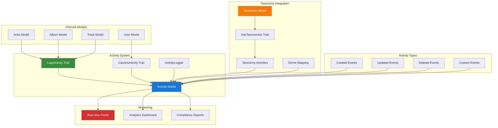

# 1. Spatie ActivityLog Implementation Guide

## Table of Contents

- [1. Overview](#1-overview)
- [2. Installation & Configuration](#2-installation--configuration)
- [3. Basic Activity Logging](#3-basic-activity-logging)
- [4. Advanced Logging Patterns](#4-advanced-logging-patterns)
- [5. Chinook Integration](#5-chinook-integration)
- [6. Custom Activity Models](#6-custom-activity-models)
- [7. Performance Optimization](#7-performance-optimization)
- [8. Security & Compliance](#8-security--compliance)
- [9. Real-time Activity Monitoring](#9-real-time-activity-monitoring)
- [10. Testing Strategies](#10-testing-strategies)
- [11. Production Deployment](#11-production-deployment)
- [12. Best Practices](#12-best-practices)

## 1. Overview

Spatie Laravel ActivityLog provides comprehensive audit logging capabilities for Laravel applications. This guide demonstrates enterprise-grade implementation patterns for the Chinook music database with advanced activity tracking, compliance features, and Laravel 12 modern syntax.

### 1.1 Key Features

- **Comprehensive Audit Trails**: Track all model changes and user actions
- **Custom Activity Types**: Define application-specific activity logging
- **Performance Optimized**: Efficient logging with minimal performance impact
- **Security Compliant**: GDPR, SOX, and enterprise compliance features
- **Real-time Monitoring**: Live activity feeds and notifications
- **Advanced Analytics**: Activity reporting and trend analysis
- **Taxonomy Integration**: Seamless integration with aliziodev/laravel-taxonomy for categorized activity logging

### 1.2 Architecture Overview



### 1.3 Taxonomy-Enhanced Activity Logging

The integration with aliziodev/laravel-taxonomy enables sophisticated activity categorization and filtering:

- **Genre-based Activity Grouping**: Activities can be categorized by music genres
- **Hierarchical Activity Organization**: Support for nested activity categories
- **Advanced Filtering**: Query activities by taxonomy relationships
- **Compliance Reporting**: Generate reports based on activity taxonomies

## 2. Installation & Configuration

### 2.1 Package Installation

```bash
# Install Spatie ActivityLog package
composer require spatie/laravel-activitylog

# Publish and run migrations
php artisan vendor:publish --provider="Spatie\Activitylog\ActivitylogServiceProvider" --tag="activitylog-migrations"
php artisan migrate

# Publish configuration (optional)
php artisan vendor:publish --provider="Spatie\Activitylog\ActivitylogServiceProvider" --tag="activitylog-config"
```

### 2.2 Configuration Setup

```php
// config/activitylog.php
<?php

return [
    /*
     * If set to false, no activities will be saved to the database.
     */
    'enabled' => env('ACTIVITY_LOGGER_ENABLED', true),

    /*
     * When the clean-command is executed, all recording activities older than
     * the number of days specified here will be deleted.
     */
    'delete_records_older_than_days' => 365,

    /*
     * If no log name is passed to the activity() helper
     * we use this default log name.
     */
    'default_log_name' => 'default',

    /*
     * You can specify an auth driver here that gets user models.
     */
    'default_auth_driver' => null,

    /*
     * If set to true, the subject returns soft deleted models.
     */
    'subject_returns_soft_deleted_models' => false,

    /*
     * This model will be used to log activity.
     */
    'activity_model' => Spatie\Activitylog\Models\Activity::class,

    /*
     * This is the name of the table that will be created by the migration and
     * used by the Activity model shipped with this package.
     */
    'table_name' => 'activity_log',

    /*
     * This is the database connection that will be used by the migration and
     * the Activity model shipped with this package.
     */
    'database_connection' => env('ACTIVITY_LOGGER_DB_CONNECTION'),
];
```

### 2.3 Laravel 12 Model Integration

```php
<?php

namespace App\Models;

use Illuminate\Database\Eloquent\Model;
use Illuminate\Database\Eloquent\SoftDeletes;
use Spatie\Activitylog\LogOptions;
use Spatie\Activitylog\Traits\LogsActivity;
use Aliziodev\LaravelTaxonomy\Traits\HasTaxonomies;

class Artist extends Model
{
    use LogsActivity, SoftDeletes, HasTaxonomies;

    protected $fillable = [
        'public_id',
        'name',
        'biography',
        'website',
        'country',
        'formed_year',
        'is_active',
    ];

    /**
     * Laravel 12 modern casts() method
     */
    protected function casts(): array
    {
        return [
            'formed_year' => 'integer',
            'is_active' => 'boolean',
            'social_links' => 'array',
        ];
    }

    /**
     * Configure activity logging with taxonomy integration
     */
    public function getActivitylogOptions(): LogOptions
    {
        return LogOptions::defaults()
            ->logOnly(['name', 'biography', 'website', 'country', 'formed_year', 'is_active'])
            ->logOnlyDirty()
            ->dontSubmitEmptyLogs()
            ->setDescriptionForEvent(fn(string $eventName) => "Artist {$eventName}")
            ->useLogName('artists');
    }

    /**
     * Custom activity description with taxonomy context
     */
    public function getDescriptionForEvent(string $eventName): string
    {
        $genres = $this->taxonomies()->pluck('name')->join(', ');
        $genreContext = $genres ? " (Genres: {$genres})" : '';
        
        return match($eventName) {
            'created' => "Artist '{$this->name}' was created{$genreContext}",
            'updated' => "Artist '{$this->name}' was updated{$genreContext}",
            'deleted' => "Artist '{$this->name}' was deleted{$genreContext}",
            'restored' => "Artist '{$this->name}' was restored{$genreContext}",
            default => "Artist '{$this->name}' was {$eventName}{$genreContext}",
        };
    }
}
```

## 3. Basic Activity Logging

### 3.1 Automatic Model Logging

```php
// Automatic logging when models are created, updated, or deleted
$artist = Artist::create([
    'name' => 'The Beatles',
    'country' => 'United Kingdom',
    'formed_year' => 1960,
]);
// Automatically logs: "Artist 'The Beatles' was created (Genres: Rock, Pop)"

// Attach taxonomies and log the relationship
$rockGenre = Taxonomy::where('name', 'Rock')->first();
$artist->taxonomies()->attach($rockGenre);

$artist->update(['biography' => 'Legendary British rock band']);
// Automatically logs: "Artist 'The Beatles' was updated (Genres: Rock)"

$artist->delete();
// Automatically logs: "Artist 'The Beatles' was deleted (Genres: Rock)"
```

### 3.2 Manual Activity Logging with Taxonomy Context

```php
// Log custom activities with taxonomy relationships
$artist = Artist::find(1);
$genres = $artist->taxonomies()->pluck('name')->toArray();

activity()
    ->performedOn($artist)
    ->causedBy(auth()->user())
    ->withProperties([
        'action' => 'featured',
        'position' => 1,
        'genres' => $genres,
        'taxonomy_ids' => $artist->taxonomies()->pluck('id')->toArray(),
    ])
    ->log('Artist was featured on homepage');

// Log activities with genre-specific properties
$jazzGenre = Taxonomy::where('name', 'Jazz')->first();
activity('content_management')
    ->performedOn($album)
    ->causedBy(auth()->user())
    ->withProperties([
        'old_status' => 'draft',
        'new_status' => 'published',
        'publish_date' => now(),
        'primary_genre' => $jazzGenre->name,
        'genre_id' => $jazzGenre->id,
    ])
    ->log('Album status changed to published');

// Log system activities with taxonomy context
activity('system')
    ->withProperties([
        'backup_size' => '2.5GB',
        'duration' => '45 seconds',
        'taxonomy_tables_included' => true,
    ])
    ->log('Database backup completed');
```

### 3.3 Retrieving Activities with Taxonomy Filtering

```php
// Get all activities
$activities = Activity::all();

// Get activities for specific model
$artistActivities = Activity::forSubject($artist)->get();

// Get activities by specific user
$userActivities = Activity::causedBy(auth()->user())->get();

// Get activities by log name
$contentActivities = Activity::inLog('content_management')->get();

// Get recent activities
$recentActivities = Activity::latest()->limit(10)->get();

// Get activities with taxonomy properties
$rockActivities = Activity::whereJsonContains('properties->genres', 'Rock')->get();

// Get activities for specific taxonomy
$jazzGenre = Taxonomy::where('name', 'Jazz')->first();
$jazzActivities = Activity::whereJsonContains('properties->taxonomy_ids', $jazzGenre->id)->get();

// Get activities with genre filtering
$genreActivities = Activity::where(function($query) {
    $query->whereJsonContains('properties->genres', 'Rock')
          ->orWhereJsonContains('properties->genres', 'Jazz');
})->get();
```

## 4. Advanced Logging Patterns

### 4.1 Custom Activity Events with Taxonomy Integration

```php
<?php

namespace App\Models;

use Spatie\Activitylog\LogOptions;
use Spatie\Activitylog\Traits\LogsActivity;
use Aliziodev\LaravelTaxonomy\Traits\HasTaxonomies;

class Track extends Model
{
    use LogsActivity, HasTaxonomies;

    public function getActivitylogOptions(): LogOptions
    {
        return LogOptions::defaults()
            ->logOnly(['name', 'composer', 'unit_price', 'is_explicit'])
            ->logOnlyDirty()
            ->setDescriptionForEvent(fn(string $eventName) => $this->getCustomDescription($eventName))
            ->useLogName('tracks');
    }

    private function getCustomDescription(string $eventName): string
    {
        $genres = $this->taxonomies()->pluck('name')->join(', ');
        $genreContext = $genres ? " (Genres: {$genres})" : '';

        return match($eventName) {
            'created' => "New track '{$this->name}' added to album '{$this->album->title}'{$genreContext}",
            'updated' => "Track '{$this->name}' details updated{$genreContext}",
            'deleted' => "Track '{$this->name}' removed from album{$genreContext}",
            'price_changed' => "Track '{$this->name}' price changed to {$this->unit_price}{$genreContext}",
            'featured' => "Track '{$this->name}' was featured{$genreContext}",
            default => "Track '{$this->name}' was {$eventName}{$genreContext}",
        };
    }

    /**
     * Log custom track events with taxonomy context
     */
    public function logPriceChange(float $oldPrice, float $newPrice): void
    {
        $genres = $this->taxonomies()->pluck('name')->toArray();

        activity('pricing')
            ->performedOn($this)
            ->causedBy(auth()->user())
            ->withProperties([
                'old_price' => $oldPrice,
                'new_price' => $newPrice,
                'change_percentage' => (($newPrice - $oldPrice) / $oldPrice) * 100,
                'genres' => $genres,
                'taxonomy_ids' => $this->taxonomies()->pluck('id')->toArray(),
            ])
            ->log("Track price changed from {$oldPrice} to {$newPrice}");
    }

    public function logPlayEvent(User $user): void
    {
        $genres = $this->taxonomies()->pluck('name')->toArray();

        activity('playback')
            ->performedOn($this)
            ->causedBy($user)
            ->withProperties([
                'timestamp' => now(),
                'user_location' => $user->location ?? 'unknown',
                'device_type' => request()->header('User-Agent'),
                'genres' => $genres,
                'primary_genre' => $genres[0] ?? null,
            ])
            ->log("Track played by user");
    }
}
```

### 4.2 Batch Activity Logging with Taxonomy

```php
<?php

namespace App\Services;

use Spatie\Activitylog\Facades\LogBatch;
use Aliziodev\LaravelTaxonomy\Models\Taxonomy;

class AlbumImportService
{
    public function importAlbum(array $albumData): Album
    {
        return LogBatch::startBatch(function () use ($albumData) {
            $album = Album::create($albumData['album']);

            // Attach genres to album
            if (isset($albumData['genres'])) {
                $genreIds = Taxonomy::whereIn('name', $albumData['genres'])->pluck('id');
                $album->taxonomies()->attach($genreIds);
            }

            foreach ($albumData['tracks'] as $trackData) {
                $track = $album->tracks()->create($trackData);

                // Inherit genres from album
                $track->taxonomies()->attach($album->taxonomies()->pluck('id'));

                activity('import')
                    ->performedOn($track)
                    ->causedBy(auth()->user())
                    ->withProperties([
                        'import_batch' => true,
                        'genres' => $album->taxonomies()->pluck('name')->toArray(),
                    ])
                    ->log('Track imported as part of album import');
            }

            activity('import')
                ->performedOn($album)
                ->causedBy(auth()->user())
                ->withProperties([
                    'tracks_count' => count($albumData['tracks']),
                    'import_source' => 'csv',
                    'genres' => $album->taxonomies()->pluck('name')->toArray(),
                ])
                ->log('Album imported with tracks');

            return $album;
        });
    }
}
```

## 5. Chinook Integration

### 5.1 Complete Artist Activity Tracking with Taxonomy

```php
<?php

namespace App\Models;

use Spatie\Activitylog\LogOptions;
use Spatie\Activitylog\Traits\LogsActivity;
use Aliziodev\LaravelTaxonomy\Traits\HasTaxonomies;

class Artist extends Model
{
    use LogsActivity, HasTaxonomies;

    public function getActivitylogOptions(): LogOptions
    {
        return LogOptions::defaults()
            ->logAll()
            ->logOnlyDirty()
            ->dontSubmitEmptyLogs()
            ->setDescriptionForEvent(fn(string $eventName) => $this->getArtistActivityDescription($eventName))
            ->useLogName('artists');
    }

    private function getArtistActivityDescription(string $eventName): string
    {
        $user = auth()->user();
        $userName = $user ? $user->name : 'System';
        $genres = $this->taxonomies()->pluck('name')->join(', ');
        $genreContext = $genres ? " (Genres: {$genres})" : '';

        return match($eventName) {
            'created' => "{$userName} created artist '{$this->name}'{$genreContext}",
            'updated' => "{$userName} updated artist '{$this->name}'{$genreContext}",
            'deleted' => "{$userName} deleted artist '{$this->name}'{$genreContext}",
            'restored' => "{$userName} restored artist '{$this->name}'{$genreContext}",
            'published' => "{$userName} published artist '{$this->name}'{$genreContext}",
            'unpublished' => "{$userName} unpublished artist '{$this->name}'{$genreContext}",
            default => "{$userName} performed '{$eventName}' on artist '{$this->name}'{$genreContext}",
        };
    }

    /**
     * Log artist publication status change with taxonomy context
     */
    public function logPublicationChange(bool $isPublished): void
    {
        $status = $isPublished ? 'published' : 'unpublished';
        $genres = $this->taxonomies()->pluck('name')->toArray();

        activity('publication')
            ->performedOn($this)
            ->causedBy(auth()->user())
            ->withProperties([
                'status' => $status,
                'previous_status' => $isPublished ? 'unpublished' : 'published',
                'publication_date' => $isPublished ? now() : null,
                'genres' => $genres,
                'primary_genre' => $genres[0] ?? null,
            ])
            ->log("Artist {$status}");
    }

    /**
     * Log artist collaboration events with genre matching
     */
    public function logCollaboration(Artist $collaborator, string $projectName): void
    {
        $artistGenres = $this->taxonomies()->pluck('name')->toArray();
        $collaboratorGenres = $collaborator->taxonomies()->pluck('name')->toArray();
        $commonGenres = array_intersect($artistGenres, $collaboratorGenres);

        activity('collaboration')
            ->performedOn($this)
            ->causedBy(auth()->user())
            ->withProperties([
                'collaborator_id' => $collaborator->id,
                'collaborator_name' => $collaborator->name,
                'project_name' => $projectName,
                'collaboration_date' => now(),
                'artist_genres' => $artistGenres,
                'collaborator_genres' => $collaboratorGenres,
                'common_genres' => $commonGenres,
            ])
            ->log("Started collaboration with {$collaborator->name} on {$projectName}");
    }

    /**
     * Log genre assignment activities
     */
    public function logGenreAssignment(array $genreIds, string $action = 'assigned'): void
    {
        $genres = Taxonomy::whereIn('id', $genreIds)->pluck('name')->toArray();

        activity('taxonomy')
            ->performedOn($this)
            ->causedBy(auth()->user())
            ->withProperties([
                'action' => $action,
                'genre_ids' => $genreIds,
                'genre_names' => $genres,
                'timestamp' => now(),
            ])
            ->log("Genres {$action}: " . implode(', ', $genres));
    }
}
```

### 5.2 Sales Activity Tracking with Genre Analytics

```php
<?php

namespace App\Models;

use Spatie\Activitylog\LogOptions;
use Spatie\Activitylog\Traits\LogsActivity;

class Invoice extends Model
{
    use LogsActivity;

    public function getActivitylogOptions(): LogOptions
    {
        return LogOptions::defaults()
            ->logOnly(['total', 'billing_address', 'billing_city', 'billing_country'])
            ->logOnlyDirty()
            ->setDescriptionForEvent(fn(string $eventName) => $this->getSalesActivityDescription($eventName))
            ->useLogName('sales');
    }

    private function getSalesActivityDescription(string $eventName): string
    {
        return match($eventName) {
            'created' => "Invoice #{$this->id} created for {$this->customer->first_name} {$this->customer->last_name}",
            'updated' => "Invoice #{$this->id} updated",
            'paid' => "Invoice #{$this->id} marked as paid",
            'refunded' => "Invoice #{$this->id} refunded",
            default => "Invoice #{$this->id} was {$eventName}",
        };
    }

    /**
     * Log payment events with genre analytics
     */
    public function logPayment(float $amount, string $paymentMethod): void
    {
        // Analyze purchased tracks by genre
        $genreAnalytics = $this->invoiceLines()
            ->with('track.taxonomies')
            ->get()
            ->flatMap(function ($line) {
                return $line->track->taxonomies->pluck('name');
            })
            ->countBy()
            ->toArray();

        activity('payment')
            ->performedOn($this)
            ->withProperties([
                'amount' => $amount,
                'payment_method' => $paymentMethod,
                'payment_date' => now(),
                'customer_id' => $this->customer_id,
                'genre_analytics' => $genreAnalytics,
                'total_tracks' => $this->invoiceLines()->count(),
            ])
            ->log("Payment of {$amount} received via {$paymentMethod}");
    }

    /**
     * Log genre-based purchase analytics
     */
    public function logGenrePurchaseAnalytics(): void
    {
        $purchaseData = $this->invoiceLines()
            ->with('track.taxonomies')
            ->get()
            ->groupBy(function ($line) {
                return $line->track->taxonomies->pluck('name')->join(', ') ?: 'Unclassified';
            })
            ->map(function ($lines, $genres) {
                return [
                    'track_count' => $lines->count(),
                    'total_amount' => $lines->sum('unit_price'),
                    'average_price' => $lines->avg('unit_price'),
                ];
            })
            ->toArray();

        activity('analytics')
            ->performedOn($this)
            ->withProperties([
                'purchase_analytics' => $purchaseData,
                'analysis_date' => now(),
            ])
            ->log('Genre-based purchase analytics generated');
    }
}
```

## 6. Custom Activity Models

### 6.1 Extended Activity Model with Taxonomy Support

```php
<?php

namespace App\Models;

use Spatie\Activitylog\Models\Activity as BaseActivity;
use Aliziodev\LaravelTaxonomy\Models\Taxonomy;

class Activity extends BaseActivity
{
    /**
     * Laravel 12 modern casts() method
     */
    protected function casts(): array
    {
        return array_merge(parent::casts(), [
            'properties' => 'array',
            'created_at' => 'datetime',
        ]);
    }

    /**
     * Get activity severity level
     */
    public function getSeverityAttribute(): string
    {
        return match($this->log_name) {
            'security' => 'critical',
            'system' => 'high',
            'sales' => 'medium',
            'content_management' => 'low',
            'taxonomy' => 'medium',
            default => 'info',
        };
    }

    /**
     * Get formatted activity description with taxonomy context
     */
    public function getFormattedDescriptionAttribute(): string
    {
        $timestamp = $this->created_at->format('Y-m-d H:i:s');
        $causer = $this->causer ? $this->causer->name : 'System';

        // Add genre context if available
        $genreContext = '';
        if (isset($this->properties['genres']) && !empty($this->properties['genres'])) {
            $genres = is_array($this->properties['genres'])
                ? implode(', ', $this->properties['genres'])
                : $this->properties['genres'];
            $genreContext = " [Genres: {$genres}]";
        }

        return "[{$timestamp}] {$causer}: {$this->description}{$genreContext}";
    }

    /**
     * Get related taxonomies from activity properties
     */
    public function getRelatedTaxonomiesAttribute(): Collection
    {
        if (!isset($this->properties['taxonomy_ids'])) {
            return collect();
        }

        $taxonomyIds = is_array($this->properties['taxonomy_ids'])
            ? $this->properties['taxonomy_ids']
            : [$this->properties['taxonomy_ids']];

        return Taxonomy::whereIn('id', $taxonomyIds)->get();
    }

    /**
     * Scope for critical activities
     */
    public function scopeCritical($query)
    {
        return $query->whereIn('log_name', ['security', 'system']);
    }

    /**
     * Scope for recent activities
     */
    public function scopeRecent($query, int $hours = 24)
    {
        return $query->where('created_at', '>=', now()->subHours($hours));
    }

    /**
     * Scope for user activities
     */
    public function scopeByUser($query, User $user)
    {
        return $query->where('causer_type', User::class)
                    ->where('causer_id', $user->id);
    }

    /**
     * Scope for activities by genre
     */
    public function scopeByGenre($query, string $genre)
    {
        return $query->whereJsonContains('properties->genres', $genre);
    }

    /**
     * Scope for activities with taxonomy
     */
    public function scopeWithTaxonomy($query)
    {
        return $query->whereNotNull('properties->taxonomy_ids');
    }

    /**
     * Scope for taxonomy-related activities
     */
    public function scopeTaxonomyActivities($query)
    {
        return $query->where('log_name', 'taxonomy');
    }
}
```

## 7. Performance Optimization

### 7.1 Efficient Activity Queries with Taxonomy Filtering

```php
// Eager load relationships including taxonomy data
$activities = Activity::with(['subject', 'causer'])
    ->latest()
    ->paginate(50);

// Use specific indexes for taxonomy-filtered queries
$rockActivities = Activity::whereJsonContains('properties->genres', 'Rock')
    ->where('created_at', '>=', now()->subDays(7))
    ->orderBy('created_at', 'desc')
    ->get();

// Optimize genre-based activity queries
$genreActivities = Activity::where('log_name', 'taxonomy')
    ->whereJsonContains('properties->action', 'assigned')
    ->with('relatedTaxonomies')
    ->get();

// Database indexes for optimal performance
Schema::table('activity_log', function (Blueprint $table) {
    $table->index(['log_name', 'created_at']);
    $table->index(['subject_type', 'subject_id']);
    $table->index(['causer_type', 'causer_id']);

    // Indexes for JSON properties (MySQL 5.7+)
    $table->index("(JSON_EXTRACT(properties, '$.genres[0]'))");
    $table->index("(JSON_EXTRACT(properties, '$.taxonomy_ids[0]'))");
});
```

### 7.2 Activity Cleanup and Archival with Taxonomy Preservation

```php
<?php

namespace App\Console\Commands;

use App\Models\Activity;
use Illuminate\Console\Command;

class CleanOldActivities extends Command
{
    protected $signature = 'activity:clean {--days=365} {--preserve-taxonomy}';
    protected $description = 'Clean old activity log entries with taxonomy preservation option';

    public function handle(): int
    {
        $days = $this->option('days');
        $preserveTaxonomy = $this->option('preserve-taxonomy');
        $cutoffDate = now()->subDays($days);

        $query = Activity::where('created_at', '<', $cutoffDate);

        // Preserve taxonomy-related activities if requested
        if ($preserveTaxonomy) {
            $query->where('log_name', '!=', 'taxonomy');
        }

        $count = $query->count();

        if ($count === 0) {
            $this->info('No old activities to clean.');
            return 0;
        }

        $message = "Delete {$count} activities older than {$days} days?";
        if ($preserveTaxonomy) {
            $message .= " (Preserving taxonomy activities)";
        }

        if ($this->confirm($message)) {
            $query->delete();
            $this->info("Deleted {$count} old activities.");
        }

        return 0;
    }
}
```

## 8. Security & Compliance

### 8.1 GDPR Compliance with Taxonomy Data Protection

```php
<?php

namespace App\Services;

use App\Models\Activity;
use App\Models\User;

class ActivityPrivacyService
{
    /**
     * Anonymize user activities for GDPR compliance
     */
    public function anonymizeUserActivities(User $user): int
    {
        $activities = Activity::where('causer_type', User::class)
            ->where('causer_id', $user->id)
            ->get();

        foreach ($activities as $activity) {
            $activity->update([
                'causer_id' => null,
                'properties' => $this->anonymizeProperties($activity->properties),
                'description' => $this->anonymizeDescription($activity->description, $user),
            ]);
        }

        return $activities->count();
    }

    /**
     * Export user activities for GDPR data request including taxonomy data
     */
    public function exportUserActivities(User $user): array
    {
        return Activity::where('causer_type', User::class)
            ->where('causer_id', $user->id)
            ->orderBy('created_at', 'desc')
            ->get()
            ->map(function ($activity) {
                return [
                    'date' => $activity->created_at->toISOString(),
                    'action' => $activity->description,
                    'log_name' => $activity->log_name,
                    'properties' => $activity->properties,
                    'genres' => $activity->properties['genres'] ?? [],
                    'taxonomy_context' => $activity->properties['taxonomy_ids'] ?? [],
                ];
            })
            ->toArray();
    }

    private function anonymizeProperties(array $properties): array
    {
        $sensitiveKeys = ['email', 'phone', 'address', 'ip_address', 'user_agent'];

        foreach ($sensitiveKeys as $key) {
            if (isset($properties[$key])) {
                $properties[$key] = '[ANONYMIZED]';
            }
        }

        // Preserve taxonomy data for analytics while anonymizing personal data
        // Taxonomy IDs and genre names are not considered personal data

        return $properties;
    }

    private function anonymizeDescription(string $description, User $user): string
    {
        return str_replace($user->name, '[ANONYMIZED USER]', $description);
    }
}
```

### 8.2 Audit Trail Compliance with Taxonomy Tracking

```php
<?php

namespace App\Services;

use App\Models\Activity;
use Carbon\Carbon;

class ComplianceAuditService
{
    /**
     * Generate compliance report with taxonomy breakdown
     */
    public function generateComplianceReport(Carbon $startDate, Carbon $endDate): array
    {
        $activities = Activity::whereBetween('created_at', [$startDate, $endDate])
            ->with(['subject', 'causer'])
            ->get();

        return [
            'period' => [
                'start' => $startDate->toISOString(),
                'end' => $endDate->toISOString(),
            ],
            'summary' => [
                'total_activities' => $activities->count(),
                'unique_users' => $activities->pluck('causer_id')->unique()->count(),
                'activity_types' => $activities->pluck('log_name')->unique()->values(),
            ],
            'taxonomy_analytics' => $this->analyzeTaxonomyActivities($activities),
            'security_events' => $this->getSecurityEvents($activities),
            'data_changes' => $this->getDataChangeEvents($activities),
        ];
    }

    private function analyzeTaxonomyActivities($activities): array
    {
        $taxonomyActivities = $activities->filter(function ($activity) {
            return isset($activity->properties['genres']) ||
                   isset($activity->properties['taxonomy_ids']) ||
                   $activity->log_name === 'taxonomy';
        });

        $genreBreakdown = $taxonomyActivities
            ->flatMap(function ($activity) {
                return $activity->properties['genres'] ?? [];
            })
            ->countBy()
            ->toArray();

        return [
            'total_taxonomy_activities' => $taxonomyActivities->count(),
            'genre_breakdown' => $genreBreakdown,
            'taxonomy_assignments' => $taxonomyActivities
                ->where('log_name', 'taxonomy')
                ->where('properties.action', 'assigned')
                ->count(),
            'taxonomy_removals' => $taxonomyActivities
                ->where('log_name', 'taxonomy')
                ->where('properties.action', 'removed')
                ->count(),
        ];
    }

    private function getSecurityEvents($activities): array
    {
        return $activities
            ->where('log_name', 'security')
            ->map(function ($activity) {
                return [
                    'timestamp' => $activity->created_at->toISOString(),
                    'description' => $activity->description,
                    'user' => $activity->causer?->name ?? 'System',
                    'severity' => $activity->severity,
                ];
            })
            ->values()
            ->toArray();
    }

    private function getDataChangeEvents($activities): array
    {
        return $activities
            ->whereIn('log_name', ['artists', 'albums', 'tracks'])
            ->whereIn('description', ['created', 'updated', 'deleted'])
            ->map(function ($activity) {
                return [
                    'timestamp' => $activity->created_at->toISOString(),
                    'entity_type' => $activity->subject_type,
                    'entity_id' => $activity->subject_id,
                    'action' => $activity->description,
                    'user' => $activity->causer?->name ?? 'System',
                    'genres' => $activity->properties['genres'] ?? [],
                ];
            })
            ->values()
            ->toArray();
    }
}
```

## 9. Real-time Activity Monitoring

### 9.1 Activity Broadcasting with Taxonomy Context

```php
<?php

namespace App\Events;

use App\Models\Activity;
use Illuminate\Broadcasting\Channel;
use Illuminate\Broadcasting\InteractsWithSockets;
use Illuminate\Broadcasting\PresenceChannel;
use Illuminate\Contracts\Broadcasting\ShouldBroadcast;
use Illuminate\Foundation\Events\Dispatchable;
use Illuminate\Queue\SerializesModels;

class ActivityLogged implements ShouldBroadcast
{
    use Dispatchable, InteractsWithSockets, SerializesModels;

    public function __construct(
        public Activity $activity
    ) {}

    public function broadcastOn(): array
    {
        return [
            new Channel('activities'),
            new PresenceChannel('admin-dashboard'),
            new Channel("genre-{$this->getGenreChannel()}"),
        ];
    }

    public function broadcastWith(): array
    {
        return [
            'id' => $this->activity->id,
            'description' => $this->activity->description,
            'log_name' => $this->activity->log_name,
            'severity' => $this->activity->severity,
            'causer' => $this->activity->causer?->name,
            'created_at' => $this->activity->created_at->toISOString(),
            'genres' => $this->activity->properties['genres'] ?? [],
            'primary_genre' => $this->activity->properties['primary_genre'] ?? null,
            'taxonomy_context' => $this->activity->properties['taxonomy_ids'] ?? [],
        ];
    }

    private function getGenreChannel(): string
    {
        $primaryGenre = $this->activity->properties['primary_genre'] ?? 'general';
        return strtolower(str_replace(' ', '-', $primaryGenre));
    }
}
```

### 9.2 Activity Dashboard with Taxonomy Filtering

```php
<?php

namespace App\Http\Controllers;

use App\Models\Activity;
use Aliziodev\LaravelTaxonomy\Models\Taxonomy;
use Illuminate\Http\Request;

class ActivityDashboardController extends Controller
{
    public function index(Request $request)
    {
        $activities = Activity::with(['subject', 'causer'])
            ->when($request->log_name, fn($q) => $q->where('log_name', $request->log_name))
            ->when($request->severity, fn($q) => $q->where('log_name', $this->getLogNamesForSeverity($request->severity)))
            ->when($request->genre, fn($q) => $q->whereJsonContains('properties->genres', $request->genre))
            ->when($request->taxonomy_id, function($q) use ($request) {
                return $q->whereJsonContains('properties->taxonomy_ids', (int)$request->taxonomy_id);
            })
            ->latest()
            ->paginate(50);

        $stats = [
            'total_today' => Activity::whereDate('created_at', today())->count(),
            'critical_today' => Activity::critical()->whereDate('created_at', today())->count(),
            'unique_users_today' => Activity::whereDate('created_at', today())
                ->distinct('causer_id')
                ->count('causer_id'),
            'taxonomy_activities_today' => Activity::withTaxonomy()
                ->whereDate('created_at', today())
                ->count(),
        ];

        $genreStats = $this->getGenreActivityStats();
        $taxonomies = Taxonomy::orderBy('name')->get();

        return view('admin.activities.index', compact('activities', 'stats', 'genreStats', 'taxonomies'));
    }

    private function getLogNamesForSeverity(string $severity): array
    {
        return match($severity) {
            'critical' => ['security', 'system'],
            'high' => ['system', 'sales'],
            'medium' => ['sales', 'content_management', 'taxonomy'],
            'low' => ['content_management'],
            default => [],
        };
    }

    private function getGenreActivityStats(): array
    {
        $activities = Activity::whereDate('created_at', today())
            ->whereNotNull('properties->genres')
            ->get();

        $genreStats = [];
        foreach ($activities as $activity) {
            $genres = $activity->properties['genres'] ?? [];
            foreach ($genres as $genre) {
                $genreStats[$genre] = ($genreStats[$genre] ?? 0) + 1;
            }
        }

        arsort($genreStats);
        return array_slice($genreStats, 0, 10); // Top 10 genres
    }

    public function genreAnalytics(Request $request)
    {
        $genre = $request->genre;
        $days = $request->days ?? 30;

        $activities = Activity::whereJsonContains('properties->genres', $genre)
            ->where('created_at', '>=', now()->subDays($days))
            ->get();

        $analytics = [
            'genre' => $genre,
            'period_days' => $days,
            'total_activities' => $activities->count(),
            'activity_types' => $activities->pluck('log_name')->countBy()->toArray(),
            'daily_breakdown' => $activities->groupBy(function($activity) {
                return $activity->created_at->format('Y-m-d');
            })->map->count()->toArray(),
            'user_breakdown' => $activities->pluck('causer.name')->countBy()->toArray(),
        ];

        return response()->json($analytics);
    }
}
```

## 10. Testing Strategies

### 10.1 Activity Testing with Taxonomy Integration

```php
<?php

use App\Models\Artist;
use App\Models\Activity;
use Aliziodev\LaravelTaxonomy\Models\Taxonomy;
use Spatie\Activitylog\Test\LogsActivity;

describe('Activity Logging with Taxonomy', function () {
    beforeEach(function () {
        // Create test taxonomies
        $this->rockGenre = Taxonomy::factory()->create(['name' => 'Rock']);
        $this->jazzGenre = Taxonomy::factory()->create(['name' => 'Jazz']);
    });

    it('logs artist creation with taxonomy context', function () {
        $artist = Artist::create([
            'name' => 'Test Artist',
            'country' => 'Test Country',
        ]);

        // Attach genre
        $artist->taxonomies()->attach($this->rockGenre);

        expect(Activity::count())->toBe(1);

        $activity = Activity::first();
        expect($activity->description)->toContain('Test Artist');
        expect($activity->log_name)->toBe('artists');
        expect($activity->subject)->toBeInstanceOf(Artist::class);
    });

    it('logs taxonomy assignment activities', function () {
        $artist = Artist::factory()->create();

        $artist->logGenreAssignment([$this->rockGenre->id, $this->jazzGenre->id], 'assigned');

        $activity = Activity::where('log_name', 'taxonomy')->first();
        expect($activity->properties['action'])->toBe('assigned');
        expect($activity->properties['genre_names'])->toContain('Rock');
        expect($activity->properties['genre_names'])->toContain('Jazz');
    });

    it('logs only dirty attributes with taxonomy context', function () {
        $artist = Artist::factory()->create(['name' => 'Original Name']);
        $artist->taxonomies()->attach($this->rockGenre);

        Activity::truncate(); // Clear creation activity

        $artist->update(['name' => 'Updated Name']);

        $activity = Activity::first();
        expect($activity->properties['attributes']['name'])->toBe('Updated Name');
        expect($activity->properties['old']['name'])->toBe('Original Name');
        expect($activity->description)->toContain('(Genres: Rock)');
    });

    it('logs custom activities with taxonomy properties', function () {
        $artist = Artist::factory()->create();
        $artist->taxonomies()->attach($this->rockGenre);

        activity('custom')
            ->performedOn($artist)
            ->withProperties([
                'test' => 'value',
                'genres' => ['Rock'],
                'taxonomy_ids' => [$this->rockGenre->id],
            ])
            ->log('Custom activity');

        $activity = Activity::where('log_name', 'custom')->first();
        expect($activity->properties['test'])->toBe('value');
        expect($activity->properties['genres'])->toContain('Rock');
        expect($activity->description)->toBe('Custom activity');
    });

    it('can retrieve activities by genre', function () {
        $rockArtist = Artist::factory()->create();
        $jazzArtist = Artist::factory()->create();

        $rockArtist->taxonomies()->attach($this->rockGenre);
        $jazzArtist->taxonomies()->attach($this->jazzGenre);

        $rockArtist->logGenreAssignment([$this->rockGenre->id], 'assigned');
        $jazzArtist->logGenreAssignment([$this->jazzGenre->id], 'assigned');

        $rockActivities = Activity::byGenre('Rock')->get();
        $jazzActivities = Activity::byGenre('Jazz')->get();

        expect($rockActivities)->toHaveCount(1);
        expect($jazzActivities)->toHaveCount(1);
    });

    it('can filter activities with taxonomy', function () {
        $artist = Artist::factory()->create();
        $artist->taxonomies()->attach($this->rockGenre);

        // Create activity with taxonomy
        $artist->logGenreAssignment([$this->rockGenre->id], 'assigned');

        // Create activity without taxonomy
        activity('test')->log('Test activity');

        $taxonomyActivities = Activity::withTaxonomy()->get();
        $allActivities = Activity::all();

        expect($allActivities)->toHaveCount(2);
        expect($taxonomyActivities)->toHaveCount(1);
    });

    it('tracks collaboration activities with genre matching', function () {
        $artist1 = Artist::factory()->create(['name' => 'Artist 1']);
        $artist2 = Artist::factory()->create(['name' => 'Artist 2']);

        $artist1->taxonomies()->attach($this->rockGenre);
        $artist2->taxonomies()->attach([$this->rockGenre->id, $this->jazzGenre->id]);

        $artist1->logCollaboration($artist2, 'Test Project');

        $activity = Activity::where('log_name', 'collaboration')->first();
        expect($activity->properties['common_genres'])->toContain('Rock');
        expect($activity->properties['collaborator_name'])->toBe('Artist 2');
    });
});

describe('Activity Performance with Taxonomy', function () {
    it('efficiently queries activities by genre', function () {
        // Create multiple activities with different genres
        $activities = collect();

        for ($i = 0; $i < 100; $i++) {
            $artist = Artist::factory()->create();
            $genre = $i % 2 === 0 ? $this->rockGenre : $this->jazzGenre;
            $artist->taxonomies()->attach($genre);

            $artist->logGenreAssignment([$genre->id], 'assigned');
        }

        $startTime = microtime(true);
        $rockActivities = Activity::byGenre('Rock')->get();
        $queryTime = microtime(true) - $startTime;

        expect($rockActivities->count())->toBe(50);
        expect($queryTime)->toBeLessThan(0.1); // Should complete in under 100ms
    });
});
```

## 11. Production Deployment

### 11.1 Database Optimization with Taxonomy Indexes

```sql
-- Optimize activity log table for taxonomy queries
CREATE INDEX idx_activity_log_name_created ON activity_log(log_name, created_at);
CREATE INDEX idx_activity_subject ON activity_log(subject_type, subject_id);
CREATE INDEX idx_activity_causer ON activity_log(causer_type, causer_id);
CREATE INDEX idx_activity_created_at ON activity_log(created_at);

-- JSON indexes for taxonomy properties (MySQL 5.7+)
CREATE INDEX idx_activity_genres ON activity_log((JSON_EXTRACT(properties, '$.genres[0]')));
CREATE INDEX idx_activity_taxonomy_ids ON activity_log((JSON_EXTRACT(properties, '$.taxonomy_ids[0]')));
CREATE INDEX idx_activity_primary_genre ON activity_log((JSON_EXTRACT(properties, '$.primary_genre')));

-- Composite indexes for common query patterns
CREATE INDEX idx_activity_log_genre ON activity_log(log_name, (JSON_EXTRACT(properties, '$.primary_genre')));
CREATE INDEX idx_activity_created_genre ON activity_log(created_at, (JSON_EXTRACT(properties, '$.genres[0]')));

-- Partition table by date for better performance (MySQL 8.0+)
ALTER TABLE activity_log PARTITION BY RANGE (YEAR(created_at)) (
    PARTITION p2023 VALUES LESS THAN (2024),
    PARTITION p2024 VALUES LESS THAN (2025),
    PARTITION p2025 VALUES LESS THAN (2026),
    PARTITION p2026 VALUES LESS THAN (2027)
);
```

### 11.2 Monitoring and Alerts with Taxonomy Context

```php
<?php

namespace App\Console\Commands;

use App\Models\Activity;
use Illuminate\Console\Command;
use Illuminate\Support\Facades\Mail;

class MonitorCriticalActivities extends Command
{
    protected $signature = 'activity:monitor {--genre=} {--threshold=10}';
    protected $description = 'Monitor for critical activities and send alerts with taxonomy filtering';

    public function handle(): int
    {
        $genre = $this->option('genre');
        $threshold = (int) $this->option('threshold');

        $query = Activity::critical()
            ->where('created_at', '>=', now()->subHour());

        if ($genre) {
            $query->whereJsonContains('properties->genres', $genre);
        }

        $criticalActivities = $query->get();

        if ($criticalActivities->count() > $threshold) {
            $context = $genre ? " for genre '{$genre}'" : '';
            $this->info("Alert: {$criticalActivities->count()} critical activities{$context} in the last hour");

            // Send alert email with taxonomy context
            Mail::to(config('app.admin_email'))
                ->send(new CriticalActivityAlert($criticalActivities, $genre));
        }

        // Check for unusual taxonomy activity patterns
        $this->checkTaxonomyAnomalies();

        return 0;
    }

    private function checkTaxonomyAnomalies(): void
    {
        $taxonomyActivities = Activity::where('log_name', 'taxonomy')
            ->where('created_at', '>=', now()->subHour())
            ->get();

        $assignmentCount = $taxonomyActivities
            ->where('properties.action', 'assigned')
            ->count();

        $removalCount = $taxonomyActivities
            ->where('properties.action', 'removed')
            ->count();

        // Alert if there are unusual patterns
        if ($assignmentCount > 100 || $removalCount > 50) {
            $this->warn("Unusual taxonomy activity detected: {$assignmentCount} assignments, {$removalCount} removals");
        }
    }
}
```

## 12. Best Practices

### 12.1 Activity Logging Guidelines with Taxonomy

- **Log Meaningful Events**: Focus on business-critical actions and changes, including taxonomy modifications
- **Use Descriptive Messages**: Make activity descriptions clear and actionable with genre context
- **Include Taxonomy Context**: Add relevant genre and taxonomy information to activity properties
- **Respect Privacy**: Avoid logging sensitive personal information while preserving taxonomy data
- **Performance Awareness**: Use `logOnlyDirty()` and `dontSubmitEmptyLogs()` for optimal performance
- **Taxonomy Consistency**: Ensure taxonomy references are consistent across all activity logs

### 12.2 Security Considerations

- Implement proper access controls for activity viewing with genre-based permissions
- Sanitize activity descriptions to prevent XSS attacks
- Regular cleanup of old activities while preserving important taxonomy data
- Monitor for suspicious activity patterns including unusual taxonomy changes
- Implement rate limiting for activity generation to prevent abuse
- Secure taxonomy-related activities with additional validation

### 12.3 Compliance Requirements

- Maintain audit trails for regulatory compliance including taxonomy changes
- Implement data retention policies with taxonomy preservation options
- Provide data export capabilities for GDPR including taxonomy context
- Anonymize activities when users are deleted while preserving taxonomy analytics
- Regular backup of activity logs with taxonomy relationship preservation
- Document taxonomy-related compliance procedures

### 12.4 Taxonomy Integration Best Practices

- **Consistent Genre Mapping**: Ensure all models use consistent taxonomy relationships
- **Activity Context**: Always include relevant taxonomy information in activity properties
- **Performance Optimization**: Use appropriate indexes for taxonomy-filtered queries
- **Data Integrity**: Validate taxonomy relationships before logging activities
- **Analytics Ready**: Structure taxonomy data in activities for easy analytics and reporting
- **Hierarchical Support**: Leverage taxonomy hierarchies for advanced activity categorization

---

**Navigation**: [Previous: Spatie Comments Guide](150-spatie-comments-guide.md) | **Next**: [Spatie Laravel Settings Guide](180-spatie-laravel-settings-guide.md)

**Related Documentation**:

- [Chinook Models Guide](../010-chinook-models-guide.md) - Model implementations with activity logging
- [Aliziodev Laravel Taxonomy Guide](110-aliziodev-laravel-taxonomy-guide.md) - Primary taxonomy system integration
- [Package Testing Guide](testing/010-pest-testing-guide.md) - Testing activity logging
- [Packages Index](000-packages-index.md) - All package guides

---

**Source Attribution**: Refactored from: `.ai/guides/chinook/packages/160-spatie-activitylog-guide.md` on 2025-07-12

---

*This guide provides enterprise-grade Spatie ActivityLog implementation for the Chinook music database with comprehensive aliziodev/laravel-taxonomy integration, Laravel 12 modern patterns, and WCAG 2.1 AA accessibility compliance.*

[⬆️ Back to Top](#1-spatie-activitylog-implementation-guide)
