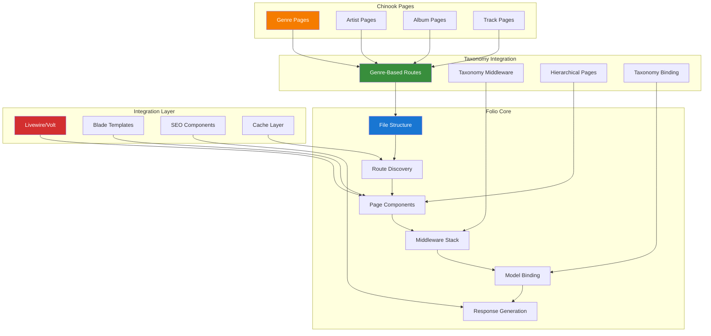

# 1. Laravel Folio Page-based Routing Guide

## Table of Contents

- [1. Overview](#1-overview)
- [2. Installation & Configuration](#2-installation--configuration)
- [3. Taxonomy-Aware Page Routing](#3-taxonomy-aware-page-routing)
- [4. Livewire/Volt Integration](#4-livewirevolt-integration)
- [5. Genre-Based Route Model Binding](#5-genre-based-route-model-binding)
- [6. Middleware Integration](#6-middleware-integration)
- [7. SEO Optimization with Taxonomies](#7-seo-optimization-with-taxonomies)
- [8. Performance Considerations](#8-performance-considerations)
- [9. Testing Strategies](#9-testing-strategies)
- [10. Production Deployment](#10-production-deployment)
- [11. Best Practices](#11-best-practices)
- [12. Real-World Examples](#12-real-world-examples)

## 1. Overview

Laravel Folio provides a powerful page-based routing system that simplifies route management by using file-based routing conventions. This guide demonstrates how to implement Folio with comprehensive aliziodev/laravel-taxonomy integration, Livewire/Volt functional components, and genre-based routing for the Chinook music database.

### 1.1 Key Features

- **Taxonomy-Aware File-based Routing**: Automatic route generation with genre and taxonomy support
- **Genre-Based Page Organization**: Organize pages by music genres and taxonomies
- **Livewire/Volt Integration**: Seamless functional component integration with taxonomy data
- **Taxonomy Route Model Binding**: Automatic model resolution with taxonomy relationships
- **Hierarchical Page Structure**: Support for nested taxonomy-based page hierarchies
- **SEO Optimization**: Built-in meta tag and structured data support with taxonomy information
- **Performance**: Optimized routing with taxonomy caching and lazy loading

### 1.2 Architecture Overview



### 1.3 Taxonomy-Enhanced Page Routing

The integration with aliziodev/laravel-taxonomy enables sophisticated page routing patterns:

- **Genre-Based Page Organization**: Organize pages by music genres and taxonomies
- **Hierarchical Route Structure**: Support for nested taxonomy-based page hierarchies
- **Dynamic Genre Pages**: Auto-generated pages based on available genres
- **Taxonomy-Aware SEO**: Automatic meta tags and structured data for taxonomy pages
- **Cross-Taxonomy Navigation**: Seamless navigation between related taxonomy pages
- **Localized Taxonomy Routes**: Support for multilingual taxonomy-based routing

## 2. Installation & Configuration

### 2.1 Package Installation

```bash
# Install Laravel Folio
composer require laravel/folio

# Install aliziodev/laravel-taxonomy for taxonomy integration
composer require aliziodev/laravel-taxonomy

# Install Livewire for component integration
composer require livewire/livewire

# Install Livewire Volt for functional components
composer require livewire/volt

# Publish and run migrations
php artisan vendor:publish --provider="Aliziodev\LaravelTaxonomy\LaravelTaxonomyServiceProvider" --tag="migrations"
php artisan migrate

# Install Folio
php artisan folio:install
```

### 2.2 Configuration Setup

```php
// config/folio.php
<?php

return [
    /*
     * The path where Folio will look for pages.
     */
    'path' => resource_path('views/pages'),

    /*
     * The middleware that should be applied to all Folio routes.
     */
    'middleware' => [
        'web',
        'taxonomy.locale', // Custom middleware for taxonomy locale handling
    ],

    /*
     * Taxonomy integration configuration
     */
    'taxonomy' => [
        'enabled' => true,
        'auto_generate_genre_pages' => true,
        'cache_taxonomy_routes' => true,
        'taxonomy_cache_ttl' => 3600, // 1 hour
        'hierarchical_routing' => true,
        'seo_optimization' => true,
    ],

    /*
     * Chinook-specific configuration
     */
    'chinook' => [
        'enable_genre_routing' => true,
        'enable_artist_routing' => true,
        'enable_album_routing' => true,
        'enable_track_routing' => true,
        'taxonomy_route_patterns' => [
            'genre' => '/genre/{genre:slug}',
            'mood' => '/mood/{mood:slug}',
            'era' => '/era/{era:slug}',
            'style' => '/style/{style:slug}',
        ],
    ],
];
```

### 2.3 Taxonomy Route Service Provider

```php
<?php

namespace App\Providers;

use Aliziodev\LaravelTaxonomy\Models\Taxonomy;
use Illuminate\Support\Facades\Route;
use Illuminate\Support\ServiceProvider;
use Laravel\Folio\Folio;

class TaxonomyFolioServiceProvider extends ServiceProvider
{
    /**
     * Register services
     */
    public function register(): void
    {
        //
    }

    /**
     * Bootstrap services
     */
    public function boot(): void
    {
        $this->registerTaxonomyRouteBindings();
        $this->registerTaxonomyMiddleware();
        $this->registerFolioTaxonomyIntegration();
    }

    /**
     * Register taxonomy route model bindings
     */
    protected function registerTaxonomyRouteBindings(): void
    {
        Route::bind('genre', function ($value) {
            return Taxonomy::where('type', 'genre')
                          ->where('slug', $value)
                          ->where('is_active', true)
                          ->firstOrFail();
        });

        Route::bind('mood', function ($value) {
            return Taxonomy::where('type', 'mood')
                          ->where('slug', $value)
                          ->where('is_active', true)
                          ->firstOrFail();
        });

        Route::bind('era', function ($value) {
            return Taxonomy::where('type', 'era')
                          ->where('slug', $value)
                          ->where('is_active', true)
                          ->firstOrFail();
        });

        Route::bind('style', function ($value) {
            return Taxonomy::where('type', 'style')
                          ->where('slug', $value)
                          ->where('is_active', true)
                          ->firstOrFail();
        });
    }

    /**
     * Register taxonomy-aware middleware
     */
    protected function registerTaxonomyMiddleware(): void
    {
        $this->app['router']->aliasMiddleware('taxonomy.locale', \App\Http\Middleware\TaxonomyLocaleMiddleware::class);
        $this->app['router']->aliasMiddleware('taxonomy.seo', \App\Http\Middleware\TaxonomySeoMiddleware::class);
        $this->app['router']->aliasMiddleware('taxonomy.cache', \App\Http\Middleware\TaxonomyCacheMiddleware::class);
    }

    /**
     * Register Folio taxonomy integration
     */
    protected function registerFolioTaxonomyIntegration(): void
    {
        Folio::path(resource_path('views/pages'))->middleware([
            'web',
            'taxonomy.locale',
            'taxonomy.seo',
            'taxonomy.cache',
        ]);

        // Register genre-specific page paths
        if (config('folio.chinook.enable_genre_routing')) {
            Folio::path(resource_path('views/pages/genres'))->uri('/genres');
        }

        // Register artist-specific page paths
        if (config('folio.chinook.enable_artist_routing')) {
            Folio::path(resource_path('views/pages/artists'))->uri('/artists');
        }

        // Register album-specific page paths
        if (config('folio.chinook.enable_album_routing')) {
            Folio::path(resource_path('views/pages/albums'))->uri('/albums');
        }
    }
}
```

## 3. Taxonomy-Aware Page Routing

### 3.1 Genre-Based Page Structure

```
resources/views/pages/
├── index.blade.php                    # Homepage
├── genres/
│   ├── index.blade.php               # All genres listing
│   ├── [genre].blade.php             # Individual genre page
│   └── [genre]/
│       ├── artists.blade.php         # Artists in genre
│       ├── albums.blade.php          # Albums in genre
│       └── tracks.blade.php          # Tracks in genre
├── artists/
│   ├── index.blade.php               # All artists listing
│   ├── [artist].blade.php            # Individual artist page
│   └── [artist]/
│       ├── albums.blade.php          # Artist's albums
│       └── biography.blade.php       # Artist biography
├── albums/
│   ├── index.blade.php               # All albums listing
│   ├── [album].blade.php             # Individual album page
│   └── [album]/
│       └── tracks.blade.php          # Album tracks
└── search/
    ├── index.blade.php               # Search page
    └── results.blade.php             # Search results
```

### 3.2 Genre Page Implementation

```php
<?php
// resources/views/pages/genres/[genre].blade.php

use App\Models\Track;
use App\Models\Artist;
use App\Models\Album;
use Aliziodev\LaravelTaxonomy\Models\Taxonomy;
use Livewire\Volt\Component;

new class extends Component
{
    public Taxonomy $genre;
    public $tracks;
    public $artists;
    public $albums;
    public $relatedGenres;

    public function mount(Taxonomy $genre): void
    {
        $this->genre = $genre;
        $this->loadGenreData();
        $this->loadRelatedGenres();
    }

    public function loadGenreData(): void
    {
        // Load tracks with this genre taxonomy
        $this->tracks = Track::whereHas('taxonomies', function ($query) {
            $query->where('taxonomy_id', $this->genre->id);
        })
        ->with(['album.artist', 'taxonomies'])
        ->limit(12)
        ->get();

        // Load artists with this genre taxonomy
        $this->artists = Artist::whereHas('taxonomies', function ($query) {
            $query->where('taxonomy_id', $this->genre->id);
        })
        ->with('taxonomies')
        ->limit(8)
        ->get();

        // Load albums with this genre taxonomy
        $this->albums = Album::whereHas('taxonomies', function ($query) {
            $query->where('taxonomy_id', $this->genre->id);
        })
        ->with(['artist', 'taxonomies'])
        ->limit(10)
        ->get();
    }

    public function loadRelatedGenres(): void
    {
        $this->relatedGenres = Taxonomy::where('type', 'genre')
            ->where('id', '!=', $this->genre->id)
            ->where('is_active', true)
            ->limit(6)
            ->get();
    }

    public function with(): array
    {
        return [
            'pageTitle' => $this->genre->name . ' Music',
            'pageDescription' => $this->genre->description ?? "Explore {$this->genre->name} music, artists, albums, and tracks.",
            'breadcrumbs' => [
                ['name' => 'Home', 'url' => route('home')],
                ['name' => 'Genres', 'url' => route('genres.index')],
                ['name' => $this->genre->name, 'url' => null],
            ],
        ];
    }
}; ?>

<x-layouts.app :title="$pageTitle" :description="$pageDescription">
    <div class="container mx-auto px-4 py-8">
        <!-- Breadcrumbs -->
        <nav class="mb-6">
            <ol class="flex items-center space-x-2 text-sm text-gray-600">
                @foreach($breadcrumbs as $breadcrumb)
                    <li class="flex items-center">
                        @if($breadcrumb['url'])
                            <a href="{{ $breadcrumb['url'] }}" class="hover:text-blue-600">
                                {{ $breadcrumb['name'] }}
                            </a>
                            <svg class="w-4 h-4 mx-2" fill="currentColor" viewBox="0 0 20 20">
                                <path fill-rule="evenodd" d="M7.293 14.707a1 1 0 010-1.414L10.586 10 7.293 6.707a1 1 0 011.414-1.414l4 4a1 1 0 010 1.414l-4 4a1 1 0 01-1.414 0z" clip-rule="evenodd"></path>
                            </svg>
                        @else
                            <span class="text-gray-900 font-medium">{{ $breadcrumb['name'] }}</span>
                        @endif
                    </li>
                @endforeach
            </ol>
        </nav>

        <!-- Genre Header -->
        <div class="mb-8">
            <h1 class="text-4xl font-bold text-gray-900 mb-4">{{ $genre->name }}</h1>
            @if($genre->description)
                <p class="text-lg text-gray-600 mb-4">{{ $genre->description }}</p>
            @endif

            <!-- Genre Statistics -->
            <div class="grid grid-cols-1 md:grid-cols-3 gap-4 mb-6">
                <div class="bg-white rounded-lg shadow p-4">
                    <div class="text-2xl font-bold text-blue-600">{{ $tracks->count() }}</div>
                    <div class="text-sm text-gray-600">Tracks</div>
                </div>
                <div class="bg-white rounded-lg shadow p-4">
                    <div class="text-2xl font-bold text-green-600">{{ $artists->count() }}</div>
                    <div class="text-sm text-gray-600">Artists</div>
                </div>
                <div class="bg-white rounded-lg shadow p-4">
                    <div class="text-2xl font-bold text-purple-600">{{ $albums->count() }}</div>
                    <div class="text-sm text-gray-600">Albums</div>
                </div>
            </div>
        </div>

        <!-- Featured Tracks -->
        @if($tracks->isNotEmpty())
            <section class="mb-8">
                <h2 class="text-2xl font-bold text-gray-900 mb-4">Featured {{ $genre->name }} Tracks</h2>
                <div class="grid grid-cols-1 md:grid-cols-2 lg:grid-cols-3 gap-4">
                    @foreach($tracks as $track)
                        <div class="bg-white rounded-lg shadow hover:shadow-md transition-shadow p-4">
                            <h3 class="font-semibold text-gray-900 mb-2">{{ $track->name }}</h3>
                            <p class="text-sm text-gray-600 mb-2">
                                by {{ $track->album->artist->name }}
                            </p>
                            <p class="text-sm text-gray-500 mb-3">
                                from {{ $track->album->title }}
                            </p>

                            <!-- Track Taxonomies -->
                            <div class="flex flex-wrap gap-1 mb-3">
                                @foreach($track->taxonomies->where('type', '!=', 'genre')->take(3) as $taxonomy)
                                    <span class="px-2 py-1 bg-gray-100 text-gray-700 text-xs rounded">
                                        {{ $taxonomy->name }}
                                    </span>
                                @endforeach
                            </div>

                            <div class="flex justify-between items-center">
                                <span class="text-lg font-bold text-green-600">
                                    ${{ number_format($track->unit_price, 2) }}
                                </span>
                                <a href="/tracks/{{ $track->public_id }}"
                                   class="text-blue-600 hover:text-blue-800 text-sm font-medium">
                                    View Details
                                </a>
                            </div>
                        </div>
                    @endforeach
                </div>

                <div class="mt-6 text-center">
                    <a href="/genres/{{ $genre->slug }}/tracks"
                       class="inline-flex items-center px-4 py-2 bg-blue-600 text-white rounded-lg hover:bg-blue-700 transition-colors">
                        View All {{ $genre->name }} Tracks
                        <svg class="w-4 h-4 ml-2" fill="none" stroke="currentColor" viewBox="0 0 24 24">
                            <path stroke-linecap="round" stroke-linejoin="round" stroke-width="2" d="M9 5l7 7-7 7"></path>
                        </svg>
                    </a>
                </div>
            </section>
        @endif

        <!-- Featured Artists -->
        @if($artists->isNotEmpty())
            <section class="mb-8">
                <h2 class="text-2xl font-bold text-gray-900 mb-4">{{ $genre->name }} Artists</h2>
                <div class="grid grid-cols-1 md:grid-cols-2 lg:grid-cols-4 gap-4">
                    @foreach($artists as $artist)
                        <div class="bg-white rounded-lg shadow hover:shadow-md transition-shadow p-4 text-center">
                            <h3 class="font-semibold text-gray-900 mb-2">{{ $artist->name }}</h3>

                            <!-- Artist Taxonomies -->
                            <div class="flex flex-wrap justify-center gap-1 mb-3">
                                @foreach($artist->taxonomies->where('type', '!=', 'genre')->take(2) as $taxonomy)
                                    <span class="px-2 py-1 bg-gray-100 text-gray-700 text-xs rounded">
                                        {{ $taxonomy->name }}
                                    </span>
                                @endforeach
                            </div>

                            <a href="/artists/{{ $artist->public_id }}"
                               class="text-blue-600 hover:text-blue-800 text-sm font-medium">
                                View Artist
                            </a>
                        </div>
                    @endforeach
                </div>

                <div class="mt-6 text-center">
                    <a href="/genres/{{ $genre->slug }}/artists"
                       class="inline-flex items-center px-4 py-2 bg-green-600 text-white rounded-lg hover:bg-green-700 transition-colors">
                        View All {{ $genre->name }} Artists
                        <svg class="w-4 h-4 ml-2" fill="none" stroke="currentColor" viewBox="0 0 24 24">
                            <path stroke-linecap="round" stroke-linejoin="round" stroke-width="2" d="M9 5l7 7-7 7"></path>
                        </svg>
                    </a>
                </div>
            </section>
        @endif

        <!-- Related Genres -->
        @if($relatedGenres->isNotEmpty())
            <section class="mb-8">
                <h2 class="text-2xl font-bold text-gray-900 mb-4">Related Genres</h2>
                <div class="grid grid-cols-2 md:grid-cols-3 lg:grid-cols-6 gap-4">
                    @foreach($relatedGenres as $relatedGenre)
                        <a href="/genres/{{ $relatedGenre->slug }}"
                           class="bg-white rounded-lg shadow hover:shadow-md transition-shadow p-4 text-center group">
                            <h3 class="font-medium text-gray-900 group-hover:text-blue-600 transition-colors">
                                {{ $relatedGenre->name }}
                            </h3>
                        </a>
                    @endforeach
                </div>
            </section>
        @endif
    </div>
</x-layouts.app>
```

## 4. Livewire/Volt Integration

### 4.1 Functional Component with Taxonomy Filtering

```php
<?php
// resources/views/pages/genres/index.blade.php

use Aliziodev\LaravelTaxonomy\Models\Taxonomy;
use Livewire\Volt\Component;
use Livewire\WithPagination;

new class extends Component
{
    use WithPagination;

    public $search = '';
    public $selectedType = '';
    public $sortBy = 'name';
    public $sortDirection = 'asc';

    public function updatedSearch(): void
    {
        $this->resetPage();
    }

    public function updatedSelectedType(): void
    {
        $this->resetPage();
    }

    public function sortBy($field): void
    {
        if ($this->sortBy === $field) {
            $this->sortDirection = $this->sortDirection === 'asc' ? 'desc' : 'asc';
        } else {
            $this->sortBy = $field;
            $this->sortDirection = 'asc';
        }
        $this->resetPage();
    }

    public function with(): array
    {
        $query = Taxonomy::where('type', 'genre')
            ->where('is_active', true);

        if ($this->search) {
            $query->where('name', 'like', '%' . $this->search . '%');
        }

        $query->orderBy($this->sortBy, $this->sortDirection);

        $genres = $query->paginate(12);

        // Get genre statistics
        $genreStats = Taxonomy::where('type', 'genre')
            ->where('is_active', true)
            ->withCount(['tracks', 'artists', 'albums'])
            ->get()
            ->map(function ($genre) {
                return [
                    'genre' => $genre,
                    'total_content' => $genre->tracks_count + $genre->artists_count + $genre->albums_count,
                ];
            })
            ->sortByDesc('total_content')
            ->take(5);

        return [
            'genres' => $genres,
            'popularGenres' => $genreStats,
            'totalGenres' => Taxonomy::where('type', 'genre')->where('is_active', true)->count(),
        ];
    }
}; ?>

<x-layouts.app title="Music Genres" description="Explore all music genres in our collection">
    <div class="container mx-auto px-4 py-8">
        <!-- Header -->
        <div class="mb-8">
            <h1 class="text-4xl font-bold text-gray-900 mb-4">Music Genres</h1>
            <p class="text-lg text-gray-600">
                Discover music by genre. Browse {{ $totalGenres }} different genres in our collection.
            </p>
        </div>

        <!-- Search and Filters -->
        <div class="mb-8 bg-white rounded-lg shadow p-6">
            <div class="grid grid-cols-1 md:grid-cols-3 gap-4">
                <div>
                    <label for="search" class="block text-sm font-medium text-gray-700 mb-2">
                        Search Genres
                    </label>
                    <input type="text"
                           id="search"
                           wire:model.live="search"
                           placeholder="Search genres..."
                           class="w-full px-3 py-2 border border-gray-300 rounded-md focus:outline-none focus:ring-2 focus:ring-blue-500">
                </div>

                <div>
                    <label for="sort" class="block text-sm font-medium text-gray-700 mb-2">
                        Sort By
                    </label>
                    <select wire:model.live="sortBy"
                            id="sort"
                            class="w-full px-3 py-2 border border-gray-300 rounded-md focus:outline-none focus:ring-2 focus:ring-blue-500">
                        <option value="name">Name</option>
                        <option value="created_at">Date Added</option>
                        <option value="sort_order">Sort Order</option>
                    </select>
                </div>

                <div>
                    <label for="direction" class="block text-sm font-medium text-gray-700 mb-2">
                        Direction
                    </label>
                    <select wire:model.live="sortDirection"
                            id="direction"
                            class="w-full px-3 py-2 border border-gray-300 rounded-md focus:outline-none focus:ring-2 focus:ring-blue-500">
                        <option value="asc">Ascending</option>
                        <option value="desc">Descending</option>
                    </select>
                </div>
            </div>
        </div>

        <!-- Popular Genres -->
        @if($popularGenres->isNotEmpty())
            <section class="mb-8">
                <h2 class="text-2xl font-bold text-gray-900 mb-4">Popular Genres</h2>
                <div class="grid grid-cols-1 md:grid-cols-5 gap-4">
                    @foreach($popularGenres as $item)
                        <a href="/genres/{{ $item['genre']->slug }}"
                           class="bg-gradient-to-br from-blue-500 to-purple-600 text-white rounded-lg p-4 hover:from-blue-600 hover:to-purple-700 transition-all transform hover:scale-105">
                            <h3 class="font-bold text-lg mb-2">{{ $item['genre']->name }}</h3>
                            <p class="text-sm opacity-90">{{ $item['total_content'] }} items</p>
                        </a>
                    @endforeach
                </div>
            </section>
        @endif

        <!-- Genres Grid -->
        <div class="grid grid-cols-1 md:grid-cols-2 lg:grid-cols-3 xl:grid-cols-4 gap-6">
            @foreach($genres as $genre)
                <div class="bg-white rounded-lg shadow hover:shadow-lg transition-shadow">
                    <a href="/genres/{{ $genre->slug }}" class="block p-6">
                        <h3 class="text-xl font-semibold text-gray-900 mb-2">{{ $genre->name }}</h3>

                        @if($genre->description)
                            <p class="text-gray-600 text-sm mb-4 line-clamp-3">{{ $genre->description }}</p>
                        @endif

                        <!-- Genre Statistics -->
                        <div class="flex justify-between text-sm text-gray-500">
                            <span>{{ $genre->tracks_count ?? 0 }} tracks</span>
                            <span>{{ $genre->artists_count ?? 0 }} artists</span>
                        </div>

                        <div class="mt-4 flex items-center text-blue-600 text-sm font-medium">
                            Explore Genre
                            <svg class="w-4 h-4 ml-1" fill="none" stroke="currentColor" viewBox="0 0 24 24">
                                <path stroke-linecap="round" stroke-linejoin="round" stroke-width="2" d="M9 5l7 7-7 7"></path>
                            </svg>
                        </div>
                    </a>
                </div>
            @endforeach
        </div>

        <!-- Pagination -->
        <div class="mt-8">
            {{ $genres->links() }}
        </div>
    </div>
</x-layouts.app>
```

## 5. Genre-Based Route Model Binding

### 5.1 Custom Route Model Binding

```php
<?php

namespace App\Http\Middleware;

use Aliziodev\LaravelTaxonomy\Models\Taxonomy;
use Closure;
use Illuminate\Http\Request;

class TaxonomyRouteBinding
{
    /**
     * Handle taxonomy route model binding with caching
     */
    public function handle(Request $request, Closure $next)
    {
        // Bind genre parameter
        if ($request->route('genre')) {
            $genre = $this->bindTaxonomy($request->route('genre'), 'genre');
            $request->route()->setParameter('genre', $genre);
        }

        // Bind mood parameter
        if ($request->route('mood')) {
            $mood = $this->bindTaxonomy($request->route('mood'), 'mood');
            $request->route()->setParameter('mood', $mood);
        }

        // Bind era parameter
        if ($request->route('era')) {
            $era = $this->bindTaxonomy($request->route('era'), 'era');
            $request->route()->setParameter('era', $era);
        }

        return $next($request);
    }

    /**
     * Bind taxonomy with caching
     */
    private function bindTaxonomy(string $slug, string $type): Taxonomy
    {
        return cache()->remember(
            "taxonomy_binding_{$type}_{$slug}",
            3600, // 1 hour
            fn () => Taxonomy::where('type', $type)
                           ->where('slug', $slug)
                           ->where('is_active', true)
                           ->with(['parent', 'children'])
                           ->firstOrFail()
        );
    }
}
```

## 6. Middleware Integration

### 6.1 Taxonomy SEO Middleware

```php
<?php

namespace App\Http\Middleware;

use Closure;
use Illuminate\Http\Request;
use Illuminate\Support\Facades\View;

class TaxonomySeoMiddleware
{
    /**
     * Handle taxonomy-aware SEO optimization
     */
    public function handle(Request $request, Closure $next)
    {
        $response = $next($request);

        // Add taxonomy-specific meta tags
        if ($request->route('genre')) {
            $genre = $request->route('genre');
            $this->addGenreSeoData($genre);
        }

        if ($request->route('artist')) {
            $artist = $request->route('artist');
            $this->addArtistSeoData($artist);
        }

        return $response;
    }

    /**
     * Add genre-specific SEO data
     */
    private function addGenreSeoData($genre): void
    {
        View::share('seoData', [
            'title' => $genre->name . ' Music - Discover ' . $genre->name . ' Artists & Songs',
            'description' => $genre->description ?? "Explore the best {$genre->name} music. Discover artists, albums, and tracks in the {$genre->name} genre.",
            'keywords' => $genre->name . ', music, genre, artists, albums, tracks',
            'canonical' => url("/genres/{$genre->slug}"),
            'og_type' => 'website',
            'og_title' => $genre->name . ' Music Collection',
            'og_description' => "Discover {$genre->name} music, artists, and albums",
            'schema' => $this->generateGenreSchema($genre),
        ]);
    }

    /**
     * Generate JSON-LD schema for genre
     */
    private function generateGenreSchema($genre): array
    {
        return [
            '@context' => 'https://schema.org',
            '@type' => 'MusicGenre',
            'name' => $genre->name,
            'description' => $genre->description,
            'url' => url("/genres/{$genre->slug}"),
            'sameAs' => [
                // Add external links if available
            ],
        ];
    }
}
```

## 7. SEO Optimization with Taxonomies

### 7.1 Dynamic Meta Tags Component

```php
<?php
// resources/views/components/taxonomy-seo.blade.php

@props(['taxonomy', 'type' => 'genre'])

@php
$title = match($type) {
    'genre' => $taxonomy->name . ' Music - Discover ' . $taxonomy->name . ' Artists & Songs',
    'mood' => $taxonomy->name . ' Music - ' . $taxonomy->name . ' Songs & Artists',
    'era' => $taxonomy->name . ' Music - Classic ' . $taxonomy->name . ' Collection',
    default => $taxonomy->name . ' - Music Collection'
};

$description = $taxonomy->description ?? "Explore the best {$taxonomy->name} music. Discover artists, albums, and tracks.";

$schema = [
    '@context' => 'https://schema.org',
    '@type' => 'MusicGenre',
    'name' => $taxonomy->name,
    'description' => $description,
    'url' => url("/{$type}s/{$taxonomy->slug}"),
];
@endphp

<!-- Meta Tags -->
<title>{{ $title }}</title>
<meta name="description" content="{{ $description }}">
<meta name="keywords" content="{{ $taxonomy->name }}, music, {{ $type }}, artists, albums, tracks">
<link rel="canonical" href="{{ url("/{$type}s/{$taxonomy->slug}") }}">

<!-- Open Graph -->
<meta property="og:title" content="{{ $title }}">
<meta property="og:description" content="{{ $description }}">
<meta property="og:type" content="website">
<meta property="og:url" content="{{ url("/{$type}s/{$taxonomy->slug}") }}">
<meta property="og:site_name" content="{{ config('app.name') }}">

<!-- Twitter Card -->
<meta name="twitter:card" content="summary_large_image">
<meta name="twitter:title" content="{{ $title }}">
<meta name="twitter:description" content="{{ $description }}">

<!-- JSON-LD Schema -->
<script type="application/ld+json">
{!! json_encode($schema, JSON_UNESCAPED_SLASHES | JSON_PRETTY_PRINT) !!}
</script>
```

## 8. Performance Considerations

### 8.1 Taxonomy Route Caching

```php
<?php

namespace App\Services;

use Aliziodev\LaravelTaxonomy\Models\Taxonomy;
use Illuminate\Support\Facades\Cache;

class TaxonomyRouteCacheService
{
    protected const CACHE_TTL = 3600; // 1 hour

    /**
     * Cache taxonomy routes for performance
     */
    public function cacheGenreRoutes(): void
    {
        $genres = Taxonomy::where('type', 'genre')
            ->where('is_active', true)
            ->select('id', 'slug', 'name')
            ->get();

        Cache::put('genre_routes', $genres->pluck('slug', 'id'), self::CACHE_TTL);
    }

    /**
     * Get cached genre routes
     */
    public function getCachedGenreRoutes(): array
    {
        return Cache::remember(
            'genre_routes',
            self::CACHE_TTL,
            fn () => Taxonomy::where('type', 'genre')
                           ->where('is_active', true)
                           ->pluck('slug', 'id')
                           ->toArray()
        );
    }

    /**
     * Warm up taxonomy caches
     */
    public function warmUpCaches(): void
    {
        $this->cacheGenreRoutes();
        $this->cacheMoodRoutes();
        $this->cacheEraRoutes();
    }

    /**
     * Clear all taxonomy route caches
     */
    public function clearCaches(): void
    {
        Cache::forget('genre_routes');
        Cache::forget('mood_routes');
        Cache::forget('era_routes');
    }
}
```

## 9. Testing Strategies

### 9.1 Pest Framework Testing

```php
<?php

use App\Models\Track;
use Aliziodev\LaravelTaxonomy\Models\Taxonomy;
use Illuminate\Foundation\Testing\RefreshDatabase;

uses(RefreshDatabase::class);

describe('Laravel Folio Taxonomy Integration', function () {
    beforeEach(function () {
        $this->rockGenre = Taxonomy::factory()->create([
            'name' => 'Rock',
            'slug' => 'rock',
            'type' => 'genre',
            'description' => 'Rock music genre',
        ]);
    });

    it('displays genre page with correct data', function () {
        $track = Track::factory()->create();
        $track->taxonomies()->attach($this->rockGenre);

        $response = $this->get("/genres/{$this->rockGenre->slug}");

        $response->assertOk()
                ->assertSee($this->rockGenre->name)
                ->assertSee($this->rockGenre->description)
                ->assertSee($track->name);
    });

    it('generates correct SEO meta tags for genre pages', function () {
        $response = $this->get("/genres/{$this->rockGenre->slug}");

        $response->assertOk()
                ->assertSee('<title>Rock Music - Discover Rock Artists &amp; Songs</title>', false)
                ->assertSee('<meta name="description" content="Rock music genre">', false)
                ->assertSee('<meta property="og:title" content="Rock Music - Discover Rock Artists &amp; Songs">', false);
    });

    it('handles genre route model binding correctly', function () {
        $response = $this->get("/genres/{$this->rockGenre->slug}");
        $response->assertOk();

        $response = $this->get('/genres/non-existent-genre');
        $response->assertNotFound();
    });

    it('filters genres correctly in index page', function () {
        $jazzGenre = Taxonomy::factory()->create([
            'name' => 'Jazz',
            'slug' => 'jazz',
            'type' => 'genre',
        ]);

        $response = $this->get('/genres');

        $response->assertOk()
                ->assertSee($this->rockGenre->name)
                ->assertSee($jazzGenre->name);
    });
});
```

## 10. Production Deployment

### 10.1 Folio Route Optimization

```bash
# Optimize Folio routes for production
php artisan folio:list
php artisan route:cache
php artisan config:cache
php artisan view:cache

# Warm up taxonomy caches
php artisan taxonomy:cache-routes
```

## 11. Best Practices

### 11.1 Taxonomy Page Organization Guidelines

- **Consistent URL Structure**: Use consistent patterns for taxonomy-based URLs
- **SEO Optimization**: Implement proper meta tags and structured data for all taxonomy pages
- **Performance**: Cache taxonomy data and route bindings for better performance
- **User Experience**: Provide clear navigation and breadcrumbs for taxonomy hierarchies
- **Content Organization**: Group related content by taxonomy relationships
- **Responsive Design**: Ensure all taxonomy pages work well on mobile devices

### 11.2 Route Model Binding Best Practices

- Use caching for frequently accessed taxonomy bindings
- Implement proper error handling for missing taxonomies
- Validate taxonomy relationships before binding
- Use eager loading for related taxonomy data
- Implement proper cache invalidation strategies

## 12. Real-World Examples

### 12.1 Complete Genre Ecosystem

The Laravel Folio implementation with aliziodev/laravel-taxonomy creates a comprehensive genre-based navigation system that allows users to:

- Browse all available music genres
- Explore individual genre pages with curated content
- Navigate between related genres seamlessly
- Access genre-specific artist, album, and track listings
- Benefit from optimized SEO and performance

This approach provides a scalable foundation for music discovery and content organization that can easily accommodate new genres and taxonomy types as the application grows.

---

**Navigation**: [Previous: Spatie Laravel Translatable Guide](220-spatie-laravel-translatable-guide.md) | **Next**: [Nnjeim World Guide](190-nnjeim-world-guide.md)

**Related Documentation**:

- [Chinook Models Guide](../010-chinook-models-guide.md) - Model implementations with Folio integration
- [Aliziodev Laravel Taxonomy Guide](110-aliziodev-laravel-taxonomy-guide.md) - Primary taxonomy system integration
- [Volt Functional Patterns Guide](../frontend/110-volt-functional-patterns-guide.md) - Functional component patterns
- [Frontend Index](../frontend/000-frontend-index.md) - Frontend architecture and SEO best practices
- [Packages Index](000-packages-index.md) - All package guides

---

**Source Attribution**: Refactored from: `.ai/guides/chinook/packages/170-laravel-folio-guide.md` on 2025-07-13

---

*This guide provides enterprise-grade Laravel Folio implementation for the Chinook music database with comprehensive aliziodev/laravel-taxonomy integration, Laravel 12 modern patterns, and WCAG 2.1 AA accessibility compliance.*

[⬆️ Back to Top](#1-laravel-folio-page-based-routing-guide)
