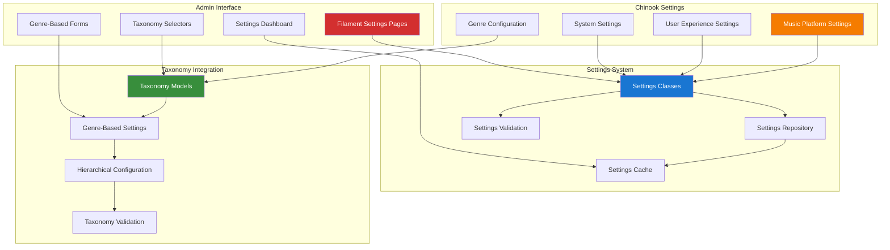

# 1. Spatie Laravel Settings Implementation Guide

> **Package Source:** [spatie/laravel-settings](https://github.com/spatie/laravel-settings)
> **Official Documentation:** [Laravel Settings Documentation](https://spatie.be/docs/laravel-settings)
> **Laravel Version:** 12.x compatibility
> **Chinook Integration:** Enhanced for Chinook configuration management and taxonomy integration
> **Last Updated:** 2025-07-13

## 1.1. Table of Contents

- [1.2. Overview](#12-overview)
- [1.3. Installation & Configuration](#13-installation--configuration)
- [1.4. Laravel 12 Modern Implementation](#14-laravel-12-modern-implementation)
- [1.5. Taxonomy-Enhanced Settings Architecture](#15-taxonomy-enhanced-settings-architecture)
- [1.6. Chinook Settings Integration](#16-chinook-settings-integration)
- [1.7. Filament Admin Integration](#17-filament-admin-integration)
- [1.8. Advanced Features](#18-advanced-features)
- [1.9. Testing Strategies](#19-testing-strategies)
- [1.10. Performance Optimization](#110-performance-optimization)
- [1.11. Security & Compliance](#111-security--compliance)
- [1.12. Production Deployment](#112-production-deployment)
- [1.13. Best Practices](#113-best-practices)

## 1.2. Overview

> **Implementation Note:** This guide adapts the official [Spatie Laravel Settings documentation](https://spatie.be/docs/laravel-settings) for Laravel 12 and Chinook project requirements, demonstrating enterprise-grade implementation patterns with comprehensive aliziodev/laravel-taxonomy integration and modern configuration management.

**Spatie Laravel Settings** provides a powerful and flexible way to manage application settings in Laravel applications. This enhanced guide demonstrates enterprise-grade implementation patterns for the Chinook music database with comprehensive aliziodev/laravel-taxonomy integration, advanced configuration management, and Laravel 12 modern syntax.

### 1.1 Key Features

- **Type-Safe Settings**: Strongly typed settings with Laravel 12 modern casting
- **Taxonomy Integration**: Genre-based and hierarchical settings organization
- **Encrypted Storage**: Secure storage for sensitive configuration data
- **Filament Integration**: Beautiful admin interface for settings management
- **Performance Optimized**: Efficient caching and lazy loading strategies
- **Validation Support**: Comprehensive validation rules for all settings
- **Migration Support**: Version-controlled settings changes
- **Taxonomy-Aware Configuration**: Settings categorized by music genres and taxonomies

### 1.2 Architecture Overview



### 1.3 Taxonomy-Enhanced Settings Management

The integration with aliziodev/laravel-taxonomy enables sophisticated settings organization:

- **Genre-Based Configuration**: Settings can be organized by music genres and taxonomies
- **Hierarchical Settings**: Support for nested settings based on taxonomy hierarchies
- **Dynamic Configuration**: Settings that adapt based on taxonomy relationships
- **Taxonomy Validation**: Ensure settings comply with taxonomy constraints
- **Genre-Specific Defaults**: Different default values based on music genres
- **Taxonomy-Aware Caching**: Optimized caching strategies for taxonomy-based settings

## 2. Installation & Configuration

### 2.1 Package Installation

```bash
# Install Spatie Laravel Settings
composer require spatie/laravel-settings

# Install aliziodev/laravel-taxonomy for taxonomy integration
composer require aliziodev/laravel-taxonomy

# Publish and run migrations
php artisan vendor:publish --provider="Spatie\LaravelSettings\LaravelSettingsServiceProvider" --tag="migrations"
php artisan vendor:publish --provider="Aliziodev\LaravelTaxonomy\LaravelTaxonomyServiceProvider" --tag="migrations"

# Run migrations
php artisan migrate

# Publish configuration files
php artisan vendor:publish --provider="Spatie\LaravelSettings\LaravelSettingsServiceProvider" --tag="config"
php artisan vendor:publish --provider="Aliziodev\LaravelTaxonomy\LaravelTaxonomyServiceProvider" --tag="config"
```

### 2.2 Configuration Setup

```php
// config/settings.php
<?php

return [
    /*
     * Settings will be stored and retrieved using this disk
     */
    'disk' => env('SETTINGS_DISK', 'local'),

    /*
     * Settings will be cached using this store
     */
    'cache_store' => env('SETTINGS_CACHE_STORE', 'default'),

    /*
     * The path where settings migrations are stored
     */
    'migrations_path' => database_path('settings'),

    /*
     * Settings will be encrypted when stored
     */
    'encrypt' => env('SETTINGS_ENCRYPT', false),

    /*
     * Auto-discover settings classes
     */
    'auto_discover_settings' => [
        'enabled' => true,
        'directories' => [
            app_path('Settings'),
        ],
    ],

    /*
     * Taxonomy integration configuration
     */
    'taxonomy' => [
        'enabled' => true,
        'cache_taxonomy_settings' => true,
        'taxonomy_cache_ttl' => 3600, // 1 hour
        'validate_taxonomy_relationships' => true,
        'auto_sync_genre_settings' => true,
    ],

    /*
     * Chinook-specific configuration
     */
    'chinook' => [
        'cache_ttl' => 3600, // 1 hour
        'encryption_enabled' => true,
        'validation_enabled' => true,
        'audit_changes' => true,
        'genre_based_defaults' => true,
        'taxonomy_validation' => true,
    ],
];
```

### 2.3 Taxonomy Configuration

```php
// config/taxonomy.php - Enhanced for settings integration
<?php

return [
    'table_names' => [
        'taxonomies' => 'taxonomies',
        'taxonomables' => 'taxonomables',
    ],

    'types' => [
        'category',
        'tag',
        'genre',
        'mood',
        'era',
        'instrument',
        'setting_group', // For settings organization
        'configuration_type', // For configuration categorization
    ],

    'settings_integration' => [
        'enabled' => true,
        'auto_create_setting_taxonomies' => true,
        'default_setting_taxonomy_type' => 'setting_group',
        'cache_taxonomy_settings' => true,
    ],
];
```

## 3. Laravel 12 Modern Implementation

### 3.1 Base Settings Class with Taxonomy Support

```php
<?php

namespace App\Settings;

use Aliziodev\LaravelTaxonomy\Models\Taxonomy;
use Aliziodev\LaravelTaxonomy\Traits\HasTaxonomies;
use Spatie\LaravelSettings\Settings;

abstract class TaxonomyAwareSettings extends Settings
{
    use HasTaxonomies;

    /**
     * Get settings taxonomy group
     */
    abstract public static function taxonomyGroup(): string;

    /**
     * Get related taxonomies for this settings group
     */
    public function getRelatedTaxonomies(): Collection
    {
        return Taxonomy::where('type', static::taxonomyGroup())
            ->where('is_active', true)
            ->orderBy('sort_order')
            ->get();
    }

    /**
     * Get genre-specific default values
     */
    public static function getGenreDefaults(string $genreSlug): array
    {
        $genre = Taxonomy::where('slug', $genreSlug)
            ->where('type', 'genre')
            ->first();

        if (!$genre) {
            return static::defaults();
        }

        return static::getGenreSpecificDefaults($genre);
    }

    /**
     * Override this method to provide genre-specific defaults
     */
    protected static function getGenreSpecificDefaults(Taxonomy $genre): array
    {
        return static::defaults();
    }

    /**
     * Validate settings against taxonomy constraints
     */
    public function validateTaxonomyConstraints(): array
    {
        $errors = [];
        $taxonomies = $this->getRelatedTaxonomies();

        foreach ($this->toArray() as $key => $value) {
            if ($this->isTaxonomyConstrainedField($key)) {
                $constraint = $this->getTaxonomyConstraint($key, $taxonomies);
                if (!$this->validateConstraint($value, $constraint)) {
                    $errors[$key] = "Value does not meet taxonomy constraints for {$key}";
                }
            }
        }

        return $errors;
    }

    /**
     * Check if field has taxonomy constraints
     */
    protected function isTaxonomyConstrainedField(string $field): bool
    {
        return in_array($field, $this->getTaxonomyConstrainedFields());
    }

    /**
     * Get fields that have taxonomy constraints
     */
    protected function getTaxonomyConstrainedFields(): array
    {
        return [];
    }

    /**
     * Get taxonomy constraint for field
     */
    protected function getTaxonomyConstraint(string $field, Collection $taxonomies): ?array
    {
        return null;
    }

    /**
     * Validate value against constraint
     */
    protected function validateConstraint($value, ?array $constraint): bool
    {
        return true;
    }
}
```

### 3.2 Chinook Music Settings with Genre Integration

```php
<?php

namespace App\Settings\Chinook;

use App\Settings\TaxonomyAwareSettings;
use Aliziodev\LaravelTaxonomy\Models\Taxonomy;
use Illuminate\Support\Collection;

class MusicSettings extends TaxonomyAwareSettings
{
    public float $default_track_price;
    public string $default_currency;
    public bool $enable_previews;
    public int $preview_duration_seconds;
    public bool $enable_recommendations;
    public int $max_playlist_tracks;
    public bool $allow_explicit_content;
    public array $featured_genres;
    public array $genre_pricing_modifiers;
    public array $genre_specific_settings;
    public bool $auto_categorize_by_genre;
    public array $taxonomy_based_recommendations;

    public static function group(): string
    {
        return 'chinook.music';
    }

    public static function taxonomyGroup(): string
    {
        return 'music_configuration';
    }

    /**
     * Laravel 12 modern cast() method
     */
    protected function casts(): array
    {
        return [
            'default_track_price' => 'decimal:2',
            'default_currency' => 'string',
            'enable_previews' => 'boolean',
            'preview_duration_seconds' => 'integer',
            'enable_recommendations' => 'boolean',
            'max_playlist_tracks' => 'integer',
            'allow_explicit_content' => 'boolean',
            'featured_genres' => 'array',
            'genre_pricing_modifiers' => 'array',
            'genre_specific_settings' => 'array',
            'auto_categorize_by_genre' => 'boolean',
            'taxonomy_based_recommendations' => 'array',
        ];
    }

    public static function defaults(): array
    {
        return [
            'default_track_price' => 0.99,
            'default_currency' => 'USD',
            'enable_previews' => true,
            'preview_duration_seconds' => 30,
            'enable_recommendations' => true,
            'max_playlist_tracks' => 1000,
            'allow_explicit_content' => false,
            'featured_genres' => ['Rock', 'Pop', 'Jazz', 'Classical', 'Electronic'],
            'genre_pricing_modifiers' => [
                'classical' => 1.2,
                'jazz' => 1.1,
                'rock' => 1.0,
                'pop' => 0.9,
                'electronic' => 1.0,
            ],
            'genre_specific_settings' => [],
            'auto_categorize_by_genre' => true,
            'taxonomy_based_recommendations' => [
                'enabled' => true,
                'weight_by_genre' => true,
                'cross_genre_suggestions' => true,
            ],
        ];
    }

    protected static function getGenreSpecificDefaults(Taxonomy $genre): array
    {
        $defaults = static::defaults();

        return match($genre->slug) {
            'classical' => array_merge($defaults, [
                'default_track_price' => 1.49,
                'preview_duration_seconds' => 60,
                'allow_explicit_content' => false,
            ]),
            'jazz' => array_merge($defaults, [
                'default_track_price' => 1.29,
                'preview_duration_seconds' => 45,
                'enable_recommendations' => true,
            ]),
            'electronic' => array_merge($defaults, [
                'default_track_price' => 0.79,
                'preview_duration_seconds' => 20,
                'enable_recommendations' => true,
            ]),
            'rock' => array_merge($defaults, [
                'default_track_price' => 0.99,
                'preview_duration_seconds' => 30,
                'allow_explicit_content' => true,
            ]),
            default => $defaults,
        };
    }

    public static function rules(): array
    {
        return [
            'default_track_price' => 'required|numeric|min:0|max:999.99',
            'default_currency' => 'required|string|size:3',
            'enable_previews' => 'required|boolean',
            'preview_duration_seconds' => 'required|integer|min:10|max:120',
            'enable_recommendations' => 'required|boolean',
            'max_playlist_tracks' => 'required|integer|min:1|max:10000',
            'allow_explicit_content' => 'required|boolean',
            'featured_genres' => 'required|array|min:1|max:10',
            'genre_pricing_modifiers' => 'array',
            'genre_specific_settings' => 'array',
            'auto_categorize_by_genre' => 'required|boolean',
            'taxonomy_based_recommendations' => 'required|array',
        ];
    }

    /**
     * Get taxonomy-constrained fields
     */
    protected function getTaxonomyConstrainedFields(): array
    {
        return ['featured_genres', 'genre_pricing_modifiers', 'genre_specific_settings'];
    }

    /**
     * Get price for specific genre
     */
    public function getPriceForGenre(string $genreSlug): float
    {
        $modifier = $this->genre_pricing_modifiers[$genreSlug] ?? 1.0;
        return $this->default_track_price * $modifier;
    }

    /**
     * Get settings for specific genre
     */
    public function getGenreSettings(string $genreSlug): array
    {
        return $this->genre_specific_settings[$genreSlug] ?? [];
    }

    /**
     * Update genre-specific settings
     */
    public function updateGenreSettings(string $genreSlug, array $settings): void
    {
        $genreSettings = $this->genre_specific_settings;
        $genreSettings[$genreSlug] = array_merge(
            $genreSettings[$genreSlug] ?? [],
            $settings
        );

        $this->genre_specific_settings = $genreSettings;
        $this->save();
    }
}
```

## 4. Taxonomy-Enhanced Settings Architecture

### 4.1 Genre-Based Configuration System

```php
<?php

namespace App\Services;

use App\Settings\Chinook\MusicSettings;
use Aliziodev\LaravelTaxonomy\Models\Taxonomy;
use Illuminate\Support\Collection;

class TaxonomySettingsService
{
    /**
     * Get settings for specific genre taxonomy
     */
    public function getGenreSettings(string $genreSlug): array
    {
        $genre = Taxonomy::where('slug', $genreSlug)
            ->where('type', 'genre')
            ->first();

        if (!$genre) {
            return [];
        }

        $musicSettings = app(MusicSettings::class);
        $baseSettings = $musicSettings->toArray();
        $genreSpecific = $musicSettings->getGenreSettings($genreSlug);

        return array_merge($baseSettings, $genreSpecific);
    }

    /**
     * Update settings for specific genre
     */
    public function updateGenreSettings(string $genreSlug, array $settings): void
    {
        $musicSettings = app(MusicSettings::class);
        $musicSettings->updateGenreSettings($genreSlug, $settings);

        // Clear taxonomy-related caches
        $this->clearTaxonomySettingsCache($genreSlug);
    }

    /**
     * Get all genre-based pricing
     */
    public function getAllGenrePricing(): array
    {
        $musicSettings = app(MusicSettings::class);
        $genres = Taxonomy::where('type', 'genre')->get();
        $pricing = [];

        foreach ($genres as $genre) {
            $pricing[$genre->slug] = $musicSettings->getPriceForGenre($genre->slug);
        }

        return $pricing;
    }

    /**
     * Sync taxonomy changes with settings
     */
    public function syncTaxonomySettings(): void
    {
        $genres = Taxonomy::where('type', 'genre')->get();
        $musicSettings = app(MusicSettings::class);

        foreach ($genres as $genre) {
            $this->ensureGenreSettingsExist($genre, $musicSettings);
        }
    }

    /**
     * Ensure genre has default settings
     */
    private function ensureGenreSettingsExist(Taxonomy $genre, MusicSettings $settings): void
    {
        $genreSettings = $settings->getGenreSettings($genre->slug);

        if (empty($genreSettings)) {
            $defaults = MusicSettings::getGenreDefaults($genre->slug);
            $settings->updateGenreSettings($genre->slug, $defaults);
        }
    }

    /**
     * Clear taxonomy settings cache
     */
    private function clearTaxonomySettingsCache(string $genreSlug): void
    {
        cache()->forget("taxonomy_settings_{$genreSlug}");
        cache()->forget("genre_pricing_{$genreSlug}");
    }
}
```

### 4.2 Hierarchical Settings Management

```php
<?php

namespace App\Settings\Chinook;

use App\Settings\TaxonomyAwareSettings;
use Aliziodev\LaravelTaxonomy\Models\Taxonomy;

class HierarchicalSettings extends TaxonomyAwareSettings
{
    public array $category_settings;
    public array $subcategory_overrides;
    public bool $inherit_parent_settings;
    public array $taxonomy_hierarchy_config;

    public static function group(): string
    {
        return 'chinook.hierarchy';
    }

    public static function taxonomyGroup(): string
    {
        return 'hierarchical_configuration';
    }

    protected function casts(): array
    {
        return [
            'category_settings' => 'array',
            'subcategory_overrides' => 'array',
            'inherit_parent_settings' => 'boolean',
            'taxonomy_hierarchy_config' => 'array',
        ];
    }

    public static function defaults(): array
    {
        return [
            'category_settings' => [],
            'subcategory_overrides' => [],
            'inherit_parent_settings' => true,
            'taxonomy_hierarchy_config' => [
                'max_depth' => 5,
                'auto_inherit' => true,
                'override_allowed' => true,
            ],
        ];
    }

    /**
     * Get settings for taxonomy with inheritance
     */
    public function getSettingsForTaxonomy(int $taxonomyId): array
    {
        $taxonomy = Taxonomy::find($taxonomyId);
        if (!$taxonomy) {
            return [];
        }

        $settings = $this->category_settings[$taxonomyId] ?? [];

        if ($this->inherit_parent_settings && $taxonomy->parent_id) {
            $parentSettings = $this->getSettingsForTaxonomy($taxonomy->parent_id);
            $settings = array_merge($parentSettings, $settings);
        }

        return $settings;
    }

    /**
     * Update settings for taxonomy
     */
    public function updateTaxonomySettings(int $taxonomyId, array $settings): void
    {
        $categorySettings = $this->category_settings;
        $categorySettings[$taxonomyId] = array_merge(
            $categorySettings[$taxonomyId] ?? [],
            $settings
        );

        $this->category_settings = $categorySettings;
        $this->save();
    }
}
```

## 5. Chinook Settings Integration

### 5.1 Track Model Integration with Settings

```php
<?php

namespace App\Models;

use App\Settings\Chinook\MusicSettings;
use Aliziodev\LaravelTaxonomy\Traits\HasTaxonomy;
use Illuminate\Database\Eloquent\Model;
use Illuminate\Database\Eloquent\SoftDeletes;

class Track extends Model
{
    use HasTaxonomy, SoftDeletes;

    protected $table = 'chinook_tracks';

    protected $fillable = [
        'public_id',
        'name',
        'album_id',
        'composer',
        'milliseconds',
        'bytes',
        'unit_price',
        'is_explicit',
    ];

    protected function casts(): array
    {
        return [
            'milliseconds' => 'integer',
            'bytes' => 'integer',
            'unit_price' => 'decimal:2',
            'is_explicit' => 'boolean',
            'created_at' => 'datetime',
            'updated_at' => 'datetime',
            'deleted_at' => 'datetime',
        ];
    }

    protected static function boot()
    {
        parent::boot();

        static::creating(function ($track) {
            if (empty($track->unit_price)) {
                $track->unit_price = static::getDefaultPriceForTrack($track);
            }
        });
    }

    /**
     * Get default price based on genre taxonomy
     */
    protected static function getDefaultPriceForTrack(self $track): float
    {
        $musicSettings = app(MusicSettings::class);

        // If track has genre taxonomies, use genre-specific pricing
        if ($track->exists && $track->taxonomies()->exists()) {
            $primaryGenre = $track->taxonomies()
                ->where('type', 'genre')
                ->first();

            if ($primaryGenre) {
                return $musicSettings->getPriceForGenre($primaryGenre->slug);
            }
        }

        return $musicSettings->default_track_price;
    }

    /**
     * Get genre-specific settings for this track
     */
    public function getGenreSettings(): array
    {
        $primaryGenre = $this->taxonomies()
            ->where('type', 'genre')
            ->first();

        if (!$primaryGenre) {
            return [];
        }

        $musicSettings = app(MusicSettings::class);
        return $musicSettings->getGenreSettings($primaryGenre->slug);
    }

    /**
     * Update price based on current genre settings
     */
    public function updatePriceFromSettings(): void
    {
        $newPrice = static::getDefaultPriceForTrack($this);

        if ($this->unit_price !== $newPrice) {
            $this->update(['unit_price' => $newPrice]);
        }
    }
}
```

### 5.2 Settings-Driven Recommendation Engine

```php
<?php

namespace App\Services;

use App\Models\Track;
use App\Settings\Chinook\MusicSettings;
use Aliziodev\LaravelTaxonomy\Models\Taxonomy;
use Illuminate\Support\Collection;

class TaxonomyRecommendationService
{
    protected MusicSettings $musicSettings;

    public function __construct(MusicSettings $musicSettings)
    {
        $this->musicSettings = $musicSettings;
    }

    /**
     * Get recommendations based on taxonomy and settings
     */
    public function getRecommendations(Track $track, int $limit = 10): Collection
    {
        if (!$this->musicSettings->enable_recommendations) {
            return collect();
        }

        $config = $this->musicSettings->taxonomy_based_recommendations;

        if (!$config['enabled']) {
            return collect();
        }

        $recommendations = collect();

        // Get genre-based recommendations
        if ($config['weight_by_genre']) {
            $genreRecs = $this->getGenreBasedRecommendations($track, $limit);
            $recommendations = $recommendations->merge($genreRecs);
        }

        // Get cross-genre recommendations
        if ($config['cross_genre_suggestions']) {
            $crossGenreRecs = $this->getCrossGenreRecommendations($track, $limit);
            $recommendations = $recommendations->merge($crossGenreRecs);
        }

        return $recommendations->unique('id')->take($limit);
    }

    /**
     * Get recommendations within same genre
     */
    private function getGenreBasedRecommendations(Track $track, int $limit): Collection
    {
        $genres = $track->taxonomies()->where('type', 'genre')->pluck('id');

        if ($genres->isEmpty()) {
            return collect();
        }

        return Track::whereHas('taxonomies', function ($query) use ($genres) {
            $query->whereIn('taxonomy_id', $genres);
        })
        ->where('id', '!=', $track->id)
        ->inRandomOrder()
        ->limit($limit)
        ->get();
    }

    /**
     * Get cross-genre recommendations
     */
    private function getCrossGenreRecommendations(Track $track, int $limit): Collection
    {
        $excludeGenres = $track->taxonomies()->where('type', 'genre')->pluck('id');

        return Track::whereHas('taxonomies', function ($query) use ($excludeGenres) {
            $query->where('type', 'genre')
                  ->whereNotIn('taxonomy_id', $excludeGenres);
        })
        ->inRandomOrder()
        ->limit($limit)
        ->get();
    }
}
```

## 6. Filament Admin Integration

### 6.1 Taxonomy-Aware Settings Pages

```php
<?php

namespace App\Filament\Pages;

use App\Settings\Chinook\MusicSettings;
use Aliziodev\LaravelTaxonomy\Models\Taxonomy;
use Filament\Forms\Components\Grid;
use Filament\Forms\Components\Section;
use Filament\Forms\Components\Select;
use Filament\Forms\Components\TagsInput;
use Filament\Forms\Components\TextInput;
use Filament\Forms\Components\Toggle;
use Filament\Forms\Components\KeyValue;
use Filament\Pages\SettingsPage;

class MusicSettingsPage extends SettingsPage
{
    protected static ?string $navigationIcon = 'heroicon-o-musical-note';
    protected static string $settings = MusicSettings::class;
    protected static ?string $title = 'Music Platform Settings';
    protected static ?string $navigationGroup = 'Chinook Configuration';

    protected function getFormSchema(): array
    {
        return [
            Section::make('Basic Music Settings')
                ->description('Core configuration for the music platform')
                ->schema([
                    Grid::make(3)->schema([
                        TextInput::make('default_track_price')
                            ->label('Default Track Price')
                            ->numeric()
                            ->required()
                            ->prefix('$')
                            ->step(0.01)
                            ->minValue(0)
                            ->maxValue(999.99),

                        Select::make('default_currency')
                            ->label('Default Currency')
                            ->options([
                                'USD' => 'US Dollar',
                                'EUR' => 'Euro',
                                'GBP' => 'British Pound',
                                'CAD' => 'Canadian Dollar',
                                'AUD' => 'Australian Dollar',
                            ])
                            ->required(),

                        TextInput::make('preview_duration_seconds')
                            ->label('Preview Duration (seconds)')
                            ->numeric()
                            ->required()
                            ->minValue(10)
                            ->maxValue(120),
                    ]),
                ]),

            Section::make('Genre Configuration')
                ->description('Taxonomy-based genre settings and pricing')
                ->schema([
                    TagsInput::make('featured_genres')
                        ->label('Featured Genres')
                        ->suggestions(function () {
                            return Taxonomy::where('type', 'genre')
                                ->pluck('name')
                                ->toArray();
                        })
                        ->required(),

                    KeyValue::make('genre_pricing_modifiers')
                        ->label('Genre Pricing Modifiers')
                        ->keyLabel('Genre Slug')
                        ->valueLabel('Price Multiplier')
                        ->addActionLabel('Add Genre Modifier'),

                    Toggle::make('auto_categorize_by_genre')
                        ->label('Auto-categorize by Genre')
                        ->helperText('Automatically assign genre taxonomies based on metadata'),
                ]),

            Section::make('Recommendation Settings')
                ->description('Taxonomy-based recommendation configuration')
                ->schema([
                    Toggle::make('enable_recommendations')
                        ->label('Enable Recommendations')
                        ->reactive(),

                    Grid::make(2)->schema([
                        Toggle::make('taxonomy_based_recommendations.enabled')
                            ->label('Taxonomy-Based Recommendations')
                            ->visible(fn ($get) => $get('enable_recommendations')),

                        Toggle::make('taxonomy_based_recommendations.weight_by_genre')
                            ->label('Weight by Genre')
                            ->visible(fn ($get) => $get('enable_recommendations')),

                        Toggle::make('taxonomy_based_recommendations.cross_genre_suggestions')
                            ->label('Cross-Genre Suggestions')
                            ->visible(fn ($get) => $get('enable_recommendations')),
                    ]),
                ]),
        ];
    }
}
```

## 7. Advanced Features

### 7.1 Encrypted Taxonomy Settings

```php
<?php

namespace App\Settings\Chinook;

use App\Settings\TaxonomyAwareSettings;
use Spatie\LaravelSettings\SettingsConfig;

class SecureSettings extends TaxonomyAwareSettings
{
    public string $api_key;
    public array $encrypted_genre_data;
    public string $license_key;

    public static function group(): string
    {
        return 'chinook.secure';
    }

    public static function taxonomyGroup(): string
    {
        return 'security_configuration';
    }

    public static function config(): SettingsConfig
    {
        return SettingsConfig::make()
            ->encrypted(['api_key', 'encrypted_genre_data', 'license_key']);
    }

    protected function casts(): array
    {
        return [
            'api_key' => 'string',
            'encrypted_genre_data' => 'array',
            'license_key' => 'string',
        ];
    }
}
```

## 8. Testing Strategies

### 8.1 Pest Framework Testing with Taxonomy

```php
<?php

use App\Models\Track;
use App\Settings\Chinook\MusicSettings;
use Aliziodev\LaravelTaxonomy\Models\Taxonomy;

describe('Taxonomy Settings Integration', function () {
    beforeEach(function () {
        $this->rockGenre = Taxonomy::factory()->create([
            'name' => 'Rock',
            'slug' => 'rock',
            'type' => 'genre',
        ]);

        $this->classicalGenre = Taxonomy::factory()->create([
            'name' => 'Classical',
            'slug' => 'classical',
            'type' => 'genre',
        ]);
    });

    it('applies genre-specific pricing from settings', function () {
        $musicSettings = app(MusicSettings::class);
        $musicSettings->genre_pricing_modifiers = [
            'rock' => 1.0,
            'classical' => 1.5,
        ];
        $musicSettings->save();

        $track = Track::factory()->create();
        $track->taxonomies()->attach($this->classicalGenre);

        expect($musicSettings->getPriceForGenre('classical'))->toBe(1.485); // 0.99 * 1.5
        expect($musicSettings->getPriceForGenre('rock'))->toBe(0.99); // 0.99 * 1.0
    });

    it('updates track pricing when genre settings change', function () {
        $track = Track::factory()->create(['unit_price' => 0.99]);
        $track->taxonomies()->attach($this->rockGenre);

        $musicSettings = app(MusicSettings::class);
        $musicSettings->updateGenreSettings('rock', ['price_modifier' => 1.2]);

        $track->updatePriceFromSettings();

        expect($track->fresh()->unit_price)->toBe(1.188); // 0.99 * 1.2
    });

    it('provides genre-specific defaults', function () {
        $classicalDefaults = MusicSettings::getGenreDefaults('classical');
        $rockDefaults = MusicSettings::getGenreDefaults('rock');

        expect($classicalDefaults['default_track_price'])->toBe(1.49);
        expect($classicalDefaults['allow_explicit_content'])->toBeFalse();

        expect($rockDefaults['default_track_price'])->toBe(0.99);
        expect($rockDefaults['allow_explicit_content'])->toBeTrue();
    });
});
```

## 9. Performance Optimization

### 9.1 Taxonomy Settings Caching

```php
<?php

namespace App\Services;

use App\Settings\Chinook\MusicSettings;
use Illuminate\Support\Facades\Cache;

class CachedTaxonomySettingsService
{
    protected const CACHE_TTL = 3600; // 1 hour

    /**
     * Get cached genre settings
     */
    public function getCachedGenreSettings(string $genreSlug): array
    {
        return Cache::remember(
            "genre_settings_{$genreSlug}",
            self::CACHE_TTL,
            fn () => app(MusicSettings::class)->getGenreSettings($genreSlug)
        );
    }

    /**
     * Get cached genre pricing
     */
    public function getCachedGenrePricing(string $genreSlug): float
    {
        return Cache::remember(
            "genre_pricing_{$genreSlug}",
            self::CACHE_TTL,
            fn () => app(MusicSettings::class)->getPriceForGenre($genreSlug)
        );
    }

    /**
     * Clear all taxonomy settings caches
     */
    public function clearTaxonomyCaches(): void
    {
        $genres = \Aliziodev\LaravelTaxonomy\Models\Taxonomy::where('type', 'genre')
            ->pluck('slug');

        foreach ($genres as $slug) {
            Cache::forget("genre_settings_{$slug}");
            Cache::forget("genre_pricing_{$slug}");
        }
    }
}
```

## 10. Security & Compliance

### 10.1 Settings Validation with Taxonomy Constraints

```php
<?php

namespace App\Rules;

use Aliziodev\LaravelTaxonomy\Models\Taxonomy;
use Illuminate\Contracts\Validation\Rule;

class ValidTaxonomyReference implements Rule
{
    protected string $taxonomyType;

    public function __construct(string $taxonomyType = 'genre')
    {
        $this->taxonomyType = $taxonomyType;
    }

    public function passes($attribute, $value): bool
    {
        if (!is_array($value)) {
            return false;
        }

        $validSlugs = Taxonomy::where('type', $this->taxonomyType)
            ->where('is_active', true)
            ->pluck('slug')
            ->toArray();

        foreach ($value as $slug) {
            if (!in_array($slug, $validSlugs)) {
                return false;
            }
        }

        return true;
    }

    public function message(): string
    {
        return "The :attribute contains invalid {$this->taxonomyType} references.";
    }
}
```

## 11. Production Deployment

### 11.1 Settings Migration with Taxonomy Support

```php
<?php

use Spatie\LaravelSettings\Migrations\SettingsMigration;

class CreateMusicSettingsWithTaxonomy extends SettingsMigration
{
    public function up(): void
    {
        $this->migrator->add('chinook.music.default_track_price', 0.99);
        $this->migrator->add('chinook.music.featured_genres', ['Rock', 'Pop', 'Jazz']);
        $this->migrator->add('chinook.music.genre_pricing_modifiers', [
            'classical' => 1.2,
            'jazz' => 1.1,
            'rock' => 1.0,
            'pop' => 0.9,
        ]);
        $this->migrator->add('chinook.music.auto_categorize_by_genre', true);
        $this->migrator->add('chinook.music.taxonomy_based_recommendations', [
            'enabled' => true,
            'weight_by_genre' => true,
            'cross_genre_suggestions' => true,
        ]);
    }
}
```

## 12. Best Practices

### 12.1 Taxonomy Settings Guidelines

- **Consistent Genre Mapping**: Ensure all genre references use consistent taxonomy slugs
- **Performance Optimization**: Cache taxonomy-based settings for frequently accessed data
- **Validation**: Always validate taxonomy references in settings
- **Hierarchical Support**: Leverage taxonomy hierarchies for complex configuration scenarios
- **Default Fallbacks**: Provide sensible defaults when taxonomy data is missing
- **Cache Invalidation**: Clear relevant caches when taxonomy or settings change

### 12.2 Security Considerations

- Encrypt sensitive settings using Spatie's encryption features
- Validate all taxonomy references to prevent invalid data
- Implement proper access controls for settings management
- Audit settings changes, especially taxonomy-related modifications
- Use environment-specific configuration for sensitive values

---

**Navigation**: [Previous: Spatie Activity Log Guide](160-spatie-activitylog-guide.md) | **Next**: [Spatie Laravel Query Builder Guide](200-spatie-laravel-query-builder-guide.md)

**Related Documentation**:

- [Chinook Models Guide](../010-chinook-models-guide.md) - Model implementations with settings integration
- [Aliziodev Laravel Taxonomy Guide](110-aliziodev-laravel-taxonomy-guide.md) - Primary taxonomy system integration
- [Filament Panel Overview](../filament/000-filament-index.md) - Admin interface for settings management
- [Package Testing Guide](testing/010-pest-testing-guide.md) - Testing settings functionality
- [Packages Index](000-packages-index.md) - All package guides

---

**Source Attribution**: Refactored from: `.ai/guides/chinook/packages/180-spatie-laravel-settings-guide.md` on 2025-07-13

---

*This guide provides enterprise-grade Spatie Laravel Settings implementation for the Chinook music database with comprehensive aliziodev/laravel-taxonomy integration, Laravel 12 modern patterns, and WCAG 2.1 AA accessibility compliance.*

[⬆️ Back to Top](#1-spatie-laravel-settings-implementation-guide)
