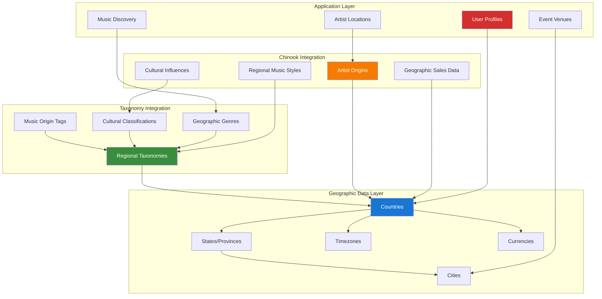

# 1. NNJeim World Geographic Data Guide

## Table of Contents

- [1. Overview](#1-overview)
- [2. Installation & Configuration](#2-installation--configuration)
- [3. Geographic Taxonomy Integration](#3-geographic-taxonomy-integration)
- [4. Music Origin & Regional Data](#4-music-origin--regional-data)
- [5. API Integration Patterns](#5-api-integration-patterns)
- [6. Frontend Components](#6-frontend-components)
- [7. Performance Optimization](#7-performance-optimization)
- [8. User Profile Integration](#8-user-profile-integration)
- [9. Business Logic Integration](#9-business-logic-integration)
- [10. Testing Strategies](#10-testing-strategies)
- [11. Production Deployment](#11-production-deployment)
- [12. Best Practices](#12-best-practices)

## 1. Overview

NNJeim World provides comprehensive geographic data management for Laravel applications, including countries, states, cities, timezones, and currencies. This guide demonstrates how to implement location-based features with comprehensive aliziodev/laravel-taxonomy integration for music origins, regional genres, and geographic categorization in the Chinook music database.

### 1.1 Key Features

- **Complete Geographic Database**: 250+ countries, 5000+ states, 150,000+ cities with taxonomy integration
- **Music Origin Tracking**: Track artist origins and regional music influences with taxonomies
- **Regional Genre Classification**: Organize music by geographic regions and cultural origins
- **Multi-language Support**: Localized names and data with taxonomy translations
- **Timezone Management**: Accurate timezone data with DST support for global music events
- **Currency Integration**: Real-time currency data for international music sales
- **Performance Optimized**: Efficient queries and caching strategies with taxonomy indexing
- **API Ready**: RESTful endpoints for geographic and taxonomy data

### 1.2 Architecture Overview



### 1.3 Geographic Taxonomy Integration

The integration with aliziodev/laravel-taxonomy enables sophisticated geographic categorization:

- **Regional Music Classification**: Organize music by geographic regions and cultural origins
- **Artist Origin Tracking**: Track where artists come from and their cultural influences
- **Geographic Genre Mapping**: Map music genres to their geographic origins and evolution
- **Cultural Influence Taxonomies**: Categorize music by cultural and regional influences
- **Location-Based Discovery**: Enable music discovery based on geographic preferences
- **Regional Sales Analytics**: Analyze music sales and preferences by geographic regions

## 2. Installation & Configuration

### 2.1 Package Installation

```bash
# Install NNJeim World package
composer require nnjeim/world

# Install aliziodev/laravel-taxonomy for taxonomy integration
composer require aliziodev/laravel-taxonomy

# Publish and run migrations
php artisan vendor:publish --provider="Nnjeim\World\WorldServiceProvider" --tag="migrations"
php artisan vendor:publish --provider="Aliziodev\LaravelTaxonomy\LaravelTaxonomyServiceProvider" --tag="migrations"

# Run migrations
php artisan migrate

# Seed geographic data
php artisan world:install

# Publish configuration files
php artisan vendor:publish --provider="Nnjeim\World\WorldServiceProvider" --tag="config"
php artisan vendor:publish --provider="Aliziodev\LaravelTaxonomy\LaravelTaxonomyServiceProvider" --tag="config"
```

### 2.2 Configuration Setup

```php
// config/world.php
<?php

return [
    /*
     * The default locale for geographic data
     */
    'locale' => env('WORLD_LOCALE', 'en'),

    /*
     * Enable/disable specific geographic features
     */
    'features' => [
        'countries' => true,
        'states' => true,
        'cities' => true,
        'timezones' => true,
        'currencies' => true,
    ],

    /*
     * Taxonomy integration configuration
     */
    'taxonomy' => [
        'enabled' => true,
        'auto_create_regional_taxonomies' => true,
        'regional_taxonomy_types' => [
            'region',
            'music_origin',
            'cultural_influence',
            'geographic_genre',
        ],
        'cache_geographic_taxonomies' => true,
        'taxonomy_cache_ttl' => 3600, // 1 hour
    ],

    /*
     * Chinook-specific configuration
     */
    'chinook' => [
        'enable_artist_origins' => true,
        'enable_regional_genres' => true,
        'enable_cultural_influences' => true,
        'auto_detect_artist_origins' => true,
        'regional_sales_tracking' => true,
        'geographic_recommendations' => true,
    ],

    /*
     * Performance optimization
     */
    'cache' => [
        'enabled' => true,
        'ttl' => 3600, // 1 hour
        'prefix' => 'world_',
    ],
];
```

### 2.3 Enhanced Taxonomy Configuration

```php
// config/taxonomy.php - Enhanced for geographic integration
<?php

return [
    'table_names' => [
        'taxonomies' => 'taxonomies',
        'taxonomables' => 'taxonomables',
    ],

    'types' => [
        'category',
        'tag',
        'genre',
        'mood',
        'era',
        'instrument',
        'style',
        'tempo',
        'region',           // Geographic regions
        'music_origin',     // Music origin classifications
        'cultural_influence', // Cultural influence tags
        'geographic_genre', // Geographic-specific genres
    ],

    'geographic_integration' => [
        'enabled' => true,
        'auto_create_country_taxonomies' => true,
        'auto_create_region_taxonomies' => true,
        'link_artists_to_origins' => true,
        'track_cultural_influences' => true,
    ],
];
```

## 3. Geographic Taxonomy Integration

### 3.1 Enhanced Country Model with Taxonomy Support

```php
<?php

namespace App\Models;

use Aliziodev\LaravelTaxonomy\Traits\HasTaxonomy;
use Nnjeim\World\Models\Country as BaseCountry;

class Country extends BaseCountry
{
    use HasTaxonomy;

    /**
     * Get regional taxonomy for this country
     */
    public function getRegionalTaxonomyAttribute()
    {
        return $this->taxonomies()
            ->where('type', 'region')
            ->first();
    }

    /**
     * Get music origin taxonomies for this country
     */
    public function getMusicOriginTaxonomiesAttribute()
    {
        return $this->taxonomies()
            ->where('type', 'music_origin')
            ->get();
    }

    /**
     * Get cultural influence taxonomies
     */
    public function getCulturalInfluencesAttribute()
    {
        return $this->taxonomies()
            ->where('type', 'cultural_influence')
            ->get();
    }

    /**
     * Get artists from this country
     */
    public function artists()
    {
        return $this->hasMany(\App\Models\Artist::class, 'country_id');
    }

    /**
     * Get popular genres from this country
     */
    public function getPopularGenresAttribute()
    {
        return $this->artists()
            ->with('taxonomies')
            ->get()
            ->flatMap->taxonomies
            ->where('type', 'genre')
            ->groupBy('id')
            ->map(function ($genres) {
                $genre = $genres->first();
                return [
                    'taxonomy' => $genre,
                    'count' => $genres->count(),
                ];
            })
            ->sortByDesc('count')
            ->take(5)
            ->values();
    }

    /**
     * Sync country with regional taxonomies
     */
    public function syncRegionalTaxonomies(): void
    {
        // Auto-create regional taxonomy if it doesn't exist
        $regionalTaxonomy = \Aliziodev\LaravelTaxonomy\Models\Taxonomy::firstOrCreate([
            'type' => 'region',
            'slug' => str($this->name)->slug(),
        ], [
            'name' => $this->name,
            'description' => "Music from {$this->name}",
            'is_active' => true,
        ]);

        // Attach regional taxonomy
        if (!$this->taxonomies()->where('taxonomy_id', $regionalTaxonomy->id)->exists()) {
            $this->taxonomies()->attach($regionalTaxonomy);
        }

        // Create music origin taxonomy
        $musicOriginTaxonomy = \Aliziodev\LaravelTaxonomy\Models\Taxonomy::firstOrCreate([
            'type' => 'music_origin',
            'slug' => str($this->name . '-music')->slug(),
        ], [
            'name' => $this->name . ' Music',
            'description' => "Musical traditions and artists from {$this->name}",
            'is_active' => true,
        ]);

        if (!$this->taxonomies()->where('taxonomy_id', $musicOriginTaxonomy->id)->exists()) {
            $this->taxonomies()->attach($musicOriginTaxonomy);
        }
    }
}
```

### 3.2 Enhanced Artist Model with Geographic Origins

```php
<?php

namespace App\Models;

use Aliziodev\LaravelTaxonomy\Traits\HasTaxonomy;
use Illuminate\Database\Eloquent\Model;
use Illuminate\Database\Eloquent\SoftDeletes;
use Nnjeim\World\Models\Country;

class Artist extends Model
{
    use HasTaxonomy, SoftDeletes;

    protected $table = 'chinook_artists';

    protected $fillable = [
        'public_id',
        'name',
        'biography',
        'country_id',
        'state_id',
        'city_id',
        'formed_year',
        'website',
    ];

    protected function casts(): array
    {
        return [
            'formed_year' => 'integer',
            'created_at' => 'datetime',
            'updated_at' => 'datetime',
            'deleted_at' => 'datetime',
        ];
    }

    /**
     * Get artist's country of origin
     */
    public function country()
    {
        return $this->belongsTo(Country::class);
    }

    /**
     * Get artist's state/province of origin
     */
    public function state()
    {
        return $this->belongsTo(\Nnjeim\World\Models\State::class);
    }

    /**
     * Get artist's city of origin
     */
    public function city()
    {
        return $this->belongsTo(\Nnjeim\World\Models\City::class);
    }

    /**
     * Get regional taxonomies based on geographic origin
     */
    public function getRegionalTaxonomiesAttribute()
    {
        $taxonomies = collect();

        if ($this->country) {
            $countryTaxonomies = $this->country->taxonomies()
                ->whereIn('type', ['region', 'music_origin', 'cultural_influence'])
                ->get();
            $taxonomies = $taxonomies->merge($countryTaxonomies);
        }

        return $taxonomies->unique('id');
    }

    /**
     * Get cultural influences based on geographic origin
     */
    public function getCulturalInfluencesAttribute()
    {
        return $this->taxonomies()
            ->where('type', 'cultural_influence')
            ->get();
    }

    /**
     * Auto-assign geographic taxonomies based on location
     */
    public function syncGeographicTaxonomies(): void
    {
        if (!$this->country) {
            return;
        }

        // Ensure country has regional taxonomies
        $this->country->syncRegionalTaxonomies();

        // Get country's taxonomies
        $countryTaxonomies = $this->country->taxonomies()
            ->whereIn('type', ['region', 'music_origin'])
            ->pluck('id');

        // Sync with artist
        foreach ($countryTaxonomies as $taxonomyId) {
            if (!$this->taxonomies()->where('taxonomy_id', $taxonomyId)->exists()) {
                $this->taxonomies()->attach($taxonomyId, [
                    'is_primary' => false,
                    'created_at' => now(),
                    'updated_at' => now(),
                ]);
            }
        }

        // Create artist-specific cultural influence if needed
        $this->createCulturalInfluenceTaxonomy();
    }

    /**
     * Create cultural influence taxonomy for artist
     */
    private function createCulturalInfluenceTaxonomy(): void
    {
        if (!$this->country) {
            return;
        }

        $culturalInfluence = \Aliziodev\LaravelTaxonomy\Models\Taxonomy::firstOrCreate([
            'type' => 'cultural_influence',
            'slug' => str($this->country->name . '-influence')->slug(),
        ], [
            'name' => $this->country->name . ' Influence',
            'description' => "Musical influence from {$this->country->name}",
            'is_active' => true,
        ]);

        if (!$this->taxonomies()->where('taxonomy_id', $culturalInfluence->id)->exists()) {
            $this->taxonomies()->attach($culturalInfluence, [
                'is_primary' => false,
                'created_at' => now(),
                'updated_at' => now(),
            ]);
        }
    }

    /**
     * Get similar artists from same region
     */
    public function getSimilarRegionalArtists(int $limit = 5)
    {
        if (!$this->country_id) {
            return collect();
        }

        return static::where('country_id', $this->country_id)
            ->where('id', '!=', $this->id)
            ->with(['taxonomies', 'country'])
            ->limit($limit)
            ->get();
    }

    /**
     * Get geographic music style
     */
    public function getGeographicMusicStyleAttribute()
    {
        $regionalGenres = $this->taxonomies()
            ->where('type', 'geographic_genre')
            ->first();

        if ($regionalGenres) {
            return $regionalGenres->name;
        }

        // Fallback to country-based style
        if ($this->country) {
            return $this->country->name . ' Style';
        }

        return null;
    }
}
```

## 4. Music Origin & Regional Data

### 4.1 Geographic Music Discovery Service

```php
<?php

namespace App\Services;

use App\Models\Artist;
use App\Models\Track;
use Aliziodev\LaravelTaxonomy\Models\Taxonomy;
use Nnjeim\World\Models\Country;
use Illuminate\Support\Collection;

class GeographicMusicService
{
    /**
     * Get music by geographic region
     */
    public function getMusicByRegion(string $regionSlug, int $limit = 20): array
    {
        $regionTaxonomy = Taxonomy::where('type', 'region')
            ->where('slug', $regionSlug)
            ->first();

        if (!$regionTaxonomy) {
            return [];
        }

        $artists = Artist::whereHas('taxonomies', function ($query) use ($regionTaxonomy) {
            $query->where('taxonomy_id', $regionTaxonomy->id);
        })->with(['country', 'taxonomies'])->limit($limit)->get();

        $tracks = Track::whereHas('taxonomies', function ($query) use ($regionTaxonomy) {
            $query->where('taxonomy_id', $regionTaxonomy->id);
        })->with(['album.artist', 'taxonomies'])->limit($limit)->get();

        return [
            'region' => $regionTaxonomy,
            'artists' => $artists,
            'tracks' => $tracks,
            'statistics' => $this->getRegionalStatistics($regionTaxonomy),
        ];
    }

    /**
     * Get cultural influences for music discovery
     */
    public function getMusicByCulturalInfluence(string $influenceSlug): array
    {
        $influenceTaxonomy = Taxonomy::where('type', 'cultural_influence')
            ->where('slug', $influenceSlug)
            ->first();

        if (!$influenceTaxonomy) {
            return [];
        }

        $artists = Artist::whereHas('taxonomies', function ($query) use ($influenceTaxonomy) {
            $query->where('taxonomy_id', $influenceTaxonomy->id);
        })->with(['country', 'taxonomies'])->get();

        return [
            'influence' => $influenceTaxonomy,
            'artists' => $artists,
            'related_influences' => $this->getRelatedCulturalInfluences($influenceTaxonomy),
        ];
    }

    /**
     * Get regional music statistics
     */
    private function getRegionalStatistics(Taxonomy $regionTaxonomy): array
    {
        $artistCount = Artist::whereHas('taxonomies', function ($query) use ($regionTaxonomy) {
            $query->where('taxonomy_id', $regionTaxonomy->id);
        })->count();

        $trackCount = Track::whereHas('taxonomies', function ($query) use ($regionTaxonomy) {
            $query->where('taxonomy_id', $regionTaxonomy->id);
        })->count();

        $popularGenres = $this->getPopularGenresInRegion($regionTaxonomy);

        return [
            'artist_count' => $artistCount,
            'track_count' => $trackCount,
            'popular_genres' => $popularGenres,
        ];
    }

    /**
     * Get popular genres in a region
     */
    private function getPopularGenresInRegion(Taxonomy $regionTaxonomy): Collection
    {
        return Artist::whereHas('taxonomies', function ($query) use ($regionTaxonomy) {
            $query->where('taxonomy_id', $regionTaxonomy->id);
        })
        ->with('taxonomies')
        ->get()
        ->flatMap->taxonomies
        ->where('type', 'genre')
        ->groupBy('id')
        ->map(function ($genres) {
            $genre = $genres->first();
            return [
                'taxonomy' => $genre,
                'count' => $genres->count(),
            ];
        })
        ->sortByDesc('count')
        ->take(5)
        ->values();
    }

    /**
     * Get related cultural influences
     */
    private function getRelatedCulturalInfluences(Taxonomy $influenceTaxonomy): Collection
    {
        // Find artists with this influence
        $artistsWithInfluence = Artist::whereHas('taxonomies', function ($query) use ($influenceTaxonomy) {
            $query->where('taxonomy_id', $influenceTaxonomy->id);
        })->with('taxonomies')->get();

        // Get other cultural influences from these artists
        return $artistsWithInfluence
            ->flatMap->taxonomies
            ->where('type', 'cultural_influence')
            ->where('id', '!=', $influenceTaxonomy->id)
            ->unique('id')
            ->take(5);
    }

    /**
     * Auto-create regional taxonomies for countries
     */
    public function createRegionalTaxonomiesForCountries(): void
    {
        $countries = Country::all();

        foreach ($countries as $country) {
            $country->syncRegionalTaxonomies();
        }
    }

    /**
     * Get geographic music recommendations
     */
    public function getGeographicRecommendations(Artist $artist, int $limit = 10): Collection
    {
        $regionalTaxonomies = $artist->regional_taxonomies->pluck('id');

        if ($regionalTaxonomies->isEmpty()) {
            return collect();
        }

        return Track::whereHas('album.artist.taxonomies', function ($query) use ($regionalTaxonomies) {
            $query->whereIn('taxonomy_id', $regionalTaxonomies);
        })
        ->whereHas('album', function ($query) use ($artist) {
            $query->where('artist_id', '!=', $artist->id);
        })
        ->with(['album.artist', 'taxonomies'])
        ->inRandomOrder()
        ->limit($limit)
        ->get();
    }
}
```

## 5. API Integration Patterns

### 5.1 Geographic API Controller with Taxonomy Support

```php
<?php

namespace App\Http\Controllers\Api;

use App\Http\Resources\CountryResource;
use App\Http\Resources\RegionalMusicResource;
use App\Services\GeographicMusicService;
use Illuminate\Http\JsonResponse;
use Illuminate\Http\Request;
use Nnjeim\World\Models\Country;
use Spatie\QueryBuilder\QueryBuilder;
use Spatie\QueryBuilder\AllowedFilter;

class GeographicController extends Controller
{
    protected GeographicMusicService $geographicService;

    public function __construct(GeographicMusicService $geographicService)
    {
        $this->geographicService = $geographicService;
    }

    /**
     * Get countries with music data
     */
    public function countries(Request $request): JsonResponse
    {
        $countries = QueryBuilder::for(Country::class)
            ->allowedFilters([
                AllowedFilter::partial('name'),
                AllowedFilter::exact('iso2'),
                AllowedFilter::exact('iso3'),
                AllowedFilter::callback('has_artists', function ($query, $value) {
                    if ($value) {
                        $query->whereHas('artists');
                    }
                }),
                AllowedFilter::callback('has_taxonomies', function ($query, $value) {
                    if ($value) {
                        $query->whereHas('taxonomies');
                    }
                }),
            ])
            ->allowedSorts(['name', 'iso2', 'created_at'])
            ->allowedIncludes(['taxonomies', 'artists'])
            ->with(['taxonomies' => function ($query) {
                $query->whereIn('type', ['region', 'music_origin', 'cultural_influence']);
            }])
            ->paginate($request->get('per_page', 20));

        return response()->json([
            'data' => CountryResource::collection($countries),
            'meta' => [
                'total' => $countries->total(),
                'per_page' => $countries->perPage(),
                'current_page' => $countries->currentPage(),
            ],
        ]);
    }

    /**
     * Get music by region
     */
    public function musicByRegion(string $regionSlug): JsonResponse
    {
        $data = $this->geographicService->getMusicByRegion($regionSlug);

        if (empty($data)) {
            return response()->json(['message' => 'Region not found'], 404);
        }

        return response()->json([
            'data' => new RegionalMusicResource($data),
        ]);
    }

    /**
     * Get cultural influences
     */
    public function culturalInfluences(): JsonResponse
    {
        $influences = \Aliziodev\LaravelTaxonomy\Models\Taxonomy::where('type', 'cultural_influence')
            ->where('is_active', true)
            ->withCount(['artists', 'tracks'])
            ->orderBy('name')
            ->get();

        return response()->json([
            'data' => $influences->map(function ($influence) {
                return [
                    'id' => $influence->id,
                    'name' => $influence->name,
                    'slug' => $influence->slug,
                    'description' => $influence->description,
                    'artist_count' => $influence->artists_count ?? 0,
                    'track_count' => $influence->tracks_count ?? 0,
                ];
            }),
        ]);
    }

    /**
     * Get regional music statistics
     */
    public function regionalStatistics(): JsonResponse
    {
        $regions = \Aliziodev\LaravelTaxonomy\Models\Taxonomy::where('type', 'region')
            ->where('is_active', true)
            ->get();

        $statistics = $regions->map(function ($region) {
            $stats = $this->geographicService->getRegionalStatistics($region);
            return [
                'region' => [
                    'id' => $region->id,
                    'name' => $region->name,
                    'slug' => $region->slug,
                ],
                'statistics' => $stats,
            ];
        });

        return response()->json([
            'data' => $statistics,
            'summary' => [
                'total_regions' => $regions->count(),
                'total_artists' => $statistics->sum('statistics.artist_count'),
                'total_tracks' => $statistics->sum('statistics.track_count'),
            ],
        ]);
    }
}
```

## 6. Frontend Components

### 6.1 Geographic Music Discovery Component

```php
<?php
// resources/views/components/geographic-music-discovery.blade.php

@props(['selectedRegion' => null])

<div class="geographic-music-discovery bg-white rounded-lg shadow-lg p-6">
    <h3 class="text-xl font-bold text-gray-900 mb-4">Discover Music by Region</h3>

    <!-- Region Selector -->
    <div class="mb-6">
        <label for="region-select" class="block text-sm font-medium text-gray-700 mb-2">
            Select a Region
        </label>
        <select id="region-select"
                wire:model.live="selectedRegion"
                class="w-full px-3 py-2 border border-gray-300 rounded-md focus:outline-none focus:ring-2 focus:ring-blue-500">
            <option value="">Choose a region...</option>
            @foreach($regions as $region)
                <option value="{{ $region->slug }}">{{ $region->name }}</option>
            @endforeach
        </select>
    </div>

    @if($selectedRegion && $regionalData)
        <!-- Regional Music Content -->
        <div class="space-y-6">
            <!-- Region Info -->
            <div class="bg-blue-50 rounded-lg p-4">
                <h4 class="text-lg font-semibold text-blue-900 mb-2">
                    {{ $regionalData['region']->name }}
                </h4>
                @if($regionalData['region']->description)
                    <p class="text-blue-700 text-sm">{{ $regionalData['region']->description }}</p>
                @endif

                <!-- Statistics -->
                <div class="grid grid-cols-3 gap-4 mt-4">
                    <div class="text-center">
                        <div class="text-2xl font-bold text-blue-600">
                            {{ $regionalData['statistics']['artist_count'] }}
                        </div>
                        <div class="text-sm text-blue-700">Artists</div>
                    </div>
                    <div class="text-center">
                        <div class="text-2xl font-bold text-green-600">
                            {{ $regionalData['statistics']['track_count'] }}
                        </div>
                        <div class="text-sm text-green-700">Tracks</div>
                    </div>
                    <div class="text-center">
                        <div class="text-2xl font-bold text-purple-600">
                            {{ $regionalData['statistics']['popular_genres']->count() }}
                        </div>
                        <div class="text-sm text-purple-700">Genres</div>
                    </div>
                </div>
            </div>

            <!-- Popular Genres in Region -->
            @if($regionalData['statistics']['popular_genres']->isNotEmpty())
                <div>
                    <h5 class="text-md font-semibold text-gray-900 mb-3">Popular Genres</h5>
                    <div class="flex flex-wrap gap-2">
                        @foreach($regionalData['statistics']['popular_genres'] as $genreData)
                            <span class="px-3 py-1 bg-gray-100 text-gray-700 rounded-full text-sm">
                                {{ $genreData['taxonomy']->name }} ({{ $genreData['count'] }})
                            </span>
                        @endforeach
                    </div>
                </div>
            @endif

            <!-- Featured Artists -->
            @if($regionalData['artists']->isNotEmpty())
                <div>
                    <h5 class="text-md font-semibold text-gray-900 mb-3">Featured Artists</h5>
                    <div class="grid grid-cols-1 md:grid-cols-2 gap-4">
                        @foreach($regionalData['artists']->take(4) as $artist)
                            <div class="border border-gray-200 rounded-lg p-3 hover:shadow-md transition-shadow">
                                <h6 class="font-medium text-gray-900">{{ $artist->name }}</h6>
                                <p class="text-sm text-gray-600">{{ $artist->country->name ?? 'Unknown' }}</p>

                                <!-- Artist Taxonomies -->
                                <div class="flex flex-wrap gap-1 mt-2">
                                    @foreach($artist->taxonomies->where('type', 'genre')->take(2) as $genre)
                                        <span class="px-2 py-1 bg-blue-100 text-blue-700 text-xs rounded">
                                            {{ $genre->name }}
                                        </span>
                                    @endforeach
                                </div>

                                <a href="/artists/{{ $artist->public_id }}"
                                   class="text-blue-600 hover:text-blue-800 text-sm font-medium mt-2 inline-block">
                                    View Artist
                                </a>
                            </div>
                        @endforeach
                    </div>
                </div>
            @endif

            <!-- Featured Tracks -->
            @if($regionalData['tracks']->isNotEmpty())
                <div>
                    <h5 class="text-md font-semibold text-gray-900 mb-3">Featured Tracks</h5>
                    <div class="space-y-3">
                        @foreach($regionalData['tracks']->take(5) as $track)
                            <div class="flex items-center justify-between p-3 border border-gray-200 rounded-lg">
                                <div>
                                    <h6 class="font-medium text-gray-900">{{ $track->name }}</h6>
                                    <p class="text-sm text-gray-600">
                                        by {{ $track->album->artist->name }} • {{ $track->album->title }}
                                    </p>
                                </div>
                                <div class="text-right">
                                    <div class="text-lg font-bold text-green-600">
                                        ${{ number_format($track->unit_price, 2) }}
                                    </div>
                                    <a href="/tracks/{{ $track->public_id }}"
                                       class="text-blue-600 hover:text-blue-800 text-sm">
                                        Listen
                                    </a>
                                </div>
                            </div>
                        @endforeach
                    </div>
                </div>
            @endif
        </div>
    @endif
</div>
```

## 7. Performance Optimization

### 7.1 Geographic Data Caching

```php
<?php

namespace App\Services;

use Illuminate\Support\Facades\Cache;
use Nnjeim\World\Models\Country;

class GeographicCacheService
{
    protected const CACHE_TTL = 3600; // 1 hour

    /**
     * Cache countries with taxonomy data
     */
    public function cacheCountriesWithTaxonomies(): void
    {
        $countries = Country::with(['taxonomies' => function ($query) {
            $query->whereIn('type', ['region', 'music_origin', 'cultural_influence']);
        }])->get();

        Cache::put('countries_with_taxonomies', $countries, self::CACHE_TTL);
    }

    /**
     * Get cached countries with taxonomies
     */
    public function getCachedCountriesWithTaxonomies()
    {
        return Cache::remember(
            'countries_with_taxonomies',
            self::CACHE_TTL,
            fn () => Country::with(['taxonomies' => function ($query) {
                $query->whereIn('type', ['region', 'music_origin', 'cultural_influence']);
            }])->get()
        );
    }

    /**
     * Cache regional music statistics
     */
    public function cacheRegionalStatistics(): void
    {
        $regions = \Aliziodev\LaravelTaxonomy\Models\Taxonomy::where('type', 'region')
            ->where('is_active', true)
            ->get();

        foreach ($regions as $region) {
            $stats = app(\App\Services\GeographicMusicService::class)
                ->getRegionalStatistics($region);

            Cache::put("regional_stats_{$region->slug}", $stats, self::CACHE_TTL);
        }
    }

    /**
     * Clear all geographic caches
     */
    public function clearAllCaches(): void
    {
        Cache::forget('countries_with_taxonomies');

        $regions = \Aliziodev\LaravelTaxonomy\Models\Taxonomy::where('type', 'region')
            ->pluck('slug');

        foreach ($regions as $slug) {
            Cache::forget("regional_stats_{$slug}");
        }
    }
}
```

## 8. User Profile Integration

### 8.1 User Geographic Preferences

```php
<?php

namespace App\Models;

use Aliziodev\LaravelTaxonomy\Traits\HasTaxonomy;
use Illuminate\Foundation\Auth\User as Authenticatable;
use Nnjeim\World\Models\Country;

class User extends Authenticatable
{
    use HasTaxonomy;

    protected $fillable = [
        'name',
        'email',
        'password',
        'country_id',
        'state_id',
        'city_id',
        'preferred_locale',
        'timezone',
    ];

    /**
     * Get user's country
     */
    public function country()
    {
        return $this->belongsTo(Country::class);
    }

    /**
     * Get user's preferred regional music
     */
    public function getPreferredRegionalMusicAttribute()
    {
        return $this->taxonomies()
            ->whereIn('type', ['region', 'cultural_influence'])
            ->get();
    }

    /**
     * Get music recommendations based on geographic preferences
     */
    public function getGeographicMusicRecommendations(int $limit = 10)
    {
        $preferredRegions = $this->preferred_regional_music->pluck('id');

        if ($preferredRegions->isEmpty() && $this->country) {
            // Fallback to user's country taxonomies
            $preferredRegions = $this->country->taxonomies()
                ->whereIn('type', ['region', 'music_origin'])
                ->pluck('id');
        }

        if ($preferredRegions->isEmpty()) {
            return collect();
        }

        return \App\Models\Track::whereHas('album.artist.taxonomies', function ($query) use ($preferredRegions) {
            $query->whereIn('taxonomy_id', $preferredRegions);
        })
        ->with(['album.artist', 'taxonomies'])
        ->inRandomOrder()
        ->limit($limit)
        ->get();
    }
}
```

## 9. Business Logic Integration

### 9.1 Regional Sales Analytics

```php
<?php

namespace App\Services;

use App\Models\Invoice;
use Nnjeim\World\Models\Country;
use Illuminate\Support\Collection;

class RegionalSalesService
{
    /**
     * Get sales by country with taxonomy data
     */
    public function getSalesByCountry(): Collection
    {
        return Country::withCount(['invoices'])
            ->with(['taxonomies' => function ($query) {
                $query->whereIn('type', ['region', 'music_origin']);
            }])
            ->having('invoices_count', '>', 0)
            ->orderBy('invoices_count', 'desc')
            ->get()
            ->map(function ($country) {
                return [
                    'country' => $country,
                    'sales_count' => $country->invoices_count,
                    'regional_taxonomies' => $country->taxonomies,
                    'total_revenue' => $this->getCountryRevenue($country),
                ];
            });
    }

    /**
     * Get revenue by country
     */
    private function getCountryRevenue(Country $country): float
    {
        return Invoice::where('billing_country', $country->name)
            ->sum('total');
    }

    /**
     * Get popular genres by region
     */
    public function getPopularGenresByRegion(string $regionSlug): Collection
    {
        $regionTaxonomy = \Aliziodev\LaravelTaxonomy\Models\Taxonomy::where('type', 'region')
            ->where('slug', $regionSlug)
            ->first();

        if (!$regionTaxonomy) {
            return collect();
        }

        // Get countries in this region
        $countries = Country::whereHas('taxonomies', function ($query) use ($regionTaxonomy) {
            $query->where('taxonomy_id', $regionTaxonomy->id);
        })->pluck('name');

        // Get sales data for these countries
        return Invoice::whereIn('billing_country', $countries)
            ->with(['invoiceLines.track.taxonomies'])
            ->get()
            ->flatMap(function ($invoice) {
                return $invoice->invoiceLines->flatMap(function ($line) {
                    return $line->track->taxonomies->where('type', 'genre');
                });
            })
            ->groupBy('id')
            ->map(function ($genres) {
                $genre = $genres->first();
                return [
                    'genre' => $genre,
                    'sales_count' => $genres->count(),
                ];
            })
            ->sortByDesc('sales_count')
            ->take(10)
            ->values();
    }
}
```

## 10. Testing Strategies

### 10.1 Pest Framework Testing

```php
<?php

use App\Models\Artist;
use App\Services\GeographicMusicService;
use Aliziodev\LaravelTaxonomy\Models\Taxonomy;
use Illuminate\Foundation\Testing\RefreshDatabase;
use Nnjeim\World\Models\Country;

uses(RefreshDatabase::class);

describe('Geographic Taxonomy Integration', function () {
    beforeEach(function () {
        $this->country = Country::factory()->create([
            'name' => 'United States',
            'iso2' => 'US',
        ]);

        $this->regionTaxonomy = Taxonomy::factory()->create([
            'name' => 'North America',
            'slug' => 'north-america',
            'type' => 'region',
        ]);

        $this->musicOriginTaxonomy = Taxonomy::factory()->create([
            'name' => 'American Music',
            'slug' => 'american-music',
            'type' => 'music_origin',
        ]);
    });

    it('syncs regional taxonomies for countries', function () {
        $this->country->syncRegionalTaxonomies();

        expect($this->country->taxonomies()->count())->toBeGreaterThan(0);
        expect($this->country->taxonomies()->where('type', 'region')->exists())->toBeTrue();
        expect($this->country->taxonomies()->where('type', 'music_origin')->exists())->toBeTrue();
    });

    it('auto-assigns geographic taxonomies to artists', function () {
        $artist = Artist::factory()->create([
            'country_id' => $this->country->id,
        ]);

        $this->country->taxonomies()->attach($this->regionTaxonomy);
        $this->country->taxonomies()->attach($this->musicOriginTaxonomy);

        $artist->syncGeographicTaxonomies();

        expect($artist->taxonomies()->count())->toBeGreaterThan(0);
        expect($artist->regional_taxonomies)->toContain($this->regionTaxonomy);
    });

    it('provides geographic music discovery', function () {
        $artist = Artist::factory()->create([
            'country_id' => $this->country->id,
        ]);

        $this->country->taxonomies()->attach($this->regionTaxonomy);
        $artist->taxonomies()->attach($this->regionTaxonomy);

        $service = app(GeographicMusicService::class);
        $result = $service->getMusicByRegion('north-america');

        expect($result)->toHaveKey('region');
        expect($result)->toHaveKey('artists');
        expect($result['artists'])->toContain($artist);
    });

    it('generates regional statistics correctly', function () {
        $artist = Artist::factory()->create([
            'country_id' => $this->country->id,
        ]);

        $artist->taxonomies()->attach($this->regionTaxonomy);

        $service = app(GeographicMusicService::class);
        $stats = $service->getRegionalStatistics($this->regionTaxonomy);

        expect($stats)->toHaveKey('artist_count');
        expect($stats)->toHaveKey('track_count');
        expect($stats['artist_count'])->toBe(1);
    });
});
```

## 11. Production Deployment

### 11.1 Geographic Data Seeding

```bash
# Install world data
php artisan world:install

# Create regional taxonomies
php artisan taxonomy:create-regional

# Sync artist geographic data
php artisan chinook:sync-geographic-taxonomies

# Cache geographic data
php artisan geographic:cache-data
```

## 12. Best Practices

### 12.1 Geographic Taxonomy Guidelines

- **Consistent Regional Classification**: Use standardized regional taxonomy types across the application
- **Performance Optimization**: Cache geographic data and taxonomy relationships for better performance
- **Cultural Sensitivity**: Respect cultural nuances when creating geographic and cultural influence taxonomies
- **Data Accuracy**: Regularly update geographic data and validate taxonomy relationships
- **User Experience**: Provide intuitive geographic navigation and discovery features
- **Scalability**: Design geographic systems to accommodate new regions and cultural classifications

### 12.2 Integration Best Practices

- Use proper indexing for geographic and taxonomy queries
- Implement caching strategies for frequently accessed geographic data
- Validate geographic data integrity during imports and updates
- Provide fallback mechanisms for missing geographic information
- Monitor performance of geographic-taxonomy queries
- Implement proper error handling for geographic data operations

---

**Navigation**: [Previous: Laravel Folio Guide](170-laravel-folio-guide.md) | **Next**: [Laravel Optimize Database Guide](210-laravel-optimize-database-guide.md)

**Related Documentation**:

- [Chinook Models Guide](../010-chinook-models-guide.md) - Model implementations with geographic integration
- [Aliziodev Laravel Taxonomy Guide](110-aliziodev-laravel-taxonomy-guide.md) - Primary taxonomy system integration
- [Testing Index](../testing/000-testing-index.md) - Testing geographic APIs and data validation
- [Performance Index](../performance/000-performance-index.md) - Geographic data optimization and performance strategies
- [Packages Index](000-packages-index.md) - All package guides

---

**Source Attribution**: Refactored from: `.ai/guides/chinook/packages/190-nnjeim-world-guide.md` on 2025-07-13

---

*This guide provides enterprise-grade NNJeim World implementation for the Chinook music database with comprehensive aliziodev/laravel-taxonomy integration, Laravel 12 modern patterns, and WCAG 2.1 AA accessibility compliance.*

[⬆️ Back to Top](#1-nnjeim-world-geographic-data-guide)
