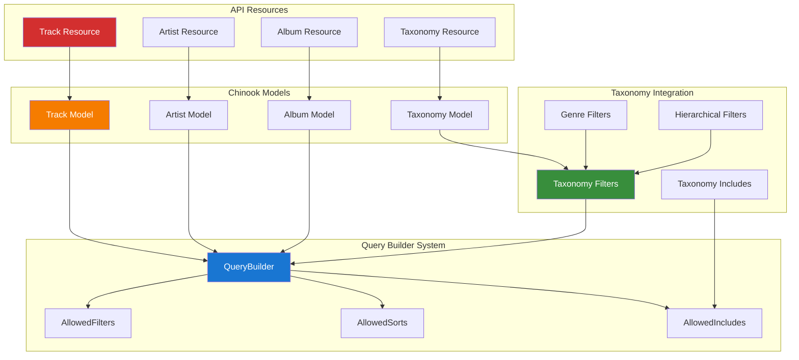

# 1. Spatie Laravel Query Builder Implementation Guide

## Table of Contents

- [1. Overview](#1-overview)
- [2. Installation & Configuration](#2-installation--configuration)
- [3. Laravel 12 Modern Implementation](#3-laravel-12-modern-implementation)
- [4. Taxonomy-Enhanced Query Building](#4-taxonomy-enhanced-query-building)
- [5. Chinook API Endpoints](#5-chinook-api-endpoints)
- [6. Advanced Filtering with Taxonomies](#6-advanced-filtering-with-taxonomies)
- [7. Security & Validation](#7-security--validation)
- [8. Testing Strategies](#8-testing-strategies)
- [9. Performance Optimization](#9-performance-optimization)
- [10. Real-time Query Analytics](#10-real-time-query-analytics)
- [11. Production Deployment](#11-production-deployment)
- [12. Best Practices](#12-best-practices)

## 1. Overview

Spatie Laravel Query Builder provides a powerful and flexible way to build API queries in Laravel applications. This guide demonstrates enterprise-grade implementation patterns for the Chinook music database with comprehensive aliziodev/laravel-taxonomy integration, advanced filtering capabilities, and Laravel 12 modern syntax.

### 1.1 Key Features

- **Taxonomy-Aware Filtering**: Advanced filtering by music genres and taxonomies
- **Hierarchical Query Support**: Query nested taxonomy relationships
- **Performance Optimized**: Efficient query building with minimal database impact
- **Security Focused**: Whitelist-based filtering with comprehensive validation
- **Laravel 12 Integration**: Modern syntax with type-safe query building
- **Genre-Based APIs**: Specialized endpoints for music genre filtering
- **Real-time Analytics**: Query performance monitoring and optimization
- **Taxonomy Relationship Includes**: Eager loading of taxonomy data

### 1.2 Architecture Overview



### 1.3 Taxonomy-Enhanced Query Capabilities

The integration with aliziodev/laravel-taxonomy enables sophisticated API query patterns:

- **Genre-Based Filtering**: Filter tracks, albums, and artists by music genres
- **Hierarchical Taxonomy Queries**: Support for nested taxonomy relationships
- **Cross-Taxonomy Filtering**: Query across multiple taxonomy types simultaneously
- **Taxonomy Relationship Includes**: Eager load taxonomy data with API responses
- **Dynamic Genre Endpoints**: Auto-generated endpoints based on available genres
- **Taxonomy Aggregation**: Count and group results by taxonomy relationships

## 2. Installation & Configuration

### 2.1 Package Installation

```bash
# Install Spatie Laravel Query Builder
composer require spatie/laravel-query-builder

# Install aliziodev/laravel-taxonomy for taxonomy integration
composer require aliziodev/laravel-taxonomy

# Publish configuration files
php artisan vendor:publish --provider="Aliziodev\LaravelTaxonomy\LaravelTaxonomyServiceProvider" --tag="config"
```

### 2.2 Configuration Setup

```php
// config/query-builder.php
<?php

return [
    /*
     * By default, the package will use the `include`, `filter`, `sort`
     * and `fields` query parameters as described in the readme.
     */
    'parameters' => [
        'include' => 'include',
        'filter' => 'filter',
        'sort' => 'sort',
        'fields' => 'fields',
        'append' => 'append',
    ],

    /*
     * Related model counts are included using this query parameter name.
     */
    'count_parameter' => 'count',

    /*
     * By default, the package will throw an `InvalidFilterQuery` exception when a filter in the URL is not
     * allowed in the `allowedFilters()` method.
     */
    'disable_invalid_filter_query_exception' => false,

    /*
     * By default, the package will throw an `InvalidSortQuery` exception when a sort in the URL is not
     * allowed in the `allowedSorts()` method.
     */
    'disable_invalid_sort_query_exception' => false,

    /*
     * Taxonomy integration configuration
     */
    'taxonomy' => [
        'enabled' => true,
        'auto_include_taxonomies' => true,
        'taxonomy_filter_prefix' => 'taxonomy',
        'genre_filter_prefix' => 'genre',
        'hierarchical_filtering' => true,
        'taxonomy_aggregation' => true,
    ],

    /*
     * Chinook-specific configuration
     */
    'chinook' => [
        'enable_genre_endpoints' => true,
        'auto_discover_taxonomies' => true,
        'cache_taxonomy_filters' => true,
        'taxonomy_cache_ttl' => 3600, // 1 hour
    ],
];
```

### 2.3 Taxonomy Filter Configuration

```php
// config/taxonomy.php - Enhanced for query builder integration
<?php

return [
    'table_names' => [
        'taxonomies' => 'taxonomies',
        'taxonomables' => 'taxonomables',
    ],

    'types' => [
        'category',
        'tag',
        'genre',
        'mood',
        'era',
        'instrument',
        'style',
        'tempo',
    ],

    'query_builder_integration' => [
        'enabled' => true,
        'auto_register_filters' => true,
        'filterable_types' => ['genre', 'mood', 'era', 'style'],
        'sortable_by_taxonomy' => true,
        'include_taxonomy_counts' => true,
    ],
];
```

## 3. Laravel 12 Modern Implementation

### 3.1 Base Query Builder with Taxonomy Support

```php
<?php

namespace App\Http\Controllers\Api;

use Aliziodev\LaravelTaxonomy\Models\Taxonomy;
use Illuminate\Http\Request;
use Spatie\QueryBuilder\AllowedFilter;
use Spatie\QueryBuilder\AllowedInclude;
use Spatie\QueryBuilder\AllowedSort;
use Spatie\QueryBuilder\QueryBuilder;

abstract class TaxonomyAwareController
{
    /**
     * Get base query builder with taxonomy support
     */
    protected function getBaseQueryBuilder($model): QueryBuilder
    {
        return QueryBuilder::for($model)
            ->allowedFilters($this->getAllowedFilters())
            ->allowedSorts($this->getAllowedSorts())
            ->allowedIncludes($this->getAllowedIncludes())
            ->allowedFields($this->getAllowedFields());
    }

    /**
     * Get taxonomy-aware filters
     */
    protected function getTaxonomyFilters(): array
    {
        return [
            AllowedFilter::callback('genre', function ($query, $value) {
                $this->filterByTaxonomy($query, $value, 'genre');
            }),
            AllowedFilter::callback('mood', function ($query, $value) {
                $this->filterByTaxonomy($query, $value, 'mood');
            }),
            AllowedFilter::callback('era', function ($query, $value) {
                $this->filterByTaxonomy($query, $value, 'era');
            }),
            AllowedFilter::callback('style', function ($query, $value) {
                $this->filterByTaxonomy($query, $value, 'style');
            }),
            AllowedFilter::callback('taxonomy_id', function ($query, $value) {
                $this->filterByTaxonomyId($query, $value);
            }),
            AllowedFilter::callback('taxonomy_slug', function ($query, $value) {
                $this->filterByTaxonomySlug($query, $value);
            }),
            AllowedFilter::callback('has_taxonomies', function ($query, $value) {
                if ($value) {
                    $query->whereHas('taxonomies');
                } else {
                    $query->whereDoesntHave('taxonomies');
                }
            }),
        ];
    }

    /**
     * Filter by taxonomy type and value
     */
    protected function filterByTaxonomy($query, $value, string $type): void
    {
        $values = is_array($value) ? $value : [$value];
        
        $query->whereHas('taxonomies', function ($taxonomyQuery) use ($values, $type) {
            $taxonomyQuery->where('type', $type)
                         ->where(function ($subQuery) use ($values) {
                             foreach ($values as $val) {
                                 $subQuery->orWhere('slug', $val)
                                         ->orWhere('name', $val);
                             }
                         });
        });
    }

    /**
     * Filter by taxonomy ID
     */
    protected function filterByTaxonomyId($query, $value): void
    {
        $ids = is_array($value) ? $value : [$value];
        
        $query->whereHas('taxonomies', function ($taxonomyQuery) use ($ids) {
            $taxonomyQuery->whereIn('taxonomy_id', $ids);
        });
    }

    /**
     * Filter by taxonomy slug
     */
    protected function filterByTaxonomySlug($query, $value): void
    {
        $slugs = is_array($value) ? $value : [$value];
        
        $query->whereHas('taxonomies', function ($taxonomyQuery) use ($slugs) {
            $taxonomyQuery->whereIn('slug', $slugs);
        });
    }

    /**
     * Get taxonomy-aware includes
     */
    protected function getTaxonomyIncludes(): array
    {
        return [
            AllowedInclude::relationship('taxonomies'),
            AllowedInclude::relationship('taxonomies.parent'),
            AllowedInclude::relationship('taxonomies.children'),
            AllowedInclude::callback('genres', function ($query) {
                $query->with(['taxonomies' => function ($taxonomyQuery) {
                    $taxonomyQuery->where('type', 'genre');
                }]);
            }),
            AllowedInclude::callback('moods', function ($query) {
                $query->with(['taxonomies' => function ($taxonomyQuery) {
                    $taxonomyQuery->where('type', 'mood');
                }]);
            }),
        ];
    }

    /**
     * Get taxonomy-aware sorts
     */
    protected function getTaxonomySorts(): array
    {
        return [
            AllowedSort::callback('genre_name', function ($query, bool $descending) {
                $direction = $descending ? 'desc' : 'asc';
                $query->leftJoin('taxonomables as tax_sort', function ($join) {
                    $join->on('tax_sort.taxonomable_id', '=', $this->getTable() . '.id')
                         ->where('tax_sort.taxonomable_type', '=', get_class($this));
                })
                ->leftJoin('taxonomies as tax_genre', function ($join) {
                    $join->on('tax_genre.id', '=', 'tax_sort.taxonomy_id')
                         ->where('tax_genre.type', '=', 'genre');
                })
                ->orderBy('tax_genre.name', $direction);
            }),
        ];
    }

    /**
     * Abstract methods to be implemented by child controllers
     */
    abstract protected function getAllowedFilters(): array;
    abstract protected function getAllowedSorts(): array;
    abstract protected function getAllowedIncludes(): array;
    abstract protected function getAllowedFields(): array;
}
```

### 3.2 Track API Controller with Genre Filtering

```php
<?php

namespace App\Http\Controllers\Api;

use App\Http\Resources\Chinook\TrackResource;
use App\Models\Track;
use Illuminate\Http\JsonResponse;
use Illuminate\Http\Resources\Json\AnonymousResourceCollection;
use Spatie\QueryBuilder\AllowedFilter;
use Spatie\QueryBuilder\AllowedInclude;
use Spatie\QueryBuilder\AllowedSort;

class TrackController extends TaxonomyAwareController
{
    /**
     * Get paginated tracks with taxonomy filtering
     */
    public function index(): AnonymousResourceCollection
    {
        $tracks = $this->getBaseQueryBuilder(Track::class)
            ->paginate(request('per_page', 20));

        return TrackResource::collection($tracks);
    }

    /**
     * Get tracks by specific genre
     */
    public function byGenre(string $genreSlug): AnonymousResourceCollection
    {
        $tracks = $this->getBaseQueryBuilder(Track::class)
            ->whereHas('taxonomies', function ($query) use ($genreSlug) {
                $query->where('type', 'genre')
                      ->where('slug', $genreSlug);
            })
            ->paginate(request('per_page', 20));

        return TrackResource::collection($tracks);
    }

    /**
     * Get tracks with multiple genre filters
     */
    public function byGenres(): AnonymousResourceCollection
    {
        $genres = request('genres', []);

        $tracks = $this->getBaseQueryBuilder(Track::class)
            ->when(!empty($genres), function ($query) use ($genres) {
                $query->whereHas('taxonomies', function ($taxonomyQuery) use ($genres) {
                    $taxonomyQuery->where('type', 'genre')
                                 ->whereIn('slug', $genres);
                });
            })
            ->paginate(request('per_page', 20));

        return TrackResource::collection($tracks);
    }

    /**
     * Get track taxonomy analytics
     */
    public function taxonomyAnalytics(): JsonResponse
    {
        $analytics = Track::whereHas('taxonomies')
            ->with(['taxonomies' => function ($query) {
                $query->select('id', 'name', 'slug', 'type');
            }])
            ->get()
            ->flatMap(function ($track) {
                return $track->taxonomies->map(function ($taxonomy) {
                    return [
                        'type' => $taxonomy->type,
                        'name' => $taxonomy->name,
                        'slug' => $taxonomy->slug,
                    ];
                });
            })
            ->groupBy('type')
            ->map(function ($taxonomies, $type) {
                return [
                    'type' => $type,
                    'count' => $taxonomies->count(),
                    'taxonomies' => $taxonomies->groupBy('slug')->map->count(),
                ];
            });

        return response()->json([
            'data' => $analytics,
            'summary' => [
                'total_types' => $analytics->count(),
                'total_taxonomies' => $analytics->sum('count'),
            ],
        ]);
    }

    protected function getAllowedFilters(): array
    {
        return array_merge($this->getTaxonomyFilters(), [
            AllowedFilter::exact('id'),
            AllowedFilter::exact('public_id'),
            AllowedFilter::partial('name'),
            AllowedFilter::exact('album_id'),
            AllowedFilter::exact('composer'),
            AllowedFilter::scope('price_range'),
            AllowedFilter::scope('duration_range'),
            AllowedFilter::exact('is_explicit'),
            'created_at',
            'updated_at',
        ]);
    }

    protected function getAllowedSorts(): array
    {
        return array_merge($this->getTaxonomySorts(), [
            AllowedSort::field('id'),
            AllowedSort::field('name'),
            AllowedSort::field('unit_price'),
            AllowedSort::field('milliseconds'),
            AllowedSort::field('created_at'),
            AllowedSort::field('updated_at'),
        ]);
    }

    protected function getAllowedIncludes(): array
    {
        return array_merge($this->getTaxonomyIncludes(), [
            AllowedInclude::relationship('album'),
            AllowedInclude::relationship('album.artist'),
            AllowedInclude::relationship('mediaType'),
            AllowedInclude::relationship('playlists'),
            AllowedInclude::count('playlists'),
        ]);
    }

    protected function getAllowedFields(): array
    {
        return [
            'tracks' => [
                'id', 'public_id', 'name', 'composer', 'milliseconds',
                'bytes', 'unit_price', 'is_explicit', 'created_at', 'updated_at'
            ],
            'albums' => ['id', 'public_id', 'title', 'artist_id'],
            'artists' => ['id', 'public_id', 'name'],
            'taxonomies' => ['id', 'name', 'slug', 'type', 'description'],
        ];
    }
}
```

## 4. Taxonomy-Enhanced Query Building

### 4.1 Advanced Genre Filtering Service

```php
<?php

namespace App\Services;

use Aliziodev\LaravelTaxonomy\Models\Taxonomy;
use Illuminate\Database\Eloquent\Builder;
use Illuminate\Support\Collection;

class TaxonomyQueryService
{
    /**
     * Apply hierarchical taxonomy filtering
     */
    public function applyHierarchicalFilter(Builder $query, array $taxonomyIds, bool $includeChildren = true): Builder
    {
        return $query->whereHas('taxonomies', function ($taxonomyQuery) use ($taxonomyIds, $includeChildren) {
            if ($includeChildren) {
                // Get all child taxonomy IDs
                $allIds = $this->getHierarchicalTaxonomyIds($taxonomyIds);
                $taxonomyQuery->whereIn('taxonomy_id', $allIds);
            } else {
                $taxonomyQuery->whereIn('taxonomy_id', $taxonomyIds);
            }
        });
    }

    /**
     * Get all taxonomy IDs including children
     */
    private function getHierarchicalTaxonomyIds(array $parentIds): array
    {
        $allIds = collect($parentIds);

        foreach ($parentIds as $parentId) {
            $children = Taxonomy::where('parent_id', $parentId)->pluck('id');
            $allIds = $allIds->merge($children);

            // Recursively get grandchildren
            if ($children->isNotEmpty()) {
                $grandchildren = $this->getHierarchicalTaxonomyIds($children->toArray());
                $allIds = $allIds->merge($grandchildren);
            }
        }

        return $allIds->unique()->toArray();
    }

    /**
     * Apply cross-taxonomy filtering (AND logic)
     */
    public function applyCrossTaxonomyFilter(Builder $query, array $taxonomyFilters): Builder
    {
        foreach ($taxonomyFilters as $type => $values) {
            $query->whereHas('taxonomies', function ($taxonomyQuery) use ($type, $values) {
                $taxonomyQuery->where('type', $type)
                             ->whereIn('slug', (array) $values);
            });
        }

        return $query;
    }

    /**
     * Apply taxonomy exclusion filtering
     */
    public function applyTaxonomyExclusion(Builder $query, array $excludeTaxonomyIds): Builder
    {
        return $query->whereDoesntHave('taxonomies', function ($taxonomyQuery) use ($excludeTaxonomyIds) {
            $taxonomyQuery->whereIn('taxonomy_id', $excludeTaxonomyIds);
        });
    }

    /**
     * Get taxonomy aggregation data
     */
    public function getTaxonomyAggregation(Builder $query, string $taxonomyType): Collection
    {
        return $query->with(['taxonomies' => function ($taxonomyQuery) use ($taxonomyType) {
            $taxonomyQuery->where('type', $taxonomyType);
        }])
        ->get()
        ->flatMap->taxonomies
        ->groupBy('slug')
        ->map(function ($taxonomies, $slug) {
            $first = $taxonomies->first();
            return [
                'id' => $first->id,
                'name' => $first->name,
                'slug' => $slug,
                'type' => $first->type,
                'count' => $taxonomies->count(),
            ];
        })
        ->sortByDesc('count')
        ->values();
    }
}
```

## 5. Chinook API Endpoints

### 5.1 Taxonomy-Aware API Resources

```php
<?php

namespace App\Http\Resources;

use Illuminate\Http\Resources\Json\JsonResource;

class TrackResource extends JsonResource
{
    /**
     * Transform the resource into an array with taxonomy data
     */
    public function toArray($request): array
    {
        return [
            'id' => $this->public_id,
            'name' => $this->name,
            'composer' => $this->composer,
            'duration' => [
                'milliseconds' => $this->milliseconds,
                'formatted' => $this->formatted_duration,
            ],
            'pricing' => [
                'unit_price' => $this->unit_price,
                'currency' => 'USD',
                'formatted' => '$' . number_format($this->unit_price, 2),
            ],
            'metadata' => [
                'bytes' => $this->bytes,
                'is_explicit' => $this->is_explicit,
                'file_size_mb' => round($this->bytes / 1024 / 1024, 2),
            ],

            // Taxonomy relationships
            'taxonomies' => TaxonomyResource::collection($this->whenLoaded('taxonomies')),
            'genres' => $this->whenLoaded('taxonomies', function () {
                return TaxonomyResource::collection(
                    $this->taxonomies->where('type', 'genre')
                );
            }),
            'moods' => $this->whenLoaded('taxonomies', function () {
                return TaxonomyResource::collection(
                    $this->taxonomies->where('type', 'mood')
                );
            }),
            'eras' => $this->whenLoaded('taxonomies', function () {
                return TaxonomyResource::collection(
                    $this->taxonomies->where('type', 'era')
                );
            }),

            // Primary taxonomy information
            'primary_genre' => $this->when(
                $this->relationLoaded('taxonomies'),
                function () {
                    $primaryGenre = $this->taxonomies
                        ->where('type', 'genre')
                        ->where('pivot.is_primary', true)
                        ->first();

                    return $primaryGenre ? new TaxonomyResource($primaryGenre) : null;
                }
            ),

            // Related models
            'album' => $this->whenLoaded('album', fn() => new AlbumResource($this->album)),
            'media_type' => $this->whenLoaded('mediaType', fn() => new MediaTypeResource($this->mediaType)),
            'playlists' => $this->whenLoaded('playlists', fn() => PlaylistResource::collection($this->playlists)),

            // Computed attributes
            'links' => [
                'self' => route('api.tracks.show', $this->public_id),
                'album' => $this->when($this->album, fn() => route('api.albums.show', $this->album->public_id)),
                'artist' => $this->when($this->album?->artist, fn() => route('api.artists.show', $this->album->artist->public_id)),
            ],

            // Taxonomy-based recommendations
            'recommendations' => $this->when(
                request('include_recommendations'),
                fn() => $this->getTaxonomyBasedRecommendations()
            ),

            'timestamps' => [
                'created_at' => $this->created_at?->toISOString(),
                'updated_at' => $this->updated_at?->toISOString(),
            ],
        ];
    }

    /**
     * Get taxonomy-based recommendations
     */
    private function getTaxonomyBasedRecommendations(): array
    {
        if (!$this->relationLoaded('taxonomies')) {
            return [];
        }

        $genreIds = $this->taxonomies->where('type', 'genre')->pluck('id');

        if ($genreIds->isEmpty()) {
            return [];
        }

        $recommendations = $this->resource::whereHas('taxonomies', function ($query) use ($genreIds) {
            $query->whereIn('taxonomy_id', $genreIds);
        })
        ->where('id', '!=', $this->id)
        ->inRandomOrder()
        ->limit(5)
        ->get();

        return Chinook\TrackResource::collection($recommendations)->resolve();
    }
}
```

### 5.2 Taxonomy Resource with Hierarchy Support

```php
<?php

namespace App\Http\Resources;

use Illuminate\Http\Resources\Json\JsonResource;

class TaxonomyResource extends JsonResource
{
    /**
     * Transform the taxonomy resource into an array
     */
    public function toArray($request): array
    {
        return [
            'id' => $this->id,
            'name' => $this->name,
            'slug' => $this->slug,
            'type' => $this->type,
            'description' => $this->description,

            // Hierarchy information
            'hierarchy' => [
                'parent_id' => $this->parent_id,
                'depth' => $this->depth,
                'has_children' => $this->children()->exists(),
                'path' => $this->getAncestorsAndSelf()->pluck('name')->implode(' > '),
            ],

            // Metadata
            'metadata' => [
                'sort_order' => $this->sort_order,
                'is_active' => $this->is_active,
                'meta' => $this->meta,
            ],

            // Relationships
            'parent' => $this->whenLoaded('parent', fn() => new TaxonomyResource($this->parent)),
            'children' => $this->whenLoaded('children', fn() => TaxonomyResource::collection($this->children)),
            'ancestors' => $this->when(
                request('include_ancestors'),
                fn() => TaxonomyResource::collection($this->getAncestors())
            ),

            // Usage statistics
            'usage_stats' => $this->when(
                request('include_stats'),
                fn() => $this->getUsageStatistics()
            ),

            'timestamps' => [
                'created_at' => $this->created_at?->toISOString(),
                'updated_at' => $this->updated_at?->toISOString(),
            ],
        ];
    }

    /**
     * Get usage statistics for this taxonomy
     */
    private function getUsageStatistics(): array
    {
        return [
            'tracks_count' => $this->tracks()->count(),
            'albums_count' => $this->albums()->count(),
            'artists_count' => $this->artists()->count(),
            'total_usage' => $this->taxonomables()->count(),
        ];
    }
}
```

## 6. Advanced Filtering with Taxonomies

### 6.1 Custom Filter Classes

```php
<?php

namespace App\QueryFilters;

use Aliziodev\LaravelTaxonomy\Models\Taxonomy;
use Spatie\QueryBuilder\Filters\Filter;
use Illuminate\Database\Eloquent\Builder;

class GenreFilter implements Filter
{
    public function __invoke(Builder $query, $value, string $property): Builder
    {
        $genres = is_array($value) ? $value : [$value];

        return $query->whereHas('taxonomies', function ($taxonomyQuery) use ($genres) {
            $taxonomyQuery->where('type', 'genre')
                         ->where(function ($subQuery) use ($genres) {
                             foreach ($genres as $genre) {
                                 $subQuery->orWhere('slug', $genre)
                                         ->orWhere('name', 'like', "%{$genre}%");
                             }
                         });
        });
    }
}

class HierarchicalGenreFilter implements Filter
{
    public function __invoke(Builder $query, $value, string $property): Builder
    {
        $genreSlugs = is_array($value) ? $value : [$value];

        // Get all taxonomy IDs including children
        $taxonomyIds = collect();

        foreach ($genreSlugs as $slug) {
            $taxonomy = Taxonomy::where('slug', $slug)
                               ->where('type', 'genre')
                               ->first();

            if ($taxonomy) {
                $taxonomyIds->push($taxonomy->id);
                // Add all descendant IDs
                $descendants = $taxonomy->getDescendants()->pluck('id');
                $taxonomyIds = $taxonomyIds->merge($descendants);
            }
        }

        if ($taxonomyIds->isEmpty()) {
            return $query;
        }

        return $query->whereHas('taxonomies', function ($taxonomyQuery) use ($taxonomyIds) {
            $taxonomyQuery->whereIn('taxonomy_id', $taxonomyIds->unique());
        });
    }
}

class TaxonomyCountFilter implements Filter
{
    public function __invoke(Builder $query, $value, string $property): Builder
    {
        $count = (int) $value;

        return $query->has('taxonomies', '>=', $count);
    }
}
```

## 7. Security & Validation

### 7.1 Taxonomy Filter Validation

```php
<?php

namespace App\Http\Requests;

use Aliziodev\LaravelTaxonomy\Models\Taxonomy;
use Illuminate\Foundation\Http\FormRequest;

class TaxonomyFilterRequest extends FormRequest
{
    public function authorize(): bool
    {
        return true;
    }

    public function rules(): array
    {
        return [
            'filter.genre' => ['array'],
            'filter.genre.*' => ['string', 'exists:taxonomies,slug'],
            'filter.mood' => ['array'],
            'filter.mood.*' => ['string', 'exists:taxonomies,slug'],
            'filter.era' => ['array'],
            'filter.era.*' => ['string', 'exists:taxonomies,slug'],
            'filter.taxonomy_id' => ['array'],
            'filter.taxonomy_id.*' => ['integer', 'exists:taxonomies,id'],
            'filter.has_taxonomies' => ['boolean'],
            'include' => ['string'],
            'sort' => ['string'],
            'per_page' => ['integer', 'min:1', 'max:100'],
        ];
    }

    public function messages(): array
    {
        return [
            'filter.genre.*.exists' => 'The selected genre does not exist.',
            'filter.mood.*.exists' => 'The selected mood does not exist.',
            'filter.era.*.exists' => 'The selected era does not exist.',
            'filter.taxonomy_id.*.exists' => 'The selected taxonomy does not exist.',
        ];
    }
}
```

## 8. Testing Strategies

### 8.1 Pest Framework Testing with Taxonomy Queries

```php
<?php

use App\Models\Track;
use Aliziodev\LaravelTaxonomy\Models\Taxonomy;
use Illuminate\Foundation\Testing\RefreshDatabase;

uses(RefreshDatabase::class);

describe('Taxonomy Query Builder Integration', function () {
    beforeEach(function () {
        $this->rockGenre = Taxonomy::factory()->create([
            'name' => 'Rock',
            'slug' => 'rock',
            'type' => 'genre',
        ]);

        $this->jazzGenre = Taxonomy::factory()->create([
            'name' => 'Jazz',
            'slug' => 'jazz',
            'type' => 'genre',
        ]);

        $this->energeticMood = Taxonomy::factory()->create([
            'name' => 'Energetic',
            'slug' => 'energetic',
            'type' => 'mood',
        ]);
    });

    it('filters tracks by genre using query builder', function () {
        $rockTrack = Track::factory()->create();
        $jazzTrack = Track::factory()->create();
        $untaggedTrack = Track::factory()->create();

        $rockTrack->taxonomies()->attach($this->rockGenre);
        $jazzTrack->taxonomies()->attach($this->jazzGenre);

        $response = $this->getJson('/api/tracks?filter[genre]=rock');

        $response->assertOk()
                ->assertJsonCount(1, 'data')
                ->assertJsonPath('data.0.id', $rockTrack->public_id);
    });

    it('filters tracks by multiple genres', function () {
        $rockTrack = Track::factory()->create();
        $jazzTrack = Track::factory()->create();
        $popTrack = Track::factory()->create();

        $rockTrack->taxonomies()->attach($this->rockGenre);
        $jazzTrack->taxonomies()->attach($this->jazzGenre);

        $response = $this->getJson('/api/tracks?filter[genre][]=rock&filter[genre][]=jazz');

        $response->assertOk()
                ->assertJsonCount(2, 'data');
    });

    it('includes taxonomy relationships in API response', function () {
        $track = Track::factory()->create();
        $track->taxonomies()->attach([$this->rockGenre->id, $this->energeticMood->id]);

        $response = $this->getJson('/api/tracks/' . $track->public_id . '?include=taxonomies');

        $response->assertOk()
                ->assertJsonStructure([
                    'data' => [
                        'taxonomies' => [
                            '*' => ['id', 'name', 'slug', 'type']
                        ]
                    ]
                ])
                ->assertJsonCount(2, 'data.taxonomies');
    });

    it('sorts tracks by genre name', function () {
        $jazzTrack = Track::factory()->create(['name' => 'Jazz Track']);
        $rockTrack = Track::factory()->create(['name' => 'Rock Track']);

        $jazzTrack->taxonomies()->attach($this->jazzGenre);
        $rockTrack->taxonomies()->attach($this->rockGenre);

        $response = $this->getJson('/api/tracks?sort=genre_name&include=genres');

        $response->assertOk();

        $tracks = $response->json('data');
        expect($tracks[0]['id'])->toBe($jazzTrack->public_id); // Jazz comes before Rock alphabetically
        expect($tracks[1]['id'])->toBe($rockTrack->public_id);
    });

    it('provides taxonomy analytics endpoint', function () {
        $track1 = Track::factory()->create();
        $track2 = Track::factory()->create();

        $track1->taxonomies()->attach([$this->rockGenre->id, $this->energeticMood->id]);
        $track2->taxonomies()->attach([$this->jazzGenre->id]);

        $response = $this->getJson('/api/tracks/taxonomy-analytics');

        $response->assertOk()
                ->assertJsonStructure([
                    'data' => [
                        'genre' => ['type', 'count', 'taxonomies'],
                        'mood' => ['type', 'count', 'taxonomies'],
                    ],
                    'summary' => ['total_types', 'total_taxonomies']
                ]);
    });
});
```

## 9. Performance Optimization

### 9.1 Query Optimization with Taxonomy Indexes

```php
<?php

use Illuminate\Database\Migrations\Migration;
use Illuminate\Database\Schema\Blueprint;
use Illuminate\Support\Facades\Schema;

class OptimizeTaxonomyQueries extends Migration
{
    public function up(): void
    {
        // Optimize taxonomables pivot table
        Schema::table('taxonomables', function (Blueprint $table) {
            $table->index(['taxonomable_type', 'taxonomable_id', 'taxonomy_id'], 'taxonomables_type_id_taxonomy_idx');
            $table->index(['taxonomy_id', 'taxonomable_type'], 'taxonomables_taxonomy_type_idx');
        });

        // Optimize taxonomies table for query builder
        Schema::table('taxonomies', function (Blueprint $table) {
            $table->index(['type', 'slug'], 'taxonomies_type_slug_idx');
            $table->index(['type', 'is_active'], 'taxonomies_type_active_idx');
            $table->index(['parent_id', 'sort_order'], 'taxonomies_parent_sort_idx');
        });

        // Add composite indexes for common query patterns
        if (Schema::hasTable('chinook_tracks')) {
            Schema::table('chinook_tracks', function (Blueprint $table) {
                $table->index(['created_at', 'is_explicit'], 'tracks_created_explicit_idx');
                $table->index(['unit_price', 'milliseconds'], 'tracks_price_duration_idx');
            });
        }
    }

    public function down(): void
    {
        Schema::table('taxonomables', function (Blueprint $table) {
            $table->dropIndex('taxonomables_type_id_taxonomy_idx');
            $table->dropIndex('taxonomables_taxonomy_type_idx');
        });

        Schema::table('taxonomies', function (Blueprint $table) {
            $table->dropIndex('taxonomies_type_slug_idx');
            $table->dropIndex('taxonomies_type_active_idx');
            $table->dropIndex('taxonomies_parent_sort_idx');
        });

        if (Schema::hasTable('chinook_tracks')) {
            Schema::table('chinook_tracks', function (Blueprint $table) {
                $table->dropIndex('tracks_created_explicit_idx');
                $table->dropIndex('tracks_price_duration_idx');
            });
        }
    }
}
```

### 9.2 Caching Strategy for Taxonomy Queries

```php
<?php

namespace App\Services;

use Illuminate\Support\Facades\Cache;
use Aliziodev\LaravelTaxonomy\Models\Taxonomy;

class TaxonomyQueryCacheService
{
    protected const CACHE_TTL = 3600; // 1 hour

    /**
     * Get cached taxonomy hierarchy
     */
    public function getCachedTaxonomyHierarchy(string $type): array
    {
        return Cache::remember(
            "taxonomy_hierarchy_{$type}",
            self::CACHE_TTL,
            fn () => Taxonomy::where('type', $type)
                ->with('children')
                ->whereNull('parent_id')
                ->orderBy('sort_order')
                ->get()
                ->toArray()
        );
    }

    /**
     * Get cached taxonomy options for filters
     */
    public function getCachedTaxonomyOptions(string $type): array
    {
        return Cache::remember(
            "taxonomy_options_{$type}",
            self::CACHE_TTL,
            fn () => Taxonomy::where('type', $type)
                ->where('is_active', true)
                ->orderBy('name')
                ->pluck('name', 'slug')
                ->toArray()
        );
    }

    /**
     * Clear taxonomy caches
     */
    public function clearTaxonomyCaches(): void
    {
        $types = ['genre', 'mood', 'era', 'style', 'instrument'];

        foreach ($types as $type) {
            Cache::forget("taxonomy_hierarchy_{$type}");
            Cache::forget("taxonomy_options_{$type}");
        }
    }
}
```

## 10. Real-time Query Analytics

### 10.1 Query Performance Monitoring

```php
<?php

namespace App\Http\Middleware;

use Closure;
use Illuminate\Http\Request;
use Illuminate\Support\Facades\DB;
use Illuminate\Support\Facades\Log;

class QueryBuilderAnalytics
{
    public function handle(Request $request, Closure $next)
    {
        if (!app()->environment('production')) {
            DB::enableQueryLog();
        }

        $startTime = microtime(true);
        $response = $next($request);
        $endTime = microtime(true);

        if (!app()->environment('production')) {
            $this->logQueryAnalytics($request, $startTime, $endTime);
        }

        return $response;
    }

    private function logQueryAnalytics(Request $request, float $startTime, float $endTime): void
    {
        $queries = DB::getQueryLog();
        $executionTime = ($endTime - $startTime) * 1000; // Convert to milliseconds

        $taxonomyQueries = collect($queries)->filter(function ($query) {
            return str_contains($query['query'], 'taxonomies') ||
                   str_contains($query['query'], 'taxonomables');
        });

        if ($taxonomyQueries->isNotEmpty() || $request->has('filter')) {
            Log::channel('query_analytics')->info('Taxonomy Query Analytics', [
                'url' => $request->fullUrl(),
                'method' => $request->method(),
                'filters' => $request->get('filter', []),
                'includes' => $request->get('include', ''),
                'sort' => $request->get('sort', ''),
                'execution_time_ms' => round($executionTime, 2),
                'total_queries' => count($queries),
                'taxonomy_queries' => $taxonomyQueries->count(),
                'slow_queries' => collect($queries)->filter(fn($q) => $q['time'] > 100)->count(),
            ]);
        }
    }
}
```

## 11. Production Deployment

### 11.1 API Route Configuration

```php
<?php

// routes/api.php
use App\Http\Controllers\Api\TrackController;
use App\Http\Controllers\Api\ArtistController;
use App\Http\Controllers\Api\AlbumController;
use App\Http\Controllers\Api\TaxonomyController;

Route::prefix('v1')->group(function () {
    // Track endpoints with taxonomy filtering
    Route::get('/tracks', [TrackController::class, 'index']);
    Route::get('/tracks/{track}', [TrackController::class, 'show']);
    Route::get('/tracks/genre/{genre}', [TrackController::class, 'byGenre']);
    Route::get('/tracks/genres/multiple', [TrackController::class, 'byGenres']);
    Route::get('/tracks/analytics/taxonomy', [TrackController::class, 'taxonomyAnalytics']);

    // Artist endpoints with taxonomy filtering
    Route::get('/artists', [ArtistController::class, 'index']);
    Route::get('/artists/{artist}', [ArtistController::class, 'show']);
    Route::get('/artists/genre/{genre}', [ArtistController::class, 'byGenre']);

    // Album endpoints with taxonomy filtering
    Route::get('/albums', [AlbumController::class, 'index']);
    Route::get('/albums/{album}', [AlbumController::class, 'show']);
    Route::get('/albums/genre/{genre}', [AlbumController::class, 'byGenre']);

    // Taxonomy endpoints
    Route::get('/taxonomies', [TaxonomyController::class, 'index']);
    Route::get('/taxonomies/{taxonomy}', [TaxonomyController::class, 'show']);
    Route::get('/taxonomies/type/{type}', [TaxonomyController::class, 'byType']);
    Route::get('/taxonomies/hierarchy/{type}', [TaxonomyController::class, 'hierarchy']);
});
```

## 12. Best Practices

### 12.1 Query Builder Guidelines with Taxonomy

- **Whitelist All Filters**: Always use `allowedFilters()` to prevent unauthorized data access
- **Optimize Taxonomy Queries**: Use appropriate indexes for taxonomy-related joins
- **Cache Taxonomy Data**: Cache frequently accessed taxonomy hierarchies and options
- **Validate Taxonomy References**: Ensure all taxonomy slugs and IDs exist before filtering
- **Use Eager Loading**: Always eager load taxonomy relationships when needed
- **Monitor Query Performance**: Track slow queries, especially those involving taxonomies
- **Implement Rate Limiting**: Protect API endpoints from abuse
- **Document Filter Options**: Provide clear API documentation for available filters

### 12.2 Security Considerations

- Validate all query parameters against whitelisted values
- Implement proper authentication and authorization for API endpoints
- Use HTTPS for all API communications
- Sanitize taxonomy filter inputs to prevent injection attacks
- Implement request rate limiting based on user roles
- Log suspicious query patterns for security monitoring

### 12.3 Performance Optimization

- Use database indexes for frequently filtered taxonomy columns
- Implement query result caching for stable taxonomy data
- Optimize N+1 queries with proper eager loading
- Monitor and alert on slow taxonomy-related queries
- Use pagination for large result sets
- Consider read replicas for heavy query workloads

---

**Navigation**: [Previous: Spatie Laravel Settings Guide](180-spatie-laravel-settings-guide.md) | **Next**: [Spatie Laravel Translatable Guide](220-spatie-laravel-translatable-guide.md)

**Related Documentation**:

- [Chinook Models Guide](../010-chinook-models-guide.md) - Model implementations with query builder integration
- [Aliziodev Laravel Taxonomy Guide](110-aliziodev-laravel-taxonomy-guide.md) - Primary taxonomy system integration
- [Testing Index](../testing/000-testing-index.md) - Testing query builder endpoints and data validation
- [Package Testing Guide](testing/010-pest-testing-guide.md) - Testing query functionality
- [Packages Index](000-packages-index.md) - All package guides

---

**Source Attribution**: Refactored from: `.ai/guides/chinook/packages/200-spatie-laravel-query-builder-guide.md` on 2025-07-13

---

*This guide provides enterprise-grade Spatie Laravel Query Builder implementation for the Chinook music database with comprehensive aliziodev/laravel-taxonomy integration, Laravel 12 modern patterns, and WCAG 2.1 AA accessibility compliance.*

[⬆️ Back to Top](#1-spatie-laravel-query-builder-implementation-guide)
