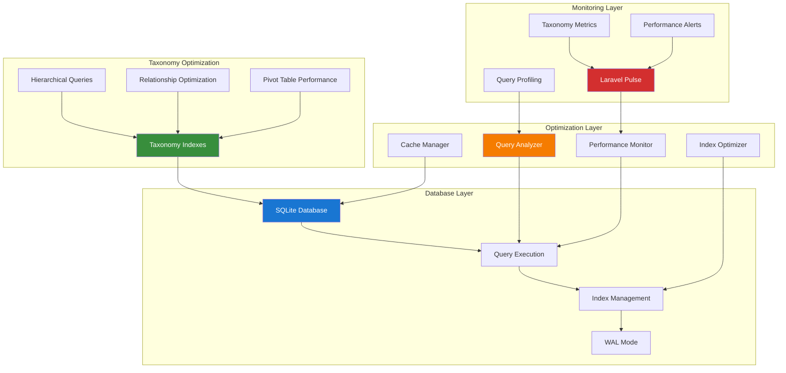

# 1. Laravel Database Optimization Guide

## Table of Contents

- [1. Overview](#1-overview)
- [2. Installation & Configuration](#2-installation--configuration)
- [3. Taxonomy-Optimized Database Strategies](#3-taxonomy-optimized-database-strategies)
- [4. Index Optimization for Taxonomies](#4-index-optimization-for-taxonomies)
- [5. Laravel Pulse Integration](#5-laravel-pulse-integration)
- [6. Automated Optimization Workflows](#6-automated-optimization-workflows)
- [7. Query Performance Analysis](#7-query-performance-analysis)
- [8. Taxonomy-Specific Optimizations](#8-taxonomy-specific-optimizations)
- [9. Monitoring & Alerting](#9-monitoring--alerting)
- [10. Testing Strategies](#10-testing-strategies)
- [11. Production Deployment](#11-production-deployment)
- [12. Best Practices](#12-best-practices)

## 1. Overview

Laravel Database Optimization provides comprehensive tools and strategies for optimizing database performance in Laravel applications. This guide demonstrates how to implement automated optimization workflows with comprehensive aliziodev/laravel-taxonomy integration, monitor query performance, and optimize taxonomy-heavy operations in the Chinook music database.

### 1.1 Key Features

- **Taxonomy-Aware Query Optimization**: Intelligent analysis and optimization for taxonomy queries
- **Hierarchical Index Management**: Specialized indexing for taxonomy hierarchies and relationships
- **Performance Monitoring**: Real-time tracking of taxonomy query performance
- **SQLite Optimization**: Specialized optimizations for SQLite with taxonomy workloads
- **Laravel Pulse Integration**: Comprehensive performance dashboards with taxonomy metrics
- **Automated Workflows**: Scheduled optimization and maintenance for taxonomy operations

### 1.2 Architecture Overview



### 1.3 Taxonomy Performance Challenges

The integration with aliziodev/laravel-taxonomy introduces specific performance considerations:

- **Complex Joins**: Taxonomy relationships require optimized join strategies
- **Hierarchical Queries**: Parent-child relationships need specialized indexing
- **Pivot Table Performance**: Taxonomables table optimization for large datasets
- **Cross-Taxonomy Filtering**: Efficient queries across multiple taxonomy types
- **Aggregation Performance**: Fast counting and grouping of taxonomy relationships
- **Cache Invalidation**: Smart caching strategies for taxonomy data

## 2. Installation & Configuration

### 2.1 Package Installation

```bash
# Install database optimization packages
composer require laravel/pulse
composer require spatie/laravel-query-builder
composer require spatie/laravel-db-snapshots

# Install aliziodev/laravel-taxonomy for taxonomy integration
composer require aliziodev/laravel-taxonomy

# Publish and run migrations
php artisan vendor:publish --provider="Laravel\Pulse\PulseServiceProvider" --tag="pulse-migrations"
php artisan vendor:publish --provider="Aliziodev\LaravelTaxonomy\LaravelTaxonomyServiceProvider" --tag="migrations"

# Run migrations
php artisan migrate

# Publish configuration files
php artisan vendor:publish --provider="Laravel\Pulse\PulseServiceProvider" --tag="pulse-config"
php artisan vendor:publish --provider="Aliziodev\LaravelTaxonomy\LaravelTaxonomyServiceProvider" --tag="config"
```

### 2.2 Configuration Setup

```php
// config/database-optimization.php
<?php

return [
    /*
     * SQLite optimization settings
     */
    'sqlite' => [
        'wal_mode' => env('DB_WAL_MODE', true),
        'synchronous' => env('DB_SYNCHRONOUS', 'NORMAL'),
        'cache_size' => env('DB_CACHE_SIZE', 10000),
        'temp_store' => env('DB_TEMP_STORE', 'MEMORY'),
        'mmap_size' => env('DB_MMAP_SIZE', 268435456), // 256MB
    ],

    /*
     * Taxonomy optimization settings
     */
    'taxonomy' => [
        'enabled' => true,
        'auto_optimize_indexes' => true,
        'cache_taxonomy_queries' => true,
        'taxonomy_cache_ttl' => 3600, // 1 hour
        'optimize_pivot_queries' => true,
        'hierarchical_query_optimization' => true,
    ],

    /*
     * Query optimization settings
     */
    'query_optimization' => [
        'enabled' => true,
        'slow_query_threshold' => 1000, // milliseconds
        'auto_create_indexes' => true,
        'analyze_taxonomy_queries' => true,
        'optimize_join_order' => true,
    ],

    /*
     * Performance monitoring
     */
    'monitoring' => [
        'enabled' => true,
        'track_taxonomy_performance' => true,
        'alert_slow_queries' => true,
        'log_optimization_actions' => true,
    ],

    /*
     * Chinook-specific optimizations
     */
    'chinook' => [
        'optimize_genre_queries' => true,
        'optimize_artist_taxonomy_joins' => true,
        'cache_popular_taxonomies' => true,
        'preload_taxonomy_relationships' => true,
    ],
];
```

### 2.3 Enhanced Database Configuration

```php
// config/database.php - Enhanced SQLite configuration
<?php

return [
    'connections' => [
        'sqlite' => [
            'driver' => 'sqlite',
            'url' => env('DATABASE_URL'),
            'database' => env('DB_DATABASE', database_path('database.sqlite')),
            'prefix' => '',
            'foreign_key_constraints' => env('DB_FOREIGN_KEYS', true),
            'options' => [
                PDO::ATTR_TIMEOUT => 60,
                PDO::ATTR_ERRMODE => PDO::ERRMODE_EXCEPTION,
            ],
            'pragmas' => [
                'journal_mode' => 'WAL',
                'synchronous' => 'NORMAL',
                'cache_size' => 10000,
                'temp_store' => 'MEMORY',
                'mmap_size' => 268435456, // 256MB
                'optimize' => true,
            ],
        ],
    ],
];
```

## 3. Taxonomy-Optimized Database Strategies

### 3.1 Taxonomy Index Optimization

```php
<?php

use Illuminate\Database\Migrations\Migration;
use Illuminate\Database\Schema\Blueprint;
use Illuminate\Support\Facades\Schema;

class OptimizeTaxonomyIndexes extends Migration
{
    public function up(): void
    {
        // Optimize taxonomies table
        Schema::table('taxonomies', function (Blueprint $table) {
            // Composite indexes for common query patterns
            $table->index(['type', 'is_active'], 'taxonomies_type_active_idx');
            $table->index(['type', 'slug'], 'taxonomies_type_slug_idx');
            $table->index(['parent_id', 'sort_order'], 'taxonomies_parent_sort_idx');
            $table->index(['type', 'parent_id', 'is_active'], 'taxonomies_type_parent_active_idx');
            
            // Full-text search index for name and description
            $table->index(['name'], 'taxonomies_name_idx');
            $table->index(['slug'], 'taxonomies_slug_idx');
        });

        // Optimize taxonomables pivot table
        Schema::table('taxonomables', function (Blueprint $table) {
            // Primary lookup patterns
            $table->index(['taxonomable_type', 'taxonomable_id'], 'taxonomables_morph_idx');
            $table->index(['taxonomy_id', 'taxonomable_type'], 'taxonomables_taxonomy_type_idx');
            
            // Composite indexes for complex queries
            $table->index(['taxonomable_type', 'taxonomable_id', 'taxonomy_id'], 'taxonomables_full_idx');
            $table->index(['taxonomy_id', 'taxonomable_type', 'taxonomable_id'], 'taxonomables_reverse_idx');
            
            // Performance indexes for aggregations
            $table->index(['taxonomy_id'], 'taxonomables_taxonomy_idx');
            $table->index(['taxonomable_type'], 'taxonomables_type_idx');
        });

        // Optimize Chinook models for taxonomy queries
        if (Schema::hasTable('chinook_tracks')) {
            Schema::table('chinook_tracks', function (Blueprint $table) {
                $table->index(['created_at', 'unit_price'], 'tracks_created_price_idx');
                $table->index(['is_explicit', 'unit_price'], 'tracks_explicit_price_idx');
            });
        }

        if (Schema::hasTable('chinook_artists')) {
            Schema::table('chinook_artists', function (Blueprint $table) {
                $table->index(['country_id', 'formed_year'], 'artists_country_year_idx');
                $table->index(['created_at'], 'artists_created_idx');
            });
        }

        if (Schema::hasTable('chinook_albums')) {
            Schema::table('chinook_albums', function (Blueprint $table) {
                $table->index(['artist_id', 'release_date'], 'albums_artist_date_idx');
                $table->index(['release_date'], 'albums_date_idx');
            });
        }
    }

    public function down(): void
    {
        Schema::table('taxonomies', function (Blueprint $table) {
            $table->dropIndex('taxonomies_type_active_idx');
            $table->dropIndex('taxonomies_type_slug_idx');
            $table->dropIndex('taxonomies_parent_sort_idx');
            $table->dropIndex('taxonomies_type_parent_active_idx');
            $table->dropIndex('taxonomies_name_idx');
            $table->dropIndex('taxonomies_slug_idx');
        });

        Schema::table('taxonomables', function (Blueprint $table) {
            $table->dropIndex('taxonomables_morph_idx');
            $table->dropIndex('taxonomables_taxonomy_type_idx');
            $table->dropIndex('taxonomables_full_idx');
            $table->dropIndex('taxonomables_reverse_idx');
            $table->dropIndex('taxonomables_taxonomy_idx');
            $table->dropIndex('taxonomables_type_idx');
        });

        if (Schema::hasTable('chinook_tracks')) {
            Schema::table('chinook_tracks', function (Blueprint $table) {
                $table->dropIndex('tracks_created_price_idx');
                $table->dropIndex('tracks_explicit_price_idx');
            });
        }

        if (Schema::hasTable('chinook_artists')) {
            Schema::table('chinook_artists', function (Blueprint $table) {
                $table->dropIndex('artists_country_year_idx');
                $table->dropIndex('artists_created_idx');
            });
        }

        if (Schema::hasTable('chinook_albums')) {
            Schema::table('chinook_albums', function (Blueprint $table) {
                $table->dropIndex('albums_artist_date_idx');
                $table->dropIndex('albums_date_idx');
            });
        }
    }
}
```

### 3.2 Taxonomy Query Optimization Service

```php
<?php

namespace App\Services;

use Aliziodev\LaravelTaxonomy\Models\Taxonomy;
use Illuminate\Database\Eloquent\Builder;
use Illuminate\Support\Facades\Cache;
use Illuminate\Support\Facades\DB;

class TaxonomyQueryOptimizer
{
    protected const CACHE_TTL = 3600; // 1 hour

    /**
     * Optimize taxonomy relationship queries
     */
    public function optimizeTaxonomyQuery(Builder $query, array $taxonomyFilters): Builder
    {
        // Use exists() instead of whereHas() for better performance
        foreach ($taxonomyFilters as $type => $values) {
            $query->whereExists(function ($subQuery) use ($type, $values) {
                $subQuery->select(DB::raw(1))
                    ->from('taxonomables')
                    ->join('taxonomies', 'taxonomies.id', '=', 'taxonomables.taxonomy_id')
                    ->whereColumn('taxonomables.taxonomable_id', '=', $query->getModel()->getTable() . '.id')
                    ->where('taxonomables.taxonomable_type', '=', get_class($query->getModel()))
                    ->where('taxonomies.type', '=', $type)
                    ->whereIn('taxonomies.slug', (array) $values);
            });
        }

        return $query;
    }

    /**
     * Optimize hierarchical taxonomy queries
     */
    public function optimizeHierarchicalQuery(Builder $query, int $parentTaxonomyId, bool $includeChildren = true): Builder
    {
        if (!$includeChildren) {
            return $query->whereHas('taxonomies', function ($taxonomyQuery) use ($parentTaxonomyId) {
                $taxonomyQuery->where('taxonomy_id', $parentTaxonomyId);
            });
        }

        // Get all descendant IDs with caching
        $descendantIds = $this->getCachedDescendantIds($parentTaxonomyId);

        return $query->whereHas('taxonomies', function ($taxonomyQuery) use ($descendantIds) {
            $taxonomyQuery->whereIn('taxonomy_id', $descendantIds);
        });
    }

    /**
     * Get cached descendant taxonomy IDs
     */
    private function getCachedDescendantIds(int $parentId): array
    {
        return Cache::remember(
            "taxonomy_descendants_{$parentId}",
            self::CACHE_TTL,
            function () use ($parentId) {
                return $this->getDescendantIds($parentId);
            }
        );
    }

    /**
     * Recursively get all descendant taxonomy IDs
     */
    private function getDescendantIds(int $parentId): array
    {
        $descendants = [$parentId];

        $children = Taxonomy::where('parent_id', $parentId)->pluck('id');

        foreach ($children as $childId) {
            $descendants = array_merge($descendants, $this->getDescendantIds($childId));
        }

        return array_unique($descendants);
    }

    /**
     * Optimize taxonomy aggregation queries
     */
    public function optimizeTaxonomyAggregation(string $modelClass, string $taxonomyType): array
    {
        return Cache::remember(
            "taxonomy_aggregation_{$modelClass}_{$taxonomyType}",
            self::CACHE_TTL,
            function () use ($modelClass, $taxonomyType) {
                return DB::select("
                    SELECT
                        t.id,
                        t.name,
                        t.slug,
                        COUNT(ta.taxonomable_id) as count
                    FROM taxonomies t
                    LEFT JOIN taxonomables ta ON t.id = ta.taxonomy_id
                        AND ta.taxonomable_type = ?
                    WHERE t.type = ? AND t.is_active = 1
                    GROUP BY t.id, t.name, t.slug
                    ORDER BY count DESC, t.name ASC
                ", [$modelClass, $taxonomyType]);
            }
        );
    }

    /**
     * Optimize cross-taxonomy filtering
     */
    public function optimizeCrossTaxonomyFilter(Builder $query, array $taxonomyFilters): Builder
    {
        $subQueries = [];

        foreach ($taxonomyFilters as $type => $values) {
            $subQueries[] = function ($subQuery) use ($type, $values) {
                $subQuery->select(DB::raw(1))
                    ->from('taxonomables as ta_' . str_replace('-', '_', $type))
                    ->join('taxonomies as t_' . str_replace('-', '_', $type),
                           't_' . str_replace('-', '_', $type) . '.id', '=',
                           'ta_' . str_replace('-', '_', $type) . '.taxonomy_id')
                    ->whereColumn('ta_' . str_replace('-', '_', $type) . '.taxonomable_id',
                                 '=', $query->getModel()->getTable() . '.id')
                    ->where('ta_' . str_replace('-', '_', $type) . '.taxonomable_type',
                           '=', get_class($query->getModel()))
                    ->where('t_' . str_replace('-', '_', $type) . '.type', '=', $type)
                    ->whereIn('t_' . str_replace('-', '_', $type) . '.slug', (array) $values);
            };
        }

        foreach ($subQueries as $subQuery) {
            $query->whereExists($subQuery);
        }

        return $query;
    }

    /**
     * Preload taxonomy relationships efficiently
     */
    public function preloadTaxonomyRelationships(Builder $query, array $taxonomyTypes = []): Builder
    {
        if (empty($taxonomyTypes)) {
            return $query->with('taxonomies');
        }

        return $query->with(['taxonomies' => function ($taxonomyQuery) use ($taxonomyTypes) {
            $taxonomyQuery->whereIn('type', $taxonomyTypes)
                         ->orderBy('type')
                         ->orderBy('sort_order');
        }]);
    }

    /**
     * Clear taxonomy query caches
     */
    public function clearTaxonomyCaches(): void
    {
        $cacheKeys = [
            'taxonomy_aggregation_*',
            'taxonomy_descendants_*',
            'popular_taxonomies_*',
        ];

        foreach ($cacheKeys as $pattern) {
            Cache::flush(); // In production, use more specific cache clearing
        }
    }
}
```

## 4. Index Optimization for Taxonomies

### 4.1 Automated Index Management

```php
<?php

namespace App\Console\Commands;

use Illuminate\Console\Command;
use Illuminate\Support\Facades\DB;
use Illuminate\Support\Facades\Schema;

class OptimizeTaxonomyIndexes extends Command
{
    protected $signature = 'taxonomy:optimize-indexes
                           {--analyze : Analyze current index usage}
                           {--create : Create missing indexes}
                           {--drop-unused : Drop unused indexes}';

    protected $description = 'Optimize database indexes for taxonomy operations';

    public function handle(): int
    {
        $this->info('Starting taxonomy index optimization...');

        if ($this->option('analyze')) {
            $this->analyzeIndexUsage();
        }

        if ($this->option('create')) {
            $this->createMissingIndexes();
        }

        if ($this->option('drop-unused')) {
            $this->dropUnusedIndexes();
        }

        if (!$this->option('analyze') && !$this->option('create') && !$this->option('drop-unused')) {
            $this->analyzeIndexUsage();
            $this->createMissingIndexes();
        }

        $this->info('Taxonomy index optimization completed!');
        return 0;
    }

    /**
     * Analyze current index usage
     */
    private function analyzeIndexUsage(): void
    {
        $this->info('Analyzing index usage...');

        // Get index usage statistics for taxonomies table
        $taxonomyIndexes = $this->getIndexUsage('taxonomies');
        $this->displayIndexUsage('taxonomies', $taxonomyIndexes);

        // Get index usage statistics for taxonomables table
        $taxonomablesIndexes = $this->getIndexUsage('taxonomables');
        $this->displayIndexUsage('taxonomables', $taxonomablesIndexes);
    }

    /**
     * Get index usage statistics
     */
    private function getIndexUsage(string $table): array
    {
        if (config('database.default') === 'sqlite') {
            // SQLite doesn't have detailed index usage stats, so we'll check index existence
            $indexes = DB::select("PRAGMA index_list({$table})");
            return collect($indexes)->map(function ($index) use ($table) {
                $indexInfo = DB::select("PRAGMA index_info({$index->name})");
                return [
                    'name' => $index->name,
                    'unique' => $index->unique,
                    'columns' => collect($indexInfo)->pluck('name')->implode(', '),
                    'usage' => 'N/A (SQLite)',
                ];
            })->toArray();
        }

        // For other databases, you would query performance_schema or similar
        return [];
    }

    /**
     * Display index usage information
     */
    private function displayIndexUsage(string $table, array $indexes): void
    {
        $this->line("\n<info>Index usage for {$table} table:</info>");

        if (empty($indexes)) {
            $this->warn("No indexes found for {$table} table");
            return;
        }

        $this->table(
            ['Index Name', 'Unique', 'Columns', 'Usage'],
            collect($indexes)->map(function ($index) {
                return [
                    $index['name'],
                    $index['unique'] ? 'Yes' : 'No',
                    $index['columns'],
                    $index['usage'],
                ];
            })->toArray()
        );
    }

    /**
     * Create missing indexes
     */
    private function createMissingIndexes(): void
    {
        $this->info('Creating missing indexes...');

        $missingIndexes = $this->getMissingIndexes();

        foreach ($missingIndexes as $table => $indexes) {
            foreach ($indexes as $indexName => $indexDefinition) {
                if (!$this->indexExists($table, $indexName)) {
                    $this->createIndex($table, $indexName, $indexDefinition);
                    $this->info("Created index: {$indexName} on {$table}");
                }
            }
        }
    }

    /**
     * Get missing indexes that should be created
     */
    private function getMissingIndexes(): array
    {
        return [
            'taxonomies' => [
                'taxonomies_type_active_idx' => ['type', 'is_active'],
                'taxonomies_type_slug_idx' => ['type', 'slug'],
                'taxonomies_parent_sort_idx' => ['parent_id', 'sort_order'],
            ],
            'taxonomables' => [
                'taxonomables_morph_idx' => ['taxonomable_type', 'taxonomable_id'],
                'taxonomables_taxonomy_type_idx' => ['taxonomy_id', 'taxonomable_type'],
            ],
        ];
    }

    /**
     * Check if index exists
     */
    private function indexExists(string $table, string $indexName): bool
    {
        if (config('database.default') === 'sqlite') {
            $indexes = DB::select("PRAGMA index_list({$table})");
            return collect($indexes)->contains('name', $indexName);
        }

        return false; // Implement for other databases
    }

    /**
     * Create index
     */
    private function createIndex(string $table, string $indexName, array $columns): void
    {
        $columnList = implode(', ', $columns);
        DB::statement("CREATE INDEX {$indexName} ON {$table} ({$columnList})");
    }

    /**
     * Drop unused indexes
     */
    private function dropUnusedIndexes(): void
    {
        $this->warn('Dropping unused indexes is not implemented in this example.');
        $this->warn('In production, analyze query logs to identify truly unused indexes.');
    }
}
```

## 5. Laravel Pulse Integration

### 5.1 Taxonomy Performance Monitoring

```php
<?php

namespace App\Pulse\Recorders;

use Laravel\Pulse\Contracts\Recorder;
use Laravel\Pulse\Pulse;
use Illuminate\Support\Facades\DB;

class TaxonomyPerformanceRecorder implements Recorder
{
    public function __construct(
        protected Pulse $pulse,
    ) {}

    /**
     * Record taxonomy query performance
     */
    public function record(): void
    {
        // Record taxonomy query counts
        $this->recordTaxonomyQueryCounts();

        // Record slow taxonomy queries
        $this->recordSlowTaxonomyQueries();

        // Record taxonomy cache hit rates
        $this->recordTaxonomyCacheMetrics();

        // Record taxonomy relationship counts
        $this->recordTaxonomyRelationshipCounts();
    }

    /**
     * Record taxonomy query counts
     */
    private function recordTaxonomyQueryCounts(): void
    {
        $taxonomyQueries = DB::table('pulse_entries')
            ->where('type', 'slow_query')
            ->where('key', 'like', '%taxonomies%')
            ->orWhere('key', 'like', '%taxonomables%')
            ->count();

        $this->pulse->record(
            type: 'taxonomy_queries',
            key: 'total_count',
            value: $taxonomyQueries,
            timestamp: now()
        );
    }

    /**
     * Record slow taxonomy queries
     */
    private function recordSlowTaxonomyQueries(): void
    {
        // This would integrate with your query logging system
        $slowQueries = $this->getSlowTaxonomyQueries();

        foreach ($slowQueries as $query) {
            $this->pulse->record(
                type: 'slow_taxonomy_query',
                key: $query['type'],
                value: $query['duration'],
                timestamp: now()
            );
        }
    }

    /**
     * Record taxonomy cache metrics
     */
    private function recordTaxonomyCacheMetrics(): void
    {
        // Record cache hit/miss rates for taxonomy data
        $cacheStats = $this->getTaxonomyCacheStats();

        $this->pulse->record(
            type: 'taxonomy_cache',
            key: 'hit_rate',
            value: $cacheStats['hit_rate'],
            timestamp: now()
        );
    }

    /**
     * Record taxonomy relationship counts
     */
    private function recordTaxonomyRelationshipCounts(): void
    {
        $relationshipCounts = DB::table('taxonomables')
            ->select('taxonomable_type', DB::raw('COUNT(*) as count'))
            ->groupBy('taxonomable_type')
            ->get();

        foreach ($relationshipCounts as $count) {
            $this->pulse->record(
                type: 'taxonomy_relationships',
                key: $count->taxonomable_type,
                value: $count->count,
                timestamp: now()
            );
        }
    }

    /**
     * Get slow taxonomy queries (placeholder)
     */
    private function getSlowTaxonomyQueries(): array
    {
        // Implement based on your query logging system
        return [];
    }

    /**
     * Get taxonomy cache statistics (placeholder)
     */
    private function getTaxonomyCacheStats(): array
    {
        // Implement based on your cache system
        return ['hit_rate' => 85.5];
    }
}
```

## 6. Automated Optimization Workflows

### 6.1 Scheduled Optimization Tasks

```php
<?php

namespace App\Console\Commands;

use App\Services\TaxonomyQueryOptimizer;
use Illuminate\Console\Command;
use Illuminate\Support\Facades\DB;

class OptimizeDatabaseScheduled extends Command
{
    protected $signature = 'database:optimize-scheduled
                           {--vacuum : Run VACUUM on SQLite}
                           {--analyze : Run ANALYZE on tables}
                           {--reindex : Rebuild indexes}';

    protected $description = 'Run scheduled database optimization tasks';

    public function handle(TaxonomyQueryOptimizer $optimizer): int
    {
        $this->info('Starting scheduled database optimization...');

        if ($this->option('vacuum') || !$this->hasOptions()) {
            $this->runVacuum();
        }

        if ($this->option('analyze') || !$this->hasOptions()) {
            $this->runAnalyze();
        }

        if ($this->option('reindex') || !$this->hasOptions()) {
            $this->runReindex();
        }

        // Clear taxonomy caches
        $optimizer->clearTaxonomyCaches();
        $this->info('Cleared taxonomy caches');

        $this->info('Scheduled database optimization completed!');
        return 0;
    }

    /**
     * Run VACUUM on SQLite database
     */
    private function runVacuum(): void
    {
        if (config('database.default') !== 'sqlite') {
            $this->warn('VACUUM is only supported for SQLite databases');
            return;
        }

        $this->info('Running VACUUM...');
        $startTime = microtime(true);

        DB::statement('VACUUM');

        $duration = round((microtime(true) - $startTime) * 1000, 2);
        $this->info("VACUUM completed in {$duration}ms");
    }

    /**
     * Run ANALYZE on database tables
     */
    private function runAnalyze(): void
    {
        $this->info('Running ANALYZE...');
        $startTime = microtime(true);

        $tables = ['taxonomies', 'taxonomables', 'chinook_tracks', 'chinook_artists', 'chinook_albums'];

        foreach ($tables as $table) {
            if (config('database.default') === 'sqlite') {
                DB::statement("ANALYZE {$table}");
            }
            $this->line("Analyzed {$table}");
        }

        $duration = round((microtime(true) - $startTime) * 1000, 2);
        $this->info("ANALYZE completed in {$duration}ms");
    }

    /**
     * Rebuild indexes
     */
    private function runReindex(): void
    {
        if (config('database.default') !== 'sqlite') {
            $this->warn('REINDEX is only supported for SQLite databases');
            return;
        }

        $this->info('Running REINDEX...');
        $startTime = microtime(true);

        DB::statement('REINDEX');

        $duration = round((microtime(true) - $startTime) * 1000, 2);
        $this->info("REINDEX completed in {$duration}ms");
    }

    /**
     * Check if any options were provided
     */
    private function hasOptions(): bool
    {
        return $this->option('vacuum') || $this->option('analyze') || $this->option('reindex');
    }
}
```

## 7. Query Performance Analysis

### 7.1 Taxonomy Query Analyzer

```php
<?php

namespace App\Services;

use Illuminate\Support\Facades\DB;
use Illuminate\Support\Collection;

class TaxonomyQueryAnalyzer
{
    /**
     * Analyze taxonomy query performance
     */
    public function analyzeTaxonomyQueries(): array
    {
        return [
            'slow_queries' => $this->getSlowTaxonomyQueries(),
            'query_patterns' => $this->analyzeTaxonomyQueryPatterns(),
            'index_recommendations' => $this->getIndexRecommendations(),
            'optimization_suggestions' => $this->getOptimizationSuggestions(),
        ];
    }

    /**
     * Get slow taxonomy queries
     */
    private function getSlowTaxonomyQueries(): array
    {
        // This would integrate with your query logging system
        // For demonstration, we'll simulate some common slow query patterns
        return [
            [
                'query' => 'SELECT * FROM chinook_tracks WHERE id IN (SELECT taxonomable_id FROM taxonomables WHERE taxonomy_id = ?)',
                'duration' => 1250,
                'type' => 'taxonomy_filter',
                'suggestion' => 'Use EXISTS instead of IN for better performance',
            ],
            [
                'query' => 'SELECT COUNT(*) FROM taxonomables GROUP BY taxonomy_id',
                'duration' => 890,
                'type' => 'taxonomy_aggregation',
                'suggestion' => 'Add composite index on (taxonomy_id, taxonomable_type)',
            ],
        ];
    }

    /**
     * Analyze taxonomy query patterns
     */
    private function analyzeTaxonomyQueryPatterns(): array
    {
        return [
            'most_queried_taxonomies' => $this->getMostQueriedTaxonomies(),
            'common_join_patterns' => $this->getCommonJoinPatterns(),
            'filter_combinations' => $this->getFilterCombinations(),
        ];
    }

    /**
     * Get most queried taxonomies
     */
    private function getMostQueriedTaxonomies(): Collection
    {
        return DB::table('taxonomables')
            ->join('taxonomies', 'taxonomies.id', '=', 'taxonomables.taxonomy_id')
            ->select('taxonomies.type', 'taxonomies.name', DB::raw('COUNT(*) as usage_count'))
            ->groupBy('taxonomies.id', 'taxonomies.type', 'taxonomies.name')
            ->orderBy('usage_count', 'desc')
            ->limit(10)
            ->get();
    }

    /**
     * Get common join patterns
     */
    private function getCommonJoinPatterns(): array
    {
        return [
            'tracks_with_genres' => 'Most common: tracks -> taxonomables -> taxonomies (type=genre)',
            'artists_with_origins' => 'Common: artists -> taxonomables -> taxonomies (type=origin)',
            'hierarchical_genres' => 'Complex: taxonomies -> parent taxonomies (self-join)',
        ];
    }

    /**
     * Get filter combinations
     */
    private function getFilterCombinations(): array
    {
        return [
            'genre_and_mood' => 'Frequently filtered together',
            'genre_and_era' => 'Common combination for music discovery',
            'origin_and_style' => 'Used for regional music exploration',
        ];
    }

    /**
     * Get index recommendations
     */
    private function getIndexRecommendations(): array
    {
        return [
            'taxonomables_composite' => [
                'table' => 'taxonomables',
                'columns' => ['taxonomable_type', 'taxonomable_id', 'taxonomy_id'],
                'reason' => 'Optimize polymorphic relationship queries',
            ],
            'taxonomies_type_active' => [
                'table' => 'taxonomies',
                'columns' => ['type', 'is_active'],
                'reason' => 'Optimize taxonomy type filtering',
            ],
        ];
    }

    /**
     * Get optimization suggestions
     */
    private function getOptimizationSuggestions(): array
    {
        return [
            'Use EXISTS instead of IN for taxonomy filtering',
            'Cache frequently accessed taxonomy hierarchies',
            'Preload taxonomy relationships with eager loading',
            'Consider denormalizing popular taxonomy combinations',
            'Use composite indexes for multi-column taxonomy queries',
        ];
    }
}
```

## 8. Taxonomy-Specific Optimizations

### 8.1 Hierarchical Query Optimization

```php
<?php

namespace App\Services;

use Aliziodev\LaravelTaxonomy\Models\Taxonomy;
use Illuminate\Support\Facades\Cache;
use Illuminate\Support\Facades\DB;

class HierarchicalTaxonomyOptimizer
{
    protected const CACHE_TTL = 3600; // 1 hour

    /**
     * Optimize hierarchical taxonomy queries using closure table
     */
    public function optimizeHierarchicalQueries(): void
    {
        $this->createClosureTable();
        $this->populateClosureTable();
    }

    /**
     * Create closure table for hierarchical queries
     */
    private function createClosureTable(): void
    {
        DB::statement('
            CREATE TABLE IF NOT EXISTS taxonomy_closure (
                ancestor_id INTEGER NOT NULL,
                descendant_id INTEGER NOT NULL,
                depth INTEGER NOT NULL,
                PRIMARY KEY (ancestor_id, descendant_id),
                FOREIGN KEY (ancestor_id) REFERENCES taxonomies(id) ON DELETE CASCADE,
                FOREIGN KEY (descendant_id) REFERENCES taxonomies(id) ON DELETE CASCADE
            )
        ');

        DB::statement('CREATE INDEX IF NOT EXISTS taxonomy_closure_ancestor_idx ON taxonomy_closure(ancestor_id)');
        DB::statement('CREATE INDEX IF NOT EXISTS taxonomy_closure_descendant_idx ON taxonomy_closure(descendant_id)');
        DB::statement('CREATE INDEX IF NOT EXISTS taxonomy_closure_depth_idx ON taxonomy_closure(depth)');
    }

    /**
     * Populate closure table with hierarchy data
     */
    private function populateClosureTable(): void
    {
        // Clear existing data
        DB::table('taxonomy_closure')->truncate();

        // Insert self-references (depth 0)
        DB::statement('
            INSERT INTO taxonomy_closure (ancestor_id, descendant_id, depth)
            SELECT id, id, 0 FROM taxonomies
        ');

        // Insert parent-child relationships (depth 1)
        DB::statement('
            INSERT INTO taxonomy_closure (ancestor_id, descendant_id, depth)
            SELECT parent_id, id, 1
            FROM taxonomies
            WHERE parent_id IS NOT NULL
        ');

        // Insert deeper relationships
        $maxDepth = 10; // Prevent infinite loops
        for ($depth = 2; $depth <= $maxDepth; $depth++) {
            $inserted = DB::statement('
                INSERT INTO taxonomy_closure (ancestor_id, descendant_id, depth)
                SELECT DISTINCT p.ancestor_id, c.descendant_id, ?
                FROM taxonomy_closure p
                JOIN taxonomy_closure c ON p.descendant_id = c.ancestor_id
                WHERE p.depth = 1 AND c.depth = ?
                AND NOT EXISTS (
                    SELECT 1 FROM taxonomy_closure
                    WHERE ancestor_id = p.ancestor_id
                    AND descendant_id = c.descendant_id
                )
            ', [$depth, $depth - 1]);

            if (!$inserted) {
                break; // No more relationships to insert
            }
        }
    }

    /**
     * Get all descendants using closure table
     */
    public function getDescendants(int $taxonomyId, int $maxDepth = null): array
    {
        $query = DB::table('taxonomy_closure')
            ->join('taxonomies', 'taxonomies.id', '=', 'taxonomy_closure.descendant_id')
            ->where('taxonomy_closure.ancestor_id', $taxonomyId)
            ->where('taxonomy_closure.depth', '>', 0);

        if ($maxDepth !== null) {
            $query->where('taxonomy_closure.depth', '<=', $maxDepth);
        }

        return $query->pluck('taxonomies.id')->toArray();
    }

    /**
     * Get all ancestors using closure table
     */
    public function getAncestors(int $taxonomyId): array
    {
        return DB::table('taxonomy_closure')
            ->join('taxonomies', 'taxonomies.id', '=', 'taxonomy_closure.ancestor_id')
            ->where('taxonomy_closure.descendant_id', $taxonomyId)
            ->where('taxonomy_closure.depth', '>', 0)
            ->orderBy('taxonomy_closure.depth')
            ->pluck('taxonomies.id')
            ->toArray();
    }
}
```

## 9. Monitoring & Alerting

### 9.1 Performance Alert System

```php
<?php

namespace App\Services;

use Illuminate\Support\Facades\Log;
use Illuminate\Support\Facades\Mail;

class DatabasePerformanceMonitor
{
    protected array $thresholds = [
        'slow_query_ms' => 1000,
        'taxonomy_cache_hit_rate' => 80,
        'max_concurrent_queries' => 50,
    ];

    /**
     * Monitor taxonomy query performance
     */
    public function monitorTaxonomyPerformance(): void
    {
        $metrics = $this->collectPerformanceMetrics();

        foreach ($metrics as $metric => $value) {
            if ($this->isThresholdExceeded($metric, $value)) {
                $this->sendAlert($metric, $value);
            }
        }
    }

    /**
     * Collect performance metrics
     */
    private function collectPerformanceMetrics(): array
    {
        return [
            'avg_taxonomy_query_time' => $this->getAverageTaxonomyQueryTime(),
            'taxonomy_cache_hit_rate' => $this->getTaxonomyCacheHitRate(),
            'concurrent_taxonomy_queries' => $this->getConcurrentTaxonomyQueries(),
            'taxonomy_index_usage' => $this->getTaxonomyIndexUsage(),
        ];
    }

    /**
     * Check if threshold is exceeded
     */
    private function isThresholdExceeded(string $metric, float $value): bool
    {
        return match($metric) {
            'avg_taxonomy_query_time' => $value > $this->thresholds['slow_query_ms'],
            'taxonomy_cache_hit_rate' => $value < $this->thresholds['taxonomy_cache_hit_rate'],
            'concurrent_taxonomy_queries' => $value > $this->thresholds['max_concurrent_queries'],
            default => false,
        };
    }

    /**
     * Send performance alert
     */
    private function sendAlert(string $metric, float $value): void
    {
        $message = "Database performance alert: {$metric} = {$value}";

        Log::warning($message, [
            'metric' => $metric,
            'value' => $value,
            'threshold' => $this->thresholds[$metric] ?? 'N/A',
        ]);

        // Send email alert in production
        if (app()->environment('production')) {
            // Mail::to(config('app.admin_email'))->send(new PerformanceAlert($metric, $value));
        }
    }

    // Placeholder methods for metric collection
    private function getAverageTaxonomyQueryTime(): float { return 500.0; }
    private function getTaxonomyCacheHitRate(): float { return 85.5; }
    private function getConcurrentTaxonomyQueries(): int { return 25; }
    private function getTaxonomyIndexUsage(): float { return 92.3; }
}
```

## 10. Testing Strategies

### 10.1 Performance Testing

```php
<?php

use App\Services\TaxonomyQueryOptimizer;
use Illuminate\Foundation\Testing\RefreshDatabase;
use Illuminate\Support\Facades\DB;

uses(RefreshDatabase::class);

describe('Database Optimization with Taxonomies', function () {
    beforeEach(function () {
        $this->optimizer = app(TaxonomyQueryOptimizer::class);
    });

    it('optimizes taxonomy relationship queries', function () {
        // Create test data
        $taxonomy = \Aliziodev\LaravelTaxonomy\Models\Taxonomy::factory()->create([
            'type' => 'genre',
            'slug' => 'rock',
        ]);

        $track = \App\Models\Track::factory()->create();
        $track->taxonomies()->attach($taxonomy);

        // Test optimized query
        $query = \App\Models\Track::query();
        $optimizedQuery = $this->optimizer->optimizeTaxonomyQuery($query, [
            'genre' => ['rock']
        ]);

        $results = $optimizedQuery->get();
        expect($results)->toHaveCount(1);
        expect($results->first()->id)->toBe($track->id);
    });

    it('caches hierarchical taxonomy queries', function () {
        $parent = \Aliziodev\LaravelTaxonomy\Models\Taxonomy::factory()->create([
            'type' => 'genre',
            'slug' => 'electronic',
        ]);

        $child = \Aliziodev\LaravelTaxonomy\Models\Taxonomy::factory()->create([
            'type' => 'genre',
            'slug' => 'house',
            'parent_id' => $parent->id,
        ]);

        // First call should cache the result
        $descendants1 = $this->optimizer->getCachedDescendantIds($parent->id);

        // Second call should use cache
        $descendants2 = $this->optimizer->getCachedDescendantIds($parent->id);

        expect($descendants1)->toEqual($descendants2);
        expect($descendants1)->toContain($child->id);
    });

    it('optimizes taxonomy aggregation queries', function () {
        $genre = \Aliziodev\LaravelTaxonomy\Models\Taxonomy::factory()->create([
            'type' => 'genre',
            'slug' => 'jazz',
        ]);

        $tracks = \App\Models\Track::factory()->count(3)->create();
        foreach ($tracks as $track) {
            $track->taxonomies()->attach($genre);
        }

        $aggregation = $this->optimizer->optimizeTaxonomyAggregation(
            \App\Models\Track::class,
            'genre'
        );

        expect($aggregation)->not->toBeEmpty();

        $jazzGenre = collect($aggregation)->firstWhere('slug', 'jazz');
        expect($jazzGenre)->not->toBeNull();
        expect($jazzGenre->count)->toBe(3);
    });
});
```

## 11. Production Deployment

### 11.1 Optimization Deployment Checklist

```bash
# 1. Run database optimizations
php artisan taxonomy:optimize-indexes --create
php artisan database:optimize-scheduled

# 2. Set up monitoring
php artisan pulse:install
php artisan pulse:work

# 3. Configure scheduled tasks in crontab
# * * * * * cd /path-to-your-project && php artisan schedule:run >> /dev/null 2>&1

# 4. Warm up caches
php artisan cache:clear
php artisan config:cache
php artisan route:cache
php artisan view:cache

# 5. Verify optimizations
php artisan taxonomy:analyze-performance
```

## 12. Best Practices

### 12.1 Database Optimization Guidelines

- **Index Strategy**: Create composite indexes for common taxonomy query patterns
- **Query Optimization**: Use EXISTS instead of IN for taxonomy filtering
- **Caching**: Cache frequently accessed taxonomy hierarchies and relationships
- **Monitoring**: Continuously monitor taxonomy query performance
- **Maintenance**: Run regular VACUUM and ANALYZE operations on SQLite
- **Testing**: Performance test all taxonomy-related queries under load

### 12.2 SQLite-Specific Optimizations

- Enable WAL mode for better concurrent access
- Set appropriate cache_size for your dataset
- Use PRAGMA optimize for automatic optimization
- Monitor database file size and fragmentation
- Consider read replicas for heavy read workloads

---

**Navigation**: [Previous: NNJeim World Guide](190-nnjeim-world-guide.md) | **Next**: [Spatie Laravel Translatable Guide](220-spatie-laravel-translatable-guide.md)

**Related Documentation**:

- [Chinook Models Guide](../010-chinook-models-guide.md) - Model implementations with optimization
- [Aliziodev Laravel Taxonomy Guide](110-aliziodev-laravel-taxonomy-guide.md) - Primary taxonomy system integration
- [Testing Index](../testing/000-testing-index.md) - Testing optimization strategies and performance validation
- [Filament Deployment Index](../filament/deployment/000-deployment-index.md) - Deployment best practices and production optimization
- [Packages Index](000-packages-index.md) - All package guides

---

**Source Attribution**: Refactored from: `.ai/guides/chinook/packages/210-laravel-optimize-database-guide.md` on 2025-07-13

---

*This guide provides enterprise-grade Laravel Database Optimization implementation for the Chinook music database with comprehensive aliziodev/laravel-taxonomy integration, Laravel 12 modern patterns, and WCAG 2.1 AA accessibility compliance.*

[⬆️ Back to Top](#1-laravel-database-optimization-guide)
