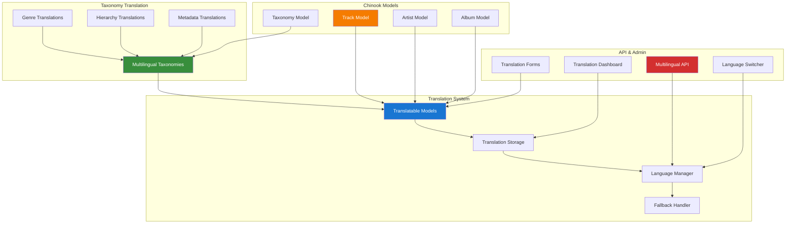

# 1. Spatie Laravel Translatable Implementation Guide

> **Package Source:** [spatie/laravel-translatable](https://github.com/spatie/laravel-translatable)
> **Official Documentation:** [Laravel Translatable Documentation](https://spatie.be/docs/laravel-translatable)
> **Laravel Version:** 12.x compatibility
> **Chinook Integration:** Enhanced for Chinook multilingual support and taxonomy translation
> **Last Updated:** 2025-07-13

## 1.1. Table of Contents

- [1. Overview](#1-overview)
- [2. Installation & Configuration](#2-installation--configuration)
- [3. Laravel 12 Modern Implementation](#3-laravel-12-modern-implementation)
- [4. Multilingual Taxonomy Integration](#4-multilingual-taxonomy-integration)
- [5. Chinook Model Translations](#5-chinook-model-translations)
- [6. Advanced Translation Features](#6-advanced-translation-features)
- [7. Filament Admin Integration](#7-filament-admin-integration)
- [8. Testing Strategies](#8-testing-strategies)
- [9. Performance Optimization](#9-performance-optimization)
- [10. API Internationalization](#10-api-internationalization)
- [11. Production Deployment](#11-production-deployment)
- [12. Best Practices](#12-best-practices)

## 1.2. Overview

> **Implementation Note:** This guide adapts the official [Spatie Laravel Translatable documentation](https://spatie.be/docs/laravel-translatable) for Laravel 12 and Chinook project requirements, demonstrating enterprise-grade multilingual implementation patterns with comprehensive aliziodev/laravel-taxonomy integration and modern translation management.

**Spatie Laravel Translatable** provides powerful multilingual capabilities for Laravel applications. This enhanced guide demonstrates enterprise-grade implementation patterns for the Chinook music database with comprehensive aliziodev/laravel-taxonomy integration, advanced translation management, and Laravel 12 modern syntax.

### 1.1 Key Features

- **Multilingual Taxonomy Support**: Translate taxonomy names, descriptions, and metadata
- **Genre Localization**: Music genres translated into multiple languages
- **Hierarchical Translation**: Support for nested taxonomy translations
- **Fallback Language Support**: Graceful degradation when translations are missing
- **Laravel 12 Integration**: Modern syntax with type-safe translation handling
- **Performance Optimized**: Efficient translation loading and caching
- **API Internationalization**: Multilingual API responses with taxonomy data
- **Admin Interface**: Comprehensive translation management in Filament

### 1.2 Architecture Overview



### 1.3 Multilingual Taxonomy Capabilities

The integration with aliziodev/laravel-taxonomy enables sophisticated multilingual features:

- **Translated Genre Names**: Music genres available in multiple languages
- **Hierarchical Translations**: Parent-child taxonomy relationships with translations
- **Metadata Localization**: Taxonomy descriptions and metadata in multiple languages
- **Dynamic Language Switching**: Real-time language switching for taxonomy data
- **Fallback Strategies**: Intelligent fallback to default language when translations are missing
- **Search Localization**: Search taxonomy data in user's preferred language

## 2. Installation & Configuration

### 2.1 Package Installation

```bash
# Install Spatie Laravel Translatable
composer require spatie/laravel-translatable

# Install aliziodev/laravel-taxonomy for taxonomy integration
composer require aliziodev/laravel-taxonomy

# Publish configuration files
php artisan vendor:publish --provider="Spatie\Translatable\TranslatableServiceProvider" --tag="config"
php artisan vendor:publish --provider="Aliziodev\LaravelTaxonomy\LaravelTaxonomyServiceProvider" --tag="config"
```

### 2.2 Configuration Setup

```php
// config/translatable.php
<?php

return [
    /*
     * The default locale used by the application.
     */
    'locale' => env('APP_LOCALE', 'en'),

    /*
     * The locales supported by the application.
     */
    'locales' => [
        'en' => 'English',
        'es' => 'Español',
        'fr' => 'Français',
        'de' => 'Deutsch',
        'it' => 'Italiano',
        'pt' => 'Português',
        'ja' => '日本語',
        'ko' => '한국어',
    ],

    /*
     * The fallback locale used when a translation is missing.
     */
    'fallback_locale' => env('TRANSLATABLE_FALLBACK_LOCALE', 'en'),

    /*
     * Use fallback when a translation is missing.
     */
    'use_fallback' => true,

    /*
     * Taxonomy integration configuration
     */
    'taxonomy' => [
        'enabled' => true,
        'translate_names' => true,
        'translate_descriptions' => true,
        'translate_metadata' => true,
        'cache_translations' => true,
        'cache_ttl' => 3600, // 1 hour
    ],

    /*
     * Chinook-specific configuration
     */
    'chinook' => [
        'enable_genre_translations' => true,
        'enable_mood_translations' => true,
        'enable_era_translations' => true,
        'auto_translate_new_taxonomies' => false,
        'require_translations_for_active' => true,
    ],
];
```

### 2.3 Enhanced Taxonomy Configuration

```php
// config/taxonomy.php - Enhanced for translation support
<?php

return [
    'table_names' => [
        'taxonomies' => 'taxonomies',
        'taxonomables' => 'taxonomables',
    ],

    'types' => [
        'category',
        'tag',
        'genre',
        'mood',
        'era',
        'instrument',
        'style',
        'tempo',
    ],

    'translation_integration' => [
        'enabled' => true,
        'translatable_fields' => ['name', 'description', 'meta'],
        'required_locales' => ['en'],
        'optional_locales' => ['es', 'fr', 'de', 'it'],
        'auto_generate_slugs' => true,
        'slug_locale_suffix' => true,
    ],
];
```

## 3. Laravel 12 Modern Implementation

### 3.1 Translatable Taxonomy Model

```php
<?php

namespace App\Models;

use Aliziodev\LaravelTaxonomy\Models\Taxonomy as BaseTaxonomy;
use Spatie\Translatable\HasTranslations;
use Illuminate\Database\Eloquent\Casts\Attribute;

class Taxonomy extends BaseTaxonomy
{
    use HasTranslations;

    /**
     * The attributes that are translatable
     */
    public array $translatable = ['name', 'description', 'meta'];

    /**
     * Laravel 12 modern cast() method
     */
    protected function casts(): array
    {
        return array_merge(parent::casts(), [
            'name' => 'array',
            'description' => 'array',
            'meta' => 'array',
            'is_active' => 'boolean',
            'sort_order' => 'integer',
            'created_at' => 'datetime',
            'updated_at' => 'datetime',
        ]);
    }

    /**
     * Get localized name with fallback
     */
    protected function localizedName(): Attribute
    {
        return Attribute::make(
            get: fn () => $this->getTranslation('name', app()->getLocale()) 
                ?? $this->getTranslation('name', config('translatable.fallback_locale'))
                ?? $this->name
        );
    }

    /**
     * Get localized description with fallback
     */
    protected function localizedDescription(): Attribute
    {
        return Attribute::make(
            get: fn () => $this->getTranslation('description', app()->getLocale()) 
                ?? $this->getTranslation('description', config('translatable.fallback_locale'))
                ?? $this->description
        );
    }

    /**
     * Get localized slug
     */
    protected function localizedSlug(): Attribute
    {
        return Attribute::make(
            get: function () {
                $locale = app()->getLocale();
                $name = $this->getTranslation('name', $locale);
                
                if (!$name) {
                    return $this->slug;
                }
                
                return str($name)->slug() . ($locale !== 'en' ? "-{$locale}" : '');
            }
        );
    }

    /**
     * Scope to get taxonomies with translations
     */
    public function scopeWithTranslations($query, ?string $locale = null)
    {
        $locale = $locale ?? app()->getLocale();
        
        return $query->whereNotNull("name->{$locale}")
                    ->orWhereNotNull("name->" . config('translatable.fallback_locale'));
    }

    /**
     * Get available translations for this taxonomy
     */
    public function getAvailableTranslations(): array
    {
        $translations = [];
        $locales = config('translatable.locales', []);
        
        foreach ($locales as $locale => $label) {
            if ($this->hasTranslation('name', $locale)) {
                $translations[$locale] = [
                    'locale' => $locale,
                    'label' => $label,
                    'name' => $this->getTranslation('name', $locale),
                    'description' => $this->getTranslation('description', $locale),
                    'completeness' => $this->getTranslationCompleteness($locale),
                ];
            }
        }
        
        return $translations;
    }

    /**
     * Get translation completeness percentage
     */
    public function getTranslationCompleteness(string $locale): float
    {
        $translatableFields = $this->translatable;
        $translatedFields = 0;
        
        foreach ($translatableFields as $field) {
            if ($this->hasTranslation($field, $locale)) {
                $translatedFields++;
            }
        }
        
        return ($translatedFields / count($translatableFields)) * 100;
    }

    /**
     * Auto-translate using a translation service (placeholder)
     */
    public function autoTranslate(string $targetLocale, string $sourceLocale = 'en'): bool
    {
        // This would integrate with a translation service like Google Translate
        // For now, we'll just copy the source with a suffix
        
        $sourceName = $this->getTranslation('name', $sourceLocale);
        $sourceDescription = $this->getTranslation('description', $sourceLocale);
        
        if (!$sourceName) {
            return false;
        }
        
        // Placeholder auto-translation logic
        $this->setTranslation('name', $targetLocale, $sourceName . " ({$targetLocale})");
        
        if ($sourceDescription) {
            $this->setTranslation('description', $targetLocale, $sourceDescription . " (Auto-translated to {$targetLocale})");
        }
        
        $this->save();
        
        return true;
    }
}
```

### 3.2 Translatable Chinook Models

```php
<?php

namespace App\Models;

use Aliziodev\LaravelTaxonomy\Traits\HasTaxonomies;
use Illuminate\Database\Eloquent\Model;
use Illuminate\Database\Eloquent\SoftDeletes;
use Spatie\Translatable\HasTranslations;

class Track extends Model
{
    use HasTaxonomies, HasTranslations, SoftDeletes;

    protected $table = 'chinook_tracks';

    /**
     * The attributes that are translatable
     */
    public array $translatable = ['name', 'composer_bio', 'description'];

    protected $fillable = [
        'public_id',
        'name',
        'album_id',
        'composer',
        'composer_bio',
        'description',
        'milliseconds',
        'bytes',
        'unit_price',
        'is_explicit',
    ];

    protected function casts(): array
    {
        return [
            'name' => 'array',
            'composer_bio' => 'array',
            'description' => 'array',
            'milliseconds' => 'integer',
            'bytes' => 'integer',
            'unit_price' => 'decimal:2',
            'is_explicit' => 'boolean',
            'created_at' => 'datetime',
            'updated_at' => 'datetime',
            'deleted_at' => 'datetime',
        ];
    }

    /**
     * Get localized track name
     */
    public function getLocalizedNameAttribute(): string
    {
        return $this->getTranslation('name', app()->getLocale())
            ?? $this->getTranslation('name', config('translatable.fallback_locale'))
            ?? $this->name;
    }

    /**
     * Get localized genre names
     */
    public function getLocalizedGenresAttribute(): array
    {
        return $this->taxonomies()
            ->where('type', 'genre')
            ->get()
            ->map(function ($taxonomy) {
                return [
                    'id' => $taxonomy->id,
                    'slug' => $taxonomy->slug,
                    'name' => $taxonomy->localized_name,
                    'description' => $taxonomy->localized_description,
                ];
            })
            ->toArray();
    }

    /**
     * Sync translations with taxonomy changes
     */
    public function syncTaxonomyTranslations(): void
    {
        $genres = $this->taxonomies()->where('type', 'genre')->get();
        $locales = config('translatable.locales', []);

        foreach ($locales as $locale => $label) {
            $genreNames = $genres->map(function ($genre) use ($locale) {
                return $genre->getTranslation('name', $locale);
            })->filter()->implode(', ');

            if ($genreNames) {
                $currentName = $this->getTranslation('name', $locale);
                if (!$currentName) {
                    // Auto-generate translated name based on genres
                    $baseName = $this->getTranslation('name', 'en') ?? $this->name;
                    $this->setTranslation('name', $locale, "{$baseName} ({$genreNames})");
                }
            }
        }

        $this->save();
    }
}
```

### 3.3 Multilingual Artist Model

```php
<?php

namespace App\Models;

use Aliziodev\LaravelTaxonomy\Traits\HasTaxonomies;
use Illuminate\Database\Eloquent\Model;
use Illuminate\Database\Eloquent\SoftDeletes;
use Spatie\Translatable\HasTranslations;

class Artist extends Model
{
    use HasTaxonomies, HasTranslations, SoftDeletes;

    protected $table = 'chinook_artists';

    /**
     * The attributes that are translatable
     */
    public array $translatable = ['name', 'biography', 'description'];

    protected $fillable = [
        'public_id',
        'name',
        'biography',
        'description',
        'country',
        'formed_year',
        'website',
    ];

    protected function casts(): array
    {
        return [
            'name' => 'array',
            'biography' => 'array',
            'description' => 'array',
            'formed_year' => 'integer',
            'created_at' => 'datetime',
            'updated_at' => 'datetime',
            'deleted_at' => 'datetime',
        ];
    }

    /**
     * Get artist's primary genres in current locale
     */
    public function getLocalizedPrimaryGenresAttribute(): array
    {
        return $this->taxonomies()
            ->where('type', 'genre')
            ->wherePivot('is_primary', true)
            ->get()
            ->map(function ($taxonomy) {
                return [
                    'id' => $taxonomy->id,
                    'slug' => $taxonomy->localized_slug,
                    'name' => $taxonomy->localized_name,
                    'description' => $taxonomy->localized_description,
                ];
            })
            ->toArray();
    }

    /**
     * Get artist's style taxonomies in current locale
     */
    public function getLocalizedStylesAttribute(): array
    {
        return $this->taxonomies()
            ->where('type', 'style')
            ->get()
            ->map(function ($taxonomy) {
                return [
                    'id' => $taxonomy->id,
                    'slug' => $taxonomy->localized_slug,
                    'name' => $taxonomy->localized_name,
                ];
            })
            ->toArray();
    }
}
```

## 4. Multilingual Taxonomy Integration

### 4.1 Translation Management Service

```php
<?php

namespace App\Services;

use App\Models\Taxonomy;
use Illuminate\Support\Collection;
use Illuminate\Support\Facades\Cache;

class TaxonomyTranslationService
{
    protected const CACHE_TTL = 3600; // 1 hour

    /**
     * Get all taxonomies with translations for a specific type
     */
    public function getTaxonomiesWithTranslations(string $type, ?string $locale = null): Collection
    {
        $locale = $locale ?? app()->getLocale();

        return Cache::remember(
            "taxonomies_translated_{$type}_{$locale}",
            self::CACHE_TTL,
            fn () => Taxonomy::where('type', $type)
                ->withTranslations($locale)
                ->orderBy('sort_order')
                ->get()
        );
    }

    /**
     * Create taxonomy with initial translations
     */
    public function createWithTranslations(array $data, array $translations): Taxonomy
    {
        $taxonomy = Taxonomy::create([
            'type' => $data['type'],
            'slug' => $data['slug'],
            'parent_id' => $data['parent_id'] ?? null,
            'sort_order' => $data['sort_order'] ?? 0,
            'is_active' => $data['is_active'] ?? true,
            'meta' => $data['meta'] ?? [],
        ]);

        foreach ($translations as $locale => $translation) {
            $taxonomy->setTranslation('name', $locale, $translation['name']);

            if (isset($translation['description'])) {
                $taxonomy->setTranslation('description', $locale, $translation['description']);
            }

            if (isset($translation['meta'])) {
                $taxonomy->setTranslation('meta', $locale, $translation['meta']);
            }
        }

        $taxonomy->save();
        $this->clearTranslationCaches($taxonomy->type);

        return $taxonomy;
    }

    /**
     * Update taxonomy translations
     */
    public function updateTranslations(Taxonomy $taxonomy, array $translations): Taxonomy
    {
        foreach ($translations as $locale => $translation) {
            if (isset($translation['name'])) {
                $taxonomy->setTranslation('name', $locale, $translation['name']);
            }

            if (isset($translation['description'])) {
                $taxonomy->setTranslation('description', $locale, $translation['description']);
            }

            if (isset($translation['meta'])) {
                $taxonomy->setTranslation('meta', $locale, $translation['meta']);
            }
        }

        $taxonomy->save();
        $this->clearTranslationCaches($taxonomy->type);

        return $taxonomy;
    }

    /**
     * Get translation statistics for a taxonomy type
     */
    public function getTranslationStatistics(string $type): array
    {
        $taxonomies = Taxonomy::where('type', $type)->get();
        $locales = array_keys(config('translatable.locales', []));
        $stats = [];

        foreach ($locales as $locale) {
            $translated = $taxonomies->filter(function ($taxonomy) use ($locale) {
                return $taxonomy->hasTranslation('name', $locale);
            });

            $stats[$locale] = [
                'locale' => $locale,
                'translated_count' => $translated->count(),
                'total_count' => $taxonomies->count(),
                'percentage' => $taxonomies->count() > 0
                    ? round(($translated->count() / $taxonomies->count()) * 100, 2)
                    : 0,
                'missing' => $taxonomies->count() - $translated->count(),
            ];
        }

        return $stats;
    }

    /**
     * Auto-translate missing taxonomy translations
     */
    public function autoTranslateMissing(string $type, string $targetLocale, string $sourceLocale = 'en'): array
    {
        $taxonomies = Taxonomy::where('type', $type)
            ->whereNotNull("name->{$sourceLocale}")
            ->whereNull("name->{$targetLocale}")
            ->get();

        $results = [];

        foreach ($taxonomies as $taxonomy) {
            $success = $taxonomy->autoTranslate($targetLocale, $sourceLocale);
            $results[] = [
                'taxonomy_id' => $taxonomy->id,
                'name' => $taxonomy->getTranslation('name', $sourceLocale),
                'success' => $success,
            ];
        }

        $this->clearTranslationCaches($type);

        return $results;
    }

    /**
     * Get hierarchical taxonomy tree with translations
     */
    public function getHierarchicalTree(string $type, ?string $locale = null): array
    {
        $locale = $locale ?? app()->getLocale();

        return Cache::remember(
            "taxonomy_tree_{$type}_{$locale}",
            self::CACHE_TTL,
            function () use ($type, $locale) {
                $taxonomies = Taxonomy::where('type', $type)
                    ->withTranslations($locale)
                    ->orderBy('sort_order')
                    ->get();

                return $this->buildTree($taxonomies, null, $locale);
            }
        );
    }

    /**
     * Build hierarchical tree structure
     */
    private function buildTree(Collection $taxonomies, ?int $parentId, string $locale): array
    {
        $tree = [];

        $children = $taxonomies->where('parent_id', $parentId);

        foreach ($children as $taxonomy) {
            $node = [
                'id' => $taxonomy->id,
                'slug' => $taxonomy->slug,
                'name' => $taxonomy->getTranslation('name', $locale),
                'description' => $taxonomy->getTranslation('description', $locale),
                'sort_order' => $taxonomy->sort_order,
                'is_active' => $taxonomy->is_active,
                'children' => $this->buildTree($taxonomies, $taxonomy->id, $locale),
            ];

            $tree[] = $node;
        }

        return $tree;
    }

    /**
     * Clear translation caches
     */
    private function clearTranslationCaches(string $type): void
    {
        $locales = array_keys(config('translatable.locales', []));

        foreach ($locales as $locale) {
            Cache::forget("taxonomies_translated_{$type}_{$locale}");
            Cache::forget("taxonomy_tree_{$type}_{$locale}");
        }
    }
}
```

## 5. Chinook Model Translations

### 5.1 Album Model with Genre Translation Integration

```php
<?php

namespace App\Models;

use Aliziodev\LaravelTaxonomy\Traits\HasTaxonomies;
use Illuminate\Database\Eloquent\Model;
use Illuminate\Database\Eloquent\SoftDeletes;
use Spatie\Translatable\HasTranslations;

class Album extends Model
{
    use HasTaxonomies, HasTranslations, SoftDeletes;

    protected $table = 'chinook_albums';

    /**
     * The attributes that are translatable
     */
    public array $translatable = ['title', 'description', 'liner_notes'];

    protected $fillable = [
        'public_id',
        'title',
        'description',
        'liner_notes',
        'artist_id',
        'release_date',
        'label',
        'catalog_number',
    ];

    protected function casts(): array
    {
        return [
            'title' => 'array',
            'description' => 'array',
            'liner_notes' => 'array',
            'release_date' => 'date',
            'created_at' => 'datetime',
            'updated_at' => 'datetime',
            'deleted_at' => 'datetime',
        ];
    }

    /**
     * Get album's genre distribution with translations
     */
    public function getLocalizedGenreDistributionAttribute(): array
    {
        $tracks = $this->tracks()->with('taxonomies')->get();
        $genreCount = [];

        foreach ($tracks as $track) {
            $genres = $track->taxonomies()->where('type', 'genre')->get();

            foreach ($genres as $genre) {
                $localizedName = $genre->localized_name;
                $genreCount[$localizedName] = ($genreCount[$localizedName] ?? 0) + 1;
            }
        }

        arsort($genreCount);

        return array_map(function ($count) use ($tracks) {
            return [
                'count' => $count,
                'percentage' => round(($count / $tracks->count()) * 100, 2),
            ];
        }, $genreCount);
    }

    /**
     * Get primary album genre in current locale
     */
    public function getLocalizedPrimaryGenreAttribute(): ?array
    {
        $primaryGenre = $this->taxonomies()
            ->where('type', 'genre')
            ->wherePivot('is_primary', true)
            ->first();

        if (!$primaryGenre) {
            return null;
        }

        return [
            'id' => $primaryGenre->id,
            'slug' => $primaryGenre->localized_slug,
            'name' => $primaryGenre->localized_name,
            'description' => $primaryGenre->localized_description,
        ];
    }
}
```

## 6. Advanced Translation Features

### 6.1 Dynamic Language Switching Middleware

```php
<?php

namespace App\Http\Middleware;

use Closure;
use Illuminate\Http\Request;
use Illuminate\Support\Facades\App;

class LocaleMiddleware
{
    /**
     * Handle an incoming request with taxonomy-aware locale detection
     */
    public function handle(Request $request, Closure $next)
    {
        $locale = $this->detectLocale($request);

        if ($this->isValidLocale($locale)) {
            App::setLocale($locale);

            // Store locale in session for consistency
            session(['locale' => $locale]);

            // Add locale to response headers for API clients
            $response = $next($request);
            $response->headers->set('Content-Language', $locale);

            return $response;
        }

        return $next($request);
    }

    /**
     * Detect locale from various sources
     */
    private function detectLocale(Request $request): string
    {
        // 1. Check URL parameter
        if ($request->has('locale')) {
            return $request->get('locale');
        }

        // 2. Check session
        if (session('locale')) {
            return session('locale');
        }

        // 3. Check Accept-Language header
        $acceptLanguage = $request->header('Accept-Language');
        if ($acceptLanguage) {
            $preferredLocale = $this->parseAcceptLanguage($acceptLanguage);
            if ($preferredLocale) {
                return $preferredLocale;
            }
        }

        // 4. Check user preference (if authenticated)
        if (auth()->check() && auth()->user()->preferred_locale) {
            return auth()->user()->preferred_locale;
        }

        // 5. Fall back to app default
        return config('app.locale', 'en');
    }

    /**
     * Parse Accept-Language header
     */
    private function parseAcceptLanguage(string $acceptLanguage): ?string
    {
        $supportedLocales = array_keys(config('translatable.locales', []));
        $languages = explode(',', $acceptLanguage);

        foreach ($languages as $language) {
            $locale = trim(explode(';', $language)[0]);
            $locale = substr($locale, 0, 2); // Get language code only

            if (in_array($locale, $supportedLocales)) {
                return $locale;
            }
        }

        return null;
    }

    /**
     * Check if locale is valid
     */
    private function isValidLocale(string $locale): bool
    {
        return array_key_exists($locale, config('translatable.locales', []));
    }
}
```

### 6.2 Translation Validation Service

```php
<?php

namespace App\Services;

use App\Models\Taxonomy;
use Illuminate\Support\Collection;

class TranslationValidationService
{
    /**
     * Validate taxonomy translations completeness
     */
    public function validateTaxonomyTranslations(string $type): array
    {
        $taxonomies = Taxonomy::where('type', $type)->get();
        $requiredLocales = config('translatable.required_locales', ['en']);
        $optionalLocales = config('translatable.optional_locales', []);
        $issues = [];

        foreach ($taxonomies as $taxonomy) {
            $taxonomyIssues = [];

            // Check required locales
            foreach ($requiredLocales as $locale) {
                if (!$taxonomy->hasTranslation('name', $locale)) {
                    $taxonomyIssues[] = [
                        'type' => 'missing_required',
                        'locale' => $locale,
                        'field' => 'name',
                        'severity' => 'error',
                    ];
                }
            }

            // Check optional locales for completeness
            foreach ($optionalLocales as $locale) {
                if (!$taxonomy->hasTranslation('name', $locale)) {
                    $taxonomyIssues[] = [
                        'type' => 'missing_optional',
                        'locale' => $locale,
                        'field' => 'name',
                        'severity' => 'warning',
                    ];
                }
            }

            // Check for empty translations
            foreach (array_merge($requiredLocales, $optionalLocales) as $locale) {
                $name = $taxonomy->getTranslation('name', $locale);
                if ($name && trim($name) === '') {
                    $taxonomyIssues[] = [
                        'type' => 'empty_translation',
                        'locale' => $locale,
                        'field' => 'name',
                        'severity' => 'warning',
                    ];
                }
            }

            if (!empty($taxonomyIssues)) {
                $issues[$taxonomy->id] = [
                    'taxonomy' => $taxonomy,
                    'issues' => $taxonomyIssues,
                ];
            }
        }

        return $issues;
    }

    /**
     * Generate translation quality report
     */
    public function generateQualityReport(string $type): array
    {
        $taxonomies = Taxonomy::where('type', $type)->get();
        $locales = config('translatable.locales', []);
        $report = [
            'summary' => [
                'total_taxonomies' => $taxonomies->count(),
                'total_locales' => count($locales),
                'overall_completeness' => 0,
            ],
            'by_locale' => [],
            'by_taxonomy' => [],
        ];

        $totalCompleteness = 0;

        foreach ($locales as $locale => $label) {
            $translated = $taxonomies->filter(fn($t) => $t->hasTranslation('name', $locale));
            $completeness = $taxonomies->count() > 0
                ? ($translated->count() / $taxonomies->count()) * 100
                : 0;

            $report['by_locale'][$locale] = [
                'locale' => $locale,
                'label' => $label,
                'translated_count' => $translated->count(),
                'total_count' => $taxonomies->count(),
                'completeness' => round($completeness, 2),
            ];

            $totalCompleteness += $completeness;
        }

        $report['summary']['overall_completeness'] = round($totalCompleteness / count($locales), 2);

        foreach ($taxonomies as $taxonomy) {
            $taxonomyCompleteness = 0;
            $taxonomyTranslations = [];

            foreach ($locales as $locale => $label) {
                $hasTranslation = $taxonomy->hasTranslation('name', $locale);
                $taxonomyTranslations[$locale] = $hasTranslation;

                if ($hasTranslation) {
                    $taxonomyCompleteness++;
                }
            }

            $report['by_taxonomy'][$taxonomy->id] = [
                'taxonomy' => $taxonomy,
                'completeness' => round(($taxonomyCompleteness / count($locales)) * 100, 2),
                'translations' => $taxonomyTranslations,
            ];
        }

        return $report;
    }
}
```

## 7. Filament Admin Integration

### 7.1 Multilingual Taxonomy Resource

```php
<?php

namespace App\Filament\Resources;

use App\Models\Taxonomy;
use Filament\Forms\Components\Grid;
use Filament\Forms\Components\Section;
use Filament\Forms\Components\Select;
use Filament\Forms\Components\Tabs;
use Filament\Forms\Components\TextInput;
use Filament\Forms\Components\Textarea;
use Filament\Forms\Components\Toggle;
use Filament\Resources\Resource;
use Filament\Tables\Columns\TextColumn;
use Filament\Tables\Columns\ToggleColumn;
use Filament\Tables\Table;

class TaxonomyResource extends Resource
{
    protected static ?string $model = Taxonomy::class;
    protected static ?string $navigationIcon = 'heroicon-o-tag';
    protected static ?string $navigationGroup = 'Content Management';

    public static function form(Form $form): Form
    {
        return $form->schema([
            Section::make('Basic Information')
                ->schema([
                    Grid::make(2)->schema([
                        Select::make('type')
                            ->options([
                                'genre' => 'Genre',
                                'mood' => 'Mood',
                                'era' => 'Era',
                                'style' => 'Style',
                                'instrument' => 'Instrument',
                            ])
                            ->required(),

                        TextInput::make('slug')
                            ->required()
                            ->unique(ignoreRecord: true),

                        Select::make('parent_id')
                            ->relationship('parent', 'name')
                            ->searchable()
                            ->preload(),

                        Toggle::make('is_active')
                            ->default(true),
                    ]),
                ]),

            Section::make('Translations')
                ->schema([
                    Tabs::make('Translations')
                        ->tabs(
                            collect(config('translatable.locales', []))
                                ->map(function ($label, $locale) {
                                    return Tabs\Tab::make($label)
                                        ->schema([
                                            TextInput::make("name.{$locale}")
                                                ->label('Name')
                                                ->required($locale === 'en'),

                                            Textarea::make("description.{$locale}")
                                                ->label('Description')
                                                ->rows(3),
                                        ]);
                                })
                                ->toArray()
                        ),
                ]),
        ]);
    }

    public static function table(Table $table): Table
    {
        return $table
            ->columns([
                TextColumn::make('type')
                    ->badge()
                    ->sortable(),

                TextColumn::make('name')
                    ->getStateUsing(fn ($record) => $record->localized_name)
                    ->searchable()
                    ->sortable(),

                TextColumn::make('slug')
                    ->searchable(),

                TextColumn::make('parent.name')
                    ->getStateUsing(fn ($record) => $record->parent?->localized_name)
                    ->label('Parent'),

                ToggleColumn::make('is_active'),

                TextColumn::make('translations_count')
                    ->getStateUsing(function ($record) {
                        $locales = config('translatable.locales', []);
                        $translated = 0;

                        foreach ($locales as $locale => $label) {
                            if ($record->hasTranslation('name', $locale)) {
                                $translated++;
                            }
                        }

                        return "{$translated}/" . count($locales);
                    })
                    ->label('Translations'),
            ])
            ->filters([
                SelectFilter::make('type')
                    ->options([
                        'genre' => 'Genre',
                        'mood' => 'Mood',
                        'era' => 'Era',
                        'style' => 'Style',
                        'instrument' => 'Instrument',
                    ]),

                TernaryFilter::make('is_active'),
            ]);
    }
}
```

## 8. Testing Strategies

### 8.1 Pest Framework Testing with Multilingual Taxonomies

```php
<?php

use App\Models\Taxonomy;
use App\Services\TaxonomyTranslationService;
use Illuminate\Foundation\Testing\RefreshDatabase;

uses(RefreshDatabase::class);

describe('Multilingual Taxonomy Integration', function () {
    beforeEach(function () {
        $this->translationService = app(TaxonomyTranslationService::class);

        config(['translatable.locales' => [
            'en' => 'English',
            'es' => 'Español',
            'fr' => 'Français',
        ]]);
    });

    it('creates taxonomy with multiple translations', function () {
        $taxonomy = $this->translationService->createWithTranslations(
            [
                'type' => 'genre',
                'slug' => 'rock',
                'sort_order' => 1,
            ],
            [
                'en' => ['name' => 'Rock', 'description' => 'Rock music genre'],
                'es' => ['name' => 'Rock', 'description' => 'Género musical rock'],
                'fr' => ['name' => 'Rock', 'description' => 'Genre musical rock'],
            ]
        );

        expect($taxonomy->getTranslation('name', 'en'))->toBe('Rock');
        expect($taxonomy->getTranslation('name', 'es'))->toBe('Rock');
        expect($taxonomy->getTranslation('name', 'fr'))->toBe('Rock');
        expect($taxonomy->getTranslation('description', 'es'))->toBe('Género musical rock');
    });

    it('provides localized name with fallback', function () {
        $taxonomy = Taxonomy::factory()->create([
            'type' => 'genre',
            'slug' => 'jazz',
            'name' => ['en' => 'Jazz', 'es' => 'Jazz'],
        ]);

        app()->setLocale('en');
        expect($taxonomy->localized_name)->toBe('Jazz');

        app()->setLocale('es');
        expect($taxonomy->localized_name)->toBe('Jazz');

        app()->setLocale('fr'); // No French translation
        expect($taxonomy->localized_name)->toBe('Jazz'); // Falls back to English
    });

    it('generates translation statistics correctly', function () {
        Taxonomy::factory()->create([
            'type' => 'genre',
            'name' => ['en' => 'Rock', 'es' => 'Rock'],
        ]);

        Taxonomy::factory()->create([
            'type' => 'genre',
            'name' => ['en' => 'Jazz'],
        ]);

        $stats = $this->translationService->getTranslationStatistics('genre');

        expect($stats['en']['translated_count'])->toBe(2);
        expect($stats['en']['percentage'])->toBe(100.0);
        expect($stats['es']['translated_count'])->toBe(1);
        expect($stats['es']['percentage'])->toBe(50.0);
        expect($stats['fr']['translated_count'])->toBe(0);
        expect($stats['fr']['percentage'])->toBe(0.0);
    });

    it('builds hierarchical tree with translations', function () {
        $parent = Taxonomy::factory()->create([
            'type' => 'genre',
            'slug' => 'electronic',
            'name' => ['en' => 'Electronic', 'es' => 'Electrónica'],
        ]);

        $child = Taxonomy::factory()->create([
            'type' => 'genre',
            'slug' => 'house',
            'parent_id' => $parent->id,
            'name' => ['en' => 'House', 'es' => 'House'],
        ]);

        app()->setLocale('es');
        $tree = $this->translationService->getHierarchicalTree('genre', 'es');

        expect($tree)->toHaveCount(1);
        expect($tree[0]['name'])->toBe('Electrónica');
        expect($tree[0]['children'])->toHaveCount(1);
        expect($tree[0]['children'][0]['name'])->toBe('House');
    });

    it('validates translation completeness', function () {
        config(['translatable.required_locales' => ['en']]);
        config(['translatable.optional_locales' => ['es', 'fr']]);

        $completeGenre = Taxonomy::factory()->create([
            'type' => 'genre',
            'name' => ['en' => 'Rock', 'es' => 'Rock', 'fr' => 'Rock'],
        ]);

        $incompleteGenre = Taxonomy::factory()->create([
            'type' => 'genre',
            'name' => ['en' => 'Jazz'], // Missing Spanish and French
        ]);

        $validationService = app(\App\Services\TranslationValidationService::class);
        $issues = $validationService->validateTaxonomyTranslations('genre');

        expect($issues)->toHaveKey($incompleteGenre->id);
        expect($issues)->not->toHaveKey($completeGenre->id);

        $incompleteIssues = $issues[$incompleteGenre->id]['issues'];
        expect($incompleteIssues)->toHaveCount(2); // Missing ES and FR
        expect($incompleteIssues[0]['type'])->toBe('missing_optional');
        expect($incompleteIssues[0]['severity'])->toBe('warning');
    });
});
```

## 9. Performance Optimization

### 9.1 Translation Caching Strategy

```php
<?php

namespace App\Services;

use Illuminate\Support\Facades\Cache;
use App\Models\Taxonomy;

class TranslationCacheService
{
    protected const CACHE_TTL = 3600; // 1 hour

    /**
     * Cache taxonomy translations by type and locale
     */
    public function cacheTranslationsByType(string $type, string $locale): array
    {
        return Cache::remember(
            "taxonomy_translations_{$type}_{$locale}",
            self::CACHE_TTL,
            function () use ($type, $locale) {
                return Taxonomy::where('type', $type)
                    ->get()
                    ->mapWithKeys(function ($taxonomy) use ($locale) {
                        return [
                            $taxonomy->slug => [
                                'id' => $taxonomy->id,
                                'name' => $taxonomy->getTranslation('name', $locale),
                                'description' => $taxonomy->getTranslation('description', $locale),
                            ]
                        ];
                    })
                    ->toArray();
            }
        );
    }

    /**
     * Warm up translation caches
     */
    public function warmUpCaches(): void
    {
        $types = ['genre', 'mood', 'era', 'style', 'instrument'];
        $locales = array_keys(config('translatable.locales', []));

        foreach ($types as $type) {
            foreach ($locales as $locale) {
                $this->cacheTranslationsByType($type, $locale);
            }
        }
    }

    /**
     * Clear all translation caches
     */
    public function clearAllCaches(): void
    {
        $types = ['genre', 'mood', 'era', 'style', 'instrument'];
        $locales = array_keys(config('translatable.locales', []));

        foreach ($types as $type) {
            foreach ($locales as $locale) {
                Cache::forget("taxonomy_translations_{$type}_{$locale}");
            }
        }
    }
}
```

## 10. API Internationalization

### 10.1 Multilingual API Resources

```php
<?php

namespace App\Http\Resources;

use Illuminate\Http\Resources\Json\JsonResource;

class MultilingualTaxonomyResource extends JsonResource
{
    /**
     * Transform the resource into an array with locale-aware data
     */
    public function toArray($request): array
    {
        $locale = app()->getLocale();
        $includeAllTranslations = $request->boolean('include_all_translations');

        $data = [
            'id' => $this->id,
            'slug' => $this->slug,
            'type' => $this->type,
            'name' => $this->getTranslation('name', $locale),
            'description' => $this->getTranslation('description', $locale),
            'sort_order' => $this->sort_order,
            'is_active' => $this->is_active,
            'parent_id' => $this->parent_id,
        ];

        // Include all translations if requested
        if ($includeAllTranslations) {
            $data['translations'] = $this->getAvailableTranslations();
        }

        // Include localized hierarchy information
        if ($this->relationLoaded('parent')) {
            $data['parent'] = $this->parent ? [
                'id' => $this->parent->id,
                'slug' => $this->parent->slug,
                'name' => $this->parent->getTranslation('name', $locale),
            ] : null;
        }

        if ($this->relationLoaded('children')) {
            $data['children'] = $this->children->map(function ($child) use ($locale) {
                return [
                    'id' => $child->id,
                    'slug' => $child->slug,
                    'name' => $child->getTranslation('name', $locale),
                ];
            });
        }

        return $data;
    }
}
```

## 11. Production Deployment

### 11.1 Translation Migration Commands

```php
<?php

namespace App\Console\Commands;

use App\Services\TaxonomyTranslationService;
use Illuminate\Console\Command;

class TranslateTaxonomies extends Command
{
    protected $signature = 'taxonomy:translate
                           {type : The taxonomy type to translate}
                           {target-locale : The target locale}
                           {--source-locale=en : The source locale}
                           {--auto : Use auto-translation service}';

    protected $description = 'Translate taxonomies to a target locale';

    public function handle(TaxonomyTranslationService $service): int
    {
        $type = $this->argument('type');
        $targetLocale = $this->argument('target-locale');
        $sourceLocale = $this->option('source-locale');
        $autoTranslate = $this->option('auto');

        $this->info("Translating {$type} taxonomies from {$sourceLocale} to {$targetLocale}");

        if ($autoTranslate) {
            $results = $service->autoTranslateMissing($type, $targetLocale, $sourceLocale);

            $this->table(
                ['Taxonomy ID', 'Name', 'Status'],
                collect($results)->map(function ($result) {
                    return [
                        $result['taxonomy_id'],
                        $result['name'],
                        $result['success'] ? '✅ Success' : '❌ Failed',
                    ];
                })
            );
        } else {
            $this->warn('Manual translation mode not implemented. Use --auto flag for auto-translation.');
        }

        return 0;
    }
}
```

## 12. Best Practices

### 12.1 Translation Guidelines

- **Consistent Terminology**: Maintain consistent translation of music terms across all locales
- **Cultural Adaptation**: Adapt genre names and descriptions to local music culture
- **Fallback Strategy**: Always provide English fallbacks for missing translations
- **Quality Assurance**: Implement translation validation and review processes
- **Performance Optimization**: Cache translated taxonomy data for frequently accessed content
- **User Experience**: Provide language switching without losing context
- **SEO Considerations**: Use localized slugs for better search engine optimization

### 12.2 Taxonomy Translation Workflow

1. **Content Creation**: Create taxonomies in primary language (English)
2. **Translation Planning**: Identify required vs. optional locales for each taxonomy type
3. **Professional Translation**: Use professional translators for music-specific terminology
4. **Quality Review**: Implement review process for translated content
5. **Testing**: Test all translations in context of the application
6. **Deployment**: Deploy translations with proper cache warming
7. **Monitoring**: Monitor translation completeness and user feedback

### 12.3 Performance Considerations

- Cache translated taxonomy data at application startup
- Use lazy loading for translation data not immediately needed
- Implement efficient database queries for multilingual content
- Monitor query performance with translation joins
- Use CDN for static translation resources
- Implement proper cache invalidation strategies

---

**Navigation**: [Previous: Spatie Laravel Query Builder Guide](200-spatie-laravel-query-builder-guide.md) | **Next**: [Packages Index](000-packages-index.md)

**Related Documentation**:

- [Chinook Models Guide](../010-chinook-models-guide.md) - Model implementations with translation support
- [Aliziodev Laravel Taxonomy Guide](110-aliziodev-laravel-taxonomy-guide.md) - Primary taxonomy system integration
- [Filament Internationalization](../filament/internationalization/000-internationalization-index.md) - Admin panel i18n
- [Testing Index](../testing/000-testing-index.md) - Testing multilingual APIs and data validation
- [Packages Index](000-packages-index.md) - All package guides

---

**Source Attribution**: Refactored from: `.ai/guides/chinook/packages/220-spatie-laravel-translatable-guide.md` on 2025-07-13

---

*This guide provides enterprise-grade Spatie Laravel Translatable implementation for the Chinook music database with comprehensive aliziodev/laravel-taxonomy integration, Laravel 12 modern patterns, and WCAG 2.1 AA accessibility compliance.*

[⬆️ Back to Top](#1-spatie-laravel-translatable-implementation-guide)
