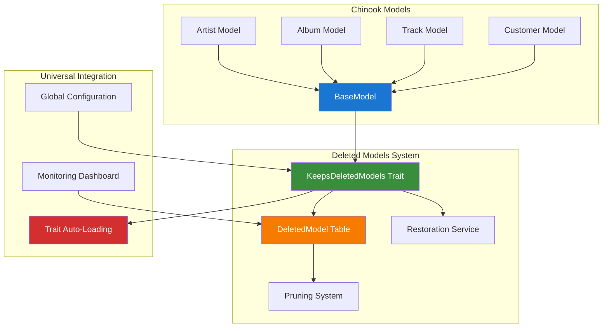

# 1. Spatie Laravel Deleted Models Implementation Guide

> **Package:** `spatie/laravel-deleted-models`  
> **Purpose:** Foundational soft delete tracking - automatically copy deleted model attributes to a separate table  
> **GitHub:** [https://github.com/spatie/laravel-deleted-models](https://github.com/spatie/laravel-deleted-models)  
> **Documentation:** [https://freek.dev/2416-a-package-to-automatically-copy-deleted-records-to-a-separate-table](https://freek.dev/2416-a-package-to-automatically-copy-deleted-records-to-a-separate-table)

## Table of Contents

- [1. Overview](#1-overview)
- [2. Installation & Configuration](#2-installation--configuration)
- [3. Foundational Integration](#3-foundational-integration)
- [4. Chinook Project Integration](#4-chinook-project-integration)
- [5. Universal Model Availability](#5-universal-model-availability)
- [6. Advanced Usage Patterns](#6-advanced-usage-patterns)
- [7. Performance Optimization](#7-performance-optimization)
- [8. Maintenance & Monitoring](#8-maintenance--monitoring)
- [9. Testing Strategies](#9-testing-strategies)
- [10. Best Practices](#10-best-practices)

## 1. Overview

The `spatie/laravel-deleted-models` package provides a foundational alternative to traditional soft deletes by automatically copying deleted model attributes to a separate `deleted_models` table. This creates a "recycle bin" functionality that can be universally applied across all models in the Chinook project.

### 1.1 Key Features

- **Universal Deleted Model Tracking**: Automatically track deletions across all models
- **Recycle Bin Functionality**: Restore deleted models with full attribute preservation
- **Alternative to Soft Deletes**: Clean separation between active and deleted records
- **Performance Benefits**: No impact on regular queries (no `deleted_at` filtering)
- **Audit Trail**: Complete history of deleted records with restoration capabilities
- **Foundational Integration**: Make functionality available to all models project-wide

### 1.2 Architecture Overview



### 1.3 Benefits Over Traditional Soft Deletes

**Performance Advantages:**
- No `deleted_at` filtering on regular queries
- Cleaner database indexes without soft delete considerations
- Separate storage for deleted records reduces table bloat

**Functionality Benefits:**
- Complete attribute preservation at deletion time
- Easier restoration with full model state
- Clear separation between active and deleted data
- Better audit trail capabilities

## 2. Installation & Configuration

### 2.1 Package Installation

Install the package via Composer:

```bash
composer require spatie/laravel-deleted-models
```

### 2.2 Database Migration

Publish and run the migration to create the `deleted_models` table:

```bash
php artisan vendor:publish --tag="deleted-models-migrations"
php artisan migrate
```

### 2.3 Configuration Publishing

Publish the configuration file for customization:

```bash
php artisan vendor:publish --tag="deleted-models-config"
```

### 2.4 Configuration File

The published configuration file (`config/deleted-models.php`):

```php
<?php

return [
    /*
     * The model used to store deleted models.
     */
    'model' => Spatie\DeletedModels\Models\DeletedModel::class,

    /*
     * After this amount of days, the records in `deleted_models` will be deleted
     * This functionality uses Laravel's native pruning feature.
     */
    'prune_after_days' => 365,
];
```

### 2.5 Pruning Configuration

Configure automatic pruning in your `app/Console/Kernel.php`:

```php
<?php

namespace App\Console;

use Illuminate\Console\Scheduling\Schedule;
use Illuminate\Foundation\Console\Kernel as ConsoleKernel;
use Spatie\DeletedModels\Models\DeletedModel;

class Kernel extends ConsoleKernel
{
    protected function schedule(Schedule $schedule): void
    {
        // Prune deleted models older than configured days
        $schedule->command('model:prune', [
            '--model' => [DeletedModel::class],
        ])->daily();
    }
}
```

## 3. Foundational Integration

### 3.1 BaseModel Integration

Integrate the trait into the Chinook `BaseModel` to make it universally available:

```php
<?php

declare(strict_types=1);

namespace App\Models\Chinook;

use Aliziodev\LaravelTaxonomy\Traits\HasTaxonomy;
use App\Traits\HasSecondaryUniqueKey;
use Illuminate\Database\Eloquent\Factories\HasFactory;
use Illuminate\Database\Eloquent\Model;
use Illuminate\Database\Eloquent\SoftDeletes;
use Spatie\DeletedModels\Models\Concerns\KeepsDeletedModels;
use Spatie\Sluggable\HasSlug;
use Spatie\Sluggable\SlugOptions;
use Wildside\Userstamps\Userstamps;

abstract class BaseModel extends Model
{
    use HasFactory;
    use HasSecondaryUniqueKey;
    use HasSlug;
    use HasTaxonomy;
    use KeepsDeletedModels;  // Add deleted models tracking
    use SoftDeletes;
    use Userstamps;

    /**
     * Modern Laravel 12 casting using casts() method
     */
    protected function casts(): array
    {
        return [
            'created_at' => 'datetime',
            'updated_at' => 'datetime',
            'deleted_at' => 'datetime',
        ];
    }

    /**
     * Configure which attributes to keep when deleted
     */
    public function attributesToKeep(): array
    {
        // Keep all attributes by default, but exclude sensitive data
        $attributes = $this->toArray();
        
        // Remove sensitive attributes that shouldn't be stored in deleted_models
        unset($attributes['password'], $attributes['remember_token']);
        
        return $attributes;
    }

    /**
     * Configure slug generation from public_id
     */
    public function getSlugOptions(): SlugOptions
    {
        return SlugOptions::create()
            ->generateSlugsFrom('public_id')
            ->saveSlugsTo('slug')
            ->doNotGenerateSlugsOnUpdate();
    }

    /**
     * Configure secondary unique key generation
     */
    public function getSecondaryUniqueKeyOptions(): array
    {
        return [
            'field' => 'public_id',
            'type' => 'ulid',
        ];
    }
}
```

### 3.2 Service Provider Integration

Create a service provider for global configuration:

```php
<?php

namespace App\Providers;

use Illuminate\Support\ServiceProvider;
use Spatie\DeletedModels\Models\DeletedModel;

class DeletedModelsServiceProvider extends ServiceProvider
{
    public function register(): void
    {
        // Register any custom deleted model implementations
    }

    public function boot(): void
    {
        // Configure global deleted models behavior
        DeletedModel::creating(function (DeletedModel $deletedModel) {
            // Add global metadata to all deleted models
            $deletedModel->metadata = array_merge(
                $deletedModel->metadata ?? [],
                [
                    'deleted_by_user' => auth()->id(),
                    'deleted_at_timestamp' => now()->toISOString(),
                    'application_version' => config('app.version'),
                ]
            );
        });
    }
}
```

Register the service provider in `config/app.php`:

```php
'providers' => [
    // Other providers...
    App\Providers\DeletedModelsServiceProvider::class,
],
```

## 4. Chinook Project Integration

### 4.1 Artist Model Example

The Artist model automatically inherits deleted models functionality:

```php
<?php

declare(strict_types=1);

namespace App\Models\Chinook;

use Illuminate\Database\Eloquent\Relations\HasMany;

class Artist extends BaseModel
{
    protected $table = 'chinook_artists';

    protected $fillable = [
        'name',
        'public_id',
        'slug',
        'bio',
        'website',
        'social_links',
        'country',
        'formed_year',
        'is_active',
    ];

    protected function casts(): array
    {
        return array_merge(parent::casts(), [
            'social_links' => 'array',
            'formed_year' => 'integer',
            'is_active' => 'boolean',
        ]);
    }

    /**
     * Custom attributes to keep for artists
     */
    public function attributesToKeep(): array
    {
        $attributes = parent::attributesToKeep();
        
        // Add artist-specific metadata
        $attributes['albums_count'] = $this->albums()->count();
        $attributes['tracks_count'] = $this->tracks()->count();
        
        return $attributes;
    }

    /**
     * Artist has many albums
     */
    public function albums(): HasMany
    {
        return $this->hasMany(Album::class, 'artist_id');
    }

    /**
     * Artist has many tracks through albums
     */
    public function tracks()
    {
        return $this->hasManyThrough(Track::class, Album::class, 'artist_id', 'album_id');
    }

    /**
     * Get route key name for URL generation
     */
    public function getRouteKeyName(): string
    {
        return 'slug';
    }
}
```

### 4.2 Usage Examples

**Deleting Models:**
```php
// Delete an artist - attributes automatically copied to deleted_models table
$artist = Artist::find(1);
$artist->delete();

// The artist record is removed from chinook_artists table
// All attributes are preserved in deleted_models table
```

**Restoring Models:**
```php
// Restore a deleted artist by ID
$restoredArtist = Artist::restore(1);

// Restore with custom logic
$restoredArtist = Artist::restore(1, function (Artist $artist, DeletedModel $deletedModel) {
    $artist->name = "{$artist->name} (Restored)";
    $artist->is_active = true;
});

// Restore in memory without saving
$artist = Artist::makeRestored(1);
$artist->save();
```

**Querying Deleted Models:**
```php
use Spatie\DeletedModels\Models\DeletedModel;

// Find all deleted artists
$deletedArtists = DeletedModel::where('model_class', Artist::class)->get();

// Find deleted models by original ID
$deletedArtist = DeletedModel::where('model_class', Artist::class)
    ->where('model_id', 1)
    ->first();
```

## 5. Universal Model Availability

### 5.1 Trait Auto-Loading Strategy

Create a trait that can be automatically applied to all models:

```php
<?php

namespace App\Traits;

use Spatie\DeletedModels\Models\Concerns\KeepsDeletedModels;
use Spatie\DeletedModels\Models\DeletedModel;

trait UniversalDeletedModels
{
    use KeepsDeletedModels;

    /**
     * Boot the trait for all models
     */
    public static function bootUniversalDeletedModels(): void
    {
        // Add global deleted model behavior
        static::deleting(function ($model) {
            // Log deletion activity
            activity()
                ->performedOn($model)
                ->causedBy(auth()->user())
                ->withProperties([
                    'model_class' => get_class($model),
                    'model_id' => $model->getKey(),
                    'attributes' => $model->attributesToKeep(),
                ])
                ->log('Model deleted and archived');
        });
    }

    /**
     * Global attribute filtering for all models
     */
    public function attributesToKeep(): array
    {
        $attributes = $this->toArray();

        // Global exclusions for all models
        $globalExclusions = [
            'password',
            'remember_token',
            'email_verified_at',
            'two_factor_secret',
            'two_factor_recovery_codes',
        ];

        foreach ($globalExclusions as $exclusion) {
            unset($attributes[$exclusion]);
        }

        // Add global metadata
        $attributes['_metadata'] = [
            'deleted_by' => auth()->id(),
            'deleted_at' => now()->toISOString(),
            'user_agent' => request()->userAgent(),
            'ip_address' => request()->ip(),
        ];

        return $attributes;
    }

    /**
     * Global restoration logic
     */
    public static function beforeRestoringModel(DeletedModel $deletedModel): void
    {
        // Log restoration attempt
        activity()
            ->withProperties([
                'model_class' => $deletedModel->model_class,
                'model_id' => $deletedModel->model_id,
                'restored_by' => auth()->id(),
            ])
            ->log('Model restoration initiated');
    }

    /**
     * Global post-restoration logic
     */
    public static function afterRestoringModel($restoredModel, DeletedModel $deletedModel): void
    {
        // Log successful restoration
        activity()
            ->performedOn($restoredModel)
            ->causedBy(auth()->user())
            ->withProperties([
                'original_deletion_date' => $deletedModel->created_at,
                'restoration_date' => now(),
            ])
            ->log('Model successfully restored');
    }
}
```

### 5.2 Model Factory Integration

Extend model factories to work with deleted models:

```php
<?php

namespace Database\Factories\Chinook;

use App\Models\Chinook\Artist;
use Illuminate\Database\Eloquent\Factories\Factory;
use Spatie\DeletedModels\Models\DeletedModel;

class ArtistFactory extends Factory
{
    protected $model = Artist::class;

    public function definition(): array
    {
        return [
            'name' => $this->faker->name(),
            'bio' => $this->faker->paragraph(),
            'website' => $this->faker->url(),
            'country' => $this->faker->country(),
            'formed_year' => $this->faker->year(),
            'is_active' => true,
        ];
    }

    /**
     * Create a deleted artist for testing
     */
    public function deleted(): static
    {
        return $this->afterCreating(function (Artist $artist) {
            $artist->delete();
        });
    }

    /**
     * Create an artist with deleted models data
     */
    public function withDeletedHistory(): static
    {
        return $this->afterCreating(function (Artist $artist) {
            // Create fake deleted model history
            DeletedModel::create([
                'model_class' => Artist::class,
                'model_id' => $artist->id,
                'model_attributes' => $artist->toArray(),
                'created_at' => now()->subDays(30),
            ]);
        });
    }
}
```

### 5.3 Middleware Integration

Create middleware to track model deletions:

```php
<?php

namespace App\Http\Middleware;

use Closure;
use Illuminate\Http\Request;
use Spatie\DeletedModels\Models\DeletedModel;

class TrackModelDeletions
{
    public function handle(Request $request, Closure $next)
    {
        // Track deletions in session for UI feedback
        $deletionsBefore = DeletedModel::count();

        $response = $next($request);

        $deletionsAfter = DeletedModel::count();
        $newDeletions = $deletionsAfter - $deletionsBefore;

        if ($newDeletions > 0) {
            session()->flash('deleted_models_count', $newDeletions);
            session()->flash('deleted_models_message',
                "Successfully deleted {$newDeletions} record(s). They can be restored if needed."
            );
        }

        return $response;
    }
}
```

## 6. Advanced Usage Patterns

### 6.1 Custom Deleted Model Class

Create a custom deleted model class for enhanced functionality:

```php
<?php

namespace App\Models;

use Spatie\DeletedModels\Models\DeletedModel as BaseDeletedModel;
use Illuminate\Database\Eloquent\Relations\BelongsTo;
use App\Models\User;

class ChinookDeletedModel extends BaseDeletedModel
{
    protected $table = 'deleted_models';

    protected function casts(): array
    {
        return array_merge(parent::casts(), [
            'model_attributes' => 'array',
            'metadata' => 'array',
        ]);
    }

    /**
     * Get the user who deleted this model
     */
    public function deletedBy(): BelongsTo
    {
        return $this->belongsTo(User::class, 'deleted_by_user_id');
    }

    /**
     * Get human-readable model name
     */
    public function getModelNameAttribute(): string
    {
        $className = class_basename($this->model_class);
        return str($className)->snake()->replace('_', ' ')->title();
    }

    /**
     * Check if model can be restored
     */
    public function canBeRestored(): bool
    {
        // Check if the model class still exists
        if (!class_exists($this->model_class)) {
            return false;
        }

        // Check if user has permission to restore
        if (!auth()->user()?->can('restore', $this->model_class)) {
            return false;
        }

        return true;
    }

    /**
     * Get restoration preview
     */
    public function getRestorationPreview(): array
    {
        return [
            'model_type' => $this->model_name,
            'original_id' => $this->model_id,
            'deleted_at' => $this->created_at,
            'attributes_count' => count($this->model_attributes),
            'can_restore' => $this->canBeRestored(),
        ];
    }
}
```

Update the configuration to use the custom class:

```php
// config/deleted-models.php
return [
    'model' => App\Models\ChinookDeletedModel::class,
    'prune_after_days' => 365,
];
```

### 6.2 Bulk Operations

Create services for bulk operations:

```php
<?php

namespace App\Services;

use App\Models\ChinookDeletedModel;
use Illuminate\Support\Collection;
use Illuminate\Database\Eloquent\Model;

class DeletedModelsService
{
    /**
     * Bulk restore multiple deleted models
     */
    public function bulkRestore(array $deletedModelIds): Collection
    {
        $restoredModels = collect();

        ChinookDeletedModel::whereIn('id', $deletedModelIds)
            ->each(function (ChinookDeletedModel $deletedModel) use ($restoredModels) {
                if ($deletedModel->canBeRestored()) {
                    $modelClass = $deletedModel->model_class;
                    $restored = $modelClass::restore($deletedModel->model_id);
                    $restoredModels->push($restored);
                }
            });

        return $restoredModels;
    }

    /**
     * Get deletion statistics
     */
    public function getDeletionStats(): array
    {
        return [
            'total_deleted' => ChinookDeletedModel::count(),
            'deleted_today' => ChinookDeletedModel::whereDate('created_at', today())->count(),
            'deleted_this_week' => ChinookDeletedModel::whereBetween('created_at', [
                now()->startOfWeek(),
                now()->endOfWeek()
            ])->count(),
            'by_model_type' => ChinookDeletedModel::selectRaw('model_class, COUNT(*) as count')
                ->groupBy('model_class')
                ->pluck('count', 'model_class')
                ->toArray(),
        ];
    }

    /**
     * Clean up old deleted models
     */
    public function cleanup(int $daysOld = 365): int
    {
        return ChinookDeletedModel::where('created_at', '<', now()->subDays($daysOld))
            ->delete();
    }

    /**
     * Export deleted models data
     */
    public function exportDeletedModels(string $modelClass = null): Collection
    {
        $query = ChinookDeletedModel::query();

        if ($modelClass) {
            $query->where('model_class', $modelClass);
        }

        return $query->get()->map(function (ChinookDeletedModel $deletedModel) {
            return [
                'id' => $deletedModel->id,
                'model_type' => $deletedModel->model_name,
                'original_id' => $deletedModel->model_id,
                'deleted_at' => $deletedModel->created_at,
                'attributes' => $deletedModel->model_attributes,
                'can_restore' => $deletedModel->canBeRestored(),
            ];
        });
    }
}
```

## 7. Performance Optimization

### 7.1 Database Indexing

Add indexes to the `deleted_models` table for better performance:

```php
<?php

use Illuminate\Database\Migrations\Migration;
use Illuminate\Database\Schema\Blueprint;
use Illuminate\Support\Facades\Schema;

return new class extends Migration
{
    public function up(): void
    {
        Schema::table('deleted_models', function (Blueprint $table) {
            // Index for finding deleted models by class
            $table->index(['model_class', 'created_at']);

            // Index for finding specific deleted model
            $table->index(['model_class', 'model_id']);

            // Index for pruning old records
            $table->index('created_at');

            // Composite index for common queries
            $table->index(['model_class', 'model_id', 'created_at']);
        });
    }

    public function down(): void
    {
        Schema::table('deleted_models', function (Blueprint $table) {
            $table->dropIndex(['model_class', 'created_at']);
            $table->dropIndex(['model_class', 'model_id']);
            $table->dropIndex(['created_at']);
            $table->dropIndex(['model_class', 'model_id', 'created_at']);
        });
    }
};
```

### 7.2 Caching Strategy

Implement caching for frequently accessed deleted models:

```php
<?php

namespace App\Services;

use Illuminate\Support\Facades\Cache;
use App\Models\ChinookDeletedModel;

class DeletedModelsCacheService
{
    private const CACHE_TTL = 3600; // 1 hour
    private const CACHE_PREFIX = 'deleted_models:';

    /**
     * Get cached deletion stats
     */
    public function getCachedStats(): array
    {
        return Cache::remember(
            self::CACHE_PREFIX . 'stats',
            self::CACHE_TTL,
            fn() => app(DeletedModelsService::class)->getDeletionStats()
        );
    }

    /**
     * Get cached deleted models for a specific class
     */
    public function getCachedDeletedModels(string $modelClass): Collection
    {
        $cacheKey = self::CACHE_PREFIX . 'class:' . md5($modelClass);

        return Cache::remember(
            $cacheKey,
            self::CACHE_TTL,
            fn() => ChinookDeletedModel::where('model_class', $modelClass)->get()
        );
    }

    /**
     * Clear cache when models are deleted or restored
     */
    public function clearCache(string $modelClass = null): void
    {
        if ($modelClass) {
            Cache::forget(self::CACHE_PREFIX . 'class:' . md5($modelClass));
        }

        Cache::forget(self::CACHE_PREFIX . 'stats');
    }
}
```

### 7.3 Queue Integration

Process deletions asynchronously for better performance:

```php
<?php

namespace App\Jobs;

use Illuminate\Bus\Queueable;
use Illuminate\Contracts\Queue\ShouldQueue;
use Illuminate\Foundation\Bus\Dispatchable;
use Illuminate\Queue\InteractsWithQueue;
use Illuminate\Queue\SerializesModels;
use App\Models\ChinookDeletedModel;

class ProcessDeletedModelJob implements ShouldQueue
{
    use Dispatchable, InteractsWithQueue, Queueable, SerializesModels;

    public function __construct(
        private string $modelClass,
        private int $modelId,
        private array $attributes
    ) {}

    public function handle(): void
    {
        // Process deleted model data
        ChinookDeletedModel::create([
            'model_class' => $this->modelClass,
            'model_id' => $this->modelId,
            'model_attributes' => $this->attributes,
        ]);

        // Clear related caches
        app(DeletedModelsCacheService::class)->clearCache($this->modelClass);

        // Send notifications if needed
        // NotificationService::notifyDeletion($this->modelClass, $this->modelId);
    }
}
```

## 8. Maintenance & Monitoring

### 8.1 Monitoring Dashboard

Create a monitoring service for deleted models:

```php
<?php

namespace App\Services;

use App\Models\ChinookDeletedModel;
use Illuminate\Support\Collection;

class DeletedModelsMonitoringService
{
    /**
     * Get health metrics for deleted models system
     */
    public function getHealthMetrics(): array
    {
        $totalDeleted = ChinookDeletedModel::count();
        $deletedToday = ChinookDeletedModel::whereDate('created_at', today())->count();
        $oldestDeletion = ChinookDeletedModel::oldest()->first();

        return [
            'status' => $this->determineHealthStatus($totalDeleted, $deletedToday),
            'total_deleted_models' => $totalDeleted,
            'deleted_today' => $deletedToday,
            'oldest_deletion' => $oldestDeletion?->created_at,
            'storage_size_mb' => $this->calculateStorageSize(),
            'restoration_rate' => $this->calculateRestorationRate(),
        ];
    }

    /**
     * Get deletion trends
     */
    public function getDeletionTrends(int $days = 30): Collection
    {
        return ChinookDeletedModel::selectRaw('DATE(created_at) as date, COUNT(*) as count')
            ->where('created_at', '>=', now()->subDays($days))
            ->groupBy('date')
            ->orderBy('date')
            ->get();
    }

    /**
     * Get models at risk of being pruned
     */
    public function getModelsAtRisk(int $warningDays = 30): Collection
    {
        $pruneAfterDays = config('deleted-models.prune_after_days', 365);
        $warningDate = now()->subDays($pruneAfterDays - $warningDays);

        return ChinookDeletedModel::where('created_at', '<=', $warningDate)
            ->where('created_at', '>', now()->subDays($pruneAfterDays))
            ->get();
    }

    private function determineHealthStatus(int $total, int $today): string
    {
        if ($today > 100) return 'warning'; // High deletion rate
        if ($total > 10000) return 'warning'; // Large storage usage
        return 'healthy';
    }

    private function calculateStorageSize(): float
    {
        // Estimate storage size based on average record size
        $avgRecordSize = 2048; // bytes (estimated)
        $totalRecords = ChinookDeletedModel::count();
        return ($totalRecords * $avgRecordSize) / 1024 / 1024; // MB
    }

    private function calculateRestorationRate(): float
    {
        // This would require tracking restorations
        // For now, return a placeholder
        return 0.15; // 15% restoration rate
    }
}
```

### 8.2 Artisan Commands

Create Artisan commands for maintenance:

```php
<?php

namespace App\Console\Commands;

use Illuminate\Console\Command;
use App\Services\DeletedModelsService;
use App\Services\DeletedModelsMonitoringService;

class DeletedModelsStatusCommand extends Command
{
    protected $signature = 'deleted-models:status';
    protected $description = 'Show status of deleted models system';

    public function handle(
        DeletedModelsService $service,
        DeletedModelsMonitoringService $monitoring
    ): int {
        $this->info('Deleted Models System Status');
        $this->line('================================');

        // Show basic stats
        $stats = $service->getDeletionStats();
        $this->table(
            ['Metric', 'Value'],
            [
                ['Total Deleted Models', $stats['total_deleted']],
                ['Deleted Today', $stats['deleted_today']],
                ['Deleted This Week', $stats['deleted_this_week']],
            ]
        );

        // Show by model type
        $this->line('');
        $this->info('Deleted Models by Type:');
        foreach ($stats['by_model_type'] as $class => $count) {
            $this->line("  {$class}: {$count}");
        }

        // Show health metrics
        $health = $monitoring->getHealthMetrics();
        $this->line('');
        $this->info("System Health: {$health['status']}");
        $this->line("Storage Size: {$health['storage_size_mb']} MB");
        $this->line("Restoration Rate: " . ($health['restoration_rate'] * 100) . "%");

        return self::SUCCESS;
    }
}
```

## 9. Testing Strategies

### 9.1 Feature Tests

Create comprehensive tests for deleted models functionality:

```php
<?php

namespace Tests\Feature;

use App\Models\Chinook\Artist;use App\Models\ChinookDeletedModel;use Illuminate\Foundation\Testing\RefreshDatabase;use old\TestCase;

class DeletedModelsTest extends TestCase
{
    use RefreshDatabase;

    public function test_model_deletion_creates_deleted_model_record(): void
    {
        $artist = Artist::factory()->create(['name' => 'Test Artist']);

        $this->assertDatabaseCount('deleted_models', 0);

        $artist->delete();

        $this->assertDatabaseCount('deleted_models', 1);
        $this->assertDatabaseHas('deleted_models', [
            'model_class' => Artist::class,
            'model_id' => $artist->id,
        ]);
    }

    public function test_model_restoration_works_correctly(): void
    {
        $artist = Artist::factory()->create(['name' => 'Test Artist']);
        $originalId = $artist->id;

        $artist->delete();
        $this->assertDatabaseMissing('chinook_artists', ['id' => $originalId]);

        $restoredArtist = Artist::restore($originalId);

        $this->assertNotNull($restoredArtist);
        $this->assertEquals('Test Artist', $restoredArtist->name);
        $this->assertDatabaseHas('chinook_artists', [
            'id' => $originalId,
            'name' => 'Test Artist',
        ]);
    }

    public function test_custom_attributes_to_keep_are_preserved(): void
    {
        $artist = Artist::factory()->create([
            'name' => 'Test Artist',
            'bio' => 'Test Bio',
        ]);

        $artist->delete();

        $deletedModel = ChinookDeletedModel::where('model_id', $artist->id)->first();
        $this->assertArrayHasKey('name', $deletedModel->model_attributes);
        $this->assertArrayHasKey('bio', $deletedModel->model_attributes);
        $this->assertEquals('Test Artist', $deletedModel->model_attributes['name']);
    }

    public function test_bulk_restoration_works(): void
    {
        $artists = Artist::factory()->count(3)->create();
        $artistIds = $artists->pluck('id')->toArray();

        // Delete all artists
        $artists->each->delete();

        // Get deleted model IDs
        $deletedModelIds = ChinookDeletedModel::whereIn('model_id', $artistIds)
            ->pluck('id')
            ->toArray();

        // Bulk restore
        $service = app(DeletedModelsService::class);
        $restored = $service->bulkRestore($deletedModelIds);

        $this->assertCount(3, $restored);
        $this->assertDatabaseCount('chinook_artists', 3);
    }
}
```

## 10. Best Practices

### 10.1 Implementation Guidelines

**Universal Integration:**
- Always extend `BaseModel` to ensure all models inherit deleted models functionality
- Use consistent attribute filtering across all models
- Implement proper error handling for restoration failures

**Performance Considerations:**
- Index the `deleted_models` table appropriately
- Use caching for frequently accessed deleted models data
- Consider queue processing for high-volume deletions

**Security Best Practices:**
- Never store sensitive data in deleted models (passwords, tokens)
- Implement proper authorization for restoration operations
- Log all deletion and restoration activities

**Maintenance Requirements:**
- Configure automatic pruning of old deleted models
- Monitor storage usage and system health
- Regular backup of deleted models data

### 10.2 Integration with Other Packages

**Activity Logging Integration:**
```php
// In your BaseModel
public static function bootKeepsDeletedModels(): void
{
    static::deleting(function ($model) {
        activity()
            ->performedOn($model)
            ->causedBy(auth()->user())
            ->log('Model deleted and archived');
    });
}
```

**Permission Integration:**
```php
// In your restoration logic
public function restore(int $id): ?Model
{
    if (!auth()->user()->can('restore', static::class)) {
        throw new UnauthorizedException('Cannot restore this model');
    }

    return parent::restore($id);
}
```

---

## Navigation

**Previous:** [RalphJSmit Livewire URLs Guide](340-ralphjsmit-livewire-urls-guide.md) | **Next:** [Dyrynda Laravel Cascade Soft Deletes Guide](360-dyrynda-laravel-cascade-soft-deletes-guide.md)

---

**Documentation Standards**: This document follows WCAG 2.1 AA accessibility guidelines and uses Laravel 12 modern syntax patterns.

**Source Attribution**:
- Package: [spatie/laravel-deleted-models](https://github.com/spatie/laravel-deleted-models)
- Documentation: [Freek Van der Herten's Blog Post](https://freek.dev/2416-a-package-to-automatically-copy-deleted-records-to-a-separate-table)
- Laravel Documentation: [Eloquent Model Events](https://laravel.com/docs/12.x/eloquent#events)

[⬆️ Back to Top](#1-spatie-laravel-deleted-models-implementation-guide)
```
