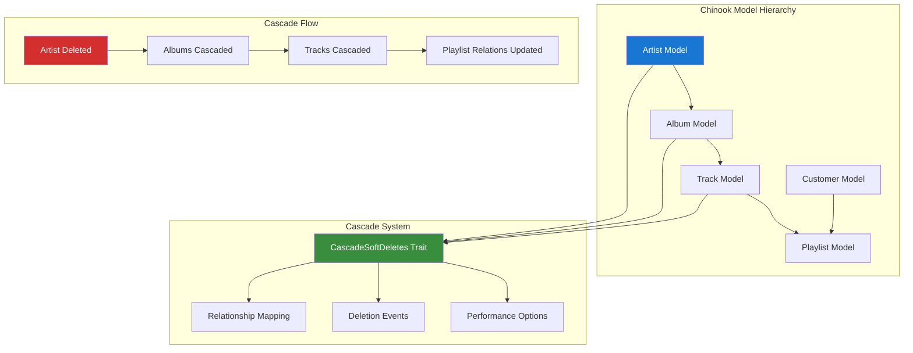

# 1. Dyrynda Laravel Cascade Soft Deletes Implementation Guide

> **Package:** `dyrynda/laravel-cascade-soft-deletes`  
> **Purpose:** Foundational cascading soft delete functionality for Eloquent model relationships  
> **GitHub:** [https://github.com/michaeldyrynda/laravel-cascade-soft-deletes](https://github.com/michaeldyrynda/laravel-cascade-soft-deletes)  
> **Author:** Michael Dyrynda  
> **License:** MIT

## Table of Contents

- [1. Overview](#1-overview)
- [2. Installation & Configuration](#2-installation--configuration)
- [3. Foundational Integration](#3-foundational-integration)
- [4. Chinook Project Integration](#4-chinook-project-integration)
- [5. Universal Model Availability](#5-universal-model-availability)
- [6. Advanced Cascading Patterns](#6-advanced-cascading-patterns)
- [7. Performance Optimization](#7-performance-optimization)
- [8. Relationship Mapping](#8-relationship-mapping)
- [9. Testing Strategies](#9-testing-strategies)
- [10. Best Practices](#10-best-practices)

## 1. Overview

The `dyrynda/laravel-cascade-soft-deletes` package provides foundational cascading soft delete functionality for Eloquent models. When a parent model is soft deleted, this package automatically soft deletes related child models, maintaining referential integrity while preserving the ability to restore the entire hierarchy.

### 1.1 Key Features

- **Automatic Cascade Deletion**: Soft delete related models when parent is deleted
- **Relationship Preservation**: Maintain model relationships during soft deletion
- **Restoration Capability**: Restore parent models without affecting cascaded children
- **Performance Optimized**: Configurable fetch methods (get, cursor, lazy, chunk)
- **Universal Integration**: Make functionality available to all models project-wide
- **Error Prevention**: Prevents deletion if relationships don't exist or aren't properly configured

### 1.2 Architecture Overview



### 1.3 Benefits for Chinook Project

**Data Integrity:**
- Maintain referential integrity during soft deletions
- Prevent orphaned records in the music catalog
- Preserve complete artist/album/track hierarchies

**Business Logic:**
- When an artist is deleted, all albums and tracks are also soft deleted
- When an album is deleted, all tracks are soft deleted
- Playlist relationships are maintained appropriately

**Performance:**
- Configurable fetch methods for large datasets
- Chunked processing for memory efficiency
- Event-driven architecture prevents cascading loops

## 2. Installation & Configuration

### 2.1 Package Installation

Install the package via Composer:

```bash
composer require dyrynda/laravel-cascade-soft-deletes
```

### 2.2 Basic Configuration

The package works immediately after installation with no additional configuration required. However, you can customize behavior through model properties.

### 2.3 Model Configuration Options

Configure cascade behavior in your models:

```php
<?php

namespace App\Models\Chinook;

use Dyrynda\Database\Support\CascadeSoftDeletes;
use Illuminate\Database\Eloquent\Model;
use Illuminate\Database\Eloquent\SoftDeletes;

class Artist extends Model
{
    use SoftDeletes, CascadeSoftDeletes;

    /**
     * Relationships to cascade soft delete
     */
    protected $cascadeDeletes = ['albums'];

    /**
     * Fetch method for cascade operations
     * Options: 'get', 'cursor', 'lazy', 'chunk'
     */
    protected $fetchMethod = 'chunk';

    /**
     * Chunk size when using chunk fetch method
     */
    protected $chunkSize = 100;

    // Model relationships and other code...
}
```

## 3. Foundational Integration

### 3.1 BaseModel Integration

Integrate the trait into the Chinook `BaseModel` for universal availability:

```php
<?php

declare(strict_types=1);

namespace App\Models\Chinook;

use Aliziodev\LaravelTaxonomy\Traits\HasTaxonomy;
use App\Traits\HasSecondaryUniqueKey;
use Dyrynda\Database\Support\CascadeSoftDeletes;
use Illuminate\Database\Eloquent\Factories\HasFactory;
use Illuminate\Database\Eloquent\Model;
use Illuminate\Database\Eloquent\SoftDeletes;
use Spatie\DeletedModels\Models\Concerns\KeepsDeletedModels;
use Spatie\Sluggable\HasSlug;
use Spatie\Sluggable\SlugOptions;
use Wildside\Userstamps\Userstamps;

abstract class BaseModel extends Model
{
    use HasFactory;
    use HasSecondaryUniqueKey;
    use HasSlug;
    use HasTaxonomy;
    use KeepsDeletedModels;
    use SoftDeletes;
    use CascadeSoftDeletes;  // Add cascade soft deletes
    use Userstamps;

    /**
     * Default cascade configuration
     */
    protected $cascadeDeletes = [];
    protected $fetchMethod = 'chunk';
    protected $chunkSize = 100;

    /**
     * Modern Laravel 12 casting using casts() method
     */
    protected function casts(): array
    {
        return [
            'created_at' => 'datetime',
            'updated_at' => 'datetime',
            'deleted_at' => 'datetime',
        ];
    }

    /**
     * Configure which attributes to keep when deleted
     */
    public function attributesToKeep(): array
    {
        $attributes = $this->toArray();
        unset($attributes['password'], $attributes['remember_token']);
        return $attributes;
    }

    /**
     * Configure slug generation from public_id
     */
    public function getSlugOptions(): SlugOptions
    {
        return SlugOptions::create()
            ->generateSlugsFrom('public_id')
            ->saveSlugsTo('slug')
            ->doNotGenerateSlugsOnUpdate();
    }

    /**
     * Configure secondary unique key generation
     */
    public function getSecondaryUniqueKeyOptions(): array
    {
        return [
            'field' => 'public_id',
            'type' => 'ulid',
        ];
    }
}
```

### 3.2 Service Provider Integration

Create a service provider for global cascade configuration:

```php
<?php

namespace App\Providers;

use Illuminate\Support\ServiceProvider;
use Illuminate\Database\Eloquent\Model;

class CascadeSoftDeletesServiceProvider extends ServiceProvider
{
    public function register(): void
    {
        // Register cascade configuration
    }

    public function boot(): void
    {
        // Global cascade soft delete event listeners
        Model::deleting(function (Model $model) {
            if (method_exists($model, 'getCascadeDeletes')) {
                activity()
                    ->performedOn($model)
                    ->causedBy(auth()->user())
                    ->withProperties([
                        'cascade_relationships' => $model->getCascadeDeletes(),
                        'fetch_method' => $model->getFetchMethod() ?? 'get',
                    ])
                    ->log('Model cascade soft delete initiated');
            }
        });

        Model::deleted(function (Model $model) {
            if (method_exists($model, 'getCascadeDeletes')) {
                activity()
                    ->performedOn($model)
                    ->causedBy(auth()->user())
                    ->log('Model cascade soft delete completed');
            }
        });
    }
}
```

Register the service provider in `config/app.php`:

```php
'providers' => [
    // Other providers...
    App\Providers\CascadeSoftDeletesServiceProvider::class,
],
```

## 4. Chinook Project Integration

### 4.1 Artist Model Implementation

Configure the Artist model with cascade relationships:

```php
<?php

declare(strict_types=1);

namespace App\Models\Chinook;

use Illuminate\Database\Eloquent\Relations\HasMany;

class Artist extends BaseModel
{
    protected $table = 'chinook_artists';

    /**
     * Cascade soft delete to albums (which will cascade to tracks)
     */
    protected $cascadeDeletes = ['albums'];
    
    /**
     * Use chunked processing for large artists with many albums
     */
    protected $fetchMethod = 'chunk';
    protected $chunkSize = 50;

    protected $fillable = [
        'name',
        'public_id',
        'slug',
        'bio',
        'website',
        'social_links',
        'country',
        'formed_year',
        'is_active',
    ];

    protected function casts(): array
    {
        return array_merge(parent::casts(), [
            'social_links' => 'array',
            'formed_year' => 'integer',
            'is_active' => 'boolean',
        ]);
    }

    /**
     * Artist has many albums
     */
    public function albums(): HasMany
    {
        return $this->hasMany(Album::class, 'artist_id');
    }

    /**
     * Artist has many tracks through albums
     */
    public function tracks()
    {
        return $this->hasManyThrough(Track::class, Album::class, 'artist_id', 'album_id');
    }

    /**
     * Get route key name for URL generation
     */
    public function getRouteKeyName(): string
    {
        return 'slug';
    }
}
```

### 4.2 Album Model Implementation

Configure the Album model to cascade to tracks:

```php
<?php

declare(strict_types=1);

namespace App\Models\Chinook;

use Illuminate\Database\Eloquent\Relations\BelongsTo;
use Illuminate\Database\Eloquent\Relations\HasMany;

class Album extends BaseModel
{
    protected $table = 'chinook_albums';

    /**
     * Cascade soft delete to tracks
     */
    protected $cascadeDeletes = ['tracks'];
    
    /**
     * Use cursor for memory-efficient processing
     */
    protected $fetchMethod = 'cursor';

    protected $fillable = [
        'title',
        'artist_id',
        'public_id',
        'slug',
        'release_date',
        'genre',
        'label',
        'total_tracks',
        'duration_seconds',
        'is_active',
    ];

    protected function casts(): array
    {
        return array_merge(parent::casts(), [
            'release_date' => 'date',
            'total_tracks' => 'integer',
            'duration_seconds' => 'integer',
            'is_active' => 'boolean',
        ]);
    }

    /**
     * Album belongs to an artist
     */
    public function artist(): BelongsTo
    {
        return $this->belongsTo(Artist::class, 'artist_id');
    }

    /**
     * Album has many tracks
     */
    public function tracks(): HasMany
    {
        return $this->hasMany(Track::class, 'album_id');
    }

    /**
     * Get route key name for URL generation
     */
    public function getRouteKeyName(): string
    {
        return 'slug';
    }
}
```

### 4.3 Track Model Implementation

Configure the Track model (end of cascade chain):

```php
<?php

declare(strict_types=1);

namespace App\Models\Chinook;

use Illuminate\Database\Eloquent\Relations\BelongsTo;
use Illuminate\Database\Eloquent\Relations\BelongsToMany;

class Track extends BaseModel
{
    protected $table = 'chinook_tracks';

    /**
     * Tracks don't cascade to other models in this hierarchy
     * But could cascade to related data like play history
     */
    protected $cascadeDeletes = [];
    
    protected $fillable = [
        'name',
        'album_id',
        'media_type_id',
        'genre_id',
        'composer',
        'milliseconds',
        'bytes',
        'unit_price',
        'public_id',
        'slug',
        'track_number',
        'disc_number',
        'is_active',
    ];

    protected function casts(): array
    {
        return array_merge(parent::casts(), [
            'milliseconds' => 'integer',
            'bytes' => 'integer',
            'unit_price' => 'decimal:2',
            'track_number' => 'integer',
            'disc_number' => 'integer',
            'is_active' => 'boolean',
        ]);
    }

    /**
     * Track belongs to an album
     */
    public function album(): BelongsTo
    {
        return $this->belongsTo(Album::class, 'album_id');
    }

    /**
     * Track belongs to many playlists
     */
    public function playlists(): BelongsToMany
    {
        return $this->belongsToMany(Playlist::class, 'playlist_track', 'track_id', 'playlist_id');
    }

    /**
     * Get route key name for URL generation
     */
    public function getRouteKeyName(): string
    {
        return 'slug';
    }
}
```

### 4.4 Usage Examples

**Cascading Deletion:**
```php
// Delete an artist - automatically cascades to albums and tracks
$artist = Artist::find(1);
$artist->delete();

// This will:
// 1. Soft delete the artist
// 2. Soft delete all albums belonging to the artist
// 3. Soft delete all tracks belonging to those albums
// 4. Maintain playlist relationships (tracks remain in playlists but are soft deleted)
```

**Restoration (Manual):**
```php
// Note: The package doesn't automatically restore cascaded models
// You need to handle restoration manually if needed

$artist = Artist::withTrashed()->find(1);
$artist->restore();

// Optionally restore related models
$artist->albums()->withTrashed()->restore();
$artist->albums()->withTrashed()->each(function ($album) {
    $album->tracks()->withTrashed()->restore();
});
```

**Checking Cascade Configuration:**
```php
// Check what relationships will be cascaded
$artist = new Artist();
$cascadeRelationships = $artist->getCascadeDeletes(); // ['albums']

// Check fetch method
$fetchMethod = $artist->getFetchMethod(); // 'chunk'
```

## 5. Universal Model Availability

### 5.1 Trait Auto-Loading Strategy

Create a universal trait that combines cascade functionality:

```php
<?php

namespace App\Traits;

use Dyrynda\Database\Support\CascadeSoftDeletes;
use Illuminate\Database\Eloquent\Model;

trait UniversalCascadeSoftDeletes
{
    use CascadeSoftDeletes;

    /**
     * Boot the trait for all models
     */
    public static function bootUniversalCascadeSoftDeletes(): void
    {
        // Add global cascade behavior
        static::deleting(function (Model $model) {
            // Log cascade initiation
            if (method_exists($model, 'getCascadeDeletes') && !empty($model->getCascadeDeletes())) {
                activity()
                    ->performedOn($model)
                    ->causedBy(auth()->user())
                    ->withProperties([
                        'cascade_relationships' => $model->getCascadeDeletes(),
                        'cascade_count' => $model->getCascadeCount(),
                    ])
                    ->log('Cascade soft delete initiated');
            }
        });

        static::deleted(function (Model $model) {
            // Log cascade completion
            if (method_exists($model, 'getCascadeDeletes') && !empty($model->getCascadeDeletes())) {
                activity()
                    ->performedOn($model)
                    ->causedBy(auth()->user())
                    ->log('Cascade soft delete completed');
            }
        });
    }

    /**
     * Get count of models that will be cascaded
     */
    public function getCascadeCount(): int
    {
        $count = 0;

        foreach ($this->getCascadeDeletes() as $relationship) {
            if (method_exists($this, $relationship)) {
                $count += $this->$relationship()->count();
            }
        }

        return $count;
    }

    /**
     * Get cascade preview for UI
     */
    public function getCascadePreview(): array
    {
        $preview = [];

        foreach ($this->getCascadeDeletes() as $relationship) {
            if (method_exists($this, $relationship)) {
                $related = $this->$relationship();
                $preview[$relationship] = [
                    'count' => $related->count(),
                    'model_class' => $related->getRelated()::class,
                    'sample_records' => $related->limit(3)->pluck('name', 'id')->toArray(),
                ];
            }
        }

        return $preview;
    }

    /**
     * Safe cascade delete with confirmation
     */
    public function cascadeDeleteWithConfirmation(bool $confirmed = false): bool
    {
        if (!$confirmed) {
            $cascadeCount = $this->getCascadeCount();
            if ($cascadeCount > 0) {
                throw new \Exception(
                    "This action will cascade delete {$cascadeCount} related records. " .
                    "Call with confirmed=true to proceed."
                );
            }
        }

        return $this->delete();
    }
}
```

### 5.2 Configuration Service

Create a service to manage cascade configurations:

```php
<?php

namespace App\Services;

use Illuminate\Support\Collection;
use Illuminate\Database\Eloquent\Model;

class CascadeConfigurationService
{
    /**
     * Get all models with cascade configurations
     */
    public function getModelsWithCascades(): Collection
    {
        $models = collect();

        // Scan all Chinook models
        $modelPath = app_path('Models/Chinook');
        $modelFiles = glob($modelPath . '/*.php');

        foreach ($modelFiles as $file) {
            $className = 'App\\Models\\Chinook\\' . basename($file, '.php');

            if (class_exists($className)) {
                $model = new $className();

                if (method_exists($model, 'getCascadeDeletes') && !empty($model->getCascadeDeletes())) {
                    $models->push([
                        'class' => $className,
                        'table' => $model->getTable(),
                        'cascades' => $model->getCascadeDeletes(),
                        'fetch_method' => $model->getFetchMethod() ?? 'get',
                        'chunk_size' => property_exists($model, 'chunkSize') ? $model->chunkSize : null,
                    ]);
                }
            }
        }

        return $models;
    }

    /**
     * Validate cascade configurations
     */
    public function validateCascadeConfigurations(): array
    {
        $issues = [];
        $models = $this->getModelsWithCascades();

        foreach ($models as $modelConfig) {
            $model = new $modelConfig['class']();

            foreach ($modelConfig['cascades'] as $relationship) {
                // Check if relationship method exists
                if (!method_exists($model, $relationship)) {
                    $issues[] = [
                        'model' => $modelConfig['class'],
                        'issue' => "Relationship method '{$relationship}' does not exist",
                        'severity' => 'error',
                    ];
                    continue;
                }

                // Check if relationship returns proper relation
                try {
                    $relation = $model->$relationship();
                    if (!$relation instanceof \Illuminate\Database\Eloquent\Relations\Relation) {
                        $issues[] = [
                            'model' => $modelConfig['class'],
                            'issue' => "Method '{$relationship}' does not return a valid Eloquent relation",
                            'severity' => 'error',
                        ];
                    }
                } catch (\Exception $e) {
                    $issues[] = [
                        'model' => $modelConfig['class'],
                        'issue' => "Error accessing relationship '{$relationship}': " . $e->getMessage(),
                        'severity' => 'warning',
                    ];
                }
            }
        }

        return $issues;
    }

    /**
     * Get cascade hierarchy map
     */
    public function getCascadeHierarchy(): array
    {
        $hierarchy = [];
        $models = $this->getModelsWithCascades();

        foreach ($models as $modelConfig) {
            $hierarchy[$modelConfig['class']] = [
                'cascades_to' => $modelConfig['cascades'],
                'cascaded_by' => $this->findParentCascades($modelConfig['class']),
            ];
        }

        return $hierarchy;
    }

    private function findParentCascades(string $targetClass): array
    {
        $parents = [];
        $models = $this->getModelsWithCascades();

        foreach ($models as $modelConfig) {
            $model = new $modelConfig['class']();

            foreach ($modelConfig['cascades'] as $relationship) {
                if (method_exists($model, $relationship)) {
                    $relation = $model->$relationship();
                    $relatedClass = get_class($relation->getRelated());

                    if ($relatedClass === $targetClass) {
                        $parents[] = $modelConfig['class'];
                    }
                }
            }
        }

        return $parents;
    }
}
```

## 6. Advanced Cascading Patterns

### 6.1 Conditional Cascading

Implement conditional cascade logic:

```php
<?php

namespace App\Models\Chinook;

class Artist extends BaseModel
{
    protected $cascadeDeletes = ['albums'];

    /**
     * Override cascade behavior with conditions
     */
    protected function performDeleteOnModel(): void
    {
        // Only cascade if artist has been inactive for more than 30 days
        if ($this->is_active || $this->updated_at->gt(now()->subDays(30))) {
            // Don't cascade for recently active artists
            $originalCascades = $this->cascadeDeletes;
            $this->cascadeDeletes = [];

            parent::performDeleteOnModel();

            // Restore original cascade configuration
            $this->cascadeDeletes = $originalCascades;
        } else {
            parent::performDeleteOnModel();
        }
    }
}
```

### 6.2 Custom Cascade Logic

Implement custom cascade behavior:

```php
<?php

namespace App\Models\Chinook;

class Album extends BaseModel
{
    protected $cascadeDeletes = ['tracks'];

    /**
     * Custom cascade logic for albums
     */
    protected function performDeleteOnModel(): void
    {
        // Before cascading, update playlist relationships
        $this->tracks->each(function ($track) {
            // Remove from active playlists but keep in archived playlists
            $track->playlists()
                ->wherePivot('is_active', true)
                ->updateExistingPivot($track->id, ['is_active' => false]);
        });

        // Log detailed cascade information
        activity()
            ->performedOn($this)
            ->causedBy(auth()->user())
            ->withProperties([
                'tracks_to_cascade' => $this->tracks->count(),
                'playlist_relationships_updated' => $this->tracks->sum(function ($track) {
                    return $track->playlists()->count();
                }),
            ])
            ->log('Album deletion with custom cascade logic');

        parent::performDeleteOnModel();
    }
}
```

### 6.3 Batch Cascade Operations

Implement efficient batch cascading:

```php
<?php

namespace App\Services;

use Illuminate\Database\Eloquent\Collection;
use Illuminate\Support\Facades\DB;

class BatchCascadeService
{
    /**
     * Batch delete multiple models with cascading
     */
    public function batchCascadeDelete(Collection $models): array
    {
        $results = [];

        DB::transaction(function () use ($models, &$results) {
            foreach ($models as $model) {
                try {
                    $cascadeCount = $model->getCascadeCount();
                    $model->delete();

                    $results[] = [
                        'model' => get_class($model),
                        'id' => $model->getKey(),
                        'status' => 'success',
                        'cascaded_count' => $cascadeCount,
                    ];
                } catch (\Exception $e) {
                    $results[] = [
                        'model' => get_class($model),
                        'id' => $model->getKey(),
                        'status' => 'error',
                        'error' => $e->getMessage(),
                    ];
                }
            }
        });

        return $results;
    }

    /**
     * Preview batch cascade operations
     */
    public function previewBatchCascade(Collection $models): array
    {
        $preview = [];

        foreach ($models as $model) {
            $preview[] = [
                'model' => get_class($model),
                'id' => $model->getKey(),
                'name' => $model->name ?? $model->title ?? "ID: {$model->getKey()}",
                'cascade_preview' => $model->getCascadePreview(),
                'total_cascade_count' => $model->getCascadeCount(),
            ];
        }

        return $preview;
    }
}
```

## 7. Performance Optimization

### 7.1 Fetch Method Configuration

Optimize cascade performance based on data size:

```php
<?php

namespace App\Models\Chinook;

class Artist extends BaseModel
{
    protected $cascadeDeletes = ['albums'];

    /**
     * Dynamic fetch method based on album count
     */
    public function getFetchMethod(): string
    {
        $albumCount = $this->albums()->count();

        if ($albumCount > 1000) {
            return 'chunk';
        } elseif ($albumCount > 100) {
            return 'cursor';
        } else {
            return 'get';
        }
    }

    /**
     * Dynamic chunk size based on memory constraints
     */
    public function getChunkSize(): int
    {
        $memoryLimit = ini_get('memory_limit');
        $memoryLimitBytes = $this->convertToBytes($memoryLimit);

        // Adjust chunk size based on available memory
        if ($memoryLimitBytes > 512 * 1024 * 1024) { // > 512MB
            return 200;
        } elseif ($memoryLimitBytes > 256 * 1024 * 1024) { // > 256MB
            return 100;
        } else {
            return 50;
        }
    }

    private function convertToBytes(string $value): int
    {
        $unit = strtolower(substr($value, -1));
        $value = (int) $value;

        switch ($unit) {
            case 'g': return $value * 1024 * 1024 * 1024;
            case 'm': return $value * 1024 * 1024;
            case 'k': return $value * 1024;
            default: return $value;
        }
    }
}
```

### 7.2 Database Optimization

Optimize database queries for cascade operations:

```php
<?php

use Illuminate\Database\Migrations\Migration;
use Illuminate\Database\Schema\Blueprint;
use Illuminate\Support\Facades\Schema;

return new class extends Migration
{
    public function up(): void
    {
        // Add indexes to support cascade operations
        Schema::table('chinook_albums', function (Blueprint $table) {
            $table->index(['artist_id', 'deleted_at']);
        });

        Schema::table('chinook_tracks', function (Blueprint $table) {
            $table->index(['album_id', 'deleted_at']);
        });

        // Composite indexes for common cascade queries
        Schema::table('chinook_artists', function (Blueprint $table) {
            $table->index(['is_active', 'updated_at', 'deleted_at']);
        });
    }

    public function down(): void
    {
        Schema::table('chinook_albums', function (Blueprint $table) {
            $table->dropIndex(['artist_id', 'deleted_at']);
        });

        Schema::table('chinook_tracks', function (Blueprint $table) {
            $table->dropIndex(['album_id', 'deleted_at']);
        });

        Schema::table('chinook_artists', function (Blueprint $table) {
            $table->dropIndex(['is_active', 'updated_at', 'deleted_at']);
        });
    }
};
```

## 8. Relationship Mapping

### 8.1 Chinook Cascade Hierarchy

The Chinook project implements the following cascade hierarchy:

```
Artist (root)
├── Albums (cascades from Artist)
│   └── Tracks (cascades from Album)
│       └── Playlist Relations (updated, not cascaded)
├── Customer (independent)
│   └── Invoices (cascades from Customer)
│       └── Invoice Lines (cascades from Invoice)
└── Employee (independent)
    └── Customer Support Relations (updated, not cascaded)
```

### 8.2 Cascade Configuration Map

```php
<?php

// Cascade configuration for all Chinook models
return [
    'App\Models\Chinook\Artist' => [
        'cascades' => ['albums'],
        'fetch_method' => 'chunk',
        'chunk_size' => 50,
        'description' => 'Cascades to albums, which cascade to tracks',
    ],

    'App\Models\Chinook\Album' => [
        'cascades' => ['tracks'],
        'fetch_method' => 'cursor',
        'chunk_size' => null,
        'description' => 'Cascades to tracks, updates playlist relations',
    ],

    'App\Models\Chinook\Track' => [
        'cascades' => [],
        'fetch_method' => 'get',
        'chunk_size' => null,
        'description' => 'End of cascade chain, updates playlist pivot tables',
    ],

    'App\Models\Chinook\Customer' => [
        'cascades' => ['invoices'],
        'fetch_method' => 'chunk',
        'chunk_size' => 100,
        'description' => 'Cascades to invoices and invoice lines',
    ],

    'App\Models\Chinook\Invoice' => [
        'cascades' => ['invoiceLines'],
        'fetch_method' => 'get',
        'chunk_size' => null,
        'description' => 'Cascades to invoice lines',
    ],
];
```

## 9. Testing Strategies

### 9.1 Feature Tests

Create comprehensive tests for cascade functionality:

```php
<?php

namespace Tests\Feature;

use App\Models\Chinook\Album;use App\Models\Chinook\Artist;use App\Models\Chinook\Track;use Illuminate\Foundation\Testing\RefreshDatabase;use old\TestCase;

class CascadeSoftDeletesTest extends TestCase
{
    use RefreshDatabase;

    public function test_artist_deletion_cascades_to_albums_and_tracks(): void
    {
        $artist = Artist::factory()->create();
        $album = Album::factory()->for($artist)->create();
        $track = Track::factory()->for($album)->create();

        $this->assertDatabaseHas('chinook_artists', ['id' => $artist->id]);
        $this->assertDatabaseHas('chinook_albums', ['id' => $album->id]);
        $this->assertDatabaseHas('chinook_tracks', ['id' => $track->id]);

        $artist->delete();

        // All should be soft deleted
        $this->assertSoftDeleted('chinook_artists', ['id' => $artist->id]);
        $this->assertSoftDeleted('chinook_albums', ['id' => $album->id]);
        $this->assertSoftDeleted('chinook_tracks', ['id' => $track->id]);
    }

    public function test_album_deletion_cascades_to_tracks_only(): void
    {
        $artist = Artist::factory()->create();
        $album = Album::factory()->for($artist)->create();
        $track = Track::factory()->for($album)->create();

        $album->delete();

        // Artist should remain active
        $this->assertDatabaseHas('chinook_artists', [
            'id' => $artist->id,
            'deleted_at' => null,
        ]);

        // Album and track should be soft deleted
        $this->assertSoftDeleted('chinook_albums', ['id' => $album->id]);
        $this->assertSoftDeleted('chinook_tracks', ['id' => $track->id]);
    }

    public function test_cascade_count_calculation(): void
    {
        $artist = Artist::factory()->create();
        $albums = Album::factory()->count(3)->for($artist)->create();

        foreach ($albums as $album) {
            Track::factory()->count(5)->for($album)->create();
        }

        // Artist should cascade to 3 albums
        $this->assertEquals(3, $artist->getCascadeCount());

        // Each album should cascade to 5 tracks
        foreach ($albums as $album) {
            $this->assertEquals(5, $album->getCascadeCount());
        }
    }

    public function test_cascade_preview_generation(): void
    {
        $artist = Artist::factory()->create(['name' => 'Test Artist']);
        $album = Album::factory()->for($artist)->create(['title' => 'Test Album']);
        Track::factory()->count(3)->for($album)->create();

        $preview = $artist->getCascadePreview();

        $this->assertArrayHasKey('albums', $preview);
        $this->assertEquals(1, $preview['albums']['count']);
        $this->assertEquals(Album::class, $preview['albums']['model_class']);
        $this->assertArrayHasKey($album->id, $preview['albums']['sample_records']);
    }

    public function test_safe_cascade_delete_with_confirmation(): void
    {
        $artist = Artist::factory()->create();
        Album::factory()->count(2)->for($artist)->create();

        // Should throw exception without confirmation
        $this->expectException(\Exception::class);
        $this->expectExceptionMessage('This action will cascade delete 2 related records');

        $artist->cascadeDeleteWithConfirmation(false);

        // Should succeed with confirmation
        $result = $artist->cascadeDeleteWithConfirmation(true);
        $this->assertTrue($result);
        $this->assertSoftDeleted('chinook_artists', ['id' => $artist->id]);
    }
}
```

## 10. Best Practices

### 10.1 Implementation Guidelines

**Universal Integration:**
- Always extend `BaseModel` to ensure consistent cascade behavior
- Configure appropriate fetch methods based on expected data volumes
- Use chunked processing for models with large relationship sets

**Performance Considerations:**
- Index foreign key columns with `deleted_at` for efficient cascade queries
- Use cursor-based fetching for memory-efficient processing
- Monitor cascade operation performance and adjust chunk sizes accordingly

**Error Handling:**
- Validate cascade configurations during deployment
- Implement proper exception handling for cascade failures
- Log cascade operations for debugging and monitoring

**Business Logic:**
- Document cascade relationships clearly in model comments
- Consider conditional cascading for complex business rules
- Implement preview functionality for user confirmation

### 10.2 Integration with Other Packages

**Activity Logging Integration:**
```php
// Log cascade operations
static::deleting(function ($model) {
    if (!empty($model->getCascadeDeletes())) {
        activity()
            ->performedOn($model)
            ->causedBy(auth()->user())
            ->withProperties([
                'cascade_relationships' => $model->getCascadeDeletes(),
                'cascade_count' => $model->getCascadeCount(),
            ])
            ->log('Cascade soft delete initiated');
    }
});
```

**Deleted Models Integration:**
```php
// Both packages work together seamlessly
// CascadeSoftDeletes handles the cascading
// KeepsDeletedModels preserves the deleted data
class BaseModel extends Model
{
    use SoftDeletes;
    use CascadeSoftDeletes;
    use KeepsDeletedModels;
}
```

### 10.3 Monitoring and Maintenance

**Health Checks:**
- Validate cascade configurations regularly
- Monitor cascade operation performance
- Check for orphaned records that should have been cascaded

**Documentation:**
- Maintain up-to-date cascade hierarchy documentation
- Document any custom cascade logic
- Provide clear examples for team members

---

## Navigation

**Previous:** [Spatie Laravel Deleted Models Guide](350-spatie-laravel-deleted-models-guide.md) | **Next:** [Package Index](000-packages-index.md)

---

**Documentation Standards**: This document follows WCAG 2.1 AA accessibility guidelines and uses Laravel 12 modern syntax patterns.

**Source Attribution**:
- Package: [dyrynda/laravel-cascade-soft-deletes](https://github.com/michaeldyrynda/laravel-cascade-soft-deletes)
- Author: Michael Dyrynda
- Laravel Documentation: [Eloquent Soft Deleting](https://laravel.com/docs/12.x/eloquent#soft-deleting)

[⬆️ Back to Top](#1-dyrynda-laravel-cascade-soft-deletes-implementation-guide)
```
